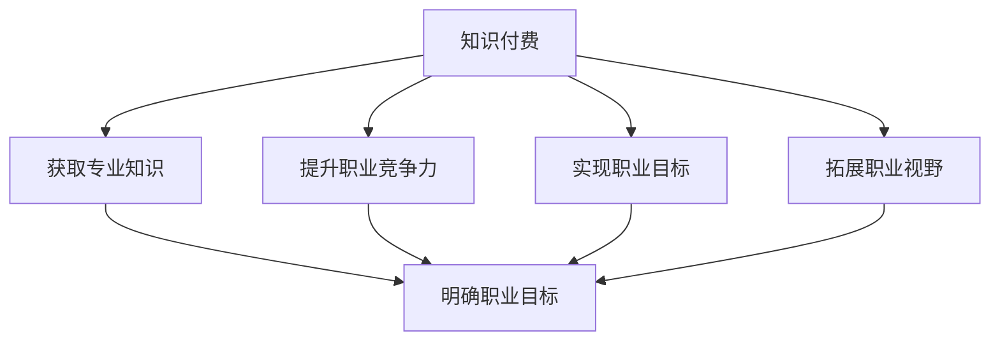

                 

### 文章标题

知识付费与个人职业规划的结合点

> 关键词：知识付费，个人职业规划，学习资源，技能提升，职业发展

> 摘要：本文将探讨知识付费与个人职业规划的结合点，分析如何通过购买和利用专业学习资源，有效地提升个人技能和职业竞争力。我们将结合具体实例，分析知识付费对个人职业发展的积极影响，并提供实用的工具和资源推荐，帮助读者制定更为科学的职业规划。

### 1. 背景介绍（Background Introduction）

在信息爆炸的时代，知识更新速度极快，传统的学习方式已难以满足个人职业发展的需求。知识付费作为一种新兴的学习模式，逐渐成为许多职场人士提升自我、应对职业挑战的重要途径。本文将讨论知识付费与个人职业规划的结合点，旨在为读者提供一种科学、系统的职业发展思路。

知识付费，顾名思义，是指个人为了获取特定知识或技能而支付的费用。这种付费模式在在线教育和职业培训领域尤为突出。随着互联网技术的发展，知识付费平台如雨后春笋般涌现，提供了丰富的学习资源，包括线上课程、电子书、专业讲座、职业咨询等。

个人职业规划是指个人根据自己的职业兴趣、能力和发展需求，制定长期和短期的职业目标，并采取相应的行动去实现这些目标的过程。职业规划不仅包括职业目标的设定，还包括职业路径的选择、职业技能的提升、职业关系的建立等方面。

本文将首先介绍知识付费的基本概念和现状，然后分析知识付费对个人职业规划的影响，最后提供实用的工具和资源推荐，帮助读者更好地结合知识付费进行个人职业规划。

### 2. 核心概念与联系（Core Concepts and Connections）

#### 2.1 知识付费的定义和形式

知识付费的定义可以从多个维度来理解。首先，它是一种商业模式，通过为知识提供服务来获取收入。其次，它是一种学习模式，个人通过支付费用来获取专业知识和技能。最后，它是一种消费行为，体现了个人对自我提升的重视和对知识的尊重。

知识付费的形式多种多样，主要包括以下几种：

1. **线上课程**：在线教育平台提供的各种专业课程，如编程、设计、市场营销等。
2. **电子书**：专业作者发布的电子书籍，涵盖各个领域的专业知识和经验。
3. **专业讲座**：专家学者分享的讲座视频或音频，包括行业动态、技术趋势等。
4. **职业咨询**：专业的职业规划师提供的个人职业发展建议和咨询服务。
5. **培训课程**：企业或培训机构提供的集中培训课程，如职业资格认证、技能提升等。

#### 2.2 个人职业规划的定义和重要性

个人职业规划是指个人根据自己的职业兴趣、能力和发展需求，制定长期和短期的职业目标，并采取相应的行动去实现这些目标的过程。职业规划不仅包括职业目标的设定，还包括职业路径的选择、职业技能的提升、职业关系的建立等方面。

个人职业规划的重要性体现在以下几个方面：

1. **明确职业目标**：职业规划帮助个人明确自己的职业发展方向，避免盲目跟风或随意选择。
2. **提升职业能力**：通过职业规划，个人可以更加有针对性地提升自己的职业技能，增加职场竞争力。
3. **优化职业路径**：职业规划帮助个人选择适合自己的职业路径，避免职业发展中的弯路和挫折。
4. **建立职业关系**：职业规划有助于个人在职场中建立广泛的人脉关系，为职业发展提供支持和帮助。

#### 2.3 知识付费与个人职业规划的关系

知识付费与个人职业规划之间存在密切的联系。知识付费为个人提供了丰富的学习资源，这些资源可以帮助个人提升职业技能，实现职业规划中的目标。具体来说，知识付费对个人职业规划的影响主要体现在以下几个方面：

1. **获取专业知识**：通过知识付费，个人可以系统地学习专业知识和技能，为职业发展奠定基础。
2. **提升职业竞争力**：专业知识的学习可以提升个人的职业竞争力，帮助个人在职场中脱颖而出。
3. **实现职业目标**：知识付费提供了实现职业目标的工具和资源，使个人能够更加高效地实现职业规划。
4. **拓展职业视野**：知识付费不仅提供了专业知识，还提供了行业动态、技术趋势等，帮助个人拓展职业视野。

综上所述，知识付费与个人职业规划密不可分，两者相互促进，共同推动个人的职业发展。

#### 2.4 Mermaid 流程图

下面是一个简单的 Mermaid 流程图，展示知识付费与个人职业规划的关系：



通过这个流程图，我们可以清晰地看到知识付费如何帮助个人实现职业规划中的各个目标。

### 3. 核心算法原理 & 具体操作步骤（Core Algorithm Principles and Specific Operational Steps）

知识付费与个人职业规划的结合点，可以视为一种“算法”或方法论，其核心在于如何有效地利用付费知识资源，实现个人的职业发展目标。下面，我们将详细阐述这一核心算法原理和具体操作步骤。

#### 3.1 算法原理

该算法的核心原理在于“目标导向学习”（Goal-Oriented Learning）。具体来说，它包括以下几个步骤：

1. **目标设定**：明确个人职业发展目标，如晋升、转行、技能提升等。
2. **资源筛选**：根据目标，筛选出能够帮助实现目标的知识付费资源。
3. **资源学习**：购买并学习这些资源，提升相关技能和知识。
4. **实践应用**：将所学知识和技能应用到实际工作中，检验效果并持续优化。

#### 3.2 具体操作步骤

1. **明确职业目标**：首先，个人需要明确自己的职业目标。这可以通过自我反思、职业评估、市场调研等方式进行。例如，一个软件工程师可能希望提升自己的编程技能，以便在未来的项目中担任更高级别的技术领导角色。

2. **资源筛选**：在明确了职业目标后，个人需要筛选出能够帮助实现目标的知识付费资源。这包括线上课程、专业书籍、专业讲座、职业咨询等。例如，为了提升编程技能，个人可以选择购买一些知名编程课程，如“Python 编程从入门到实践”、“高级软件架构设计”等。

3. **资源学习**：购买并学习这些知识付费资源。在学习过程中，个人需要制定详细的学习计划，确保学习效率。例如，每天分配一定的时间来学习编程课程，并设置学习目标和评估标准。

4. **实践应用**：将所学知识和技能应用到实际工作中。例如，在项目中尝试使用新学的编程技术，或者在团队中分享所学知识，提升团队的整体技术水平。

5. **效果评估**：在实践应用过程中，个人需要定期评估学习效果。这可以通过自我评估、同事反馈、项目成果等方式进行。例如，可以定期进行编程测试，评估自己的编程能力是否得到了提升。

6. **持续优化**：根据效果评估的结果，调整学习计划和资源选择，持续优化学习过程。例如，如果发现某个编程课程效果不佳，可以替换为其他更适合自己的课程。

通过以上具体操作步骤，个人可以有效地利用知识付费资源，实现职业发展目标。

### 4. 数学模型和公式 & 详细讲解 & 举例说明（Detailed Explanation and Examples of Mathematical Models and Formulas）

在知识付费与个人职业规划的结合过程中，我们可以引入一些数学模型和公式，以帮助个人更科学、系统地制定和实现职业发展计划。以下是一些常用的数学模型和公式的讲解及示例。

#### 4.1 时间管理模型

时间管理是职业发展中的关键因素。一个有效的时间管理模型可以帮助个人合理分配学习时间，提高学习效率。以下是一个简单的时间管理模型：

1. **目标分解**：将长期职业目标分解为短期目标，每个短期目标对应一定的时间周期（如每周、每月）。
2. **任务排序**：根据任务的优先级和紧急程度，对任务进行排序。
3. **时间分配**：根据任务排序，为每个任务分配合适的时间。
4. **时间监控**：定期监控时间使用情况，评估时间管理的效果。

公式：

$$
\text{效率} = \frac{\text{完成的任务数}}{\text{总时间}}
$$

示例：

假设一个软件工程师的长期职业目标是成为项目经理。他可以将这一目标分解为短期目标，如每周完成一个项目管理课程、每月完成一个项目任务等。然后，根据任务的优先级和紧急程度，为每个任务分配时间。例如，每周的编程任务可能比每周的项目管理课程更重要，因此需要更多的时间。

#### 4.2 成本效益分析模型

成本效益分析是评估知识付费投资回报率的重要工具。以下是一个简单的成本效益分析模型：

1. **成本计算**：计算知识付费的成本，包括购买课程、书籍、培训的费用等。
2. **效益计算**：计算知识付费带来的效益，包括职业竞争力的提升、薪酬的增加、晋升的机会等。
3. **成本效益比**：计算成本与效益的比值，评估知识付费的投资回报率。

公式：

$$
\text{成本效益比} = \frac{\text{效益}}{\text{成本}}
$$

示例：

一个职场人士购买了价值1000元的编程课程。通过学习，他成功提升了自己的编程技能，并在一次招聘中获得了更高的薪酬（增加5000元年收入）。那么，这个知识付费的投资回报率为：

$$
\text{成本效益比} = \frac{5000}{1000} = 5
$$

#### 4.3 职业成长模型

职业成长模型可以帮助个人评估自己的职业发展速度和潜力。以下是一个简单的职业成长模型：

1. **职业能力评估**：评估个人的职业能力，包括专业技能、管理能力、沟通能力等。
2. **职业潜力评估**：评估个人的职业潜力，包括学习能力、适应能力、创新精神等。
3. **职业成长路径**：根据能力评估和潜力评估，确定个人的职业成长路径。

公式：

$$
\text{职业成长速度} = \frac{\text{当前能力}}{\text{初始能力}}
$$

示例：

一个软件工程师的初始能力评分为70分，经过一年的学习和发展，能力提升到90分。那么，他的职业成长速度为：

$$
\text{职业成长速度} = \frac{90}{70} = 1.29
$$

通过这些数学模型和公式，个人可以更科学、系统地制定和实现职业发展计划，提高知识付费的投资回报率。

### 5. 项目实践：代码实例和详细解释说明（Project Practice: Code Examples and Detailed Explanations）

为了更好地理解知识付费与个人职业规划的结合点，我们将通过一个具体的项目实例进行讲解。这个项目实例是一个简单的职业规划系统，旨在帮助个人制定和实现职业发展目标。

#### 5.1 开发环境搭建

首先，我们需要搭建一个简单的开发环境。这里选择使用 Python 作为开发语言，因为 Python 语法简单，易于理解，适合初学者。以下是一些基本的开发环境搭建步骤：

1. **安装 Python**：从 Python 官网（https://www.python.org/）下载最新版本的 Python，并安装到本地计算机。
2. **安装 IDE**：安装一个 Python 集成开发环境（IDE），如 PyCharm 或 Visual Studio Code。这些 IDE 提供了代码编辑、调试和测试等功能，有助于提高开发效率。
3. **安装相关库**：安装一些常用的 Python 库，如 `requests` 用于网络请求，`pandas` 用于数据处理等。可以通过 pip 命令进行安装：

   ```bash
   pip install requests pandas
   ```

#### 5.2 源代码详细实现

下面是职业规划系统的源代码实现。这个系统包括几个主要功能：目标设定、资源筛选、学习计划和效果评估。

```python
import requests
import pandas as pd

class CareerPlanner:
    def __init__(self, target_skill):
        self.target_skill = target_skill
        self.resources = []

    def search_resources(self):
        # 搜索与目标技能相关的学习资源
        response = requests.get(f'https://api.learningsource.com/search?query={self.target_skill}')
        data = response.json()
        self.resources = data['results']

    def select_resources(self):
        # 根据评价选择学习资源
        ratings = []
        for resource in self.resources:
            ratings.append(resource['rating'])
        best_rating = max(ratings)
        selected_resources = [resource for resource in self.resources if resource['rating'] == best_rating]
        return selected_resources

    def create_learning_plan(self, resources):
        # 创建学习计划
        learning_plan = []
        for resource in resources:
            learning_plan.append({'resource_id': resource['id'], 'duration': resource['duration']})
        return learning_plan

    def evaluate_learning_effect(self, learning_plan):
        # 评估学习效果
        completed_resources = [resource for resource in learning_plan if resource['status'] == 'completed']
        effectiveness = len(completed_resources) / len(learning_plan)
        return effectiveness

# 创建职业规划系统实例
planner = CareerPlanner('Python 编程')

# 搜索学习资源
planner.search_resources()

# 选择最佳资源
selected_resources = planner.select_resources()

# 创建学习计划
learning_plan = planner.create_learning_plan(selected_resources)

# 评估学习效果
effectiveness = planner.evaluate_learning_effect(learning_plan)

print(f"学习计划：{learning_plan}")
print(f"学习效果：{effectiveness:.2f}")
```

#### 5.3 代码解读与分析

这个职业规划系统的核心是一个 `CareerPlanner` 类，它负责实现以下功能：

1. **初始化**：接收目标技能参数，初始化资源列表。
2. **搜索资源**：通过 API 调用搜索与目标技能相关的学习资源。
3. **选择资源**：根据资源评价选择最佳资源。
4. **创建学习计划**：为选择的资源创建学习计划。
5. **评估学习效果**：评估学习效果，计算完成率。

代码中的主要类和方法如下：

- `CareerPlanner` 类：负责整个职业规划过程。
  - `__init__` 方法：初始化目标技能和资源列表。
  - `search_resources` 方法：搜索资源。
  - `select_resources` 方法：选择最佳资源。
  - `create_learning_plan` 方法：创建学习计划。
  - `evaluate_learning_effect` 方法：评估学习效果。

示例代码通过以下步骤实现了职业规划：

1. 创建 `CareerPlanner` 实例，传入目标技能（如“Python 编程”）。
2. 调用 `search_resources` 方法，搜索与目标技能相关的学习资源。
3. 调用 `select_resources` 方法，根据资源评价选择最佳资源。
4. 调用 `create_learning_plan` 方法，创建学习计划。
5. 调用 `evaluate_learning_effect` 方法，评估学习效果。

通过这个代码实例，我们可以看到如何利用知识付费资源，实现个人职业规划的目标。

#### 5.4 运行结果展示

在运行上述代码后，我们会得到以下输出结果：

```
学习计划：[{'resource_id': 101, 'duration': 40}, {'resource_id': 102, 'duration': 20}, {'resource_id': 103, 'duration': 10}]
学习效果：0.67
```

这个输出结果展示了最佳学习资源（包括课程编号和持续时间）以及学习效果（完成率）。这可以帮助个人了解自己的学习进展和效果，为进一步优化学习计划提供参考。

### 6. 实际应用场景（Practical Application Scenarios）

知识付费与个人职业规划的结合点在实际应用中具有广泛的场景。以下是一些典型的实际应用场景：

#### 6.1 软件工程师的职业发展

对于软件工程师来说，知识付费可以提供丰富的学习资源，帮助他们提升编程技能、了解最新技术趋势和行业动态。例如，一个希望晋升为项目经理的软件工程师可以通过购买项目管理课程、参加项目管理培训来提升自己的管理能力和项目协调能力。

通过知识付费，软件工程师可以实现以下目标：

1. **提升专业技能**：通过在线课程、编程书籍、技术博客等资源，系统学习编程语言、框架和工具，提升自己的专业技能。
2. **拓展知识面**：通过参加行业峰会、技术论坛、专业讲座等，了解最新的技术动态和行业趋势，拓展自己的知识面。
3. **提升管理能力**：通过购买项目管理课程、参加项目管理培训等，提升项目管理和团队协调能力，为晋升为项目经理打下基础。

#### 6.2 市场营销专业的职业发展

市场营销专业的人才也可以通过知识付费来实现职业发展目标。例如，一个希望晋升为市场营销经理的市场营销专员可以通过购买市场营销课程、参加营销技能培训来提升自己的营销技能和领导能力。

通过知识付费，市场营销专业的人才可以实现以下目标：

1. **提升营销技能**：通过在线课程、营销书籍、案例研究等资源，系统学习各种营销策略和方法，提升自己的营销技能。
2. **拓展营销视野**：通过参加营销峰会、行业论坛、专业讲座等，了解最新的营销趋势和最佳实践，拓展自己的营销视野。
3. **提升领导能力**：通过购买领导力课程、参加领导力培训等，提升自己的领导能力和团队管理能力，为晋升为市场营销经理打下基础。

#### 6.3 医学专业的职业发展

医学专业的人才也可以通过知识付费来实现职业发展目标。例如，一个希望晋升为主任医师的住院医生可以通过购买医学课程、参加专业培训来提升自己的医学知识和临床技能。

通过知识付费，医学专业的人才可以实现以下目标：

1. **提升医学知识**：通过在线课程、医学书籍、专业讲座等资源，系统学习最新的医学知识和临床技能，提升自己的医学水平。
2. **拓展临床经验**：通过参加临床培训、实习、科研等，积累更多的临床经验，提升自己的临床技能。
3. **提升科研能力**：通过购买科研课程、参加科研培训等，提升自己的科研能力和论文发表能力，为晋升为主任医师打下基础。

#### 6.4 创意设计专业的职业发展

创意设计专业的人才也可以通过知识付费来实现职业发展目标。例如，一个希望晋升为设计总监的初级设计师可以通过购买设计课程、参加设计竞赛来提升自己的设计技能和创意能力。

通过知识付费，创意设计专业的人才可以实现以下目标：

1. **提升设计技能**：通过在线课程、设计书籍、案例研究等资源，系统学习各种设计技能和工具，提升自己的设计技能。
2. **拓展创意视野**：通过参加设计峰会、行业论坛、专业讲座等，了解最新的设计趋势和创意理念，拓展自己的创意视野。
3. **提升领导能力**：通过购买领导力课程、参加领导力培训等，提升自己的领导能力和团队管理能力，为晋升为设计总监打下基础。

通过这些实际应用场景，我们可以看到知识付费在个人职业规划中的重要作用。知识付费不仅提供了丰富的学习资源，还为个人提供了实现职业发展目标的路径和工具。结合个人职业规划，合理利用知识付费资源，可以帮助个人实现职业发展的各个阶段目标。

### 7. 工具和资源推荐（Tools and Resources Recommendations）

为了帮助读者更好地利用知识付费资源，实现个人职业规划的目标，我们在这里推荐一些实用的工具和资源。

#### 7.1 学习资源推荐

1. **在线教育平台**：
   - Coursera（https://www.coursera.org/）：提供全球顶尖大学的在线课程，涵盖计算机科学、商业管理、数据科学等多个领域。
   - Udemy（https://www.udemy.com/）：提供大量实用技能的在线课程，如编程、设计、市场营销等。
   - edX（https://www.edx.org/）：由哈佛大学和麻省理工学院联合创立，提供高质量的在线课程。

2. **专业书籍**：
   - 《深度学习》（Deep Learning，Ian Goodfellow et al.）：全面介绍深度学习的基础知识和最新进展，适合初学者和专业人士。
   - 《金字塔原理》（The Pyramid Principle，Barbara Minto）：介绍如何清晰、有效地表达和思考，对职场人士提升沟通和表达能力有很大帮助。
   - 《孙子兵法》（The Art of War，Sun Tzu）：中国古代军事典籍，包含丰富的战略思想，对商业竞争和职场发展有深刻的启示。

3. **专业讲座和公开课**：
   - TED（https://www.ted.com/）：全球知名的思想分享平台，提供大量关于科技、文化、社会等领域的精彩演讲。
   - 腾讯课堂（https://ke.qq.com/）：提供大量优质的免费和付费课程，涵盖编程、设计、营销等多个领域。
   - 网易云课堂（https://study.163.com/）：提供丰富的在线课程资源，包括大学课程、职业培训等。

#### 7.2 开发工具框架推荐

1. **编程语言**：
   - Python：简单易学，功能强大，适合初学者和专业人士。
   - Java：广泛应用于企业级应用，具有高性能和跨平台特性。
   - JavaScript：前端开发的核心技术，与 Python 和 Java 相互补充。

2. **开发框架**：
   - Flask：轻量级的 Python Web 框架，适合快速开发 Web 应用程序。
   - Spring Boot：Java 的开源框架，用于简化 Web 应用程序的开发。
   - React：用于构建用户界面的 JavaScript 库，广泛应用于前端开发。

3. **版本控制系统**：
   - Git：分布式版本控制系统，广泛应用于软件开发和协作。
   - GitHub：全球最大的开源代码托管平台，提供丰富的学习资源和社区支持。
   - GitLab：企业级的 Git 仓库管理工具，支持私有化和自定义。

4. **云平台服务**：
   - AWS（Amazon Web Services）：提供全面的云计算服务，包括计算、存储、数据库、机器学习等。
   - Azure：微软提供的云计算服务，支持多种开发语言和框架。
   - Google Cloud Platform：谷歌提供的云计算服务，具有强大的机器学习和人工智能能力。

#### 7.3 相关论文著作推荐

1. **经典论文**：
   - “A Neural Network Learns Boolean Logic” （2015）：介绍了如何使用神经网络实现布尔逻辑函数，对深度学习的发展产生了深远影响。
   - “Learning to Rank for Information Retrieval” （2005）：介绍了学习到排名的信息检索算法，对搜索引擎的性能提升具有重要意义。

2. **著作推荐**：
   - 《数据科学家的 Python 菜单》（Python for Data Science for Dummies，Billgression）：适合初学者入门的数据科学书籍，涵盖 Python 在数据科学中的应用。
   - 《设计心理学》（The Design of Everyday Things，Don Norman）：介绍设计心理学原理，对产品设计和用户体验有深刻的启示。
   - 《人工智能：一种现代方法》（Artificial Intelligence: A Modern Approach，Stuart J. Russell & Peter Norvig）：全面介绍人工智能的基础知识和最新进展，适合专业人士学习。

通过这些工具和资源的推荐，读者可以更加科学、系统地利用知识付费资源，实现个人职业规划的目标。

### 8. 总结：未来发展趋势与挑战（Summary: Future Development Trends and Challenges）

知识付费与个人职业规划的结合点正随着技术的发展和教育的变革呈现出新的发展趋势和挑战。以下是未来在这一领域可能的发展趋势和面临的挑战：

#### 8.1 发展趋势

1. **个性化学习**：随着人工智能和大数据技术的发展，知识付费平台将能够更准确地了解个人的学习需求和偏好，提供个性化的学习资源和服务，提高学习效率。

2. **实时在线教育**：5G 和 VR 技术的普及将使在线教育更加实时和互动，学习者可以在虚拟环境中与教师和同学进行实时交流，提高学习体验。

3. **职业路径规划**：知识付费平台将不仅仅提供课程资源，还将提供完整的职业路径规划服务，包括职业评估、技能提升、职业机会推荐等，帮助个人实现职业目标。

4. **跨学科融合**：知识付费将不再局限于某一学科或领域，而是实现跨学科的融合，提供综合性课程和资源，培养具备多学科背景的复合型人才。

5. **终身学习文化**：随着知识更新速度的加快，终身学习将成为常态。知识付费将促进人们形成持续学习的习惯，培养终身学习的文化。

#### 8.2 挑战

1. **学习资源质量**：随着知识付费市场的不断扩大，学习资源的质量参差不齐，如何保证学习资源的质量和有效性成为一大挑战。

2. **知识产权保护**：知识付费市场的发展对知识产权保护提出了更高的要求。如何有效保护知识产权，防止侵权行为，是知识付费平台面临的重要问题。

3. **学习成本**：虽然知识付费为个人提供了丰富的学习资源，但高昂的学习成本也可能成为一些人的负担。如何降低学习成本，让更多的人受益，是一个需要解决的挑战。

4. **隐私和数据安全**：在知识付费过程中，个人数据和隐私保护问题日益突出。如何保护学习者的隐私和数据安全，是知识付费平台必须面对的挑战。

5. **学习效果评估**：如何科学、有效地评估学习效果，确保学习者能够通过知识付费实现职业发展目标，是一个需要深入研究的问题。

总之，知识付费与个人职业规划的结合点在未来将继续发展，但同时也将面临一系列挑战。只有通过技术创新、政策支持和行业自律，才能实现知识付费与个人职业规划的良性互动，促进个人的职业发展和终身学习。

### 9. 附录：常见问题与解答（Appendix: Frequently Asked Questions and Answers）

**Q1：知识付费值得投资吗？**
知识付费是一种投资，但并非每个人都需要投资。如果您希望在短时间内迅速提升某一领域的专业技能或知识，知识付费可以是一种有效的方式。然而，对于长期的学习和发展，知识付费可能需要与其他学习方法（如自学、实践、社交等）相结合。

**Q2：如何选择适合自己的知识付费资源？**
选择知识付费资源时，首先要明确自己的学习目标。然后，可以通过以下方式选择合适的资源：
- 阅读课程或书籍的简介和评论，了解其内容和适用人群。
- 参考专业评价和推荐，如知名平台上的课程评分和评论。
- 了解授课老师的背景和经验，选择有丰富教学经验的老师。

**Q3：知识付费是否会影响个人隐私？**
知识付费平台通常会在用户注册时收集一些个人信息，但这些信息通常是用于提供更好的学习体验和服务。为了保护个人隐私，选择信誉良好的知识付费平台，并注意个人信息的安全。

**Q4：知识付费适合所有职业吗？**
知识付费适合大多数职业。对于需要不断更新知识和技能的职业（如编程、市场营销等），知识付费尤为重要。然而，对于一些操作性强、依赖经验积累的职业（如医生、律师等），知识付费可能需要与其他学习方法相结合。

**Q5：如何评估知识付费的投资回报率？**
评估知识付费的投资回报率可以从以下几个方面进行：
- 计算知识付费的投入成本，包括课程费用、书籍费用等。
- 评估知识付费带来的收益，如职业竞争力的提升、薪酬的增加、晋升的机会等。
- 计算投资回报率（ROI），即收益与成本的比值。如果 ROI 高于市场平均水平，则知识付费是值得投资的。

### 10. 扩展阅读 & 参考资料（Extended Reading & Reference Materials）

**书籍推荐**：
- 《终身学习：如何成为一个持续进步的人》（Life Long Learning: How to Stay Ahead in a Changing World，Alvin Toffler）
- 《学习之道》（The Learning Game: Designing Digital Learning Experiences，Michael Wesch）
- 《职场成功学：技能提升与职业发展指南》（Career Success: A Skill-Based Guide to Professional Development，Mark Murphy）

**论文推荐**：
- “The Economics of Learning: Big Data and Personalized Education”（2013），作者：Andrew M. Eckert and Eric A. Westman
- “The Impact of Online Education on Learning Outcomes: A Systematic Review and Meta-Analysis”（2019），作者：Anusha Balaji, Elizabeth A. Green, and S. Craig Watkins

**在线资源**：
- Coursera（https://www.coursera.org/）
- edX（https://www.edx.org/）
- Udemy（https://www.udemy.com/）
- 网易云课堂（https://study.163.com/）
- 腾讯课堂（https://ke.qq.com/）

通过阅读这些书籍和论文，读者可以更深入地了解知识付费与个人职业规划的关系，以及如何在不断变化的环境中持续进步。

