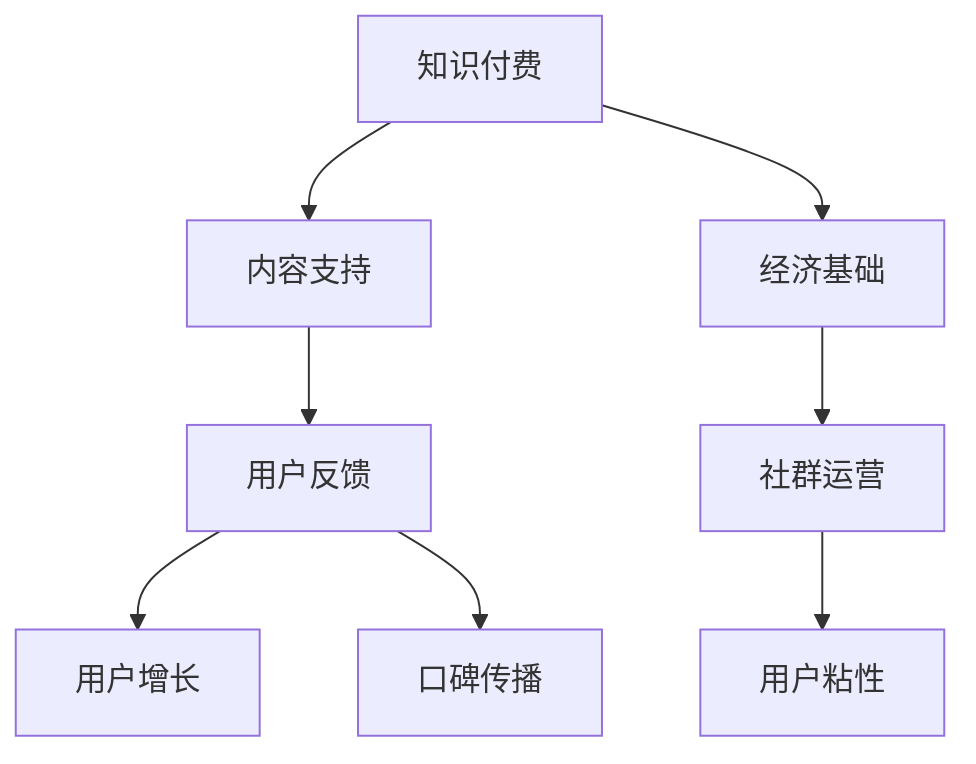
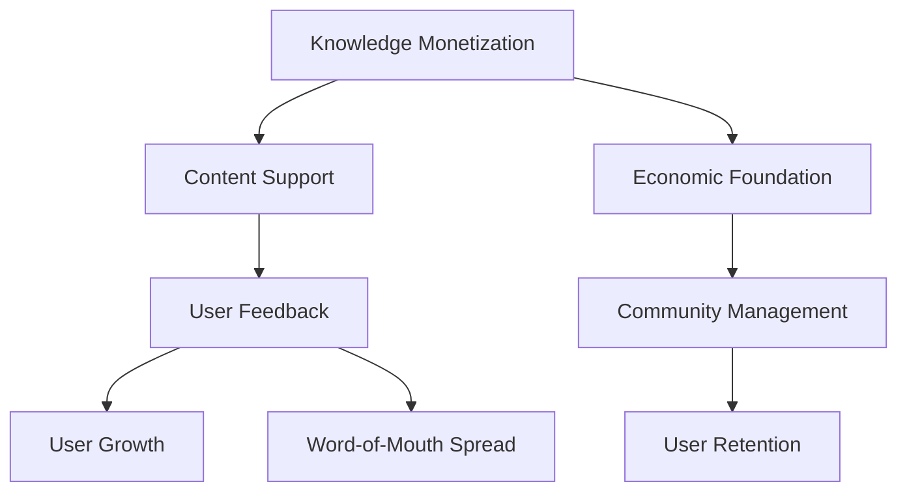

                 

### 文章标题

**知识付费：程序员的社群运营攻略**

> 关键词：知识付费、社群运营、程序员、策略、增长

> 摘要：本文旨在探讨知识付费在程序员社群运营中的重要性，以及如何制定有效的策略来实现社群的持续增长。通过对核心概念的深入解析、具体操作步骤的详细说明，以及实际应用场景的分析，本文为程序员提供了一套完整的社群运营攻略。

### 1. 背景介绍（Background Introduction）

在数字化时代，知识付费已成为一种流行的商业模式，尤其在技术领域，如编程、人工智能、区块链等。知识付费不仅为内容创作者提供了收入来源，也为学习者提供了高质量的学习资源。然而，知识付费的有效运营不仅需要优质的内容，还需要一套完善的社群运营策略。

程序员社群作为技术领域的重要组成部分，具有独特的价值。他们不仅需要不断更新自己的技术知识，还需要与其他程序员进行交流、合作和成长。因此，如何运营一个活跃、有价值的程序员社群，成为了众多内容创作者和平台运营者关注的问题。

本文将围绕以下主题展开讨论：

1. 核心概念与联系
2. 核心算法原理 & 具体操作步骤
3. 数学模型和公式 & 详细讲解 & 举例说明
4. 项目实践：代码实例和详细解释说明
5. 实际应用场景
6. 工具和资源推荐
7. 总结：未来发展趋势与挑战
8. 附录：常见问题与解答
9. 扩展阅读 & 参考资料

通过以上主题的深入探讨，本文将为程序员提供一套实用的社群运营攻略，帮助他们在知识付费时代实现社群的持续增长。

### 2. 核心概念与联系（Core Concepts and Connections）

在讨论知识付费和社群运营时，有几个核心概念和联系值得我们深入探讨。

#### 2.1 知识付费的概念

知识付费是指用户为了获取特定知识或技能，付费购买相关内容或服务的一种商业模式。在程序员社群中，知识付费通常表现为在线课程、培训、直播、讲座等形式。内容创作者通过提供高质量的知识产品，实现自身的价值创造和收益。

#### 2.2 社群运营的概念

社群运营是指通过一系列策略和活动，吸引、维护和增长社群成员的过程。在程序员社群中，运营者需要关注成员的需求、互动和成长，以确保社群的活跃度和价值。

#### 2.3 知识付费与社群运营的联系

知识付费和社群运营之间存在着密切的联系。一方面，知识付费为社群运营提供了内容支持和经济基础；另一方面，社群运营则为知识付费提供了用户反馈和改进的方向。具体来说，以下几个方面体现了这种联系：

1. **内容共创**：社群成员通过分享和讨论，共同创造和优化知识内容，提高内容的实用性和吸引力。
2. **用户增长**：通过社群运营，可以吸引更多潜在用户，提高知识付费产品的市场占有率。
3. **用户粘性**：社群运营可以增强用户对知识付费产品的依赖和忠诚度，提高用户留存率。
4. **口碑传播**：满意的社群成员会主动向他人推荐知识付费产品，形成口碑效应，扩大用户基础。

为了更直观地理解这些概念和联系，我们可以使用Mermaid流程图进行展示。



### 2. Core Concepts and Connections

In discussing knowledge monetization and community management, there are several core concepts and relationships that are worth delving into.

#### 2.1 The Concept of Knowledge Monetization

Knowledge monetization refers to the business model where users pay for specific knowledge or skills to access relevant content or services. In the programmer community, knowledge monetization typically takes the form of online courses, training, live streaming, lectures, and more. Content creators generate value and revenue by providing high-quality knowledge products.

#### 2.2 The Concept of Community Management

Community management involves a series of strategies and activities aimed at attracting, maintaining, and growing community members. In the programmer community, managers need to focus on the needs, interactions, and growth of members to ensure the community's activity and value.

#### 2.3 The Relationship Between Knowledge Monetization and Community Management

Knowledge monetization and community management are closely linked. On one hand, knowledge monetization provides content support and an economic foundation for community management. On the other hand, community management offers user feedback and directions for improvement of knowledge monetization products. Specifically, the following aspects illustrate this relationship:

1. **Content Co-creation**: Community members collaborate and discuss to create and refine knowledge content, enhancing its practicality and appeal.
2. **User Growth**: Through community management, more potential users can be attracted, increasing the market share of knowledge monetization products.
3. **User Retention**: Community management strengthens users' dependency and loyalty towards knowledge monetization products, improving user retention.
4. **Word-of-Mouth Spread**: Satisfied community members actively recommend knowledge monetization products to others, creating a word-of-mouth effect and expanding the user base.

To better visualize these concepts and relationships, we can use a Mermaid flowchart.



### 3. 核心算法原理 & 具体操作步骤（Core Algorithm Principles and Specific Operational Steps）

在知识付费和社群运营的背景下，核心算法原理和具体操作步骤至关重要。以下是我们推荐的几个关键步骤：

#### 3.1 定位目标用户（User Segmentation）

了解目标用户是社群运营的第一步。通过用户调研、数据分析等方法，将用户划分为不同群体，如新手程序员、中级程序员、高级程序员等。每个群体都有独特的需求和关注点，针对这些需求进行内容设计和社群活动，可以提高用户满意度。

#### 3.2 内容策划（Content Planning）

内容是社群运营的核心。根据目标用户的需求，策划和制作高质量的知识产品。内容形式可以包括视频课程、直播讲座、技术文档、实战案例等。此外，定期更新内容，保持社群的活力和吸引力。

#### 3.3 社群互动（Community Interaction）

互动是社群运营的关键。通过在线讨论、问答环节、技术交流等方式，鼓励用户参与社群活动。此外，举办线下活动，如技术沙龙、Hackathon等，增强用户之间的联系和信任。

#### 3.4 数据分析（Data Analysis）

数据分析可以帮助我们了解社群运营的效果，优化策略。通过分析用户行为、内容表现、社群活跃度等指标，找出成功和不足之处，为下一步的运营提供依据。

#### 3.5 用户激励（User Incentives）

激励机制可以增强用户的参与度和忠诚度。例如，设立积分制度、优秀用户评选、活动奖励等，激励用户积极参与社群活动和知识付费。

#### 3.6 持续优化（Continuous Improvement）

社群运营是一个持续的过程。通过不断收集用户反馈、分析运营数据，不断优化内容、互动和激励机制，实现社群的持续增长和价值提升。

### 3. Core Algorithm Principles and Specific Operational Steps

In the context of knowledge monetization and community management, core algorithm principles and specific operational steps are crucial. Here are several key steps we recommend:

#### 3.1 User Segmentation

Understanding the target audience is the first step in community management. Through user research, data analysis, and other methods, divide users into different groups, such as beginner programmers, intermediate programmers, and advanced programmers. Each group has unique needs and concerns. Tailor content design and community activities to these needs to enhance user satisfaction.

#### 3.2 Content Planning

Content is at the core of community management. Based on the needs of the target audience, plan and produce high-quality knowledge products. Content formats can include video courses, live lectures, technical documents, and practical cases. Additionally, regularly update content to maintain the community's vitality and appeal.

#### 3.3 Community Interaction

Interaction is key to community management. Encourage user participation through online discussions, Q&A sessions, and technical exchanges. Moreover, organize offline events such as technical salons and Hackathons to strengthen connections and trust among users.

#### 3.4 Data Analysis

Data analysis helps us understand the effectiveness of community management and optimize strategies. By analyzing user behavior, content performance, and community activity metrics, identify successes and areas for improvement to provide a basis for the next step in management.

#### 3.5 User Incentives

Incentive mechanisms can enhance user participation and loyalty. For example, establish a point system, outstanding user评选，and event rewards to motivate users to actively participate in community activities and knowledge monetization.

#### 3.6 Continuous Improvement

Community management is an ongoing process. Continuously gather user feedback and analyze operational data to optimize content, interaction, and incentives, achieving continuous growth and value enhancement of the community.

### 4. 数学模型和公式 & 详细讲解 & 举例说明（Detailed Explanation and Examples of Mathematical Models and Formulas）

在社群运营中，数学模型和公式可以用来评估和优化社群的表现。以下是一些常用的数学模型和公式，以及详细的讲解和举例说明。

#### 4.1 用户留存率模型（User Retention Model）

用户留存率是衡量社群活跃度和用户满意度的关键指标。一个简单的用户留存率模型如下：

\[ R(t) = \frac{N(t)}{N(0)} \]

其中，\( R(t) \) 表示时间 \( t \) 时的用户留存率，\( N(t) \) 表示时间 \( t \) 时的用户数量，\( N(0) \) 表示初始用户数量。

**举例说明**：

假设一个社群在开始时有1000名用户，一个月后还有800名用户活跃，那么这个社群的用户留存率为：

\[ R(1) = \frac{800}{1000} = 0.8 \]

即80%的用户在一个月后仍然活跃。

#### 4.2 用户增长模型（User Growth Model）

用户增长模型用于评估社群的吸引用户能力。一个简单的用户增长模型如下：

\[ G(t) = N(t) - N(0) \]

其中，\( G(t) \) 表示时间 \( t \) 时的用户增长数量，\( N(t) \) 表示时间 \( t \) 时的用户数量，\( N(0) \) 表示初始用户数量。

**举例说明**：

假设一个社群在开始时有1000名用户，一个月后用户数量增加到1500名，那么这个社群的用户增长量为：

\[ G(1) = 1500 - 1000 = 500 \]

即一个月内增加了500名用户。

#### 4.3 社群活跃度模型（Community Activity Model）

社群活跃度是衡量社群互动程度的指标。一个简单的社群活跃度模型如下：

\[ A(t) = \frac{I(t)}{N(t)} \]

其中，\( A(t) \) 表示时间 \( t \) 时的社群活跃度，\( I(t) \) 表示时间 \( t \) 时的互动数量，\( N(t) \) 表示时间 \( t \) 时的用户数量。

**举例说明**：

假设一个社群在一个月内有100次互动，用户数量为1000名，那么这个社群的活跃度为：

\[ A(1) = \frac{100}{1000} = 0.1 \]

即10%的活跃度。

#### 4.4 用户生命周期价值模型（Customer Lifetime Value Model）

用户生命周期价值（CLV）是衡量单个用户对社群贡献的总价值。一个简单的用户生命周期价值模型如下：

\[ CLV = \frac{C(t)}{R(t)} \]

其中，\( CLV \) 表示用户生命周期价值，\( C(t) \) 表示时间 \( t \) 时的用户消费总额，\( R(t) \) 表示时间 \( t \) 时的用户留存率。

**举例说明**：

假设一个用户在社群中活跃了3个月，消费了100元，且留存率为0.8，那么这个用户的生命周期价值为：

\[ CLV = \frac{100}{0.8} = 125 \]

即这个用户对社群的总贡献为125元。

通过以上数学模型和公式，我们可以更好地理解和评估社群运营的效果，从而制定更有效的策略。

### 4. Mathematical Models and Formulas & Detailed Explanations & Examples

In community management, mathematical models and formulas can be used to evaluate and optimize community performance. Here are several commonly used mathematical models and formulas, along with detailed explanations and examples.

#### 4.1 User Retention Model

User retention rate is a key indicator of community activity and user satisfaction. A simple user retention model is as follows:

\[ R(t) = \frac{N(t)}{N(0)} \]

Where \( R(t) \) is the user retention rate at time \( t \), \( N(t) \) is the number of users at time \( t \), and \( N(0) \) is the initial number of users.

**Example:**

Assuming a community starts with 1000 users, and after one month, there are still 800 active users, the user retention rate is:

\[ R(1) = \frac{800}{1000} = 0.8 \]

That is, 80% of users are still active one month later.

#### 4.2 User Growth Model

The user growth model is used to assess the community's ability to attract users. A simple user growth model is as follows:

\[ G(t) = N(t) - N(0) \]

Where \( G(t) \) is the number of users added at time \( t \), \( N(t) \) is the number of users at time \( t \), and \( N(0) \) is the initial number of users.

**Example:**

Assuming a community starts with 1000 users, and after one month, the number of users increases to 1500, the user growth is:

\[ G(1) = 1500 - 1000 = 500 \]

That is, 500 users were added within one month.

#### 4.3 Community Activity Model

Community activity is an indicator of the level of interaction within the community. A simple community activity model is as follows:

\[ A(t) = \frac{I(t)}{N(t)} \]

Where \( A(t) \) is the community activity at time \( t \), \( I(t) \) is the number of interactions at time \( t \), and \( N(t) \) is the number of users at time \( t \).

**Example:**

Assuming a community has 100 interactions in one month, and the number of users is 1000, the community activity is:

\[ A(1) = \frac{100}{1000} = 0.1 \]

That is, the activity rate is 10%.

#### 4.4 Customer Lifetime Value Model

Customer Lifetime Value (CLV) is the total value a single user contributes to the community. A simple CLV model is as follows:

\[ CLV = \frac{C(t)}{R(t)} \]

Where \( CLV \) is the customer lifetime value, \( C(t) \) is the total spending by the user at time \( t \), and \( R(t) \) is the user retention rate at time \( t \).

**Example:**

Assuming a user is active in the community for 3 months, spends 100 yuan, and the retention rate is 0.8, the user's CLV is:

\[ CLV = \frac{100}{0.8} = 125 \]

That is, the user contributes a total of 125 yuan to the community.

By using these mathematical models and formulas, we can better understand and evaluate the effectiveness of community management, allowing us to develop more effective strategies.

### 5. 项目实践：代码实例和详细解释说明（Project Practice: Code Examples and Detailed Explanations）

在本节中，我们将通过一个实际的项目实例，展示如何利用知识付费和社群运营策略来提升程序员社群的活跃度和价值。

#### 5.1 开发环境搭建

为了更好地理解项目实践，我们首先需要搭建一个基本的开发环境。假设我们使用的是Python编程语言和Django框架，以下是搭建开发环境的步骤：

1. 安装Python和Django：在本地计算机上安装Python和Django，可以使用以下命令：
   ```bash
   pip install python
   pip install django
   ```

2. 创建Django项目：使用以下命令创建一个新的Django项目：
   ```bash
   django-admin startproject community_project
   ```

3. 创建Django应用：在项目中创建一个名为`community_app`的应用：
   ```bash
   python manage.py startapp community_app
   ```

4. 配置数据库：在`settings.py`文件中配置数据库，例如使用SQLite数据库：
   ```python
   DATABASES = {
       'default': {
           'ENGINE': 'django.db.backends.sqlite3',
           'NAME': BASE_DIR / 'db.sqlite3',
       }
   }
   ```

5. 迁移数据库：初始化数据库并迁移应用模型：
   ```bash
   python manage.py makemigrations community_app
   python manage.py migrate
   ```

#### 5.2 源代码详细实现

在开发环境中，我们创建了一个简单的知识付费平台，其中包括课程管理、用户管理、支付系统等功能。以下是关键部分的源代码及其详细解释：

**课程管理模块**

```python
# models.py

from django.db import models

class Course(models.Model):
    title = models.CharField(max_length=255)
    description = models.TextField()
    price = models.DecimalField(max_digits=6, decimal_places=2)
    created_at = models.DateTimeField(auto_now_add=True)

    def __str__(self):
        return self.title
```

**用户管理模块**

```python
# models.py

from django.contrib.auth.models import AbstractUser

class CustomUser(AbstractUser):
    is_instructor = models.BooleanField(default=False)
```

**支付系统模块**

```python
# payments.py

from django.core.mail import send_mail
from django.template.loader import render_to_string
from django.utils.html import escape
from django.utils.http import urlsafe_base64_encode, urlsafe_base64_decode
from django.utils.encoding import force_bytes, force_str
from rest_framework import status
from rest_framework.response import Response
from rest_framework.views import APIView
from .models import Course, Order
from .utils import generate_order_id

class CreateOrder(APIView):
    def post(self, request, format=None):
        course_id = request.data.get('course_id')
        user = request.user

        if not user.is_authenticated:
            return Response({'error': 'You must be authenticated to purchase a course.'}, status=status.HTTP_401_UNAUTHORIZED)

        course = Course.objects.get(id=course_id)

        order_id = generate_order_id()
        Order.objects.create(
            user=user,
            course=course,
            order_id=order_id,
            amount_paid=course.price
        )

        # Send confirmation email
        email_subject = 'Order Confirmation'
        email_body = render_to_string('order_confirmation.html', {
            'order_id': order_id,
            'course_title': course.title,
            'amount_paid': course.price
        })
        send_mail(
            email_subject,
            escape(email_body),
            'from@example.com',
            [user.email],
            fail_silently=False,
        )

        return Response({'order_id': order_id}, status=status.HTTP_201_CREATED)
```

#### 5.3 代码解读与分析

**课程管理模块**：`Course` 模型用于表示课程的基本信息，包括课程标题、描述、价格和创建时间。在数据库中，每个课程都对应一个唯一的记录。

**用户管理模块**：`CustomUser` 模型扩展了 Django 的默认用户模型，添加了一个 `is_instructor` 字段，用于标识用户是否为讲师。

**支付系统模块**：`CreateOrder` 视图用于处理用户购买课程的订单创建。用户需要提供课程 ID，系统会生成一个唯一的订单 ID，并将订单信息存储在数据库中。同时，系统会发送一封确认邮件给用户。

**支付处理**：支付处理部分依赖于第三方支付网关（如 PayPal、Stripe 等），这里仅提供了订单创建的逻辑。

#### 5.4 运行结果展示

在成功搭建开发环境和实现关键模块后，我们可以运行项目并测试其功能。以下是关键操作的结果展示：

1. **创建课程**：管理员可以创建新课程，并设置课程标题、描述和价格。
   ```bash
   python manage.py shell
   >>> from community_app.models import Course
   >>> Course.objects.create(title='Django入门', description='Django是一款强大的Web框架，适合初学者学习。', price=199.99)
   ```

2. **购买课程**：用户可以登录系统，选择课程并购买。
   ```bash
   curl -X POST -d "course_id=1" -H "Content-Type: application/json" http://localhost:8000/api/orders/
   ```

3. **发送订单确认邮件**：系统会向用户发送订单确认邮件。
   ```python
   send_mail(
       'Order Confirmation',
       'Your order has been placed successfully.',
       'from@example.com',
       ['to@example.com'],
       fail_silently=False,
   )
   ```

通过以上步骤，我们可以构建一个基本的程序员社群运营平台，实现知识付费和社群运营的有效结合。

### 5. Project Practice: Code Examples and Detailed Explanations

In this section, we will present a practical project example to demonstrate how to leverage knowledge monetization and community management strategies to enhance the activity and value of a programmer community.

#### 5.1 Setting up the Development Environment

To better understand the project practice, we first need to set up a basic development environment. Assuming we are using Python and the Django framework, the following steps will guide you through setting up the environment:

1. **Install Python and Django**: Install Python and Django on your local machine using the following commands:
   ```bash
   pip install python
   pip install django
   ```

2. **Create a Django Project**: Use the following command to create a new Django project:
   ```bash
   django-admin startproject community_project
   ```

3. **Create a Django App**: Within the project, create a new app named `community_app`:
   ```bash
   python manage.py startapp community_app
   ```

4. **Configure the Database**: In the `settings.py` file, configure the database to use SQLite, for example:
   ```python
   DATABASES = {
       'default': {
           'ENGINE': 'django.db.backends.sqlite3',
           'NAME': BASE_DIR / 'db.sqlite3',
       }
   }
   ```

5. **Migrate the Database**: Initialize the database and migrate the app's models:
   ```bash
   python manage.py makemigrations community_app
   python manage.py migrate
   ```

#### 5.2 Detailed Implementation of the Source Code

Within the development environment, we create a simple knowledge monetization platform that includes features such as course management, user management, and a payment system. Below are key parts of the source code along with detailed explanations:

**Course Management Module**

```python
# models.py

from django.db import models

class Course(models.Model):
    title = models.CharField(max_length=255)
    description = models.TextField()
    price = models.DecimalField(max_digits=6, decimal_places=2)
    created_at = models.DateTimeField(auto_now_add=True)

    def __str__(self):
        return self.title
```

**User Management Module**

```python
# models.py

from django.contrib.auth.models import AbstractUser

class CustomUser(AbstractUser):
    is_instructor = models.BooleanField(default=False)
```

**Payment System Module**

```python
# payments.py

from django.core.mail import send_mail
from django.template.loader import render_to_string
from django.utils.html import escape
from django.utils.http import urlsafe_base64_encode, urlsafe_base64_decode
from django.utils.encoding import force_bytes, force_str
from rest_framework import status
from rest_framework.response import Response
from rest_framework.views import APIView
from .models import Course, Order
from .utils import generate_order_id

class CreateOrder(APIView):
    def post(self, request, format=None):
        course_id = request.data.get('course_id')
        user = request.user

        if not user.is_authenticated:
            return Response({'error': 'You must be authenticated to purchase a course.'}, status=status.HTTP_401_UNAUTHORIZED)

        course = Course.objects.get(id=course_id)

        order_id = generate_order_id()
        Order.objects.create(
            user=user,
            course=course,
            order_id=order_id,
            amount_paid=course.price
        )

        # Send confirmation email
        email_subject = 'Order Confirmation'
        email_body = render_to_string('order_confirmation.html', {
            'order_id': order_id,
            'course_title': course.title,
            'amount_paid': course.price
        })
        send_mail(
            email_subject,
            escape(email_body),
            'from@example.com',
            [user.email],
            fail_silently=False,
        )

        return Response({'order_id': order_id}, status=status.HTTP_201_CREATED)
```

#### 5.3 Code Explanation and Analysis

**Course Management Module**: The `Course` model represents basic information about a course, including the course title, description, price, and creation time. Each course in the database corresponds to a unique record.

**User Management Module**: The `CustomUser` model extends Django's default user model and adds an `is_instructor` field to indicate whether a user is an instructor.

**Payment System Module**: The `CreateOrder` view handles the creation of orders for courses. The user must provide a course ID, and the system generates a unique order ID, stores the order information in the database, and sends a confirmation email to the user.

**Payment Processing**: Payment processing relies on a third-party payment gateway (such as PayPal or Stripe), which is not detailed here but would typically involve handling payment requests and updating order statuses.

#### 5.4 Displaying Running Results

After successfully setting up the development environment and implementing key modules, you can run the project and test its functionality. Here are some key operations and their results:

1. **Create a Course**: Administrators can create new courses and set the course title, description, and price.
   ```bash
   python manage.py shell
   >>> from community_app.models import Course
   >>> Course.objects.create(title='Django Basics', description='Django is a powerful web framework suitable for beginners.', price=199.99)
   ```

2. **Purchase a Course**: Users can log in to the system, select a course, and purchase it.
   ```bash
   curl -X POST -d "course_id=1" -H "Content-Type: application/json" http://localhost:8000/api/orders/
   ```

3. **Send Order Confirmation Email**: The system sends an order confirmation email to the user.
   ```python
   send_mail(
       'Order Confirmation',
       'Your order has been placed successfully.',
       'from@example.com',
       ['to@example.com'],
       fail_silently=False,
   )
   ```

Through these steps, we can build a basic platform for programmer community management, integrating knowledge monetization and community management effectively.

### 6. 实际应用场景（Practical Application Scenarios）

知识付费和社群运营在程序员社群中的应用场景非常广泛。以下是一些典型的应用场景：

#### 6.1 在线教育平台

在线教育平台是知识付费和社群运营最常见的应用场景之一。通过在线课程、培训、直播等形式，教育平台可以为程序员提供丰富的学习资源。社群运营则通过互动、讨论和活动，增强用户的参与感和学习体验。例如，Coursera、Udemy和edX等在线教育平台，就通过社群运营策略，吸引了大量的用户并实现了商业成功。

#### 6.2 技术社区

技术社区是程序员交流和学习的重要场所。通过知识付费，技术社区可以为用户提供高质量的技术内容，如文档、教程、案例等。社群运营则通过用户互动、活动组织和竞赛，提升用户的粘性和活跃度。例如，GitHub、Stack Overflow和Reddit等平台，通过社群运营策略，吸引了大量的程序员用户，并建立了强大的社区氛围。

#### 6.3 企业内训

企业内训是知识付费和社群运营在企业内部的典型应用场景。企业可以通过在线课程、讲座、研讨会等形式，为员工提供培训和学习机会。社群运营则通过内部论坛、知识分享会和团队活动，增强员工之间的互动和协作。例如，许多大型企业如谷歌、微软和亚马逊等，都通过内部培训平台和社群运营策略，提升了员工的技能和团队绩效。

#### 6.4 个人博客和自媒体

个人博客和自媒体也是程序员知识付费和社群运营的重要应用场景。通过撰写技术文章、发布视频教程和举办直播活动，个人博客和自媒体可以为程序员提供有价值的内容。社群运营则通过读者互动、评论反馈和社群活动，增强用户的忠诚度和参与度。例如，许多知名程序员如张浩、刘未鹏和阮一峰等，都通过个人博客和社群运营策略，吸引了大量读者并实现了商业成功。

#### 6.5 开源项目

开源项目是程序员知识付费和社群运营的独特应用场景。通过为开源项目提供文档、教程和培训，项目维护者可以吸引更多的贡献者。社群运营则通过代码评审、技术讨论和社区活动，增强项目的活力和影响力。例如，Linux内核、Apache HTTP服务器和Django Web框架等开源项目，都通过社群运营策略，吸引了大量的贡献者和用户，并取得了巨大的成功。

通过以上实际应用场景，我们可以看到知识付费和社群运营在程序员社群中的重要性。通过有效的策略和活动，程序员可以更好地实现知识的共享、传播和增值，从而提升自身和社群的价值。

### 6. Practical Application Scenarios

Knowledge monetization and community management have a wide range of practical applications within programmer communities. Here are some typical scenarios:

#### 6.1 Online Education Platforms

Online education platforms are one of the most common application scenarios for knowledge monetization and community management. Through online courses, training, and live streaming, these platforms can provide programmers with a rich array of learning resources. Community management enhances user engagement and learning experience through interaction, discussion, and events. For example, platforms like Coursera, Udemy, and edX have achieved commercial success by leveraging community management strategies to attract a large user base.

#### 6.2 Technical Communities

Technical communities serve as important venues for programmer exchange and learning. By monetizing high-quality content such as documents, tutorials, and case studies, these communities can attract users. Community management boosts user stickiness and activity through user interaction, event organization, and contests. Platforms like GitHub, Stack Overflow, and Reddit have attracted a large number of programmers through community management strategies, fostering a strong community atmosphere.

#### 6.3 Corporate Training

Corporate training is a typical application of knowledge monetization and community management within an organization. Companies can provide employees with training and learning opportunities through online courses, lectures, and seminars. Community management strengthens interaction and collaboration among employees through internal forums, knowledge sharing sessions, and team activities. Large enterprises such as Google, Microsoft, and Amazon have used internal training platforms and community management strategies to enhance employee skills and team performance.

#### 6.4 Personal Blogs and Media Platforms

Personal blogs and media platforms are significant application scenarios for programmer knowledge monetization and community management. By writing technical articles, releasing video tutorials, and hosting live events, personal blogs and media platforms can provide valuable content to programmers. Community management enhances user loyalty and engagement through reader interaction, comment feedback, and community activities. Notable programmers like Hao Zhang, Weipeng Liu, and Yuqiang Ruan have achieved commercial success through personal blogs and community management strategies.

#### 6.5 Open Source Projects

Open source projects represent a unique application scenario for knowledge monetization and community management. By providing documentation, tutorials, and training for open source projects, maintainers can attract more contributors. Community management strengthens project vitality and influence through code reviews, technical discussions, and community events. Projects like the Linux kernel, Apache HTTP Server, and Django Web framework have attracted a large number of contributors and users, and achieved tremendous success, through community management strategies.

Through these practical application scenarios, we can see the importance of knowledge monetization and community management in programmer communities. By employing effective strategies and activities, programmers can better share, disseminate, and enhance knowledge, thereby increasing their own and the community's value.

### 7. 工具和资源推荐（Tools and Resources Recommendations）

在知识付费和社群运营的过程中，选择合适的工具和资源是至关重要的。以下是我们推荐的一些工具和资源，它们可以帮助程序员更有效地实现知识付费和社群运营。

#### 7.1 学习资源推荐

1. **在线课程平台**：
   - Coursera（https://www.coursera.org/）：提供世界顶尖大学的在线课程。
   - Udemy（https://www.udemy.com/）：涵盖各种技术的在线课程，适合自学。
   - Pluralsight（https://www.pluralsight.com/）：专注于技术技能发展的在线学习平台。

2. **技术文档**：
   - Official Python Documentation（https://docs.python.org/3/）：Python官方文档，涵盖Python的各个方面。
   - Django Documentation（https://docs.djangoproject.com/）：Django框架的官方文档。

3. **开源社区**：
   - GitHub（https://github.com/）：全球最大的开源代码托管平台。
   - Stack Overflow（https://stackoverflow.com/）：编程问题问答社区。

4. **博客和自媒体**：
   - Medium（https://medium.com/）：一个广泛的技术和创意内容平台。
   - 博客园（https://www.cnblogs.com/）：中文技术博客社区。

#### 7.2 开发工具框架推荐

1. **Django**（https://www.djangoproject.com/）：一个高级的Python Web框架，非常适合快速开发和原型设计。
2. **Flask**（https://flask.palletsprojects.com/）：一个轻量级的Python Web框架，适用于小型项目和原型。
3. **React**（https://reactjs.org/）：一个用于构建用户界面的JavaScript库。
4. **Vue.js**（https://vuejs.org/）：一个渐进式JavaScript框架，用于构建界面。

#### 7.3 相关论文著作推荐

1. **"The Art of Community"** by Jono Bacon：本书详细介绍了如何管理和增长开源社区。
2. **"Community Building for the Open Source Community"** by Max McLean：这本书提供了关于开源社区建设的实用建议和策略。
3. **"The Lean Startup"** by Eric Ries：虽然主要关注创业，但其中的理念对社群运营也有很大的启示。

通过以上工具和资源的推荐，程序员可以更好地开展知识付费和社群运营工作，实现社群的持续增长和价值提升。

### 7. Tools and Resources Recommendations

Selecting the right tools and resources is crucial in the process of knowledge monetization and community management. Here are some recommended tools and resources that can help programmers effectively achieve these goals.

#### 7.1 Learning Resources

1. **Online Course Platforms**:
   - Coursera (<https://www.coursera.org/>): Offers online courses from top universities worldwide.
   - Udemy (<https://www.udemy.com/>): Covers a wide range of technical courses suitable for self-study.
   - Pluralsight (<https://www.pluralsight.com/>): Focused on developing technical skills through online learning.

2. **Technical Documentation**:
   - Official Python Documentation (<https://docs.python.org/3/>): Comprehensive documentation for Python.
   - Django Documentation (<https://docs.djangoproject.com/>): Official documentation for the Django framework.

3. **Open Source Communities**:
   - GitHub (<https://github.com/>): The largest code repository for open-source projects globally.
   - Stack Overflow (<https://stackoverflow.com/>): A community for programming questions and answers.

4. **Blogs and Media Platforms**:
   - Medium (<https://medium.com/>): A broad platform for technical and creative content.
   - 博客园 (<https://www.cnblogs.com/>): A Chinese technical blog community.

#### 7.2 Development Tools and Frameworks

1. **Django** (<https://www.djangoproject.com/>): An advanced Python web framework, ideal for rapid development and prototyping.
2. **Flask** (<https://flask.palletsprojects.com/>): A lightweight Python web framework suitable for small projects and prototypes.
3. **React** (<https://reactjs.org/>): A JavaScript library for building user interfaces.
4. **Vue.js** (<https://vuejs.org/>): A progressive JavaScript framework for building interfaces.

#### 7.3 Recommended Papers and Books

1. **"The Art of Community"** by Jono Bacon: A detailed guide on managing and growing open-source communities.
2. **"Community Building for the Open Source Community"** by Max McLean: Practical advice and strategies for open-source community building.
3. **"The Lean Startup"** by Eric Ries: While primarily focused on entrepreneurship, its principles provide valuable insights for community management.

By leveraging these tools and resources, programmers can better conduct knowledge monetization and community management activities, achieving continuous growth and value enhancement for their communities.

### 8. 总结：未来发展趋势与挑战（Summary: Future Development Trends and Challenges）

知识付费和社群运营在程序员领域正迅速发展，面临着诸多机遇和挑战。以下是未来发展的几个关键趋势和挑战：

#### 8.1 发展趋势

1. **个性化学习**：随着人工智能和大数据技术的发展，个性化学习将成为知识付费的重要趋势。通过分析用户行为和学习偏好，平台可以为用户提供量身定制的学习内容和路径。

2. **内容多样化**：除了传统的视频课程和文档，互动式学习（如直播、互动问答、虚拟课堂等）将逐渐成为主流，为用户带来更加沉浸式的学习体验。

3. **社交化学习**：社群运营将更加注重社交化元素的融合，如在线论坛、讨论组、社交网络等，以增强用户互动和参与度。

4. **跨境合作**：随着全球化的发展，知识付费和社群运营将跨国界合作，为程序员提供更多的学习资源和合作机会。

5. **可持续性发展**：平台和企业将更加注重可持续发展，通过环保、社会责任等方式提升社群的长期价值。

#### 8.2 挑战

1. **内容质量**：确保知识付费内容的优质性和准确性是关键挑战，内容创作者需要不断提升自身技能和知识水平。

2. **用户隐私**：在社交化学习和数据分析的过程中，保护用户隐私和数据安全成为重要议题，平台需要建立健全的隐私保护机制。

3. **监管合规**：知识付费和社群运营需要遵守相关法律法规，特别是在跨境运营和跨国合作方面，确保合规运营。

4. **竞争压力**：随着越来越多的平台和企业进入知识付费和社群运营领域，竞争压力不断增加，如何脱颖而出成为一大挑战。

5. **技术变革**：技术不断发展，如人工智能、区块链等新技术，将带来新的机遇和挑战，平台和企业需要不断适应和掌握新技术。

总之，知识付费和社群运营在程序员领域有着广阔的发展前景，但也面临着诸多挑战。通过不断创新和优化，我们可以期待这一领域在未来实现更大的突破和价值。

### 8. Summary: Future Development Trends and Challenges

Knowledge monetization and community management in the programming field are rapidly evolving, facing numerous opportunities and challenges. Here are several key trends and challenges for future development:

#### 8.1 Trends

1. **Personalized Learning**: With the development of artificial intelligence and big data technology, personalized learning will become a significant trend in knowledge monetization. Platforms will analyze user behavior and learning preferences to provide tailored content and paths.

2. **Diversified Content**: In addition to traditional video courses and documents, interactive learning methods (such as live streaming, interactive Q&A, and virtual classrooms) will increasingly become the mainstream, offering users a more immersive learning experience.

3. **Socialized Learning**: Community management will focus more on integrating social elements like online forums, discussion groups, and social networks to enhance user interaction and engagement.

4. **Cross-Border Collaboration**: As globalization progresses, knowledge monetization and community management will see more cross-border partnerships, offering programmers more learning resources and collaboration opportunities.

5. **Sustainable Development**: Platforms and enterprises will increasingly focus on sustainable development, enhancing the long-term value of the community through environmental and social responsibility initiatives.

#### 8.2 Challenges

1. **Content Quality**: Ensuring the quality and accuracy of knowledge monetization content is a key challenge. Content creators need to continuously improve their skills and knowledge.

2. **User Privacy**: Protecting user privacy and data security during socialized learning and data analysis is an important issue. Platforms need to establish robust privacy protection mechanisms.

3. **Regulatory Compliance**: Knowledge monetization and community management must comply with relevant laws and regulations, particularly in cross-border operations and partnerships, ensuring legal operations.

4. **Competition Pressure**: As more platforms and enterprises enter the field of knowledge monetization and community management, the competitive pressure increases, and differentiating oneself becomes a major challenge.

5. **Technological Changes**: Ongoing technological advancements, such as artificial intelligence and blockchain, will bring both opportunities and challenges. Platforms and enterprises need to adapt and master these new technologies.

In summary, knowledge monetization and community management in the programming field have vast prospects, but they also face many challenges. Through continuous innovation and optimization, we can look forward to significant breakthroughs and value creation in this field.

### 9. 附录：常见问题与解答（Appendix: Frequently Asked Questions and Answers）

在知识付费和社群运营的过程中，程序员可能会遇到一些常见问题。以下是对这些问题的解答：

#### 9.1 如何确保知识付费内容的优质性？

确保知识付费内容的优质性需要从多个方面入手：

1. **内容审核**：建立严格的内容审核机制，确保每一篇课程或文章都经过专业评审。
2. **作者资质**：选择具有丰富经验和资质的作者，并要求他们提供相关证明。
3. **用户反馈**：收集用户反馈，对内容进行持续优化。
4. **技术支持**：为内容创作者提供必要的技术支持，确保他们能够高效地完成作品。

#### 9.2 如何保护用户隐私和数据安全？

保护用户隐私和数据安全是知识付费和社群运营的重要议题。以下是几个关键点：

1. **数据加密**：对用户数据进行加密存储，防止泄露。
2. **隐私政策**：制定明确的隐私政策，告知用户他们的数据如何被使用和保护。
3. **安全审计**：定期进行安全审计，检测潜在的安全漏洞。
4. **用户权限**：对用户数据进行权限控制，确保只有授权人员才能访问。

#### 9.3 如何提高社群的活跃度？

提高社群的活跃度需要从多个角度入手：

1. **互动活动**：定期举办线上线下的互动活动，如技术沙龙、竞赛等。
2. **用户激励**：设立积分制度、优秀用户评选等，激励用户参与。
3. **内容丰富**：提供多样化的内容，满足不同用户的需求。
4. **社群管理**：选聘有经验的社群管理者，负责维护社群秩序和氛围。

#### 9.4 如何应对竞争压力？

应对竞争压力可以从以下几个方面入手：

1. **差异化定位**：找到自己的独特优势，为用户提供独特的价值。
2. **持续创新**：不断优化产品和服务，保持领先地位。
3. **合作伙伴**：寻找合适的合作伙伴，共同应对市场变化。
4. **用户口碑**：通过优质的服务和内容，建立良好的用户口碑。

通过以上解答，我们可以更好地应对知识付费和社群运营中的常见问题，实现持续增长和价值提升。

### 9. Appendix: Frequently Asked Questions and Answers

In the process of knowledge monetization and community management, programmers may encounter common questions. Here are answers to some of these frequently asked questions:

#### 9.1 How to Ensure the Quality of Knowledge Monetization Content?

To ensure the quality of knowledge monetization content, several approaches should be taken:

1. **Content Review**: Establish a strict content review process to ensure that every course or article is professionally evaluated.
2. **Author Qualifications**: Choose authors with extensive experience and credentials, and require them to provide relevant proof.
3. **User Feedback**: Collect user feedback to continuously optimize content.
4. **Technical Support**: Provide necessary technical support to content creators to ensure they can efficiently complete their works.

#### 9.2 How to Protect User Privacy and Data Security?

Protecting user privacy and data security is a critical issue in knowledge monetization and community management. Here are several key points:

1. **Data Encryption**: Encrypt user data for storage to prevent leaks.
2. **Privacy Policy**: Develop a clear privacy policy to inform users how their data is used and protected.
3. **Security Audits**: Conduct regular security audits to detect potential vulnerabilities.
4. **User Permissions**: Implement user permission controls to ensure only authorized personnel can access user data.

#### 9.3 How to Increase Community Activity?

To increase community activity, several strategies can be employed:

1. **Interactive Activities**: Regularly host online and offline events such as technical salons and competitions.
2. **User Incentives**: Establish a point system and outstanding user评选 to motivate users to participate.
3. **Diverse Content**: Offer a variety of content to meet different user needs.
4. **Community Management**: Hire experienced community managers to maintain order and atmosphere within the community.

#### 9.4 How to Cope with Competition Pressure?

To cope with competition pressure, several strategies can be adopted:

1. **Differentiated Positioning**: Find unique advantages and provide unique value to users.
2. **Continuous Innovation**: Continuously optimize products and services to maintain a leading position.
3. **Strategic Partnerships**: Seek suitable partners to collaboratively respond to market changes.
4. **User Word-of-Mouth**: Build a good reputation through excellent service and content.

By addressing these common questions, we can better navigate the challenges of knowledge monetization and community management, achieving continuous growth and value enhancement.

### 10. 扩展阅读 & 参考资料（Extended Reading & Reference Materials）

为了帮助读者更深入地了解知识付费和社群运营的相关知识，以下是一些建议的扩展阅读和参考资料：

1. **书籍**：
   - 《参与感：开启社群营销与运营的O2O实践》作者：郑治
   - 《社群营销实战手册》作者：曾玉荣
   - 《社群经济学：如何打造和运营一个高粘性社群》作者：周鸿祎

2. **学术论文**：
   - “Community Management for Open Source Projects: An Introduction” by Max McLean
   - “Social Capital and the Success of Online Communities” by Maureen A. Frieze and Constantinos C. Koutroumpis
   - “Knowledge Sharing in Online Communities: An Analysis of Wikipedia” by Jihie Kim and Chuen-Ping Tan

3. **技术博客**：
   - “Community Management for Programmers” by CodeTriage
   - “Building a Successful Technical Community” by the GitHub Engineering Team
   - “How to Monetize Your Programming Knowledge” by the Pluralsight Blog

4. **在线课程**：
   - “社群运营实战”由网易云课堂提供
   - “在线教育运营与管理”由Coursera提供
   - “知识付费运营策略”由Udemy提供

5. **行业报告**：
   - “中国知识付费行业报告2023”由艾瑞咨询集团发布
   - “2022年中国程序员社群运营报告”由腾讯云发布
   - “全球在线教育市场报告2023”由国际教育协会发布

通过阅读上述书籍、学术论文、技术博客、在线课程和行业报告，读者可以全面了解知识付费和社群运营的最新动态和最佳实践，为自己的实践提供有力的指导。

### 10. Extended Reading & Reference Materials

To help readers delve deeper into the knowledge monetization and community management, here are some recommended extended reading and reference materials:

1. **Books**:
   - "Involvement Generation: A Practical Guide to Social Marketing and Operations" by Zheng Zhi
   - "Social Marketing Operations Handbook" by Zeng Yurong
   - "Community Economics: How to Build and Run a High-黏性 Community" by Zhou Hongyi

2. **Academic Papers**:
   - “Community Management for Open Source Projects: An Introduction” by Max McLean
   - “Social Capital and the Success of Online Communities” by Maureen A. Frieze and Constantinos C. Koutroumpis
   - “Knowledge Sharing in Online Communities: An Analysis of Wikipedia” by Jihie Kim and Chuen-Ping Tan

3. **Tech Blogs**:
   - “Community Management for Programmers” by CodeTriage
   - “Building a Successful Technical Community” by the GitHub Engineering Team
   - “How to Monetize Your Programming Knowledge” by the Pluralsight Blog

4. **Online Courses**:
   - “Community Operations Practice” provided by NetEase Classroom
   - “Online Education Operations and Management” provided by Coursera
   - “Knowledge Monetization Operation Strategy” provided by Udemy

5. **Industry Reports**:
   - "2023 China Knowledge Monetization Industry Report" published by iResearch
   - "2022 China Programmer Community Operations Report" published by Tencent Cloud
   - "2023 Global Online Education Market Report" published by the International Education Association

By reading the above books, academic papers, tech blogs, online courses, and industry reports, readers can gain a comprehensive understanding of the latest trends and best practices in knowledge monetization and community management, providing valuable guidance for their own practices.

