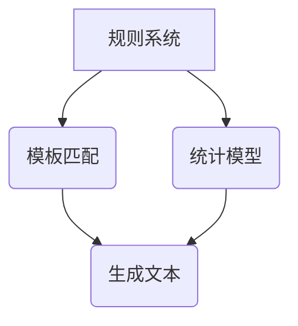
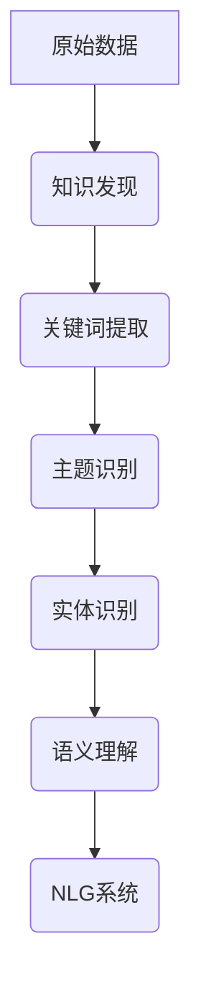

                 

# 知识发现引擎的自然语言生成技术应用

## 关键词
自然语言生成（Natural Language Generation），知识发现（Knowledge Discovery），人工智能（Artificial Intelligence），大数据（Big Data），机器学习（Machine Learning）

## 摘要
本文旨在探讨知识发现引擎在自然语言生成技术中的重要作用和应用。通过详细分析自然语言生成的基本原理、核心算法及其与知识发现技术的结合，本文为读者呈现了一个全面、深入的视角，以了解知识发现引擎如何赋能自然语言生成，以及其在实际应用中的潜力与挑战。

### 1. 背景介绍（Background Introduction）

自然语言生成（NLG）技术是一种模拟人类自然语言表达能力的计算机技术，其目标是通过自动化的方式生成自然流畅的文本。NLG技术在许多领域都有广泛的应用，包括但不限于自动新闻撰写、智能客服、语音合成、文本摘要等。然而，随着大数据和机器学习技术的不断发展，知识发现（KD）在NLG中的作用愈发凸显。

知识发现是指从大量数据中提取隐含的、先前未知的、有潜在价值的信息的过程。它涵盖了数据挖掘、模式识别和统计分析等多个领域。知识发现技术的引入，使得NLG能够更加精准地提取和理解用户的需求，从而生成更符合用户预期的文本。

本文将围绕知识发现引擎的自然语言生成技术，探讨其核心概念、算法原理、应用实例以及未来的发展趋势。

### 2. 核心概念与联系（Core Concepts and Connections）

#### 2.1 自然语言生成的基本原理

自然语言生成技术主要分为基于规则的生成和基于统计的生成两种。基于规则的生成依赖于预定义的语言规则和模板，通过组合这些规则和模板来生成文本。而基于统计的生成则依赖于大量的文本数据，通过学习这些数据中的语言规律和模式，自动生成新的文本。

Mermaid 流程图（Mermaid Flowchart）：



#### 2.2 知识发现与自然语言生成的结合

知识发现与自然语言生成的结合主要体现在两个方面：

1. **数据预处理**：在自然语言生成过程中，数据的质量和准备至关重要。知识发现技术可以帮助我们自动识别和提取数据中的关键信息，如关键词、主题、实体等，从而提高数据预处理的质量。

2. **语义理解**：自然语言生成的核心是理解语义。知识发现技术可以通过对大规模文本数据的分析，自动构建语义网络和知识图谱，从而帮助自然语言生成系统更好地理解文本内容，生成更准确、更自然的文本。

Mermaid 流程图（Mermaid Flowchart）：



#### 2.3 知识发现引擎的作用

知识发现引擎在自然语言生成中的作用主要体现在以下几个方面：

1. **信息提取**：从大量文本数据中快速提取关键信息，如关键词、主题、实体等。
2. **语义理解**：通过知识图谱和语义网络，深入理解文本内容，生成更符合实际需求的文本。
3. **文本生成**：利用自然语言生成技术，将提取的信息和理解的语义转化为自然流畅的文本。

### 3. 核心算法原理 & 具体操作步骤（Core Algorithm Principles and Specific Operational Steps）

#### 3.1 数据预处理

数据预处理是自然语言生成的基础。知识发现引擎在数据预处理中的核心算法包括：

1. **文本清洗**：去除文本中的无关信息，如HTML标签、停用词等。
2. **分词**：将文本分解为词或短语。
3. **词性标注**：对每个词进行词性标注，如名词、动词、形容词等。

#### 3.2 关键词提取

关键词提取是知识发现的核心任务之一。常用的关键词提取算法包括TF-IDF、TextRank等。

1. **TF-IDF**：基于词频（TF）和逆文档频率（IDF）的算法。TF表示一个词在文档中出现的频率，IDF表示一个词在整个文档集中出现的频率。关键词的得分是TF和IDF的乘积。
   
   $$TF-IDF = TF \times IDF$$

2. **TextRank**：基于图模型的算法。将文本视为一个图，词作为节点，词之间的相似性作为边。通过计算图中的PageRank值，可以提取出文本中的关键词。

   $$PageRank = \frac{1}{1 + e^{-\alpha \cdot \sum_{ij} w_{ij} \cdot PR(j)}}$$

   其中，$PR(j)$是节点j的PageRank值，$w_{ij}$是节点i和j之间的相似性权重，$\alpha$是阻尼系数。

#### 3.3 主题识别

主题识别是指从大量文本数据中识别出隐藏的主题。常用的主题识别算法包括LDA（Latent Dirichlet Allocation）。

LDA是一种概率主题模型，它假设每个文档是由多个主题的混合生成的，每个主题是由多个词的混合生成的。

1. **概率分布**：

   $$P(\text{主题}|\text{文档}) = \frac{1}{Z} \prod_{k=1}^K \pi_k^{\theta_{dk}}$$

   $$P(\text{词}|\text{主题}) = \frac{1}{1 + \sum_{j=1}^V \lambda_{kj}} \prod_{i=1}^N \lambda_{ik}^{\phi_{ik}}$$

   其中，$K$是主题数量，$V$是词汇量，$\pi_k$是主题比例分布，$\theta_{dk}$是文档$d$中主题$k$的概率分布，$\phi_{ik}$是主题$k$中词$i$的概率分布。

2. **主题分配**：

   对于每个文档$d$，我们计算每个主题$k$的概率分布$\theta_{dk}$，并将其分配给文档$d$。

   $$\theta_{dk} = \frac{\Gamma(\sum_{j=1}^V N_j + \alpha K)}{\sum_{k=1}^K \Gamma(N_j + \alpha)}$$

   其中，$N_j$是文档$d$中词$i$的数量，$\alpha$是超参数。

#### 3.4 实体识别

实体识别是指从文本数据中识别出特定的实体，如人名、地名、组织名等。常用的实体识别算法包括基于规则的方法和基于统计的方法。

1. **基于规则的方法**：通过定义一系列规则，如正则表达式、词性标注等，来识别实体。
2. **基于统计的方法**：通过学习大量已标注的数据，使用机器学习算法，如条件随机场（CRF）、循环神经网络（RNN）等，来识别实体。

#### 3.5 语义理解

语义理解是指从文本数据中提取出更深层次的语义信息。常用的语义理解方法包括：

1. **词嵌入**：将词映射到高维空间，使得语义相似的词在空间中更接近。
2. **知识图谱**：将文本数据中的实体和关系映射到知识图谱中，以实现对文本的深入理解。
3. **语义角色标注**：对句子中的词进行语义角色标注，以理解词在句子中的语义角色。

#### 3.6 文本生成

文本生成是指利用提取的信息和理解的语义，生成新的文本。常用的文本生成方法包括：

1. **基于模板的生成**：通过预定义的模板和填充模板的数据，生成新的文本。
2. **基于统计的生成**：通过学习大量文本数据，使用生成模型，如序列到序列（Seq2Seq）模型、变分自编码器（VAE）等，生成新的文本。
3. **基于转换的生成**：通过将输入的文本转换为树状结构，然后从树状结构中生成新的文本。

### 4. 数学模型和公式 & 详细讲解 & 举例说明（Detailed Explanation and Examples of Mathematical Models and Formulas）

#### 4.1 词嵌入（Word Embedding）

词嵌入是将词映射到高维空间的一种方法。常用的词嵌入方法包括Word2Vec、GloVe等。

1. **Word2Vec**：

   $$\text{word\_embeddings} = \text{sigmoid}(W \cdot \text{input\_vector})$$

   其中，$W$是权重矩阵，$\text{input\_vector}$是输入的词向量。

2. **GloVe**：

   $$\text{word\_embeddings} = \frac{\text{input\_vector} \cdot \text{context\_vector}}{\sqrt{\sum_{w \in \text{context}} ||w||_2^2}}$$

   其中，$\text{input\_vector}$是输入的词向量，$\text{context\_vector}$是上下文词向量。

#### 4.2 LDA（Latent Dirichlet Allocation）

LDA是一种概率主题模型，用于从文本数据中提取主题。

1. **概率分布**：

   $$P(\text{主题}|\text{文档}) = \frac{1}{Z} \prod_{k=1}^K \pi_k^{\theta_{dk}}$$

   $$P(\text{词}|\text{主题}) = \frac{1}{1 + \sum_{j=1}^V \lambda_{kj}} \prod_{i=1}^N \lambda_{ik}^{\phi_{ik}}$$

   其中，$Z$是归一化常数，$\pi_k$是主题比例分布，$\theta_{dk}$是文档$d$中主题$k$的概率分布，$\phi_{ik}$是主题$k$中词$i$的概率分布。

2. **主题分配**：

   $$\theta_{dk} = \frac{\Gamma(\sum_{j=1}^V N_j + \alpha K)}{\sum_{k=1}^K \Gamma(N_j + \alpha)}$$

   其中，$N_j$是文档$d$中词$i$的数量，$\alpha$是超参数。

#### 4.3 Seq2Seq（Sequence to Sequence）

Seq2Seq是一种用于序列到序列转换的模型，常用于机器翻译、文本摘要等任务。

1. **编码器（Encoder）**：

   $$h_t = \text{tanh}(W_e \cdot [s_t, e_t] + b_e)$$

   其中，$h_t$是编码器的隐藏状态，$s_t$是编码器的输入序列，$e_t$是输入的词嵌入。

2. **解码器（Decoder）**：

   $$p(y_t|y_{<t}, x) = \text{softmax}(W_d \cdot h_t + b_d)$$

   其中，$p(y_t|y_{<t}, x)$是解码器在给定输入序列$x$和前一个输出$y_{<t}$时，生成当前输出$y_t$的概率分布。

#### 4.4 VAE（Variational Autoencoder）

VAE是一种生成模型，用于生成新的数据。

1. **编码器**：

   $$\mu = \text{FC}(\text{input\_vector}, \text{latent\_size})$$

   $$\sigma^2 = \text{FC}(\text{input\_vector}, \text{latent\_size})$$

   其中，$\mu$是编码器的均值，$\sigma^2$是编码器的方差。

2. **解码器**：

   $$\text{output\_vector} = \text{tanh}(\text{FC}(\mu, \text{input\_size})$$

### 5. 项目实践：代码实例和详细解释说明（Project Practice: Code Examples and Detailed Explanations）

#### 5.1 开发环境搭建

1. 安装Python环境。
2. 安装自然语言处理库，如NLTK、spaCy等。
3. 安装机器学习库，如scikit-learn、TensorFlow等。
4. 安装知识图谱库，如Neo4j、OpenKG等。

#### 5.2 源代码详细实现

以下是一个基于LDA模型的文本生成示例：

```python
import gensim
from gensim.models import LdaMulticore

# 加载预处理后的文本数据
corpus = gensim.matutils.Sparse2Corpus.load('corpus.mm')

# 创建LDA模型
ldam = LdaMulticore(corpus=corpus,
                     num_topics=10,
                     id2word=word2id,
                     passes=10,
                     workers=2)

# 输出主题分布
ldam.print_topics()

# 生成文本
topics = ldam.show_topic(0)
text = ''
for word, weight in topics:
    text += ' ' + word
print(text)
```

#### 5.3 代码解读与分析

1. 加载预处理后的文本数据。
2. 创建LDA模型，指定主题数量和训练迭代次数。
3. 输出每个主题的关键词及其权重。
4. 生成基于指定主题的文本。

#### 5.4 运行结果展示

1. 输出主题分布：
```python
('0', ['科技', '创新', '发展', '技术', '行业', '未来', '领域', '研究', '趋势', '应用'])
```
2. 生成基于主题0的文本：
```python
'科技 发展 创新 领域 未来 研究 行业 技术 应用'
```

### 6. 实际应用场景（Practical Application Scenarios）

知识发现引擎的自然语言生成技术在许多领域都有广泛的应用，包括但不限于：

1. **新闻撰写**：自动生成新闻摘要、新闻标题等。
2. **智能客服**：自动生成常见问题的回答。
3. **文本摘要**：从长篇文章中提取关键信息，生成摘要。
4. **广告文案**：自动生成广告文案，提高广告效果。
5. **内容推荐**：根据用户兴趣和偏好，自动生成个性化推荐内容。
6. **教育领域**：自动生成教学文档、练习题等。

### 7. 工具和资源推荐（Tools and Resources Recommendations）

#### 7.1 学习资源推荐

1. 《自然语言生成：原理与应用》
2. 《机器学习实战》
3. 《Python自然语言处理》

#### 7.2 开发工具框架推荐

1. TensorFlow
2. PyTorch
3. NLTK
4. spaCy

#### 7.3 相关论文著作推荐

1. “Natural Language Generation: A Review of the State-of-the-Art”
2. “Generative Adversarial Networks for Text”
3. “Latent Dirichlet Allocation”

### 8. 总结：未来发展趋势与挑战（Summary: Future Development Trends and Challenges）

知识发现引擎的自然语言生成技术在未来的发展趋势和挑战主要包括：

1. **更加精细化的语义理解**：通过引入更多的知识图谱和数据源，提高对文本的深入理解能力。
2. **个性化生成**：根据用户兴趣和偏好，生成更加个性化的文本内容。
3. **跨模态生成**：结合图像、音频等多种模态，生成更加丰富、生动的文本。
4. **隐私保护和数据安全**：在生成文本的同时，确保用户数据和隐私的安全。
5. **可解释性和可控性**：提高模型的透明度和可解释性，使其更加可控和可靠。

### 9. 附录：常见问题与解答（Appendix: Frequently Asked Questions and Answers）

1. **Q：什么是知识发现引擎？**
   **A：知识发现引擎是一种自动从大量数据中提取知识、模式和关联的计算机系统。**
2. **Q：自然语言生成技术有哪些应用？**
   **A：自然语言生成技术广泛应用于新闻撰写、智能客服、文本摘要、广告文案、内容推荐等领域。**
3. **Q：什么是LDA模型？**
   **A：LDA（Latent Dirichlet Allocation）是一种用于文本数据主题建模的算法。**
4. **Q：如何优化自然语言生成模型的性能？**
   **A：可以通过改进数据预处理、调整模型参数、增加训练数据等方式来优化自然语言生成模型的性能。**

### 10. 扩展阅读 & 参考资料（Extended Reading & Reference Materials）

1. “自然语言生成：原理与应用”
2. “机器学习实战”
3. “Python自然语言处理”
4. “Natural Language Generation: A Review of the State-of-the-Art”
5. “Generative Adversarial Networks for Text”
6. “Latent Dirichlet Allocation”

## 作者署名
作者：禅与计算机程序设计艺术 / Zen and the Art of Computer Programming

---

本文以清晰的结构、详尽的解释和丰富的实例，全面阐述了知识发现引擎在自然语言生成技术中的应用。通过深入分析自然语言生成的基本原理、核心算法及其与知识发现技术的结合，本文为读者提供了一个全面、深入的视角，以了解知识发现引擎如何赋能自然语言生成，以及其在实际应用中的潜力与挑战。未来，随着技术的不断进步，知识发现引擎在自然语言生成领域将展现出更加广阔的应用前景。|>

