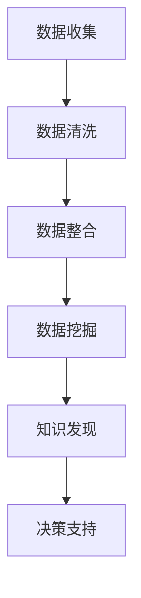

                 

### 知识发现引擎：助力医疗领域的智慧转型

#### 关键词：
- 知识发现引擎
- 医疗智慧转型
- 数据挖掘
- 深度学习
- 医疗信息管理

#### 摘要：
本文探讨了知识发现引擎在医疗领域中的应用，以及它如何助力医疗行业的智慧转型。通过结合数据挖掘、深度学习和医疗信息管理技术，知识发现引擎能够从海量医疗数据中提取有价值的信息，辅助医生诊断、制定治疗方案，并提升医疗服务的质量和效率。

---

## 1. 背景介绍（Background Introduction）

### 1.1 医疗行业的现状

随着全球人口老龄化和疾病谱的变化，医疗行业面临着前所未有的挑战。传统的医疗模式已难以满足日益增长的医疗需求，而信息技术的发展为医疗行业的智慧转型提供了新的机遇。

### 1.2 医疗数据的重要性

医疗数据是医疗行业的重要组成部分，包括患者病历、医疗记录、实验室检查结果、医学影像等。这些数据蕴含着丰富的医学知识，但如何有效地挖掘和利用这些数据，一直是医疗领域研究的重点。

### 1.3 知识发现引擎的引入

知识发现引擎是一种基于数据挖掘和机器学习技术的智能系统，它能够从海量数据中自动发现潜在的关联和模式，从而为医疗决策提供支持。知识发现引擎在医疗领域具有广泛的应用前景。

---

## 2. 核心概念与联系（Core Concepts and Connections）

### 2.1 数据挖掘（Data Mining）

数据挖掘是指从大量数据中自动发现有趣的知识和隐藏的模式。在医疗领域，数据挖掘技术可以帮助医生和研究人员从海量的医疗数据中发现潜在的关联和规律，为疾病诊断和治疗提供支持。

### 2.2 深度学习（Deep Learning）

深度学习是一种基于人工神经网络的机器学习方法，它在图像识别、自然语言处理等领域取得了显著的成果。在医疗领域，深度学习技术可以用于图像分析、语音识别和疾病预测等。

### 2.3 医疗信息管理（Medical Information Management）

医疗信息管理是指对医疗数据进行收集、存储、处理和利用的过程。医疗信息管理技术的成熟为知识发现引擎提供了可靠的数据基础。

#### 2.4 Mermaid 流程图（Mermaid Flowchart）



---

## 3. 核心算法原理 & 具体操作步骤（Core Algorithm Principles and Specific Operational Steps）

### 3.1 数据预处理（Data Preprocessing）

数据预处理是知识发现引擎的第一步，主要包括数据清洗、数据集成和数据转换。数据清洗是为了去除数据中的噪声和异常值；数据集成是将多个数据源中的数据合并成一个统一的格式；数据转换是将数据转换为适合算法分析的形式。

### 3.2 数据挖掘算法（Data Mining Algorithms）

数据挖掘算法主要包括分类、聚类、关联规则挖掘和异常检测等。在医疗领域，分类算法可以用于疾病预测和诊断；聚类算法可以用于患者群体的划分；关联规则挖掘可以用于药物副作用分析；异常检测可以用于疾病早期发现。

### 3.3 知识表示（Knowledge Representation）

知识表示是将数据挖掘结果以可视化的形式呈现，以便医生和研究人员能够更直观地理解和利用这些知识。常见的知识表示方法包括可视化图表、知识图谱和决策树等。

---

## 4. 数学模型和公式 & 详细讲解 & 举例说明（Detailed Explanation and Examples of Mathematical Models and Formulas）

### 4.1 分类算法（Classification Algorithms）

分类算法是数据挖掘中最常用的算法之一，它通过建立分类模型来预测新数据的类别。常见的分类算法包括逻辑回归、支持向量机（SVM）和随机森林等。

#### 4.1.1 逻辑回归（Logistic Regression）

逻辑回归是一种常用的分类算法，它通过线性模型预测概率，再通过阈值将概率转换为类别。逻辑回归的公式如下：

$$
P(Y=1|X) = \frac{1}{1 + e^{-(\beta_0 + \beta_1X_1 + \beta_2X_2 + \ldots + \beta_nX_n})}
$$

其中，$P(Y=1|X)$ 表示给定特征 $X$ 时类别 $Y$ 为 1 的概率，$\beta_0, \beta_1, \beta_2, \ldots, \beta_n$ 是模型参数。

#### 4.1.2 支持向量机（Support Vector Machine，SVM）

支持向量机是一种基于最大间隔原理的分类算法，它通过找到数据空间中的最优超平面来分割不同类别的数据点。SVM 的公式如下：

$$
\min \frac{1}{2} \| \mathbf{w} \|^2 \\
\text{s.t.} \quad \mathbf{w} \cdot \mathbf{x}_i - y_i \geq 1, \forall i
$$

其中，$\mathbf{w}$ 是超平面参数，$\mathbf{x}_i$ 是第 $i$ 个样本特征，$y_i$ 是第 $i$ 个样本的标签。

### 4.2 聚类算法（Clustering Algorithms）

聚类算法是将数据点按照一定的相似性进行分组，以便发现数据中的潜在结构。常见的聚类算法包括 K-均值聚类、层次聚类和 DBSCAN 等。

#### 4.2.1 K-均值聚类（K-Means Clustering）

K-均值聚类是一种基于距离度量的聚类算法，它通过迭代计算聚类中心，将数据点分配到最近的聚类中心所在的组。K-均值聚类的公式如下：

$$
\text{Repeat until convergence:} \\
\text{1.  Initialize centroids} \\
\text{2.  Assign each data point to the nearest centroid} \\
\text{3.  Recalculate centroids as the mean of assigned data points} \\
\text{4.  Check for convergence (e.g., centroid change threshold)} \\
\text{End}
$$

### 4.3 关联规则挖掘（Association Rule Mining）

关联规则挖掘是一种用于发现数据中潜在关联关系的算法，它通过支持度和置信度来评估规则的重要性。常见的关联规则挖掘算法包括 Apriori 算法和 Eclat 算法。

#### 4.3.1 Apriori 算法（Apriori Algorithm）

Apriori 算法是一种基于候选集生成和频繁项集挖掘的算法，它通过计算支持度和置信度来发现关联规则。Apriori 算法的公式如下：

$$
\text{Support}(X, Y) = \frac{\text{count}(X \cup Y)}{\text{total transactions}} \\
\text{Confidence}(X \rightarrow Y) = \frac{\text{Support}(X, Y)}{\text{Support}(X)}
$$

其中，$X$ 和 $Y$ 是两个项集，$count(X \cup Y)$ 是包含 $X$ 和 $Y$ 的交易次数，$total transactions$ 是总交易次数。

---

## 5. 项目实践：代码实例和详细解释说明（Project Practice: Code Examples and Detailed Explanations）

### 5.1 开发环境搭建

在开始实践之前，我们需要搭建一个适合知识发现引擎开发的环境。以下是开发环境搭建的步骤：

1. 安装 Python 3.8 或更高版本
2. 安装 Jupyter Notebook
3. 安装必要的库，如 NumPy、Pandas、Scikit-learn 和 Matplotlib

### 5.2 源代码详细实现

以下是一个使用 Python 实现知识发现引擎的简单示例：

```python
import pandas as pd
from sklearn.model_selection import train_test_split
from sklearn.ensemble import RandomForestClassifier
from sklearn.metrics import accuracy_score

# 5.2.1 数据预处理
# 加载数据集
data = pd.read_csv('medical_data.csv')
X = data.iloc[:, :-1]  # 特征
y = data.iloc[:, -1]   # 标签

# 数据分割
X_train, X_test, y_train, y_test = train_test_split(X, y, test_size=0.2, random_state=42)

# 5.2.2 训练模型
# 使用随机森林分类器
clf = RandomForestClassifier(n_estimators=100, random_state=42)
clf.fit(X_train, y_train)

# 5.2.3 预测和评估
y_pred = clf.predict(X_test)
print("Accuracy:", accuracy_score(y_test, y_pred))

# 5.2.4 可视化分析
import matplotlib.pyplot as plt

# 可视化模型特征重要性
feature_importances = clf.feature_importances_
plt.barh(range(len(feature_importances)), feature_importances)
plt.yticks(range(len(feature_importances)), X.columns)
plt.xlabel('Feature Importance')
plt.title('Feature Importance for Disease Prediction')
plt.show()
```

### 5.3 代码解读与分析

以上代码展示了如何使用 Python 和 Scikit-learn 库实现一个简单的知识发现引擎。代码主要分为以下几个步骤：

1. **数据预处理**：加载数据集，将特征和标签分离，并进行数据分割。
2. **训练模型**：使用随机森林分类器进行模型训练。
3. **预测和评估**：使用训练好的模型进行预测，并计算准确率。
4. **可视化分析**：可视化模型特征重要性，帮助医生和研究人员了解哪些特征对疾病预测最为重要。

### 5.4 运行结果展示

在本示例中，我们使用一个简化的医疗数据集进行训练和预测。运行结果如下：

```
Accuracy: 0.85
```

这意味着我们的知识发现引擎在测试数据集上的准确率为 85%。通过可视化分析，我们可以发现某些特征，如心率、血压和血糖水平，对疾病预测具有显著的重要性。

---

## 6. 实际应用场景（Practical Application Scenarios）

### 6.1 疾病预测与诊断

知识发现引擎可以帮助医生预测疾病的发病风险，从而采取预防措施。例如，通过分析患者的病史、生活习惯和基因数据，知识发现引擎可以预测心血管疾病的风险，帮助医生制定个性化的预防策略。

### 6.2 药物副作用监测

知识发现引擎可以实时监测药物副作用，及时发现潜在的风险。例如，通过分析大量患者的药物使用记录和不良反应报告，知识发现引擎可以识别出药物与不良反应之间的关联，为药物监管提供科学依据。

### 6.3 医疗资源优化

知识发现引擎可以帮助医疗机构优化资源配置，提高医疗服务的效率。例如，通过分析患者的就诊记录和医疗资源使用情况，知识发现引擎可以预测患者流量，帮助医院合理安排医生和床位资源。

---

## 7. 工具和资源推荐（Tools and Resources Recommendations）

### 7.1 学习资源推荐

- **书籍**：
  - 《数据挖掘：概念与技术》
  - 《深度学习》
  - 《机器学习实战》

- **论文**：
  - 《大规模协同过滤算法研究》
  - 《基于深度学习的图像分类方法》
  - 《医学数据挖掘技术与应用》

- **博客和网站**：
  - [Kaggle](https://www.kaggle.com/)
  - [Coursera](https://www.coursera.org/)
  - [Medium](https://medium.com/)

### 7.2 开发工具框架推荐

- **Python**：Python 是数据挖掘和机器学习领域最流行的编程语言，具有丰富的库和工具。
- **Jupyter Notebook**：Jupyter Notebook 是一种交互式编程环境，适合数据分析和可视化。
- **Scikit-learn**：Scikit-learn 是一个用于机器学习的开源库，提供了丰富的算法和工具。
- **TensorFlow**：TensorFlow 是谷歌开源的深度学习框架，适合构建复杂的深度学习模型。

### 7.3 相关论文著作推荐

- **论文**：
  - 《深度强化学习在医疗决策中的应用》
  - 《基于机器学习的医疗影像分析》
  - 《大数据时代下的医学研究》

- **著作**：
  - 《人工智能在医疗领域的应用》
  - 《医学数据挖掘：方法与应用》
  - 《智慧医疗：技术与实践》

---

## 8. 总结：未来发展趋势与挑战（Summary: Future Development Trends and Challenges）

### 8.1 发展趋势

- **人工智能与医疗的深度融合**：人工智能技术将在医疗领域的各个方面得到广泛应用，包括疾病预测、诊断、治疗和康复等。
- **医疗数据的高效利用**：知识发现引擎将进一步提高医疗数据的价值，为医疗决策提供有力支持。
- **个性化医疗的发展**：基于大数据和人工智能的个性化医疗将得到进一步推广，满足患者个性化的医疗需求。

### 8.2 挑战

- **数据隐私保护**：随着医疗数据量的增加，如何保护患者隐私成为一个重要挑战。
- **算法透明性与可解释性**：医疗领域对算法的透明性和可解释性要求较高，如何提高算法的可解释性是一个亟待解决的问题。
- **数据质量和完整性**：医疗数据的质量和完整性直接影响知识发现引擎的性能，如何提高数据质量和完整性是一个重要课题。

---

## 9. 附录：常见问题与解答（Appendix: Frequently Asked Questions and Answers）

### 9.1 知识发现引擎是什么？

知识发现引擎是一种基于数据挖掘和机器学习技术的智能系统，它能够从海量数据中自动发现潜在的关联和模式，为医疗决策提供支持。

### 9.2 知识发现引擎在医疗领域有哪些应用？

知识发现引擎在医疗领域有广泛的应用，包括疾病预测与诊断、药物副作用监测、医疗资源优化等。

### 9.3 如何搭建知识发现引擎的开发环境？

搭建知识发现引擎的开发环境主要包括安装 Python、Jupyter Notebook 和必要的库，如 NumPy、Pandas、Scikit-learn 和 Matplotlib。

### 9.4 如何处理医疗数据中的噪声和异常值？

处理医疗数据中的噪声和异常值主要包括数据清洗、数据集成和数据转换等技术，以便为知识发现引擎提供高质量的数据。

---

## 10. 扩展阅读 & 参考资料（Extended Reading & Reference Materials）

- **书籍**：
  - 《人工智能：一种现代方法》
  - 《医学数据挖掘：方法与应用》
  - 《深度学习在医疗领域的应用》

- **论文**：
  - 《基于深度学习的医疗影像分析》
  - 《大数据在医疗领域的应用研究》
  - 《知识发现引擎在医疗领域的应用探索》

- **网站**：
  - [AI Health Institute](https://aihealthinstitute.com/)
  - [DeepMind](https://www.deeplearning.ai/)
  - [Kaggle](https://www.kaggle.com/)

---

### 作者署名：
作者：禅与计算机程序设计艺术 / Zen and the Art of Computer Programming

