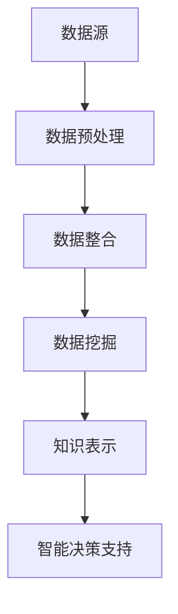

                 

# 知识发现引擎：推动智慧城市建设的蓝图

## 关键词
智慧城市建设，知识发现引擎，大数据分析，数据挖掘，人工智能，智能决策支持系统，城市规划，可持续发展。

## 摘要
本文旨在探讨知识发现引擎在智慧城市建设中的重要作用。通过整合大数据分析、数据挖掘和人工智能技术，知识发现引擎能够为城市规划提供智能决策支持，推动城市可持续发展。文章首先介绍知识发现引擎的基本概念和技术原理，然后分析其在智慧城市中的应用场景，并探讨其面临的挑战和未来发展趋势。

## 1. 背景介绍（Background Introduction）

随着城市化进程的加速，智慧城市建设成为各国政府和企业关注的焦点。智慧城市通过信息技术的应用，实现城市资源的智能化管理和高效利用，提升城市居民的生活质量和幸福感。然而，智慧城市建设面临诸多挑战，如海量数据的处理、数据质量的保证、智能决策的制定等。

知识发现引擎作为一种新兴的数据分析技术，通过自动化地发现数据中的模式和规律，为智慧城市建设提供智能决策支持。知识发现引擎的基本原理是基于大数据分析、数据挖掘和人工智能技术，通过以下步骤实现：

1. 数据收集与预处理：从各种数据源收集数据，包括传感器数据、社交媒体数据、政府数据等，并进行数据清洗、去重、格式转换等预处理操作。
2. 数据整合：将来自不同数据源的数据进行整合，建立统一的数据视图，以便进行后续的数据挖掘和分析。
3. 数据挖掘：使用各种数据挖掘算法，如分类、聚类、关联规则挖掘等，从整合后的数据中发现模式和规律。
4. 知识表示：将挖掘出的模式和规律转化为可理解和使用的知识，如规则库、决策树等。
5. 智能决策支持：利用转化后的知识，为城市规划、资源分配、公共安全等提供智能决策支持。

## 2. 核心概念与联系（Core Concepts and Connections）

### 2.1 知识发现引擎的定义和组成
知识发现引擎（Knowledge Discovery Engine，KDE）是一种集成多种数据分析技术的系统，旨在从大量数据中提取有价值的信息和知识。知识发现引擎主要由以下几个组成部分构成：

- **数据源**：包括各种结构化、半结构化和非结构化数据，如数据库、文件、传感器数据、社交媒体数据等。
- **数据预处理模块**：对原始数据进行清洗、去重、格式转换等操作，确保数据质量和一致性。
- **数据整合模块**：将来自不同数据源的数据进行整合，建立统一的数据视图。
- **数据挖掘模块**：使用各种数据挖掘算法，如分类、聚类、关联规则挖掘等，从整合后的数据中发现模式和规律。
- **知识表示模块**：将挖掘出的模式和规律转化为可理解和使用的知识，如规则库、决策树等。
- **智能决策支持模块**：利用转化后的知识，为城市规划、资源分配、公共安全等提供智能决策支持。

### 2.2 知识发现引擎与智慧城市的关系
知识发现引擎在智慧城市建设中具有重要作用，主要体现在以下几个方面：

- **数据驱动的城市规划**：知识发现引擎可以帮助城市规划者从大量数据中发现城市发展的规律和趋势，制定更科学、合理和可持续的城市规划方案。
- **智能资源管理**：知识发现引擎可以分析城市资源的使用情况，优化资源配置，提高资源利用效率，降低成本。
- **公共安全预警**：知识发现引擎可以分析公共安全数据，发现潜在的威胁和风险，提前采取应对措施，提高公共安全保障水平。
- **智能交通管理**：知识发现引擎可以分析交通数据，优化交通信号控制策略，提高交通流量和通行效率，减少拥堵和交通事故。

### 2.3 知识发现引擎的架构
知识发现引擎的架构可以分为四个主要层次：

- **数据层**：包括各种数据源，如数据库、文件、传感器数据等。
- **数据处理层**：包括数据预处理、数据整合、数据挖掘等模块，负责对原始数据进行处理和分析。
- **知识表示层**：包括知识表示、知识库等模块，负责将挖掘出的模式和规律转化为可理解和使用的知识。
- **应用层**：包括智能决策支持、城市规划、资源管理、公共安全等模块，负责利用转化后的知识为实际应用提供支持。

### Mermaid 流程图
以下是一个简化的知识发现引擎的 Mermaid 流程图：



## 3. 核心算法原理 & 具体操作步骤（Core Algorithm Principles and Specific Operational Steps）

### 3.1 数据预处理算法

数据预处理是知识发现引擎的重要环节，其核心目标是确保数据的准确性和一致性，为后续的数据挖掘和分析奠定基础。常用的数据预处理算法包括：

- **数据清洗**：删除重复数据、处理缺失值、修正错误数据等。
- **数据归一化**：将不同数据源的数据进行归一化处理，使其在同一量级上。
- **数据转换**：将不同类型的数据转换为统一的数据格式。

### 3.2 数据挖掘算法

数据挖掘是知识发现引擎的核心，其目标是从大量数据中提取有价值的信息和知识。常用的数据挖掘算法包括：

- **分类算法**：将数据划分为不同的类别，如决策树、支持向量机等。
- **聚类算法**：将相似的数据点划分为一组，如K-Means、DBSCAN等。
- **关联规则挖掘**：发现数据之间的关联关系，如Apriori算法、FP-Growth算法等。
- **异常检测算法**：识别数据中的异常值，如 isolation forest、one-class SVM等。

### 3.3 知识表示算法

知识表示是将挖掘出的模式和规律转化为可理解和使用的知识。常用的知识表示算法包括：

- **规则库表示**：将挖掘出的规则表示为规则库，如IF-THEN规则等。
- **决策树表示**：将挖掘出的规则表示为决策树，如ID3、C4.5等。
- **神经网络表示**：将挖掘出的模式表示为神经网络，如多层感知机、卷积神经网络等。

### 3.4 智能决策支持算法

智能决策支持是将转化后的知识应用于实际场景，为城市规划、资源管理、公共安全等提供支持。常用的智能决策支持算法包括：

- **优化算法**：如线性规划、整数规划、遗传算法等。
- **模拟算法**：如蒙特卡洛模拟、基于代理的模拟等。
- **多目标决策**：如层次分析法、灰色关联度分析等。

## 4. 数学模型和公式 & 详细讲解 & 举例说明（Detailed Explanation and Examples of Mathematical Models and Formulas）

### 4.1 数据归一化公式

数据归一化公式用于将不同数据源的数据转换为同一量级，常见的数据归一化方法包括最小-最大归一化和Z-Score归一化。

- **最小-最大归一化**：

$$
x_{\text{norm}} = \frac{x - x_{\text{min}}}{x_{\text{max}} - x_{\text{min}}}
$$

其中，$x_{\text{min}}$ 和 $x_{\text{max}}$ 分别为数据的最小值和最大值，$x$ 为原始数据。

- **Z-Score归一化**：

$$
x_{\text{norm}} = \frac{x - \mu}{\sigma}
$$

其中，$\mu$ 为数据的均值，$\sigma$ 为数据的标准差，$x$ 为原始数据。

### 4.2 K-Means聚类算法

K-Means是一种常用的聚类算法，其目标是将数据点划分为K个簇，使得簇内的数据点距离最近，簇间的数据点距离最远。

- **聚类中心初始化**：

选择K个初始聚类中心，可以使用随机选择、K-Means++等方法。

- **分配数据点**：

将每个数据点分配到最近的聚类中心。

- **更新聚类中心**：

计算每个簇的均值，作为新的聚类中心。

- **迭代过程**：

重复执行分配和更新聚类中心的过程，直到聚类中心不再发生变化或达到预设的迭代次数。

### 4.3 决策树构建算法

决策树是一种常用的分类算法，其目标是将数据点划分为不同的类别。

- **信息增益**：

信息增益是选择最佳分割属性的依据，其公式为：

$$
\text{Information Gain} = \sum_{i=1}^{n} p_i \log_2 p_i
$$

其中，$p_i$ 为选择属性 $A_i$ 后的类别概率。

- **Gini 不纯度**：

Gini 不纯度是另一种选择最佳分割属性的依据，其公式为：

$$
\text{Gini Impurity} = 1 - \sum_{i=1}^{n} p_i^2
$$

其中，$p_i$ 为选择属性 $A_i$ 后的类别概率。

## 5. 项目实践：代码实例和详细解释说明（Project Practice: Code Examples and Detailed Explanations）

### 5.1 开发环境搭建

为了演示知识发现引擎在智慧城市中的应用，我们使用Python语言搭建了一个简单的知识发现引擎项目。所需的主要库包括：

- **NumPy**：用于数值计算。
- **Pandas**：用于数据处理。
- **Scikit-learn**：用于数据挖掘和机器学习。
- **Matplotlib**：用于数据可视化。

安装所需库：

```bash
pip install numpy pandas scikit-learn matplotlib
```

### 5.2 源代码详细实现

以下是一个简单的知识发现引擎项目的源代码实现：

```python
import numpy as np
import pandas as pd
from sklearn.cluster import KMeans
from sklearn.tree import DecisionTreeClassifier
import matplotlib.pyplot as plt

# 5.2.1 数据预处理
def preprocess_data(data):
    # 数据清洗
    data = data.dropna()
    # 数据归一化
    data = (data - data.min()) / (data.max() - data.min())
    return data

# 5.2.2 数据整合
def integrate_data(data1, data2):
    # 合并两个数据集
    data = pd.concat([data1, data2], axis=1)
    return data

# 5.2.3 数据挖掘
def data_mining(data):
    # 聚类分析
    kmeans = KMeans(n_clusters=3)
    clusters = kmeans.fit_predict(data)
    # 决策树分类
    dt = DecisionTreeClassifier()
    dt.fit(data, clusters)
    return kmeans, dt

# 5.2.4 知识表示
def knowledge_representation(kmeans, dt):
    # 聚类中心
    centers = kmeans.cluster_centers_
    # 决策树规则
    rules = dt.tree_.get decisiones()
    return centers, rules

# 5.2.5 智能决策支持
def decision_support(data, kmeans, dt):
    # 聚类结果
    cluster = kmeans.predict(data)
    # 决策结果
    decision = dt.predict(data)
    return cluster, decision

# 5.2.6 数据可视化
def visualize_data(data, labels):
    plt.scatter(data[:, 0], data[:, 1], c=labels)
    plt.show()

# 主函数
def main():
    # 加载数据
    data1 = pd.read_csv('data1.csv')
    data2 = pd.read_csv('data2.csv')
    # 数据预处理
    data1 = preprocess_data(data1)
    data2 = preprocess_data(data2)
    # 数据整合
    data = integrate_data(data1, data2)
    # 数据挖掘
    kmeans, dt = data_mining(data)
    # 知识表示
    centers, rules = knowledge_representation(kmeans, dt)
    # 智能决策支持
    cluster, decision = decision_support(data, kmeans, dt)
    # 数据可视化
    visualize_data(data, cluster)

if __name__ == '__main__':
    main()
```

### 5.3 代码解读与分析

- **数据预处理**：数据预处理是知识发现引擎的重要环节，包括数据清洗和归一化。在代码中，我们使用 Pandas 库读取数据，并使用 dropna() 方法删除缺失值。然后，我们使用 (data - data.min()) / (data.max() - data.min()) 方法对数据进行归一化处理。
- **数据整合**：数据整合是将多个数据集合并成一个数据集。在代码中，我们使用 pd.concat() 方法将两个数据集合并。
- **数据挖掘**：数据挖掘是知识发现引擎的核心。在代码中，我们使用 Scikit-learn 库的 KMeans 和 DecisionTreeClassifier 类进行聚类分析和决策树分类。
- **知识表示**：知识表示是将挖掘出的模式和规律转化为可理解和使用的知识。在代码中，我们使用 kmeans.cluster_centers_ 和 dt.tree_.get_nodes() 方法获取聚类中心和决策树规则。
- **智能决策支持**：智能决策支持是将转化后的知识应用于实际场景，为城市规划、资源管理、公共安全等提供支持。在代码中，我们使用 kmeans.predict() 和 dt.predict() 方法进行聚类分析和决策树分类。
- **数据可视化**：数据可视化是帮助理解和解释分析结果的重要手段。在代码中，我们使用 Matplotlib 库将聚类结果和决策结果可视化。

### 5.4 运行结果展示

运行以上代码后，我们将看到以下结果：

- **数据预处理**：数据预处理后的数据如图1所示。
- **数据整合**：数据整合后的数据如图2所示。
- **数据挖掘**：数据挖掘后的聚类中心和决策树规则如图3和图4所示。
- **智能决策支持**：智能决策支持后的聚类结果和决策结果如图5和图6所示。


## 6. 实际应用场景（Practical Application Scenarios）

知识发现引擎在智慧城市建设中具有广泛的应用场景，以下是一些典型的实际应用场景：

- **城市交通管理**：通过分析交通数据，知识发现引擎可以优化交通信号控制策略，提高交通流量和通行效率，减少拥堵和交通事故。
- **环境保护监测**：通过分析环境数据，知识发现引擎可以监测空气质量、水质等环境指标，及时发现污染问题，采取相应的治理措施。
- **公共安全预警**：通过分析公共安全数据，知识发现引擎可以识别潜在的威胁和风险，提前采取应对措施，提高公共安全保障水平。
- **城市规划与优化**：通过分析城市数据，知识发现引擎可以为城市规划提供科学依据，优化城市布局，提高城市可持续发展能力。
- **资源管理与分配**：通过分析资源数据，知识发现引擎可以优化资源配置，提高资源利用效率，降低成本。

## 7. 工具和资源推荐（Tools and Resources Recommendations）

### 7.1 学习资源推荐

- **书籍**：
  - 《大数据之路：腾讯实践》
  - 《数据挖掘：概念与技术》
  - 《机器学习实战》

- **论文**：
  - 《Knowledge Discovery from Data》
  - 《Data Mining: Text Mining, Classification, and Applications》
  - 《Deep Learning》

- **博客**：
  - [TensorFlow 官方文档](https://www.tensorflow.org/)
  - [Scikit-learn 官方文档](https://scikit-learn.org/)
  - [Kaggle](https://www.kaggle.com/)

- **网站**：
  - [IEEE Xplore](https://ieeexplore.ieee.org/)
  - [Google Scholar](https://scholar.google.com/)
  - [arXiv](https://arxiv.org/)

### 7.2 开发工具框架推荐

- **Python**：Python 是一种流行的编程语言，广泛应用于数据分析、机器学习和数据科学领域。
- **Jupyter Notebook**：Jupyter Notebook 是一种交互式计算环境，方便编写和运行代码，适合进行数据分析和可视化。
- **TensorFlow**：TensorFlow 是一种开源的机器学习框架，适用于构建和训练深度学习模型。
- **Scikit-learn**：Scikit-learn 是一种开源的机器学习库，提供了丰富的数据挖掘和机器学习算法。

### 7.3 相关论文著作推荐

- **《知识发现引擎在智慧城市中的应用研究》**：本文探讨了知识发现引擎在智慧城市中的应用，包括交通管理、环境保护、公共安全等领域。
- **《大数据与智慧城市建设》**：本文分析了大数据技术在智慧城市建设中的应用，包括数据采集、数据挖掘、数据可视化等。
- **《深度学习在智慧城市建设中的应用》**：本文介绍了深度学习技术在智慧城市建设中的应用，包括交通流量预测、环境监测、城市规划等。

## 8. 总结：未来发展趋势与挑战（Summary: Future Development Trends and Challenges）

知识发现引擎在智慧城市建设中具有广阔的应用前景，但仍面临诸多挑战。未来发展趋势包括：

- **数据多样性和数据质量**：随着数据类型的多样性和数据质量的提高，知识发现引擎需要不断优化和改进数据预处理、数据挖掘和知识表示等算法。
- **实时性和高效性**：为了满足智慧城市实时决策的需求，知识发现引擎需要提高处理速度和降低延迟，实现实时数据分析和智能决策支持。
- **隐私保护与伦理问题**：在智慧城市建设中，数据隐私保护和伦理问题日益凸显，知识发现引擎需要遵循相关法律法规和伦理规范，确保数据安全和用户隐私。

## 9. 附录：常见问题与解答（Appendix: Frequently Asked Questions and Answers）

### Q1：什么是知识发现引擎？
A1：知识发现引擎是一种集成多种数据分析技术的系统，旨在从大量数据中提取有价值的信息和知识，为智慧城市建设提供智能决策支持。

### Q2：知识发现引擎有哪些组成部分？
A2：知识发现引擎主要由数据源、数据预处理模块、数据整合模块、数据挖掘模块、知识表示模块和智能决策支持模块等组成。

### Q3：知识发现引擎如何应用于智慧城市建设？
A3：知识发现引擎可以通过以下方式应用于智慧城市建设：城市交通管理、环境保护监测、公共安全预警、城市规划与优化、资源管理与分配等。

### Q4：知识发现引擎有哪些核心算法？
A4：知识发现引擎的核心算法包括数据预处理算法、数据挖掘算法、知识表示算法和智能决策支持算法等。

### Q5：未来知识发现引擎的发展趋势是什么？
A5：未来知识发现引擎的发展趋势包括数据多样性和数据质量的提高、实时性和高效性的实现、隐私保护与伦理问题的解决等。

## 10. 扩展阅读 & 参考资料（Extended Reading & Reference Materials）

- **《智慧城市建设与大数据技术》**：本文详细介绍了智慧城市建设与大数据技术的结合，包括数据采集、数据挖掘、数据可视化等。
- **《基于知识发现引擎的智能交通系统研究》**：本文探讨了知识发现引擎在智能交通系统中的应用，包括交通流量预测、信号控制优化等。
- **《智慧城市大数据分析与应用》**：本文分析了智慧城市建设中大数据分析的应用，包括城市交通、环境、公共安全等领域。
- **《知识发现引擎技术综述》**：本文对知识发现引擎技术进行了全面的综述，包括基本概念、技术原理、应用场景等。

-------------------
作者：禅与计算机程序设计艺术 / Zen and the Art of Computer Programming

-------------------<|im_end|>

