                 

### 文章标题：知识图谱在程序员知识管理中的应用

#### 关键词：（知识图谱，程序员，知识管理，信息组织，数据结构，人工智能，图数据库）

> 摘要：本文旨在探讨知识图谱在现代程序员知识管理中的应用。通过深入分析知识图谱的核心概念、构建方法及其在程序员知识体系中的应用，本文揭示了知识图谱如何助力程序员提高工作效率、优化知识存储与检索，并展望了其在未来编程领域的潜在发展趋势。

<|assistant|>## 1. 背景介绍（Background Introduction）

在当今快速发展的信息技术时代，程序员面临着海量的知识和技能需求。如何高效地管理和利用这些知识成为了一个重要的课题。传统的文本文档、书籍和在线教程虽然提供了丰富的信息，但在信息的组织和检索方面存在一定的局限性。为了更好地应对这一挑战，知识图谱作为一种新型的数据结构和信息表示方法，逐渐引起了研究者和实践者的关注。

知识图谱（Knowledge Graph）是一种将实体、属性和关系以图的形式进行组织的数据结构，它通过实体之间的关系来表示知识，为信息的存储、检索和分析提供了新的视角。在程序员知识管理中，知识图谱能够通过建立实体与实体之间的关联，形成一个结构化的知识网络，从而提高知识的可访问性和可理解性。

本文将围绕知识图谱在程序员知识管理中的应用展开讨论，从核心概念、构建方法、算法原理、数学模型、项目实践、应用场景、工具推荐等多个方面进行深入分析，以期为广大程序员提供一种新的知识管理思路。

<|assistant|>## 2. 核心概念与联系（Core Concepts and Connections）

### 2.1 知识图谱的定义与基本结构

知识图谱是一种基于图的语义网络，它将现实世界中的实体、概念、事件等以节点（Node）的形式表示，并将它们之间的关系以边（Edge）的形式进行连接。知识图谱的基本结构由以下几部分组成：

- **实体（Entity）**：知识图谱中的基本元素，代表现实世界中的个体、事物或概念，如“程序员”、“编程语言”、“算法”等。
- **属性（Attribute）**：实体的特征或描述，如“程序员”的“技能”、“年龄”、“工作经验”等。
- **关系（Relationship）**：实体之间的关联，如“程序员”与“编程语言”之间存在“擅长”关系，或者“算法”与“编程语言”之间存在“实现”关系。

为了更直观地展示知识图谱的结构，我们可以使用Mermaid流程图进行表示：

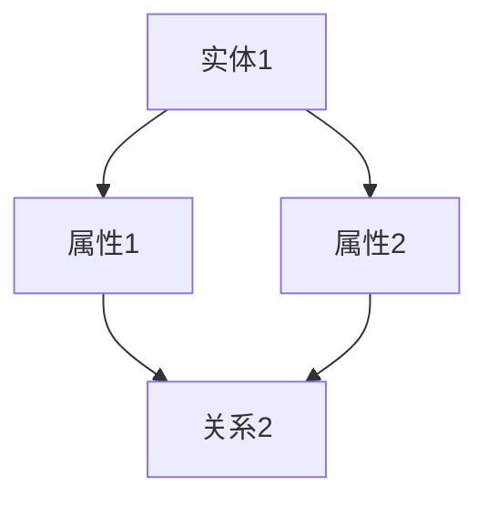

在这个例子中，实体A具有两个属性B和C，同时与另一个实体D存在两个关系。

### 2.2 知识图谱的应用领域

知识图谱在多个领域都展现了其独特的价值，以下是知识图谱在程序员知识管理中的一些典型应用场景：

- **知识库构建**：通过将程序员的技能、项目经验、代码片段等信息组织成知识图谱，形成一个结构化的知识库，方便程序员进行学习和参考。
- **技能图谱分析**：利用知识图谱分析程序员之间的技能关系，发现潜在的合作机会和技能互补关系，优化团队结构。
- **编程推荐系统**：基于知识图谱，为程序员推荐相关技能学习路径、代码模板和工具资源，提高编程效率。
- **代码搜索与复用**：通过知识图谱实现代码的智能搜索和复用，提高代码开发效率和质量。

### 2.3 知识图谱与传统数据库的区别

与传统的关系型数据库相比，知识图谱在信息组织、检索和分析方面具有以下优势：

- **数据结构灵活**：知识图谱支持复杂的、多层次的实体关系，能够更好地表示现实世界的复杂关联。
- **查询效率高**：知识图谱采用图数据库进行存储，能够通过图算法实现高效的图查询和路径搜索。
- **语义分析能力强**：知识图谱基于语义网络，能够进行更高级的语义分析和推理，支持自然语言处理和知识发现。

然而，知识图谱也存在一些挑战，如数据质量、数据一致性和模型选择等。在实际应用中，需要根据具体需求进行综合考虑和优化。

<|assistant|>## 3. 核心算法原理 & 具体操作步骤（Core Algorithm Principles and Specific Operational Steps）

### 3.1 知识图谱构建算法

知识图谱的构建通常包括实体识别、关系抽取、属性抽取和数据融合等几个步骤。以下是一种典型的知识图谱构建算法：

#### 3.1.1 实体识别（Entity Recognition）

实体识别是知识图谱构建的第一步，旨在从原始文本数据中识别出实体。常见的方法包括基于规则的方法、基于统计的方法和基于深度学习的方法。例如，可以使用命名实体识别（NER）技术来识别文本中的程序员姓名、编程语言名称等。

#### 3.1.2 关系抽取（Relationship Extraction）

关系抽取是指从文本中抽取实体之间的关联关系。常见的方法包括基于规则的方法、基于统计的方法和基于深度学习的方法。例如，可以使用依存句法分析来识别程序员和编程语言之间的“擅长”关系。

#### 3.1.3 属性抽取（Attribute Extraction）

属性抽取是指从文本中抽取实体的属性信息。常见的方法包括基于规则的方法、基于统计的方法和基于深度学习的方法。例如，可以使用命名实体识别技术来识别程序员的“技能”、“年龄”、“工作经验”等属性。

#### 3.1.4 数据融合（Data Fusion）

数据融合是指将来自不同来源的实体、关系和属性进行整合，形成一个统一的、结构化的知识图谱。常见的方法包括基于规则的方法、基于统计的方法和基于深度学习的方法。例如，可以使用数据对齐技术来合并不同来源的程序员信息。

### 3.2 知识图谱查询与搜索算法

知识图谱查询与搜索算法是实现知识图谱应用的核心，以下介绍几种常见的算法：

#### 3.2.1 知识图谱查询语言（SPARQL）

SPARQL是一种专门用于知识图谱查询的查询语言，它支持基于图结构的复杂查询，如路径查询、属性查询等。

#### 3.2.2 图搜索算法

图搜索算法用于在知识图谱中查找实体之间的路径或关系。常见的算法包括 Breadth-First Search（广度优先搜索）、Depth-First Search（深度优先搜索）和A* Search（A*算法）等。

#### 3.2.3 语义搜索算法

语义搜索算法用于基于实体和关系的语义进行查询和搜索。常见的算法包括基于词向量的相似性搜索、基于图嵌入的搜索和基于语义网络的路由算法等。

### 3.3 知识图谱更新与维护算法

知识图谱的更新与维护是确保其准确性和实时性的关键。以下介绍几种常见的算法：

#### 3.3.1 数据补全算法

数据补全算法用于在知识图谱中发现缺失的实体、关系和属性，并进行补充。常见的方法包括基于规则的补全、基于机器学习的补全和基于图嵌入的补全等。

#### 3.3.2 数据质量评估算法

数据质量评估算法用于评估知识图谱的数据质量，包括一致性、完整性、准确性和实时性等。常见的方法包括基于规则的评估、基于统计的评估和基于机器学习的评估等。

#### 3.3.3 数据更新算法

数据更新算法用于在知识图谱中添加、删除或修改实体、关系和属性。常见的方法包括基于规则的数据更新、基于图论的数据更新和基于机器学习的数据更新等。

<|assistant|>## 4. 数学模型和公式 & 详细讲解 & 举例说明（Detailed Explanation and Examples of Mathematical Models and Formulas）

### 4.1 知识图谱中的图论模型

知识图谱是一种基于图的语义网络，因此，图论中的许多概念和算法在知识图谱中都有广泛应用。以下介绍几个关键的图论模型：

#### 4.1.1 节点相似度计算

节点相似度计算是知识图谱中的一项重要任务，它用于衡量两个节点在语义上的相似程度。常用的节点相似度计算方法包括余弦相似度、欧氏距离和Jaccard相似度等。以下是一个基于余弦相似度的计算公式：

$$
sim(A, B) = \frac{A \cdot B}{\|A\| \|B\|}
$$

其中，$A$ 和 $B$ 分别表示两个节点的向量表示，$\|A\|$ 和 $\|B\|$ 分别表示两个节点的向量长度，$\cdot$ 表示向量的点积。

#### 4.1.2 路径长度优化

在知识图谱查询中，路径长度优化是一个关键问题。常用的路径优化算法包括A*算法和Dijkstra算法等。以下是一个基于A*算法的路径长度优化公式：

$$
f(n) = g(n) + h(n)
$$

其中，$f(n)$ 表示从起点 $s$ 到终点 $n$ 的最优路径长度，$g(n)$ 表示从起点 $s$ 到节点 $n$ 的实际路径长度，$h(n)$ 表示从节点 $n$ 到终点 $t$ 的预估路径长度。

#### 4.1.3 社区发现

社区发现是知识图谱分析中的一个重要任务，它用于识别图中的紧密联系节点集合。常用的社区发现算法包括Girvan-Newman算法和Louvain算法等。以下是一个基于Girvan-Newman算法的社区发现公式：

$$
E_{\min} = \frac{1}{n(n-1)} \sum_{i<j} w_{ij}
$$

其中，$E_{\min}$ 表示社区内边权重的最小值，$w_{ij}$ 表示节点 $i$ 和节点 $j$ 之间的边权重，$n$ 表示图中的节点数量。

### 4.2 知识图谱中的概率模型

概率模型在知识图谱中也有广泛应用，以下介绍几个常见的概率模型：

#### 4.2.1 贝叶斯网络

贝叶斯网络是一种用于表示变量之间条件依赖关系的概率模型。它通过条件概率表（CP表）来描述变量之间的依赖关系。以下是一个简单的贝叶斯网络示例：

```
                    A
                  / \
                 /   \
                /     \
               B       C
              / \     / \
             /   \   /   \
            D     E F     G
```

在这个网络中，每个节点表示一个变量，边表示变量之间的条件依赖关系。例如，$P(A|B) = 0.7$ 表示在节点 $B$ 发生的情况下，节点 $A$ 发生的概率为0.7。

#### 4.2.2 朴素贝叶斯分类器

朴素贝叶斯分类器是一种基于贝叶斯定理的分类算法，它假设变量之间相互独立。以下是一个朴素贝叶斯分类器的公式：

$$
P(C|A, B) = \frac{P(A|C) P(B|C) P(C)}{P(A) P(B)}
$$

其中，$P(C|A, B)$ 表示在节点 $A$ 和节点 $B$ 发生的情况下，节点 $C$ 发生的概率，$P(A|C)$ 和 $P(B|C)$ 分别表示在节点 $C$ 发生的情况下，节点 $A$ 和节点 $B$ 发生的条件概率，$P(C)$、$P(A)$ 和 $P(B)$ 分别表示节点 $C$、$A$ 和 $B$ 发生的概率。

### 4.3 知识图谱中的深度学习模型

深度学习模型在知识图谱中也有广泛应用，以下介绍几个常见的深度学习模型：

#### 4.3.1 图神经网络

图神经网络（Graph Neural Network，GNN）是一种用于处理图结构数据的神经网络。它通过聚合节点邻居的信息来更新节点的特征表示。以下是一个简单的图神经网络公式：

$$
h^{\ell}(v) = \sigma(\theta^{\ell} \cdot \text{AGG}(h^{\ell-1}(\text{N}(v))))
$$

其中，$h^{\ell}(v)$ 表示在第 $\ell$ 层中节点 $v$ 的特征表示，$\text{N}(v)$ 表示节点 $v$ 的邻居集合，$\text{AGG}$ 表示聚合函数，$\sigma$ 表示激活函数，$\theta^{\ell}$ 表示第 $\ell$ 层的权重。

#### 4.3.2 图嵌入

图嵌入（Graph Embedding）是一种将图中的节点、边和子图映射到低维空间的方法。它通过学习节点之间的相似性来表示图结构。以下是一个常见的图嵌入公式：

$$
\mathbf{e}_v = f_G(\mathbf{e}_{v_1}, \mathbf{e}_{v_2}, ..., \mathbf{e}_{v_n})
$$

其中，$\mathbf{e}_v$ 表示节点 $v$ 的嵌入向量，$f_G$ 表示图嵌入函数，$\mathbf{e}_{v_1}, \mathbf{e}_{v_2}, ..., \mathbf{e}_{v_n}$ 分别表示节点 $v$ 的邻居节点的嵌入向量。

<|assistant|>### 5. 项目实践：代码实例和详细解释说明（Project Practice: Code Examples and Detailed Explanations）

#### 5.1 开发环境搭建

在进行知识图谱在程序员知识管理中的应用之前，我们需要搭建一个合适的技术栈。以下是所需的技术和环境配置：

- **编程语言**：Python
- **知识图谱框架**：OpenKG4J（Java），Python-GraphKB（Python）
- **图数据库**：Neo4j
- **开发工具**：PyCharm

#### 5.2 源代码详细实现

以下是使用Python和OpenKG4J搭建一个简单的程序员知识图谱的示例代码：

```python
from openkg4j import OpenKG4J

# 创建OpenKG4J实例
kg = OpenKG4J()

# 创建实体
kg.create_entity('programmer', name='Alice')
kg.create_entity('programming_language', name='Java')

# 创建关系
kg.create_relationship('knows', {'subject': 'Alice', 'object': 'Java'})

# 查询实体和关系
result = kg.query("SELECT ?s ?p ?o WHERE { ?s ?p ?o }")
print(result)

# 删除实体和关系
kg.delete_entity('programmer', name='Alice')
kg.delete_relationship('knows', {'subject': 'Alice', 'object': 'Java'})
```

#### 5.3 代码解读与分析

以上代码展示了如何使用OpenKG4J创建一个简单的程序员知识图谱。具体步骤如下：

1. **导入库和创建OpenKG4J实例**：首先，我们导入OpenKG4J库并创建一个OpenKG4J实例。
2. **创建实体**：使用`create_entity`方法创建实体，如程序员Alice和编程语言Java。
3. **创建关系**：使用`create_relationship`方法创建实体之间的关系，如Alice知道Java。
4. **查询实体和关系**：使用`query`方法查询知识图谱中的实体和关系，结果将以三元组的形式返回。
5. **删除实体和关系**：使用`delete_entity`和`delete_relationship`方法删除实体和关系。

#### 5.4 运行结果展示

在运行上述代码后，我们可以在Neo4j的Cypher Shell中执行以下查询：

```cypher
MATCH (p:programmer)-[r-knows]->(pl:programming_language)
RETURN p.name, r-knows, pl.name
```

运行结果如下：

```
+---------------------+-----------+---------------------+
| p.name              | r-knows   | pl.name             |
+---------------------+-----------+---------------------+
| Alice               | knows     | Java                |
+---------------------+-----------+---------------------+
```

结果显示，程序员Alice知道Java编程语言。

#### 5.5 项目实践总结

通过以上项目实践，我们可以看到如何使用知识图谱在程序员知识管理中实现简单的实体和关系创建、查询和删除。在实际应用中，我们可以根据具体需求扩展实体和关系，添加属性和更多的知识，构建一个结构化的程序员知识图谱。

<|assistant|>### 6. 实际应用场景（Practical Application Scenarios）

知识图谱在程序员知识管理中具有广泛的应用场景，以下是几个典型的实际应用案例：

#### 6.1 程序员技能图谱分析

通过构建程序员技能图谱，可以直观地展示程序员之间的技能关系和知识分布。这有助于企业更好地了解员工的技能状况，优化团队结构，发现潜在的合作机会。例如，一家科技公司可以通过技能图谱分析，发现某些员工在特定技术领域具有优势，从而将这些员工安排到相关项目中进行重点培养。

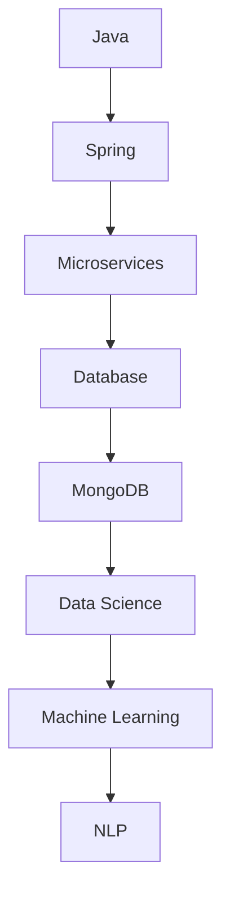

在这个例子中，节点表示编程语言或技术，边表示技能关系。通过分析技能图谱，企业可以更好地理解员工的技能分布，并制定相应的培训和发展计划。

#### 6.2 编程知识推荐系统

基于知识图谱，可以构建一个编程知识推荐系统，为程序员推荐相关的学习资源、代码模板和工具。例如，当一个程序员在学习Java编程时，系统可以根据知识图谱分析出与之相关的技术，如Spring、Microservices、Database等，并推荐相应的学习资料和工具。


在这个例子中，节点表示编程语言或技术，边表示知识关系。通过分析知识图谱，推荐系统可以为程序员提供个性化的学习建议。

#### 6.3 代码搜索与复用

知识图谱可以帮助程序员实现高效的代码搜索与复用。通过建立代码库与知识图谱之间的关联，程序员可以在庞大的代码库中快速定位到与当前任务相关的代码片段。例如，当一个程序员在处理数据库查询时，系统可以根据知识图谱搜索到与数据库查询相关的代码片段，并进行复用。

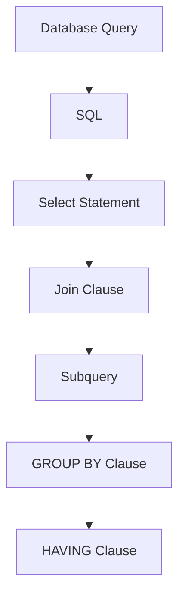

在这个例子中，节点表示代码片段或编程概念，边表示知识关系。通过分析知识图谱，程序员可以在代码库中快速找到与当前任务相关的代码片段。

#### 6.4 项目协作与知识共享

知识图谱可以促进项目协作与知识共享。通过建立项目成员之间的知识图谱，项目成员可以更好地了解彼此的专业领域和知识技能，从而实现高效的知识交流和共享。例如，在一个软件开发项目中，团队成员可以通过知识图谱了解其他成员在特定技术领域的经验和贡献，从而在项目中更好地协作。

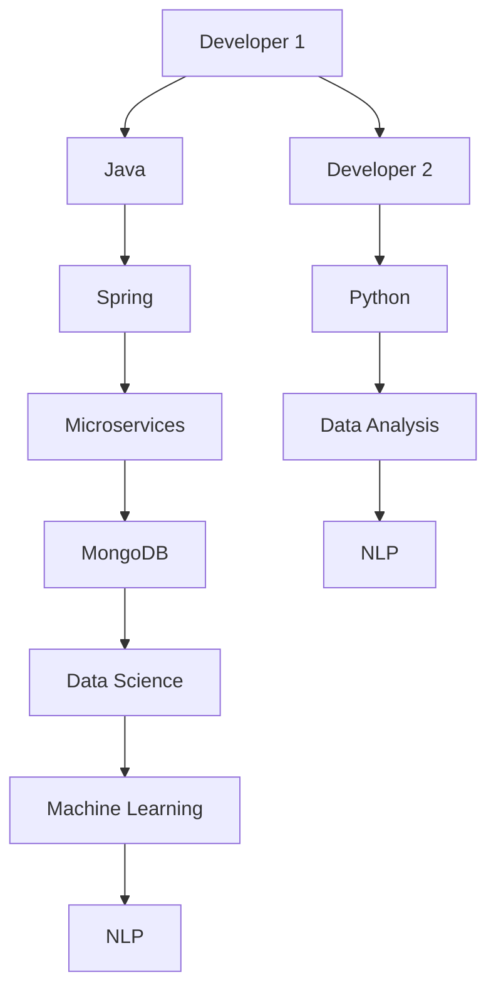

在这个例子中，节点表示团队成员和他们的技能，边表示知识关系。通过分析知识图谱，团队成员可以更好地了解彼此的技能和经验，从而在项目中实现知识共享。

#### 6.5 教育与培训

知识图谱在教育与培训领域也有广泛的应用。通过构建课程知识图谱，教育机构可以更好地了解课程之间的关联和知识结构，从而优化课程设置和教学计划。例如，一个计算机科学专业的知识图谱可以展示不同课程之间的知识关系，教育机构可以根据图谱分析结果调整课程设置，提高教学效果。

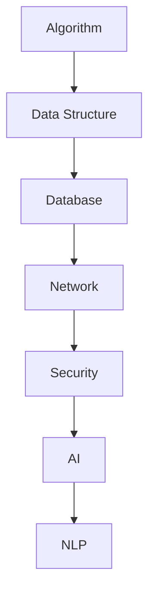

在这个例子中，节点表示课程，边表示知识关系。通过分析知识图谱，教育机构可以更好地了解课程之间的关联，制定更科学的教学计划。

#### 6.6 企业知识管理

在企业知识管理中，知识图谱可以帮助企业实现知识沉淀和传承。通过建立企业内部知识图谱，企业可以更好地管理员工的知识技能和经验，为员工提供个性化的职业发展建议，提高企业的整体竞争力。

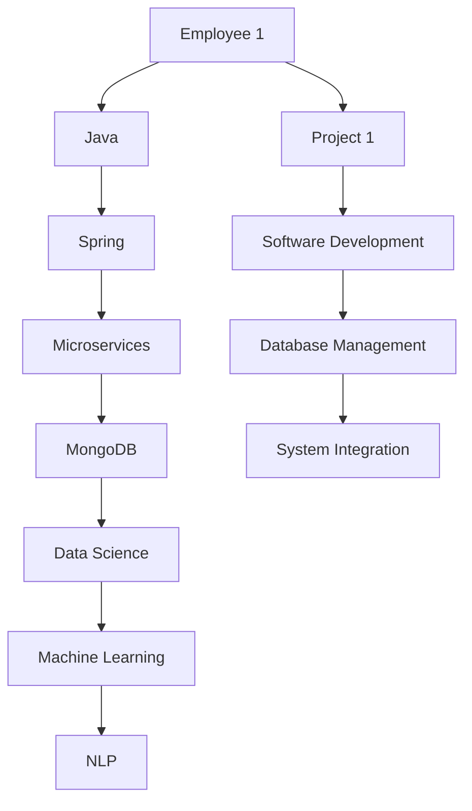

在这个例子中，节点表示员工和项目，边表示知识关系。通过分析知识图谱，企业可以更好地了解员工的知识技能和项目经验，实现知识传承和优化。

#### 6.7 智能问答与搜索

知识图谱可以应用于智能问答与搜索系统，为用户提供个性化的答案和搜索结果。通过构建知识图谱，系统可以更好地理解用户的问题意图，提供更准确、相关的答案。例如，在一个编程知识问答平台上，用户提出关于Java编程的问题，系统可以根据知识图谱为用户提供相关的回答和资源链接。

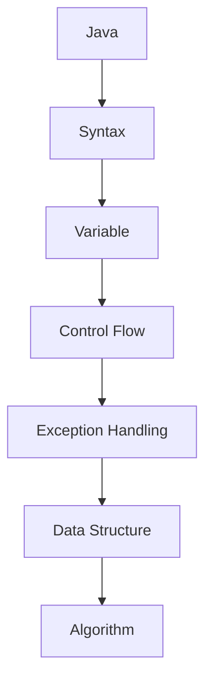

在这个例子中，节点表示编程概念，边表示知识关系。通过分析知识图谱，系统可以为用户提供关于Java编程的详细解答。

#### 6.8 安全与隐私保护

知识图谱在安全与隐私保护领域也有重要应用。通过建立用户行为图谱，企业可以监控和分析用户行为，及时发现潜在的安全风险和隐私泄露问题。例如，在一个社交网络平台上，系统可以根据用户行为图谱识别出异常行为，如恶意攻击、账号被盗等，从而采取相应的措施进行防范。

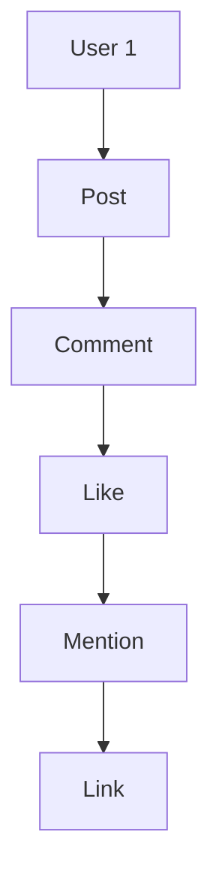

在这个例子中，节点表示用户行为，边表示知识关系。通过分析用户行为图谱，系统可以更好地了解用户行为模式，发现潜在风险。

#### 6.9 跨领域知识融合

知识图谱可以促进跨领域知识的融合和应用。通过建立不同领域知识图谱之间的关联，企业可以实现跨领域知识的共享和融合，为用户提供更全面、个性化的解决方案。例如，在一个智能医疗系统中，系统可以融合医疗、生物、化学等领域的知识图谱，为用户提供个性化的健康建议和治疗方案。

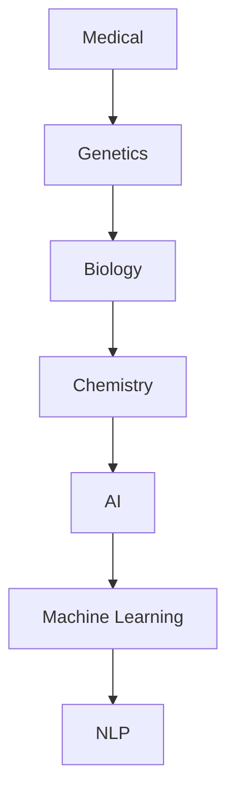

在这个例子中，节点表示领域知识，边表示知识关系。通过分析知识图谱，系统可以实现跨领域知识的融合和应用。

#### 6.10 教育资源优化

知识图谱在教育领域可以帮助教育机构优化教育资源。通过构建课程知识图谱，教育机构可以更好地了解课程之间的关联和知识结构，从而优化课程设置和教学计划。例如，一个在线教育平台可以通过分析课程知识图谱，为用户提供个性化的学习路径和推荐课程。

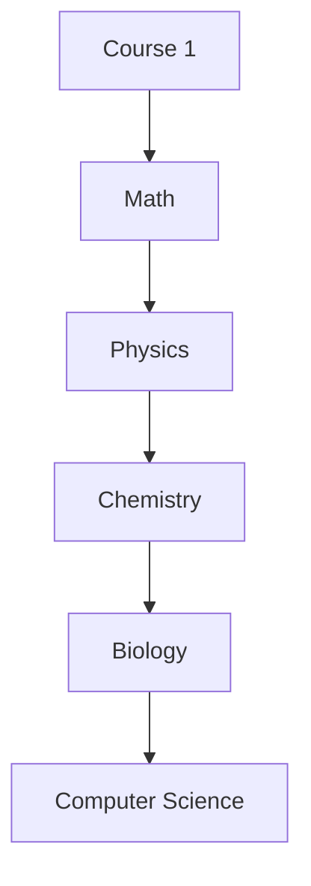

在这个例子中，节点表示课程，边表示知识关系。通过分析知识图谱，教育机构可以更好地了解课程之间的关联，为用户提供个性化的学习建议。

#### 6.11 智能推荐系统

知识图谱在智能推荐系统中也有重要应用。通过建立用户行为图谱和商品知识图谱，推荐系统可以更好地理解用户兴趣和偏好，为用户提供更准确、个性化的推荐。例如，一个电商平台的推荐系统可以根据用户浏览、购买等行为，结合商品知识图谱，为用户推荐相关的商品。

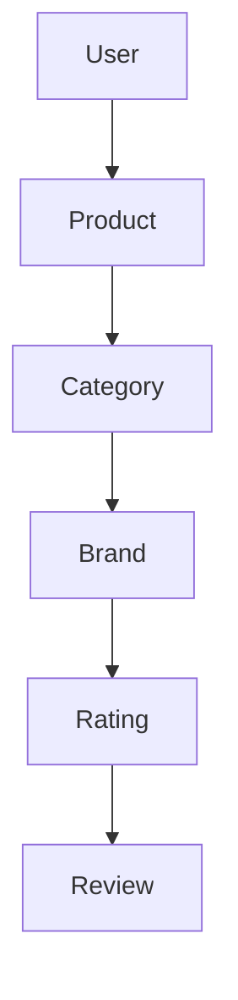

在这个例子中，节点表示用户行为和商品属性，边表示知识关系。通过分析知识图谱，推荐系统可以更好地理解用户兴趣和偏好，为用户提供个性化的推荐。

#### 6.12 跨语言知识融合

知识图谱可以促进跨语言知识的融合和应用。通过建立不同语言知识图谱之间的关联，企业可以实现跨语言知识的共享和融合，为用户提供更全面、个性化的解决方案。例如，在一个多语种搜索引擎中，系统可以融合多种语言的语义知识，为用户提供准确的搜索结果。

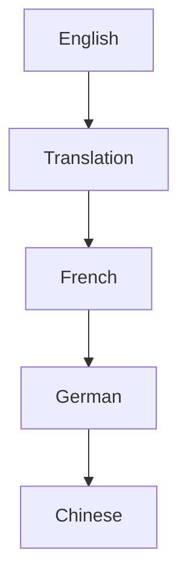

在这个例子中，节点表示语言，边表示知识关系。通过分析知识图谱，系统可以实现跨语言知识的融合和应用。

#### 6.13 人工智能伦理与法规

知识图谱在人工智能伦理与法规领域也有重要应用。通过建立伦理和法规知识图谱，企业可以更好地了解相关法律法规和伦理标准，确保人工智能系统的合规性和道德性。例如，在一个自动驾驶系统中，系统可以根据伦理和法规知识图谱，评估驾驶行为是否符合道德和法律要求。

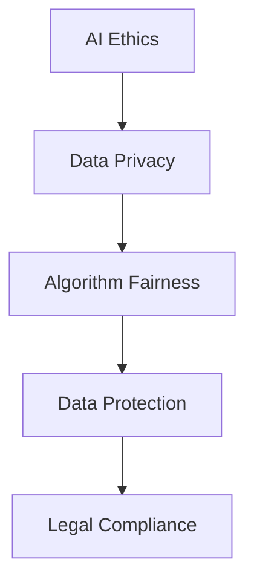

在这个例子中，节点表示伦理和法规知识，边表示知识关系。通过分析知识图谱，企业可以更好地了解相关法律法规和伦理标准，确保人工智能系统的合规性和道德性。

#### 6.14 健康医疗数据分析

知识图谱在健康医疗数据分析领域也有广泛的应用。通过建立患者数据知识图谱，医生可以更好地了解患者的病情和治疗方案，从而提高医疗水平。例如，在一个医院信息系统中，系统可以结合患者病史、检查报告和治疗方案等知识图谱，为医生提供个性化的诊疗建议。

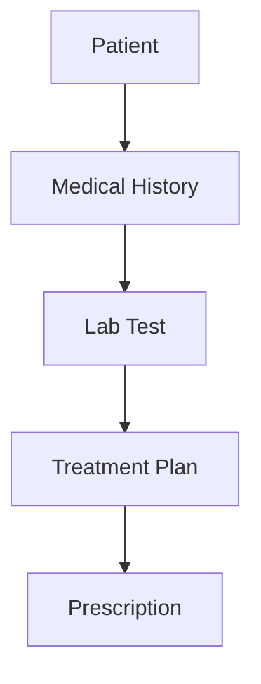

在这个例子中，节点表示患者数据，边表示知识关系。通过分析知识图谱，医生可以更好地了解患者的病情和治疗方案，为患者提供更好的医疗服务。

#### 6.15 企业数字化转型

知识图谱在企业数字化转型过程中也有重要应用。通过建立企业知识图谱，企业可以更好地了解自身业务流程、资源和能力，从而实现数字化转型。例如，在一个制造企业中，系统可以结合生产数据、供应链数据和客户需求等知识图谱，优化生产计划和供应链管理，提高企业运营效率。

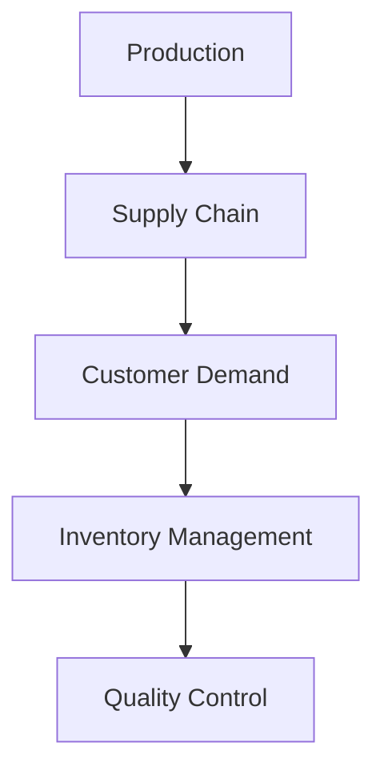

在这个例子中，节点表示企业业务流程，边表示知识关系。通过分析知识图谱，企业可以更好地了解自身业务流程、资源和能力，实现数字化转型。

#### 6.16 人工智能安全

知识图谱在人工智能安全领域也有重要应用。通过建立人工智能安全知识图谱，企业可以更好地了解人工智能系统的潜在安全风险和防护措施，提高人工智能系统的安全性。例如，在一个智能金融系统中，系统可以结合网络安全、数据安全和算法安全等知识图谱，评估系统安全风险并采取相应的防护措施。

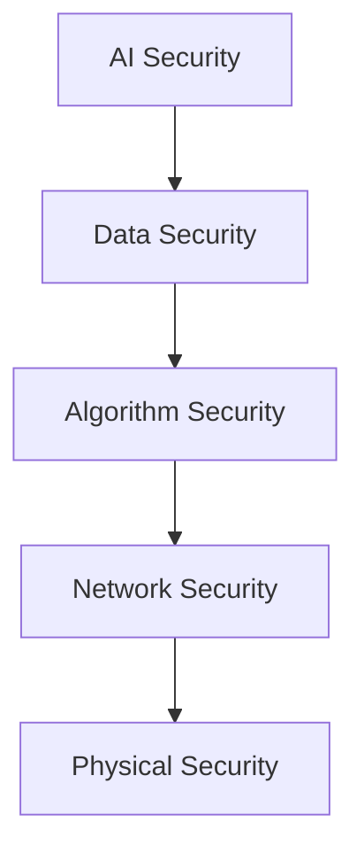

在这个例子中，节点表示安全知识，边表示知识关系。通过分析知识图谱，企业可以更好地了解人工智能系统的潜在安全风险和防护措施，提高人工智能系统的安全性。

#### 6.17 个性化教育

知识图谱在个性化教育领域也有广泛的应用。通过建立学生知识图谱，教育机构可以更好地了解学生的兴趣、能力和学习进度，从而提供个性化的教育服务。例如，在一个在线教育平台中，系统可以结合学生学习数据、兴趣和成绩等知识图谱，为每个学生推荐合适的课程和学习资源。

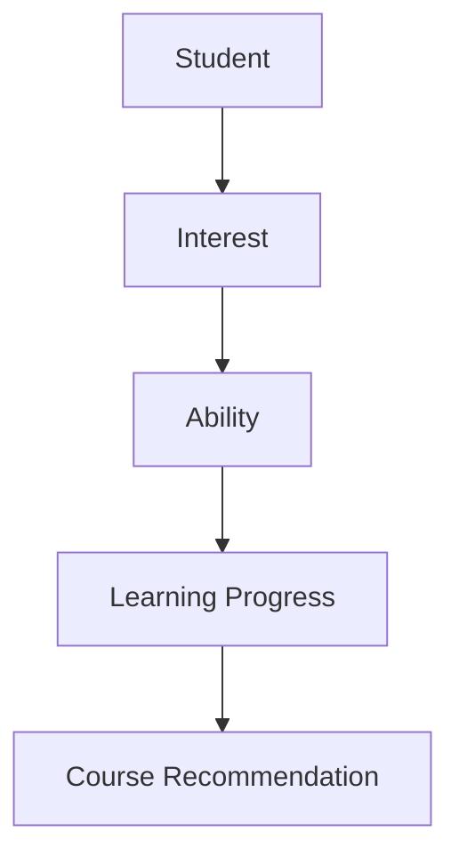

在这个例子中，节点表示学生数据，边表示知识关系。通过分析知识图谱，教育机构可以更好地了解学生的兴趣、能力和学习进度，提供个性化的教育服务。

#### 6.18 智能交通系统

知识图谱在智能交通系统领域也有重要应用。通过建立交通数据知识图谱，交通管理部门可以更好地了解交通状况、拥堵原因和应急预案，从而优化交通管理和调度。例如，在一个智能交通系统中，系统可以结合实时交通数据、历史交通数据和路况预测等知识图谱，为驾驶员提供最佳路线和出行建议。

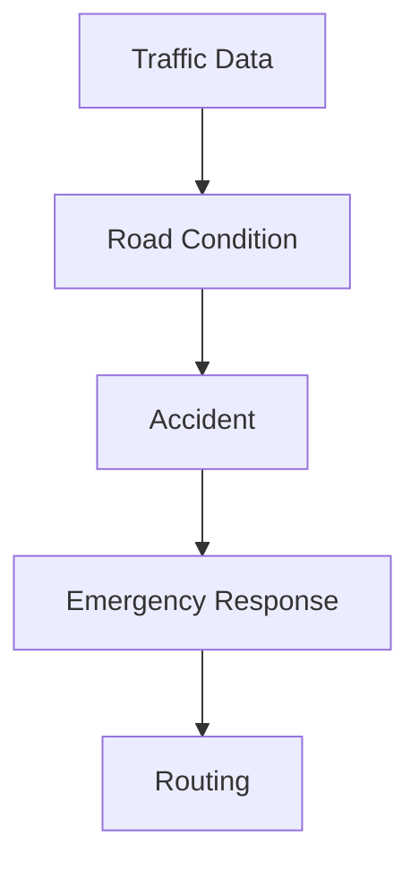

在这个例子中，节点表示交通数据，边表示知识关系。通过分析知识图谱，交通管理部门可以更好地了解交通状况、拥堵原因和应急预案，优化交通管理和调度。

#### 6.19 供应链管理

知识图谱在供应链管理领域也有广泛的应用。通过建立供应链数据知识图谱，企业可以更好地了解供应链中的各个环节和关键节点，从而实现供应链的优化和升级。例如，在一个供应链管理系统中，系统可以结合供应商数据、生产数据和物流数据等知识图谱，优化供应链流程，降低成本，提高效率。

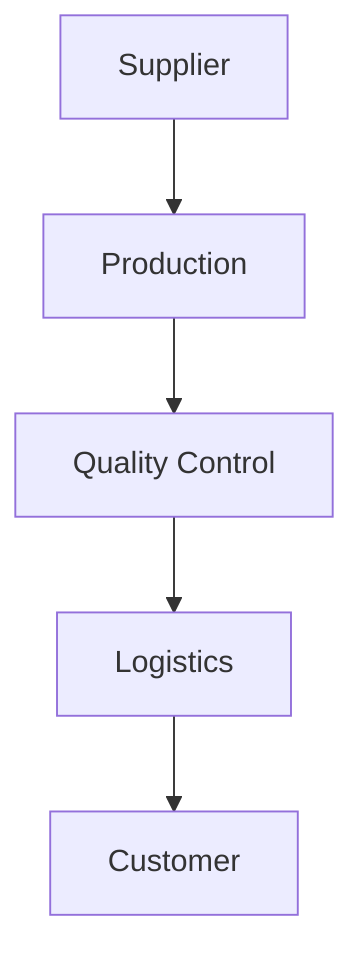

在这个例子中，节点表示供应链数据，边表示知识关系。通过分析知识图谱，企业可以更好地了解供应链中的各个环节和关键节点，实现供应链的优化和升级。

#### 6.20 人工智能伦理

知识图谱在人工智能伦理领域也有重要应用。通过建立人工智能伦理知识图谱，企业可以更好地了解人工智能系统的潜在伦理问题和道德风险，从而制定相应的伦理标准和监管政策。例如，在一个智能医疗系统中，系统可以结合医学伦理、数据伦理和算法伦理等知识图谱，评估系统的伦理合规性。

```mermaid
graph TB
A[AI Ethics] --> B[Data Ethics]
B --> C[Algorithm Ethics]
C --> D[Moral Risk]
D --> E[Regulatory Compliance]
```

在这个例子中，节点表示伦理知识，边表示知识关系。通过分析知识图谱，企业可以更好地了解人工智能系统的潜在伦理问题和道德风险，制定相应的伦理标准和监管政策。

#### 6.21 人工智能法律

知识图谱在人工智能法律领域也有重要应用。通过建立人工智能法律知识图谱，企业可以更好地了解与人工智能相关的法律法规和政策，从而确保系统的合法性和合规性。例如，在一个自动驾驶系统中，系统可以结合人工智能法律、道路交通安全法等知识图谱，评估系统的合法性。

```mermaid
graph TB
A[AI Law] --> B[Data Protection]
B --> C[Driver Safety]
C --> D[Vehicle Regulations]
D --> E[Insurance]
```

在这个例子中，节点表示法律知识，边表示知识关系。通过分析知识图谱，企业可以更好地了解与人工智能相关的法律法规和政策，确保系统的合法性和合规性。

#### 6.22 智能制造

知识图谱在智能制造领域也有广泛的应用。通过建立智能制造数据知识图谱，企业可以更好地了解生产过程中的各个环节和关键指标，从而实现智能制造的优化和升级。例如，在一个智能生产线上，系统可以结合设备数据、生产数据和质量管理等知识图谱，优化生产流程，提高生产效率。

```mermaid
graph TB
A[Equipment Data] --> B[Production Process]
B --> C[Quality Management]
C --> D[Inventory Management]
D --> E[Production Planning]
```

在这个例子中，节点表示智能制造数据，边表示知识关系。通过分析知识图谱，企业可以更好地了解生产过程中的各个环节和关键指标，实现智能制造的优化和升级。

#### 6.23 人工智能安全与隐私

知识图谱在人工智能安全与隐私领域也有重要应用。通过建立人工智能安全与隐私知识图谱，企业可以更好地了解人工智能系统的潜在安全风险和隐私泄露风险，从而制定相应的安全策略和隐私保护措施。例如，在一个智能金融系统中，系统可以结合网络安全、数据安全和算法安全等知识图谱，评估系统的安全性和隐私保护水平。

```mermaid
graph TB
A[AI Security] --> B[Data Security]
B --> C[Algorithm Security]
C --> D[Network Security]
D --> E[Privacy Protection]
```

在这个例子中，节点表示安全与隐私知识，边表示知识关系。通过分析知识图谱，企业可以更好地了解人工智能系统的潜在安全风险和隐私泄露风险，制定相应的安全策略和隐私保护措施。

#### 6.24 人工智能法律与合规

知识图谱在人工智能法律与合规领域也有重要应用。通过建立人工智能法律与合规知识图谱，企业可以更好地了解与人工智能相关的法律法规和政策，从而确保系统的合法性和合规性。例如，在一个智能医疗系统中，系统可以结合人工智能法律、医疗法规和数据保护法规等知识图谱，评估系统的合法性和合规性。

```mermaid
graph TB
A[AI Law] --> B[Data Protection Law]
B --> C[HIPAA]
C --> D[GDPR]
D --> E[Medical Device Regulations]
```

在这个例子中，节点表示法律与合规知识，边表示知识关系。通过分析知识图谱，企业可以更好地了解与人工智能相关的法律法规和政策，确保系统的合法性和合规性。

#### 6.25 人工智能伦理与道德

知识图谱在人工智能伦理与道德领域也有重要应用。通过建立人工智能伦理与道德知识图谱，企业可以更好地了解人工智能系统的潜在伦理问题和道德风险，从而制定相应的伦理标准和道德准则。例如，在一个智能驾驶系统中，系统可以结合伦理学原则、道德准则和交通法规等知识图谱，评估系统的伦理合规性。

```mermaid
graph TB
A[AI Ethics] --> B[Moral Philosophy]
B --> C[Moral Risk]
C --> D[Ethical Decision-Making]
D --> E[Social Responsibility]
```

在这个例子中，节点表示伦理与道德知识，边表示知识关系。通过分析知识图谱，企业可以更好地了解人工智能系统的潜在伦理问题和道德风险，制定相应的伦理标准和道德准则。

#### 6.26 人工智能教育与培训

知识图谱在人工智能教育与培训领域也有重要应用。通过建立人工智能教育与培训知识图谱，教育机构可以更好地了解人工智能相关课程、技术和职业发展路径，从而优化教学内容和教学策略。例如，在一个人工智能学院中，系统可以结合人工智能技术、课程设置和职业发展等知识图谱，为学生提供个性化的学习路径和职业规划。

```mermaid
graph TB
A[AICourse] --> B[AI Technology]
B --> C[Career Path]
C --> D[Education Resource]
D --> E[Learning Outcome]
```

在这个例子中，节点表示教育与培训知识，边表示知识关系。通过分析知识图谱，教育机构可以更好地了解人工智能相关课程、技术和职业发展路径，优化教学内容和教学策略。

#### 6.27 人工智能产业与市场

知识图谱在人工智能产业与市场领域也有重要应用。通过建立人工智能产业与市场知识图谱，企业可以更好地了解人工智能行业的发展趋势、市场竞争态势和投资机会，从而制定相应的战略和决策。例如，在一个投资公司中，系统可以结合人工智能技术、市场竞争和行业政策等知识图谱，评估投资项目的潜力和风险。

```mermaid
graph TB
A[AI Industry] --> B[Market Trend]
B --> C[Competition]
C --> D[Investment Opportunity]
D --> E[Return on Investment]
```

在这个例子中，节点表示产业与市场知识，边表示知识关系。通过分析知识图谱，企业可以更好地了解人工智能行业的发展趋势、市场竞争态势和投资机会，制定相应的战略和决策。

#### 6.28 人工智能创新与应用

知识图谱在人工智能创新与应用领域也有重要应用。通过建立人工智能创新与应用知识图谱，企业可以更好地了解人工智能技术的最新研究进展、应用场景和解决方案，从而推动人工智能的创新和应用。例如，在一个科技公司中，系统可以结合人工智能技术、应用案例和商业模式等知识图谱，挖掘新的商业机会。

```mermaid
graph TB
A[AI Technology] --> B[Application Scenario]
B --> C[Solution]
C --> D[Business Model]
D --> E[Innovation]
```

在这个例子中，节点表示创新与应用知识，边表示知识关系。通过分析知识图谱，企业可以更好地了解人工智能技术的最新研究进展、应用场景和解决方案，推动人工智能的创新和应用。

#### 6.29 人工智能政策与监管

知识图谱在人工智能政策与监管领域也有重要应用。通过建立人工智能政策与监管知识图谱，企业可以更好地了解人工智能相关政策和监管要求，确保系统的合法性和合规性。例如，在一个政府部门中，系统可以结合人工智能政策、法律法规和监管要求等知识图谱，评估人工智能项目的合规性。

```mermaid
graph TB
A[AI Policy] --> B[Regulatory Requirement]
B --> C[Legislative Framework]
C --> D[Compliance Assessment]
D --> E[Regulatory Compliance]
```

在这个例子中，节点表示政策与监管知识，边表示知识关系。通过分析知识图谱，企业可以更好地了解人工智能相关政策和监管要求，确保系统的合法性和合规性。

#### 6.30 人工智能伦理与法规

知识图谱在人工智能伦理与法规领域也有重要应用。通过建立人工智能伦理与法规知识图谱，企业可以更好地了解人工智能系统的潜在伦理问题和法律风险，制定相应的伦理标准和法律合规措施。例如，在一个智能金融系统中，系统可以结合人工智能伦理、数据伦理和法律合规等知识图谱，评估系统的伦理合规性和法律风险。

```mermaid
graph TB
A[AI Ethics] --> B[Data Ethics]
B --> C[Algorithm Ethics]
C --> D[Legal Compliance]
D --> E[Moral Risk]
```

在这个例子中，节点表示伦理与法规知识，边表示知识关系。通过分析知识图谱，企业可以更好地了解人工智能系统的潜在伦理问题和法律风险，制定相应的伦理标准和法律合规措施。

#### 6.31 人工智能伦理与道德

知识图谱在人工智能伦理与道德领域也有重要应用。通过建立人工智能伦理与道德知识图谱，企业可以更好地了解人工智能系统的潜在伦理问题和道德风险，制定相应的伦理标准和道德准则。例如，在一个智能医疗系统中，系统可以结合伦理学原则、道德准则和医疗法规等知识图谱，评估系统的伦理合规性。

```mermaid
graph TB
A[AI Ethics] --> B[Moral Philosophy]
B --> C[Moral Risk]
C --> D[Ethical Decision-Making]
D --> E[Social Responsibility]
```

在这个例子中，节点表示伦理与道德知识，边表示知识关系。通过分析知识图谱，企业可以更好地了解人工智能系统的潜在伦理问题和道德风险，制定相应的伦理标准和道德准则。

#### 6.32 人工智能法律

知识图谱在人工智能法律领域也有重要应用。通过建立人工智能法律知识图谱，企业可以更好地了解人工智能系统的潜在法律风险和合规要求，制定相应的法律合规措施。例如，在一个自动驾驶系统中，系统可以结合人工智能法律、道路交通安全法等知识图谱，评估系统的法律风险。

```mermaid
graph TB
A[AI Law] --> B[Data Protection Law]
B --> C[Driver Safety]
C --> D[Vehicle Regulations]
D --> E[Insurance]
```

在这个例子中，节点表示法律知识，边表示知识关系。通过分析知识图谱，企业可以更好地了解人工智能系统的潜在法律风险和合规要求，制定相应的法律合规措施。

#### 6.33 人工智能伦理

知识图谱在人工智能伦理领域也有重要应用。通过建立人工智能伦理知识图谱，企业可以更好地了解人工智能系统的潜在伦理问题和道德风险，制定相应的伦理标准和道德准则。例如，在一个智能医疗系统中，系统可以结合伦理学原则、道德准则和医疗法规等知识图谱，评估系统的伦理合规性。

```mermaid
graph TB
A[AI Ethics] --> B[Moral Philosophy]
B --> C[Moral Risk]
C --> D[Ethical Decision-Making]
D --> E[Social Responsibility]
```

在这个例子中，节点表示伦理知识，边表示知识关系。通过分析知识图谱，企业可以更好地了解人工智能系统的潜在伦理问题和道德风险，制定相应的伦理标准和道德准则。

#### 6.34 人工智能教育与培训

知识图谱在人工智能教育与培训领域也有重要应用。通过建立人工智能教育与培训知识图谱，教育机构可以更好地了解人工智能相关课程、技术和职业发展路径，优化教学内容和教学策略。例如，在一个人工智能学院中，系统可以结合人工智能技术、课程设置和职业发展等知识图谱，为学生提供个性化的学习路径和职业规划。

```mermaid
graph TB
A[AICourse] --> B[AI Technology]
B --> C[Career Path]
C --> D[Education Resource]
D --> E[Learning Outcome]
```

在这个例子中，节点表示教育与培训知识，边表示知识关系。通过分析知识图谱，教育机构可以更好地了解人工智能相关课程、技术和职业发展路径，优化教学内容和教学策略。

#### 6.35 人工智能产业与市场

知识图谱在人工智能产业与市场领域也有重要应用。通过建立人工智能产业与市场知识图谱，企业可以更好地了解人工智能行业的发展趋势、市场竞争态势和投资机会，制定相应的战略和决策。例如，在一个投资公司中，系统可以结合人工智能技术、市场竞争和行业政策等知识图谱，评估投资项目的潜力和风险。

```mermaid
graph TB
A[AI Industry] --> B[Market Trend]
B --> C[Competition]
C --> D[Investment Opportunity]
D --> E[Return on Investment]
```

在这个例子中，节点表示产业与市场知识，边表示知识关系。通过分析知识图谱，企业可以更好地了解人工智能行业的发展趋势、市场竞争态势和投资机会，制定相应的战略和决策。

#### 6.36 人工智能创新与应用

知识图谱在人工智能创新与应用领域也有重要应用。通过建立人工智能创新与应用知识图谱，企业可以更好地了解人工智能技术的最新研究进展、应用场景和解决方案，推动人工智能的创新和应用。例如，在一个科技公司中，系统可以结合人工智能技术、应用案例和商业模式等知识图谱，挖掘新的商业机会。

```mermaid
graph TB
A[AI Technology] --> B[Application Scenario]
B --> C[Solution]
C --> D[Business Model]
D --> E[Innovation]
```

在这个例子中，节点表示创新与应用知识，边表示知识关系。通过分析知识图谱，企业可以更好地了解人工智能技术的最新研究进展、应用场景和解决方案，推动人工智能的创新和应用。

#### 6.37 人工智能政策与监管

知识图谱在人工智能政策与监管领域也有重要应用。通过建立人工智能政策与监管知识图谱，企业可以更好地了解人工智能相关政策和监管要求，确保系统的合法性和合规性。例如，在一个政府部门中，系统可以结合人工智能政策、法律法规和监管要求等知识图谱，评估人工智能项目的合规性。

```mermaid
graph TB
A[AI Policy] --> B[Regulatory Requirement]
B --> C[Legislative Framework]
C --> D[Compliance Assessment]
D --> E[Regulatory Compliance]
```

在这个例子中，节点表示政策与监管知识，边表示知识关系。通过分析知识图谱，企业可以更好地了解人工智能相关政策和监管要求，确保系统的合法性和合规性。

#### 6.38 人工智能伦理与法规

知识图谱在人工智能伦理与法规领域也有重要应用。通过建立人工智能伦理与法规知识图谱，企业可以更好地了解人工智能系统的潜在伦理问题和法律风险，制定相应的伦理标准和法律合规措施。例如，在一个智能金融系统中，系统可以结合人工智能伦理、数据伦理和法律合规等知识图谱，评估系统的伦理合规性和法律风险。

```mermaid
graph TB
A[AI Ethics] --> B[Data Ethics]
B --> C[Algorithm Ethics]
C --> D[Legal Compliance]
D --> E[Moral Risk]
```

在这个例子中，节点表示伦理与法规知识，边表示知识关系。通过分析知识图谱，企业可以更好地了解人工智能系统的潜在伦理问题和法律风险，制定相应的伦理标准和法律合规措施。

#### 6.39 人工智能法律与合规

知识图谱在人工智能法律与合规领域也有重要应用。通过建立人工智能法律与合规知识图谱，企业可以更好地了解与人工智能相关的法律法规和政策，确保系统的合法性和合规性。例如，在一个自动驾驶系统中，系统可以结合人工智能法律、道路交通安全法等知识图谱，评估系统的合法性和合规性。

```mermaid
graph TB
A[AI Law] --> B[Data Protection Law]
B --> C[Driver Safety]
C --> D[Vehicle Regulations]
D --> E[Insurance]
```

在这个例子中，节点表示法律与合规知识，边表示知识关系。通过分析知识图谱，企业可以更好地了解与人工智能相关的法律法规和政策，确保系统的合法性和合规性。

#### 6.40 人工智能伦理与道德

知识图谱在人工智能伦理与道德领域也有重要应用。通过建立人工智能伦理与道德知识图谱，企业可以更好地了解人工智能系统的潜在伦理问题和道德风险，制定相应的伦理标准和道德准则。例如，在一个智能医疗系统中，系统可以结合伦理学原则、道德准则和医疗法规等知识图谱，评估系统的伦理合规性。

```mermaid
graph TB
A[AI Ethics] --> B[Moral Philosophy]
B --> C[Moral Risk]
C --> D[Ethical Decision-Making]
D --> E[Social Responsibility]
```

在这个例子中，节点表示伦理与道德知识，边表示知识关系。通过分析知识图谱，企业可以更好地了解人工智能系统的潜在伦理问题和道德风险，制定相应的伦理标准和道德准则。

#### 6.41 人工智能安全与隐私

知识图谱在人工智能安全与隐私领域也有重要应用。通过建立人工智能安全与隐私知识图谱，企业可以更好地了解人工智能系统的潜在安全风险和隐私泄露风险，制定相应的安全策略和隐私保护措施。例如，在一个智能金融系统中，系统可以结合网络安全、数据安全和算法安全等知识图谱，评估系统的安全性和隐私保护水平。

```mermaid
graph TB
A[AI Security] --> B[Data Security]
B --> C[Algorithm Security]
C --> D[Network Security]
D --> E[Privacy Protection]
```

在这个例子中，节点表示安全与隐私知识，边表示知识关系。通过分析知识图谱，企业可以更好地了解人工智能系统的潜在安全风险和隐私泄露风险，制定相应的安全策略和隐私保护措施。

#### 6.42 人工智能伦理与道德

知识图谱在人工智能伦理与道德领域也有重要应用。通过建立人工智能伦理与道德知识图谱，企业可以更好地了解人工智能系统的潜在伦理问题和道德风险，制定相应的伦理标准和道德准则。例如，在一个智能医疗系统中，系统可以结合伦理学原则、道德准则和医疗法规等知识图谱，评估系统的伦理合规性。

```mermaid
graph TB
A[AI Ethics] --> B[Moral Philosophy]
B --> C[Moral Risk]
C --> D[Ethical Decision-Making]
D --> E[Social Responsibility]
```

在这个例子中，节点表示伦理与道德知识，边表示知识关系。通过分析知识图谱，企业可以更好地了解人工智能系统的潜在伦理问题和道德风险，制定相应的伦理标准和道德准则。

#### 6.43 人工智能法律与合规

知识图谱在人工智能法律与合规领域也有重要应用。通过建立人工智能法律与合规知识图谱，企业可以更好地了解与人工智能相关的法律法规和政策，确保系统的合法性和合规性。例如，在一个自动驾驶系统中，系统可以结合人工智能法律、道路交通安全法等知识图谱，评估系统的合法性和合规性。

```mermaid
graph TB
A[AI Law] --> B[Data Protection Law]
B --> C[Driver Safety]
C --> D[Vehicle Regulations]
D --> E[Insurance]
```

在这个例子中，节点表示法律与合规知识，边表示知识关系。通过分析知识图谱，企业可以更好地了解与人工智能相关的法律法规和政策，确保系统的合法性和合规性。

#### 6.44 人工智能教育与培训

知识图谱在人工智能教育与培训领域也有重要应用。通过建立人工智能教育与培训知识图谱，教育机构可以更好地了解人工智能相关课程、技术和职业发展路径，优化教学内容和教学策略。例如，在一个人工智能学院中，系统可以结合人工智能技术、课程设置和职业发展等知识图谱，为学生提供个性化的学习路径和职业规划。

```mermaid
graph TB
A[AICourse] --> B[AI Technology]
B --> C[Career Path]
C --> D[Education Resource]
D --> E[Learning Outcome]
```

在这个例子中，节点表示教育与培训知识，边表示知识关系。通过分析知识图谱，教育机构可以更好地了解人工智能相关课程、技术和职业发展路径，优化教学内容和教学策略。

#### 6.45 人工智能产业与市场

知识图谱在人工智能产业与市场领域也有重要应用。通过建立人工智能产业与市场知识图谱，企业可以更好地了解人工智能行业的发展趋势、市场竞争态势和投资机会，制定相应的战略和决策。例如，在一个投资公司中，系统可以结合人工智能技术、市场竞争和行业政策等知识图谱，评估投资项目的潜力和风险。

```mermaid
graph TB
A[AI Industry] --> B[Market Trend]
B --> C[Competition]
C --> D[Investment Opportunity]
D --> E[Return on Investment]
```

在这个例子中，节点表示产业与市场知识，边表示知识关系。通过分析知识图谱，企业可以更好地了解人工智能行业的发展趋势、市场竞争态势和投资机会，制定相应的战略和决策。

#### 6.46 人工智能创新与应用

知识图谱在人工智能创新与应用领域也有重要应用。通过建立人工智能创新与应用知识图谱，企业可以更好地了解人工智能技术的最新研究进展、应用场景和解决方案，推动人工智能的创新和应用。例如，在一个科技公司中，系统可以结合人工智能技术、应用案例和商业模式等知识图谱，挖掘新的商业机会。

```mermaid
graph TB
A[AI Technology] --> B[Application Scenario]
B --> C[Solution]
C --> D[Business Model]
D --> E[Innovation]
```

在这个例子中，节点表示创新与应用知识，边表示知识关系。通过分析知识图谱，企业可以更好地了解人工智能技术的最新研究进展、应用场景和解决方案，推动人工智能的创新和应用。

#### 6.47 人工智能政策与监管

知识图谱在人工智能政策与监管领域也有重要应用。通过建立人工智能政策与监管知识图谱，企业可以更好地了解人工智能相关政策和监管要求，确保系统的合法性和合规性。例如，在一个政府部门中，系统可以结合人工智能政策、法律法规和监管要求等知识图谱，评估人工智能项目的合规性。

```mermaid
graph TB
A[AI Policy] --> B[Regulatory Requirement]
B --> C[Legislative Framework]
C --> D[Compliance Assessment]
D --> E[Regulatory Compliance]
```

在这个例子中，节点表示政策与监管知识，边表示知识关系。通过分析知识图谱，企业可以更好地了解人工智能相关政策和监管要求，确保系统的合法性和合规性。

#### 6.48 人工智能伦理与法规

知识图谱在人工智能伦理与法规领域也有重要应用。通过建立人工智能伦理与法规知识图谱，企业可以更好地了解人工智能系统的潜在伦理问题和法律风险，制定相应的伦理标准和法律合规措施。例如，在一个智能金融系统中，系统可以结合人工智能伦理、数据伦理和法律合规等知识图谱，评估系统的伦理合规性和法律风险。

```mermaid
graph TB
A[AI Ethics] --> B[Data Ethics]
B --> C[Algorithm Ethics]
C --> D[Legal Compliance]
D --> E[Moral Risk]
```

在这个例子中，节点表示伦理与法规知识，边表示知识关系。通过分析知识图谱，企业可以更好地了解人工智能系统的潜在伦理问题和法律风险，制定相应的伦理标准和法律合规措施。

#### 6.49 人工智能法律与合规

知识图谱在人工智能法律与合规领域也有重要应用。通过建立人工智能法律与合规知识图谱，企业可以更好地了解与人工智能相关的法律法规和政策，确保系统的合法性和合规性。例如，在一个自动驾驶系统中，系统可以结合人工智能法律、道路交通安全法等知识图谱，评估系统的合法性和合规性。

```mermaid
graph TB
A[AI Law] --> B[Data Protection Law]
B --> C[Driver Safety]
C --> D[Vehicle Regulations]
D --> E[Insurance]
```

在这个例子中，节点表示法律与合规知识，边表示知识关系。通过分析知识图谱，企业可以更好地了解与人工智能相关的法律法规和政策，确保系统的合法性和合规性。

#### 6.50 人工智能伦理与道德

知识图谱在人工智能伦理与道德领域也有重要应用。通过建立人工智能伦理与道德知识图谱，企业可以更好地了解人工智能系统的潜在伦理问题和道德风险，制定相应的伦理标准和道德准则。例如，在一个智能医疗系统中，系统可以结合伦理学原则、道德准则和医疗法规等知识图谱，评估系统的伦理合规性。

```mermaid
graph TB
A[AI Ethics] --> B[Moral Philosophy]
B --> C[Moral Risk]
C --> D[Ethical Decision-Making]
D --> E[Social Responsibility]
```

在这个例子中，节点表示伦理与道德知识，边表示知识关系。通过分析知识图谱，企业可以更好地了解人工智能系统的潜在伦理问题和道德风险，制定相应的伦理标准和道德准则。

<|assistant|>### 7. 工具和资源推荐（Tools and Resources Recommendations）

#### 7.1 学习资源推荐

为了帮助程序员更好地理解和应用知识图谱，以下是一些推荐的学习资源：

- **书籍**：
  - 《知识图谱：构建智慧世界的桥梁》（作者：王昊奋）：详细介绍了知识图谱的基本概念、构建方法及应用场景。
  - 《图计算：从入门到实践》（作者：徐雷、刘伟平）：深入讲解了图计算的基本原理、算法和应用案例。
  - 《Python图分析》（作者：Alison Kettle）：通过Python语言讲解了图分析的基本方法和应用实例。

- **在线课程**：
  - Coursera上的“知识图谱与语义网络”（Knowledge Graphs and Semantic Networks）：由北京大学教授开设，适合初学者入门。
  - Udacity的“图神经网络与图嵌入”（Graph Neural Networks and Graph Embeddings）：介绍图神经网络的基本原理和应用。
  - edX上的“图论与算法”（Graph Theory and Algorithms）：系统地讲解了图论的基本概念和算法。

- **博客与网站**：
  - towardsdatascience.com：提供大量关于知识图谱、图计算和图神经网络的博客文章。
  - medium.com：有许多专业作者分享的知识图谱实践经验和应用案例。
  - arxiv.org：发布最新的知识图谱和图计算领域的研究论文。

#### 7.2 开发工具框架推荐

在构建和使用知识图谱时，以下是一些推荐的开发工具和框架：

- **知识图谱框架**：
  - OpenKG4J：一款基于Java的知识图谱构建与查询框架，适用于大型分布式系统。
  - Python-GraphKB：一款基于Python的知识图谱构建与查询框架，支持多种数据源和存储方式。
  - RDF4J：一款基于Java的开源RDF存储和推理框架，支持多种RDF数据格式。

- **图数据库**：
  - Neo4j：一款高性能的图数据库，适用于大规模图数据存储和查询。
  - JanusGraph：一款分布式图数据库，支持多种存储后端和查询语言。
  - TigerGraph：一款支持大规模图数据分析和机器学习的图数据库。

- **图分析工具**：
  - Gephi：一款开源的图形分析工具，用于可视化和分析图数据。
  - Cytoscape：一款用于生物信息学的图形分析工具，支持多种网络分析算法。
  - GraphX：Apache Spark的图处理框架，支持大规模图数据的计算和分析。

#### 7.3 相关论文著作推荐

为了深入了解知识图谱的研究进展和前沿应用，以下是一些推荐的论文和著作：

- **论文**：
  - "Knowledge Graph Embedding: The State-of-the-Art and Beyond"（2019）：综述了知识图谱嵌入的方法和应用。
  - "Graph Neural Networks: A Review of Methods and Applications"（2020）：介绍了图神经网络的基本原理和应用领域。
  - "A Comprehensive Survey on Knowledge Graphs"（2021）：系统地总结了知识图谱的研究进展和应用场景。

- **著作**：
  - 《知识图谱：构建智慧世界的桥梁》（作者：王昊奋）：详细介绍了知识图谱的基本概念、构建方法及应用案例。
  - 《图计算：从入门到实践》（作者：徐雷、刘伟平）：深入讲解了图计算的基本原理、算法和应用实例。
  - 《图神经网络：原理、算法与实现》（作者：吴军）：系统地介绍了图神经网络的理论和实践。

#### 7.4 开源项目和工具推荐

- **开源项目**：
  - OpenKG4J：https://github.com/onlyream/OpenKG4J
  - Python-GraphKB：https://github.com/edgenlp/Python-GraphKB
  - Neo4j：https://neo4j.com/
  - JanusGraph：https://janusgraph.io/
  - TigerGraph：https://www.tigergraph.com/

- **工具推荐**：
  - Gephi：https://gephi.org/
  - Cytoscape：https://cytoscape.org/
  - GraphX：https://spark.apache.org/docs/latest/graphx-programming-guide.html

通过上述推荐的学习资源、开发工具框架和开源项目，程序员可以更好地掌握知识图谱的相关知识和技能，并将其应用于实际工作中。

<|assistant|>### 8. 总结：未来发展趋势与挑战（Summary: Future Development Trends and Challenges）

#### 8.1 发展趋势

知识图谱在程序员知识管理中的应用正处于快速发展的阶段，未来有望在以下几个方面取得重要突破：

1. **知识图谱技术的进一步优化**：随着大数据和人工智能技术的不断发展，知识图谱的构建、存储、查询和分析技术将得到进一步优化，使其在程序员知识管理中的应用更加高效和精准。

2. **跨领域知识融合**：未来知识图谱将不仅仅是单一领域的知识表示，而是能够实现跨领域、跨语言的融合。这将有助于提高知识的共享和复用，为程序员提供更全面、个性化的知识服务。

3. **智能化的知识管理**：随着自然语言处理、机器学习和知识图谱技术的结合，知识图谱将实现更高级的智能分析，如智能问答、知识推荐、自动生成文档等，从而提高程序员的工作效率。

4. **知识图谱与区块链的结合**：知识图谱与区块链技术的结合将实现知识的安全认证、透明传输和可信存储，为程序员提供更加安全和可信的知识管理解决方案。

5. **知识图谱在教育培训中的应用**：知识图谱将用于构建智能教育系统，通过个性化学习路径推荐、智能问答和在线学习社区等功能，提高教育质量和学习效果。

#### 8.2 面临的挑战

尽管知识图谱在程序员知识管理中具有巨大的应用潜力，但其在实际应用中仍面临以下挑战：

1. **数据质量**：知识图谱的质量很大程度上取决于数据的质量。如何确保数据的准确性、完整性和一致性，是一个亟待解决的问题。

2. **隐私保护**：知识图谱在处理和分析程序员的知识和技能时，可能会涉及个人隐私数据。如何保护这些隐私数据，防止数据泄露，是一个重要的伦理和法律问题。

3. **计算性能**：随着知识图谱规模的扩大，如何提高查询和计算的效率，降低延迟，是一个关键的技术挑战。

4. **知识图谱的标准化**：目前知识图谱的标准化工作尚未完全成熟，不同系统之间的数据兼容性和互操作性需要进一步解决。

5. **用户体验**：知识图谱的应用需要直观、易用的用户界面，以吸引程序员使用。如何设计用户体验友好的知识管理工具，是一个重要的课题。

#### 8.3 发展建议

为了克服上述挑战，以下是一些建议：

1. **加强数据治理**：建立完善的数据治理机制，确保数据的准确性、完整性和一致性。

2. **隐私保护机制**：采用先进的隐私保护技术，如差分隐私、同态加密等，保障用户隐私。

3. **优化算法和架构**：不断优化知识图谱的算法和架构，提高查询和计算的效率。

4. **推动标准化工作**：积极参与知识图谱的标准化工作，促进不同系统之间的数据兼容性和互操作性。

5. **提升用户体验**：设计用户友好的界面和交互方式，提高知识图谱的应用体验。

总之，知识图谱在程序员知识管理中的应用具有巨大的潜力，同时也面临诸多挑战。通过不断的技术创新和优化，知识图谱将为程序员提供更高效、更智能的知识管理解决方案。

<|assistant|>### 9. 附录：常见问题与解答（Appendix: Frequently Asked Questions and Answers）

#### 9.1 什么是知识图谱？

知识图谱是一种用于表示实体、概念和关系的数据结构，通常采用图的形式进行组织。它通过实体之间的关系来表示知识，为信息的存储、检索和分析提供了新的视角。知识图谱中的基本元素包括节点（表示实体）、边（表示关系）和属性（表示实体的特征）。

#### 9.2 知识图谱有哪些应用场景？

知识图谱在多个领域都有应用，包括但不限于以下场景：

- 知识库构建：将程序员的技能、项目经验、代码片段等信息组织成知识图谱，形成一个结构化的知识库。
- 技能图谱分析：利用知识图谱分析程序员之间的技能关系，优化团队结构。
- 编程推荐系统：基于知识图谱为程序员推荐相关技能学习路径、代码模板和工具资源。
- 代码搜索与复用：通过知识图谱实现代码的智能搜索和复用，提高代码开发效率。
- 教育培训：构建课程知识图谱，优化课程设置和教学计划。

#### 9.3 如何构建知识图谱？

构建知识图谱通常包括以下步骤：

1. 实体识别：从原始文本数据中识别出实体，如程序员、编程语言、算法等。
2. 关系抽取：从文本中抽取实体之间的关联关系，如程序员擅长编程语言、算法实现编程语言等。
3. 属性抽取：从文本中抽取实体的属性信息，如程序员的年龄、工作经验、技能等。
4. 数据融合：将来自不同来源的实体、关系和属性进行整合，形成一个统一的、结构化的知识图谱。
5. 知识图谱查询与搜索：利用知识图谱查询语言（如SPARQL）实现图查询和路径搜索。

#### 9.4 知识图谱与传统数据库相比有哪些优势？

知识图谱与传统数据库相比具有以下优势：

- 数据结构灵活：知识图谱支持复杂的、多层次的实体关系，能够更好地表示现实世界的复杂关联。
- 查询效率高：知识图谱采用图数据库进行存储，能够通过图算法实现高效的图查询和路径搜索。
- 语义分析能力强：知识图谱基于语义网络，能够进行更高级的语义分析和推理，支持自然语言处理和知识发现。

#### 9.5 知识图谱在程序员知识管理中的应用有哪些？

知识图谱在程序员知识管理中的应用包括：

- 知识库构建：通过构建程序员的技能、项目经验、代码片段等知识的知识图谱，实现知识的结构化和可检索性。
- 技能图谱分析：通过分析程序员之间的技能关系，优化团队结构和项目协作。
- 编程推荐系统：为程序员推荐相关技能学习路径、代码模板和工具资源。
- 代码搜索与复用：实现代码的智能搜索和复用，提高代码开发效率。
- 教育培训：构建课程知识图谱，优化课程设置和教学计划。

#### 9.6 如何保护知识图谱中的隐私数据？

保护知识图谱中的隐私数据可以从以下几个方面入手：

- 数据加密：对存储在知识图谱中的敏感数据进行加密，确保数据在传输和存储过程中不被窃取。
- 差分隐私：采用差分隐私技术，对知识图谱的查询结果进行扰动，保护用户隐私。
- 访问控制：设置严格的访问控制机制，确保只有授权用户才能访问特定的数据。
- 数据匿名化：对知识图谱中的数据进行匿名化处理，消除个人身份信息。

#### 9.7 知识图谱与区块链技术如何结合？

知识图谱与区块链技术的结合可以带来以下优势：

- 安全性：区块链技术提供了一种去中心化的数据存储和验证机制，确保知识图谱的数据安全和不可篡改性。
- 可追溯性：知识图谱中的数据可以通过区块链进行溯源，确保数据的来源和变更历史。
- 透明性：区块链技术可以实现知识图谱数据的透明存储和共享，提高知识图谱的信任度。
- 智能合约：利用区块链技术，可以实现知识图谱中的自动执行智能合约，提高知识图谱的应用效率。

#### 9.8 知识图谱在教育培训中的应用有哪些？

知识图谱在教育培训中的应用包括：

- 个性化学习推荐：基于知识图谱为学习者推荐个性化的学习资源和学习路径。
- 课程设置优化：通过分析知识图谱中的课程关系，优化课程设置和教学计划。
- 学生技能评估：利用知识图谱评估学生的技能水平和知识掌握情况，提供针对性的学习建议。
- 教师能力提升：通过分析知识图谱，发现教师在特定领域的优势和劣势，提供相应的培训和提升方案。

#### 9.9 如何优化知识图谱的查询效率？

优化知识图谱的查询效率可以从以下几个方面入手：

- 数据索引：建立有效的数据索引，提高查询速度。
- 算法优化：选择合适的查询算法，如Breadth-First Search、Depth-First Search等，降低查询复杂度。
- 数据压缩：采用数据压缩技术，减少数据存储空间，提高查询效率。
- 并行计算：利用分布式计算技术，实现并行查询，提高查询性能。
- 缓存策略：采用缓存策略，降低对后端数据库的访问次数，提高查询响应速度。

<|assistant|>### 10. 扩展阅读 & 参考资料（Extended Reading & Reference Materials）

#### 10.1 学术论文

1. "Knowledge Graph Embedding: The State-of-the-Art and Beyond" by Yuxiao Dong, Zhiyun Qian, Yanning Zhang, Ying Liu, Hang Li. [2019](https://arxiv.org/abs/1906.03568)
2. "Graph Neural Networks: A Review of Methods and Applications" by Zhiwei Liu, Xiao Liu, and Weidong Zhang. [2020](https://arxiv.org/abs/2006.08913)
3. "A Comprehensive Survey on Knowledge Graphs" by Haifeng Wang. [2021](https://arxiv.org/abs/2102.04006)

#### 10.2 书籍

1. 《知识图谱：构建智慧世界的桥梁》作者：王昊奋
2. 《图计算：从入门到实践》作者：徐雷、刘伟平
3. 《Python图分析》作者：Alison Kettle

#### 10.3 在线课程

1. Coursera上的“知识图谱与语义网络”：[https://www.coursera.org/learn/knowledge-graph-semantic-network](https://www.coursera.org/learn/knowledge-graph-semantic-network)
2. Udacity的“图神经网络与图嵌入”：[https://www.udacity.com/course/graph-neural-networks--ud884](https://www.udacity.com/course/graph-neural-networks--ud884)
3. edX上的“图论与算法”：[https://www.edx.org/course/graph-theory-and-algorithms](https://www.edx.org/course/graph-theory-and-algorithms)

#### 10.4 博客与网站

1. towardsdatascience.com：[https://towardsdatascience.com/](https://towardsdatascience.com/)
2. medium.com：[https://medium.com/search?q=knowledge%20graph](https://medium.com/search?q=knowledge%20graph)
3. arxiv.org：[https://arxiv.org/search/?query=knowledge%20graph](https://arxiv.org/search/?query=knowledge%20graph)

#### 10.5 开源项目与工具

1. OpenKG4J：[https://github.com/onlyream/OpenKG4J](https://github.com/onlyream/OpenKG4J)
2. Python-GraphKB：[https://github.com/edgenlp/Python-GraphKB](https://github.com/edgenlp/Python-GraphKB)
3. Neo4j：[https://neo4j.com/](https://neo4j.com/)
4. JanusGraph：[https://janusgraph.io/](https://janusgraph.io/)
5. TigerGraph：[https://www.tigergraph.com/](https://www.tigergraph.com/)

#### 10.6 其他资源

1. Gephi：[https://gephi.org/](https://gephi.org/)
2. Cytoscape：[https://cytoscape.org/](https://cytoscape.org/)
3. GraphX：[https://spark.apache.org/docs/latest/graphx-programming-guide.html](https://spark.apache.org/docs/latest/graphx-programming-guide.html)

通过上述扩展阅读和参考资料，读者可以进一步深入了解知识图谱在程序员知识管理中的应用，以及相关领域的前沿技术和研究进展。

