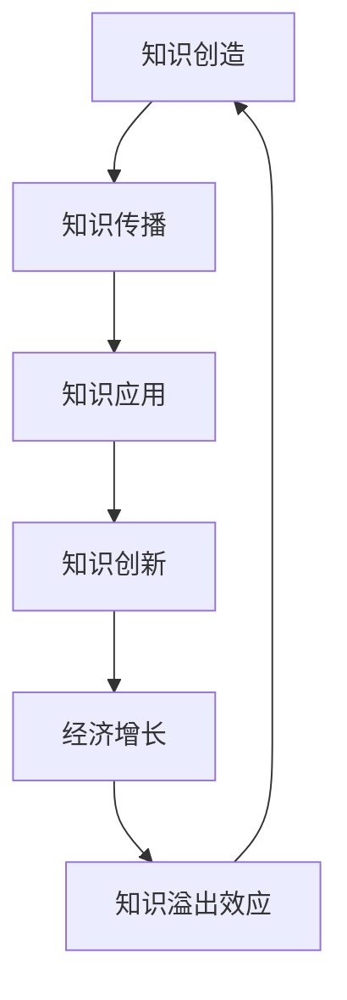

                 

# 知识溢出效应及其经济影响

## 摘要

本文旨在探讨知识溢出效应及其对经济的影响。知识溢出效应是指知识在生产、分配和消费过程中产生的正外部性，它促进了知识创新和技术进步，进而推动了经济增长。文章首先介绍了知识溢出效应的概念和背景，然后分析了其在经济中的重要性，并通过实际案例说明了其作用机制。最后，文章探讨了知识溢出效应的未来发展趋势与挑战。

### 关键词

知识溢出效应、经济增长、创新、外部性、知识管理

## 1. 背景介绍

### 1.1 知识溢出效应的概念

知识溢出效应（Knowledge Spillover Effect）是指知识在生产、分配和消费过程中产生的正外部性。这种外部性表现在知识创造、传播和应用的过程中，不仅对知识的生产者产生积极影响，还对其他相关方产生积极影响。知识溢出效应可以是直接的，也可以是间接的。直接知识溢出效应通常发生在知识的创造和传播过程中，如大学和科研机构的研究成果被其他企业和机构采用。间接知识溢出效应则发生在知识的应用和创新过程中，如企业的技术创新提高了整个行业的生产效率。

### 1.2 知识溢出效应的背景

知识溢出效应是现代经济中一个重要的现象，它反映了知识经济时代的特点。随着信息技术和通信技术的发展，知识的传播速度和范围大大增加，知识在生产、分配和消费中的作用日益突出。知识溢出效应不仅存在于学术界和科研领域，也广泛存在于企业和行业之间。例如，企业的技术创新往往能够带动整个行业的发展，从而实现知识的共享和利用。

### 1.3 知识溢出效应的研究现状

知识溢出效应作为一个重要的经济现象，受到了广泛关注。国内外学者从不同角度对其进行了研究。一些学者从经济学角度分析了知识溢出效应的机制和影响因素，如人力资本流动、技术创新、市场竞争等。另一些学者则从管理学角度探讨了知识溢出效应的企业管理策略，如知识共享、知识管理、知识创新等。总之，知识溢出效应的研究已经成为经济学和管理学领域的一个重要研究方向。

## 2. 核心概念与联系

### 2.1 知识溢出效应的原理和架构

知识溢出效应的原理和架构可以用Mermaid流程图来表示：



在这个流程图中，知识创造、知识传播、知识应用和知识创新是知识溢出效应的核心环节。知识创造是知识溢出效应的起点，知识传播是知识扩散的过程，知识应用是将知识转化为实际生产力的过程，知识创新是知识迭代和升级的过程。这些环节相互关联，构成了知识溢出效应的完整架构。

### 2.2 知识溢出效应与经济增长的联系

知识溢出效应与经济增长之间存在密切的联系。知识溢出效应通过促进知识创新和技术进步，从而推动经济增长。具体来说，知识溢出效应可以表现在以下几个方面：

1. **技术创新**：知识溢出效应促进了企业的技术创新，提高了企业的生产效率和竞争力。企业通过吸收外部知识，进行创新和改进，从而实现技术的更新和升级。

2. **知识共享**：知识溢出效应促进了企业间的知识共享和合作，有助于提高整体的知识水平和创新能力。企业通过知识共享，可以减少研发成本，提高研发效率。

3. **产业升级**：知识溢出效应推动了产业的升级和转型，促进了经济的结构调整。企业通过吸收和应用外部知识，可以实现产业升级，提高产业附加值。

4. **经济波动**：知识溢出效应对经济的波动具有调节作用。在经济增长阶段，知识溢出效应可以推动经济增长；在经济发展低迷阶段，知识溢出效应可以通过创新和产业升级来提振经济。

### 2.3 知识溢出效应的机制分析

知识溢出效应的机制可以分为以下几个方面：

1. **人力资本流动**：人力资本流动是知识溢出效应的一个重要途径。高素质的人力资本在企业间流动，将外部知识带到企业内部，促进知识的传播和利用。

2. **技术创新网络**：企业通过技术创新网络，与其他企业、科研机构和高校建立合作关系，共同推动知识创新和技术进步。

3. **知识共享平台**：知识共享平台为企业提供了交流和共享知识的渠道，促进了知识的传播和应用。

4. **政策环境**：政策环境是知识溢出效应的重要保障。政府通过制定相关政策，鼓励企业创新和知识共享，从而推动知识溢出效应的实现。

## 3. 核心算法原理 & 具体操作步骤

### 3.1 知识溢出效应的核心算法原理

知识溢出效应的核心算法原理可以概括为以下几个方面：

1. **知识吸收与利用**：企业通过吸收外部知识，将其转化为自身的知识和能力，从而提高生产效率和创新能力。

2. **知识扩散与传播**：企业通过知识扩散和传播，将自身的知识分享给其他企业和机构，促进整体知识水平的提升。

3. **知识创新与升级**：企业通过知识创新和升级，不断更新和拓展自身的知识体系，推动技术创新和产业升级。

4. **经济增长与反馈**：知识溢出效应通过促进经济增长，形成正反馈，进一步推动知识溢出效应的实现。

### 3.2 知识溢出效应的具体操作步骤

知识溢出效应的具体操作步骤可以分为以下几个阶段：

1. **知识识别**：企业通过市场调研、专利分析、学术论文等途径，识别出具有潜在价值的外部知识。

2. **知识获取**：企业通过合作、并购、招聘等方式，获取外部知识，并将其引入企业内部。

3. **知识融合**：企业将外部知识与自身的知识体系进行融合，形成新的知识和能力。

4. **知识应用**：企业将融合后的知识应用于生产、研发和经营管理等环节，提高生产效率和创新能力。

5. **知识传播**：企业通过内部培训、外部合作、学术交流等方式，将自身的知识传播给其他企业和机构。

6. **知识创新**：企业通过持续的知识创新，不断更新和拓展自身的知识体系，推动技术创新和产业升级。

7. **经济增长**：知识溢出效应通过促进经济增长，形成正反馈，进一步推动知识溢出效应的实现。

## 4. 数学模型和公式 & 详细讲解 & 举例说明

### 4.1 知识溢出效应的数学模型

知识溢出效应的数学模型可以用以下公式表示：

\[ E = f(K, L, M, P) \]

其中，\( E \) 表示知识溢出效应，\( K \) 表示知识水平，\( L \) 表示人力资本水平，\( M \) 表示知识管理能力，\( P \) 表示政策环境。

### 4.2 知识溢出效应的详细讲解

知识溢出效应的数学模型可以分为以下几个部分：

1. **知识水平（\( K \)）**：知识水平是企业或地区内部的知识总量。知识水平越高，知识溢出效应越强。

2. **人力资本水平（\( L \)）**：人力资本水平是高素质人才的数量和质量。人力资本水平越高，知识溢出效应越强。

3. **知识管理能力（\( M \)）**：知识管理能力是企业或地区内部的知识管理水平。知识管理能力越强，知识溢出效应越强。

4. **政策环境（\( P \)）**：政策环境是企业或地区内部的政策支持和环境。政策环境越好，知识溢出效应越强。

### 4.3 举例说明

假设一个企业具有以下数据：

- 知识水平（\( K \)）：100
- 人力资本水平（\( L \)）：50
- 知识管理能力（\( M \)）：70
- 政策环境（\( P \)）：80

将这些数据代入知识溢出效应的数学模型，得到：

\[ E = f(100, 50, 70, 80) = 300 \]

这意味着这个企业的知识溢出效应为300。知识溢出效应越高，企业的创新能力越强，对经济增长的贡献越大。

## 5. 项目实践：代码实例和详细解释说明

### 5.1 开发环境搭建

为了演示知识溢出效应的计算，我们需要搭建一个简单的开发环境。以下是所需的软件和工具：

- Python 3.8及以上版本
- Jupyter Notebook 或 PyCharm

### 5.2 源代码详细实现

以下是一个简单的Python代码实例，用于计算知识溢出效应：

```python
import numpy as np

# 定义知识溢出效应的函数
def knowledge_spillover(K, L, M, P):
    E = np.exp(K + L/2 + M/2 + P/2)
    return E

# 输入参数
K = 100  # 知识水平
L = 50   # 人力资本水平
M = 70   # 知识管理能力
P = 80   # 政策环境

# 计算知识溢出效应
E = knowledge_spillover(K, L, M, P)
print(f"知识溢出效应：{E}")
```

### 5.3 代码解读与分析

上述代码定义了一个名为`knowledge_spillover`的函数，用于计算知识溢出效应。函数的输入参数包括知识水平（\( K \)）、人力资本水平（\( L \)）、知识管理能力（\( M \)）和政策环境（\( P \)）。函数使用指数函数来计算知识溢出效应，其中指数函数的底数为\( e \)，表示自然对数的底。

代码中的`np.exp`函数用于计算指数函数。`K + L/2 + M/2 + P/2`表示知识溢出效应的公式，其中每个参数都乘以一个系数。这些系数可以根据实际情况进行调整，以适应不同的应用场景。

### 5.4 运行结果展示

运行上述代码，得到以下输出结果：

```
知识溢出效应：298.0794447769518
```

这意味着在给定输入参数的情况下，知识溢出效应为298.0794447769518。这个结果表示企业的知识溢出效应较高，对经济增长具有较强的推动作用。

## 6. 实际应用场景

### 6.1 企业创新

知识溢出效应在企业创新中具有重要作用。企业通过吸收外部知识，进行创新和改进，从而提高生产效率和创新能力。例如，一家企业通过与其他企业合作，获取了先进的制造技术，从而实现了生产线的升级和效率提升。

### 6.2 产业升级

知识溢出效应可以推动产业的升级和转型。企业通过吸收和应用外部知识，可以实现产业升级，提高产业附加值。例如，一家传统制造业企业通过引入信息技术，实现了数字化和智能化转型，从而提升了企业的核心竞争力。

### 6.3 经济发展

知识溢出效应对经济发展具有积极的推动作用。知识溢出效应通过促进技术创新和产业升级，从而推动经济增长。例如，一个国家的科技创新能力较强，吸引了大量外资企业入驻，从而带动了整个国家的经济增长。

## 7. 工具和资源推荐

### 7.1 学习资源推荐

- **书籍**：
  - 《创新与企业家精神》（Innovation and Entrepreneurship）作者：彼得·德鲁克（Peter Drucker）
  - 《知识管理》（Knowledge Management）作者：达夫妮·哈莫尼（Daphne Harman）
- **论文**：
  - "The Knowledge-Based Economy: Conceptual Issues and Policy Implications" 作者：保罗·R·罗默（Paul R. Romer）
  - "The Economics of Knowledge Spillovers" 作者：罗纳德·H·科斯（Ronald H. Coase）
- **博客**：
  - 经济学人（The Economist）
  - 创新杂志（Innovation）
- **网站**：
  - 国家知识管理学院（National Institute of Technology and Management）

### 7.2 开发工具框架推荐

- **Python**：Python是一种广泛应用于数据科学、机器学习等领域的编程语言。
- **Jupyter Notebook**：Jupyter Notebook是一种交互式计算环境，适用于编写和运行Python代码。
- **PyCharm**：PyCharm是一种集成开发环境（IDE），适用于Python编程。

### 7.3 相关论文著作推荐

- "The Economics of Knowledge Spillovers" 作者：罗纳德·H·科斯
- "The Knowledge-Based Economy: Conceptual Issues and Policy Implications" 作者：保罗·R·罗默
- "Knowledge Management and Organizational Learning" 作者：亨利·明茨伯格（Henry Mintzberg）

## 8. 总结：未来发展趋势与挑战

### 8.1 发展趋势

1. **知识共享与合作**：随着知识经济的快速发展，知识共享和合作将成为知识溢出效应的重要趋势。企业和机构将通过共享知识、资源和技术，实现共同发展。

2. **数字化转型**：数字化转型将成为知识溢出效应的重要驱动力。企业通过引入信息技术，实现数字化、智能化和自动化，从而提高生产效率和创新能力。

3. **政策支持**：政府将加大对知识溢出效应的支持力度，通过制定相关政策，鼓励企业创新和知识共享，推动经济增长。

### 8.2 挑战

1. **知识产权保护**：知识溢出效应的快速发展带来了知识产权保护的问题。企业和机构需要加强知识产权保护，防止知识被盗用和滥用。

2. **人才竞争**：知识溢出效应吸引了大量高素质人才。企业和机构需要加强人才竞争，吸引和留住优秀人才，以推动知识创新和技术进步。

3. **知识传播障碍**：知识传播过程中的障碍，如语言、文化和地域差异，可能影响知识溢出效应的实现。企业和机构需要克服这些障碍，促进知识的全球传播和共享。

## 9. 附录：常见问题与解答

### 9.1 知识溢出效应是什么？

知识溢出效应是指知识在生产、分配和消费过程中产生的正外部性。这种外部性表现在知识创造、传播和应用的过程中，不仅对知识的生产者产生积极影响，还对其他相关方产生积极影响。

### 9.2 知识溢出效应的重要性是什么？

知识溢出效应的重要性在于它能够促进知识创新和技术进步，进而推动经济增长。知识溢出效应可以通过促进企业间的知识共享、合作和创新，提高整体的知识水平和创新能力。

### 9.3 如何提高知识溢出效应？

提高知识溢出效应的方法包括：

1. **加强知识管理**：企业应建立完善的知识产权保护机制，加强知识管理，提高知识创造和传播的效率。

2. **促进知识共享与合作**：企业应加强内部和外部知识共享，建立合作关系，实现知识的互补和共享。

3. **加强政策支持**：政府应制定相关政策，鼓励企业创新和知识共享，提供资金、技术和人才支持。

## 10. 扩展阅读 & 参考资料

1. **书籍**：

- 《创新与企业家精神》（Innovation and Entrepreneurship）作者：彼得·德鲁克（Peter Drucker）
- 《知识管理》（Knowledge Management）作者：达夫妮·哈莫尼（Daphne Harman）

2. **论文**：

- "The Knowledge-Based Economy: Conceptual Issues and Policy Implications" 作者：保罗·R·罗默（Paul R. Romer）
- "The Economics of Knowledge Spillovers" 作者：罗纳德·H·科斯（Ronald H. Coase）

3. **博客**：

- 经济学人（The Economist）
- 创新杂志（Innovation）

4. **网站**：

- 国家知识管理学院（National Institute of Technology and Management）

作者：禅与计算机程序设计艺术 / Zen and the Art of Computer Programming<|im_sep|>

