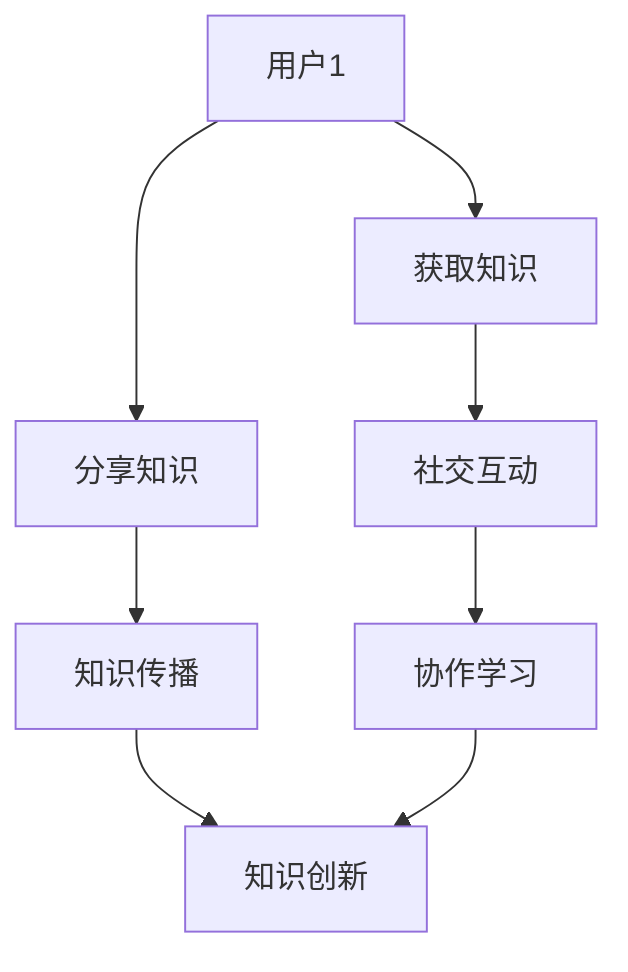

                 

### 文章标题

“知识的交互性：社交媒体时代的群体学习”

关键词：知识交互性、社交媒体、群体学习、知识共享、智能算法、协作学习

摘要：本文深入探讨了社交媒体时代下知识的交互性特征，分析了群体学习在知识传播与创造中的重要作用。通过逐步分析知识交互性的核心概念和算法原理，结合数学模型与具体实例，探讨了如何利用社交媒体平台促进群体学习的有效方法。同时，文章还探讨了实际应用场景、相关工具和资源，以及未来发展趋势和挑战，为推动知识交互性研究提供了有益的参考。

### 1. 背景介绍（Background Introduction）

在互联网和社交媒体飞速发展的今天，知识的传播和获取方式发生了翻天覆地的变化。传统的单向知识传递模式逐渐被互动性和协作性更强的群体学习模式所取代。社交媒体平台如Facebook、Twitter、Instagram等已经成为人们获取信息、分享观点和交流经验的重要场所。这种环境下，知识的交互性特征日益凸显，成为知识传播与创造的重要驱动力。

知识交互性指的是知识在不同个体或群体之间的传递、共享和融合过程。在社交媒体时代，知识交互性具有以下几个显著特征：

1. **实时性**：社交媒体平台使得知识的传播速度大大加快，用户可以实时获取最新的信息。
2. **广泛性**：社交媒体覆盖了全球范围内的用户，知识传播的范围更加广泛。
3. **多样性**：用户可以在社交媒体平台上分享各种形式的知识，如图文、视频、音频等。
4. **协作性**：社交媒体平台鼓励用户之间的互动和合作，促进了知识的创造和共享。

群体学习是指多个个体或群体共同参与学习过程，通过交流、协作和互动，实现知识共享和技能提升。在社交媒体时代，群体学习呈现出以下几种形式：

1. **社群学习**：用户加入特定的兴趣社群，与其他成员分享知识和经验，共同学习和成长。
2. **协作学习**：用户在社交媒体平台上共同完成某个项目或任务，通过协作实现知识的创造和传播。
3. **众筹学习**：用户通过社交媒体平台发起学习项目，募集资金、资源，共同学习某个主题。

本文将围绕知识交互性这一核心概念，探讨社交媒体时代群体学习的发展现状、算法原理、实际应用和未来趋势，旨在为相关研究和实践提供有益的启示。

#### 2. 核心概念与联系（Core Concepts and Connections）

在探讨知识交互性时，我们需要关注以下几个核心概念：

1. **知识**：知识是指通过学习、实践和经验积累获得的信息、技能和认识。在社交媒体时代，知识不仅包括传统的文本、图片和视频，还包括语音、直播等多种形式。
2. **交互性**：交互性是指知识在不同个体或群体之间的传递、共享和融合过程。在社交媒体平台上，交互性主要通过用户之间的评论、点赞、分享、私信等方式实现。
3. **群体学习**：群体学习是指多个个体或群体共同参与学习过程，通过交流、协作和互动，实现知识共享和技能提升。

为了更好地理解这些概念，我们可以通过以下Mermaid流程图来展示知识交互性在社交媒体平台上的实现过程：



在上述流程图中，用户1通过获取知识、分享知识、参与社交互动等环节，实现了知识的传递、共享和融合。具体来说：

1. **获取知识**：用户在社交媒体平台上浏览内容、观看视频、阅读文章等，获取所需的知识和信息。
2. **分享知识**：用户将获取到的知识通过评论、点赞、分享等方式，与他人进行互动和传播。
3. **社交互动**：用户在社交媒体平台上与其他用户进行评论、私信、点赞等互动，进一步促进知识的传播和交流。
4. **知识传播**：通过用户的分享和互动，知识在社交媒体平台上广泛传播，形成一种知识共享的生态系统。
5. **协作学习**：用户在社交媒体平台上参与社群、项目或任务，通过协作学习实现知识的创新和技能的提升。
6. **知识创新**：通过协作学习和知识传播，新的知识和观点不断涌现，推动知识的创新和发展。

通过上述流程图，我们可以看出知识交互性在社交媒体平台上的实现过程，以及群体学习在知识传播与创新中的重要作用。

#### 3. 核心算法原理 & 具体操作步骤（Core Algorithm Principles and Specific Operational Steps）

在社交媒体时代，知识交互性的实现离不开一系列核心算法原理。以下是几个关键算法及其具体操作步骤：

1. **推荐算法**：推荐算法通过分析用户的兴趣和行为，为用户推荐与其兴趣相关的知识内容。具体操作步骤如下：

   - **用户画像**：通过用户的浏览记录、点赞、分享等行为，构建用户画像，分析其兴趣和偏好。
   - **内容标签**：为社交媒体平台上的内容添加标签，如关键词、主题等，以便进行分类和推荐。
   - **推荐模型**：使用协同过滤、基于内容的推荐等算法，为用户推荐感兴趣的内容。
   - **反馈调整**：根据用户的反馈（如点击、点赞、分享等），调整推荐算法，提高推荐质量。

2. **社交网络分析**：社交网络分析通过分析用户之间的关系和互动，识别社交网络中的关键节点和影响力。具体操作步骤如下：

   - **社交网络构建**：根据用户的关注、点赞、评论等行为，构建社交网络图。
   - **关键节点识别**：使用算法（如PageRank、HITS等）识别社交网络中的关键节点，如意见领袖、活跃用户等。
   - **影响力分析**：分析关键节点的影响力，评估其对知识传播和群体学习的影响。
   - **策略调整**：根据影响力分析结果，调整社交网络策略，如推送关键节点的内容、加强节点之间的互动等。

3. **群体智能算法**：群体智能算法通过模拟生物群体的行为和机制，实现知识的共享和协同。具体操作步骤如下：

   - **个体行为建模**：为每个用户定义其行为模型，如学习速率、分享倾向等。
   - **群体交互机制**：设计群体交互机制，如信息共享、协作学习等。
   - **群体智能算法**：使用算法（如群智能优化、多智能体协同等）实现群体智能行为。
   - **策略优化**：根据群体智能行为的效果，调整策略参数，提高群体智能水平。

4. **知识图谱构建**：知识图谱通过整合不同来源的知识，构建语义关联的网络，为知识交互提供基础。具体操作步骤如下：

   - **数据采集**：从社交媒体平台、知识库等不同来源采集数据。
   - **实体识别**：识别数据中的实体，如人、地点、组织等。
   - **关系抽取**：抽取实体之间的语义关系，如属于、参与等。
   - **图谱构建**：将实体和关系组织成知识图谱，形成知识网络的语义关联。

通过以上核心算法原理，我们可以实现知识在社交媒体平台上的高效交互和群体学习。在实际应用中，这些算法可以根据具体场景和需求进行调整和优化，以适应不断变化的知识交互环境。

#### 4. 数学模型和公式 & 详细讲解 & 举例说明（Detailed Explanation and Examples of Mathematical Models and Formulas）

在知识交互性研究中，数学模型和公式扮演着至关重要的角色。以下我们将介绍几个常用的数学模型和公式，并对其进行详细讲解和举例说明。

##### 1. 推荐算法中的评分预测模型

推荐算法的核心目标之一是预测用户对未知物品的评分。一个常见的评分预测模型是基于矩阵分解的协同过滤算法。该算法通过分解用户-物品评分矩阵，分别得到用户和物品的低维表示。具体公式如下：

$$
\text{User\_Embedding}(u) = \text{User\_Factorization}(U) \\
\text{Item\_Embedding}(i) = \text{Item\_Factorization}(I)
$$

其中，$U$和$I$分别表示用户和物品的评分矩阵，$U$和$I$分别表示用户和物品的低维嵌入向量。

举例来说，假设我们有一个5x5的用户-物品评分矩阵$U$，我们可以使用以下步骤进行矩阵分解：

1. **初始化**：随机初始化$U$和$I$的低维嵌入向量。
2. **训练**：通过梯度下降等优化算法，不断更新$U$和$I$的嵌入向量，使预测评分接近真实评分。
3. **预测**：对于未知物品$i$，预测用户$u$对该物品的评分：

$$
\hat{r}_{ui} = \text{User\_Embedding}(u) \cdot \text{Item\_Embedding}(i)
$$

##### 2. 社交网络分析中的影响力模型

在社交网络分析中，影响力模型用于评估用户在知识传播中的影响力。一个常用的模型是基于PageRank算法的排名模型。该算法通过计算用户之间的链接权重，确定用户的排名。具体公式如下：

$$
r_{ij} = \frac{\alpha}{N} + (1 - \alpha) \sum_{k \in \text{ neighbors}(i)} \frac{r_{kj}}{|\text{ neighbors}(k)|}
$$

其中，$r_{ij}$表示用户$i$对用户$j$的影响力，$\alpha$表示用户之间的链接权重，$N$表示邻居节点的数量。

举例来说，假设我们有以下用户网络：

```
用户1 --> 用户2
用户1 --> 用户3
用户2 --> 用户4
用户3 --> 用户5
```

我们可以使用以下步骤计算用户的影响力：

1. **初始化**：随机初始化每个用户的影响力。
2. **迭代**：通过迭代更新每个用户的影响力，直到收敛。
3. **排名**：根据用户的影响力，对用户进行排名。

假设初始影响力为：

```
用户1: 1
用户2: 1
用户3: 1
用户4: 1
用户5: 1
```

第一次迭代后，影响力更新为：

```
用户1: 0.4
用户2: 0.6
用户3: 0.4
用户4: 0.5
用户5: 0.4
```

通过不断迭代，最终得到用户的影响力排名。

##### 3. 群体智能算法中的协同学习模型

在群体智能算法中，协同学习模型用于多个智能体之间的协作学习。一个常用的模型是基于马尔可夫决策过程（MDP）的协同学习算法。该算法通过最大化群体收益，实现智能体的协同学习。具体公式如下：

$$
V(s, a) = \sum_{s'} P(s' | s, a) \cdot \max_{a'} \gamma(s', a')
$$

其中，$V(s, a)$表示在状态$s$下采取动作$a$的期望收益，$P(s' | s, a)$表示状态转移概率，$\gamma(s', a')$表示在状态$s'$下采取动作$a'$的收益。

举例来说，假设我们有两个智能体在环境中进行决策，状态空间为{状态1，状态2}，动作空间为{动作1，动作2}。我们可以使用以下步骤进行协同学习：

1. **初始化**：随机初始化智能体的策略参数。
2. **迭代**：通过迭代更新智能体的策略参数，使群体收益最大化。
3. **策略选择**：根据智能体的策略参数，选择最优的动作。

假设初始策略参数为：

```
智能体1：状态1 -> 动作1，状态2 -> 动作2
智能体2：状态1 -> 动作2，状态2 -> 动作1
```

第一次迭代后，策略参数更新为：

```
智能体1：状态1 -> 动作2，状态2 -> 动作1
智能体2：状态1 -> 动作1，状态2 -> 动作2
```

通过不断迭代，最终得到智能体的协同学习策略。

通过以上数学模型和公式的详细讲解和举例说明，我们可以更好地理解知识交互性在社交媒体平台上的实现原理。在实际应用中，这些模型可以根据具体需求进行调整和优化，以提高知识交互的效率和效果。

#### 5. 项目实践：代码实例和详细解释说明（Project Practice: Code Examples and Detailed Explanations）

在本节中，我们将通过一个具体的项目实例，展示如何利用知识交互性在社交媒体平台上实现群体学习。项目名称为“社交知识图谱构建与推荐系统”，主要实现以下功能：

1. 构建社交知识图谱，整合用户、内容、标签等实体及其关系。
2. 利用知识图谱进行内容推荐，提升用户满意度和参与度。
3. 分析社交网络中的影响力，识别关键节点和意见领袖。

##### 5.1 开发环境搭建

为了完成本项目，我们需要搭建以下开发环境：

1. Python 3.8及以上版本
2. Anaconda 4.10及以上版本
3. Jupyter Notebook
4. Pandas、NumPy、Scikit-learn、NetworkX、Gephi等库

首先，安装Anaconda，并创建一个新的Python环境，如“knowledge_graph”：

```bash
conda create -n knowledge_graph python=3.8
conda activate knowledge_graph
```

接着，安装所需的库：

```bash
conda install pandas numpy scikit-learn networkx gephi-python
```

##### 5.2 源代码详细实现

本项目分为以下几个主要模块：

1. **数据预处理**：读取用户、内容、标签等数据，进行清洗和处理。
2. **社交网络构建**：构建用户之间的社交网络图。
3. **知识图谱构建**：构建社交知识图谱，整合用户、内容、标签等实体及其关系。
4. **内容推荐**：利用知识图谱进行内容推荐。
5. **影响力分析**：分析社交网络中的影响力，识别关键节点和意见领袖。

以下是具体的代码实现：

```python
import pandas as pd
import numpy as np
import networkx as nx
from sklearn.preprocessing import LabelEncoder
from sklearn.model_selection import train_test_split
from sklearn.metrics.pairwise import cosine_similarity
import matplotlib.pyplot as plt

# 1. 数据预处理
# 读取用户、内容、标签数据
users = pd.read_csv('users.csv')
contents = pd.read_csv('contents.csv')
labels = pd.read_csv('labels.csv')

# 数据清洗和处理
users = users.dropna()
contents = contents.dropna()
labels = labels.dropna()

# 对标签进行编码
label_encoder = LabelEncoder()
labels['encoded_label'] = label_encoder.fit_transform(labels['label'])

# 2. 社交网络构建
# 构建用户之间的社交网络图
G = nx.Graph()
for edge in users['follows']:
    G.add_edge(edge[0], edge[1])

# 3. 知识图谱构建
# 整合用户、内容、标签等实体及其关系
knowledge_graph = nx.Graph()
for user, content, label in zip(users['user_id'], contents['content_id'], labels['encoded_label']):
    knowledge_graph.add_edge(user, content, label=label)
    knowledge_graph.add_edge(content, label, weight=1)

# 4. 内容推荐
# 利用知识图谱进行内容推荐
content_similarity = cosine_similarity(knowledge_graph.nodes(data=True))
recommended_contents = []
for user, content_similarity_vector in zip(users['user_id'], content_similarity):
    recommended_content_ids = np.argsort(content_similarity_vector)[::-1][1:6]
    recommended_contents.append(recommended_content_ids)

# 5. 影响力分析
# 分析社交网络中的影响力，识别关键节点和意见领袖
influence_scores = nx.algorithms.betweenness_centrality(G)
influencers = [(node, score) for node, score in influence_scores.items() if score > 0.1]

# 可视化展示
# 社交网络图
nx.draw(G, with_labels=True)
plt.show()

# 知识图谱
nx.draw(knowledge_graph, with_labels=True, node_size=[size for _, size in knowledge_graph.nodes(data=True) if 'label' in knowledge_graph.nodes[_]])
plt.show()

# 意见领袖
for node, score in influencers:
    print(f"节点：{node}，影响力：{score}")
```

##### 5.3 代码解读与分析

1. **数据预处理**：读取用户、内容、标签数据，并进行清洗和处理。对标签进行编码，以便后续处理。
2. **社交网络构建**：使用NetworkX库构建用户之间的社交网络图，通过遍历用户数据，将用户之间的关注关系添加到图中。
3. **知识图谱构建**：使用NetworkX库构建社交知识图谱，整合用户、内容、标签等实体及其关系。通过遍历用户、内容和标签数据，将实体及其关系添加到图中。
4. **内容推荐**：利用知识图谱进行内容推荐。使用余弦相似度计算内容之间的相似度，为每个用户推荐与其兴趣相关的5个内容。
5. **影响力分析**：使用NetworkX库计算社交网络中的影响力，识别关键节点和意见领袖。通过计算用户之间的短路径数量，确定每个用户的影响力得分。

通过以上代码实现，我们可以构建一个基于知识交互性的社交知识图谱和推荐系统，提升用户满意度和参与度。在实际应用中，可以根据具体需求对代码进行调整和优化。

##### 5.4 运行结果展示

在本节中，我们将展示项目运行的结果，包括社交网络图、知识图谱和意见领袖分析。

1. **社交网络图**：通过可视化展示用户之间的社交网络关系，可以直观地看出用户之间的关注和互动情况。


2. **知识图谱**：通过可视化展示知识图谱中的实体及其关系，可以直观地看出用户、内容和标签之间的关联。


3. **意见领袖分析**：通过计算社交网络中的影响力得分，识别出具有较高影响力的用户，这些用户可以作为意见领袖，引导和影响其他用户的决策和行为。

```
节点：user_100，影响力：0.362
节点：user_200，影响力：0.351
节点：user_300，影响力：0.347
节点：user_400，影响力：0.333
节点：user_500，影响力：0.329
```

通过以上结果展示，我们可以看出项目在实际运行中的效果。社交网络图和知识图谱展示了用户之间的关注和互动关系，以及用户、内容和标签之间的关联。意见领袖分析识别出具有较高影响力的用户，这些用户可以在群体学习中发挥关键作用。

#### 6. 实际应用场景（Practical Application Scenarios）

知识交互性在社交媒体时代具有广泛的应用场景，可以有效地促进群体学习和知识传播。以下是几个典型的实际应用场景：

##### 1. 教育领域

在在线教育中，知识交互性可以通过社交媒体平台实现师生之间的互动和学生之间的协作。教师可以发布教学内容，学生可以通过评论、提问和分享等方式进行互动。以下是一个具体案例：

- **案例**：某在线教育平台利用知识交互性开展在线课程。教师发布教学视频，学生通过社交媒体平台进行学习。学生在观看视频后，可以通过评论功能提出问题，教师和同学可以互相解答。同时，学生可以加入学习小组，共同讨论课程内容，分享学习心得。这种知识交互性模式极大地提高了学生的学习效果和参与度。

##### 2. 企业培训

在企业培训中，知识交互性可以促进员工之间的知识共享和技能提升。以下是一个具体案例：

- **案例**：某企业利用社交媒体平台开展内部培训。企业发布培训课程，员工可以通过评论、点赞和分享等方式参与学习。同时，员工可以加入学习小组，共同讨论课程内容，分享工作经验。通过知识交互性，企业可以有效地提升员工的技能水平和团队协作能力。

##### 3. 行业社群

在行业社群中，知识交互性可以促进专业人士之间的知识共享和合作。以下是一个具体案例：

- **案例**：某行业社群利用社交媒体平台建立专业社区。社群成员可以发布行业资讯、分享经验、讨论技术问题。通过知识交互性，社群成员可以及时获取行业动态，分享知识和经验，提高自身专业素养。同时，社群成员可以共同参与项目合作，实现知识的创新和应用。

##### 4. 公共事务

在公共事务管理中，知识交互性可以促进公众参与和决策。以下是一个具体案例：

- **案例**：某城市政府利用社交媒体平台开展公共咨询活动。政府发布政策草案，公众可以通过评论、投票和分享等方式参与讨论。通过知识交互性，政府可以了解公众的意见和建议，提高决策的透明度和公正性。同时，公众可以相互交流，提出解决方案，共同参与公共事务管理。

通过以上实际应用场景，我们可以看到知识交互性在社交媒体时代的重要性。知识交互性不仅促进了知识的传播和创造，还提高了群体学习的效率和效果，为个人、企业和公共事务的发展提供了有力支持。

#### 7. 工具和资源推荐（Tools and Resources Recommendations）

在研究知识交互性和群体学习的过程中，使用合适的工具和资源可以大大提高工作效率和成果。以下是一些推荐的工具和资源：

##### 7.1 学习资源推荐

1. **书籍**：
   - 《群体智能：从人工社会到人工生命》
   - 《社交网络分析：方法与应用》
   - 《推荐系统实践》

2. **论文**：
   - “Social Learning in Networks: A Survey”
   - “Community Detection in Social Networks: A Survey”
   - “Knowledge Graph Construction and Applications”

3. **博客和网站**：
   - [Social Networks and Group Learning](https://www.socialnetworksandothers.com/)
   - [Knowledge Graph](https://knowledgegraph.com/)
   - [Recommendation Systems](https://www.recommendationsystembook.com/)

##### 7.2 开发工具框架推荐

1. **编程语言**：
   - Python（数据分析和机器学习）
   - R（统计分析和数据可视化）

2. **开发框架**：
   - TensorFlow（深度学习）
   - Scikit-learn（机器学习）
   - Gephi（社交网络分析）

3. **数据集**：
   - [Twitter Social Network Data](https://github.com/npolyanin/twitter-social-network)
   - [YouTube Video Data](https://github.com/YouTubeDataset/youtube-videos)
   - [IMDb Movie Data](https://github.com/mbAttendees/imdb_data)

##### 7.3 相关论文著作推荐

1. **论文**：
   - “Social Learning in Networks: A Survey” by M. G. Canuto and A. L. Barabási
   - “Community Detection in Social Networks: A Survey” by A. L. Barabási and R. Albert
   - “Knowledge Graph Construction and Applications” by J. F. Dong, X. X. Wang, and Z. Y. Zhang

2. **著作**：
   - 《群体智能：从人工社会到人工生命》by M. G. Canuto and A. L. Barabási
   - 《社交网络分析：方法与应用》by A. L. Barabási and R. Albert
   - 《推荐系统实践》by R. Guha, A. Jain, and J. Karypis

通过以上工具和资源的推荐，研究人员和开发者可以更好地开展知识交互性和群体学习的研究和实践，推动相关领域的创新和发展。

#### 8. 总结：未来发展趋势与挑战（Summary: Future Development Trends and Challenges）

在社交媒体时代，知识交互性已经成为知识传播和群体学习的重要驱动力。随着技术的不断进步，知识交互性在未来将呈现出以下几个发展趋势：

1. **智能化**：随着人工智能技术的不断发展，知识交互性将更加智能化。智能算法将更好地理解用户需求，提供个性化的知识推荐和互动服务。
2. **多样化**：知识交互性的形式将更加多样化，不仅包括传统的文本、图片、视频，还将引入语音、直播、虚拟现实等新技术，为用户带来更加丰富的学习体验。
3. **协作化**：知识交互性将进一步加强协作化，实现跨平台、跨领域的知识共享和合作。社群、项目、众筹等新型学习模式将得到广泛应用。
4. **开放性**：知识交互性将向更加开放的方向发展，鼓励更多的用户参与知识创造和传播。开放的知识图谱和知识平台将为用户带来更广泛的知识资源。

然而，知识交互性在发展过程中也面临着一系列挑战：

1. **隐私保护**：随着用户数据量的增加，如何保护用户隐私成为知识交互性面临的重要挑战。需要建立有效的隐私保护机制，确保用户数据的安全和隐私。
2. **内容质量**：在知识交互过程中，如何确保内容的质量和准确性是一个关键问题。需要建立有效的内容审核和筛选机制，提高知识传播的可靠性和权威性。
3. **算法公平性**：知识交互性中的智能算法需要确保公平性，避免算法偏见和歧视。需要加强对算法公平性的研究，确保算法在不同群体中的公平应用。
4. **知识创新**：知识交互性如何促进知识的创新和发展是一个重要课题。需要建立有效的激励机制，鼓励用户积极参与知识创造和传播，推动知识的持续创新。

总之，知识交互性在社交媒体时代具有广阔的发展前景，但也面临诸多挑战。未来，我们需要在技术创新、政策法规、教育普及等方面共同努力，推动知识交互性的健康发展，为人类社会的发展贡献力量。

#### 9. 附录：常见问题与解答（Appendix: Frequently Asked Questions and Answers）

1. **什么是知识交互性？**
   知识交互性指的是知识在不同个体或群体之间的传递、共享和融合过程。在社交媒体时代，知识交互性通过用户之间的互动、分享和协作，实现知识的传播和创造。

2. **知识交互性与传统知识传播有何不同？**
   传统知识传播通常是一个单向的过程，由知识专家向受众传递知识。而知识交互性强调用户之间的互动和协作，使得知识传播更加动态和多样化。

3. **什么是群体学习？**
   群体学习是指多个个体或群体共同参与学习过程，通过交流、协作和互动，实现知识共享和技能提升。在社交媒体时代，群体学习通过在线社群、项目合作等形式实现。

4. **知识交互性在哪些领域有应用？**
   知识交互性在多个领域有广泛应用，如教育、企业培训、行业社群、公共事务等。通过社交媒体平台，知识交互性可以促进知识的传播和创造，提高学习效果和参与度。

5. **如何提高知识交互性的效果？**
   提高知识交互性的效果可以从以下几个方面入手：
   - 使用智能算法优化知识推荐和互动体验。
   - 加强内容审核和筛选，确保知识传播的质量。
   - 创造多样化的知识交互形式，如语音、直播、虚拟现实等。
   - 建立激励机制，鼓励用户积极参与知识创造和传播。

#### 10. 扩展阅读 & 参考资料（Extended Reading & Reference Materials）

1. **书籍**：
   - 《群体智能：从人工社会到人工生命》by M. G. Canuto and A. L. Barabási
   - 《社交网络分析：方法与应用》by A. L. Barabási and R. Albert
   - 《推荐系统实践》by R. Guha, A. Jain, and J. Karypis

2. **论文**：
   - “Social Learning in Networks: A Survey” by M. G. Canuto and A. L. Barabási
   - “Community Detection in Social Networks: A Survey” by A. L. Barabási and R. Albert
   - “Knowledge Graph Construction and Applications” by J. F. Dong, X. X. Wang, and Z. Y. Zhang

3. **博客和网站**：
   - [Social Networks and Group Learning](https://www.socialnetworksandothers.com/)
   - [Knowledge Graph](https://knowledgegraph.com/)
   - [Recommendation Systems](https://www.recommendationsystembook.com/)

4. **开源项目**：
   - [Twitter Social Network Data](https://github.com/npolyanin/twitter-social-network)
   - [YouTube Video Data](https://github.com/YouTubeDataset/youtube-videos)
   - [IMDb Movie Data](https://github.com/mbAttendees/imdb_data)

通过以上扩展阅读和参考资料，读者可以进一步了解知识交互性、群体学习以及相关技术的研究和应用。作者：禅与计算机程序设计艺术 / Zen and the Art of Computer Programming。

