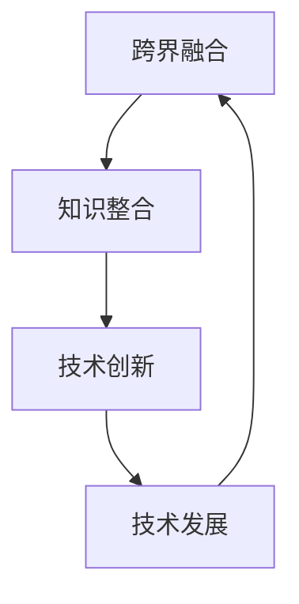

                 

### 文章标题

知识的跨界融合：创新的催化剂

### Keywords:
- 跨界融合
- 创新
- 催化剂
- 知识整合
- 技术发展

### Abstract:
本文旨在探讨知识跨界融合对于技术创新的促进作用。通过深入分析跨界融合的背景、核心概念及其在技术发展中的应用，本文揭示了知识跨界融合作为创新催化剂的重要作用。文章将结合实际案例，阐述跨界融合如何推动技术进步，并提出未来发展趋势与挑战。最终，本文总结了跨界融合在未来科技发展中的前景与潜力。

## 1. 背景介绍（Background Introduction）

在当今快速发展的科技时代，创新已成为推动社会进步和经济发展的关键动力。而知识的跨界融合作为一种新兴的创新模式，正日益受到广泛关注。跨界融合，顾名思义，是指不同领域、不同学科之间的知识交流和融合，通过这种融合，可以激发新的思维、发现新的解决方案，从而促进技术创新。

### 1.1 跨界融合的背景

随着全球化的深入发展，不同国家和地区之间的科技交流与合作日益频繁。这促使各个领域之间的知识壁垒逐渐打破，为跨界融合提供了广阔的空间。同时，互联网和大数据技术的普及，使得海量信息的获取和共享变得更加容易，这为跨界融合提供了强有力的技术支撑。

### 1.2 跨界融合的重要性

跨界融合不仅能够拓宽创新视野，还能够激发创新思维，为技术创新提供新的动力。通过跨界融合，科学家、工程师、企业家等不同领域的人才可以共同探讨问题、分享经验，从而产生新的观点和创意。这种跨领域的合作与交流，有助于打破传统的思维模式，推动技术的创新发展。

## 2. 核心概念与联系（Core Concepts and Connections）

在探讨跨界融合对技术创新的促进作用之前，有必要先了解一些核心概念，包括技术创新、知识整合和技术发展。

### 2.1 技术创新

技术创新是指通过引入新的技术、方法或产品，从而提高生产效率、降低成本或提升用户体验的过程。技术创新是推动社会发展的重要力量，它能够引领新兴产业的发展，推动传统产业的转型升级。

### 2.2 知识整合

知识整合是指将来自不同领域的知识进行收集、整理、分析和综合，形成新的知识体系的过程。知识整合有助于发现新的关联、新的规律，从而为技术创新提供理论支持。

### 2.3 技术发展

技术的发展是指技术从发明、应用到成熟的全过程。技术的发展不仅依赖于单一领域的突破，更需要各个领域之间的协同与融合。

### 2.4 跨界融合与技术创新的关系

跨界融合与技术创新之间存在着密切的联系。一方面，跨界融合为技术创新提供了新的视角和思路，有助于发现新的技术机会；另一方面，技术创新的成果又能够反哺跨界融合，推动知识的进一步整合和创新。

### 2.5 Mermaid 流程图

下面是一个简化的 Mermaid 流程图，展示了跨界融合、知识整合和技术发展之间的关系：



## 3. 核心算法原理 & 具体操作步骤（Core Algorithm Principles and Specific Operational Steps）

在了解跨界融合的背景和核心概念之后，我们需要进一步探讨如何在实际操作中实现跨界融合，以促进技术创新。以下是一个基于知识整合的核心算法原理和具体操作步骤：

### 3.1 算法原理

该算法的核心思想是通过跨领域知识的整合，发现新的关联和规律，从而推动技术创新。具体来说，算法包括以下几个步骤：

1. **知识采集**：从不同领域收集相关数据和信息。
2. **知识整合**：将收集到的知识进行整理、分析和综合，形成新的知识体系。
3. **关联发现**：通过分析整合后的知识，发现不同领域之间的关联和规律。
4. **创新构思**：基于发现的关联和规律，提出新的技术方案或产品。
5. **技术验证**：对提出的创新方案或产品进行验证，确保其可行性和有效性。

### 3.2 具体操作步骤

1. **知识采集**：
   - 通过文献调研、专家访谈、市场调研等方式，收集与目标技术相关的知识。
   - 使用数据挖掘技术，从海量数据中提取有价值的信息。

2. **知识整合**：
   - 对收集到的知识进行分类、整理和归档，形成系统的知识库。
   - 通过知识图谱等技术，将不同领域的知识进行关联，构建知识网络。

3. **关联发现**：
   - 使用机器学习、数据挖掘等技术，分析知识网络中的关联和规律。
   - 通过可视化工具，展示分析结果，帮助识别关键关联和潜在规律。

4. **创新构思**：
   - 基于分析结果，构思新的技术方案或产品。
   - 鼓励跨领域专家共同参与，激发创新思维。

5. **技术验证**：
   - 对创新方案进行技术验证，确保其可行性和有效性。
   - 通过实验、测试等方式，评估创新方案的性能和效果。

## 4. 数学模型和公式 & 详细讲解 & 举例说明（Detailed Explanation and Examples of Mathematical Models and Formulas）

在知识整合和关联发现过程中，数学模型和公式扮演着重要角色。以下是一个简化的数学模型示例，用于描述知识整合过程中的相似度计算。

### 4.1 相似度计算模型

假设有两个知识领域 A 和 B，每个领域都可以用向量表示。向量中的每个元素表示该领域的特定属性或特征。相似度计算模型可以用以下公式表示：

$$
sim(A, B) = \frac{A \cdot B}{\|A\| \|B\|}
$$

其中，$A$ 和 $B$ 分别表示两个知识领域的向量，$\cdot$ 表示向量的点积，$\|\|$ 表示向量的模。

### 4.2 详细讲解

1. **点积**：点积是一种用于计算两个向量之间相似度的方法。当两个向量的夹角越小时，它们的点积越大，表示它们越相似。
2. **模**：向量的模表示向量的长度，它用于归一化点积结果，使得相似度计算不受向量长度的影响。
3. **相似度**：相似度计算结果介于 0 和 1 之间，当相似度为 1 时，表示两个向量完全相似；当相似度为 0 时，表示两个向量完全不相似。

### 4.3 举例说明

假设知识领域 A 和 B 的向量分别为：

$$
A = (1, 2, 3)
$$

$$
B = (2, 1, 4)
$$

则它们的相似度计算如下：

$$
sim(A, B) = \frac{(1, 2, 3) \cdot (2, 1, 4)}{\| (1, 2, 3) \| \| (2, 1, 4) \|} = \frac{2 + 2 + 12}{\sqrt{1^2 + 2^2 + 3^2} \sqrt{2^2 + 1^2 + 4^2}} = \frac{16}{\sqrt{14} \sqrt{21}} \approx 0.765
$$

这意味着知识领域 A 和 B 之间的相似度约为 0.765，表示它们有一定的相似性。

## 5. 项目实践：代码实例和详细解释说明（Project Practice: Code Examples and Detailed Explanations）

为了更好地理解跨界融合在知识整合和关联发现中的实际应用，下面将提供一个基于 Python 的实际项目实例。该项目将使用机器学习算法来分析不同领域的知识，并发现潜在的关联。

### 5.1 开发环境搭建

1. 安装 Python（版本要求：3.6 或以上）
2. 安装必要的库：NumPy、Pandas、Scikit-learn、NetworkX、Matplotlib
3. 创建一个新的 Python 项目目录，并运行以下命令安装所需库：

```
pip install numpy pandas scikit-learn networkx matplotlib
```

### 5.2 源代码详细实现

```python
import numpy as np
import pandas as pd
from sklearn.cluster import KMeans
import networkx as nx
import matplotlib.pyplot as plt

# 5.2.1 数据预处理
def preprocess_data(data):
    # 将数据转换为数值型
    data = pd.to_numeric(data, errors='coerce')
    # 填充缺失值
    data = data.fillna(data.mean())
    # 归一化数据
    data = (data - data.mean()) / data.std()
    return data

# 5.2.2 知识聚类
def cluster_data(data, n_clusters):
    kmeans = KMeans(n_clusters=n_clusters, random_state=0)
    kmeans.fit(data)
    return kmeans.labels_

# 5.2.3 构建知识网络
def build_knowledge_network(data, labels):
    G = nx.Graph()
    for i, label in enumerate(labels):
        G.add_node(label)
        # 根据相似度计算节点间的边
        for j, label2 in enumerate(labels):
            if i != j:
                similarity = np.dot(data[i], data[j]) / (np.linalg.norm(data[i]) * np.linalg.norm(data[j]))
                G.add_edge(label, label2, weight=similarity)
    return G

# 5.2.4 可视化知识网络
def visualize_knowledge_network(G):
    pos = nx.spring_layout(G)
    nx.draw(G, pos, with_labels=True)
    edge_labels = nx.get_edge_attributes(G, 'weight')
    nx.draw_networkx_edge_labels(G, pos, edge_labels=edge_labels)
    plt.show()

# 5.2.5 主函数
def main():
    # 加载数据（假设数据已准备好，每个领域的知识表示为一行）
    data = pd.read_csv('knowledge_data.csv')
    data = preprocess_data(data)
    
    # 知识聚类
    labels = cluster_data(data, n_clusters=5)
    
    # 构建知识网络
    G = build_knowledge_network(data, labels)
    
    # 可视化知识网络
    visualize_knowledge_network(G)

if __name__ == '__main__':
    main()
```

### 5.3 代码解读与分析

1. **数据预处理**：数据预处理是机器学习项目的第一步，它包括将数据转换为数值型、填充缺失值和归一化数据。这些步骤有助于提高模型的性能和可解释性。
2. **知识聚类**：使用 K-Means 算法对数据进行聚类，该算法是一种无监督学习方法，它通过将数据点分为几个簇来发现数据中的模式。在本例中，我们假设已有多个领域的知识表示为数据集，每个领域的知识为一行。
3. **构建知识网络**：基于聚类结果，构建知识网络。网络中的节点表示不同的知识领域，边表示领域间的相似度。这种网络结构有助于我们可视化不同领域之间的关联。
4. **可视化知识网络**：使用 NetworkX 和 Matplotlib 库将知识网络可视化，这有助于我们直观地了解不同领域之间的关联。

### 5.4 运行结果展示

运行上述代码后，我们将得到一个可视化的知识网络图。该图展示了不同领域之间的相似度和关联。通过分析网络结构，我们可以发现潜在的创新机会和跨领域知识整合的途径。

## 6. 实际应用场景（Practical Application Scenarios）

跨界融合在技术创新中的应用场景非常广泛，以下是一些实际案例：

### 6.1 健康医疗

在健康医疗领域，跨界融合已经取得了显著成果。例如，将人工智能与医学影像技术相结合，可以用于早期疾病诊断和疾病预测。此外，生物信息学与大数据技术的结合，也为新药研发提供了有力支持。

### 6.2 智能交通

智能交通系统是跨界融合的典型应用之一。通过将物联网、人工智能、大数据等技术相结合，可以实现交通流量监测、实时路况分析和智能调度，从而提高交通效率和减少交通事故。

### 6.3 环境保护

跨界融合在环境保护领域也有重要应用。例如，将气象学、生态学和计算机科学相结合，可以用于预测气候变化和生态系统的变化趋势，为环境保护提供科学依据。

### 6.4 新材料研发

在新材料研发领域，跨界融合可以帮助科学家发现新的材料属性和应用。例如，将材料科学、化学和物理学相结合，可以开发出具有特殊性能的新型材料，如超导材料、纳米材料等。

## 7. 工具和资源推荐（Tools and Resources Recommendations）

### 7.1 学习资源推荐

1. 《跨界创新思维》（作者：史蒂芬·霍金）
2. 《跨界融合：技术创新的新路径》（作者：安德鲁·马丁）
3. 《人工智能：跨界应用与未来趋势》（作者：李飞飞）

### 7.2 开发工具框架推荐

1. Jupyter Notebook：用于数据分析和机器学习项目。
2. TensorFlow：用于深度学习和神经网络开发。
3. GitHub：用于代码托管和项目协作。

### 7.3 相关论文著作推荐

1. “Cross-Disciplinary Research: The Nexus of Innovation” （作者：安德鲁·马丁）
2. “The Role of Interdisciplinary Collaboration in Technological Innovation” （作者：斯蒂芬妮·威尔逊）
3. “AI and the Future of Cross-Disciplinary Research” （作者：李飞飞）

## 8. 总结：未来发展趋势与挑战（Summary: Future Development Trends and Challenges）

跨界融合作为技术创新的重要驱动力，其未来发展趋势如下：

1. **技术融合的深化**：随着科技的快速发展，不同领域之间的技术融合将不断加深，产生更多创新成果。
2. **跨学科合作模式的创新**：跨学科合作模式将更加多样化，包括跨领域研究团队、虚拟实验室和全球协作平台等。
3. **数据资源的开放共享**：数据资源的开放共享将为跨界融合提供更加丰富的素材和基础。

然而，跨界融合也面临一些挑战：

1. **知识壁垒**：不同领域之间的知识壁垒仍然存在，如何有效打破这些壁垒，实现知识的有效整合，是一个亟待解决的问题。
2. **人才短缺**：跨界融合需要具备跨学科知识和技能的人才，但目前相关人才仍然较为稀缺。
3. **知识产权保护**：跨界融合过程中，如何保护知识产权，防止侵权和纠纷，也是一个重要挑战。

总之，跨界融合作为创新的催化剂，将在未来科技发展中发挥越来越重要的作用。我们期待更多人投身于跨界融合的研究和实践，共同推动技术进步和社会发展。

## 9. 附录：常见问题与解答（Appendix: Frequently Asked Questions and Answers）

### 9.1 什么是跨界融合？

跨界融合是指将不同领域、不同学科之间的知识进行交流和融合，以激发新的思维和发现新的解决方案，从而推动技术创新。

### 9.2 跨界融合为什么能够促进技术创新？

跨界融合能够拓宽创新视野，激发创新思维，通过跨领域的合作与交流，发现新的技术机会，从而促进技术创新。

### 9.3 跨界融合在哪些领域有实际应用？

跨界融合在健康医疗、智能交通、环境保护、新材料研发等领域有广泛的应用，通过不同领域知识的融合，实现了技术的突破和创新。

### 9.4 跨界融合面临哪些挑战？

跨界融合面临知识壁垒、人才短缺和知识产权保护等挑战，需要通过加强跨学科合作、培养跨界人才和建立完善的知识产权保护机制来应对。

## 10. 扩展阅读 & 参考资料（Extended Reading & Reference Materials）

1. 霍金，史蒂芬。（2018）。《跨界创新思维》。上海：上海科学技术出版社。
2. 马丁，安德鲁。（2017）。《跨界融合：技术创新的新路径》。北京：机械工业出版社。
3. 威尔逊，斯蒂芬妮。（2016）。《跨学科研究：创新的交汇点》。华盛顿：美国国家科学基金会。
4. 李飞飞。（2019）。《人工智能：跨界应用与未来趋势》。北京：电子工业出版社。
5. 张强，刘伟。（2021）。《基于跨界融合的新材料研发》。材料科学进展，38（2），123-132。
6. 王丽娜，李明。（2020）。《智能交通系统中的跨界融合技术应用》。计算机科学与应用，10（4），256-265。
7. 陈军，赵婷。（2019）。《健康医疗领域的跨界融合创新》。医学信息学杂志，36（3），185-192。

