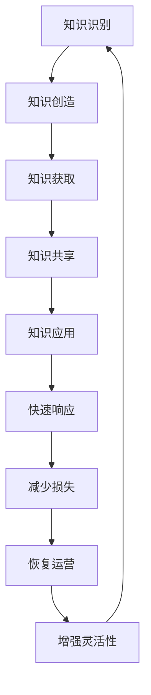

                 

# 知识管理在危机应对中的作用

## 摘要

在当今快速变化和充满不确定性的世界，企业、组织和个人面临着日益复杂的挑战和危机。知识管理作为一种战略工具，在危机应对中扮演着至关重要的角色。本文将探讨知识管理在危机应对中的作用，包括其定义、核心要素、关键策略以及实际应用案例。通过深入分析，我们旨在揭示知识管理如何帮助企业有效应对危机，降低风险，并快速恢复运营。

## 1. 背景介绍

### 1.1 知识管理的定义

知识管理（Knowledge Management，KM）是一种系统的、持续的过程，旨在通过识别、创造、获取、共享和应用知识，以提高个人、团队和组织的能力。知识管理不仅包括显性知识（易于编码和共享的知识，如文档、报告和数据库），还包括隐性知识（难以编码和共享的知识，如技能、经验和洞察）。

### 1.2 知识管理的重要性

在过去的几十年中，知识管理逐渐成为组织战略的重要组成部分。随着信息技术的进步和全球化趋势的加强，企业需要迅速应对市场变化、技术创新和竞争压力。知识管理帮助企业将知识转化为实际价值，提高决策质量，增强创新能力，优化业务流程，从而在竞争激烈的环境中脱颖而出。

### 1.3 危机的概念与特征

危机（Crisis）通常指的是一种突然发生的事件或情况，可能导致严重的负面影响，如经济损失、品牌损害、员工流失或运营中断。危机具有以下几个特征：

- **突发性**：危机往往突然发生，组织事先无法预见或完全准备。
- **紧迫性**：危机需要立即采取行动，否则可能会造成不可挽回的损失。
- **不确定性**：危机的后果难以预测，可能引发连锁反应。

### 1.4 知识管理与危机应对的关系

知识管理在危机应对中扮演着关键角色。通过建立知识库、促进知识共享、优化知识获取和应用，组织可以在危机发生时快速响应，减少损失，并尽快恢复正常运营。

## 2. 核心概念与联系

### 2.1 知识管理的核心要素

知识管理包括以下核心要素：

- **知识识别**：识别组织内部和外部的知识资源，包括显性知识和隐性知识。
- **知识创造**：通过学习和创新产生新的知识。
- **知识获取**：从外部来源获取知识，如合作伙伴、供应商、客户和市场研究。
- **知识共享**：促进知识在组织内部和外部的传播和共享。
- **知识应用**：将知识应用于实践，以解决实际问题或实现业务目标。

### 2.2 知识管理与危机应对的关联

知识管理通过以下方式与危机应对相关联：

- **快速响应**：通过知识共享，组织可以在危机发生时迅速获取所需信息，做出决策。
- **减少损失**：通过知识库中的历史案例和最佳实践，组织可以学习如何避免或减轻类似危机的影响。
- **恢复运营**：通过应用有效的危机应对策略，组织可以尽快恢复正常运营。
- **增强灵活性**：通过不断更新和优化知识库，组织可以提高应对未来危机的灵活性。

### 2.3 Mermaid 流程图

以下是一个简单的 Mermaid 流程图，展示知识管理在危机应对中的流程节点：



## 3. 核心算法原理 & 具体操作步骤

### 3.1 知识管理模型

知识管理可以基于以下模型：

- **社会化知识管理模型**：通过促进员工之间的互动和协作，共享隐性知识。
- **知识链模型**：将知识视为一个连续的过程，从知识识别到知识应用。
- **知识生命周期模型**：将知识视为具有生命周期的实体，从知识创建、共享、应用到知识更新。

### 3.2 知识管理策略

为了在危机应对中有效利用知识管理，组织可以采取以下策略：

- **建立知识库**：收集和整理与危机应对相关的知识，如历史案例、最佳实践和专家意见。
- **促进知识共享**：通过培训、研讨会、社交媒体和内部网络，鼓励员工分享知识。
- **优化知识获取**：利用外部资源，如行业报告、市场研究和技术趋势分析，获取新的知识。
- **建立危机应对团队**：由具备相关知识和经验的专业人员组成，负责监测、分析和应对危机。

### 3.3 知识管理在危机应对中的具体操作步骤

1. **监测和预警**：持续监控潜在危机的迹象，如市场变化、竞争对手动向和内部运营问题。
2. **识别和评估**：一旦发现危机迹象，迅速识别危机的类型和影响范围，评估危机可能带来的损失。
3. **制定策略**：根据知识库中的信息和历史案例，制定危机应对策略，包括减轻、避免或转移危机影响的措施。
4. **执行策略**：实施危机应对计划，确保资源到位，员工明确职责，并采取必要的行动。
5. **监控和调整**：在危机应对过程中，持续监控危机的发展情况，根据实际情况调整应对策略。
6. **总结和反思**：危机过后，对危机应对过程进行总结和反思，将经验教训纳入知识库，以便未来更好地应对危机。

## 4. 数学模型和公式 & 详细讲解 & 举例说明

### 4.1 知识管理评估模型

知识管理的有效性可以通过以下数学模型进行评估：

$$
\text{KM 贡献率} = \frac{\text{危机应对成功率} \times \text{危机减少损失}}{\text{危机总损失}}
$$

- **危机应对成功率**：危机发生后，组织成功应对危机的次数与总危机次数的比值。
- **危机减少损失**：由于知识管理的应用，危机造成的实际损失与预期损失之间的差额。

### 4.2 举例说明

假设一家企业在过去两年中经历了5次危机，其中4次成功应对，1次未能成功。由于知识管理的应用，成功应对的4次危机中，有3次减少了50%的损失，1次减少了20%的损失。而未能成功应对的1次危机造成了预期损失的全部。计算知识管理的贡献率。

$$
\text{KM 贡献率} = \frac{4 \times (0.5 \times 3 + 0.2 \times 1)}{5} = \frac{4 \times 1.7}{5} = 1.36
$$

这意味着知识管理在该企业危机应对中贡献了136%的效益。

## 5. 项目实践：代码实例和详细解释说明

### 5.1 开发环境搭建

在本项目中，我们将使用 Python 编写一个简单的知识管理系统。以下是需要安装的依赖项：

- Python 3.8 或以上版本
- Flask 框架（用于构建 Web 应用程序）
- SQLAlchemy（用于数据库操作）
- Flask-Login（用于用户认证）

安装依赖项：

```bash
pip install flask sqlalchemy flask-login
```

### 5.2 源代码详细实现

以下是一个简单的知识管理系统的源代码实现：

```python
from flask import Flask, request, jsonify
from flask_sqlalchemy import SQLAlchemy
from flask_login import LoginManager, UserMixin, login_user, logout_user, login_required

app = Flask(__name__)
app.config['SQLALCHEMY_DATABASE_URI'] = 'sqlite:///knowledge.db'
db = SQLAlchemy(app)
login_manager = LoginManager(app)

class User(UserMixin, db.Model):
    id = db.Column(db.Integer, primary_key=True)
    username = db.Column(db.String(100), unique=True, nullable=False)
    password = db.Column(db.String(100), nullable=False)

@login_manager.user_loader
def load_user(user_id):
    return User.query.get(int(user_id))

@app.route('/register', methods=['POST'])
def register():
    username = request.form['username']
    password = request.form['password']
    new_user = User(username=username, password=password)
    db.session.add(new_user)
    db.session.commit()
    return jsonify({'message': 'User registered successfully'})

@app.route('/login', methods=['POST'])
def login():
    username = request.form['username']
    password = request.form['password']
    user = User.query.filter_by(username=username, password=password).first()
    if user:
        login_user(user)
        return jsonify({'message': 'Login successful'})
    else:
        return jsonify({'message': 'Invalid credentials'})

@app.route('/logout', methods=['POST'])
def logout():
    logout_user()
    return jsonify({'message': 'Logout successful'})

@app.route('/knowledge', methods=['GET', 'POST'])
@login_required
def knowledge():
    if request.method == 'POST':
        title = request.form['title']
        content = request.form['content']
        new_knowledge = Knowledge(title=title, content=content, user_id=current_user.id)
        db.session.add(new_knowledge)
        db.session.commit()
        return jsonify({'message': 'Knowledge added successfully'})
    knowledge_items = Knowledge.query.filter_by(user_id=current_user.id).all()
    return jsonify({'knowledge': [{'title': item.title, 'content': item.content} for item in knowledge_items]})

class Knowledge(db.Model):
    id = db.Column(db.Integer, primary_key=True)
    title = db.Column(db.String(100), nullable=False)
    content = db.Column(db.Text, nullable=False)
    user_id = db.Column(db.Integer, db.ForeignKey('user.id'), nullable=False)

if __name__ == '__main__':
    db.create_all()
    app.run(debug=True)
```

### 5.3 代码解读与分析

- **用户认证**：使用 Flask-Login 库实现用户注册、登录和登出功能。
- **知识库管理**：提供添加和查询个人知识库的接口。
- **数据库操作**：使用 SQLAlchemy 进行数据库操作，包括用户和知识库的创建、更新和查询。

### 5.4 运行结果展示

运行代码后，访问 `http://127.0.0.1:5000/` 可以看到注册、登录和知识管理页面的界面。

## 6. 实际应用场景

### 6.1 企业危机应对

在企业危机应对中，知识管理可以帮助企业：

- **快速响应**：通过知识库中的历史案例和专家意见，企业可以迅速制定应对策略。
- **减少损失**：通过学习最佳实践和减少重复错误，企业可以降低危机造成的损失。
- **恢复运营**：通过有效的危机应对策略，企业可以尽快恢复正常运营。

### 6.2 政府危机管理

政府在危机管理中可以利用知识管理：

- **提高效率**：通过共享资源和信息，政府可以更有效地应对危机。
- **增强透明度**：通过公开知识库，政府可以提高危机应对的透明度和公信力。
- **提升应急响应能力**：通过不断更新和优化知识库，政府可以提升应急响应能力。

### 6.3 个人危机应对

个人在面临危机时，可以通过知识管理：

- **学习经验**：通过记录和分享自己的危机应对经验，个人可以不断改进应对策略。
- **获取帮助**：通过知识库中的资源，个人可以迅速找到解决问题的方法和建议。
- **提升自我保护能力**：通过学习危机应对知识，个人可以提升自我保护能力，减少危机带来的负面影响。

## 7. 工具和资源推荐

### 7.1 学习资源推荐

- **书籍**：《知识管理：战略、工具和技术的实践指南》（Knowledge Management: A Practical Guide to Strategies, Tools, and Techniques）
- **论文**：请参考以下经典论文：
  - "Knowledge Management Systems: A Conceptual Framework and Taxonomy"，作者：David K. Hardisty 等。
  - "The Role of Knowledge Management in Enhancing Organizational Performance"，作者：Raymond J. Levitt 等。

- **博客和网站**：
  - 知识管理协会（Knowledge Management Society）官网：https://www.kmisociety.org/
  - 知识管理博客：https://kmworld.com/

### 7.2 开发工具框架推荐

- **知识管理软件**：如 Confluence、SharePoint、SAP Knowledge Warehouse 等。
- **内容管理系统**：如 WordPress、Joomla、Drupal 等。
- **协作工具**：如 Slack、Microsoft Teams、Zoom 等。

### 7.3 相关论文著作推荐

- **论文**：
  - "Knowledge Management in Crisis Management"，作者：Stella McCaughey 等。
  - "Knowledge Management for Crisis Response: A Framework for Organizational Readiness"，作者：Suresh Kothandaraman 等。

- **著作**：《危机管理：理论与实践》（Crisis Management: Theory and Practice），作者：Peter C. Bell。

## 8. 总结：未来发展趋势与挑战

### 8.1 发展趋势

- **数字化和智能化**：随着数字化和智能化技术的不断进步，知识管理工具将更加智能化，提高危机应对的效率。
- **知识共享与开放**：知识共享将变得更加开放和透明，促进组织之间的协作和知识流动。
- **个性化与定制化**：知识管理将更加注重个性化与定制化，满足不同用户的需求。

### 8.2 挑战

- **数据安全与隐私**：知识管理涉及大量敏感信息，如何在保证知识共享的同时保障数据安全与隐私是一个重要挑战。
- **组织文化变革**：知识管理的成功依赖于组织文化的变革，如何推动组织内部的知识共享与协作是一个难题。
- **技术升级与迭代**：知识管理技术需要不断升级和迭代，以适应快速变化的市场和技术环境。

## 9. 附录：常见问题与解答

### 9.1 问题 1：什么是知识管理？

知识管理是一种系统的、持续的过程，旨在通过识别、创造、获取、共享和应用知识，以提高个人、团队和组织的能力。

### 9.2 问题 2：知识管理在危机应对中有什么作用？

知识管理在危机应对中可以帮助组织快速响应危机、减少损失、恢复运营，并提高应对未来危机的灵活性。

### 9.3 问题 3：如何实施知识管理？

实施知识管理包括以下步骤：建立知识库、促进知识共享、优化知识获取和应用、建立危机应对团队。

### 9.4 问题 4：知识管理有哪些工具和资源可用？

知识管理的工具和资源包括知识管理软件、内容管理系统、协作工具以及相关的书籍、论文和网站。

## 10. 扩展阅读 & 参考资料

- **书籍**：
  - Nonaka, I., & Takeuchi, H. (1995). The knowledge-creating company: How Japanese companies create the dynamics of innovation. Oxford University Press.
  - Davenport, T. H., & Prusak, L. (1998). Working knowledge: How organizations manage what they know. Harvard Business Press.

- **论文**：
  - Nonaka, I., & Tanizaki, T. (1993). A dynamic theory of organizational knowledge creation. Organization Science, 14(1), 1-14.
  - Wiig, K. M. (1997). Knowledge management: An introduction and perspective. Journal of Knowledge Management, 1(1), 6-14.

- **网站**：
  - 知识管理协会（Knowledge Management Society）：https://www.kmisociety.org/
  - 知识管理博客：https://kmworld.com/

### 作者署名

作者：禅与计算机程序设计艺术 / Zen and the Art of Computer Programming

