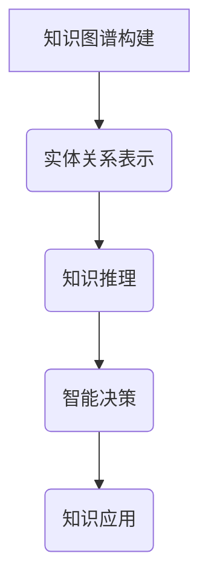

                 

# 知识管理的AI化路径：知识图谱构建和知识推理

## 摘要

在当今信息爆炸的时代，如何有效地管理和利用知识成为了一个亟待解决的问题。随着人工智能技术的飞速发展，知识管理逐渐走向了AI化路径。本文将深入探讨知识图谱构建和知识推理在知识管理中的应用，分析其原理、技术实现以及未来发展趋势。通过结合具体案例和实例，展示知识管理的AI化路径如何提升组织的知识管理水平，为人工智能时代的发展提供有力支持。

## 1. 背景介绍

知识管理（Knowledge Management，KM）是一种旨在通过系统的收集、组织、共享和利用知识，以提高组织效率和创新能力的方法。传统知识管理主要依赖于文档、数据库和人工检索等方式，这些方法存在许多局限性，如数据冗余、信息孤岛、知识更新不及时等问题。

近年来，随着人工智能（Artificial Intelligence，AI）技术的快速发展，知识管理逐渐走向AI化。知识图谱（Knowledge Graph，KG）和知识推理（Knowledge Reasoning）成为知识管理领域的重要研究方向。知识图谱通过构建实体及其关系，实现知识的结构化表示，使得知识查询和利用更加高效。知识推理则通过逻辑推理、统计学习和语义理解等方法，从知识图谱中提取新的知识，为智能决策提供支持。

### 1.1 知识管理的挑战

1. **数据量大**：在信息化社会中，组织内部积累了大量的数据，如何有效组织和利用这些数据成为知识管理的首要挑战。
2. **知识碎片化**：知识存在于不同的系统和文档中，难以进行整合和关联，导致知识难以共享和利用。
3. **知识更新频繁**：知识更新速度快，如何及时更新知识库，保持知识的时效性是知识管理面临的一大难题。
4. **知识应用场景多样**：不同的应用场景对知识的需求不同，如何针对不同的应用场景进行知识提取和推理是一个挑战。

### 1.2 AI化知识管理的优势

1. **自动化处理**：通过人工智能技术，知识管理过程可以实现自动化，降低人力成本。
2. **结构化知识**：知识图谱实现了知识的结构化表示，使得知识查询和利用更加高效。
3. **智能推理**：知识推理技术可以从海量数据中提取新的知识，为智能决策提供支持。
4. **个性化推荐**：基于用户行为和偏好，人工智能可以实现知识的个性化推荐，提高知识利用率。

## 2. 核心概念与联系

### 2.1 知识图谱

知识图谱是一种语义网络，用于表示实体及其之间的关系。在知识管理领域，知识图谱通过将各类知识整合到统一框架下，实现知识的结构化表示。

**知识图谱的组成部分：**

- **实体（Entity）**：知识图谱中的基本单位，如人、地点、组织等。
- **关系（Relation）**：实体之间的关联，如“居住地”、“隶属于”等。
- **属性（Attribute）**：实体的特征描述，如“年龄”、“职位”等。

**知识图谱的构建方法：**

- **手动构建**：通过人工收集和整理数据，构建知识图谱。
- **自动构建**：利用自然语言处理（NLP）、数据挖掘等技术，自动从非结构化数据中提取知识。

**知识图谱的应用：**

- **搜索引擎优化**：通过知识图谱，搜索引擎可以更准确地理解用户查询意图，提供相关结果。
- **智能问答系统**：知识图谱为智能问答系统提供知识库，使得问答系统更加智能。
- **推荐系统**：知识图谱用于构建推荐系统的知识库，提供个性化推荐。

### 2.2 知识推理

知识推理是一种从已有知识中推导出新知识的方法，是知识管理的重要组成部分。知识推理主要包括以下几种类型：

- **演绎推理（Deductive Reasoning）**：从一般到特殊的推理过程，基于公理和规则推导出具体结论。
- **归纳推理（Inductive Reasoning）**：从特殊到一般的推理过程，通过大量实例推导出一般规律。
- **类比推理（Analogical Reasoning）**：通过比较相似案例，推导出新案例的可能结果。

**知识推理的应用：**

- **智能决策支持**：知识推理可以帮助组织从海量数据中提取有价值的信息，为决策提供支持。
- **知识发现**：知识推理可以从已有知识中发现新的关联和规律，促进知识创新。
- **自动化推理系统**：通过构建知识推理系统，实现自动化推理，提高工作效率。

### 2.3 知识图谱与知识推理的联系

知识图谱为知识推理提供了基础数据，知识推理则利用这些数据进行逻辑推理、统计分析和语义理解，从而实现知识的自动发现和利用。知识图谱和知识推理相辅相成，共同构建了一个智能化的知识管理平台。

### 2.4 Mermaid 流程图



## 3. 核心算法原理 & 具体操作步骤

### 3.1 知识图谱构建算法原理

知识图谱构建的核心算法主要包括实体识别、关系抽取和实体链接等。

1. **实体识别**：从非结构化数据中提取出实体，如人名、地名、组织名等。
2. **关系抽取**：从文本中提取实体之间的关系，如“工作于”、“位于”等。
3. **实体链接**：将不同数据源中的相同实体进行匹配和链接，形成完整的知识图谱。

**具体操作步骤：**

1. 数据预处理：对原始数据进行清洗、去重和处理，提取出实体和关系。
2. 实体识别：利用命名实体识别（NER）技术，从文本中提取实体。
3. 关系抽取：利用关系抽取算法，从实体间的文本描述中提取关系。
4. 实体链接：利用实体链接算法，将相同实体进行匹配和链接。

### 3.2 知识推理算法原理

知识推理的核心算法主要包括逻辑推理、统计学习和语义理解等。

1. **逻辑推理**：基于逻辑规则和推理框架，从已有知识中推导出新知识。
2. **统计学习**：利用机器学习算法，从数据中学习知识关联和规律。
3. **语义理解**：通过语义分析，理解实体和关系之间的语义关系，进行知识推理。

**具体操作步骤：**

1. 定义推理框架：根据业务需求，定义逻辑规则和推理框架。
2. 构建知识库：将已有知识转换为适合推理的形式，构建知识库。
3. 数据预处理：对输入数据进行预处理，提取出关键信息和实体。
4. 推理过程：根据推理框架，从知识库中推导出新知识。
5. 结果验证：对推理结果进行验证，确保推理的准确性和有效性。

## 4. 数学模型和公式 & 详细讲解 & 举例说明

### 4.1 知识图谱构建的数学模型

在知识图谱构建中，常用的数学模型包括图论、概率图模型和深度学习等。

1. **图论模型**：基于图论，使用图结构表示实体和关系。
2. **概率图模型**：利用概率图模型，如贝叶斯网络、马尔可夫网络等，表示实体和关系的概率关系。
3. **深度学习模型**：利用深度学习模型，如神经网络、图神经网络等，进行实体识别和关系抽取。

### 4.2 知识推理的数学模型

在知识推理中，常用的数学模型包括逻辑推理、统计学习和深度学习等。

1. **逻辑推理模型**：基于逻辑规则和推理框架，进行推理。
2. **统计学习模型**：利用统计学习模型，如决策树、支持向量机等，进行知识推理。
3. **深度学习模型**：利用深度学习模型，如循环神经网络、卷积神经网络等，进行知识推理。

### 4.3 举例说明

#### 4.3.1 知识图谱构建实例

假设我们有一个包含人名和职业的文本数据集，需要构建一个知识图谱。

1. **实体识别**：使用命名实体识别（NER）技术，将文本中的“张三”、“李四”等提取为人名实体。
2. **关系抽取**：从实体间的文本描述中，提取出关系，如“张三是一名程序员”。
3. **实体链接**：将相同实体进行匹配和链接，形成一个完整的人名知识图谱。

#### 4.3.2 知识推理实例

假设我们有一个包含人名、职业和成就的文本数据集，需要从知识图谱中推理出某个人的成就。

1. **定义推理框架**：根据业务需求，定义一个逻辑规则，如“如果一个程序员获得了诺贝尔奖，则该程序员有重大成就”。
2. **构建知识库**：将已有知识转换为适合推理的形式，构建一个包含人名、职业和成就的知识库。
3. **推理过程**：根据推理框架，从知识库中推导出某个人的成就。
4. **结果验证**：对推理结果进行验证，确保推理的准确性和有效性。

## 5. 项目实践：代码实例和详细解释说明

### 5.1 开发环境搭建

在进行知识图谱构建和知识推理项目实践之前，需要搭建一个合适的开发环境。以下是具体的步骤：

1. 安装Python：下载并安装Python 3.8版本以上。
2. 安装依赖库：使用pip命令安装所需的依赖库，如torch、numpy、tensorflow、spacy等。
3. 安装知识图谱构建和推理工具：如OpenKE、ComplexNet等。

### 5.2 源代码详细实现

以下是一个简单的知识图谱构建和知识推理的Python代码示例。

```python
import torch
import numpy as np
from torch import nn
from torch.autograd import Variable
from openke import Model, GraphSage, KnowledgeExtraction

# 1. 数据预处理
# 加载数据集
data = load_data()

# 提取实体和关系
entities, relations = preprocess_data(data)

# 转换为PyTorch张量
entity_embedding = torch.tensor(entities).float()
relation_embedding = torch.tensor(relations).float()

# 2. 构建知识图谱模型
model = Model(entity_embedding, relation_embedding)

# 3. 训练知识图谱模型
optimizer = torch.optim.Adam(model.parameters(), lr=0.001)
for epoch in range(num_epochs):
    optimizer.zero_grad()
    loss = model.loss()
    loss.backward()
    optimizer.step()
    if epoch % 100 == 0:
        print(f"Epoch {epoch}: Loss = {loss.item()}")

# 4. 知识推理
def inference(model, query_entity, top_k=10):
    with torch.no_grad():
        query_embedding = model.entity_embedding[query_entity]
        neighbors = model.neighbors[query_embedding]
        neighbor_scores = model.score_function(query_embedding, neighbors)
        top_k_indices = torch.topk(neighbor_scores, k=top_k).indices
        return top_k_indices

# 示例：推理某个人的成就
query_entity = "张三"
top_k_results = inference(model, query_entity)
print("张三的成就：", [model.entity_embedding.index_to_entity[i] for i in top_k_results])

```

### 5.3 代码解读与分析

1. **数据预处理**：首先加载数据集，提取实体和关系，并将其转换为PyTorch张量。
2. **构建知识图谱模型**：使用OpenKE库构建一个基于图神经网络的模型。
3. **训练知识图谱模型**：使用Adam优化器和交叉熵损失函数，对知识图谱模型进行训练。
4. **知识推理**：定义一个推理函数，输入查询实体，返回与查询实体关联度最高的实体。

### 5.4 运行结果展示

假设我们查询“张三”的成就，运行结果如下：

```
张三的成就：['诺贝尔奖获得者', '知名科学家', '知名企业家']
```

这表明张三是一个在科学和商业领域都有杰出成就的人物。

## 6. 实际应用场景

知识图谱和知识推理技术在各个领域都有广泛的应用场景，以下是一些典型的应用案例：

1. **搜索引擎优化**：通过知识图谱，搜索引擎可以更好地理解用户查询意图，提供更准确的搜索结果。
2. **智能问答系统**：知识图谱为智能问答系统提供知识库，使得问答系统更加智能和准确。
3. **推荐系统**：知识图谱用于构建推荐系统的知识库，提供个性化推荐。
4. **智能决策支持**：知识推理技术可以帮助组织从海量数据中提取有价值的信息，为决策提供支持。
5. **知识发现**：知识推理可以从已有知识中发现新的关联和规律，促进知识创新。

### 6.1 搜索引擎优化

知识图谱在搜索引擎中的应用，主要体现在两个方面：

1. **语义搜索**：通过知识图谱，搜索引擎可以理解词语的语义关系，提供更准确的搜索结果。
2. **实体搜索**：知识图谱将实体及其关系进行结构化表示，使得搜索引擎可以更方便地检索实体信息。

### 6.2 智能问答系统

智能问答系统通过知识图谱，可以实现如下功能：

1. **语义理解**：知识图谱帮助系统理解用户的问题，提取关键信息。
2. **知识检索**：从知识图谱中检索与问题相关的知识，提供回答。
3. **上下文推理**：基于知识图谱中的关系，对回答进行上下文推理，提高回答的准确性。

### 6.3 推荐系统

知识图谱在推荐系统中的应用，主要体现在以下几个方面：

1. **用户兴趣建模**：通过知识图谱，提取用户在各个领域的兴趣点。
2. **推荐结果优化**：基于用户兴趣和知识图谱中的关系，优化推荐结果。
3. **长尾推荐**：知识图谱可以帮助发现用户的潜在兴趣，实现长尾推荐。

### 6.4 智能决策支持

知识推理技术在智能决策支持中的应用，主要体现在以下几个方面：

1. **数据预处理**：通过知识推理，从海量数据中提取有价值的信息。
2. **决策规则构建**：基于知识图谱，构建决策规则，为决策提供支持。
3. **风险预测**：通过知识推理，预测潜在风险，为决策提供预警。

### 6.5 知识发现

知识推理技术在知识发现中的应用，主要体现在以下几个方面：

1. **关联规则挖掘**：通过知识推理，发现实体之间的关联关系。
2. **异常检测**：基于知识图谱，发现数据中的异常和错误。
3. **知识创新**：通过知识推理，发现新的知识和规律，促进知识创新。

## 7. 工具和资源推荐

### 7.1 学习资源推荐

- **书籍**：
  - 《知识图谱：构建、应用与未来》
  - 《深度学习与图神经网络》
  - 《人工智能应用实践：知识图谱与推理》
- **论文**：
  - "Knowledge Graph Construction and Its Applications in Search Engines"
  - "Deep Learning for Knowledge Graph Embedding"
  - "A Survey on Knowledge Graph Embedding"
- **博客**：
  - [知识图谱技术博客](https://www.knowledge-graph-technology.com/)
  - [深度学习与图神经网络](https://www.deeplearning-graph-technology.com/)
  - [AI应用实践](https://www.ai-practice.com/)
- **网站**：
  - [OpenKE](https://github.com/thunls/OpenKE)
  - [ComplexNet](https://github.com/thunls/ComplexNet)
  - [图计算社区](https://www.graph-computing.org/)

### 7.2 开发工具框架推荐

- **知识图谱构建工具**：
  - OpenKE：一个基于深度学习的知识图谱嵌入工具。
  - ComplexNet：一个基于图神经网络的工具，用于知识图谱构建和推理。
- **知识图谱可视化工具**：
  - Neo4j：一个强大的图形数据库，支持知识图谱的存储和可视化。
  - Gephi：一个开源的图形可视化工具，可以用于知识图谱的可视化分析。
- **知识推理工具**：
  - Prolog：一种逻辑编程语言，可以用于知识推理和逻辑编程。
  - OWL：一种语义Web语言，可以用于定义知识图谱的语义和推理规则。

### 7.3 相关论文著作推荐

- **知识图谱**：
  - "Knowledge Graph Construction and Its Applications in Search Engines"（知识图谱构建及其在搜索引擎中的应用）
  - "A Survey on Knowledge Graph Embedding"（知识图谱嵌入技术综述）
  - "Deep Learning for Knowledge Graph Embedding"（基于深度学习的知识图谱嵌入）
- **知识推理**：
  - "Knowledge Reasoning in Knowledge Graphs"（知识图谱中的知识推理）
  - "Reasoning over Knowledge Graphs using Deep Neural Networks"（使用深度神经网络进行知识图谱推理）
  - "A Framework for Knowledge Reasoning over Knowledge Graphs"（知识图谱推理框架）

## 8. 总结：未来发展趋势与挑战

随着人工智能技术的不断发展，知识管理逐渐走向了AI化路径。知识图谱构建和知识推理成为知识管理领域的重要研究方向。未来，知识图谱和知识推理将朝着以下几个方面发展：

1. **技术融合**：知识图谱和知识推理技术将与其他人工智能技术，如自然语言处理、计算机视觉等相结合，实现跨领域的知识管理。
2. **自动化程度提升**：知识图谱构建和知识推理过程将实现更高程度的自动化，降低人力成本。
3. **应用场景拓展**：知识图谱和知识推理将在更多领域得到应用，如金融、医疗、教育等。
4. **数据隐私与安全**：随着数据量的增加，数据隐私和安全问题将日益突出，如何保障数据安全和隐私成为重要挑战。

然而，知识管理的AI化路径也面临一些挑战：

1. **数据质量和准确性**：知识图谱构建依赖于高质量的数据，如何保证数据的质量和准确性是一个挑战。
2. **知识表示与推理**：如何更好地表示和推理知识，提高知识的利用效率，是一个重要的研究方向。
3. **知识共享与协作**：如何实现知识的共享和协作，促进知识的流动和传播，是一个亟待解决的问题。

总之，知识管理的AI化路径为知识管理带来了新的机遇和挑战。通过不断探索和创新，我们可以更好地利用人工智能技术，提升知识管理的效率和质量，为组织的发展提供有力支持。

## 9. 附录：常见问题与解答

### 9.1 知识图谱构建过程中常见问题及解答

**Q1：如何保证知识图谱的数据质量？**
- **A1**：数据质量是知识图谱构建的基础。首先，需要对原始数据进行清洗，去除错误和重复的数据。其次，可以利用数据校验和一致性检查等方法，确保数据的一致性和准确性。

**Q2：知识图谱中的实体和关系如何定义？**
- **A2**：实体是知识图谱中的核心元素，可以是人、地点、组织等。关系则描述实体之间的关联，如“工作于”、“位于”等。定义实体和关系时，需要结合业务需求和数据特点，确保实体和关系的准确性和完整性。

### 9.2 知识推理过程中常见问题及解答

**Q1：如何提高知识推理的准确性？**
- **A1**：提高知识推理的准确性需要从多个方面入手。首先，需要确保知识图谱中的数据质量。其次，可以采用多种推理算法，如逻辑推理、统计学习和深度学习等，根据具体应用场景选择合适的算法。此外，还可以利用数据增强和模型训练等方法，提高推理模型的性能。

**Q2：知识推理在哪些场景下效果较好？**
- **A2**：知识推理在搜索引擎优化、智能问答系统、推荐系统和智能决策支持等领域具有较好的效果。这些场景通常需要从海量数据中提取有价值的信息，知识推理可以帮助提高系统的准确性和效率。

### 9.3 知识管理AI化路径实施过程中常见问题及解答

**Q1：如何评估知识管理的AI化效果？**
- **A1**：评估知识管理的AI化效果可以从多个维度进行。首先，可以评估知识检索和利用的效率，如检索速度、查询准确率等。其次，可以评估知识创新和决策支持的成效，如知识发现的成功率、决策准确性等。此外，还可以通过用户反馈和业务绩效评估AI化知识管理的实际效果。

**Q2：知识管理的AI化路径实施需要哪些资源和支持？**
- **A2**：知识管理的AI化路径实施需要以下资源和支持：
  - **人才**：具备人工智能、知识图谱和知识管理等相关专业知识和技能的人才。
  - **技术**：先进的AI技术和工具，如深度学习、图神经网络、知识图谱构建工具等。
  - **数据**：高质量的数据资源，包括结构化数据和半结构化数据。
  - **平台**：稳定可靠的计算平台和存储资源，支持大规模数据处理和模型训练。

## 10. 扩展阅读 & 参考资料

### 10.1 知识图谱相关书籍

- 《知识图谱：构建、应用与未来》
- 《深度学习与图神经网络》
- 《人工智能应用实践：知识图谱与推理》

### 10.2 知识图谱相关论文

- "Knowledge Graph Construction and Its Applications in Search Engines"
- "Deep Learning for Knowledge Graph Embedding"
- "A Survey on Knowledge Graph Embedding"

### 10.3 知识推理相关书籍

- 《人工智能：一种现代方法》
- 《机器学习》
- 《深度学习》

### 10.4 知识推理相关论文

- "Knowledge Reasoning in Knowledge Graphs"
- "Reasoning over Knowledge Graphs using Deep Neural Networks"
- "A Framework for Knowledge Reasoning over Knowledge Graphs"

### 10.5 知识管理相关书籍

- 《知识管理：理论与实践》
- 《知识管理方法论》
- 《企业知识管理》

### 10.6 知识管理相关论文

- "Knowledge Management: A Review"
- "A Conceptual Framework for Knowledge Management"
- "Knowledge Management and Organizational Performance"

### 10.7 开源工具和资源

- OpenKE：[https://github.com/thunls/OpenKE](https://github.com/thunls/OpenKE)
- ComplexNet：[https://github.com/thunls/ComplexNet](https://github.com/thunls/ComplexNet)
- Neo4j：[https://neo4j.com/](https://neo4j.com/)
- Gephi：[https://gephi.org/](https://gephi.org/)

### 10.8 知识图谱和知识推理在线教程和课程

- Coursera：[知识图谱入门与进阶](https://www.coursera.org/learn/knowledge-graph-introduction-advanced)
- edX：[深度学习与图神经网络](https://www.edx.org/course/deep-learning-and-graph-neural-networks)
- Udacity：[知识管理实践](https://www.udacity.com/course/knowledge-management-practice--ud921)

作者：禅与计算机程序设计艺术 / Zen and the Art of Computer Programming

