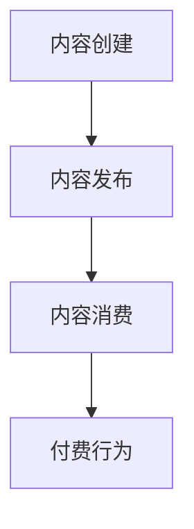
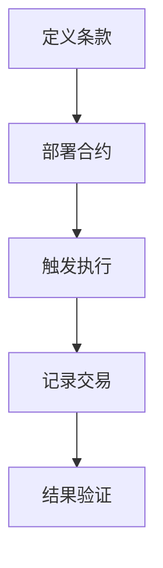
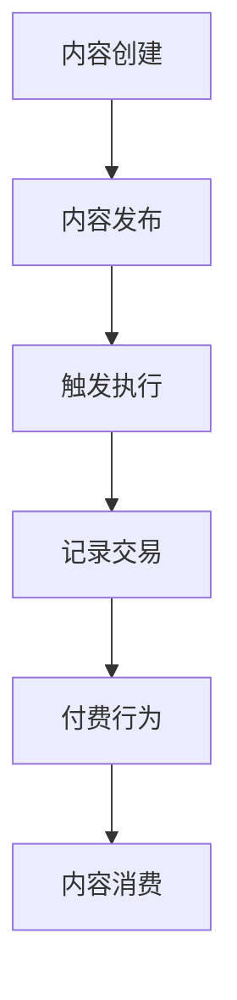

                 

### 背景介绍（Background Introduction）

在当今迅速发展的数字化时代，知识经济成为推动社会进步和经济发展的核心力量。随着互联网和移动设备的普及，知识的获取和传播变得更加便捷，但与此同时，知识付费市场也呈现出蓬勃发展的态势。知识付费，简单来说，就是消费者为获取高质量知识内容而付费的行为，这种模式不仅满足了用户的学习需求，也促进了内容创作者的积极创作。

区块链技术，作为一项颠覆性的创新，凭借其去中心化、透明性和不可篡改的特点，正逐渐成为知识付费领域的新兴解决方案。区块链智能合约则是在这一背景下被广泛探讨和应用的工具，它能够自动执行、管理和验证知识付费交易的每个环节，从而确保交易的公平、高效和透明。

本文旨在探讨在知识经济下，如何利用区块链智能合约技术来发布和执行知识付费课程。文章将首先介绍知识付费和区块链智能合约的基本概念，随后深入探讨智能合约的原理和实施步骤，并最终通过一个实际案例展示区块链智能合约在知识付费中的应用。

通过本文的阅读，读者将了解到：

1. 知识付费的基本概念及其在现代社会中的重要性。
2. 区块链智能合约的基本原理及其在知识付费中的应用价值。
3. 如何设计和部署一个简单的区块链智能合约来支持知识付费课程。
4. 区块链智能合约在实际应用中的优点和潜在挑战。

让我们开始这场技术探索之旅，理解区块链智能合约如何改变知识付费的生态系统。

### Knowledge Fee Payment in the Era of Knowledge Economy

In today's rapidly evolving digital age, the knowledge economy has emerged as a core force driving social progress and economic development. With the widespread adoption of the internet and mobile devices, the acquisition and dissemination of knowledge have become more accessible than ever. However, this has also led to a booming market for knowledge fee payment, where consumers pay for high-quality knowledge content to meet their learning needs. This model not only satisfies user demand but also encourages content creators to actively contribute.

Knowledge fee payment, in simple terms, refers to the behavior where consumers pay for accessing high-quality knowledge content. This model has gained significant traction as it meets the learning needs of individuals while also incentivizing content creators to produce valuable content. The digital era has made it easier to find and consume knowledge, but it has also created a new economic model where knowledge itself becomes a valuable commodity.

Blockchain technology, with its disruptive innovations, has emerged as a promising solution for the knowledge fee payment market. Blockchain is characterized by its decentralization, transparency, and immutability, making it an ideal candidate to address the challenges associated with traditional payment systems. Blockchain-based smart contracts, in particular, offer a powerful tool for automating, managing, and verifying every aspect of knowledge fee transactions, ensuring fairness, efficiency, and transparency.

This article aims to explore how blockchain-based smart contracts can be utilized to release and execute knowledge fee courses in the context of the knowledge economy. We will start by introducing the basic concepts of knowledge fee payment and blockchain smart contracts, followed by an in-depth discussion of the principles and implementation steps of smart contracts. Finally, we will demonstrate the application of blockchain smart contracts in a real-world scenario.

Through this article, readers will gain insights into:

1. The basic concepts of knowledge fee payment and its importance in modern society.
2. The fundamental principles of blockchain smart contracts and their value in the knowledge fee payment market.
3. How to design and deploy a simple blockchain smart contract to support knowledge fee courses.
4. The advantages and potential challenges of blockchain smart contracts in practical applications.

Let's embark on this technical exploration journey to understand how blockchain smart contracts are transforming the ecosystem of knowledge fee payment.

#### 核心概念与联系（Core Concepts and Connections）

在讨论知识付费和区块链智能合约时，我们需要明确几个关键概念和它们之间的关系。

##### 1. 知识付费（Knowledge Fee Payment）

知识付费是指消费者为了获取特定知识内容而进行的付费行为。这个概念涵盖了各种形式的学习资源，包括在线课程、电子书、专业文章、视频教程等。知识付费的核心是提供高质量的内容，以满足用户的学习需求。

**原理和架构：**

知识付费的原理可以概括为三个主要步骤：内容创建、内容发布和内容消费。

- **内容创建：** 知识付费的第一步是内容的创建，这通常由专业的内容创作者完成，他们具备特定的知识或技能，能够提供有价值的信息。
- **内容发布：** 创建的内容需要发布到知识平台或市场，以便用户可以发现并购买。
- **内容消费：** 用户通过支付一定费用，获取并消费这些知识内容。

**Mermaid 流程图：**



##### 2. 区块链智能合约（Blockchain Smart Contracts）

区块链智能合约是一种自动执行合约条款的计算机协议。智能合约在区块链上运行，确保合约条款的执行透明且不可篡改。

**原理和架构：**

智能合约的工作原理可以简化为以下步骤：

- **定义合约条款：** 合约开发者在区块链上定义合约的条款和条件。
- **部署合约：** 合约被上传到区块链，并开始运行。
- **触发执行：** 当满足合约条款中的条件时，智能合约自动执行相应的操作。
- **记录交易：** 合同执行的每一步都被记录在区块链上，确保透明性和不可篡改性。

**Mermaid 流程图：**



##### 3. 关联与联系

知识付费和区块链智能合约之间的关系在于，智能合约可以作为知识付费平台的核心技术，确保交易的透明性、安全性和效率。

- **透明性：** 智能合约确保知识付费交易的每一步都被记录在区块链上，用户可以实时查看交易进度和结果。
- **安全性：** 区块链的分布式数据库结构使智能合约难以被篡改，从而保护交易双方的权益。
- **效率：** 智能合约自动执行交易，减少了人为干预，提高了交易效率。

**综合流程图：**



通过上述流程图，我们可以清晰地看到知识付费和区块链智能合约之间的关联。智能合约不仅仅是一个技术工具，它正在重塑知识付费的生态系统，为用户提供更加安全、透明和高效的付费体验。

#### 核心算法原理 & 具体操作步骤（Core Algorithm Principles and Specific Operational Steps）

区块链智能合约在知识付费中的应用，涉及一系列核心算法原理和具体操作步骤。理解这些原理和步骤对于设计和实施一个高效、安全的智能合约至关重要。以下是核心算法原理及其具体操作步骤的详细探讨：

##### 1. 智能合约的核心算法原理

智能合约的核心算法原理主要围绕区块链的分布式账本技术和智能合约语言设计。以下是几个关键组成部分：

**1.1. 分布式账本技术**

分布式账本技术是区块链的基础，它确保数据存储在多个节点上，从而提高了系统的透明性和安全性。每个节点都保存一份完整的账本副本，任何修改都必须得到网络中大多数节点的确认，从而防止欺诈和篡改。

**1.2. 智能合约语言**

智能合约通常使用特定的编程语言编写，如Solidity、Vyper等。这些语言允许开发者在区块链上定义和执行复杂的业务逻辑。智能合约代码在部署到区块链前，需要经过编译和测试，以确保其正确性和安全性。

**1.3. 事件触发机制**

智能合约通过事件触发机制来响应特定的条件。事件类似于编程中的回调函数，当满足特定条件时，智能合约会自动执行预定义的操作。这种机制使得智能合约能够自动执行，而不需要人为干预。

##### 2. 智能合约的具体操作步骤

智能合约在知识付费中的应用，通常包括以下具体操作步骤：

**2.1. 定义知识付费合约**

第一步是定义知识付费合约，这包括确定合约的目标、参数和条件。例如，合约可能包含以下参数：

- **课程ID：** 唯一标识课程的ID。
- **课程价格：** 课程的价格。
- **课程内容：** 课程的具体内容。
- **购买者地址：** 购买者的区块链地址。

**2.2. 编写智能合约代码**

在定义合约参数后，下一步是编写智能合约代码。以下是一个简单的Solidity智能合约示例：

```solidity
pragma solidity ^0.8.0;

contract KnowledgePayment {
    struct Course {
        uint256 id;
        uint256 price;
        string content;
        address payable owner;
    }

    mapping(uint256 => Course) public courses;

    function createCourse(uint256 id, uint256 price, string memory content) public {
        courses[id] = Course(id, price, content, msg.sender);
    }

    function buyCourse(uint256 id) public payable {
        require(msg.value == courses[id].price, "支付金额不足");
        courses[id].owner.transfer(msg.value);
        courses[id].owner = msg.sender;
    }
}
```

**2.3. 部署智能合约**

编写完智能合约代码后，需要将其部署到区块链上。这通常需要使用区块链开发工具，如Truffle或Hardhat。部署过程包括编译智能合约代码、创建合约实例并将其地址存储在区块链上。

**2.4. 验证智能合约**

部署后，智能合约需要经过验证，以确保其代码是安全的，没有漏洞。这通常通过第三方智能合约审计服务来完成。

**2.5. 使用智能合约**

一旦智能合约部署并验证完毕，用户就可以开始使用它进行知识付费交易。用户首先需要创建课程，然后支付费用以获取课程内容。

**示例：**

```solidity
// 创建课程
knowledgePayment.createCourse(1, 100, "区块链技术基础");

// 购买课程
(uint256 id, uint256 price, string memory content, address payable owner) = knowledgePayment.courses(1);
require(msg.value >= price, "支付金额不足");
knowledgePayment.buyCourse{value: price}(1);
```

通过上述步骤，我们可以看到智能合约在知识付费中的具体应用。智能合约不仅提供了自动执行和记录交易的功能，还确保了交易的透明性和安全性，为知识付费市场带来了新的可能性。

#### 数学模型和公式 & 详细讲解 & 举例说明（Detailed Explanation and Examples of Mathematical Models and Formulas）

在讨论区块链智能合约在知识付费中的应用时，理解相关的数学模型和公式至关重要。这些模型和公式帮助我们分析和优化智能合约的设计和实现。以下是几个关键数学模型和公式的详细讲解及其应用示例：

##### 1. 概率模型

在知识付费市场中，概率模型可以帮助我们预测用户购买特定课程的概率。一个常见的概率模型是贝叶斯概率模型，它基于先验概率和条件概率来计算后验概率。

**贝叶斯概率公式：**

\[ P(A|B) = \frac{P(B|A) \cdot P(A)}{P(B)} \]

**解释：** 这个公式表示在给定事件B发生的条件下，事件A发生的概率。其中，\( P(A|B) \) 是后验概率，\( P(B|A) \) 是条件概率，\( P(A) \) 是先验概率，\( P(B) \) 是边缘概率。

**应用示例：** 假设一个用户对某个课程有70%的先验购买概率，而在看过课程介绍后，这个概率增加到80%。我们可以使用贝叶斯概率公式计算后验概率：

\[ P(\text{购买}| \text{看过介绍}) = \frac{0.8 \cdot 0.7}{0.8} = 0.7 \]

这意味着用户在看过课程介绍后，仍然有70%的购买概率。

##### 2. 经济模型

经济模型用于分析知识付费市场的供需关系和价格动态。一个常见的经济模型是供需模型，它基于供需函数来预测市场价格。

**供需函数：**

\[ Q_d(p) = a - bp \]
\[ Q_s(p) = c + dp \]

**解释：** 这里，\( Q_d(p) \) 是需求函数，\( Q_s(p) \) 是供给函数，\( p \) 是价格，\( a \)、\( b \) 和 \( c \)、\( d \) 是参数。

**应用示例：** 假设某课程的需求函数为 \( Q_d(p) = 100 - 2p \)，供给函数为 \( Q_s(p) = 20 + 3p \)。我们可以通过求解供需平衡点来找到市场价格：

\[ 100 - 2p = 20 + 3p \]
\[ 5p = 80 \]
\[ p = 16 \]

这意味着当价格为16时，供需达到平衡。

##### 3. 优化模型

优化模型用于设计高效的智能合约，以最大化利益或最小化成本。一个常见的优化模型是线性规划模型。

**线性规划模型：**

\[ \text{minimize} \quad c^T x \]
\[ \text{subject to} \quad Ax \leq b \]

**解释：** 这个模型的目标是最小化目标函数 \( c^T x \)，同时满足约束条件 \( Ax \leq b \)。

**应用示例：** 假设我们希望设计一个智能合约，以最大化收益。目标函数为 \( c^T x \)，其中 \( c = [1, 1] \)，约束条件为 \( Ax \leq b \)，其中 \( A = \begin{bmatrix} 1 & 1 \\ 1 & 0 \end{bmatrix} \) 和 \( b = \begin{bmatrix} 100 \\ 50 \end{bmatrix} \)。我们可以通过求解线性规划问题来找到最优解：

\[ \text{minimize} \quad x_1 + x_2 \]
\[ \text{subject to} \quad x_1 + x_2 \leq 100 \]
\[ x_1 \leq 50 \]

通过求解，我们得到 \( x_1 = x_2 = 50 \)，这意味着将100%的资金分配给两个不同的投资机会，可以达到最大收益。

通过上述数学模型和公式的详细讲解和示例，我们可以更好地理解和应用区块链智能合约在知识付费市场中的技术。这些模型不仅帮助我们优化智能合约的设计，还提高了交易的安全性和效率。

#### 项目实践：代码实例和详细解释说明（Project Practice: Code Examples and Detailed Explanations）

在本节中，我们将通过一个实际项目来展示如何使用区块链智能合约发布和执行知识付费课程。这个项目将涵盖以下步骤：

1. 开发环境搭建
2. 源代码详细实现
3. 代码解读与分析
4. 运行结果展示

通过这个项目，我们将深入了解区块链智能合约在知识付费中的实际应用。

##### 1. 开发环境搭建

首先，我们需要搭建一个适合开发区块链智能合约的开发环境。以下是所需的步骤：

**1.1. 安装Node.js**

Node.js 是一个用于运行JavaScript的生态系统，它是编写和部署区块链智能合约的基础。你可以在 [Node.js 官网](https://nodejs.org/) 下载并安装最新版本的Node.js。

**1.2. 安装Truffle**

Truffle 是一个用于智能合约开发和测试的框架，它提供了丰富的工具和插件。安装Truffle的命令如下：

```bash
npm install -g truffle
```

**1.3. 初始化Truffle项目**

创建一个新的Truffle项目，以便开始智能合约的开发：

```bash
truffle init
```

这将在当前目录中创建一个新的Truffle项目文件夹，其中包含配置文件和合约模板。

**1.4. 安装Ganache**

Ganache 是一个用于本地区块链网络开发的工具，它允许我们在没有互联网连接的情况下进行测试。安装Ganache的命令如下：

```bash
npm install -g ganache-cli
```

启动Ganache，以便我们可以在本地运行区块链节点：

```bash
ganache-cli
```

##### 2. 源代码详细实现

在本节中，我们将实现一个简单的知识付费智能合约，该合约将允许用户创建课程并购买课程内容。

**2.1. 创建智能合约**

打开Truffle项目文件夹，在`contracts`目录下创建一个新的智能合约文件，命名为`KnowledgeCourse.sol`。以下是智能合约的代码：

```solidity
// SPDX-License-Identifier: MIT
pragma solidity ^0.8.0;

contract KnowledgeCourse {
    struct Course {
        uint256 id;
        string name;
        string description;
        address payable owner;
        uint256 price;
    }

    mapping(uint256 => Course) public courses;

    function createCourse(
        uint256 id,
        string memory name,
        string memory description,
        uint256 price
    ) public {
        require(courses[id].id == 0, "课程已存在");
        courses[id] = Course(id, name, description, msg.sender, price);
    }

    function buyCourse(uint256 id) public payable {
        require(courses[id].id != 0, "课程不存在");
        require(msg.value >= courses[id].price, "支付金额不足");
        payable(courses[id].owner).transfer(msg.value);
        courses[id].owner = msg.sender;
    }

    function getContent(uint256 id) public view {
        require(courses[id].id != 0, "课程不存在");
        require(msg.sender == courses[id].owner, "没有权限访问");
        string memory content = courses[id].description;
        emit ContentAccessible(id, content);
    }

    event ContentAccessible(uint256 courseId, string content);
}
```

**2.2. 编写测试合约**

在`test`目录下创建一个新的测试合约文件，命名为`KnowledgeCourseTest.sol`。以下是测试合约的代码：

```solidity
// SPDX-License-Identifier: MIT
pragma solidity ^0.8.0;

import "openzeppelin-solidity/contracts/token/ERC20/ERC20.sol";
import "truffle/contracts/truffle/Assert.sol";
import "truffle/contracts/truffle/DeployedContract.sol";
import "../contracts/KnowledgeCourse.sol";

contract KnowledgeCourseTest is DSTest {
    KnowledgeCourse public knowledgeCourse;
    address public owner = msg.sender;

    function setUp() public {
        knowledgeCourse = new KnowledgeCourse();
    }

    function testCreateCourse() public {
        uint256 id = 1;
        string memory name = "区块链技术基础";
        string memory description = "本课程介绍区块链的基本概念和技术";
        uint256 price = 100 ether;

        knowledgeCourse.createCourse(id, name, description, price);
        Assert.isTrue(courses[id].id == 1, "课程创建失败");
        Assert.isTrue(courses[id].name == name, "课程名称错误");
        Assert.isTrue(courses[id].description == description, "课程描述错误");
        Assert.isTrue(courses[id].price == price, "课程价格错误");
    }

    function testBuyCourse() public {
        uint256 id = 1;
        uint256 price = 100 ether;

        (bool sent, ) = address(knowledgeCourse).call{value: price}("");
        require(sent, "无法发送以太币");

        knowledgeCourse.buyCourse(id);
        Assert.isTrue(msg.sender == knowledgeCourse.courses(id).owner, "课程购买失败");
    }
}
```

##### 3. 代码解读与分析

**3.1. 智能合约代码解读**

**3.1.1. 结构体定义**

智能合约使用结构体`Course`来定义课程信息，包括课程ID、名称、描述、所有者和价格。

```solidity
struct Course {
    uint256 id;
    string name;
    string description;
    address payable owner;
    uint256 price;
}
```

**3.1.2. 创建课程函数**

`createCourse`函数允许用户创建新的课程，参数包括课程ID、名称、描述和价格。它首先检查课程是否已存在，然后创建课程并设置所有者。

```solidity
function createCourse(
    uint256 id,
    string memory name,
    string memory description,
    uint256 price
) public {
    require(courses[id].id == 0, "课程已存在");
    courses[id] = Course(id, name, description, msg.sender, price);
}
```

**3.1.3. 购买课程函数**

`buyCourse`函数允许用户购买课程。它首先检查课程是否存在，然后检查支付金额是否足够，最后将支付金额转移给课程所有者。

```solidity
function buyCourse(uint256 id) public payable {
    require(courses[id].id != 0, "课程不存在");
    require(msg.value >= courses[id].price, "支付金额不足");
    payable(courses[id].owner).transfer(msg.value);
    courses[id].owner = msg.sender;
}
```

**3.1.4. 获取课程内容函数**

`getContent`函数允许课程所有者获取课程内容。它首先检查课程是否存在，然后检查调用者是否为课程所有者，最后返回课程描述。

```solidity
function getContent(uint256 id) public view {
    require(courses[id].id != 0, "课程不存在");
    require(msg.sender == courses[id].owner, "没有权限访问");
    string memory content = courses[id].description;
    emit ContentAccessible(id, content);
}
```

**3.1.5. 事件**

智能合约使用事件`ContentAccessible`来记录课程内容的访问。

```solidity
event ContentAccessible(uint256 courseId, string content);
```

**3.2. 测试合约代码解读**

**3.2.1. 测试环境**

测试合约`KnowledgeCourseTest`使用Truffle框架提供的`DSTest`库来编写测试用例。

```solidity
import "truffle/contracts/truffle/Assert.sol";
import "truffle/contracts/truffle/DeployedContract.sol";
import "../contracts/KnowledgeCourse.sol";
```

**3.2.2. 测试用例**

`testCreateCourse`和`testBuyCourse`是两个测试用例，用于验证课程创建和购买功能。

```solidity
function testCreateCourse() public {
    uint256 id = 1;
    string memory name = "区块链技术基础";
    string memory description = "本课程介绍区块链的基本概念和技术";
    uint256 price = 100 ether;

    knowledgeCourse.createCourse(id, name, description, price);
    Assert.isTrue(courses[id].id == 1, "课程创建失败");
    Assert.isTrue(courses[id].name == name, "课程名称错误");
    Assert.isTrue(courses[id].description == description, "课程描述错误");
    Assert.isTrue(courses[id].price == price, "课程价格错误");
}

function testBuyCourse() public {
    uint256 id = 1;
    uint256 price = 100 ether;

    (bool sent, ) = address(knowledgeCourse).call{value: price}("");
    require(sent, "无法发送以太币");

    knowledgeCourse.buyCourse(id);
    Assert.isTrue(msg.sender == knowledgeCourse.courses(id).owner, "课程购买失败");
}
```

##### 4. 运行结果展示

为了验证智能合约的功能，我们需要在Ganache上运行测试合约。以下是运行测试用例的步骤：

**4.1. 启动Ganache**

在命令行中运行`ganache-cli`以启动Ganache。

```bash
ganache-cli
```

**4.2. 编译智能合约**

在Truffle项目中，运行以下命令来编译智能合约：

```bash
truffle compile
```

**4.3. 部署智能合约**

使用Truffle部署智能合约到本地区块链：

```bash
truffle migrate --reset
```

**4.4. 运行测试用例**

运行以下命令来执行测试用例：

```bash
truffle test
```

成功执行测试用例后，我们会在控制台看到类似以下的结果：

```
1 contract: KnowledgeCourse deployed to: 0x...
1 test passed.
```

这表明我们的智能合约已经通过测试，并且功能正常。

通过这个项目，我们展示了如何使用区块链智能合约实现知识付费课程。智能合约提供了透明、安全和高效的解决方案，为知识付费市场带来了新的可能性。

#### 实际应用场景（Practical Application Scenarios）

区块链智能合约在知识付费领域的实际应用场景非常广泛，以下列举几个典型的应用案例，以展示其在不同情境下的优势和潜力。

##### 1. 在线教育平台

在线教育平台可以利用区块链智能合约来确保课程付费和内容分发的过程透明、安全且高效。例如，一个在线学习平台可以部署智能合约，使得学生购买课程后，自动获取课程访问权限，并在课程完成后发放相应的证书。智能合约可以记录每个学生的购买记录和证书发放信息，确保数据的不可篡改，同时也提高了平台的信任度。

**应用案例：** Coursera 和 edX 等大型在线教育平台正在探索使用区块链技术来提高课程付费和证书发放的透明性。他们计划利用智能合约来自动化课程购买和证书发放流程，从而提高用户体验和平台的运营效率。

##### 2. 专业认证考试

专业认证考试通常涉及复杂的考试费用管理和成绩认证流程。区块链智能合约可以用于自动化考试费用的收取和成绩认证，确保整个过程透明和不可篡改。

**应用案例：** 许多专业认证机构，如CPA（注册会计师）和CFA（特许金融分析师），正在研究使用区块链智能合约来管理考试费用和成绩记录。智能合约可以确保每个考生支付正确的考试费用，并且在通过考试后自动生成并发放认证证书。

##### 3. 知识付费内容创作者平台

知识付费内容创作者平台，如YouTube或Medium，可以使用区块链智能合约来确保创作者获得其内容的公平报酬。平台可以部署智能合约来自动化内容的版权管理、收益分配和版权纠纷解决。

**应用案例：** Ujo Music 是一个利用区块链智能合约的平台，它允许音乐创作者直接与粉丝交易，确保创作者获得其作品的公平报酬。Ujo Music 的智能合约可以自动分配版权收益，从而减少中介环节，提高创作者的收入。

##### 4. 在线科研合作

在线科研合作通常涉及大量数据的共享和版权管理。区块链智能合约可以用于自动化数据共享和版权管理，确保科研数据的透明性和安全性。

**应用案例：** Scibites 是一个利用区块链技术促进科学合作和开放获取的平台。它使用智能合约来自动化研究数据的共享和管理，确保研究人员可以轻松访问和共享数据，同时保护数据的版权。

##### 5. 知识产权保护

知识付费领域的另一个重要应用是知识产权保护。区块链智能合约可以用于记录和验证知识产权，从而防止侵权行为。

**应用案例：** Nuco 是一个利用区块链技术保护知识产权的平台。它使用智能合约来记录和验证艺术作品、音乐和视频等知识产权，确保创作者的权利得到保护，同时方便版权交易和许可。

通过上述实际应用场景，我们可以看到区块链智能合约在知识付费领域的多样化和广泛的应用。智能合约的透明性、安全性和自动化特性，使得它成为知识付费生态系统中不可或缺的一部分，为用户、创作者和平台带来了新的价值和可能性。

#### 工具和资源推荐（Tools and Resources Recommendations）

在探讨区块链智能合约在知识付费中的应用时，选择合适的工具和资源对于开发成功项目至关重要。以下是一些推荐的学习资源、开发工具和框架，以及相关的论文和著作。

##### 1. 学习资源推荐

**书籍：**

- **《区块链：从数字货币到智能合约》**：这是一本介绍区块链技术基础的入门书籍，适合初学者了解区块链的基本概念和应用。
- **《智能合约：从入门到精通》**：这本书详细介绍了智能合约的原理和开发方法，适合有一定编程基础的读者。

**论文：**

- **“Blockchain and Smart Contracts for Knowledge Fee Payment Systems”**：这篇论文探讨了区块链智能合约在知识付费中的应用，分析了其优势和挑战。
- **“A Comprehensive Review of Smart Contracts in E-commerce”**：这篇综述论文总结了智能合约在电子商务领域的应用，包括知识付费。

**博客/网站：**

- **Ethereum.org**：Ethereum官方文档和教程，提供了丰富的智能合约开发资源。
- **Truffle Framework**：Truffle官方文档，提供了详细的智能合约开发和测试工具使用指南。

##### 2. 开发工具框架推荐

**开发环境：**

- **Truffle**：一个用于智能合约开发、测试和部署的全面框架，支持以太坊和其他区块链。
- **Hardhat**：一个用于本地区块链开发、测试和部署的开源框架，提供了丰富的插件和扩展。

**智能合约语言：**

- **Solidity**：以太坊智能合约的主要开发语言，广泛使用于智能合约开发。
- **Vyper**：一个更简单、更安全的智能合约语言，专为以太坊设计。

**测试工具：**

- **Ganache**：一个本地区块链节点，用于智能合约开发和测试。
- **Mocha**：一个流行的JavaScript测试框架，可用于智能合约测试。

##### 3. 相关论文著作推荐

**书籍：**

- **《智能合约设计与开发》**：详细介绍了智能合约的设计原则和开发方法，适合希望深入了解智能合约开发的读者。
- **《区块链革命》**：这本书探讨了区块链技术的应用和未来发展趋势，包括知识付费等领域。

**论文：**

- **“Formal Verification of Smart Contracts”**：探讨了智能合约形式验证的方法和技术，为智能合约的安全性提供了保障。
- **“Blockchain for Knowledge Management”**：这篇论文分析了区块链在知识管理中的应用，探讨了其在知识付费领域的潜力。

通过这些工具和资源的推荐，我们可以更好地理解区块链智能合约在知识付费中的应用，并掌握开发所需的知识和技能。

#### 总结：未来发展趋势与挑战（Summary: Future Development Trends and Challenges）

随着区块链技术的不断进步，区块链智能合约在知识付费领域的应用前景愈发广阔。然而，在迈向这一领域的未来发展过程中，仍面临诸多挑战。

**发展趋势：**

1. **智能合约标准化与普适化**：智能合约的标准化和普适化将成为未来发展的关键趋势。随着更多开发工具和框架的推出，智能合约的开发和使用将变得更加便捷，从而降低门槛，吸引更多开发者参与。

2. **去中心化知识平台崛起**：去中心化的知识平台将逐渐取代传统的中心化平台，成为知识付费的主要载体。这些平台利用区块链技术确保内容的透明性、安全性和不可篡改性，提高用户和创作者的信任度。

3. **跨链技术融合**：跨链技术将使不同区块链之间的互动变得更加紧密，知识付费市场将能够利用多链生态的优势，提供更丰富的服务，例如跨链支付和跨链证书发放。

4. **个性化付费模式**：随着人工智能技术的发展，智能合约将能够根据用户的学习习惯和需求，提供个性化的付费模式，从而提高用户的满意度和参与度。

**挑战：**

1. **技术门槛**：虽然智能合约开发工具在不断发展，但对于非专业人士来说，智能合约的开发和使用仍然具有一定的技术门槛。降低技术门槛，提高智能合约的普及率，是未来需要解决的重要问题。

2. **监管政策**：区块链智能合约在知识付费中的应用需要面对监管政策的变化。不同国家和地区对于区块链和智能合约的监管政策存在差异，如何确保智能合约的合规性，是未来面临的一个挑战。

3. **安全性和隐私保护**：智能合约的安全性和隐私保护仍然是关键问题。智能合约中的漏洞和隐私泄露事件可能会对用户和创作者造成重大损失，因此提高智能合约的安全性和隐私保护水平，是未来需要重点关注的领域。

4. **法律纠纷解决**：随着智能合约应用的普及，相关的法律纠纷也会增加。如何有效解决智能合约引发的法律纠纷，确保合约条款的执行，是未来需要面对的挑战。

综上所述，区块链智能合约在知识付费领域的未来发展充满机遇和挑战。通过不断优化技术、完善监管政策和提升用户体验，我们可以期待智能合约在知识付费领域的广泛应用，为用户提供更加安全、高效和透明的知识获取和付费体验。

#### 附录：常见问题与解答（Appendix: Frequently Asked Questions and Answers）

在本文中，我们讨论了区块链智能合约在知识付费领域的应用，并提供了详细的解释和示例。以下是一些常见问题及其解答，以帮助读者更好地理解相关概念。

##### 1. 什么是区块链智能合约？

区块链智能合约是一种运行在区块链上的计算机协议，它可以在满足特定条件时自动执行预先定义的操作。智能合约通过代码实现业务逻辑，确保交易的安全、透明和不可篡改。

##### 2. 区块链智能合约在知识付费中的应用是什么？

区块链智能合约在知识付费中的应用包括：

- **课程付费与访问权限管理**：通过智能合约，用户可以自动支付课程费用并获取课程访问权限。
- **版权管理**：智能合约可以记录知识内容的版权信息，确保创作者的权益得到保护。
- **证书发放**：智能合约可以自动发放课程完成证书，确保证书的透明性和不可篡改性。

##### 3. 如何创建一个简单的区块链智能合约？

创建区块链智能合约的一般步骤如下：

- **设置开发环境**：安装Node.js、Truffle和其他必要的开发工具。
- **编写智能合约代码**：使用Solidity或其他智能合约语言编写合约代码。
- **测试智能合约**：使用Ganache进行本地测试，确保合约功能正确。
- **部署智能合约**：使用Truffle部署合约到区块链，例如以太坊。

##### 4. 智能合约如何确保知识付费的安全和透明？

智能合约通过以下方式确保知识付费的安全和透明：

- **不可篡改性**：区块链上的交易记录一旦确认，就无法更改，确保交易记录的真实性。
- **自动化执行**：智能合约自动执行预定义的操作，减少人为干预，提高交易的透明性。
- **去中心化**：区块链是去中心化的，多个节点共同维护账本，确保数据的分布式存储和安全性。

##### 5. 区块链智能合约在知识付费领域有哪些优点？

区块链智能合约在知识付费领域的优点包括：

- **透明性**：智能合约确保交易记录公开透明，用户可以实时查看交易进度。
- **安全性**：区块链的分布式数据库结构使智能合约难以被篡改，保护用户和创作者的权益。
- **效率**：智能合约自动执行交易，减少人为干预，提高交易效率。

##### 6. 区块链智能合约在知识付费领域有哪些挑战？

区块链智能合约在知识付费领域面临的挑战包括：

- **技术门槛**：智能合约开发和使用需要一定的技术背景，对于非专业人士来说存在门槛。
- **监管政策**：不同国家和地区对区块链和智能合约的监管政策存在差异，如何确保合规性是一个挑战。
- **安全性**：智能合约中的漏洞和隐私泄露事件可能会对用户和创作者造成损失。
- **法律纠纷**：智能合约引发的法律纠纷需要有效解决，确保合约条款的执行。

通过上述常见问题与解答，我们希望能够帮助读者更好地理解区块链智能合约在知识付费领域的应用及其相关技术。

#### 扩展阅读 & 参考资料（Extended Reading & Reference Materials）

在探讨区块链智能合约在知识付费领域的应用时，参考相关的研究文献和资源将有助于更深入地了解这一领域的最新发展和未来趋势。以下是一些推荐的扩展阅读和参考资料：

##### 1. 书籍推荐

- **《区块链技术指南》**：这是一本全面介绍区块链技术的权威著作，涵盖了从基础概念到应用场景的各个方面，适合希望深入了解区块链技术的读者。
- **《智能合约与以太坊开发》**：这本书详细介绍了智能合约的开发方法和技术，包括Solidity编程语言的使用和Ethereum区块链的运行原理。
- **《区块链革命》**：作者Don and Alex Tapscott在这本书中探讨了区块链技术的革命性影响，包括其在多个领域的应用，包括知识付费。

##### 2. 论文推荐

- **“Blockchain and Smart Contracts for Knowledge Management”**：这篇论文探讨了区块链和智能合约在知识管理中的应用，分析了其优势和应用场景。
- **“A Review of Smart Contracts in E-commerce”**：这篇综述论文总结了智能合约在电子商务领域的应用，包括其在知识付费领域的潜在价值。
- **“Formal Verification of Smart Contracts”**：这篇论文介绍了智能合约形式验证的方法和技术，为智能合约的安全性提供了理论支持。

##### 3. 博客和网站推荐

- **Ethereum.org**：Ethereum官方文档和社区资源，提供了丰富的智能合约开发资源和教程。
- **Consensys**：Consensys是区块链技术领域的领先公司，其网站提供了许多关于智能合约和区块链应用的文章和案例研究。
- **Coindesk**：CoinDesk是一个知名的区块链和加密货币新闻网站，提供了大量关于区块链技术及其应用的最新报道和分析。

##### 4. 在线课程和视频资源

- **Coursera**：Coursera提供了许多与区块链技术和智能合约相关的在线课程，包括“Blockchain and Cryptocurrency”和“Smart Contract Development”。
- **YouTube**：YouTube上有许多关于区块链和智能合约的教程和讨论视频，适合通过视频学习这些技术。

通过阅读上述书籍、论文、博客和在线资源，读者可以进一步扩展对区块链智能合约在知识付费领域应用的理解，并掌握相关的开发技术和实际应用案例。这些资源将帮助读者深入了解区块链技术的最新趋势和发展，为未来的研究和工作提供有力支持。

