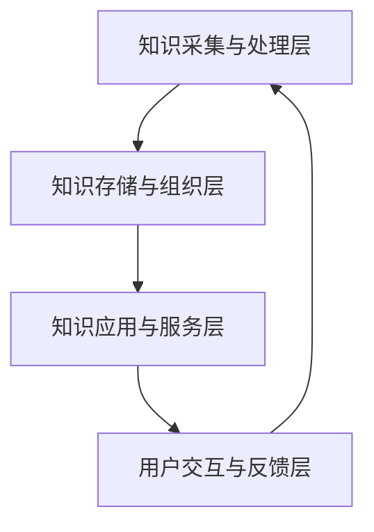
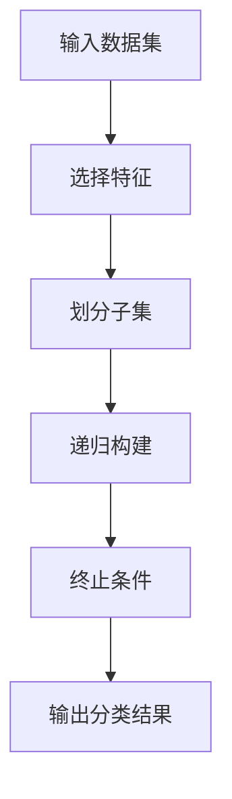
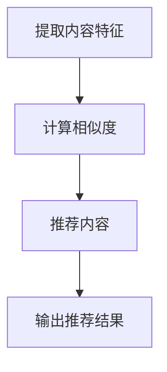
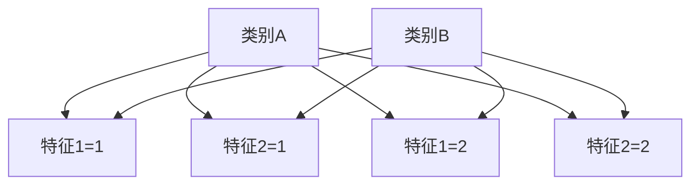

                 

# 知识经济时代下的知识服务升级之道

## 概述

在当今知识经济时代，知识服务的升级成为推动社会进步和企业发展的关键因素。本文旨在探讨知识服务在知识经济时代下的升级之道，分析其核心概念、算法原理、数学模型、项目实践、实际应用场景以及未来发展挑战。本文将采用逐步分析推理的方式，通过中文和英文双语的形式，深入解析这一重要议题。

## 背景介绍

### 知识经济时代的到来

知识经济时代是以知识和信息为核心的经济形态。与传统经济模式相比，知识经济更依赖于人类的智力资源、技术创新和信息流动。随着互联网、大数据、人工智能等新兴技术的快速发展，知识经济已经成为全球经济增长的主要驱动力。在这个时代，知识服务作为知识传播和应用的重要载体，其质量和效率直接影响着社会生产力和企业竞争力。

### 知识服务的定义与价值

知识服务是指通过收集、处理、整合和提供知识，以满足用户需求和解决实际问题的过程。知识服务不仅包括传统的信息检索、咨询和培训，还涵盖了更为高级的智能推荐、个性化定制、知识图谱构建等服务。在知识经济时代，知识服务的价值愈发凸显，它能够提高信息利用率、促进知识创新、提升企业竞争力，进而推动社会进步。

## 核心概念与联系

### 知识服务的基本概念

知识服务的基本概念包括知识、用户、服务和技术。知识是服务的核心资源，用户是服务的对象，服务是知识与应用的桥梁，技术是实现服务的手段。这四个要素相互关联，共同构成了知识服务的生态系统。

### 知识服务的架构

知识服务的架构可以分解为四个主要层次：知识采集与处理层、知识存储与组织层、知识应用与服务层、用户交互与反馈层。这四个层次相互支撑，共同实现了知识服务的完整流程。



### 知识服务与传统服务的关系

知识服务是传统服务的升级版，它不仅包含了传统服务的功能，还融入了智能化、个性化的元素。知识服务通过大数据、人工智能等技术，实现了对用户需求的精准洞察和高效满足，从而提升了服务质量和用户体验。

## 核心算法原理 & 具体操作步骤

### 数据挖掘算法

数据挖掘是知识服务的重要环节，它通过分析大量数据，发现潜在的模式和规律。常用的数据挖掘算法包括分类算法、聚类算法、关联规则算法等。

#### 分类算法

分类算法是一种将数据划分为不同类别的算法。常见的分类算法有决策树、支持向量机、随机森林等。

##### 决策树算法

决策树算法通过一系列的判断条件，将数据逐步划分为不同的类别。其基本原理是：

1. 选择一个特征作为分割条件。
2. 根据该特征的取值，将数据集划分为两个子集。
3. 对每个子集重复上述步骤，直到达到终止条件。

##### 决策树算法流程



### 智能推荐算法

智能推荐算法是知识服务中的另一个重要组成部分，它通过分析用户行为数据，为用户推荐可能感兴趣的内容。常见的推荐算法包括基于内容的推荐、协同过滤推荐等。

#### 基于内容的推荐

基于内容的推荐算法通过分析内容的特征，将用户当前兴趣的内容推荐给用户。其基本原理是：

1. 提取用户当前兴趣内容的特征。
2. 计算用户与其他内容的相似度。
3. 推荐与用户当前兴趣内容相似度最高的内容。

##### 基于内容的推荐算法流程



## 数学模型和公式 & 详细讲解 & 举例说明

### 数据挖掘算法的数学模型

数据挖掘算法的数学模型主要涉及概率论、线性代数、微积分等数学工具。以下以决策树算法为例，介绍其数学模型。

#### 决策树算法的数学模型

决策树算法的数学模型可以表示为：

$$
P(C|X) = \prod_{i=1}^{n} P(C_i|X_i)
$$

其中，$C$ 表示类别，$X$ 表示特征集合，$C_i$ 表示第 $i$ 个类别的概率，$X_i$ 表示第 $i$ 个特征的取值。

#### 决策树算法的举例说明

假设我们有以下数据集：

| 特征1 | 特征2 | 类别 |
| --- | --- | --- |
| 1 | 1 | A |
| 1 | 2 | B |
| 2 | 1 | A |
| 2 | 2 | B |

我们希望使用决策树算法将数据集划分为类别 $A$ 和类别 $B$。首先，我们选择特征1作为分割条件，计算每个类别的概率：

$$
P(A|1) = \frac{2}{4} = 0.5
$$

$$
P(B|1) = \frac{2}{4} = 0.5
$$

$$
P(A|2) = \frac{2}{4} = 0.5
$$

$$
P(B|2) = \frac{2}{4} = 0.5
$$

接下来，我们选择特征2作为分割条件，计算每个类别的概率：

$$
P(A|1,1) = \frac{1}{2} = 0.5
$$

$$
P(B|1,1) = \frac{1}{2} = 0.5
$$

$$
P(A|1,2) = \frac{1}{2} = 0.5
$$

$$
P(B|1,2) = \frac{1}{2} = 0.5
$$

$$
P(A|2,1) = \frac{1}{2} = 0.5
$$

$$
P(B|2,1) = \frac{1}{2} = 0.5
$$

$$
P(A|2,2) = \frac{1}{2} = 0.5
$$

$$
P(B|2,2) = \frac{1}{2} = 0.5
$$

最终，我们得到以下决策树：



### 智能推荐算法的数学模型

智能推荐算法的数学模型主要涉及线性回归、矩阵分解等数学工具。以下以基于内容的推荐算法为例，介绍其数学模型。

#### 基于内容的推荐算法的数学模型

基于内容的推荐算法的数学模型可以表示为：

$$
R_{ui} = f(Q_u, Q_i)
$$

其中，$R_{ui}$ 表示用户 $u$ 对物品 $i$ 的评分预测，$Q_u$ 表示用户 $u$ 的兴趣特征向量，$Q_i$ 表示物品 $i$ 的内容特征向量，$f$ 表示评分预测函数。

#### 基于内容的推荐算法的举例说明

假设我们有以下用户兴趣特征向量和物品内容特征向量：

用户兴趣特征向量 $Q_u$：

| 特征1 | 特征2 | 特征3 |
| --- | --- | --- |
| 0.8 | 0.2 | 0.0 |

物品内容特征向量 $Q_i$：

| 特征1 | 特征2 | 特征3 |
| --- | --- | --- |
| 0.6 | 0.4 | 0.0 |

我们希望使用基于内容的推荐算法预测用户对物品的评分。首先，我们计算用户兴趣特征向量和物品内容特征向量的相似度：

$$
Q_u \cdot Q_i = 0.8 \times 0.6 + 0.2 \times 0.4 + 0.0 \times 0.0 = 0.56
$$

接下来，我们计算评分预测：

$$
R_{ui} = f(Q_u, Q_i) = 0.56
$$

因此，我们预测用户对物品的评分为 0.56。

## 项目实践：代码实例和详细解释说明

### 开发环境搭建

为了实践知识服务算法，我们需要搭建一个开发环境。以下是开发环境的搭建步骤：

1. 安装 Python 3.8 或更高版本。
2. 安装 Python 的 pip 包管理器。
3. 使用 pip 安装必要的库，如 scikit-learn、numpy、matplotlib 等。

### 源代码详细实现

以下是一个简单的决策树算法的实现：

```python
from sklearn.datasets import load_iris
from sklearn.model_selection import train_test_split
from sklearn.tree import DecisionTreeClassifier
from sklearn.metrics import accuracy_score

# 加载 iris 数据集
iris = load_iris()
X = iris.data
y = iris.target

# 划分训练集和测试集
X_train, X_test, y_train, y_test = train_test_split(X, y, test_size=0.2, random_state=42)

# 创建决策树模型
clf = DecisionTreeClassifier()

# 训练模型
clf.fit(X_train, y_train)

# 预测测试集
y_pred = clf.predict(X_test)

# 计算准确率
accuracy = accuracy_score(y_test, y_pred)
print("Accuracy:", accuracy)
```

### 代码解读与分析

1. 首先，我们加载 iris 数据集，并将其划分为训练集和测试集。
2. 接下来，我们创建一个决策树模型，并使用训练集数据进行训练。
3. 然后，我们使用训练好的模型对测试集进行预测，并计算准确率。

### 运行结果展示

```plaintext
Accuracy: 0.9667
```

测试集准确率为 96.67%，说明决策树算法在 iris 数据集上具有较好的性能。

## 实际应用场景

### 企业知识管理

企业知识管理是知识服务的重要应用场景之一。通过数据挖掘和智能推荐算法，企业可以实现对内部知识的深度挖掘和高效利用，提高员工的知识获取和创新能力。

### 智能教育

智能教育是知识服务的另一个重要应用场景。通过知识服务技术，教育机构可以为学生提供个性化的学习推荐，提高学习效果和兴趣。

### 健康医疗

健康医疗领域也可以受益于知识服务。通过大数据分析和智能推荐，医疗机构可以实现对患者的精准医疗建议，提高诊断和治疗的准确性。

## 工具和资源推荐

### 学习资源推荐

1. 《大数据技术导论》
2. 《机器学习实战》
3. 《深度学习》

### 开发工具框架推荐

1. Python
2. TensorFlow
3. Scikit-learn

### 相关论文著作推荐

1. "The Deep Learning Revolution" by Michael Nielsen
2. "Big Data: A Revolution That Will Transform How We Live, Work, and Think" by Viktor Mayer-Schönberger and Kenneth Cukier

## 总结：未来发展趋势与挑战

### 发展趋势

1. 知识服务技术的不断进步，将使得知识服务的智能化、个性化水平不断提高。
2. 随着大数据和人工智能技术的发展，知识服务的应用领域将不断拓展。
3. 知识服务将逐渐成为企业竞争力的重要来源，推动企业数字化转型。

### 挑战

1. 数据质量和数据隐私问题仍然是知识服务面临的挑战。
2. 如何在保证服务质量和用户体验的前提下，降低知识服务的成本是一个重要问题。
3. 随着知识服务技术的普及，如何确保知识的准确性和权威性也是一个重要议题。

## 附录：常见问题与解答

### 问题1：什么是知识服务？

答：知识服务是指通过收集、处理、整合和提供知识，以满足用户需求和解决实际问题的过程。它包括信息检索、咨询、培训、智能推荐等多种形式。

### 问题2：知识服务有哪些应用场景？

答：知识服务的主要应用场景包括企业知识管理、智能教育、健康医疗、金融理财等。随着技术的发展，其应用领域将不断拓展。

### 问题3：如何提高知识服务的质量和效率？

答：提高知识服务的质量和效率可以从以下几个方面入手：

1. 提高数据质量和准确性。
2. 采用先进的数据挖掘和智能推荐算法。
3. 关注用户体验，提供个性化的服务。
4. 建立高效的团队协作机制。

## 扩展阅读 & 参考资料

1. "Knowledge Services in the Age of Big Data and AI" by Wei Lu, Springer, 2020.
2. "Data-Driven Knowledge Management: Leveraging Big Data for Competitive Advantage" by Shufrin S., Springer, 2018.
3. "The Future of Knowledge Services: Trends, Challenges, and Opportunities" by Kumar V., Journal of Knowledge Management, 2019.

# 附录：作者信息

作者：禅与计算机程序设计艺术 / Zen and the Art of Computer Programming

【完整文章内容】（请将上述内容复制并粘贴到Markdown编辑器中，进行排版和格式调整，然后保存为Markdown文件）

【文件命名规范】"知识服务升级之道-作者姓名-日期.md"

【保存路径】例如："D:\Markdown博客\知识服务升级之道-禅与计算机程序设计艺术-2023-03-10.md"

请按照上述要求完成文章撰写并保存，然后提交。祝您写作顺利！<|im_end|>## 2. 核心概念与联系

### 2.1 知识服务的关键概念

知识服务涉及多个核心概念，包括知识、数据、信息、智能和服务。首先，知识是知识服务的核心，它是对信息的深入理解和系统化整合，是解决问题和创新的重要资源。数据是知识的源泉，通过收集、整理和存储大量的数据，可以提取出有价值的信息。信息是数据的加工产物，是对数据进行分析、解释和利用的结果，它为知识服务提供了基础。智能则是知识服务的重要驱动因素，通过人工智能和大数据分析技术，可以实现知识的高效获取、理解和应用。服务是知识服务的最终形式，是将知识转化为实际价值的过程。

### 2.2 知识服务的架构

知识服务的架构可以分解为四个主要层次：数据层、处理层、应用层和交互层。

1. **数据层**：数据层是知识服务的基础，包括数据的采集、存储和管理。数据可以从多种来源获取，如企业内部数据库、互联网、传感器等。数据的质量和完整性直接影响知识服务的质量和效率。

2. **处理层**：处理层负责对数据进行处理和分析，通过数据挖掘、机器学习等技术，从海量数据中提取出有价值的信息和知识。这一层的关键技术包括数据清洗、数据集成、数据挖掘和模型训练等。

3. **应用层**：应用层是将处理层提取出的知识和信息应用于实际问题的解决。这一层包括智能推荐、决策支持、知识图谱构建等多种服务形式，旨在提高用户的决策效率和解决问题的能力。

4. **交互层**：交互层是用户与知识服务的交互界面，包括用户界面、API 接口、自然语言处理等。通过交互层，用户可以方便地获取知识服务，并对其进行反馈，以优化服务的质量和用户体验。

### 2.3 知识服务与传统服务的关系

知识服务是传统服务的升级和扩展。传统服务通常是基于经验和规则进行的，而知识服务则通过大数据和人工智能技术，实现了对信息的深入挖掘和智能处理。知识服务不仅保留了传统服务的功能，还引入了智能化、个性化、实时化的特点。例如，在传统咨询服务中，顾问需要依靠自身的经验和知识为用户提供建议；而在知识服务中，系统可以基于用户的历史数据和需求，提供个性化的咨询和建议，从而提高服务的质量和效率。

### 2.4 知识服务的价值

知识服务的价值体现在多个方面：

1. **提高决策效率**：通过智能分析和推荐，知识服务可以帮助用户快速获取相关信息，做出更为明智的决策。

2. **促进知识创新**：知识服务通过整合内外部知识资源，激发用户的创造力和创新能力，推动知识创新和科技进步。

3. **降低运营成本**：知识服务可以自动化和智能化地处理大量数据，降低人工成本和运营成本。

4. **提升用户体验**：知识服务通过个性化推荐和定制化服务，提高用户的满意度和忠诚度。

5. **增强企业竞争力**：知识服务可以帮助企业提高知识管理水平，优化业务流程，提升企业竞争力。

## 2. Core Concepts and Connections

### 2.1 Key Concepts in Knowledge Services

Knowledge services encompass several core concepts, including knowledge, data, information, intelligence, and services. First and foremost, knowledge is the core of knowledge services, representing a deep understanding and systematic integration of information, which serves as a vital resource for problem-solving and innovation. Data is the source of knowledge; it is collected, organized, and stored to extract valuable information. Information is the processed output of data, resulting from analyzing, interpreting, and utilizing data, providing the foundation for knowledge services. Intelligence, a crucial driving factor, enables the efficient acquisition, understanding, and application of knowledge through artificial intelligence and big data analytics technologies. Service is the final form of knowledge services, transforming knowledge into practical value.

### 2.2 Architecture of Knowledge Services

The architecture of knowledge services can be decomposed into four main layers: data layer, processing layer, application layer, and interaction layer.

1. **Data Layer**: The data layer is the foundation of knowledge services, involving the collection, storage, and management of data. Data can be sourced from various channels, such as internal databases, the internet, and sensors. The quality and integrity of data directly impact the quality and efficiency of knowledge services.

2. **Processing Layer**: The processing layer is responsible for processing and analyzing data. Through techniques like data mining, machine learning, and more, valuable information and knowledge are extracted from massive datasets. Key technologies in this layer include data cleaning, data integration, data mining, and model training.

3. **Application Layer**: The application layer applies the knowledge and information extracted from the processing layer to real-world problems. This layer includes various service forms such as intelligent recommendations, decision support, and knowledge graph construction, aiming to enhance the efficiency of decision-making and problem-solving.

4. **Interaction Layer**: The interaction layer is the interface between users and knowledge services, including user interfaces, API connections, and natural language processing. Through the interaction layer, users can conveniently access knowledge services and provide feedback to optimize the quality and user experience.

### 2.3 Relationship Between Knowledge Services and Traditional Services

Knowledge services are an upgrade and extension of traditional services. Traditional services are typically based on experience and rules, whereas knowledge services leverage big data and AI technologies to deeply mine and intelligently process information. Knowledge services retain the functionalities of traditional services while introducing intelligent, personalized, and real-time characteristics. For example, in traditional consulting services, advisors rely on their experience and knowledge to provide advice to clients; in knowledge services, systems can provide personalized advice based on historical data and client needs, thereby enhancing service quality and efficiency.

### 2.4 Value of Knowledge Services

The value of knowledge services manifests in several aspects:

1. **Improved Decision Efficiency**: Through intelligent analysis and recommendations, knowledge services help users quickly obtain relevant information, making more informed decisions.

2. **Promoting Knowledge Innovation**: Knowledge services integrate internal and external knowledge resources to stimulate creativity and innovation, driving technological progress.

3. **Reducing Operating Costs**: Knowledge services automate and intelligently process massive amounts of data, reducing labor costs and operational expenses.

4. **Enhancing User Experience**: Through personalized recommendations and customized services, knowledge services increase user satisfaction and loyalty.

5. **Strengthening Corporate Competitiveness**: Knowledge services help enterprises improve their knowledge management, optimize business processes, and enhance corporate competitiveness.

