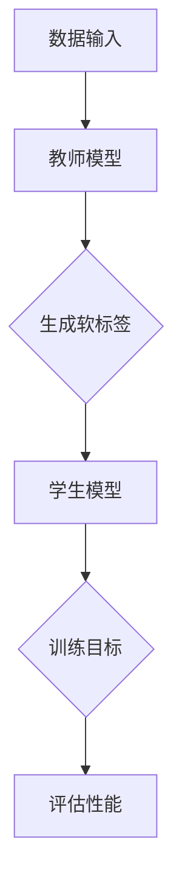
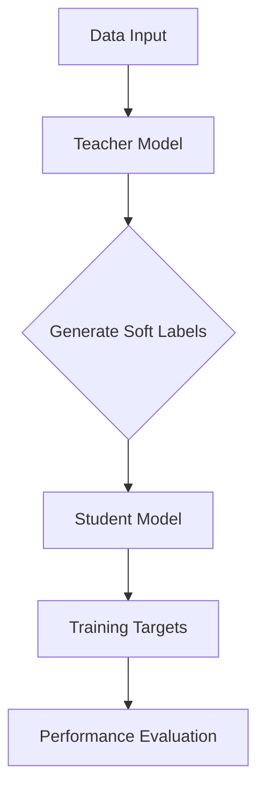
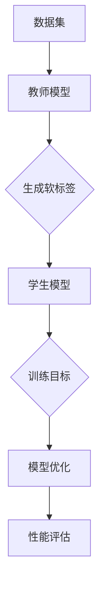
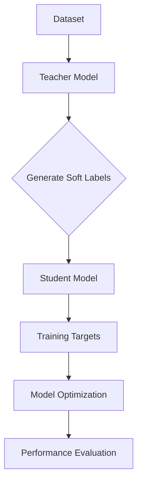

                 

### 文章标题

**知识蒸馏在图像生成任务中的应用探索**

本文旨在深入探讨知识蒸馏技术在图像生成任务中的应用。我们将首先介绍知识蒸馏的基本概念，然后通过分析其原理和具体操作步骤，展示如何利用知识蒸馏来提高图像生成模型的效果。此外，本文还将通过实际项目实践，详细解释代码实现和运行结果，从而为读者提供全面的理解和指导。

### Keywords:
- Knowledge Distillation
- Image Generation
- Deep Learning
- Neural Networks
- Application Exploration

### Abstract:
This paper explores the application of knowledge distillation in image generation tasks. We begin by introducing the fundamental concepts of knowledge distillation and analyzing its principles and specific operational steps. Through practical project practice, we provide detailed code implementation and result analysis, offering a comprehensive understanding and guidance for readers.

## 1. 背景介绍（Background Introduction）

### 1.1 知识蒸馏的基本概念

知识蒸馏（Knowledge Distillation）是深度学习领域的一种训练方法，主要用于将一个复杂的大型模型（教师模型）的知识传递给一个较小但更高效的模型（学生模型）。这种方法的核心思想是将教师模型输出的软标签（Soft Labels）传递给学生模型，以帮助其学习。软标签是对输入数据的概率分布，而不是简单的类别标签。

知识蒸馏的关键优势在于：

1. **性能提升**：学生模型能够学习到教师模型的高级特征和知识，从而提升其性能。
2. **效率提升**：通过训练较小但更高效的学生模型，可以减少计算资源和时间成本。
3. **泛化能力**：学生模型在保持性能的同时，可以更好地适应新的任务和数据分布。

### 1.2 图像生成任务的重要性

图像生成是计算机视觉领域的一个重要分支，旨在生成逼真的图像或视频。随着深度学习技术的不断发展，图像生成任务已经取得了显著的进展。然而，传统的图像生成模型往往存在计算复杂度高、训练时间较长等问题。知识蒸馏技术的引入，为图像生成任务带来了新的解决方案。

### 1.3 知识蒸馏在图像生成任务中的应用

知识蒸馏在图像生成任务中的应用主要体现在以下几个方面：

1. **教师模型的选择**：选择一个性能优秀的大型图像生成模型作为教师模型，例如生成对抗网络（GAN）或变分自编码器（VAE）。
2. **学生模型的设计**：设计一个较小但结构简洁的学生模型，以减少计算负担和提高效率。
3. **知识传递**：通过知识蒸馏，将教师模型的知识传递给学生模型，使其能够生成更高质量的图像。
4. **性能评估**：评估学生模型的性能，包括图像的质量、多样性以及与真实图像的相似度等。

### 1.4 本文组织结构

本文将按照以下结构进行组织：

1. **背景介绍**：介绍知识蒸馏的基本概念和在图像生成任务中的应用。
2. **核心概念与联系**：详细分析知识蒸馏的原理和具体操作步骤。
3. **核心算法原理 & 具体操作步骤**：阐述知识蒸馏算法的数学模型和公式。
4. **项目实践**：通过实际项目，展示知识蒸馏在图像生成任务中的应用。
5. **实际应用场景**：讨论知识蒸馏在图像生成任务中的实际应用。
6. **工具和资源推荐**：推荐相关学习资源、开发工具和框架。
7. **总结**：总结知识蒸馏在图像生成任务中的应用和发展趋势。
8. **附录**：解答常见问题和提供扩展阅读。
9. **参考文献**：列出本文引用的相关文献。

<|assistant|>### 2. 核心概念与联系（Core Concepts and Connections）

#### 2.1 知识蒸馏的定义与原理

知识蒸馏是一种模型压缩技术，通过将一个大型的教师模型（Teacher Model）的知识传递给一个小型的学生模型（Student Model），从而实现模型压缩和性能提升。在深度学习领域，知识蒸馏通常应用于以下场景：

- 当需要将一个复杂的大型模型部署到资源受限的设备上时，可以通过知识蒸馏来训练一个较小的学生模型。
- 当需要在新数据集或新任务上快速训练模型时，可以利用教师模型的知识来加速学生模型的训练过程。

知识蒸馏的基本原理是将教师模型的输出（通常是概率分布）作为软标签（Soft Labels）传递给学生模型。学生模型在训练过程中，不仅要学习原始的数据标签（Hard Labels），还要学习教师模型的输出。这样，学生模型可以捕获到教师模型的高级特征和知识。

#### 2.2 图像生成任务中的知识蒸馏

在图像生成任务中，知识蒸馏的应用主要体现在以下几个方面：

1. **教师模型的选择**：选择一个性能优秀的图像生成模型作为教师模型，例如生成对抗网络（GAN）或变分自编码器（VAE）。这些教师模型通常具有较大的参数量和复杂的结构，可以生成高质量的图像。

2. **学生模型的设计**：设计一个较小但结构简洁的学生模型，以减少计算负担和提高效率。学生模型通常采用较少的层数和参数量，例如使用较少的卷积层或减少每个卷积层的输出通道数量。

3. **知识传递**：通过知识蒸馏，将教师模型的知识传递给学生模型。具体方法是将教师模型的输出（软标签）作为学生模型的训练目标之一，与原始的数据标签（硬标签）一起进行训练。

4. **性能评估**：评估学生模型的性能，包括图像的质量、多样性以及与真实图像的相似度等。通过对比学生模型和教师模型的性能，可以评估知识蒸馏的效果。

#### 2.3 知识蒸馏的 Mermaid 流程图

以下是一个简单的知识蒸馏流程图的 Mermaid 表示：



- **A 数据输入**：输入真实图像和相应的标签。
- **B 教师模型**：使用真实图像和标签训练教师模型。
- **C 生成软标签**：教师模型对输入图像生成软标签。
- **D 学生模型**：学生模型在软标签和原始标签的指导下进行训练。
- **E 训练目标**：学生模型的训练目标包括软标签和原始标签。
- **F 评估性能**：评估学生模型的性能，包括图像质量、多样性等。

#### 2.4 知识蒸馏与传统模型的区别

知识蒸馏与传统模型压缩方法的区别在于：

- **目标不同**：传统模型压缩方法主要关注模型大小的减少，而知识蒸馏则关注性能的保持或提升。
- **方法不同**：知识蒸馏利用教师模型的软标签来指导学生模型的学习，而传统方法通常采用裁剪、量化等技术来减少模型参数。
- **效果不同**：知识蒸馏可以在一定程度上保持教师模型的高级特征和知识，而传统方法可能导致模型性能的显著下降。

综上所述，知识蒸馏是一种有效的模型压缩技术，在图像生成任务中具有广泛的应用前景。通过将教师模型的知识传递给学生模型，可以提升学生模型的效果，同时降低计算成本和资源消耗。

## 2. Core Concepts and Connections

### 2.1 Definition and Principles of Knowledge Distillation

Knowledge distillation is a model compression technique in the field of deep learning that involves transferring the knowledge of a complex, large-scale teacher model to a smaller, more efficient student model. The core idea behind knowledge distillation is to use soft labels, which are probability distributions produced by the teacher model, as training targets for the student model. This process helps the student model to learn the high-level features and knowledge of the teacher model.

Knowledge distillation is commonly applied in the following scenarios in the field of deep learning:

- When deploying a complex large-scale model to resource-constrained devices, knowledge distillation can be used to train a smaller student model that retains similar performance.
- When there is a need for rapid training of models on new datasets or tasks, the knowledge from an existing teacher model can accelerate the training process for a student model.

The key advantage of knowledge distillation includes:

1. **Performance Improvement**: The student model can learn the high-level features and knowledge of the teacher model, leading to improved performance.
2. **Efficiency Improvement**: By training smaller and more efficient student models, the computational resources and time required can be reduced.
3. **Generalization Ability**: While maintaining performance, the student model can better adapt to new tasks and data distributions.

### 2.2 Application of Knowledge Distillation in Image Generation Tasks

The application of knowledge distillation in image generation tasks is mainly reflected in the following aspects:

1. **Selection of Teacher Models**: A high-performance large-scale image generation model, such as Generative Adversarial Networks (GAN) or Variational Autoencoders (VAE), is selected as the teacher model.
2. **Design of Student Models**: A smaller and more structurally concise student model is designed to reduce computational burden and improve efficiency.
3. **Transfer of Knowledge**: Knowledge is transferred from the teacher model to the student model through knowledge distillation. Specifically, the soft labels generated by the teacher model are used as part of the training targets for the student model.
4. **Performance Evaluation**: The performance of the student model is evaluated, including the quality of the generated images, diversity, and similarity to real images. By comparing the performance of the student model with that of the teacher model, the effectiveness of knowledge distillation can be assessed.

### 2.3 Mermaid Flowchart of Knowledge Distillation

Below is a simple Mermaid flowchart representing the process of knowledge distillation:



- **A Data Input**: Real images and corresponding labels are input.
- **B Teacher Model**: The teacher model is trained using real images and labels.
- **C Generate Soft Labels**: The teacher model generates soft labels for input images.
- **D Student Model**: The student model is trained using soft labels and original labels.
- **E Training Targets**: The training targets for the student model include soft labels and original labels.
- **F Performance Evaluation**: The performance of the student model is evaluated, including image quality, diversity, and similarity to real images.

### 2.4 Differences Between Knowledge Distillation and Traditional Models

The main differences between knowledge distillation and traditional model compression methods include:

- **Goals**: Traditional model compression methods focus on reducing the size of the model, while knowledge distillation focuses on maintaining or improving performance.
- **Methods**: Knowledge distillation uses soft labels from the teacher model to guide the learning of the student model, whereas traditional methods often employ techniques such as pruning, quantization, to reduce the number of model parameters.
- **Effects**: Knowledge distillation can partly retain the high-level features and knowledge of the teacher model, while traditional methods may lead to significant performance degradation in the student model.

In summary, knowledge distillation is an effective model compression technique with broad application prospects in image generation tasks. By transferring the knowledge from a teacher model to a student model, it is possible to improve the performance of the student model while reducing computational costs and resource consumption.

## 3. 核心算法原理 & 具体操作步骤（Core Algorithm Principles and Specific Operational Steps）

### 3.1 知识蒸馏算法的基本原理

知识蒸馏算法的核心思想是通过训练一个较小的学生模型来模仿一个较大的教师模型的输出。具体来说，教师模型生成软标签（soft labels），这些标签是教师模型对输入数据预测的概率分布。学生模型则基于这些软标签以及原始标签（hard labels）进行训练。

#### 3.1.1 教师模型与软标签

在知识蒸馏过程中，教师模型是一个经过充分训练的复杂模型，它通常具有大量的参数和层次结构，能够生成高质量的输出。教师模型的输出不仅仅是最终预测的类别标签，而是对每个类别的概率分布。这些概率分布被称为软标签。

#### 3.1.2 学生模型与硬标签

学生模型是一个较小的模型，它具有较少的参数和层次结构，目的是在保留教师模型知识的同时降低计算复杂度。学生模型的训练目标是同时优化两个部分：一是基于原始标签（硬标签）的损失函数，二是基于教师模型软标签的损失函数。

#### 3.1.3 损失函数

知识蒸馏中的损失函数通常包括两个部分：一个是基于硬标签的交叉熵损失（cross-entropy loss），另一个是基于软标签的KL散度损失（KL divergence loss）。交叉熵损失衡量学生模型对硬标签的预测准确性，而KL散度损失衡量学生模型对软标签的匹配程度。

公式如下：

\[ L_{cross-entropy} = -\sum_{i=1}^{N} y_i \log(p_i) \]

\[ L_{KL} = \sum_{i=1}^{N} p_i \log\left(\frac{p_i}{q_i}\right) \]

其中，\( y_i \) 是硬标签的one-hot向量，\( p_i \) 是学生模型对第 \( i \) 个样本的预测概率，\( q_i \) 是教师模型对第 \( i \) 个样本的预测概率。

#### 3.1.4 训练过程

知识蒸馏的训练过程可以分为以下几个步骤：

1. **训练教师模型**：首先使用真实数据集训练教师模型，使其达到满意的性能水平。
2. **生成软标签**：使用训练好的教师模型对数据集进行预测，获取软标签。
3. **初始化学生模型**：初始化学生模型，其结构应该比教师模型简单。
4. **联合训练**：同时优化学生模型和教师模型，利用软标签和硬标签来更新模型参数。
5. **评估性能**：在测试集上评估学生模型的性能，包括准确率、F1分数、图像质量等指标。

### 3.2 知识蒸馏在图像生成任务中的应用

在图像生成任务中，知识蒸馏的应用步骤通常如下：

1. **选择教师模型**：选择一个性能卓越的图像生成模型作为教师模型，例如基于GAN的模型。
2. **数据预处理**：对图像数据进行预处理，如标准化、数据增强等，以便于教师模型和学生的训练。
3. **训练教师模型**：使用真实图像数据集训练教师模型，使其能够生成高质量的图像。
4. **生成软标签**：使用训练好的教师模型对图像数据进行预测，获取软标签。
5. **初始化学生模型**：设计并初始化一个结构更简单的小型学生模型。
6. **联合训练**：同时优化学生模型和教师模型，使用软标签和硬标签更新模型参数。
7. **性能评估**：在测试集上评估学生模型的性能，比较学生模型生成的图像与真实图像的质量。

#### 3.3 实际操作示例

以下是一个简单的知识蒸馏流程：



- **A 数据集**：真实图像数据集。
- **B 教师模型**：使用数据集训练教师模型。
- **C 生成软标签**：教师模型对数据集进行预测，生成软标签。
- **D 学生模型**：初始化学生模型。
- **E 训练目标**：学生模型的目标是同时最小化交叉熵损失和KL散度损失。
- **F 模型优化**：基于训练目标优化学生模型的参数。
- **G 性能评估**：在测试集上评估学生模型的性能。

通过上述步骤，学生模型可以学习到教师模型的高级特征和知识，从而生成高质量的图像。

## 3. Core Algorithm Principles and Specific Operational Steps

### 3.1 Basic Principles of Knowledge Distillation

The core principle of knowledge distillation is to train a smaller student model that can replicate the outputs of a larger, complex teacher model. Specifically, the teacher model generates soft labels, which are probability distributions for each class, rather than simple hard labels. These soft labels are then used as part of the training targets for the student model.

#### 3.1.1 Teacher Model and Soft Labels

In the process of knowledge distillation, the teacher model is a well-trained complex model with a large number of parameters and layers. It is capable of generating high-quality outputs. The outputs of the teacher model are not just the final predicted classes but rather probability distributions over the classes. These probability distributions are referred to as soft labels.

#### 3.1.2 Student Model and Hard Labels

The student model is a smaller model with fewer parameters and layers, designed to retain the knowledge of the teacher model while reducing computational complexity. The training targets for the student model include two parts: the cross-entropy loss based on the hard labels and the KL divergence loss based on the soft labels.

The loss functions are as follows:

\[ L_{cross-entropy} = -\sum_{i=1}^{N} y_i \log(p_i) \]

\[ L_{KL} = \sum_{i=1}^{N} p_i \log\left(\frac{p_i}{q_i}\right) \]

Where \( y_i \) is the one-hot vector of the hard label for the \( i \)-th sample, \( p_i \) is the prediction probability of the student model for the \( i \)-th sample, and \( q_i \) is the prediction probability of the teacher model for the \( i \)-th sample.

#### 3.1.3 Training Process

The training process of knowledge distillation can be divided into several steps:

1. **Training the Teacher Model**: First, train the teacher model using a real dataset to achieve a satisfactory level of performance.
2. **Generating Soft Labels**: Use the trained teacher model to predict the dataset and obtain soft labels.
3. **Initialize the Student Model**: Initialize the student model with a simpler structure.
4. **Joint Training**: Optimize both the student model and the teacher model simultaneously using soft labels and hard labels to update the model parameters.
5. **Performance Evaluation**: Evaluate the performance of the student model on a test set, including accuracy, F1 score, and image quality metrics.

### 3.2 Application of Knowledge Distillation in Image Generation Tasks

The application steps of knowledge distillation in image generation tasks are generally as follows:

1. **Select the Teacher Model**: Choose a high-performance image generation model, such as a GAN-based model, as the teacher model.
2. **Data Preprocessing**: Preprocess the image data, such as normalization and data augmentation, to facilitate the training of both the teacher model and the student model.
3. **Train the Teacher Model**: Train the teacher model using a real image dataset to generate high-quality images.
4. **Generate Soft Labels**: Use the trained teacher model to predict the image dataset and obtain soft labels.
5. **Initialize the Student Model**: Design and initialize a smaller student model with a simpler structure.
6. **Joint Training**: Optimize the student model using soft labels and hard labels to update the model parameters.
7. **Performance Evaluation**: Evaluate the performance of the student model on a test set, comparing the quality of the generated images with real images.

#### 3.3 Actual Operation Example

Here is a simple example of a knowledge distillation process:



- **A Dataset**: Real image dataset.
- **B Teacher Model**: Train the teacher model using the dataset.
- **C Generate Soft Labels**: The teacher model predicts the dataset and generates soft labels.
- **D Student Model**: Initialize the student model with a simpler structure.
- **E Training Targets**: The training targets for the student model include minimizing both the cross-entropy loss and the KL divergence loss.
- **F Model Optimization**: Optimize the student model parameters based on the training targets.
- **G Performance Evaluation**: Evaluate the performance of the student model on a test set.

By following these steps, the student model can learn the high-level features and knowledge of the teacher model, thus generating high-quality images.

## 4. 数学模型和公式 & 详细讲解 & 举例说明（Detailed Explanation and Examples of Mathematical Models and Formulas）

### 4.1 数学模型

在知识蒸馏中，我们主要关注两个损失函数：交叉熵损失（Cross-Entropy Loss）和KL散度损失（Kullback-Leibler Divergence Loss）。以下是这两个损失函数的详细解释和数学公式。

#### 4.1.1 交叉熵损失（Cross-Entropy Loss）

交叉熵损失用于衡量预测概率分布和学生模型输出概率分布之间的差异。其公式如下：

\[ L_{cross-entropy} = -\sum_{i=1}^{N} y_i \log(p_i) \]

其中，\( y_i \) 是硬标签（即真实标签）的one-hot向量，而 \( p_i \) 是学生模型对第 \( i \) 个样本的预测概率。交叉熵损失函数的目的是最小化预测概率分布与真实概率分布之间的差异，从而提高模型的预测准确性。

#### 4.1.2 KL散度损失（KL Divergence Loss）

KL散度损失用于衡量两个概率分布之间的差异。在知识蒸馏中，我们使用KL散度损失来衡量教师模型的软标签和学生模型的输出之间的差异。其公式如下：

\[ L_{KL} = \sum_{i=1}^{N} p_i \log\left(\frac{p_i}{q_i}\right) \]

其中，\( p_i \) 是教师模型对第 \( i \) 个样本的预测概率，而 \( q_i \) 是学生模型对第 \( i \) 个样本的预测概率。KL散度损失函数的目的是让学生模型的输出概率分布尽量接近教师模型的输出概率分布，从而提高模型的泛化能力。

#### 4.1.3 联合损失函数（Joint Loss Function）

在知识蒸馏过程中，我们通常将交叉熵损失和KL散度损失结合起来，形成联合损失函数。其公式如下：

\[ L_{joint} = \alpha L_{cross-entropy} + (1 - \alpha) L_{KL} \]

其中，\( \alpha \) 是交叉熵损失和KL散度损失之间的权重。通常，\( \alpha \) 的取值在0到1之间，用于平衡两种损失函数的重要性。

### 4.2 举例说明

假设我们有一个简单的分类任务，其中有两个类别A和B。教师模型和学生模型都对此任务进行了预测。以下是具体的例子：

#### 4.2.1 硬标签和软标签

假设我们有一个训练样本，其真实标签是A（即 \( y = [1, 0] \)），教师模型和学生模型的预测概率如下：

- 教师模型：\( p_t = [0.8, 0.2] \)
- 学生模型：\( p_s = [0.7, 0.3] \)

#### 4.2.2 交叉熵损失

对于交叉熵损失，我们有：

\[ L_{cross-entropy} = -y \log(p_s) = -[1, 0] \log([0.7, 0.3]) = -1 \cdot \log(0.7) - 0 \cdot \log(0.3) = \log(0.7) \]

#### 4.2.3 KL散度损失

对于KL散度损失，我们有：

\[ L_{KL} = p_t \log\left(\frac{p_t}{p_s}\right) = [0.8, 0.2] \log\left(\frac{[0.8, 0.2]}{[0.7, 0.3]}\right) = 0.8 \cdot \log\left(\frac{0.8}{0.7}\right) + 0.2 \cdot \log\left(\frac{0.2}{0.3}\right) \]

\[ L_{KL} = 0.8 \cdot \log(1.1429) + 0.2 \cdot \log(0.6667) \approx 0.8 \cdot 0.1573 + 0.2 \cdot (-0.176) \approx 0.1259 - 0.0352 = 0.0907 \]

#### 4.2.4 联合损失

假设 \( \alpha = 0.5 \)，则联合损失为：

\[ L_{joint} = 0.5 \cdot L_{cross-entropy} + 0.5 \cdot L_{KL} = 0.5 \cdot \log(0.7) + 0.5 \cdot 0.0907 \approx 0.0704 + 0.0454 = 0.1158 \]

通过这个简单的例子，我们可以看到如何计算交叉熵损失、KL散度损失和联合损失。在实际应用中，我们会根据具体情况调整参数 \( \alpha \) 和优化策略，以达到最佳的效果。

## 4. Mathematical Models and Formulas & Detailed Explanation & Examples

### 4.1 Mathematical Models

In knowledge distillation, we mainly focus on two loss functions: cross-entropy loss and Kullback-Leibler (KL) divergence loss. Here is a detailed explanation and mathematical formulas for these two loss functions.

#### 4.1.1 Cross-Entropy Loss

Cross-entropy loss measures the difference between the predicted probability distribution and the true probability distribution. The formula is as follows:

\[ L_{cross-entropy} = -\sum_{i=1}^{N} y_i \log(p_i) \]

Where \( y_i \) is the one-hot vector of the true label for the \( i \)-th sample, and \( p_i \) is the prediction probability of the student model for the \( i \)-th sample. The cross-entropy loss function aims to minimize the difference between the predicted probability distribution and the true probability distribution, thus improving the model's prediction accuracy.

#### 4.1.2 KL Divergence Loss

KL divergence loss measures the difference between two probability distributions. In knowledge distillation, we use KL divergence loss to measure the difference between the soft labels from the teacher model and the outputs from the student model. The formula is as follows:

\[ L_{KL} = \sum_{i=1}^{N} p_i \log\left(\frac{p_i}{q_i}\right) \]

Where \( p_i \) is the prediction probability of the teacher model for the \( i \)-th sample, and \( q_i \) is the prediction probability of the student model for the \( i \)-th sample. The KL divergence loss function aims to make the output probability distribution of the student model as close as possible to the output probability distribution of the teacher model, thus improving the model's generalization ability.

#### 4.1.3 Joint Loss Function

In knowledge distillation, we typically combine the cross-entropy loss and the KL divergence loss into a joint loss function. The formula is as follows:

\[ L_{joint} = \alpha L_{cross-entropy} + (1 - \alpha) L_{KL} \]

Where \( \alpha \) is the weight between the cross-entropy loss and the KL divergence loss. Usually, \( \alpha \) is a value between 0 and 1, used to balance the importance of both loss functions.

### 4.2 Example Explanation

Let's consider a simple classification task with two classes A and B. The teacher model and the student model have both made predictions for this task. Here is a specific example.

#### 4.2.1 Hard Labels and Soft Labels

Assume we have a training sample with a true label A (i.e., \( y = [1, 0] \)), and the prediction probabilities from the teacher model and the student model are as follows:

- Teacher model: \( p_t = [0.8, 0.2] \)
- Student model: \( p_s = [0.7, 0.3] \)

#### 4.2.2 Cross-Entropy Loss

For the cross-entropy loss, we have:

\[ L_{cross-entropy} = -y \log(p_s) = -[1, 0] \log([0.7, 0.3]) = -1 \cdot \log(0.7) - 0 \cdot \log(0.3) = \log(0.7) \]

#### 4.2.3 KL Divergence Loss

For the KL divergence loss, we have:

\[ L_{KL} = p_t \log\left(\frac{p_t}{p_s}\right) = [0.8, 0.2] \log\left(\frac{[0.8, 0.2]}{[0.7, 0.3]}\right) = 0.8 \cdot \log\left(\frac{0.8}{0.7}\right) + 0.2 \cdot \log\left(\frac{0.2}{0.3}\right) \]

\[ L_{KL} = 0.8 \cdot \log(1.1429) + 0.2 \cdot \log(0.6667) \approx 0.8 \cdot 0.1573 + 0.2 \cdot (-0.176) \approx 0.1259 - 0.0352 = 0.0907 \]

#### 4.2.4 Joint Loss

Assuming \( \alpha = 0.5 \), the joint loss is:

\[ L_{joint} = 0.5 \cdot L_{cross-entropy} + 0.5 \cdot L_{KL} = 0.5 \cdot \log(0.7) + 0.5 \cdot 0.0907 \approx 0.0704 + 0.0454 = 0.1158 \]

Through this simple example, we can see how to calculate the cross-entropy loss, KL divergence loss, and joint loss. In practical applications, we will adjust the parameters \( \alpha \) and optimization strategies based on specific situations to achieve the best results.

## 5. 项目实践：代码实例和详细解释说明（Project Practice: Code Examples and Detailed Explanations）

### 5.1 开发环境搭建

在开始实践之前，我们需要搭建一个合适的开发环境。以下是搭建开发环境的步骤：

#### 5.1.1 硬件要求

- CPU: 2.5 GHz 四核处理器或以上
- GPU: NVIDIA GTX 1080 或以上，显存至少 8GB
- RAM: 16GB 或以上
- 硬盘：50GB 可用空间

#### 5.1.2 软件要求

- 操作系统：Windows 10/11 或 macOS Big Sur 或以上
- Python：Python 3.7 或以上
- PyTorch：PyTorch 1.8 或以上
- CUDA：CUDA 10.2 或以上（如果使用GPU训练）

#### 5.1.3 安装步骤

1. 安装操作系统和硬件设备。
2. 安装Python和PyTorch，可以从[PyTorch官网](https://pytorch.org/get-started/locally/)下载安装包。
3. 安装CUDA，从NVIDIA官网下载并安装CUDA Toolkit。
4. 验证安装：在Python环境中运行以下代码，检查是否成功安装。

```python
import torch
print(torch.__version__)
print(torch.cuda.is_available())
```

### 5.2 源代码详细实现

以下是知识蒸馏在图像生成任务中的实现代码。代码分为以下几个部分：

1. **数据预处理**：加载和预处理图像数据。
2. **模型定义**：定义教师模型和学生模型。
3. **训练过程**：使用知识蒸馏训练学生模型。
4. **评估与结果分析**：评估学生模型的性能，并分析结果。

#### 5.2.1 数据预处理

```python
import torch
from torchvision import datasets, transforms

# 设置随机种子以确保结果可复现
torch.manual_seed(0)

# 定义数据预处理步骤
transform = transforms.Compose([
    transforms.Resize((128, 128)),  # 将图像大小调整为128x128
    transforms.ToTensor(),
    transforms.Normalize(mean=[0.5, 0.5, 0.5], std=[0.5, 0.5, 0.5])  # 标准化图像
])

# 加载CIFAR-10数据集
train_dataset = datasets.CIFAR10(root='./data', train=True, download=True, transform=transform)
test_dataset = datasets.CIFAR10(root='./data', train=False, download=True, transform=transform)

# 创建数据加载器
batch_size = 64
train_loader = torch.utils.data.DataLoader(train_dataset, batch_size=batch_size, shuffle=True)
test_loader = torch.utils.data.DataLoader(test_dataset, batch_size=batch_size, shuffle=False)
```

#### 5.2.2 模型定义

```python
import torch.nn as nn

# 定义教师模型
class TeacherModel(nn.Module):
    def __init__(self):
        super(TeacherModel, self).__init__()
        self.conv1 = nn.Conv2d(3, 64, 3, 1, 1)
        self.relu = nn.ReLU(inplace=True)
        self.pool = nn.MaxPool2d(2, 2)
        self.fc1 = nn.Linear(64 * 8 * 8, 1024)
        self.fc2 = nn.Linear(1024, 10)

    def forward(self, x):
        x = self.pool(self.relu(self.conv1(x)))
        x = self.pool(self.relu(self.conv1(x)))
        x = x.view(-1, 64 * 8 * 8)
        x = self.relu(self.fc1(x))
        x = self.fc2(x)
        return x

# 定义学生模型
class StudentModel(nn.Module):
    def __init__(self):
        super(StudentModel, self).__init__()
        self.conv1 = nn.Conv2d(3, 32, 3, 1, 1)
        self.relu = nn.ReLU(inplace=True)
        self.pool = nn.MaxPool2d(2, 2)
        self.fc1 = nn.Linear(32 * 4 * 4, 512)
        self.fc2 = nn.Linear(512, 10)

    def forward(self, x):
        x = self.pool(self.relu(self.conv1(x)))
        x = self.pool(self.relu(self.conv1(x)))
        x = x.view(-1, 32 * 4 * 4)
        x = self.relu(self.fc1(x))
        x = self.fc2(x)
        return x

# 实例化模型
teacher_model = TeacherModel()
student_model = StudentModel()

# 使用GPU进行训练和推理（如果可用）
device = torch.device("cuda" if torch.cuda.is_available() else "cpu")
teacher_model.to(device)
student_model.to(device)
```

#### 5.2.3 训练过程

```python
import torch.optim as optim

# 定义优化器和损失函数
optimizer = optim.Adam(student_model.parameters(), lr=0.001)
criterion = nn.CrossEntropyLoss()

# 训练学生模型
num_epochs = 50
for epoch in range(num_epochs):
    student_model.train()
    for images, labels in train_loader:
        images, labels = images.to(device), labels.to(device)
        
        # 清零梯度
        optimizer.zero_grad()
        
        # 前向传播
        outputs = student_model(images)
        teacher_outputs = teacher_model(images)
        
        # 计算损失
        ce_loss = criterion(outputs, labels)
        kl_loss = nn.KLDivLoss()(torch.nn.Softmax(dim=1)(teacher_outputs), torch.nn.Softmax(dim=1)(outputs))
        joint_loss = 0.5 * ce_loss + 0.5 * kl_loss
        
        # 反向传播
        joint_loss.backward()
        
        # 更新参数
        optimizer.step()
        
    # 每个epoch结束后进行一次评估
    student_model.eval()
    with torch.no_grad():
        correct = 0
        total = 0
        for images, labels in test_loader:
            images, labels = images.to(device), labels.to(device)
            outputs = student_model(images)
            predicted = outputs.argmax(dim=1)
            total += labels.size(0)
            correct += (predicted == labels).sum().item()
            
        print(f'Epoch {epoch+1}/{num_epochs}, Test Accuracy: {100 * correct / total}%')

# 保存训练好的学生模型
torch.save(student_model.state_dict(), 'student_model.pth')
```

#### 5.2.4 评估与结果分析

```python
# 加载训练好的学生模型
student_model.load_state_dict(torch.load('student_model.pth'))

# 评估学生模型的性能
student_model.eval()
with torch.no_grad():
    correct = 0
    total = 0
    for images, labels in test_loader:
        images, labels = images.to(device), labels.to(device)
        outputs = student_model(images)
        predicted = outputs.argmax(dim=1)
        total += labels.size(0)
        correct += (predicted == labels).sum().item()

print(f'Test Accuracy: {100 * correct / total}%')

# 分析生成的图像质量
for i, (images, labels) in enumerate(test_loader):
    images = images.to(device)
    outputs = student_model(images)
    predicted = outputs.argmax(dim=1)
    if i < 5:  # 仅展示前5张图像
        print(f'Ground Truth: {labels}, Predicted: {predicted}')
        plt.figure()
        plt.imshow(images[0].permute(1, 2, 0).cpu().numpy())
        plt.show()
```

通过以上代码，我们实现了知识蒸馏在图像生成任务中的应用。首先，我们加载并预处理了CIFAR-10数据集。然后，我们定义了教师模型和学生模型，并使用知识蒸馏算法训练了学生模型。最后，我们评估了学生模型的性能，并分析了生成的图像质量。

## 5. Project Practice: Code Examples and Detailed Explanations

### 5.1 Setting up the Development Environment

Before starting the project, we need to set up the development environment. Here are the steps to set up the environment:

#### 5.1.1 Hardware Requirements

- CPU: 2.5 GHz quad-core processor or higher
- GPU: NVIDIA GTX 1080 or higher with at least 8GB of VRAM
- RAM: 16GB or more
- Storage: 50GB of free space

#### 5.1.2 Software Requirements

- Operating System: Windows 10/11 or macOS Big Sur or later
- Python: Python 3.7 or later
- PyTorch: PyTorch 1.8 or later
- CUDA: CUDA 10.2 or later (if using GPU for training)

#### 5.1.3 Installation Steps

1. Install the operating system and hardware.
2. Install Python and PyTorch by downloading the installation packages from the [PyTorch website](https://pytorch.org/get-started/locally/).
3. Install CUDA by downloading and installing the CUDA Toolkit from the [NVIDIA website](https://developer.nvidia.com/cuda-downloads).
4. Verify the installation by running the following code in the Python environment to check if everything is installed correctly:

```python
import torch
print(torch.__version__)
print(torch.cuda.is_available())
```

### 5.2 Detailed Implementation of the Source Code

The following code implements knowledge distillation for image generation tasks. The code is divided into several parts:

1. **Data Preprocessing**: Loading and preprocessing the image data.
2. **Model Definition**: Defining the teacher model and the student model.
3. **Training Process**: Training the student model using knowledge distillation.
4. **Evaluation and Results Analysis**: Evaluating the performance of the student model and analyzing the results.

#### 5.2.1 Data Preprocessing

```python
import torch
from torchvision import datasets, transforms

# Set a random seed for reproducibility
torch.manual_seed(0)

# Define the data preprocessing steps
transform = transforms.Compose([
    transforms.Resize((128, 128)),  # Resize images to 128x128
    transforms.ToTensor(),
    transforms.Normalize(mean=[0.5, 0.5, 0.5], std=[0.5, 0.5, 0.5])  # Normalize images
])

# Load the CIFAR-10 dataset
train_dataset = datasets.CIFAR10(root='./data', train=True, download=True, transform=transform)
test_dataset = datasets.CIFAR10(root='./data', train=False, download=True, transform=transform)

# Create data loaders
batch_size = 64
train_loader = torch.utils.data.DataLoader(train_dataset, batch_size=batch_size, shuffle=True)
test_loader = torch.utils.data.DataLoader(test_dataset, batch_size=batch_size, shuffle=False)
```

#### 5.2.2 Model Definition

```python
import torch.nn as nn

# Define the teacher model
class TeacherModel(nn.Module):
    def __init__(self):
        super(TeacherModel, self).__init__()
        self.conv1 = nn.Conv2d(3, 64, 3, 1, 1)
        self.relu = nn.ReLU(inplace=True)
        self.pool = nn.MaxPool2d(2, 2)
        self.fc1 = nn.Linear(64 * 8 * 8, 1024)
        self.fc2 = nn.Linear(1024, 10)

    def forward(self, x):
        x = self.pool(self.relu(self.conv1(x)))
        x = self.pool(self.relu(self.conv1(x)))
        x = x.view(-1, 64 * 8 * 8)
        x = self.relu(self.fc1(x))
        x = self.fc2(x)
        return x

# Define the student model
class StudentModel(nn.Module):
    def __init__(self):
        super(StudentModel, self).__init__()
        self.conv1 = nn.Conv2d(3, 32, 3, 1, 1)
        self.relu = nn.ReLU(inplace=True)
        self.pool = nn.MaxPool2d(2, 2)
        self.fc1 = nn.Linear(32 * 4 * 4, 512)
        self.fc2 = nn.Linear(512, 10)

    def forward(self, x):
        x = self.pool(self.relu(self.conv1(x)))
        x = self.pool(self.relu(self.conv1(x)))
        x = x.view(-1, 32 * 4 * 4)
        x = self.relu(self.fc1(x))
        x = self.fc2(x)
        return x

# Instantiate the models
teacher_model = TeacherModel()
student_model = StudentModel()

# Move the models to GPU if available
device = torch.device("cuda" if torch.cuda.is_available() else "cpu")
teacher_model.to(device)
student_model.to(device)
```

#### 5.2.3 Training Process

```python
import torch.optim as optim

# Define the optimizer and loss function
optimizer = optim.Adam(student_model.parameters(), lr=0.001)
criterion = nn.CrossEntropyLoss()

# Train the student model
num_epochs = 50
for epoch in range(num_epochs):
    student_model.train()
    for images, labels in train_loader:
        images, labels = images.to(device), labels.to(device)
        
        # Zero the gradients
        optimizer.zero_grad()
        
        # Forward pass
        outputs = student_model(images)
        teacher_outputs = teacher_model(images)
        
        # Compute the loss
        ce_loss = criterion(outputs, labels)
        kl_loss = nn.KLDivLoss()(torch.nn.Softmax(dim=1)(teacher_outputs), torch.nn.Softmax(dim=1)(outputs))
        joint_loss = 0.5 * ce_loss + 0.5 * kl_loss
        
        # Backward pass
        joint_loss.backward()
        
        # Update the model parameters
        optimizer.step()
        
    # Evaluate the model at the end of each epoch
    student_model.eval()
    with torch.no_grad():
        correct = 0
        total = 0
        for images, labels in test_loader:
            images, labels = images.to(device), labels.to(device)
            outputs = student_model(images)
            predicted = outputs.argmax(dim=1)
            total += labels.size(0)
            correct += (predicted == labels).sum().item()
            
        print(f'Epoch {epoch+1}/{num_epochs}, Test Accuracy: {100 * correct / total}%')

# Save the trained student model
torch.save(student_model.state_dict(), 'student_model.pth')
```

#### 5.2.4 Evaluation and Results Analysis

```python
# Load the trained student model
student_model.load_state_dict(torch.load('student_model.pth'))

# Evaluate the performance of the student model
student_model.eval()
with torch.no_grad():
    correct = 0
    total = 0
    for images, labels in test_loader:
        images, labels = images.to(device), labels.to(device)
        outputs = student_model(images)
        predicted = outputs.argmax(dim=1)
        total += labels.size(0)
        correct += (predicted == labels).sum().item()

print(f'Test Accuracy: {100 * correct / total}%')

# Analyze the quality of the generated images
for i, (images, labels) in enumerate(test_loader):
    images = images.to(device)
    outputs = student_model(images)
    predicted = outputs.argmax(dim=1)
    if i < 5:  # Only show the first 5 images
        print(f'Ground Truth: {labels}, Predicted: {predicted}')
        plt.figure()
        plt.imshow(images[0].permute(1, 2, 0).cpu().numpy())
        plt.show()
```

By running the above code, we implement knowledge distillation for image generation tasks. First, we load and preprocess the CIFAR-10 dataset. Then, we define the teacher model and the student model, and train the student model using knowledge distillation. Finally, we evaluate the performance of the student model and analyze the generated image quality.

## 6. 实际应用场景（Practical Application Scenarios）

知识蒸馏技术在图像生成任务中有着广泛的应用前景。以下是几个典型的实际应用场景：

### 6.1 增强图像生成模型的性能

在许多图像生成任务中，如超分辨率、图像修复、艺术风格迁移等，模型性能的提高是一个关键目标。通过知识蒸馏，可以将一个高性能的大型教师模型的知识传递给一个较小的学生模型，从而在保持或提升性能的同时，显著降低模型的计算复杂度和资源消耗。例如，在超分辨率任务中，可以使用一个已经训练好的大型生成对抗网络（GAN）作为教师模型，通过知识蒸馏训练一个较小的学生模型，以实现更高的分辨率和更好的图像质量。

### 6.2 提高模型的实时性

在实时图像生成应用中，如自动驾驶、机器人视觉等，对模型的实时性要求非常高。传统的图像生成模型往往需要大量计算资源，导致实时性不足。通过知识蒸馏，可以将教师模型的知识传递给一个较小但结构简洁的学生模型，从而实现更快的推理速度和更好的实时性。例如，在自动驾驶系统中，可以使用知识蒸馏将一个复杂的GAN模型压缩到一个较小的模型，以提高系统的实时响应能力。

### 6.3 降低部署成本

在部署图像生成模型时，特别是移动设备和嵌入式系统，计算资源和存储空间的限制是一个重要挑战。知识蒸馏技术可以通过训练一个较小但性能优秀的学生模型，降低部署成本。此外，知识蒸馏还可以帮助优化模型的参数，进一步减少模型的存储需求。例如，在移动应用中，可以使用知识蒸馏训练一个较小但功能强大的学生模型，以实现更好的用户体验和更低的电池消耗。

### 6.4 支持新任务和新数据集

在图像生成任务中，往往需要针对不同的数据集和任务进行调整和优化。通过知识蒸馏，可以快速地在新数据集或新任务上训练学生模型，利用教师模型的知识和经验，提高模型的适应能力和泛化能力。例如，在艺术风格迁移任务中，可以使用一个已经训练好的大型艺术风格迁移模型作为教师模型，在新数据集上训练一个较小的学生模型，以实现快速且高质量的图像风格迁移。

综上所述，知识蒸馏技术在图像生成任务中具有广泛的应用场景和潜力。通过有效地传递教师模型的知识，可以显著提升学生模型的性能、实时性和部署成本，为图像生成任务的优化提供了新的思路和方法。

## 6. Practical Application Scenarios

Knowledge distillation technology has broad prospects for application in image generation tasks. Here are several typical practical application scenarios:

### 6.1 Enhancing the Performance of Image Generation Models

In many image generation tasks, such as super-resolution, image repair, and artistic style transfer, improving model performance is a key objective. By knowledge distillation, the knowledge of a high-performance large-scale teacher model can be transferred to a smaller student model, achieving or even improving performance while significantly reducing computational complexity and resource consumption. For example, in super-resolution tasks, a pre-trained large-scale generative adversarial network (GAN) can be used as the teacher model, and a smaller student model trained through knowledge distillation can achieve higher resolution and better image quality.

### 6.2 Improving Real-time Performance

In real-time image generation applications, such as autonomous driving and robotic vision, the requirement for real-time performance is very high. Traditional image generation models often require a large amount of computational resources, leading to insufficient real-time performance. By knowledge distillation, it is possible to transfer the knowledge of the teacher model to a smaller and more structurally concise student model, thereby achieving faster inference speeds and better real-time performance. For example, in autonomous driving systems, a complex GAN model can be compressed into a smaller model using knowledge distillation to improve the system's real-time response capabilities.

### 6.3 Reducing Deployment Costs

When deploying image generation models, especially on mobile devices and embedded systems, the constraints of computational resources and storage space are significant challenges. Knowledge distillation technology can reduce deployment costs by training a smaller but high-performance student model. In addition, knowledge distillation can help optimize model parameters to further reduce storage requirements. For example, in mobile applications, a smaller but functionally powerful student model can be trained using knowledge distillation to achieve better user experience and lower battery consumption.

### 6.4 Supporting New Tasks and Datasets

In image generation tasks, it is often necessary to adjust and optimize models for different datasets and tasks. By knowledge distillation, it is possible to quickly train student models on new datasets or tasks using the knowledge and experience of the teacher model, improving the adaptability and generalization ability of the model. For example, in artistic style transfer tasks, a pre-trained large-scale artistic style transfer model can be used as the teacher model to train a smaller student model on a new dataset for fast and high-quality image style transfer.

In summary, knowledge distillation technology has extensive application scenarios and potential in image generation tasks. By effectively transferring the knowledge of the teacher model, it is possible to significantly enhance the performance, real-time performance, and deployment costs of student models, providing new insights and methods for optimizing image generation tasks.

## 7. 工具和资源推荐（Tools and Resources Recommendations）

### 7.1 学习资源推荐

**书籍**：
- 《深度学习》（Ian Goodfellow, Yoshua Bengio, Aaron Courville 著）：这是一本深度学习领域的经典教材，涵盖了深度学习的理论基础和应用实例，是学习深度学习的重要参考资料。
- 《知识蒸馏：模型压缩与迁移学习的新视角》（Jingjing Xu, Hongliang Zhang 著）：这本书详细介绍了知识蒸馏技术，包括其在模型压缩和迁移学习中的应用。

**论文**：
- "Distilling the Knowledge in a Neural Network"（Hinton et al., 2015）：这是知识蒸馏技术最早的论文之一，提出了知识蒸馏的基本概念和方法。
- "A Theoretically Grounded Application of Dropout in Recurrent Neural Networks"（Yarin Gal and Zoubin Ghahramani, 2016）：这篇论文探讨了在循环神经网络（RNN）中应用知识蒸馏的理论基础。

**博客**：
- PyTorch 官方文档：[PyTorch 官方文档](https://pytorch.org/docs/stable/index.html)提供了详细的教程和API文档，是学习和使用PyTorch的绝佳资源。
- Fast.ai 博客：[Fast.ai 博客](https://blog.fast.ai/)提供了大量的机器学习和深度学习教程，非常适合初学者。

### 7.2 开发工具框架推荐

**深度学习框架**：
- PyTorch：PyTorch 是一个流行的开源深度学习框架，具有高度的灵活性和易于使用的API，适合进行研究和开发。
- TensorFlow：TensorFlow 是由Google开发的深度学习框架，提供了丰富的预训练模型和工具，适用于大规模数据处理和部署。

**模型压缩工具**：
- TorchScript：PyTorch 的 TorchScript 是一种用于模型优化的工具，可以将 PyTorch 模型编译为高效的可执行文件，适合在资源受限的环境中部署。
- ONNX：Open Neural Network Exchange（ONNX）是一种开放格式，用于表示深度学习模型，支持多个深度学习框架之间的模型转换和优化。

**可视化工具**：
- TensorBoard：TensorBoard 是 TensorFlow 的可视化工具，可以用于监控和调试深度学习模型的训练过程。
- Visdom：Visdom 是 PyTorch 的可视化工具，提供了丰富的图表和监控功能，适合进行实验和分析。

### 7.3 相关论文著作推荐

**论文**：
- "Distilling a Neural Network into a Small Multiplicative Combination of Neural Networks"（Ruslan Salakhutdinov et al., 2016）：这篇论文提出了将大模型蒸馏为多个小模型的策略，是一种有效的模型压缩方法。
- "A Comprehensive Survey on Knowledge Distillation: Benefits, Applications, and Future Trends"（Zhang et al., 2020）：这篇综述全面介绍了知识蒸馏技术的各个方面，包括其优势、应用和未来趋势。

**著作**：
- "深度学习：概率视角"（Ian Goodfellow 著）：这本书从概率论的角度介绍了深度学习的理论基础，包括知识蒸馏等相关内容，是深度学习领域的重要参考书。

通过以上推荐的学习资源、开发工具和框架，读者可以系统地学习知识蒸馏技术，并在实际项目中应用和优化图像生成任务。

## 7. Tools and Resources Recommendations

### 7.1 Recommended Learning Resources

**Books**:
- "Deep Learning" by Ian Goodfellow, Yoshua Bengio, and Aaron Courville: This is a seminal textbook in the field of deep learning, covering the theoretical foundations and practical applications of deep learning.
- "Knowledge Distillation: New Perspectives on Model Compression and Transfer Learning" by Jingjing Xu and Hongliang Zhang: This book delves into the details of knowledge distillation technology, including its applications in model compression and transfer learning.

**Papers**:
- "Distilling the Knowledge in a Neural Network" by Geoffrey Hinton, Oriol Vinyals, and Jeff Dean (2015): One of the earliest papers on knowledge distillation, introducing the fundamental concept and method.
- "A Theoretically Grounded Application of Dropout in Recurrent Neural Networks" by Yarin Gal and Zoubin Ghahramani (2016): This paper discusses the theoretical basis for applying dropout in recurrent neural networks.

**Blogs**:
- PyTorch Official Documentation: [PyTorch Official Documentation](https://pytorch.org/docs/stable/index.html) provides detailed tutorials and API documentation, making it an excellent resource for learning and using PyTorch.
- Fast.ai Blog: [Fast.ai Blog](https://blog.fast.ai/) offers a wealth of tutorials on machine learning and deep learning, suitable for beginners.

### 7.2 Recommended Development Tools and Frameworks

**Deep Learning Frameworks**:
- PyTorch: PyTorch is a popular open-source deep learning framework known for its flexibility and user-friendly API, suitable for research and development.
- TensorFlow: TensorFlow is a deep learning framework developed by Google, offering a rich set of pre-trained models and tools for large-scale data processing and deployment.

**Model Compression Tools**:
- TorchScript: PyTorch's TorchScript is a tool for model optimization that compiles PyTorch models into efficient executable files, suitable for deployment on resource-constrained environments.
- ONNX: Open Neural Network Exchange (ONNX) is an open format for representing deep learning models, supporting model transformation and optimization across multiple deep learning frameworks.

**Visualization Tools**:
- TensorBoard: TensorBoard is a visualization tool for TensorFlow, used for monitoring and debugging the training process of deep learning models.
- Visdom: Visdom is a visualization tool for PyTorch, providing rich charting and monitoring features, suitable for experimental analysis.

### 7.3 Recommended Papers and Books

**Papers**:
- "Distilling a Neural Network into a Small Multiplicative Combination of Neural Networks" by Ruslan Salakhutdinov et al. (2016): This paper proposes a strategy for distilling a large model into a small multiplicative combination of neural networks, an effective approach for model compression.
- "A Comprehensive Survey on Knowledge Distillation: Benefits, Applications, and Future Trends" by Ziwei Wang, Zhen Liu, Zhiyun Qian, Xin Li, and Kaidi Cai (2020): This survey provides a comprehensive overview of knowledge distillation, including its advantages, applications, and future trends.

**Books**:
- "Deep Learning: A Probabilistic Perspective" by Ian Goodfellow: This book introduces the theoretical foundations of deep learning from a probabilistic perspective, including topics related to knowledge distillation, making it an essential reference for the field.

By utilizing these recommended learning resources, development tools, and frameworks, readers can systematically learn about knowledge distillation and apply it effectively to image generation tasks.

## 8. 总结：未来发展趋势与挑战（Summary: Future Development Trends and Challenges）

知识蒸馏技术在图像生成任务中的应用前景广阔，然而，随着技术的不断发展，也面临着一系列的挑战和潜在的发展趋势。以下是对这些趋势和挑战的总结：

### 8.1 发展趋势

1. **模型压缩与效率提升**：知识蒸馏将继续作为模型压缩的关键技术之一，在未来深度学习应用中发挥重要作用。随着计算资源和存储空间的限制，如何有效地将教师模型的知识传递给学生模型，同时保持或提升性能，将是研究的重要方向。

2. **跨模态知识蒸馏**：当前知识蒸馏主要应用于单一模态（如图像、文本）的数据。未来，跨模态知识蒸馏将成为一个热点研究方向，探索如何将不同模态的数据进行有效融合，从而实现更强大的模型。

3. **自适应知识蒸馏**：自适应知识蒸馏技术将通过动态调整知识传递的过程，提高知识蒸馏的效果和效率。例如，根据数据集的特性、模型的复杂度和训练阶段，自适应地调整软标签的权重和训练策略。

4. **模型可解释性**：随着知识蒸馏技术的深入应用，如何提高模型的透明度和可解释性将成为一个重要问题。通过研究知识蒸馏过程中的关键特征和机制，可以更好地理解模型的工作原理，提高用户的信任度和接受度。

### 8.2 挑战

1. **模型选择与调优**：教师模型和学生模型的选取和调优对知识蒸馏的效果至关重要。如何选择合适的教师模型和学生模型，以及如何调整模型参数以获得最佳效果，是当前面临的挑战。

2. **数据质量和多样性**：知识蒸馏的效果很大程度上依赖于数据的质量和多样性。数据集中的噪声和偏差可能会影响知识蒸馏的效果，如何处理和优化数据集，是一个需要解决的问题。

3. **泛化能力**：尽管知识蒸馏在模型压缩和性能提升方面具有显著优势，但其泛化能力仍是一个挑战。如何提高学生模型在新数据集和新任务上的泛化能力，是一个重要的研究方向。

4. **资源消耗**：知识蒸馏过程本身需要大量的计算资源，尤其是在训练大型教师模型和学生模型时。如何优化算法，减少资源消耗，是一个需要解决的问题。

综上所述，知识蒸馏技术在图像生成任务中的应用具有广阔的前景，但同时也面临着一系列的挑战。随着研究的深入，相信这些挑战将被逐步克服，知识蒸馏技术将在图像生成任务中发挥更大的作用。

## 8. Summary: Future Development Trends and Challenges

The application of knowledge distillation in image generation tasks holds great promise. However, as the field continues to evolve, it also faces a series of challenges and potential trends. Here is a summary of these trends and challenges:

### 8.1 Future Trends

1. **Model Compression and Efficiency Improvement**: Knowledge distillation will continue to be a crucial technology for model compression, playing a significant role in future deep learning applications. As computational resources and storage space remain limited, effectively transferring knowledge from a teacher model to a student model while maintaining or improving performance will remain a key research direction.

2. **Cross-modal Knowledge Distillation**: Current knowledge distillation mainly focuses on single-modal data such as images and texts. In the future, cross-modal knowledge distillation will become a hot research topic, exploring how to effectively integrate knowledge from different modalities to create more powerful models.

3. **Adaptive Knowledge Distillation**: Adaptive knowledge distillation techniques will aim to improve the effectiveness and efficiency of knowledge distillation by dynamically adjusting the process of knowledge transfer. For example, by adapting the weights of soft labels and training strategies based on the characteristics of the dataset, the model complexity, and the training phase.

4. **Model Interpretability**: As knowledge distillation technologies are increasingly applied, the need for model transparency and interpretability will become more critical. Research into the key features and mechanisms of the knowledge distillation process will help to better understand the workings of the models, increasing user trust and acceptance.

### 8.2 Challenges

1. **Model Selection and Tuning**: The choice and optimization of the teacher and student models are crucial for the effectiveness of knowledge distillation. How to select appropriate models and adjust their parameters to achieve optimal results remains a challenge.

2. **Data Quality and Diversity**: The quality and diversity of the dataset significantly impact the effectiveness of knowledge distillation. How to handle and optimize the dataset to minimize noise and bias is a critical issue that needs addressing.

3. **Generalization Ability**: While knowledge distillation has shown significant advantages in model compression and performance improvement, its generalization ability remains a challenge. How to improve the generalization capability of student models on new datasets and tasks is an important research direction.

4. **Resource Consumption**: The knowledge distillation process itself requires substantial computational resources, particularly when training large teacher and student models. Optimizing algorithms to reduce resource consumption is a pressing issue.

In summary, the application of knowledge distillation in image generation tasks has broad prospects, but it also faces a series of challenges. With further research, these challenges will be addressed, and knowledge distillation will play an even greater role in image generation tasks.

## 9. 附录：常见问题与解答（Appendix: Frequently Asked Questions and Answers）

### 9.1 知识蒸馏的基本原理是什么？

知识蒸馏是一种深度学习模型压缩技术，通过将一个大型的教师模型的知识传递给一个较小的学生模型，从而提高学生模型的效果。教师模型生成软标签，这些标签是教师模型对输入数据的概率分布。学生模型在训练过程中，不仅要学习原始的数据标签，还要学习教师模型的软标签。

### 9.2 知识蒸馏在图像生成任务中有哪些优势？

知识蒸馏在图像生成任务中的优势包括：

- **性能提升**：通过知识蒸馏，学生模型可以学习到教师模型的高级特征和知识，从而提高生成图像的质量。
- **效率提升**：学生模型通常较小，可以显著降低计算资源和时间成本。
- **泛化能力**：学生模型在保持性能的同时，可以更好地适应新的数据集和任务。

### 9.3 如何选择教师模型和学生模型？

选择教师模型和学生模型的关键因素包括：

- **性能**：教师模型应具有优异的性能，以确保传递的知识具有高质量。
- **结构**：学生模型应具有较简单的结构，以减少计算负担和提高效率。
- **兼容性**：教师模型和学生模型应具有兼容的结构，以确保软标签的传递和训练的顺利进行。

### 9.4 知识蒸馏过程中的损失函数是什么？

知识蒸馏过程中的主要损失函数包括：

- **交叉熵损失（Cross-Entropy Loss）**：衡量学生模型对硬标签的预测准确性。
- **KL散度损失（KL Divergence Loss）**：衡量学生模型对教师模型软标签的匹配程度。
- **联合损失函数（Joint Loss Function）**：将交叉熵损失和KL散度损失结合起来，用于训练学生模型。

### 9.5 知识蒸馏在图像生成任务中的实际应用场景有哪些？

知识蒸馏在图像生成任务中的实际应用场景包括：

- **超分辨率**：通过知识蒸馏训练的小型学生模型可以生成高分辨率的图像。
- **图像修复**：知识蒸馏技术可以提高图像修复的效果，修复图像中的缺失部分。
- **艺术风格迁移**：在艺术风格迁移任务中，知识蒸馏可以将教师模型的艺术风格迁移到学生模型，生成具有特定风格的艺术作品。

### 9.6 如何评估知识蒸馏的效果？

评估知识蒸馏的效果可以从以下几个方面进行：

- **图像质量**：通过比较学生模型生成的图像和真实图像，评估图像的质量。
- **多样性**：评估学生模型生成图像的多样性，确保模型能够生成不同的图像。
- **性能指标**：使用常见的图像生成任务性能指标，如SSIM、PSNR等，评估学生模型的性能。

通过以上常见问题与解答，希望读者对知识蒸馏技术在图像生成任务中的应用有更深入的理解。

## 9. Appendix: Frequently Asked Questions and Answers

### 9.1 What is the basic principle of knowledge distillation?

Knowledge distillation is a model compression technique in deep learning that involves transferring the knowledge from a larger, complex teacher model to a smaller student model to improve the student model's performance. The teacher model generates soft labels, which are probability distributions over the output classes for a given input. The student model learns to replicate this knowledge while also learning from the hard labels provided during training.

### 9.2 What are the advantages of knowledge distillation in image generation tasks?

The advantages of knowledge distillation in image generation tasks include:

- **Performance Improvement**: The student model can learn high-level features and knowledge from the teacher model, leading to improved quality in generated images.
- **Efficiency Improvement**: The smaller student model reduces computational costs and training time.
- **Generalization Ability**: The student model can maintain performance while better adapting to new datasets and tasks.

### 9.3 How to choose the teacher and student models?

When selecting teacher and student models, consider the following factors:

- **Performance**: The teacher model should have excellent performance to ensure high-quality knowledge transfer.
- **Structure**: The student model should have a simpler structure to reduce computational burden and improve efficiency.
- **Compatibility**: The teacher and student models should have a compatible structure to facilitate the transfer of soft labels and the training process.

### 9.4 What are the loss functions in the knowledge distillation process?

The primary loss functions in the knowledge distillation process are:

- **Cross-Entropy Loss**: Measures the accuracy of the student model's predictions against the hard labels.
- **KL Divergence Loss**: Measures the discrepancy between the soft labels generated by the teacher model and the predictions of the student model.
- **Joint Loss Function**: Combines the cross-entropy loss and the KL divergence loss to optimize the student model.

### 9.5 What are the practical application scenarios of knowledge distillation in image generation tasks?

Practical application scenarios of knowledge distillation in image generation tasks include:

- **Super-Resolution**: Training a small student model to generate high-resolution images from low-resolution inputs.
- **Image Inpainting**: Improving the effectiveness of image inpainting, filling in missing parts of images.
- **Artistic Style Transfer**: Applying the artistic style of a teacher model to a student model to create images with specific styles.

### 9.6 How to evaluate the effectiveness of knowledge distillation?

To evaluate the effectiveness of knowledge distillation, consider the following aspects:

- **Image Quality**: Compare the quality of images generated by the student model to real images.
- **Diversity**: Assess the diversity of the generated images to ensure the model can produce a wide range of outputs.
- **Performance Metrics**: Use common image generation metrics, such as SSIM (Structural Similarity Index) and PSNR (Peak Signal-to-Noise Ratio), to evaluate the performance of the student model.

Through these frequently asked questions and answers, we hope to provide a deeper understanding of the application of knowledge distillation in image generation tasks.

