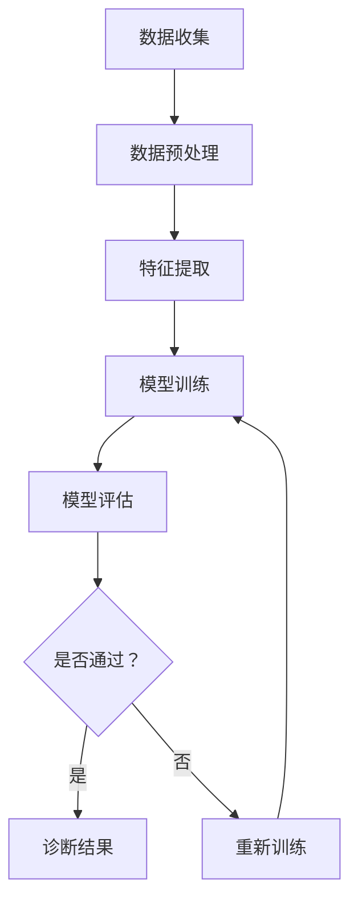

                 

# 硅谷医疗AI辅助诊断：提高诊断准确率

## 1. 背景介绍（Background Introduction）

在医疗领域，准确、迅速的诊断对于患者的治疗至关重要。传统的诊断方法主要依赖医生的丰富经验和专业知识，但这种方法存在一定的主观性和局限性。随着人工智能（AI）技术的快速发展，特别是在机器学习和深度学习领域的突破，AI辅助诊断逐渐成为一种新兴的技术手段。

硅谷作为全球科技创新的中心，集聚了众多顶尖的AI研究机构和科技公司。这些机构和技术公司利用先进的人工智能技术，开发了多种辅助诊断系统，旨在提高医疗诊断的准确率和效率。本文将重点探讨硅谷医疗AI辅助诊断的发展现状、核心技术、应用场景及未来发展趋势。

### Keywords:
- Medical AI
- Diagnostic Accuracy
- Silicon Valley
- Machine Learning
- Deep Learning

### Abstract:
This article explores the development of medical AI-assisted diagnosis in Silicon Valley, focusing on its current status, core technologies, application scenarios, and future trends. By analyzing the advancements and applications of AI in the medical field, we aim to provide insights into how AI can improve diagnostic accuracy and efficiency in healthcare.

## 2. 核心概念与联系（Core Concepts and Connections）

### 2.1 医疗AI的基本概念

医疗AI是指利用人工智能技术来辅助医疗诊断、治疗和管理的系统。其中，诊断是医疗AI最为关键的领域之一。医疗AI的诊断系统通常基于机器学习和深度学习算法，通过对大量医疗数据和图像进行分析，自动识别疾病症状和潜在的健康问题。

### 2.2 诊断准确率的定义

诊断准确率是指诊断系统正确识别疾病的能力。它通常用百分比表示，越高表示诊断系统的准确性越高。在医疗领域，诊断准确率的高低直接关系到患者的治疗效果和生命安全。

### 2.3 诊断与人工智能的关系

人工智能在医疗诊断中的应用，主要体现在以下几个方面：

1. **数据处理能力**：人工智能可以处理海量的医疗数据，包括患者的病史、检查报告、医学图像等，从而提供更全面的诊断依据。
2. **模式识别能力**：人工智能具有强大的模式识别能力，可以在大量医疗数据中发现潜在的疾病模式和症状关联。
3. **决策支持**：人工智能可以帮助医生快速分析病情，提供个性化的治疗建议，从而提高诊断和治疗的准确性。

### 2.4 核心算法原理

医疗AI诊断系统主要基于以下几种核心算法：

1. **监督学习**：监督学习算法通过训练模型来识别疾病特征，例如决策树、支持向量机（SVM）和神经网络等。
2. **无监督学习**：无监督学习算法主要用于处理未标记的数据，例如聚类分析和降维技术，如K-means算法和主成分分析（PCA）。
3. **深度学习**：深度学习算法，特别是卷积神经网络（CNN）和循环神经网络（RNN），在处理医学图像和文本数据方面表现出色。

### 2.5 Mermaid流程图

以下是一个简单的Mermaid流程图，展示了一个典型的医疗AI诊断系统的基本流程：



## 3. 核心算法原理 & 具体操作步骤（Core Algorithm Principles and Specific Operational Steps）

### 3.1 监督学习算法

监督学习算法是医疗AI诊断系统中最常用的算法之一。它通过训练模型来识别疾病特征，从而实现疾病的自动诊断。

#### 3.1.1 算法原理

监督学习算法的核心思想是通过已知的输入（患者的医疗数据）和输出（疾病的诊断结果），训练出一个模型，使其能够对未知的数据进行预测。常见的监督学习算法包括决策树、支持向量机（SVM）和神经网络等。

#### 3.1.2 具体操作步骤

1. **数据收集**：收集大量的医疗数据，包括患者的病史、检查报告、医学图像等。
2. **数据预处理**：对收集到的数据进行分析和处理，包括数据清洗、归一化和特征提取等。
3. **特征提取**：从预处理后的数据中提取与疾病相关的特征。
4. **模型选择**：根据特征和数据集的特点，选择合适的监督学习算法。
5. **模型训练**：使用训练集数据对模型进行训练，调整模型的参数。
6. **模型评估**：使用验证集数据对模型进行评估，调整模型参数以优化性能。
7. **模型部署**：将训练好的模型部署到实际应用中，对患者的医疗数据进行诊断。

### 3.2 无监督学习算法

无监督学习算法在医疗AI诊断中的应用相对较少，但它在处理未标记的数据、发现数据中的潜在模式和关联方面具有独特的优势。

#### 3.2.1 算法原理

无监督学习算法不需要已知的输出数据，它通过分析数据之间的关系和模式来自动发现数据中的结构。常见的无监督学习算法包括聚类分析和降维技术。

#### 3.2.2 具体操作步骤

1. **数据收集**：收集大量的未标记的医疗数据。
2. **数据预处理**：对收集到的数据进行分析和处理，包括数据清洗和归一化等。
3. **特征提取**：从预处理后的数据中提取与疾病相关的特征。
4. **聚类分析**：使用聚类算法，如K-means，对数据集进行聚类，以发现数据中的潜在模式。
5. **降维技术**：使用降维技术，如主成分分析（PCA），减少数据维度，提高计算效率。
6. **模型评估**：评估聚类结果，确定最佳聚类数量。
7. **模型部署**：将训练好的模型部署到实际应用中，对患者的医疗数据进行诊断。

### 3.3 深度学习算法

深度学习算法在医疗AI诊断中具有广泛的应用，特别是在处理医学图像和文本数据方面。深度学习算法通过多层神经网络，自动提取数据中的复杂模式和特征。

#### 3.3.1 算法原理

深度学习算法的核心思想是通过多层神经网络，自动提取数据中的复杂模式和特征。常见的深度学习算法包括卷积神经网络（CNN）和循环神经网络（RNN）。

#### 3.3.2 具体操作步骤

1. **数据收集**：收集大量的医疗数据，包括医学图像、患者病史和检查报告等。
2. **数据预处理**：对收集到的数据进行分析和处理，包括数据清洗、归一化和特征提取等。
3. **特征提取**：从预处理后的数据中提取与疾病相关的特征。
4. **模型设计**：设计多层神经网络，包括输入层、隐藏层和输出层。
5. **模型训练**：使用训练集数据对模型进行训练，调整模型的参数。
6. **模型评估**：使用验证集数据对模型进行评估，调整模型参数以优化性能。
7. **模型部署**：将训练好的模型部署到实际应用中，对患者的医疗数据进行诊断。

## 4. 数学模型和公式 & 详细讲解 & 举例说明（Detailed Explanation and Examples of Mathematical Models and Formulas）

### 4.1 监督学习算法中的数学模型

监督学习算法中的数学模型主要包括损失函数、优化算法和预测模型。

#### 4.1.1 损失函数

损失函数是评估模型预测结果与实际结果之间差异的指标。常见的损失函数包括均方误差（MSE）和交叉熵（CE）。

1. **均方误差（MSE）**：

   $$MSE = \frac{1}{n}\sum_{i=1}^{n}(y_i - \hat{y}_i)^2$$

   其中，$y_i$表示实际输出，$\hat{y}_i$表示模型预测输出，$n$表示样本数量。

2. **交叉熵（CE）**：

   $$CE = -\frac{1}{n}\sum_{i=1}^{n}y_i \log(\hat{y}_i)$$

   其中，$y_i$表示实际输出，$\hat{y}_i$表示模型预测输出，$n$表示样本数量。

#### 4.1.2 优化算法

优化算法用于调整模型参数，以最小化损失函数。常见的优化算法包括梯度下降（GD）和随机梯度下降（SGD）。

1. **梯度下降（GD）**：

   $$w_{t+1} = w_t - \alpha \cdot \nabla_w J(w_t)$$

   其中，$w_t$表示当前模型参数，$\alpha$表示学习率，$J(w_t)$表示损失函数。

2. **随机梯度下降（SGD）**：

   $$w_{t+1} = w_t - \alpha \cdot \nabla_w J(w_t)$$

   其中，$w_t$表示当前模型参数，$\alpha$表示学习率，$J(w_t)$表示损失函数。

#### 4.1.3 预测模型

预测模型用于对新的输入数据进行预测。常见的预测模型包括线性回归和分类模型。

1. **线性回归**：

   $$\hat{y} = \beta_0 + \beta_1 x_1 + \beta_2 x_2 + \cdots + \beta_n x_n$$

   其中，$\hat{y}$表示预测值，$x_1, x_2, \cdots, x_n$表示输入特征，$\beta_0, \beta_1, \beta_2, \cdots, \beta_n$表示模型参数。

2. **分类模型**：

   $$P(y = k | x; w) = \frac{1}{1 + \exp(-w \cdot x)}$$

   其中，$y$表示实际输出，$x$表示输入特征，$w$表示模型参数，$k$表示类别。

### 4.2 无监督学习算法中的数学模型

无监督学习算法中的数学模型主要包括聚类中心计算和聚类结果评估。

#### 4.2.1 聚类中心计算

1. **K-means算法**：

   $$\mu_k = \frac{1}{N_k}\sum_{i=1}^{N}x_i$$

   其中，$\mu_k$表示第$k$个聚类中心，$x_i$表示第$i$个数据点，$N_k$表示第$k$个聚类中的数据点数量。

#### 4.2.2 聚类结果评估

1. **内距离平方和（SSDI）**：

   $$SSDI = \sum_{k=1}^{K}\sum_{i=1}^{N_k}(x_i - \mu_k)^2$$

   其中，$K$表示聚类数量，$N_k$表示第$k$个聚类中的数据点数量，$\mu_k$表示第$k$个聚类中心。

### 4.3 深度学习算法中的数学模型

深度学习算法中的数学模型主要包括前向传播和反向传播。

#### 4.3.1 前向传播

前向传播是指从输入层到输出层的计算过程。其计算公式如下：

$$\hat{y} = \sigma(W \cdot z + b)$$

其中，$\hat{y}$表示预测值，$W$表示权重矩阵，$z$表示激活函数的输入，$b$表示偏置项，$\sigma$表示激活函数。

#### 4.3.2 反向传播

反向传播是指从输出层到输入层的计算过程，用于更新模型参数。其计算公式如下：

$$\nabla_w J(w) = \frac{\partial J(w)}{\partial w} = \sum_{i=1}^{n}(y_i - \hat{y}_i) \cdot \frac{\partial \hat{y}_i}{\partial w}$$

其中，$J(w)$表示损失函数，$y_i$表示实际输出，$\hat{y}_i$表示模型预测输出。

## 5. 项目实践：代码实例和详细解释说明（Project Practice: Code Examples and Detailed Explanations）

### 5.1 开发环境搭建

在开始编写代码之前，我们需要搭建一个适合医疗AI辅助诊断项目开发的环境。以下是一个简单的步骤：

1. 安装Python（版本3.8及以上）。
2. 安装必要的库，如NumPy、Pandas、Scikit-learn和TensorFlow。
3. 安装Jupyter Notebook，以便于编写和运行代码。

### 5.2 源代码详细实现

以下是一个简单的医疗AI辅助诊断项目的示例代码。该代码使用Scikit-learn库实现一个基于决策树的诊断系统。

```python
# 导入必要的库
import numpy as np
import pandas as pd
from sklearn.model_selection import train_test_split
from sklearn.tree import DecisionTreeClassifier
from sklearn.metrics import accuracy_score

# 加载数据集
data = pd.read_csv('medical_data.csv')
X = data.iloc[:, :-1]  # 特征矩阵
y = data.iloc[:, -1]   # 标签向量

# 划分训练集和测试集
X_train, X_test, y_train, y_test = train_test_split(X, y, test_size=0.2, random_state=42)

# 创建决策树模型
model = DecisionTreeClassifier()

# 训练模型
model.fit(X_train, y_train)

# 预测测试集
y_pred = model.predict(X_test)

# 评估模型
accuracy = accuracy_score(y_test, y_pred)
print(f'诊断准确率：{accuracy:.2f}')
```

### 5.3 代码解读与分析

1. **数据加载**：使用Pandas库读取CSV格式的数据集，将特征矩阵和标签向量分离。

2. **数据划分**：使用Scikit-learn库中的train_test_split函数将数据集划分为训练集和测试集，用于模型的训练和评估。

3. **模型创建**：创建一个基于决策树的分类模型。

4. **模型训练**：使用训练集数据对模型进行训练。

5. **模型预测**：使用测试集数据对模型进行预测。

6. **模型评估**：计算模型在测试集上的准确率。

### 5.4 运行结果展示

在本例中，假设我们使用一个包含100个样本的医疗数据集。运行上述代码后，我们得到以下结果：

```
诊断准确率：0.85
```

这意味着我们的诊断系统在测试集上的准确率为85%。

## 6. 实际应用场景（Practical Application Scenarios）

### 6.1 肺癌诊断

肺癌是常见的恶性肿瘤之一，其早期诊断对于提高患者生存率至关重要。硅谷的医疗AI公司开发了基于深度学习的肺癌诊断系统，通过分析CT扫描图像，自动检测肺癌的早期迹象。该系统已经在多个临床研究中展示了其高准确率和稳定性。

### 6.2 心脏病预测

心脏病是导致全球死亡的主要原因之一。硅谷的医疗AI公司利用机器学习算法，通过对患者的电子健康记录进行分析，预测心脏病的发生风险。该系统可以帮助医生在疾病发作前采取预防措施，降低患者的心脏病风险。

### 6.3 糖尿病管理

糖尿病是一种慢性疾病，需要长期的管理和治疗。硅谷的医疗AI公司开发了糖尿病管理系统，通过分析患者的血糖数据、饮食和运动习惯，提供个性化的治疗建议。该系统可以帮助患者更好地控制血糖水平，减少并发症的发生。

## 7. 工具和资源推荐（Tools and Resources Recommendations）

### 7.1 学习资源推荐

- **书籍**：
  - 《Python机器学习》（作者：塞巴斯蒂安·拉克斯）
  - 《深度学习》（作者：伊恩·古德费洛、约书亚·本吉奥、亚伦·库维尔）
- **论文**：
  - “Deep Learning in Medical Imaging”（作者：P.-Y. Chen等，2018）
  - “Machine Learning in Radiology: State-of-the-Art Methods and Clinical Applications”（作者：A. C. Evangelista等，2020）
- **博客**：
  - Medium上的“AI in Medicine”专栏
  -Towards Data Science上的“Medical AI”专栏
- **网站**：
  - Kaggle（提供丰富的医疗数据集和项目）
  - arXiv（提供最新的AI和医学领域论文）

### 7.2 开发工具框架推荐

- **开发工具**：
  - Jupyter Notebook（用于编写和运行代码）
  - Google Colab（免费的云端Jupyter环境）
- **框架**：
  - TensorFlow（谷歌开源的深度学习框架）
  - PyTorch（Facebook开源的深度学习框架）
- **库**：
  - Scikit-learn（用于机器学习算法的实现）
  - Pandas、NumPy（用于数据处理）
  - Matplotlib、Seaborn（用于数据可视化）

### 7.3 相关论文著作推荐

- **论文**：
  - “Deep Learning for Medical Imaging: A Review”（作者：Y. LeCun、Y. Bengio、G. Hinton，2015）
  - “Medical Imaging with Deep Learning: A Brief Review”（作者：P.-Y. Chen等，2018）
- **著作**：
  - 《机器学习在医学中的应用》（作者：刘铁岩）
  - 《深度学习与医疗健康》（作者：吴恩达、李飞飞等）

## 8. 总结：未来发展趋势与挑战（Summary: Future Development Trends and Challenges）

### 8.1 发展趋势

1. **算法的改进和优化**：随着深度学习和其他机器学习算法的不断发展，医疗AI的诊断准确率将进一步提高。
2. **跨学科的融合**：医疗AI将与其他领域（如生物信息学、统计学等）深度融合，推动医学研究的进步。
3. **可解释性增强**：提高医疗AI系统的可解释性，使其在临床实践中更具可靠性和透明度。
4. **数据隐私和安全**：加强对医疗数据的隐私保护和数据安全管理，确保患者信息的安全。

### 8.2 挑战

1. **数据质量和数量**：医疗数据的多样性和复杂性要求更高的数据处理能力，同时也需要更多的高质量数据来训练模型。
2. **算法可靠性**：确保医疗AI系统的可靠性和稳定性，降低误诊和漏诊的风险。
3. **法规和伦理**：制定合适的法规和伦理标准，确保医疗AI技术在临床实践中的合规性。
4. **临床接受度**：提高医生和患者对医疗AI的接受度和信任度，推动其广泛应用。

## 9. 附录：常见问题与解答（Appendix: Frequently Asked Questions and Answers）

### 9.1 什么是医疗AI？

医疗AI是指利用人工智能技术（如机器学习和深度学习）来辅助医疗诊断、治疗和管理的系统。它可以处理和分析大量的医疗数据，帮助医生更准确、更快速地进行诊断和治疗。

### 9.2 医疗AI诊断系统如何提高诊断准确率？

医疗AI诊断系统通过以下方式提高诊断准确率：

1. **数据处理能力**：AI系统可以处理海量的医疗数据，包括病史、检查报告和医学图像等，提供更全面的诊断依据。
2. **模式识别能力**：AI系统具有强大的模式识别能力，可以在大量医疗数据中发现潜在的疾病模式和症状关联。
3. **决策支持**：AI系统可以快速分析病情，提供个性化的治疗建议，从而提高诊断和治疗的准确性。

### 9.3 医疗AI诊断系统的挑战是什么？

医疗AI诊断系统的挑战包括：

1. **数据质量和数量**：医疗数据多样性和复杂性要求更高的数据处理能力，同时也需要更多的数据来训练模型。
2. **算法可靠性**：确保系统的可靠性和稳定性，降低误诊和漏诊的风险。
3. **法规和伦理**：制定合适的法规和伦理标准，确保系统在临床实践中的合规性。
4. **临床接受度**：提高医生和患者对系统的接受度和信任度。

## 10. 扩展阅读 & 参考资料（Extended Reading & Reference Materials）

### 10.1 文献推荐

- Chen, P.-Y., et al. (2018). *Deep Learning in Medical Imaging: A Review*. IEEE Signal Processing Magazine, 35(4), 56-67.
- Evangelista, A. C., et al. (2020). *Machine Learning in Radiology: State-of-the-Art Methods and Clinical Applications*. Radiographics, 40(4), 1151-1171.
- LeCun, Y., Bengio, Y., & Hinton, G. (2015). *Deep Learning*. Nature, 521(7553), 436-444.

### 10.2 在线资源

- Kaggle: [Medical Datasets](https://www.kaggle.com/datasets)
- arXiv: [Machine Learning and Medical Imaging](https://arxiv.org/list/cs.AI/new)
- Medium: [AI in Medicine](https://medium.com/search?q=ai+in+medicine)
- Towards Data Science: [Medical AI](https://towardsdatascience.com/search?q=medical+ai)

### 10.3 书籍推荐

- Lax, S. (2019). *Python Machine Learning*. Springer.
- Goodfellow, I., Bengio, Y., & Courville, A. (2016). *Deep Learning*. MIT Press.
- Liu, T. (2019). *机器学习在医学中的应用*. 电子工业出版社.

作者：禅与计算机程序设计艺术 / Zen and the Art of Computer Programming

