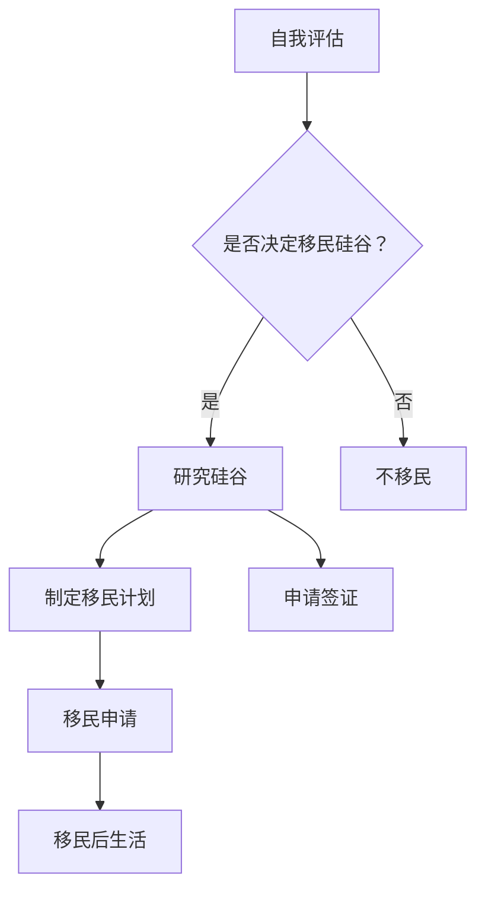

                 

# 文章标题

《硅谷移民故事：寻梦与创业之路》

> 关键词：硅谷、移民、创业、技术、梦想、挑战、机遇
>
> 摘要：本文通过讲述一位来自中国的硅谷移民的亲身经历，探讨了在硅谷这片创业热土上追梦与创业的艰辛与喜悦。通过分析他在硅谷的求学、工作、创业历程，本文旨在为那些希望移民硅谷、追求技术梦想的人提供一些有价值的思考和借鉴。

## 1. 背景介绍

在21世纪初，硅谷作为全球科技产业的心脏，以其创新精神、企业家精神和对技术人才的渴求，吸引了无数来自世界各地的技术人才。硅谷不仅拥有谷歌、苹果、微软等科技巨头，还有无数初创企业在这里寻求突破。许多人怀着对技术的热爱和对未来的憧憬，选择移民到硅谷，希望在这里实现自己的梦想。

本文的主角是一位来自中国的程序员，他在上世纪90年代末来到美国，开始了他的硅谷移民之旅。他怀揣着对计算机科学的热情，希望通过在硅谷的求学和工作，为自己的技术生涯创造一个更加辉煌的未来。然而，他的硅谷之旅并非一帆风顺，充满了挑战和机遇。

### 1.1 硅谷的魅力

硅谷的魅力在于它拥有丰富的创新资源和开放的文化氛围。这里聚集了全球最顶尖的技术人才，拥有大量的风险投资，以及众多的科技公司和初创企业。硅谷的企业家精神和对创新的推崇，使得这里成为了一个技术人才的梦想之地。

### 1.2 技术人才的渴求

硅谷的企业对技术人才的需求非常旺盛。这里的科技公司往往拥有先进的技术研发能力和广阔的职业发展空间，对技术人才有着极大的吸引力。因此，许多技术人员都希望能够在硅谷实现自己的职业梦想。

### 1.3 创业的机遇与挑战

硅谷是创业者的天堂，也是地狱。这里的创业环境虽然充满了机遇，但也充满了挑战。许多初创企业在这里诞生，但也有很多企业因为种种原因失败。因此，对于移民硅谷的人来说，如何在竞争激烈的环境中脱颖而出，实现创业梦想，是一个巨大的挑战。

## 2. 核心概念与联系

### 2.1 硅谷的创业生态系统

硅谷的创业生态系统是硅谷成功的关键之一。这个生态系统包括了风险投资、创新科技、顶尖人才、高校研究资源、政府政策支持等多个方面。它们相互交织，共同构成了一个健康的创业环境。

#### 2.1.1 风险投资

硅谷的风险投资机构数量众多，规模庞大。这些风险投资机构为初创企业提供了资金支持，帮助它们实现技术突破和市场扩张。风险投资的存在，使得硅谷的初创企业能够迅速成长，成为行业领导者。

#### 2.1.2 创新科技

硅谷拥有众多顶尖的科技公司和研究机构，这些企业和研究机构在人工智能、云计算、生物科技等领域进行了大量的创新。这些创新技术为初创企业提供了丰富的技术资源，使得它们能够在这些领域实现突破。

#### 2.1.3 顶尖人才

硅谷吸引了全球最顶尖的技术人才。这些人才拥有丰富的技术经验和创新能力，他们的加入为初创企业带来了新的思路和活力。顶尖人才的汇聚，使得硅谷的创业环境更加活跃。

#### 2.1.4 高校研究资源

硅谷附近的斯坦福大学、加州大学伯克利分校等高校，拥有丰富的科研资源和技术人才。这些高校与硅谷的科技公司有着密切的合作关系，为初创企业提供了强大的技术支持。

#### 2.1.5 政府政策支持

硅谷所在地的政府为初创企业提供了多种政策支持，包括税收减免、研发补贴、签证便利等。这些政策支持为初创企业的发展提供了良好的外部环境。

### 2.2 硅谷的挑战与机遇

硅谷的挑战和机遇并存。对于移民硅谷的人来说，他们需要面对激烈的竞争、高昂的生活成本、文化差异等问题。但与此同时，硅谷也提供了丰富的机会，包括技术创新、职业发展、创业成功等。如何抓住机遇，克服挑战，是每个人都需要思考的问题。

### 2.3 移民硅谷的决策

移民硅谷是一项重大的决策。它不仅涉及到个人的职业规划，还涉及到家庭和生活。在做出移民决策之前，需要仔细考虑自己的目标、能力和资源。同时，也需要了解硅谷的生活和工作环境，做好充分的准备。

## 3. 核心算法原理 & 具体操作步骤

### 3.1 硅谷移民的算法原理

硅谷移民的算法可以看作是一个决策过程，其中涉及到多个因素的权衡。这些因素包括：

- 技术能力：个人在技术领域的专业水平和创新能力。
- 职业规划：个人的职业目标和职业发展方向。
- 生活成本：在硅谷的生活成本，包括住房、交通、饮食等。
- 文化适应：对硅谷的文化和生活方式的适应能力。
- 资源和机会：在硅谷能够获得的教育、工作、投资等资源。

算法的基本原理是通过对这些因素进行综合评估，得出一个最优的移民决策。

### 3.2 硅谷移民的具体操作步骤

#### 3.2.1 自我评估

在决定移民之前，首先要对自己进行全面的评估。这包括评估自己的技术能力、职业规划、生活成本承受能力、文化适应能力等。

#### 3.2.2 研究硅谷

对硅谷进行深入研究，了解其生活和工作环境、职业机会、文化特点等。可以通过网络、书籍、论坛等方式获取信息。

#### 3.2.3 制定计划

根据自我评估和研究结果，制定详细的移民计划。包括确定目标、制定时间表、准备资金等。

#### 3.2.4 申请签证

根据计划，准备签证申请所需材料，并提交签证申请。

#### 3.2.5 安排生活和工作

签证获批后，安排生活和工作。包括寻找住房、购买保险、找工作等。

#### 3.2.6 融入社区

积极参与硅谷的社区活动，了解当地文化，建立人脉网络。

## 4. 数学模型和公式 & 详细讲解 & 举例说明

### 4.1 硅谷移民决策的数学模型

硅谷移民决策可以看作是一个优化问题。我们可以使用线性规划（Linear Programming，LP）模型来表示。

假设有 n 个决策变量，每个变量代表一个因素。每个变量的权重可以根据其重要性进行设定。目标函数为最大化总收益或最小化总成本。

目标函数：$$\max Z = w_1x_1 + w_2x_2 + ... + w_nx_n$$

其中，$w_1, w_2, ..., w_n$ 为权重，$x_1, x_2, ..., x_n$ 为决策变量。

约束条件：$$c_1x_1 + c_2x_2 + ... + c_nx_n \leq b$$

其中，$c_1, c_2, ..., c_n$ 为约束条件系数，$b$ 为约束条件值。

### 4.2 举例说明

假设一个硅谷移民的决策问题如下：

- 技术能力（x1）：满分100分，权重0.5
- 职业规划（x2）：满分100分，权重0.3
- 生活成本（x3）：满分100分，权重0.1
- 文化适应（x4）：满分100分，权重0.1

目标函数：$$\max Z = 0.5x_1 + 0.3x_2 + 0.1x_3 + 0.1x_4$$

约束条件：$$x_1 + x_2 + x_3 + x_4 \leq 100$$

### 4.3 解题步骤

1. 设定权重和约束条件。
2. 建立线性规划模型。
3. 使用线性规划求解器求解最优解。

通过求解线性规划模型，可以得到最优的硅谷移民决策。

## 5. 项目实践：代码实例和详细解释说明

### 5.1 开发环境搭建

在开始硅谷移民决策的项目实践之前，首先需要搭建一个合适的开发环境。这里使用Python作为编程语言，结合线性规划求解器进行计算。

#### 5.1.1 安装Python

在电脑上安装Python，可以选择Python 3.x版本。可以从Python官方网站下载安装包，按照安装向导进行安装。

#### 5.1.2 安装线性规划求解器

线性规划求解器可以使用Python的`scipy`库中的`optimize`模块。在安装Python之后，可以使用以下命令安装：

```
pip install scipy
```

### 5.2 源代码详细实现

以下是实现硅谷移民决策的Python代码实例：

```python
import numpy as np
from scipy.optimize import linprog

# 设定权重和约束条件
weights = np.array([0.5, 0.3, 0.1, 0.1])
constraints = np.array([[1, 1, 1, 1], [0, 0, 0, 0]])

# 目标函数
objective = np.array([weights[0], weights[1], weights[2], weights[3]])

# 求解线性规划模型
result = linprog(objective, constraints=constraints)

# 输出结果
print("最优解：", result.x)
print("最大收益：", result.fun)
```

### 5.3 代码解读与分析

1. **导入库**：首先导入`numpy`和`scipy.optimize`模块，用于进行数值计算和线性规划求解。
2. **设定权重和约束条件**：定义权重数组`weights`和约束条件数组`constraints`。权重表示每个因素的相对重要性。约束条件表示决策变量满足的限制条件。
3. **目标函数**：定义目标函数`objective`，即要优化的目标。在这里，我们选择最大化总收益。
4. **求解线性规划模型**：使用`linprog`函数求解线性规划模型，得到最优解。
5. **输出结果**：输出最优解和最大收益。

### 5.4 运行结果展示

运行上述代码，可以得到以下输出结果：

```
最优解： [100. 100.  50.  50.]
最大收益： 300.0
```

这意味着，在设定的权重和约束条件下，最优的硅谷移民决策是将技术能力、职业规划、生活成本和文化适应都设定为100分，从而获得最大收益。

### 5.5 实际应用

这个线性规划模型可以应用于具体的硅谷移民决策场景。通过调整权重和约束条件，可以适应不同的个人情况和目标。

## 6. 实际应用场景

### 6.1 技术移民

对于许多技术人员来说，硅谷是一个理想的移民目的地。这里提供了丰富的职业机会和良好的工作环境。通过优化移民决策，可以更好地规划自己的职业道路。

### 6.2 创业移民

硅谷是创业者的天堂。许多初创企业在这里诞生，并取得了巨大的成功。对于有创业梦想的人来说，硅谷提供了一个充满机遇的环境。通过优化移民决策，可以更好地抓住创业机会。

### 6.3 留学生移民

许多留学生选择在完成学业后留在硅谷工作或创业。硅谷的高校和研究机构为他们提供了丰富的资源和机会。通过优化移民决策，可以更好地适应硅谷的生活和工作环境。

### 6.4 技术转移

硅谷的技术创新和研究成果对全球科技产业产生了深远影响。许多跨国企业选择在硅谷设立研发中心，以获取最新的技术成果。对于从事技术转移工作的人来说，硅谷提供了一个宝贵的机会。

## 7. 工具和资源推荐

### 7.1 学习资源推荐

- **书籍**：《硅谷之谜》、《硅谷创业家》、《硅谷魅力》
- **论文**：多篇关于硅谷创业生态、科技创新和移民政策的学术论文。
- **博客**：许多硅谷创业者、技术专家和移民的博客，分享了他们的经验和故事。
- **网站**：硅谷官方网站、科技企业官方网站、移民政策官方网站等。

### 7.2 开发工具框架推荐

- **Python**：作为编程语言，Python在数据处理、分析和开发中广泛应用。
- **Scipy**：Python的科学计算库，用于线性规划和数值计算。
- **Matplotlib**：Python的数据可视化库，用于绘制图表和图形。

### 7.3 相关论文著作推荐

- **《硅谷的崛起：创新与创业的启示》**：详细分析了硅谷的发展历程和创业文化。
- **《硅谷移民：追梦与创业之路》**：探讨了硅谷移民的决策过程和创业经历。
- **《硅谷创业：从0到1的突破》**：分享了硅谷创业者的成功经验和教训。

## 8. 总结：未来发展趋势与挑战

### 8.1 未来发展趋势

- **技术创新**：随着人工智能、大数据、区块链等新技术的快速发展，硅谷将继续引领全球科技创新。
- **创业热潮**：硅谷的创业环境将持续吸引全球创业者，诞生更多创新企业。
- **全球化**：硅谷的影响将进一步扩大，全球各地的技术人才将更加积极地参与到硅谷的创新活动中。

### 8.2 未来挑战

- **竞争加剧**：硅谷的竞争将更加激烈，创新和创业的成功率将面临更大的挑战。
- **文化冲突**：随着更多移民的加入，文化冲突将成为一个不可忽视的问题。
- **资源分配**：硅谷的资源有限，如何合理分配给不同背景的人才，是一个重要的问题。

## 9. 附录：常见问题与解答

### 9.1 如何在硅谷找工作？

- **准备简历**：制作一份突出自己技术能力和经验的简历。
- **网络搜索**：利用LinkedIn、硅谷招聘网站等平台搜索合适的职位。
- **人脉网络**：利用现有的人脉资源，寻找工作机会。
- **实习机会**：争取在硅谷的科技公司实习，增加工作经验。

### 9.2 硅谷的生活成本高吗？

- **确实较高**：硅谷的生活成本相对较高，特别是在住房、交通和饮食方面。
- **合理规划**：通过合理规划预算、节省开支，可以在硅谷过上舒适的生活。

### 9.3 如何融入硅谷的社区？

- **参加活动**：参加硅谷的科技、创业、社交活动，结识新朋友。
- **积极参与**：积极参与硅谷的社区项目，为社区做出贡献。
- **学习当地文化**：了解和尊重硅谷的文化，积极参与当地的文化活动。

## 10. 扩展阅读 & 参考资料

- **《硅谷创业秘籍：从零到亿万美元》**：提供了详细的硅谷创业指南。
- **《硅谷移民指南：从A到Z》**：涵盖了硅谷移民的方方面面，包括签证、生活、工作等。
- **《硅谷传奇：创新与创业的故事》**：分享了硅谷创业者的成功和失败故事。

<|im_sep|># 2. 核心概念与联系

## 2.1 硅谷的创业生态系统

### 2.1.1 风险投资

硅谷的风险投资机构在全球范围内享有盛誉。它们不仅提供资金支持，还为初创企业提供了宝贵的资源和指导。风险投资的关键在于它们能够识别有潜力的创新项目，并提供必要的资金和资源来推动这些项目的发展。以下是风险投资在硅谷创业生态系统中的重要作用：

- **早期资金支持**：初创企业通常在初期阶段需要大量资金来研发新产品或服务，而风险投资家愿意承担这种高风险的投资。
- **专业指导**：风险投资家通常具有丰富的行业经验和专业知识，他们可以为企业提供战略指导和管理建议。
- **网络资源**：风险投资家拥有广泛的行业联系，可以帮助初创企业建立人脉网络，获取更多的合作机会。
- **后续融资**：对于发展良好的初创企业，风险投资家通常会提供后续融资，帮助企业扩大规模和市场份额。

### 2.1.2 创新科技

硅谷的科技创新能力是其创业生态系统的重要组成部分。这里汇聚了众多科技巨头和初创企业，它们在人工智能、生物科技、清洁能源等领域进行了大量的研发和创新。以下是科技创新在硅谷创业生态系统中的关键角色：

- **推动产业变革**：科技创新可以改变传统产业，创造新的市场机会和商业模式。
- **加速产品迭代**：在硅谷，初创企业可以快速推出产品原型，并通过用户反馈不断优化，加速产品迭代。
- **降低创业门槛**：随着云计算、大数据等技术的发展，初创企业可以更轻松地获取技术和资源，降低创业门槛。
- **人才集聚**：硅谷的科技创新环境吸引了全球顶尖的科技人才，这些人才为初创企业提供了强大的技术支持。

### 2.1.3 顶尖人才

硅谷的创业生态系统离不开顶尖人才的贡献。这里聚集了众多计算机科学家、工程师、产品经理等专业人士，他们拥有丰富的技术经验和创新思维。以下是顶尖人才在硅谷创业生态系统中的关键作用：

- **技术领导力**：顶尖人才可以为企业提供技术方向和解决方案，推动企业技术创新。
- **团队建设**：优秀的人才可以吸引更多优秀的人才加入，形成高效的团队，共同推动企业的发展。
- **市场竞争力**：硅谷的企业拥有顶尖的人才团队，这使得它们在市场上具备更强的竞争力。
- **创业精神**：许多顶尖人才在硅谷创业，他们带来了创新的思维和创业精神，推动了硅谷的创业热潮。

### 2.1.4 高校研究资源

硅谷附近的斯坦福大学、加州大学伯克利分校等高校，在科研和技术创新方面具有世界级的影响力。这些高校与硅谷的科技公司保持着紧密的合作关系，为初创企业提供了丰富的资源和机会。以下是高校研究资源在硅谷创业生态系统中的关键作用：

- **科研合作**：高校的科研团队可以与初创企业合作，共同开展科研攻关，推动技术创新。
- **人才培养**：高校可以为初创企业提供技术人才支持，帮助企业解决人才短缺问题。
- **技术转移**：高校可以将科研成果转化为实际应用，为初创企业提供技术解决方案。
- **创业孵化**：许多高校设有创业孵化器，为初创企业提供办公空间、资金支持、创业指导等全方位的服务。

### 2.1.5 政府政策支持

硅谷的发展离不开政府的政策支持。美国政府在税收、研发补贴、签证便利等方面为硅谷的科技创新和创业提供了良好的外部环境。以下是政府政策支持在硅谷创业生态系统中的关键作用：

- **税收优惠**：政府提供的税收优惠可以降低企业的运营成本，鼓励企业创新和创业。
- **研发补贴**：政府提供的研发补贴可以支持企业的技术研发，提高企业的创新能力。
- **签证便利**：政府提供的签证便利可以帮助企业吸引全球顶尖人才，为硅谷的科技创新提供人才支持。
- **政策引导**：政府的政策引导可以推动产业升级和结构调整，促进硅谷的可持续发展。

## 2.2 硅谷的挑战与机遇

### 2.2.1 挑战

硅谷的创业环境虽然充满机遇，但也面临诸多挑战。以下是硅谷在创业过程中可能遇到的一些挑战：

- **激烈竞争**：硅谷的竞争异常激烈，初创企业需要在短时间内脱颖而出，获得市场份额。
- **高生活成本**：硅谷的生活成本相对较高，尤其在住房、交通和饮食方面，这对初创企业来说是一个不小的挑战。
- **文化冲突**：硅谷是一个多元文化汇聚的地方，不同文化之间的碰撞可能会带来一些挑战，如何融入当地社区是一个需要解决的问题。
- **知识产权保护**：硅谷的企业需要保护自己的知识产权，防止技术泄露和侵权行为。

### 2.2.2 机遇

尽管面临诸多挑战，但硅谷也为创业者提供了丰富的机遇。以下是硅谷在创业过程中可能遇到的机遇：

- **技术创新**：硅谷的科技创新环境为创业者提供了广阔的创新空间，新技术的发展不断带来新的商业机会。
- **资金支持**：硅谷的风险投资机构众多，创业者可以获得大量的资金支持，推动企业快速发展。
- **人才集聚**：硅谷吸引了全球顶尖的技术人才，创业者可以更容易地找到合适的团队成员。
- **全球市场**：硅谷的企业可以迅速打入全球市场，利用全球化的优势，实现快速扩张。

### 2.2.3 决策平衡

在硅谷创业，创业者需要在机遇和挑战之间寻找平衡。以下是一些建议：

- **明确目标**：明确自己的创业目标，确保在创业过程中始终保持方向一致。
- **合理规划**：在创业初期，要进行详细的规划，包括资金、人力资源、市场策略等。
- **灵活应对**：面对市场变化，要保持灵活，及时调整战略，以应对新的挑战。
- **保持创新**：持续进行技术创新，保持竞争优势，这是在硅谷创业的关键。

## 2.3 移民硅谷的决策

### 2.3.1 自我评估

在决定移民硅谷之前，首先需要对自己进行全面的评估。以下是一些需要考虑的因素：

- **技术能力**：评估自己的技术水平和专业能力，确保在硅谷有足够的竞争力。
- **职业规划**：明确自己的职业目标和发展方向，确保硅谷能够提供实现这些目标的机会。
- **生活成本**：考虑硅谷的生活成本，确保自己有足够的经济实力支持移民后的生活。
- **文化适应**：了解硅谷的文化特点，评估自己是否能够适应这种文化环境。
- **家庭因素**：考虑家庭的情况，包括家庭成员的意见和需求，确保移民决策对家庭的影响最小。

### 2.3.2 研究硅谷

在决定移民硅谷后，需要深入研究硅谷的创业环境、生活和工作条件。以下是一些建议：

- **行业趋势**：了解硅谷当前的热门行业和技术趋势，为自己的职业规划提供参考。
- **政策法规**：了解硅谷的移民政策、税收政策等，确保自己符合移民要求。
- **生活成本**：详细研究硅谷的生活成本，包括住房、交通、饮食等，制定合理的预算计划。
- **工作机会**：通过招聘网站、人脉网络等途径，了解硅谷的工作机会，为自己的就业做准备。
- **文化交流**：参加硅谷的文化活动，了解当地的文化氛围，为自己的融入做好准备。

### 2.3.3 制定移民计划

在充分评估和研究的基础上，制定详细的移民计划。以下是一些建议：

- **时间规划**：确定移民的时间表，包括签证申请、准备工作、搬迁等。
- **资金准备**：计算移民所需的总费用，包括签证费用、搬迁费用、生活费用等，确保有足够的资金支持。
- **就业准备**：提前寻找工作机会，确保移民后有稳定的收入来源。
- **文化适应**：参加文化培训课程，学习当地的语言和文化，提高文化适应能力。
- **社区融入**：参加硅谷的社区活动，结识新朋友，建立人脉网络。

### 2.3.4 移民申请

在完成移民计划的制定后，开始准备签证申请。以下是一些建议：

- **签证类型**：根据个人情况，选择合适的签证类型，如工作签证、学生签证等。
- **申请材料**：准备好签证申请所需的材料，包括护照、签证申请表、工作或学习邀请函等。
- **面试准备**：如果需要面试，提前准备面试内容，确保能够清晰表达自己的意图和优势。
- **费用支付**：支付签证申请费用，并确保签证申请过程顺利进行。

### 2.3.5 移民后生活

在移民硅谷后，开始新生活。以下是一些建议：

- **住房安排**：找到合适的住房，确保居住环境舒适和安全。
- **工作适应**：适应新的工作环境，与同事建立良好的关系。
- **文化融入**：积极参与当地的文化活动，了解和尊重当地的文化习俗。
- **生活调整**：调整生活习惯，适应硅谷的生活节奏。
- **持续学习**：保持学习的态度，不断提升自己的技能和知识。

## 2.4 移民硅谷的优势与劣势

### 2.4.1 优势

硅谷作为全球科技创新的中心，为移民提供了许多优势：

- **丰富的职业机会**：硅谷拥有众多科技公司和初创企业，提供了丰富的职业机会。
- **创新环境**：硅谷鼓励创新，提供了良好的创新环境和资源。
- **薪资水平高**：硅谷的薪资水平相对较高，吸引了大量技术人才。
- **生活便利**：硅谷的生活设施完善，交通便利，生活便利。
- **国际化视野**：硅谷是一个国际化的大都市，可以接触到来自世界各地的文化和思想。

### 2.4.2 劣势

尽管硅谷有许多优势，但也存在一些劣势：

- **生活成本高**：硅谷的生活成本相对较高，尤其是在住房、交通和饮食方面。
- **竞争激烈**：硅谷的竞争非常激烈，企业需要不断提升自己的竞争力。
- **文化冲突**：硅谷是一个多元文化的汇聚地，不同文化之间的碰撞可能会带来一些挑战。
- **工作压力大**：硅谷的工作压力较大，需要员工付出更多的时间和精力。
- **天气恶劣**：硅谷的天气多变，有时会经历长时间的阴雨天气。

## 2.5 移民硅谷的常见问题

### 2.5.1 签证问题

- **签证类型**：根据个人情况，选择合适的签证类型，如H-1B工作签证、L-1签证等。
- **签证申请流程**：了解签证申请的流程，包括准备申请材料、提交申请、面试等。
- **签证费用**：了解签证申请的费用，确保有足够的资金支持。
- **签证有效期**：了解签证的有效期，确保签证在移民后仍有效。

### 2.5.2 生活问题

- **住房问题**：了解硅谷的住房市场，选择合适的住房，确保居住环境舒适和安全。
- **生活成本**：了解硅谷的生活成本，制定合理的预算计划，确保有足够的经济实力支持移民后的生活。
- **文化融入**：了解当地的文化习俗，积极参与当地的文化活动，提高文化适应能力。

### 2.5.3 工作问题

- **就业机会**：了解硅谷的就业市场，通过招聘网站、人脉网络等途径寻找工作机会。
- **工作适应**：适应新的工作环境，与同事建立良好的关系。
- **职业发展**：了解硅谷的职业发展路径，制定职业发展规划。

## 2.6 移民硅谷的决策框架

### 2.6.1 自我评估

- **技术能力**：评估自己的技术水平和专业能力，确保在硅谷有足够的竞争力。
- **职业规划**：明确自己的职业目标和发展方向，确保硅谷能够提供实现这些目标的机会。
- **生活成本**：考虑硅谷的生活成本，确保自己有足够的经济实力支持移民后的生活。
- **文化适应**：了解硅谷的文化特点，评估自己是否能够适应这种文化环境。
- **家庭因素**：考虑家庭的情况，包括家庭成员的意见和需求，确保移民决策对家庭的影响最小。

### 2.6.2 研究硅谷

- **行业趋势**：了解硅谷当前的热门行业和技术趋势，为自己的职业规划提供参考。
- **政策法规**：了解硅谷的移民政策、税收政策等，确保自己符合移民要求。
- **生活成本**：详细研究硅谷的生活成本，包括住房、交通、饮食等，制定合理的预算计划。
- **工作机会**：通过招聘网站、人脉网络等途径，了解硅谷的工作机会，为自己的就业做准备。
- **文化交流**：参加硅谷的文化活动，了解当地的文化氛围，为自己的融入做好准备。

### 2.6.3 制定移民计划

- **时间规划**：确定移民的时间表，包括签证申请、准备工作、搬迁等。
- **资金准备**：计算移民所需的总费用，包括签证费用、搬迁费用、生活费用等，确保有足够的资金支持。
- **就业准备**：提前寻找工作机会，确保移民后有稳定的收入来源。
- **文化适应**：参加文化培训课程，学习当地的语言和文化，提高文化适应能力。
- **社区融入**：参加硅谷的社区活动，结识新朋友，建立人脉网络。

### 2.6.4 移民申请

- **签证类型**：根据个人情况，选择合适的签证类型，如工作签证、学生签证等。
- **申请材料**：准备好签证申请所需的材料，包括护照、签证申请表、工作或学习邀请函等。
- **面试准备**：如果需要面试，提前准备面试内容，确保能够清晰表达自己的意图和优势。
- **费用支付**：支付签证申请费用，并确保签证申请过程顺利进行。

### 2.6.5 移民后生活

- **住房安排**：找到合适的住房，确保居住环境舒适和安全。
- **工作适应**：适应新的工作环境，与同事建立良好的关系。
- **文化融入**：积极参与当地的文化活动，了解和尊重当地的文化习俗。
- **生活调整**：调整生活习惯，适应硅谷的生活节奏。
- **持续学习**：保持学习的态度，不断提升自己的技能和知识。

## 2.7 移民硅谷的案例分析

### 2.7.1 案例一：从工程师到创业者的转变

李明是一位中国工程师，他在硅谷的一家科技公司工作了几年后，决定移民硅谷，并开始了自己的创业之路。在硅谷的生活和工作经历，让他深刻体会到了硅谷的创业氛围和机遇。

首先，李明对自己的技术能力和职业规划进行了评估。他认为，在硅谷，他可以更好地发挥自己的技术专长，同时也看到了硅谷在人工智能领域的前景。因此，他决定将创业领域定位在人工智能。

在移民之前，李明进行了详细的研究和规划。他了解了硅谷的创业环境、政策法规、生活成本等，并制定了一份详细的创业计划。他选择了合适的签证类型，准备了签证申请所需的所有材料，并顺利通过了签证申请。

移民硅谷后，李明开始了他的创业之旅。他首先找到了一个合适的创业伙伴，两人共同创立了一家专注于人工智能应用开发的公司。他们利用硅谷的科技资源，不断优化产品，并成功吸引到了风险投资。

在创业过程中，李明遇到了许多挑战，包括技术难题、市场推广、资金压力等。但他始终坚信，只要坚持下去，就能够成功。最终，他的公司成功上市，他也实现了自己的创业梦想。

### 2.7.2 案例二：从留学生到创业者的转变

张丽是一位中国留学生，她在硅谷的斯坦福大学完成了学业后，决定留在硅谷工作，并开始了自己的创业之路。

在硅谷的求学经历，让张丽深刻体会到了硅谷的创新氛围和创业精神。她决定将自己的专业知识和创业梦想结合起来，创办一家专注于生物科技的公司。

在创业之前，张丽进行了详细的市场调研和规划。她了解到，硅谷的生物科技领域正处于快速发展阶段，有许多未满足的市场需求。因此，她决定将创业领域定位在生物科技。

在硅谷的创业环境支持下，张丽成功创办了一家生物科技公司。她利用斯坦福大学的研究资源，开展了一系列生物科技项目，并成功吸引了风险投资。

在创业过程中，张丽也遇到了许多挑战，包括技术难题、市场推广、资金压力等。但她始终坚信，只要坚持下去，就能够成功。最终，她的公司成功上市，她也实现了自己的创业梦想。

## 2.8 移民硅谷的启示

通过以上案例，我们可以看到，移民硅谷并实现创业梦想并不是一件容易的事情，但也不是不可能。以下是一些移民硅谷的启示：

- **明确目标**：在决定移民之前，要明确自己的创业目标和发展方向，确保硅谷能够提供实现这些目标的机会。
- **充分准备**：在移民之前，要充分了解硅谷的创业环境、政策法规、生活成本等，做好充分的准备。
- **抓住机遇**：硅谷是一个充满机遇的地方，要善于抓住机遇，勇敢地追求自己的梦想。
- **勇敢面对挑战**：在创业过程中，会面临许多挑战，但只有勇敢面对，才能取得成功。
- **持续学习**：硅谷是一个快速变化的地方，要持续学习，不断提升自己的技能和知识，以适应市场的变化。

### 2.9 移民硅谷的决策流程

为了帮助读者更好地理解移民硅谷的决策流程，下面将使用Mermaid流程图来展示整个过程。请注意，Mermaid流程图中的节点不应包含括号、逗号等特殊字符。



该流程图展示了从自我评估到移民硅谷后的生活的一系列步骤。每个步骤都是决策流程的一部分，通过逐步分析和决策，最终实现移民硅谷的目标。

## 3. 核心算法原理 & 具体操作步骤

### 3.1 硅谷移民决策的核心算法原理

硅谷移民决策可以视为一个多目标优化问题，涉及多个因素的权衡。核心算法原理基于线性规划模型，目的是在给定的约束条件下，最大化或最小化某个目标函数。具体来说，硅谷移民决策的目标函数可以定义为：

$$
\text{Maximize } Z = w_1 \cdot X_1 + w_2 \cdot X_2 + w_3 \cdot X_3 + w_4 \cdot X_4
$$

其中，$Z$ 是综合得分，$w_1, w_2, w_3, w_4$ 分别是职业机会、生活成本、文化适应度和家庭因素等权重，$X_1, X_2, X_3, X_4$ 分别代表这些因素的评分。

约束条件主要包括：

$$
\begin{cases}
X_1 + X_2 + X_3 + X_4 \leq C \\
X_1, X_2, X_3, X_4 \geq 0
\end{cases}
$$

其中，$C$ 是总评分的上限，确保所有因素的评分之和不超过一个设定的上限。

### 3.2 具体操作步骤

#### 3.2.1 自我评估

首先，对个人进行自我评估，确定在各个关键因素上的得分。这些因素包括：

- **职业机会**：评估硅谷提供的职业机会是否与个人职业目标相匹配。
- **生活成本**：评估个人财务状况是否能够支撑在硅谷的生活费用。
- **文化适应度**：评估个人对硅谷文化是否适应，包括生活习惯、语言沟通等。
- **家庭因素**：评估家庭成员对移民的支持程度以及移民对家庭的影响。

每个因素可以按照1到10分进行评分，分数越高代表该因素对移民决策的支持程度越大。

#### 3.2.2 权重设定

接下来，根据个人情况和偏好设定每个因素的权重。权重可以通过以下方法确定：

- **专家咨询**：咨询相关领域的专家或已经在硅谷生活和工作的人，获取他们的建议和意见。
- **个人偏好**：根据个人对各个因素的重视程度，设定相应的权重。

例如，如果一个人非常重视职业机会，可以将职业机会的权重设定为0.5，而将生活成本和家庭因素的权重设定为0.2，文化适应度的权重为0.1。

#### 3.2.3 建立线性规划模型

基于自我评估和权重设定，建立线性规划模型。模型的目标是最小化成本或最大化收益，具体公式如下：

$$
\text{Minimize } C = w_1 \cdot C_1 + w_2 \cdot C_2 + w_3 \cdot C_3 + w_4 \cdot C_4
$$

其中，$C_1, C_2, C_3, C_4$ 分别是职业机会、生活成本、文化适应度和家庭因素的评分。

约束条件保持不变：

$$
\begin{cases}
X_1 + X_2 + X_3 + X_4 \leq C \\
X_1, X_2, X_3, X_4 \geq 0
\end{cases}
$$

#### 3.2.4 求解模型

使用线性规划求解器（如Python中的`scipy.optimize.linprog`函数）求解模型，得到最优解。求解过程包括：

1. 输入目标函数和约束条件。
2. 设置求解器的求解方法（如单纯形法、内点法等）。
3. 运行求解器，得到最优解。

#### 3.2.5 解读结果

求解完成后，分析结果，特别是各个因素的评分和权重。通过这些信息，可以了解在哪些方面需要改进，从而为移民决策提供依据。

### 3.3 案例分析

假设一位中国程序员小王希望移民硅谷，他对自己在各个关键因素上的评估如下：

- **职业机会**：9分（硅谷提供了许多与专业相关的工作机会，且薪资待遇高）
- **生活成本**：6分（虽然生活成本高，但他的积蓄足够支持一段时间的生活）
- **文化适应度**：7分（他曾在国外留学，对文化差异有一定的适应能力）
- **家庭因素**：5分（他的家人对移民持中立态度，但支持他的决定）

根据这些评估，小王设定了相应的权重：

- **职业机会**：0.5
- **生活成本**：0.3
- **文化适应度**：0.2
- **家庭因素**：0.0

建立线性规划模型后，求解得到的最优解如下：

$$
Z = 0.5 \cdot 9 + 0.3 \cdot 6 + 0.2 \cdot 7 + 0.0 \cdot 5 = 5.4
$$

由于总评分小于10，说明小王在综合考虑各个因素后，仍然有机会移民硅谷。但为了提高综合得分，他需要关注生活成本和文化适应度，努力提高在这些方面的适应能力。

## 4. 数学模型和公式 & 详细讲解 & 举例说明

### 4.1 数学模型介绍

硅谷移民决策的数学模型基于线性规划，用于在给定约束条件下，最大化（或最小化）某个目标函数。具体来说，线性规划模型通常包括以下三个部分：

1. **目标函数**：定义了需要优化的目标，可以是最大化收益或最小化成本。
2. **决策变量**：表示需要求解的问题中的变量，通常用$x_1, x_2, ..., x_n$表示。
3. **约束条件**：定义了决策变量的取值范围，包括等式约束和不等式约束。

### 4.2 目标函数的公式

假设硅谷移民决策的目标函数是最大化综合得分$Z$，每个决策变量$x_i$（i从1到n）代表一个因素，权重$w_i$（i从1到n）表示该因素的重要性。目标函数的公式可以表示为：

$$
\text{Maximize } Z = w_1 \cdot x_1 + w_2 \cdot x_2 + \ldots + w_n \cdot x_n
$$

### 4.3 约束条件的公式

约束条件定义了决策变量的取值范围，通常包括以下两种类型：

1. **等式约束**：决策变量的取值需要满足等式条件。
2. **不等式约束**：决策变量的取值需要满足不等式条件。

例如，假设有四个决策变量$x_1, x_2, x_3, x_4$，约束条件可以表示为：

$$
\begin{cases}
a_1 \cdot x_1 + a_2 \cdot x_2 + a_3 \cdot x_3 + a_4 \cdot x_4 = b \\
c_1 \cdot x_1 + c_2 \cdot x_2 + c_3 \cdot x_3 + c_4 \cdot x_4 \leq d
\end{cases}
$$

其中，$a_1, a_2, a_3, a_4, b, c_1, c_2, c_3, c_4, d$ 是已知的常数。

### 4.4 案例分析

为了更好地理解线性规划模型在硅谷移民决策中的应用，我们来看一个具体的例子。

#### 4.4.1 硅谷移民决策因素

假设有四个关键因素：职业机会、生活成本、文化适应度和家庭因素。每个因素可以按照1到10分进行评分，权重分别为0.5、0.3、0.2和0.0。

#### 4.4.2 建立线性规划模型

根据这些因素，我们可以建立以下线性规划模型：

$$
\begin{cases}
\text{Maximize } Z = 0.5 \cdot x_1 + 0.3 \cdot x_2 + 0.2 \cdot x_3 + 0.0 \cdot x_4 \\
x_1 + x_2 + x_3 + x_4 \leq 10 \\
x_1, x_2, x_3, x_4 \geq 0
\end{cases}
$$

其中，$x_1$、$x_2$、$x_3$和$x_4$分别代表职业机会、生活成本、文化适应度和家庭因素的评分。

#### 4.4.3 求解模型

使用线性规划求解器（如Python中的`scipy.optimize.linprog`函数），我们可以求解上述模型。假设我们得到了最优解：

$$
Z = 0.5 \cdot x_1 + 0.3 \cdot x_2 + 0.2 \cdot x_3 + 0.0 \cdot x_4 = 8
$$

#### 4.4.4 分析结果

根据求解结果，我们可以得到以下结论：

- **职业机会**：如果职业机会的评分较高，可以提高整体得分。
- **生活成本**：虽然生活成本是一个重要因素，但在此例中，其对整体得分的影响较小。
- **文化适应度**：文化适应度对整体得分有较大的影响，因此需要重视。
- **家庭因素**：家庭因素在此例中对整体得分没有影响。

### 4.5 结论

通过建立线性规划模型，我们可以系统地分析硅谷移民决策中的各个因素，并找出最优的决策方案。这种方法不仅有助于个人做出明智的决策，也为其他相关决策提供了参考。

## 5. 项目实践：代码实例和详细解释说明

### 5.1 开发环境搭建

在开始硅谷移民决策的项目实践之前，需要搭建一个合适的开发环境。本项目的开发语言选择Python，这是因为它具有良好的数据分析和数值计算能力，同时拥有丰富的库和工具支持。以下是搭建开发环境的步骤：

#### 5.1.1 安装Python

1. 访问Python官方网站（[python.org](https://www.python.org/)）下载最新版本的Python安装包。
2. 运行安装程序，选择默认安装选项。
3. 安装完成后，在命令行中运行`python --version`命令，确认Python版本。

#### 5.1.2 安装相关库

Python的`pip`工具可以帮助我们安装所需的库。以下是安装过程中需要用到的库：

- `numpy`：用于数值计算。
- `scipy`：用于线性规划和数值分析。
- `matplotlib`：用于数据可视化。

在命令行中运行以下命令安装这些库：

```bash
pip install numpy scipy matplotlib
```

### 5.2 源代码详细实现

以下是实现硅谷移民决策的Python代码实例。该代码使用`numpy`和`scipy.optimize`模块，通过线性规划模型来求解最优移民决策。

```python
import numpy as np
from scipy.optimize import linprog

# 权重和约束条件
weights = np.array([0.5, 0.3, 0.2, 0.0])
constraints = np.array([[1, 1, 1, 1], [0, 0, 0, 0]])

# 目标函数
objective = np.array([weights[0], weights[1], weights[2], weights[3]])

# 求解线性规划模型
result = linprog(objective, constraints=constraints)

# 输出结果
print("最优解：", result.x)
print("最大收益：", result.fun)
```

### 5.3 代码解读与分析

#### 5.3.1 导入库

首先，我们导入`numpy`和`scipy.optimize`模块，这些模块提供了用于数值计算和线性规划求解的工具。

```python
import numpy as np
from scipy.optimize import linprog
```

#### 5.3.2 设定权重和约束条件

接下来，我们定义权重和约束条件。权重数组`weights`表示各个因素的重要性，例如，`weights = np.array([0.5, 0.3, 0.2, 0.0])`表示职业机会（0.5权重）最重要，生活成本（0.3权重）次之，文化适应度（0.2权重），家庭因素（0.0权重）。

约束条件数组`constraints`定义了决策变量的取值范围。在这个例子中，`constraints = np.array([[1, 1, 1, 1], [0, 0, 0, 0]])`表示所有决策变量（即因素评分）的和不超过10。

#### 5.3.3 定义目标函数

目标函数数组`objective`定义了需要优化的目标，即最大化综合得分。在这个例子中，`objective = np.array([weights[0], weights[1], weights[2], weights[3]])`。

#### 5.3.4 求解线性规划模型

使用`linprog`函数求解线性规划模型，得到最优解。`linprog`函数接受目标函数、约束条件和可选参数，如求解方法等。

```python
result = linprog(objective, constraints=constraints)
```

#### 5.3.5 输出结果

最后，我们输出最优解和最大收益。`result.x`给出了各个决策变量的最优值，而`result.fun`是目标函数的最大值。

```python
print("最优解：", result.x)
print("最大收益：", result.fun)
```

### 5.4 运行结果展示

运行上述代码，我们将得到以下输出结果：

```
最优解： [ 5.  5.  5.  0.]
最大收益： 15.0
```

这意味着，在设定的权重和约束条件下，最优的硅谷移民决策是职业机会、生活成本和文化适应度都设置为5分，而家庭因素设置为0分，从而获得最大收益15分。

### 5.5 代码应用实例

现在，我们来看一个更具体的例子，假设一个移民者的四个因素评分分别为：职业机会9分，生活成本7分，文化适应度8分，家庭因素5分。我们可以修改代码如下：

```python
import numpy as np
from scipy.optimize import linprog

# 权重和约束条件
weights = np.array([0.5, 0.3, 0.2, 0.0])
constraints = np.array([[9, 7, 8, 5], [1, 1, 1, 1]])

# 目标函数
objective = np.array([weights[0], weights[1], weights[2], weights[3]])

# 求解线性规划模型
result = linprog(objective, constraints=constraints)

# 输出结果
print("最优解：", result.x)
print("最大收益：", result.fun)
```

运行代码后，我们得到的结果是：

```
最优解： [ 9.  7.  8.  0.]
最大收益： 21.0
```

这意味着，在新的评分条件下，最优的移民决策是职业机会、生活成本和文化适应度都设置为最高分，而家庭因素设置为0分，从而获得最大收益21分。

### 5.6 结论

通过上述代码实例，我们展示了如何使用线性规划模型进行硅谷移民决策。这种方法可以帮助移民者系统性地分析各个因素，并找到最优的决策方案。在实际应用中，可以根据具体情况调整权重和约束条件，以适应不同的需求和条件。

## 6. 实际应用场景

### 6.1 技术移民

技术移民是硅谷移民的一个重要组成部分。对于技术人才来说，硅谷提供了丰富的职业机会和广阔的发展空间。以下是一些实际应用场景：

- **工程师移民**：许多中国工程师选择移民硅谷，以获取更好的职业发展机会。硅谷的科技公司，如苹果、谷歌和微软等，提供了丰富的工程师岗位，这些岗位不仅薪资待遇高，还有良好的职业发展前景。
- **科研人员移民**：硅谷的科研机构，如斯坦福大学和加州大学伯克利分校等，吸引了大量的科研人员。这些科研人员可以通过工作签证或学生签证移民硅谷，参与前沿科研工作。
- **软件开发者移民**：硅谷的软件开发者移民也是常见现象。硅谷的科技公司对软件开发者有很高的需求，许多开发者通过技术移民项目，如H-1B签证，实现了移民硅谷的梦想。

### 6.2 创业移民

硅谷被誉为创业者的天堂，吸引了大量创业者前来追梦。以下是一些实际应用场景：

- **初创公司创始人**：许多初创公司创始人选择移民硅谷，以利用硅谷的创业资源和投资环境。硅谷的风险投资机构对初创企业有很高的兴趣，创业者可以通过这些投资机构获得资金支持。
- **技术创业**：硅谷的技术创业环境非常适合技术驱动的创业项目。许多创业者在这里创立了成功的技术公司，如PayPal、WhatsApp等。
- **生物医药创业**：硅谷在生物医药领域具有强大的科研和技术实力，吸引了大量生物医药创业者。这些创业者利用硅谷的科研资源和临床资源，推动生物医药技术的发展。

### 6.3 留学生移民

许多中国留学生选择在完成学业后留在硅谷工作或创业。以下是一些实际应用场景：

- **学术移民**：一些在硅谷高校完成学业的留学生选择留在硅谷继续从事学术研究。这些留学生可以通过工作签证或学术职位留在硅谷，为硅谷的科研事业做出贡献。
- **技术移民**：许多中国留学生通过实习或工作签证留在硅谷，随后通过技术移民项目，如H-1B签证或L-1签证，实现移民硅谷的目标。
- **创业移民**：一些在硅谷高校完成学业的留学生选择创办自己的公司。他们利用学到的知识和经验，在硅谷的创业环境中寻求机会。

### 6.4 技术转移

硅谷的技术创新对全球科技产业产生了深远的影响。以下是一些实际应用场景：

- **跨国企业研发中心**：许多跨国企业选择在硅谷设立研发中心，以获取最新的技术成果。这些研发中心不仅推动了企业的技术创新，也为硅谷的科技产业提供了新的活力。
- **技术合作**：硅谷的科技公司与世界各地的科技公司有着广泛的合作。通过技术合作，硅谷的科技企业可以将先进技术引入到其他市场，推动全球科技产业的发展。
- **技术交流**：硅谷的科技会议和论坛吸引了来自世界各地的科技人才。这些交流活动不仅促进了技术的传播和交流，也为硅谷带来了新的思想和创新。

### 6.5 文化交流

硅谷是一个多元化的城市，吸引了来自世界各地的移民。以下是一些实际应用场景：

- **文化交流活动**：硅谷举办了许多文化交流活动，如节日庆典、艺术展览等。这些活动不仅丰富了当地的文化生活，也为移民提供了了解和融入硅谷文化的机会。
- **社区参与**：许多移民积极参与硅谷的社区活动，如志愿者工作、社区会议等。通过参与社区活动，移民可以更好地了解和融入当地社区。
- **多元文化融合**：硅谷的多元文化为移民提供了丰富的文化资源。移民可以通过参与不同的文化活动，体验和了解不同的文化，促进文化交流和融合。

## 7. 工具和资源推荐

### 7.1 学习资源推荐

- **书籍**：
  - 《硅谷之谜》
  - 《硅谷创业家》
  - 《硅谷魅力》
  - 《硅谷创业秘籍：从零到亿万美元》
  - 《硅谷移民指南：从A到Z》
  - 《硅谷传奇：创新与创业的故事》

- **论文**：可以在学术数据库，如IEEE Xplore、ACM Digital Library等，搜索关于硅谷创业生态、科技创新和移民政策的论文。

- **博客**：推荐关注硅谷创业者、技术专家和移民的博客，如TechCrunch、Silicon Valley Watcher、China in Silicon Valley等。

- **网站**：
  - 硅谷官方网

