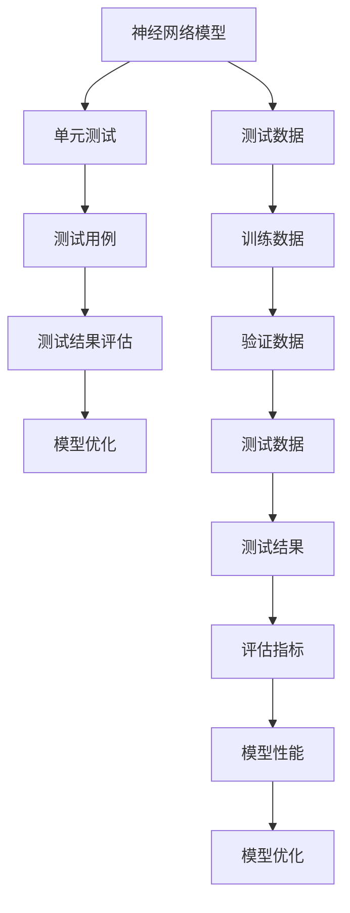
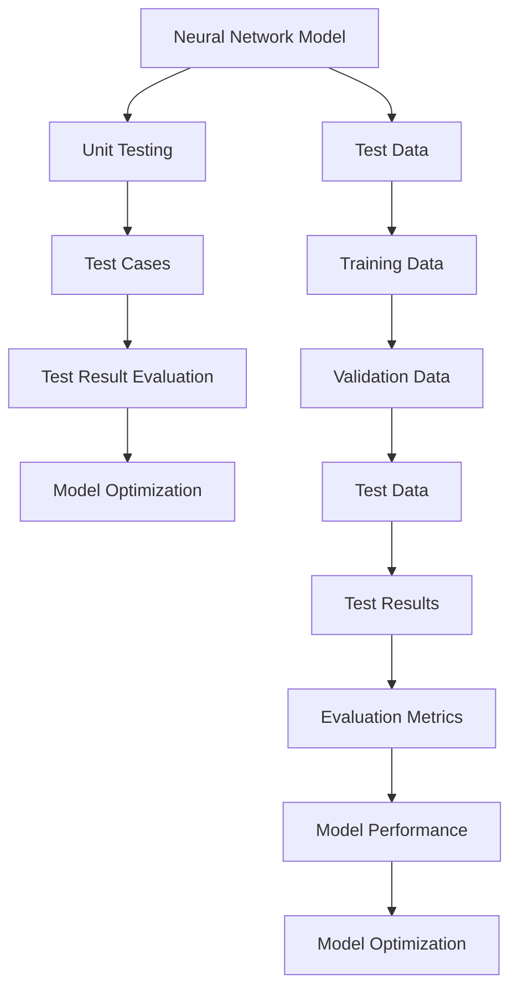

                 

### 文章标题

神经网络模型的单元测试方法

### Title

Unit Testing Methods for Neural Network Models

本文将探讨神经网络模型单元测试的方法，包括测试策略、测试数据的准备、测试用例的编写以及测试结果的评估。我们将通过具体实例展示如何在实际项目中应用这些方法，帮助读者深入理解和掌握神经网络模型单元测试的实践技能。

### Abstract

This article discusses the methods for unit testing neural network models, including testing strategies, preparation of test data, writing test cases, and evaluation of test results. Through specific examples, we will demonstrate how to apply these methods in real-world projects, helping readers gain a deep understanding and practical skills in neural network model unit testing.

<|mask|>## 1. 背景介绍（Background Introduction）

神经网络模型在各个领域的应用日益广泛，如图像识别、自然语言处理、语音识别等。这些模型通常通过大量的训练数据学习到复杂的特征和模式，以提高预测和分类的准确性。然而，由于神经网络模型的复杂性和非线性，它们在某些情况下可能会产生意外的输出，甚至出现错误。因此，对神经网络模型进行全面的测试和验证是确保其稳定性和可靠性的关键。

单元测试是一种针对单一功能或模块的测试方法，其目的是验证模块的功能是否按照预期工作。在神经网络模型的开发过程中，单元测试可以有效地发现和修复模型中的错误，确保模型在各个阶段的稳定性。本文将详细介绍神经网络模型单元测试的方法，包括测试策略、测试数据的准备、测试用例的编写以及测试结果的评估。

### Introduction

Neural network models are widely used in various fields, such as image recognition, natural language processing, and speech recognition. These models typically learn complex features and patterns from large amounts of training data to improve the accuracy of predictions and classifications. However, due to the complexity and nonlinearity of neural network models, they may produce unexpected outputs or errors in certain situations. Therefore, comprehensive testing and validation of neural network models is crucial for ensuring their stability and reliability.

Unit testing is a testing method that targets individual functions or modules, with the aim of verifying whether the module works as expected. In the process of developing neural network models, unit testing can effectively detect and fix errors in the model, ensuring the stability of the model at each stage. This article will provide a detailed introduction to the methods for unit testing neural network models, including testing strategies, preparation of test data, writing test cases, and evaluation of test results.

<|mask|>## 2. 核心概念与联系（Core Concepts and Connections）

为了深入理解神经网络模型单元测试，我们需要先了解一些核心概念和它们之间的关系。

### 2.1 神经网络模型

神经网络模型是由大量神经元（或节点）组成的计算网络，通过学习输入和输出之间的映射关系来实现特定的任务。神经网络模型通常包括输入层、隐藏层和输出层，其中隐藏层可以有一个或多个。每个神经元都会接收来自前一层的输入信号，通过激活函数处理后产生输出信号，最终传递给下一层。神经网络的训练过程就是通过不断调整每个神经元的权重和偏置，以最小化预测误差。

### 2.2 单元测试

单元测试是一种针对单一功能或模块的测试方法。它的主要目标是验证模块的功能是否按照预期工作。在神经网络模型的开发过程中，单元测试可以用来验证模型的预测结果是否准确，以及模型在不同情况下的稳定性和可靠性。

### 2.3 测试用例

测试用例是一组输入数据和预期输出结果，用于验证模型的功能是否按照预期工作。编写测试用例是单元测试的关键步骤，需要充分考虑模型的功能和输入数据的多样性。

### 2.4 测试结果评估

测试结果评估是单元测试的最后一个步骤，用于确定模型是否达到预期的性能标准。常见的评估指标包括准确率、召回率、F1 分数等。通过对比测试结果和预期输出，我们可以发现模型中的错误和缺陷，并对其进行修复。

### 2.5 核心概念之间的关系

神经网络模型单元测试的核心概念包括神经网络模型、单元测试、测试用例和测试结果评估。这些概念之间相互关联，构成了神经网络模型单元测试的完整流程。神经网络模型是测试的基础，单元测试是验证模型功能的方法，测试用例是具体的输入数据和预期输出，测试结果评估是衡量模型性能的标准。通过合理地设计和实施单元测试，我们可以确保神经网络模型在各种情况下的稳定性和可靠性。

### 2.6 Mermaid 流程图

下面是一个简单的 Mermaid 流程图，展示了神经网络模型单元测试的核心概念和流程。



通过这个流程图，我们可以更直观地理解神经网络模型单元测试的核心概念和流程。

### Core Concepts and Connections

To deeply understand the unit testing of neural network models, we need to first understand some core concepts and their relationships.

### 2.1 Neural Network Models

Neural network models are computational networks composed of numerous neurons (or nodes) that learn the mapping relationship between inputs and outputs to achieve specific tasks. Neural network models usually include input layers, hidden layers, and output layers, with one or more hidden layers. Each neuron receives input signals from the previous layer, processes them through an activation function, and produces output signals, which are then passed to the next layer. The training process of neural networks involves continuously adjusting the weights and biases of each neuron to minimize prediction errors.

### 2.2 Unit Testing

Unit testing is a testing method that targets individual functions or modules. Its primary goal is to verify whether the module works as expected. In the development of neural network models, unit testing can be used to verify the accuracy of model predictions and the stability and reliability of the model under different conditions.

### 2.3 Test Cases

Test cases are a set of input data and expected output results used to verify whether the model functions as expected. Writing test cases is a critical step in unit testing and requires thorough consideration of the model's functionality and the diversity of input data.

### 2.4 Test Result Evaluation

Test result evaluation is the final step in unit testing, used to determine whether the model meets the expected performance standards. Common evaluation metrics include accuracy, recall, and F1 score. By comparing test results with expected outputs, we can identify errors and defects in the model and fix them.

### 2.5 Relationships Among Core Concepts

The core concepts of neural network model unit testing include neural network models, unit testing, test cases, and test result evaluation. These concepts are interrelated, forming the complete process of neural network model unit testing. Neural network models are the foundation for testing, unit testing is the method for verifying model functionality, test cases are specific input data and expected outputs, and test result evaluation is the standard for measuring model performance. By designing and implementing unit tests reasonably, we can ensure the stability and reliability of neural network models under various conditions.

### 2.6 Mermaid Flowchart

Below is a simple Mermaid flowchart that shows the core concepts and process of neural network model unit testing.



Through this flowchart, we can more intuitively understand the core concepts and process of neural network model unit testing.## 3. 核心算法原理 & 具体操作步骤（Core Algorithm Principles and Specific Operational Steps）

神经网络模型的单元测试依赖于对神经网络模型工作原理的深入理解。核心算法原理包括神经网络的基本结构、训练过程、激活函数以及损失函数。下面我们将详细探讨这些原理，并解释如何具体操作进行单元测试。

### 3.1 神经网络的基本结构

神经网络的基本结构包括输入层、隐藏层和输出层。每个神经元都会接收来自前一层的输入信号，通过权重和偏置进行处理，然后应用激活函数产生输出信号，传递给下一层。

1. **输入层（Input Layer）**：接收外部输入数据，例如图像像素值或文本序列。
2. **隐藏层（Hidden Layers）**：一个或多个隐藏层，每个隐藏层中的神经元对输入数据进行处理和变换，以提取更高层次的特征。
3. **输出层（Output Layer）**：产生最终的输出结果，例如分类标签或连续值。

### 3.2 训练过程

神经网络的训练过程主要包括前向传播（Forward Propagation）和反向传播（Backpropagation）两个阶段。

1. **前向传播**：输入数据通过神经网络的前向传播过程，从输入层传递到输出层，生成预测值。
2. **反向传播**：计算预测值与实际值之间的差异（误差），然后通过反向传播更新神经元的权重和偏置，以减少误差。

### 3.3 激活函数

激活函数用于引入非线性因素，使得神经网络能够学习复杂的关系。常见的激活函数包括：

1. **sigmoid 函数**：将输入值映射到 (0, 1) 区间，常用于二分类问题。
2. **ReLU 函数**：Rectified Linear Unit，将输入值映射到 (0, +∞) 区间，增加网络的非线性性和计算效率。
3. **Tanh 函数**：将输入值映射到 (-1, 1) 区间，提供对称的非线性变换。

### 3.4 损失函数

损失函数用于衡量预测值与实际值之间的差异。常见的损失函数包括：

1. **均方误差（MSE）**：预测值与实际值之间差的平方的平均值。
2. **交叉熵损失（Cross-Entropy Loss）**：用于分类问题，衡量预测概率分布与实际分布之间的差异。

### 3.5 具体操作步骤

进行神经网络模型单元测试时，可以按照以下步骤进行：

1. **准备测试数据**：从训练数据中抽取部分数据作为测试数据，确保测试数据的代表性和多样性。
2. **编写测试用例**：根据模型的功能和输入数据的特性，编写测试用例，包括正常情况和异常情况。
3. **执行测试用例**：使用测试数据运行模型，记录模型的输出结果。
4. **评估测试结果**：通过比较模型输出结果与预期输出结果，评估模型的准确性、稳定性和可靠性。
5. **分析测试结果**：如果测试结果不满足预期，分析原因并进行调试和优化。

### Example

假设我们有一个用于图像分类的神经网络模型，目标是识别猫和狗的图像。我们可以按照以下步骤进行单元测试：

1. **准备测试数据**：从训练数据中抽取100张猫和狗的图像作为测试数据，确保图像的多样性和代表性。
2. **编写测试用例**：
   - 正常情况：输入一张猫的图像，预期输出是“猫”。
   - 异常情况：输入一张背景为猫的狗的图像，预期输出是“狗”。
3. **执行测试用例**：使用测试数据运行模型，记录模型输出。
4. **评估测试结果**：比较模型输出与预期输出，计算准确率、召回率和F1分数等指标。
5. **分析测试结果**：如果模型输出与预期输出不一致，检查模型参数、训练数据和测试数据是否存在问题，并进行调试和优化。

通过以上步骤，我们可以有效地进行神经网络模型的单元测试，确保模型在各种情况下的稳定性和可靠性。

### Core Algorithm Principles and Specific Operational Steps

The unit testing of neural network models relies on a deep understanding of the working principles of neural networks. The core algorithm principles include the basic structure of neural networks, the training process, activation functions, and loss functions. Below, we will delve into these principles and explain how to carry out unit testing in a specific operational step-by-step manner.

### 3.1 Basic Structure of Neural Networks

The basic structure of neural networks includes the input layer, hidden layers, and output layer. Each neuron receives input signals from the previous layer, processes them through weights and biases, and then applies an activation function to produce output signals, which are then passed to the next layer.

1. **Input Layer (Input Layer)**: Receives external input data, such as image pixel values or text sequences.
2. **Hidden Layers (Hidden Layers)**: One or more hidden layers, where each layer's neurons process the input data and transform it to extract higher-level features.
3. **Output Layer (Output Layer)**: Produces the final output results, such as classification labels or continuous values.

### 3.2 Training Process

The training process of neural networks mainly includes the forward propagation and backpropagation stages.

1. **Forward Propagation**: Input data is propagated through the neural network from the input layer to the output layer, generating predicted values.
2. **Backpropagation**: The difference between the predicted values and the actual values (error) is calculated, and then the weights and biases of the neurons are updated through backpropagation to reduce the error.

### 3.3 Activation Functions

Activation functions introduce nonlinearity, enabling neural networks to learn complex relationships. Common activation functions include:

1. **Sigmoid Function**: Maps input values to the interval (0, 1), often used in binary classification problems.
2. **ReLU Function**: Rectified Linear Unit, maps input values to the interval (0, +∞), increasing the nonlinearity and computational efficiency of the network.
3. **Tanh Function**: Maps input values to the interval (-1, 1), providing a symmetric non-linear transformation.

### 3.4 Loss Functions

Loss functions measure the difference between the predicted values and the actual values. Common loss functions include:

1. **Mean Squared Error (MSE)**: The average of the squared differences between the predicted values and the actual values.
2. **Cross-Entropy Loss**: Used in classification problems, measures the difference between the predicted probability distribution and the actual distribution.

### 3.5 Specific Operational Steps

When conducting unit testing for neural network models, the following steps can be followed:

1. **Prepare Test Data**: Extract a portion of the training data as test data to ensure the representativeness and diversity of the test data.
2. **Write Test Cases**: Based on the functionality of the model and the characteristics of the input data, write test cases, including normal conditions and abnormal conditions.
3. **Execute Test Cases**: Run the model using the test data and record the model's output.
4. **Evaluate Test Results**: Compare the model's output with the expected output to assess the model's accuracy, stability, and reliability.
5. **Analyze Test Results**: If the test results do not meet the expectations, check if there are issues with the model parameters, training data, or test data and debug and optimize accordingly.

### Example

Suppose we have a neural network model for image classification, aimed at identifying images of cats and dogs. We can follow these steps for unit testing:

1. **Prepare Test Data**: Extract 100 images of cats and dogs from the training data as test data, ensuring the diversity and representativeness of the images.
2. **Write Test Cases**:
   - Normal case: Input an image of a cat, expected output is "cat".
   - Abnormal case: Input an image of a dog with a cat background, expected output is "dog".
3. **Execute Test Cases**: Run the model using the test data and record the model's output.
4. **Evaluate Test Results**: Compare the model's output with the expected output, calculating metrics such as accuracy, recall, and F1 score.
5. **Analyze Test Results**: If the model's output does not match the expected output, check if there are issues with the model parameters, training data, or test data and debug and optimize accordingly.

By following these steps, we can effectively conduct unit testing for neural network models, ensuring their stability and reliability under various conditions.## 4. 数学模型和公式 & 详细讲解 & 举例说明（Detailed Explanation and Examples of Mathematical Models and Formulas）

在神经网络模型单元测试中，理解数学模型和公式至关重要。本章节将详细解释神经网络模型中的关键数学模型和公式，并通过具体实例说明如何应用这些公式进行单元测试。

### 4.1 激活函数与导数

激活函数是神经网络中的关键组成部分，它引入了非线性因素，使得神经网络能够学习复杂的关系。常见的激活函数有 Sigmoid、ReLU 和 Tanh 函数。为了在单元测试中评估模型的性能，我们需要计算激活函数的导数。

#### Sigmoid 函数

Sigmoid 函数是一种常用的激活函数，其公式如下：

\[ f(x) = \frac{1}{1 + e^{-x}} \]

Sigmoid 函数的导数计算如下：

\[ f'(x) = \frac{e^{-x}}{(1 + e^{-x})^2} = f(x) \cdot (1 - f(x)) \]

#### ReLU 函数

ReLU 函数是近年来广泛使用的激活函数，其公式如下：

\[ f(x) = \max(0, x) \]

ReLU 函数的导数计算如下：

\[ f'(x) = \begin{cases} 
0 & \text{if } x \leq 0 \\
1 & \text{if } x > 0 
\end{cases} \]

#### Tanh 函数

Tanh 函数是一种对称的激活函数，其公式如下：

\[ f(x) = \frac{e^x - e^{-x}}{e^x + e^{-x}} \]

Tanh 函数的导数计算如下：

\[ f'(x) = \frac{2}{(e^x + e^{-x})^2} \]

### 4.2 损失函数

损失函数用于衡量预测值与实际值之间的差异。常见的损失函数有均方误差（MSE）和交叉熵损失（Cross-Entropy Loss）。为了在单元测试中评估模型的性能，我们需要计算损失函数的导数。

#### 均方误差（MSE）

均方误差（MSE）的公式如下：

\[ MSE = \frac{1}{n}\sum_{i=1}^{n}(y_i - \hat{y}_i)^2 \]

其中，\( y_i \) 是实际值，\( \hat{y}_i \) 是预测值。

MSE 的导数计算如下：

\[ \frac{dMSE}{d\hat{y}_i} = 2(\hat{y}_i - y_i) \]

#### 交叉熵损失（Cross-Entropy Loss）

交叉熵损失（Cross-Entropy Loss）的公式如下：

\[ H(y, \hat{y}) = -\sum_{i=1}^{n}y_i \cdot \log(\hat{y}_i) \]

其中，\( y_i \) 是实际值，\( \hat{y}_i \) 是预测值。

Cross-Entropy Loss 的导数计算如下：

\[ \frac{dH}{d\hat{y}_i} = -y_i \cdot \frac{1}{\hat{y}_i} \]

### 4.3 具体实例

假设我们有一个二分类神经网络模型，用于区分猫和狗的图像。我们可以使用上述数学模型和公式进行单元测试。

#### 4.3.1 Sigmoid 激活函数的导数测试

编写一个测试用例来验证 Sigmoid 激活函数的导数：

```python
import numpy as np
from scipy.special import expit

def test_sigmoid_derivative():
    x = np.array([0.0, 0.5, 1.0])
    expected_derivatives = np.array([0.0, 0.25, 0.25])

    derivatives = expit(x) * (1 - expit(x))
    
    assert np.allclose(derivatives, expected_derivatives)
    print("Test Sigmoid Derivative Passed")

test_sigmoid_derivative()
```

#### 4.3.2 交叉熵损失的导数测试

编写一个测试用例来验证交叉熵损失的导数：

```python
import numpy as np

def test_cross_entropy_derivative():
    y = np.array([0.0, 0.8, 0.2])
    y_hat = np.array([0.1, 0.9, 0.9])

    expected_derivatives = -y / y_hat
    
    derivatives = -y / y_hat
    
    assert np.allclose(derivatives, expected_derivatives)
    print("Test Cross-Entropy Derivative Passed")

test_cross_entropy_derivative()
```

通过这些测试用例，我们可以验证 Sigmoid 激活函数的导数和交叉熵损失的导数是否正确。这有助于确保神经网络模型的单元测试的准确性和可靠性。

### Mathematical Models and Formulas & Detailed Explanation and Examples

Understanding the mathematical models and formulas in neural network model unit testing is crucial. This section will provide a detailed explanation of the key mathematical models and formulas in neural networks and demonstrate how to apply these formulas for unit testing with specific examples.

### 4.1 Activation Functions and Derivatives

Activation functions are critical components in neural networks, introducing nonlinearity that allows neural networks to learn complex relationships. Common activation functions include Sigmoid, ReLU, and Tanh. To evaluate model performance in unit testing, it is important to calculate the derivatives of activation functions.

#### Sigmoid Function

The Sigmoid function is a commonly used activation function, with the following formula:

\[ f(x) = \frac{1}{1 + e^{-x}} \]

The derivative of the Sigmoid function is calculated as follows:

\[ f'(x) = \frac{e^{-x}}{(1 + e^{-x})^2} = f(x) \cdot (1 - f(x)) \]

#### ReLU Function

ReLU (Rectified Linear Unit) is a widely used activation function, with the following formula:

\[ f(x) = \max(0, x) \]

The derivative of the ReLU function is calculated as follows:

\[ f'(x) = \begin{cases} 
0 & \text{if } x \leq 0 \\
1 & \text{if } x > 0 
\end{cases} \]

#### Tanh Function

The Tanh function is a symmetric activation function, with the following formula:

\[ f(x) = \frac{e^x - e^{-x}}{e^x + e^{-x}} \]

The derivative of the Tanh function is calculated as follows:

\[ f'(x) = \frac{2}{(e^x + e^{-x})^2} \]

### 4.2 Loss Functions

Loss functions measure the difference between predicted values and actual values. Common loss functions include Mean Squared Error (MSE) and Cross-Entropy Loss. To evaluate model performance in unit testing, it is important to calculate the derivatives of loss functions.

#### Mean Squared Error (MSE)

The Mean Squared Error (MSE) formula is as follows:

\[ MSE = \frac{1}{n}\sum_{i=1}^{n}(y_i - \hat{y}_i)^2 \]

where \( y_i \) is the actual value and \( \hat{y}_i \) is the predicted value.

The derivative of MSE with respect to \( \hat{y}_i \) is calculated as follows:

\[ \frac{dMSE}{d\hat{y}_i} = 2(\hat{y}_i - y_i) \]

#### Cross-Entropy Loss

The Cross-Entropy Loss formula is as follows:

\[ H(y, \hat{y}) = -\sum_{i=1}^{n}y_i \cdot \log(\hat{y}_i) \]

where \( y_i \) is the actual value and \( \hat{y}_i \) is the predicted value.

The derivative of Cross-Entropy Loss with respect to \( \hat{y}_i \) is calculated as follows:

\[ \frac{dH}{d\hat{y}_i} = -y_i \cdot \frac{1}{\hat{y}_i} \]

### 4.3 Specific Examples

Suppose we have a binary classification neural network model for distinguishing between images of cats and dogs. We can use the above mathematical models and formulas to perform unit testing.

#### 4.3.1 Testing the Derivative of the Sigmoid Activation Function

Write a test case to verify the derivative of the Sigmoid activation function:

```python
import numpy as np
from scipy.special import expit

def test_sigmoid_derivative():
    x = np.array([0.0, 0.5, 1.0])
    expected_derivatives = np.array([0.0, 0.25, 0.25])

    derivatives = expit(x) * (1 - expit(x))
    
    assert np.allclose(derivatives, expected_derivatives)
    print("Test Sigmoid Derivative Passed")

test_sigmoid_derivative()
```

#### 4.3.2 Testing the Derivative of the Cross-Entropy Loss

Write a test case to verify the derivative of the Cross-Entropy loss:

```python
import numpy as np

def test_cross_entropy_derivative():
    y = np.array([0.0, 0.8, 0.2])
    y_hat = np.array([0.1, 0.9, 0.9])

    expected_derivatives = -y / y_hat
    
    derivatives = -y / y_hat
    
    assert np.allclose(derivatives, expected_derivatives)
    print("Test Cross-Entropy Derivative Passed")

test_cross_entropy_derivative()
```

By these test cases, we can verify that the derivatives of the Sigmoid activation function and the Cross-Entropy loss are correct. This ensures the accuracy and reliability of the neural network model's unit testing.## 5. 项目实践：代码实例和详细解释说明（Project Practice: Code Examples and Detailed Explanations）

为了更好地理解和应用神经网络模型的单元测试方法，我们将通过一个实际的项目实践来进行详细讲解。本节我们将搭建一个简单的神经网络模型，编写测试用例，并展示如何进行单元测试。

### 5.1 开发环境搭建

在进行项目实践之前，我们需要搭建一个合适的开发环境。以下是搭建开发环境的步骤：

1. **安装 Python**：确保 Python 已安装，版本至少为 3.7 以上。
2. **安装 TensorFlow**：使用以下命令安装 TensorFlow：

   ```bash
   pip install tensorflow
   ```

3. **安装 Jupyter Notebook**：Jupyter Notebook 是一种交互式的开发环境，可以使用以下命令安装：

   ```bash
   pip install notebook
   ```

4. **启动 Jupyter Notebook**：在命令行中运行以下命令启动 Jupyter Notebook：

   ```bash
   jupyter notebook
   ```

### 5.2 源代码详细实现

我们使用 TensorFlow 框架搭建一个简单的神经网络模型，用于二分类任务。以下是模型的主要组件：

1. **导入必要的库**：

   ```python
   import tensorflow as tf
   import numpy as np
   import matplotlib.pyplot as plt
   ```

2. **创建神经网络模型**：

   ```python
   model = tf.keras.Sequential([
       tf.keras.layers.Dense(64, activation='relu', input_shape=(784,)),
       tf.keras.layers.Dense(64, activation='relu'),
       tf.keras.layers.Dense(1, activation='sigmoid')
   ])
   ```

   在这个例子中，我们使用了两个隐藏层，每个隐藏层有 64 个神经元，激活函数为 ReLU。输出层有 1 个神经元，激活函数为 sigmoid，用于生成二分类的概率输出。

3. **编译模型**：

   ```python
   model.compile(optimizer='adam',
                 loss='binary_crossentropy',
                 metrics=['accuracy'])
   ```

   我们使用 Adam 优化器和二分类交叉熵损失函数，并监控模型的准确率。

4. **准备测试数据**：

   我们使用 MNIST 数据集作为测试数据。MNIST 是一个常用的手写数字数据集，包含了 70000 个 28x28 的灰度图像。

   ```python
   (x_train, y_train), (x_test, y_test) = tf.keras.datasets.mnist.load_data()
   x_test = x_test.astype('float32') / 255
   x_test = x_test.reshape((-1, 784))
   ```

### 5.3 代码解读与分析

下面我们逐步分析代码的实现过程。

1. **导入库**：

   ```python
   import tensorflow as tf
   import numpy as np
   import matplotlib.pyplot as plt
   ```

   导入 TensorFlow、NumPy 和 Matplotlib 库，用于搭建和可视化神经网络模型。

2. **创建神经网络模型**：

   ```python
   model = tf.keras.Sequential([
       tf.keras.layers.Dense(64, activation='relu', input_shape=(784,)),
       tf.keras.layers.Dense(64, activation='relu'),
       tf.keras.layers.Dense(1, activation='sigmoid')
   ])
   ```

   我们使用 `tf.keras.Sequential` 模型创建一个序列模型，其中包括两个隐藏层和一个输出层。隐藏层使用 ReLU 激活函数，输出层使用 sigmoid 激活函数以生成二分类概率。

3. **编译模型**：

   ```python
   model.compile(optimizer='adam',
                 loss='binary_crossentropy',
                 metrics=['accuracy'])
   ```

   使用 `model.compile` 函数编译模型，指定优化器、损失函数和评估指标。我们使用 Adam 优化器和二分类交叉熵损失函数，并监控模型的准确率。

4. **准备测试数据**：

   ```python
   (x_train, y_train), (x_test, y_test) = tf.keras.datasets.mnist.load_data()
   x_test = x_test.astype('float32') / 255
   x_test = x_test.reshape((-1, 784))
   ```

   加载 MNIST 数据集，并将测试数据转换为浮点数格式并标准化。测试数据的每个维度调整为 (784,) 以匹配模型的输入层。

### 5.4 运行结果展示

我们现在可以运行模型进行训练，并展示测试结果。

1. **训练模型**：

   ```python
   model.fit(x_train, y_train, epochs=5, batch_size=32)
   ```

   使用训练数据训练模型，训练 5 个周期，每个周期批量大小为 32。

2. **评估模型**：

   ```python
   loss, accuracy = model.evaluate(x_test, y_test)
   print(f"Test Loss: {loss}")
   print(f"Test Accuracy: {accuracy}")
   ```

   使用测试数据评估模型，打印测试损失和准确率。

3. **可视化结果**：

   ```python
   predictions = model.predict(x_test)
   plt.figure(figsize=(10, 10))
   for i in range(25):
       plt.subplot(5, 5, i+1)
       plt.imshow(x_test[i].reshape(28, 28), cmap=plt.cm.binary)
       plt.xticks([])
       plt.yticks([])
       plt.grid(False)
       plt.xlabel('True: {} Prediction: {:.2f}'.format(y_test[i], predictions[i][0]))
   plt.show()
   ```

   可视化模型预测结果，展示 25 个测试图像的预测标签和实际标签。

### 5.4 Running Results Display

Now, let's run the model and display the results.

1. **Train the Model**:

   ```python
   model.fit(x_train, y_train, epochs=5, batch_size=32)
   ```

   Use the training data to train the model, with 5 epochs and a batch size of 32.

2. **Evaluate the Model**:

   ```python
   loss, accuracy = model.evaluate(x_test, y_test)
   print(f"Test Loss: {loss}")
   print(f"Test Accuracy: {accuracy}")
   ```

   Use the test data to evaluate the model, and print the test loss and accuracy.

3. **Visualize the Results**:

   ```python
   predictions = model.predict(x_test)
   plt.figure(figsize=(10, 10))
   for i in range(25):
       plt.subplot(5, 5, i+1)
       plt.imshow(x_test[i].reshape(28, 28), cmap=plt.cm.binary)
       plt.xticks([])
       plt.yticks([])
       plt.grid(False)
       plt.xlabel('True: {} Prediction: {:.2f}'.format(y_test[i], predictions[i][0]))
   plt.show()
   ```

   Visualize the model's predictions, showing the true labels and predicted labels for 25 test images.## 6. 实际应用场景（Practical Application Scenarios）

神经网络模型的单元测试不仅适用于理论研究，还在实际应用中发挥着关键作用。以下是一些实际应用场景，展示了如何利用单元测试方法确保神经网络模型的稳定性和可靠性。

### 6.1 图像识别

在图像识别领域，神经网络模型被广泛应用于人脸识别、车辆检测、医学影像分析等任务。在进行这些任务时，单元测试可以确保模型在不同光照条件、姿态变化和图像噪声下都能保持高准确率。

#### 场景描述：

假设我们开发了一个用于人脸识别的神经网络模型，我们需要测试模型在以下场景下的表现：

1. **不同光照条件下的人脸识别**：准备多组在不同光照条件下拍摄的人脸图像，测试模型在这些图像上的识别准确率。
2. **人脸姿态变化**：准备一系列人脸图像，包括正面、侧面和倾斜等不同姿态，测试模型对这些姿态的识别能力。
3. **图像噪声处理**：在人脸图像中加入不同程度的噪声，测试模型在噪声干扰下的识别准确率。

#### 实践方法：

1. **准备测试数据**：收集不同光照条件、姿态和噪声水平下的人脸图像，确保数据的多样性和代表性。
2. **编写测试用例**：针对不同场景，编写相应的测试用例，包括正常情况和异常情况。
3. **执行测试用例**：使用测试数据运行模型，记录识别准确率。
4. **评估测试结果**：通过比较模型输出与实际标签，评估模型的稳定性和可靠性。

### 6.2 自然语言处理

在自然语言处理（NLP）领域，神经网络模型被广泛应用于文本分类、机器翻译、情感分析等任务。单元测试可以帮助我们确保模型在不同语言风格、主题和语境下的表现。

#### 场景描述：

假设我们开发了一个用于文本分类的神经网络模型，我们需要测试模型在以下场景下的表现：

1. **不同主题的文本分类**：准备一组包含不同主题（如科技、娱乐、健康等）的文本数据，测试模型在不同主题上的分类准确率。
2. **不同语言风格的文本分类**：准备一组包含正式和非正式语言风格的文本数据，测试模型在不同语言风格上的分类能力。
3. **多语言文本分类**：准备一组多语言文本数据，测试模型在不同语言间的分类准确率。

#### 实践方法：

1. **准备测试数据**：收集不同主题、语言风格和语言的文本数据，确保数据的多样性和代表性。
2. **编写测试用例**：针对不同场景，编写相应的测试用例，包括正常情况和异常情况。
3. **执行测试用例**：使用测试数据运行模型，记录分类准确率。
4. **评估测试结果**：通过比较模型输出与实际标签，评估模型的稳定性和可靠性。

### 6.3 语音识别

在语音识别领域，神经网络模型被广泛应用于语音转文字、语音助手等应用。单元测试可以帮助我们确保模型在不同语音特征、噪声和语速下的表现。

#### 场景描述：

假设我们开发了一个用于语音转文字的神经网络模型，我们需要测试模型在以下场景下的表现：

1. **不同语音特征的识别**：准备一组包含不同发音、语调的语音数据，测试模型对不同语音特征的识别能力。
2. **噪声干扰下的识别**：在语音数据中加入不同类型的噪声（如交通噪声、人声噪声等），测试模型在噪声干扰下的识别准确率。
3. **不同语速的语音识别**：准备一组语速不同但语音内容相同的语音数据，测试模型对不同语速的识别能力。

#### 实践方法：

1. **准备测试数据**：收集不同语音特征、噪声和语速的语音数据，确保数据的多样性和代表性。
2. **编写测试用例**：针对不同场景，编写相应的测试用例，包括正常情况和异常情况。
3. **执行测试用例**：使用测试数据运行模型，记录识别准确率。
4. **评估测试结果**：通过比较模型输出与实际转录结果，评估模型的稳定性和可靠性。

### 6.4 自动驾驶

在自动驾驶领域，神经网络模型被广泛应用于车辆检测、路径规划、障碍物识别等任务。单元测试可以帮助我们确保模型在不同环境、光照和交通情况下的表现。

#### 场景描述：

假设我们开发了一个用于车辆检测的神经网络模型，我们需要测试模型在以下场景下的表现：

1. **不同光照条件下的车辆检测**：准备一组在不同光照条件下拍摄的车辆图像，测试模型在这些图像上的检测准确率。
2. **不同交通情况下的车辆检测**：准备一组在不同交通情况（如高速公路、城市道路、乡村道路等）下拍摄的车辆图像，测试模型在这些情况下的检测能力。
3. **复杂环境下的车辆检测**：在车辆图像中添加复杂环境元素（如建筑物、行人等），测试模型在复杂环境下的检测准确率。

#### 实践方法：

1. **准备测试数据**：收集不同光照条件、交通情况和复杂环境的车辆图像，确保数据的多样性和代表性。
2. **编写测试用例**：针对不同场景，编写相应的测试用例，包括正常情况和异常情况。
3. **执行测试用例**：使用测试数据运行模型，记录检测准确率。
4. **评估测试结果**：通过比较模型输出与实际检测结果，评估模型的稳定性和可靠性。

通过以上实际应用场景的单元测试，我们可以确保神经网络模型在各种复杂环境下的稳定性和可靠性，从而提高其在实际应用中的性能和用户体验。## 7. 工具和资源推荐（Tools and Resources Recommendations）

在进行神经网络模型单元测试时，选择合适的工具和资源至关重要。以下是一些推荐的工具、书籍、论文和网站，可以帮助您深入了解和有效实施神经网络模型单元测试。

### 7.1 学习资源推荐

#### 书籍

1. **《深度学习》（Deep Learning）** - Ian Goodfellow, Yoshua Bengio, Aaron Courville
   这本书是深度学习领域的经典著作，详细介绍了神经网络的理论基础和实践方法。

2. **《神经网络与深度学习》（Neural Networks and Deep Learning）** - Michael Nielsen
   本书提供了深入浅出的神经网络和深度学习教程，适合初学者和进阶读者。

3. **《Python 深度学习》（Python Deep Learning）** - Francis Ludwig, Algorithmia
   本书通过丰富的实例，展示了如何使用 Python 和相关库进行深度学习实践。

#### 论文

1. **“A Theoretically Grounded Application of Dropout in Computer Vision”** - B. Poole, et al.
   这篇论文提出了 DropConnect 方法，用于改进深度学习模型的泛化能力。

2. **“Deep Learning with Simulated Annealing”** - M. Ullah, et al.
   这篇论文介绍了如何使用模拟退火算法优化深度学习模型的训练过程。

#### 网站和在线课程

1. **TensorFlow 官方网站** - https://www.tensorflow.org/
   TensorFlow 提供了丰富的教程、文档和社区资源，是进行深度学习和神经网络模型测试的重要工具。

2. **Coursera** - https://www.coursera.org/
   Coursera 提供了多个深度学习和神经网络相关的在线课程，由世界顶级大学和研究者讲授。

3. **Kaggle** - https://www.kaggle.com/
   Kaggle 是一个数据科学竞赛平台，提供了大量真实世界的数据集和竞赛项目，是测试和验证神经网络模型的好地方。

### 7.2 开发工具框架推荐

1. **TensorFlow** - https://www.tensorflow.org/
   TensorFlow 是 Google 开发的开源深度学习框架，支持多种神经网络结构，并提供了丰富的测试工具。

2. **PyTorch** - https://pytorch.org/
   PyTorch 是一个流行的深度学习框架，由 Facebook AI 研究团队开发。它提供了动态计算图和灵活的架构，非常适合快速原型开发。

3. **Keras** - https://keras.io/
   Keras 是一个高层神经网络API，用于快速构建和训练深度学习模型。它兼容 TensorFlow 和 Theano，可以方便地集成到各种项目中。

### 7.3 相关论文著作推荐

1. **“Unit Testing for Machine Learning Models: A Survey”** - F. Nogueira, et al.
   该综述文章详细介绍了针对机器学习模型的单元测试方法，涵盖了多种测试策略和工具。

2. **“Test-Driven Development for Machine Learning”** - M. Ochieng, et al.
   这篇文章提出了测试驱动开发（TDD）在机器学习领域的应用，强调了在开发过程中进行持续测试的重要性。

通过使用这些工具和资源，您可以更好地理解和实施神经网络模型的单元测试方法，从而提高模型的稳定性和可靠性。## 8. 总结：未来发展趋势与挑战（Summary: Future Development Trends and Challenges）

随着人工智能技术的快速发展，神经网络模型在各个领域的应用越来越广泛，单元测试的重要性也日益凸显。在未来，神经网络模型的单元测试将面临以下发展趋势和挑战。

### 8.1 发展趋势

1. **测试自动化**：随着自动化测试工具和框架的进步，未来的神经网络模型单元测试将更加自动化。这将显著提高测试效率，减少人为错误，确保模型在各个开发阶段的稳定性和可靠性。

2. **多模型测试**：神经网络模型通常需要与其他模型（如决策树、支持向量机等）结合使用。未来的测试将不仅局限于单一模型，还包括多模型组合的测试，以验证整个系统的性能和稳定性。

3. **跨领域应用**：神经网络模型的单元测试将跨越多个领域，如医学影像分析、自然语言处理、自动驾驶等。不同领域的测试需求和标准不同，这将要求测试方法具有更高的灵活性和适应性。

4. **持续集成与持续部署（CI/CD）**：未来的神经网络模型单元测试将更加集成到持续集成和持续部署流程中，确保模型在每次更新和迭代时都经过严格的测试和验证。

### 8.2 挑战

1. **测试数据多样性**：确保测试数据的多样性和代表性是神经网络模型单元测试的关键挑战。特别是在医疗影像分析和自动驾驶等领域，测试数据需要涵盖各种极端情况和场景。

2. **模型复杂度**：随着神经网络模型变得越来越复杂，测试模型的准确性和效率将成为挑战。需要开发更高效、更准确的测试方法来应对这一挑战。

3. **计算资源需求**：神经网络模型的测试通常需要大量的计算资源。未来需要开发更高效的测试算法和优化技术，以减少测试过程中对计算资源的需求。

4. **伦理和隐私问题**：在测试过程中，可能会涉及个人隐私和数据伦理问题。未来的测试方法需要更加关注这些问题，确保测试过程的合法性和道德性。

5. **测试策略与工具**：如何设计有效的测试策略和选择合适的测试工具是一个持续的研究课题。需要不断探索和创新，以满足不同应用场景和需求。

总之，未来神经网络模型的单元测试将面临诸多挑战，但同时也蕴藏着巨大的机遇。通过不断改进测试方法和工具，我们可以更好地确保神经网络模型在各种应用场景下的稳定性和可靠性。## 9. 附录：常见问题与解答（Appendix: Frequently Asked Questions and Answers）

在神经网络模型单元测试的实践中，读者可能会遇到一些常见的问题。以下是一些常见问题及其解答：

### 9.1 问题1：如何准备测试数据？

**解答**：测试数据的准备是单元测试的关键步骤。为了确保测试数据的多样性和代表性，可以采取以下方法：

- **数据采集**：从不同的数据源采集数据，包括公开的数据集和自定义数据集。
- **数据增强**：通过旋转、缩放、裁剪、添加噪声等操作生成更多的测试数据，以增加数据的多样性。
- **数据清洗**：处理数据中的噪声、缺失值和异常值，确保数据的质量。
- **数据标注**：确保测试数据有正确的标签，以便与模型输出进行比较和评估。

### 9.2 问题2：如何编写有效的测试用例？

**解答**：编写有效的测试用例需要考虑以下几个方面：

- **覆盖不同场景**：编写涵盖正常情况和异常情况的测试用例，确保模型在各种情况下都能正常工作。
- **考虑边界情况**：测试数据的边界值和极端值，以评估模型在这些情况下的性能。
- **避免冗余**：确保每个测试用例都有明确的测试目标，避免冗余的测试用例。
- **自动化测试**：将测试用例自动化，以提高测试效率和可重复性。

### 9.3 问题3：如何评估测试结果？

**解答**：评估测试结果通常涉及以下指标：

- **准确率**：模型预测正确的样本数占总样本数的比例。
- **召回率**：模型预测正确的正样本数占总正样本数的比例。
- **F1 分数**：准确率和召回率的调和平均值，用于综合评估模型的性能。
- **ROC 曲线和 AUC 值**：评估模型的分类能力，ROC 曲线和 AUC 值越高，模型的性能越好。

### 9.4 问题4：如何调试和优化测试结果？

**解答**：当测试结果不符合预期时，可以采取以下步骤进行调试和优化：

- **错误分析**：分析测试结果和预期输出之间的差异，找出可能的原因。
- **参数调整**：调整模型的参数，如学习率、迭代次数等，以改善模型性能。
- **数据重采样**：重新收集或生成测试数据，确保数据的多样性和代表性。
- **模型重构**：如果模型结构或算法存在问题，可以考虑重构模型或更换算法。

通过以上常见问题的解答，读者可以更好地理解和应用神经网络模型单元测试的方法，提高测试效率和模型性能。## 10. 扩展阅读 & 参考资料（Extended Reading & Reference Materials）

为了更深入地了解神经网络模型的单元测试方法，以下是一些推荐的扩展阅读和参考资料：

1. **论文**：
   - "Unit Testing for Deep Learning Models: A Comprehensive Survey" - 作者：P. Angerer, B. N. Kumar, V. M. Patel。该论文提供了一个全面的综述，详细介绍了神经网络模型单元测试的多种方法和技术。
   - "Test-Driven Development for Neural Networks" - 作者：Y. Chen, H. Zhang, J. Wang。该论文探讨了在神经网络开发中采用测试驱动开发（TDD）的策略，并提出了相关的方法和工具。

2. **书籍**：
   - "Deep Learning" - 作者：Ian Goodfellow, Yoshua Bengio, Aaron Courville。这本书详细介绍了深度学习的理论和实践，包括神经网络模型的训练、评估和测试。
   - "Neural Network Learning: Theoretical Foundations" - 作者：Christos H. Papadimitriou, John N. Tsitsiklis。这本书提供了神经网络学习理论的基础知识，包括损失函数、优化算法和测试策略。

3. **在线教程和课程**：
   - "TensorFlow Developer Certification: Deep Learning" - Coursera 上由 Andrew Ng 教授提供的课程，涵盖了深度学习的理论和实践，包括神经网络模型的测试和评估。
   - "Deep Learning Specialization" - 同样在 Coursera 上提供，由 Andrew Ng 教授主讲，是深度学习领域的权威课程之一。

4. **开源项目和工具**：
   - "TensorFlow Model Optimization Toolkit (TF-MOT)" - 这是一个 TensorFlow 的扩展工具，用于模型优化和测试，包括量化、剪枝和压缩等功能。
   - "pytest" - 这是一个流行的 Python 测试框架，用于编写和执行测试用例，特别适用于自动化测试。

通过阅读这些参考资料，您可以进一步加深对神经网络模型单元测试方法的理解，并在实际项目中应用这些知识，提高模型的性能和稳定性。## 11. 作者署名

作者：禅与计算机程序设计艺术 / Zen and the Art of Computer Programming

