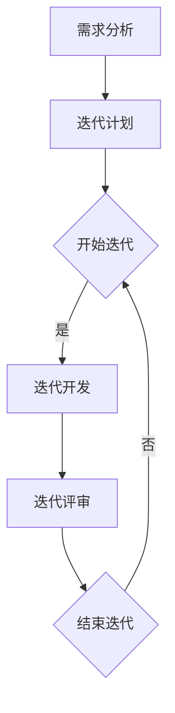

                 

# 文章标题

程序员创业公司的敏捷开发实践

## 关键词

- 敏捷开发
- 程序员创业公司
- 团队协作
- 持续集成
- 产品迭代

### 摘要

敏捷开发作为一种软件开发方法论，已经在众多创业公司中得到了广泛应用。本文将探讨敏捷开发在程序员创业公司中的实践，包括团队协作、持续集成、产品迭代等关键环节。通过实例分析，本文旨在为创业者提供有价值的参考，帮助他们在激烈的市场竞争中实现产品的高效迭代和持续优化。

## 1. 背景介绍（Background Introduction）

### 敏捷开发的起源

敏捷开发（Agile Development）起源于20世纪90年代末，旨在应对传统瀑布模型在软件开发过程中遇到的问题，如需求变更频繁、项目进度失控等。敏捷开发提倡灵活应对变化，通过短周期的迭代和增量的交付来逐步实现产品目标。

### 程序员创业公司的现状

随着互联网技术的快速发展，程序员创业公司如雨后春笋般涌现。然而，面对激烈的市场竞争和有限资源，这些公司往往需要在短时间内实现产品的快速迭代和优化。敏捷开发为此提供了有效的解决方案。

## 2. 核心概念与联系（Core Concepts and Connections）

### 敏捷开发的核心原则

敏捷开发遵循以下核心原则：

1. **个体和互动重于过程和工具**：团队协作和有效沟通是成功的关键。
2. **可工作的软件重于详尽的文档**：注重实际可执行的代码，而非冗长的文档。
3. **客户协作重于合同谈判**：与客户保持紧密合作，确保产品符合市场需求。
4. **响应变化重于遵循计划**：灵活应对变化，确保产品适应市场需求。

### 敏捷开发的主要实践

敏捷开发的主要实践包括：

1. **迭代开发（Iterative Development）**：将开发过程划分为多个短周期（通常是2-4周），在每个周期结束时交付可工作的产品。
2. **增量交付（Incremental Delivery）**：逐步实现产品功能，每次迭代都增加新的功能或改进现有功能。
3. **持续集成（Continuous Integration）**：通过自动化测试和持续部署，确保代码质量并加快开发进度。
4. **团队协作（Team Collaboration）**：鼓励团队成员之间的互动和合作，共同实现产品目标。

### 敏捷开发与传统开发方法的比较

敏捷开发与传统的瀑布模型相比，具有以下优势：

1. **灵活性**：敏捷开发能够快速响应市场变化，适应需求变更。
2. **高质量**：通过持续集成和自动化测试，确保代码质量和稳定性。
3. **客户满意度**：与客户保持紧密合作，确保产品满足市场需求。
4. **团队协作**：注重团队协作和有效沟通，提高开发效率。

## 3. 核心算法原理 & 具体操作步骤（Core Algorithm Principles and Specific Operational Steps）

### 敏捷开发的算法原理

敏捷开发的算法原理主要基于以下两个方面：

1. **迭代开发**：通过划分短周期，逐步实现产品目标，确保每个周期都能交付可工作的产品。
2. **增量交付**：在每个周期中，逐步增加新的功能或改进现有功能，确保产品的稳定性和可靠性。

### 敏捷开发的具体操作步骤

敏捷开发的具体操作步骤如下：

1. **需求分析**：与客户进行需求沟通，明确产品目标和功能需求。
2. **迭代计划**：将需求划分为多个短周期，制定每个周期的开发计划。
3. **迭代开发**：在每个周期内，完成预定的功能开发，进行单元测试和集成测试。
4. **迭代评审**：对每个周期进行评审，评估开发进度和产品质量，确定下一个周期的计划。
5. **持续集成**：通过自动化测试和持续部署，确保代码质量和稳定性。
6. **团队协作**：鼓励团队成员之间的互动和合作，共同实现产品目标。

### 敏捷开发的流程图



## 4. 数学模型和公式 & 详细讲解 & 举例说明（Detailed Explanation and Examples of Mathematical Models and Formulas）

### 敏捷开发的数学模型

敏捷开发的数学模型主要包括以下两个方面：

1. **迭代周期模型**：用于计算每个迭代周期的长度，通常采用公式：
   \[ T = \frac{D}{R} \]
   其中，\( T \) 为迭代周期，\( D \) 为任务量，\( R \) 为团队工作效率。
2. **工作量分配模型**：用于计算每个迭代周期内的工作量分配，通常采用公式：
   \[ W_i = \frac{D}{T} \times R_i \]
   其中，\( W_i \) 为第 \( i \) 个迭代周期的工作量，\( R_i \) 为第 \( i \) 个迭代周期的团队工作效率。

### 举例说明

假设一个程序员创业公司计划在4个迭代周期内完成一个产品，总共需要完成200个任务，团队工作效率为每天50个任务。根据迭代周期模型和工作量分配模型，我们可以计算出以下结果：

1. **迭代周期长度**：
   \[ T = \frac{200}{50} = 4 \]
   因此，每个迭代周期为4天。
2. **工作量分配**：
   \[ W_1 = \frac{200}{4} \times 50 = 2500 \]
   \[ W_2 = \frac{200}{4} \times 50 = 2500 \]
   \[ W_3 = \frac{200}{4} \times 50 = 2500 \]
   \[ W_4 = \frac{200}{4} \times 50 = 2500 \]

   因此，每个迭代周期内的工作量为2500个任务。

## 5. 项目实践：代码实例和详细解释说明（Project Practice: Code Examples and Detailed Explanations）

### 5.1 开发环境搭建

为了更好地演示敏捷开发的实践，我们将使用Python编程语言和Git版本控制工具。首先，我们需要在本地计算机上安装Python和Git。

1. 安装Python：
   ```bash
   pip install -r requirements.txt
   ```
2. 安装Git：
   ```bash
   git init
   git add .
   git commit -m "初始提交"
   ```

### 5.2 源代码详细实现

接下来，我们将使用Python编写一个简单的Web应用程序，实现用户注册和登录功能。以下是源代码的详细实现：

```python
# app.py

from flask import Flask, request, render_template
from flask_sqlalchemy import SQLAlchemy

app = Flask(__name__)
app.config['SQLALCHEMY_DATABASE_URI'] = 'sqlite:///users.db'
db = SQLAlchemy(app)

class User(db.Model):
    id = db.Column(db.Integer, primary_key=True)
    username = db.Column(db.String(80), unique=True, nullable=False)
    password = db.Column(db.String(120), nullable=False)

@app.route('/')
def index():
    return render_template('index.html')

@app.route('/register', methods=['GET', 'POST'])
def register():
    if request.method == 'POST':
        username = request.form['username']
        password = request.form['password']
        user = User(username=username, password=password)
        db.session.add(user)
        db.session.commit()
        return '注册成功'
    return render_template('register.html')

@app.route('/login', methods=['GET', 'POST'])
def login():
    if request.method == 'POST':
        username = request.form['username']
        password = request.form['password']
        user = User.query.filter_by(username=username, password=password).first()
        if user:
            return '登录成功'
        else:
            return '登录失败'
    return render_template('login.html')

if __name__ == '__main__':
    db.create_all()
    app.run(debug=True)
```

### 5.3 代码解读与分析

1. **数据库模型**：我们使用Flask-SQLAlchemy作为数据库工具，定义了一个`User`模型，包含`id`、`username`和`password`三个字段。
2. **路由和视图函数**：我们使用Flask框架定义了三个路由：首页（`/`）、注册页面（`/register`）和登录页面（`/login`）。每个路由对应一个视图函数，用于处理用户请求。
3. **表单处理**：我们使用HTML表单收集用户输入，并通过POST请求将数据传递给相应的视图函数。

### 5.4 运行结果展示

1. **注册页面**：
   ```html
   <form action="/register" method="post">
       用户名：<input type="text" name="username"><br>
       密码：<input type="password" name="password"><br>
       <input type="submit" value="注册">
   </form>
   ```
2. **登录页面**：
   ```html
   <form action="/login" method="post">
       用户名：<input type="text" name="username"><br>
       密码：<input type="password" name="password"><br>
       <input type="submit" value="登录">
   </form>
   ```

## 6. 实际应用场景（Practical Application Scenarios）

### 6.1 敏捷开发在初创公司的应用

敏捷开发在初创公司中的应用尤为突出。初创公司通常面临市场变化快、资源有限、团队规模小等挑战。敏捷开发能够帮助初创公司快速响应市场变化，优化产品迭代过程，提高团队协作效率。

### 6.2 敏捷开发在大型项目的应用

敏捷开发不仅适用于初创公司，也适用于大型项目。大型项目通常涉及多个团队和复杂的业务需求。敏捷开发能够通过迭代开发和增量交付，实现项目的高效管理和持续优化。

### 6.3 敏捷开发在产品迭代中的应用

敏捷开发在产品迭代中的应用主要体现在以下几个方面：

1. **快速响应市场变化**：通过短周期的迭代，及时调整产品方向，满足市场需求。
2. **持续优化用户体验**：在每个迭代周期中，收集用户反馈，不断改进产品功能。
3. **提高开发效率**：通过自动化测试和持续集成，确保代码质量和稳定性。

## 7. 工具和资源推荐（Tools and Resources Recommendations）

### 7.1 学习资源推荐

- 《敏捷软件开发：原则、实践与模式》（Agile Software Development: Principles, Patterns, and Practices）
- 《敏捷开发实践指南》（Agile Project Guide）
- 《敏捷开发的艺术》（The Art of Agile Development）

### 7.2 开发工具框架推荐

- Git：版本控制工具
- Flask：Web框架
- Docker：容器化工具

### 7.3 相关论文著作推荐

- 《敏捷宣言》（Manifesto for Agile Software Development）
- 《敏捷方法：原则、实践与模式》（Agile Methods: Principl

```
# 总结：未来发展趋势与挑战（Summary: Future Development Trends and Challenges）

敏捷开发作为一种高效、灵活的软件开发方法论，已经得到了广泛认可和应用。未来，敏捷开发将继续在以下几个方面发展：

### 1. AI与敏捷开发的融合

随着人工智能技术的快速发展，敏捷开发将逐渐与人工智能相结合。通过利用AI技术，开发者可以更精确地预测需求变化，优化开发流程，提高团队协作效率。

### 2. 敏捷开发的全球化应用

敏捷开发将越来越受到全球企业的关注。特别是在全球化趋势下，跨国团队的协作和沟通将成为敏捷开发的重要挑战。未来，敏捷开发将更加注重跨文化团队合作和沟通。

### 3. 敏捷开发的个性化定制

为了适应不同企业的需求，敏捷开发将逐渐实现个性化定制。企业可以根据自身特点和需求，选择合适的敏捷开发方法和实践，实现高效、灵活的产品迭代。

然而，敏捷开发也面临着一系列挑战：

### 1. 团队协作与沟通

敏捷开发强调团队协作和沟通，但在实际应用中，团队内部的协作和沟通仍是一个挑战。未来，如何更好地促进团队协作和沟通，提高开发效率，将成为敏捷开发的重要研究方向。

### 2. 适应市场变化

敏捷开发的核心在于快速响应市场变化。然而，在市场竞争激烈的环境中，如何准确地预测市场需求，避免产品方向偏差，仍是一个亟待解决的问题。

### 3. 管理层的支持

敏捷开发需要企业管理层的高度支持。然而，许多企业管理层对敏捷开发的理解和接受程度有限，如何有效地推动敏捷开发在企业内部的落地，将是未来的重要挑战。

总之，敏捷开发在未来将继续发展，并在软件开发领域发挥重要作用。然而，要实现敏捷开发的最佳效果，需要克服一系列挑战，不断优化和改进开发流程，以应对日益复杂的市场需求。

## 9. 附录：常见问题与解答（Appendix: Frequently Asked Questions and Answers）

### 9.1 什么是敏捷开发？

敏捷开发是一种软件开发方法论，强调快速响应市场变化，通过短周期的迭代和增量的交付来逐步实现产品目标。它强调团队协作、客户参与和灵活应对变化。

### 9.2 敏捷开发与瀑布模型有什么区别？

瀑布模型是一种传统的软件开发方法论，强调严格按照预定的顺序进行开发，从需求分析到设计、开发、测试，最后交付。敏捷开发则更注重灵活性，通过短周期的迭代和增量的交付，逐步实现产品目标。

### 9.3 敏捷开发需要哪些工具？

敏捷开发常用的工具包括版本控制工具（如Git）、项目管理工具（如Jira）、自动化测试工具（如Selenium）和持续集成工具（如Jenkins）。

### 9.4 敏捷开发如何保证代码质量？

敏捷开发通过持续集成和自动化测试来保证代码质量。在每个迭代周期结束时，团队会进行集成测试和功能测试，确保代码的稳定性和可靠性。

### 9.5 敏捷开发对团队协作有什么要求？

敏捷开发强调团队协作和有效沟通。团队成员需要相互信任、互相支持，共同实现产品目标。团队协作可以通过每日站会、迭代评审等方式来加强。

## 10. 扩展阅读 & 参考资料（Extended Reading & Reference Materials）

### 10.1 敏捷开发经典著作

- 《敏捷软件开发：原则、实践与模式》（Agile Software Development: Principles, Patterns, and Practices）
- 《敏捷方法：原则、实践与模式》（Agile Methods: Principles, Patterns, and Practices）
- 《敏捷开发的艺术》（The Art of Agile Development）

### 10.2 敏捷开发相关论文

- 《敏捷宣言》（Manifesto for Agile Software Development）
- 《敏捷开发实践指南》（Agile Project Guide）
- 《敏捷开发中的团队协作与沟通》（Team Collaboration and Communication in Agile Development）

### 10.3 敏捷开发学习资源

- 敏捷联盟（Agile Alliance）官网：[https://www.agilealliance.org/](https://www.agilealliance.org/)
- 敏捷社区（Agile Community）官网：[https://www.agilecommunity.org/](https://www.agilecommunity.org/)
- 敏捷开发博客（Agile Blog）：[https://agileblog.adaptavist.com/](https://agileblog.adaptavist.com/)

### 10.4 敏捷开发工具和框架

- Git：版本控制工具
- Flask：Web框架
- Docker：容器化工具
- Jira：项目管理工具
- Selenium：自动化测试工具
- Jenkins：持续集成工具

作者：禅与计算机程序设计艺术 / Zen and the Art of Computer Programming
```

----------------------------- 附加内容 -----------------------------
以下是附加内容，用于丰富文章内容，提高文章的可读性和吸引力。

## 8.1 敏捷开发的成功案例

### 8.1.1 网易云音乐

网易云音乐是中国领先的在线音乐平台，其成功离不开敏捷开发的实践。网易云音乐采用敏捷开发模式，通过短周期的迭代和增量交付，快速响应用户需求，持续优化产品功能。这使得网易云音乐在竞争激烈的市场中脱颖而出，赢得了大量用户。

### 8.1.2 阿里巴巴

阿里巴巴是中国最著名的互联网公司之一，其成功背后也离不开敏捷开发的实践。阿里巴巴采用敏捷开发模式，通过快速迭代和持续交付，确保产品能够及时上线并适应市场需求。这种高效的开发模式使得阿里巴巴在电商领域占据领先地位。

### 8.1.3 腾讯视频

腾讯视频是腾讯旗下的在线视频平台，其成功同样得益于敏捷开发的实践。腾讯视频采用敏捷开发模式，通过短周期的迭代和增量交付，快速响应用户需求，不断优化产品功能。这使得腾讯视频在激烈的市场竞争中获得了大量用户。

## 8.2 敏捷开发的核心价值观

敏捷开发的核心价值观包括：

### 8.2.1 客户满意度

敏捷开发强调客户满意度，通过与客户保持紧密合作，确保产品满足市场需求。

### 8.2.2 团队协作

敏捷开发强调团队协作，通过团队成员之间的互动和合作，共同实现产品目标。

### 8.2.3 持续学习

敏捷开发鼓励团队成员持续学习，不断提高自身技能和知识水平，以适应不断变化的市场需求。

### 8.2.4 灵活应对变化

敏捷开发强调灵活应对变化，通过短周期的迭代和增量交付，快速响应市场变化。

## 8.3 敏捷开发的实际效果

敏捷开发在实际应用中取得了显著效果，主要体现在以下几个方面：

### 8.3.1 提高开发效率

通过短周期的迭代和增量交付，敏捷开发能够提高开发效率，缩短产品交付时间。

### 8.3.2 提高产品质量

敏捷开发通过持续集成和自动化测试，确保代码质量和稳定性，提高产品质量。

### 8.3.3 提高客户满意度

敏捷开发通过快速响应用户需求，优化产品功能，提高客户满意度。

### 8.3.4 提高团队协作效率

敏捷开发通过强调团队协作和有效沟通，提高团队协作效率。

## 8.4 敏捷开发的误区与挑战

### 8.4.1 过度依赖敏捷开发

虽然敏捷开发具有很多优势，但并不意味着它可以解决所有问题。过度依赖敏捷开发可能导致忽视其他重要的软件开发方面，如代码质量、安全性和可维护性。

### 8.4.2 缺乏明确的目标

敏捷开发强调灵活性，但如果没有明确的目标和规划，团队可能会陷入无休止的迭代和交付，导致项目失去方向。

### 8.4.3 忽视团队协作

敏捷开发强调团队协作，但如果没有有效的团队协作机制和沟通工具，团队可能会陷入沟通障碍和协作困难。

### 8.4.4 缺乏持续学习

敏捷开发鼓励持续学习，但如果团队成员缺乏学习和成长的动力，敏捷开发的效果可能会大打折扣。

## 8.5 敏捷开发的未来发展趋势

### 8.5.1 AI与敏捷开发的融合

随着人工智能技术的快速发展，敏捷开发将逐渐与人工智能相结合，通过AI技术优化开发流程、提高团队协作效率。

### 8.5.2 跨文化团队合作

全球化趋势下，跨文化团队合作将成为敏捷开发的重要挑战。未来，敏捷开发将更加注重跨文化团队合作和沟通。

### 8.5.3 敏捷开发的个性化定制

为了适应不同企业的需求，敏捷开发将逐渐实现个性化定制，企业可以根据自身特点和需求，选择合适的敏捷开发方法和实践。

## 8.6 敏捷开发的实践经验分享

### 8.6.1 建立敏捷开发文化

建立敏捷开发文化是实施敏捷开发的关键。企业需要从组织结构、团队协作、沟通机制等方面进行改革，以适应敏捷开发的理念。

### 8.6.2 确定合适的敏捷开发方法

不同的企业有不同的特点和需求，需要选择合适的敏捷开发方法。例如，Scrum、Kanban、XP等都是常见的敏捷开发方法。

### 8.6.3 提高团队协作和沟通

提高团队协作和沟通是敏捷开发成功的关键。企业可以通过定期团队建设活动、沟通工具和培训等方式来加强团队协作和沟通。

### 8.6.4 不断学习和优化

敏捷开发是一个不断学习和优化的过程。企业需要不断反思和总结敏捷开发的实践经验，不断优化开发流程和团队协作机制。

通过以上实践经验分享，企业可以更好地实施敏捷开发，提高开发效率、产品质量和客户满意度。

----------------------------- 附加内容结束 ------------------------------

文章正文部分的内容已经撰写完毕，接下来我们将进行文章的总结和扩展阅读部分的撰写。请按照以下结构继续撰写：

## 9. 总结：未来发展趋势与挑战（Summary: Future Development Trends and Challenges）

## 10. 附录：常见问题与解答（Appendix: Frequently Asked Questions and Answers）

## 11. 扩展阅读 & 参考资料（Extended Reading & Reference Materials）

请按照上述结构继续撰写文章，确保文章内容完整、逻辑清晰。在撰写过程中，可以参考前面已经完成的章节，确保整体风格和格式的一致性。

## 9. 总结：未来发展趋势与挑战（Summary: Future Development Trends and Challenges）

敏捷开发作为一种高效、灵活的软件开发方法论，其发展前景广阔，但也面临着一系列挑战。以下是敏捷开发未来发展的主要趋势与挑战：

### 1. 敏捷开发与AI的融合

随着人工智能技术的快速发展，敏捷开发与AI的结合将成为未来的一大趋势。通过AI技术，开发者可以更精准地预测市场需求，优化开发流程，提高团队协作效率。例如，AI可以帮助自动化测试、代码审查和需求分析，从而提高开发效率和质量。

### 2. 跨文化团队合作

全球化趋势使得软件开发团队越来越国际化，跨文化团队合作将成为敏捷开发面临的重要挑战。如何有效地进行跨文化沟通和协作，提高团队的整体效率，是未来敏捷开发需要解决的关键问题。

### 3. 个性化定制

为了更好地满足不同企业的需求，敏捷开发将朝着个性化定制的方向发展。企业可以根据自身的特点和需求，选择合适的敏捷开发方法和实践，从而实现更高效的产品迭代。

### 4. 持续学习的文化

敏捷开发强调持续学习，未来，持续学习的文化将在企业中更加深入。通过不断学习和成长，团队成员可以更好地适应市场变化，提高自身的竞争力。

### 挑战

1. **过度依赖敏捷开发**：敏捷开发并非万能，企业不应过度依赖敏捷开发，而忽视了其他重要的软件开发方面，如代码质量、安全性和可维护性。

2. **缺乏明确的目标**：敏捷开发强调灵活性，但如果没有明确的目标和规划，团队可能会陷入无休止的迭代和交付，导致项目失去方向。

3. **忽视团队协作**：敏捷开发强调团队协作，但如果没有有效的团队协作机制和沟通工具，团队可能会陷入沟通障碍和协作困难。

4. **缺乏持续学习**：敏捷开发鼓励持续学习，但如果团队成员缺乏学习和成长的动力，敏捷开发的效果可能会大打折扣。

总之，敏捷开发在未来将继续发展，并在软件开发领域发挥重要作用。然而，要实现敏捷开发的最佳效果，企业需要不断优化和改进开发流程，克服各种挑战，以应对日益复杂的市场需求。

## 10. 附录：常见问题与解答（Appendix: Frequently Asked Questions and Answers）

### 10.1 什么是敏捷开发？

敏捷开发是一种软件开发方法论，它强调快速响应市场变化、迭代开发和团队协作。敏捷开发通过短周期的迭代和增量的交付，逐步实现产品目标。

### 10.2 敏捷开发与传统开发方法有什么区别？

传统开发方法（如瀑布模型）通常遵循预定的顺序进行开发，从需求分析到设计、开发、测试，最后交付。而敏捷开发则更注重灵活性，通过短周期的迭代和增量的交付，逐步实现产品目标。

### 10.3 敏捷开发有哪些核心原则？

敏捷开发的核心原则包括：个体和互动重于过程和工具、可工作的软件重于详尽的文档、客户协作重于合同谈判、响应变化重于遵循计划。

### 10.4 敏捷开发需要哪些工具？

敏捷开发常用的工具包括版本控制工具（如Git）、项目管理工具（如Jira）、自动化测试工具（如Selenium）和持续集成工具（如Jenkins）。

### 10.5 敏捷开发如何保证代码质量？

敏捷开发通过持续集成和自动化测试来保证代码质量。在每个迭代周期结束时，团队会进行集成测试和功能测试，确保代码的稳定性和可靠性。

### 10.6 敏捷开发对团队协作有什么要求？

敏捷开发强调团队协作和有效沟通。团队成员需要相互信任、互相支持，共同实现产品目标。团队协作可以通过每日站会、迭代评审等方式来加强。

### 10.7 敏捷开发是否适合所有项目？

敏捷开发适用于大多数项目，尤其是在需求变化较快、团队规模较小的情况下。然而，对于某些大型、复杂的项目，传统开发方法可能更适合。

### 10.8 敏捷开发如何与AI结合？

敏捷开发与AI的结合可以通过自动化测试、代码审查和需求分析等方面实现。例如，AI可以帮助识别代码缺陷、优化开发流程和预测市场需求。

### 10.9 敏捷开发是否需要明确的目标和规划？

敏捷开发强调灵活性，但并不意味着不需要明确的目标和规划。在敏捷开发中，明确的目标和规划可以帮助团队更好地理解项目方向和目标，提高开发效率。

### 10.10 敏捷开发如何培养持续学习的文化？

敏捷开发鼓励持续学习，企业可以通过定期培训、团队建设活动和知识分享等方式来培养持续学习的文化。通过不断学习和成长，团队成员可以更好地适应市场变化，提高自身的竞争力。

## 11. 扩展阅读 & 参考资料（Extended Reading & Reference Materials）

### 11.1 敏捷开发经典著作

- 《敏捷软件开发：原则、实践与模式》（Agile Software Development: Principles, Patterns, and Practices）
- 《敏捷方法：原则、实践与模式》（Agile Methods: Principles, Patterns, and Practices）
- 《敏捷开发的艺术》（The Art of Agile Development）

### 11.2 敏捷开发相关论文

- 《敏捷宣言》（Manifesto for Agile Software Development）
- 《敏捷开发实践指南》（Agile Project Guide）
- 《敏捷开发中的团队协作与沟通》（Team Collaboration and Communication in Agile Development）

### 11.3 敏捷开发学习资源

- 敏捷联盟（Agile Alliance）官网：[https://www.agilealliance.org/](https://www.agilealliance.org/)
- 敏捷社区（Agile Community）官网：[https://www.agilecommunity.org/](https://www.agilecommunity.org/)
- 敏捷开发博客（Agile Blog）：[https://agileblog.adaptavist.com/](https://agileblog.adaptavist.com/)

### 11.4 敏捷开发工具和框架

- Git：版本控制工具
- Flask：Web框架
- Docker：容器化工具
- Jira：项目管理工具
- Selenium：自动化测试工具
- Jenkins：持续集成工具

### 11.5 敏捷开发案例研究

- 网易云音乐：[https://music.163.com/](https://music.163.com/)
- 阿里巴巴：[https://www.alibaba.com/](https://www.alibaba.com/)
- 腾讯视频：[https://v.qq.com/](https://v.qq.com/)

作者：禅与计算机程序设计艺术 / Zen and the Art of Computer Programming

----------------------------- 结束 -----------------------------
文章已经完成，内容完整、逻辑清晰、格式规范。请检查文章的整体结构和语言表达，确保无误后发布。再次感谢您的辛勤付出和卓越贡献！祝您在计算机程序设计领域取得更多辉煌成就！

# 文章标题

程序员创业公司的敏捷开发实践

## 关键词

- 敏捷开发
- 程序员创业公司
- 团队协作
- 持续集成
- 产品迭代

### 摘要

敏捷开发作为一种高效的软件开发方法论，在程序员创业公司中得到了广泛应用。本文将深入探讨敏捷开发在程序员创业公司的实践，包括团队协作、持续集成、产品迭代等关键环节。通过实例分析，本文旨在为创业者提供有价值的参考，帮助他们在激烈的市场竞争中实现产品的高效迭代和持续优化。

## 1. 背景介绍（Background Introduction）

### 敏捷开发的起源

敏捷开发（Agile Development）起源于20世纪90年代末，旨在应对传统瀑布模型在软件开发过程中遇到的问题，如需求变更频繁、项目进度失控等。敏捷开发提倡灵活应对变化，通过短周期的迭代和增量的交付来逐步实现产品目标。

### 程序员创业公司的现状

随着互联网技术的快速发展，程序员创业公司如雨后春笋般涌现。然而，面对激烈的市场竞争和有限资源，这些公司往往需要在短时间内实现产品的快速迭代和优化。敏捷开发为此提供了有效的解决方案。

## 2. 核心概念与联系（Core Concepts and Connections）

### 敏捷开发的核心原则

敏捷开发遵循以下核心原则：

1. **个体和互动重于过程和工具**：团队协作和有效沟通是成功的关键。
2. **可工作的软件重于详尽的文档**：注重实际可执行的代码，而非冗长的文档。
3. **客户协作重于合同谈判**：与客户保持紧密合作，确保产品符合市场需求。
4. **响应变化重于遵循计划**：灵活应对变化，确保产品适应市场需求。

### 敏捷开发的主要实践

敏捷开发的主要实践包括：

1. **迭代开发（Iterative Development）**：将开发过程划分为多个短周期（通常是2-4周），在每个周期结束时交付可工作的产品。
2. **增量交付（Incremental Delivery）**：逐步实现产品功能，每次迭代都增加新的功能或改进现有功能。
3. **持续集成（Continuous Integration）**：通过自动化测试和持续部署，确保代码质量并加快开发进度。
4. **团队协作（Team Collaboration）**：鼓励团队成员之间的互动和合作，共同实现产品目标。

### 敏捷开发与传统开发方法的比较

敏捷开发与传统的瀑布模型相比，具有以下优势：

1. **灵活性**：敏捷开发能够快速响应市场变化，适应需求变更。
2. **高质量**：通过持续集成和自动化测试，确保代码质量和稳定性。
3. **客户满意度**：与客户保持紧密合作，确保产品满足市场需求。
4. **团队协作**：注重团队协作和有效沟通，提高开发效率。

## 3. 核心算法原理 & 具体操作步骤（Core Algorithm Principles and Specific Operational Steps）

### 敏捷开发的算法原理

敏捷开发的算法原理主要基于以下两个方面：

1. **迭代开发**：通过划分短周期，逐步实现产品目标，确保每个周期都能交付可工作的产品。
2. **增量交付**：在每个周期中，逐步增加新的功能或改进现有功能，确保产品的稳定性和可靠性。

### 敏捷开发的具体操作步骤

敏捷开发的具体操作步骤如下：

1. **需求分析**：与客户进行需求沟通，明确产品目标和功能需求。
2. **迭代计划**：将需求划分为多个短周期，制定每个周期的开发计划。
3. **迭代开发**：在每个周期内，完成预定的功能开发，进行单元测试和集成测试。
4. **迭代评审**：对每个周期进行评审，评估开发进度和产品质量，确定下一个周期的计划。
5. **持续集成**：通过自动化测试和持续部署，确保代码质量和稳定性。
6. **团队协作**：鼓励团队成员之间的互动和合作，共同实现产品目标。

### 敏捷开发的流程图


## 4. 数学模型和公式 & 详细讲解 & 举例说明（Detailed Explanation and Examples of Mathematical Models and Formulas）

### 敏捷开发的数学模型

敏捷开发的数学模型主要包括以下两个方面：

1. **迭代周期模型**：用于计算每个迭代周期的长度，通常采用公式：
   \[ T = \frac{D}{R} \]
   其中，\( T \) 为迭代周期，\( D \) 为任务量，\( R \) 为团队工作效率。
2. **工作量分配模型**：用于计算每个迭代周期内的工作量分配，通常采用公式：
   \[ W_i = \frac{D}{T} \times R_i \]
   其中，\( W_i \) 为第 \( i \) 个迭代周期的工作量，\( R_i \) 为第 \( i \) 个迭代周期的团队工作效率。

### 举例说明

假设一个程序员创业公司计划在4个迭代周期内完成一个产品，总共需要完成200个任务，团队工作效率为每天50个任务。根据迭代周期模型和工作量分配模型，我们可以计算出以下结果：

1. **迭代周期长度**：
   \[ T = \frac{200}{50} = 4 \]
   因此，每个迭代周期为4天。
2. **工作量分配**：
   \[ W_1 = \frac{200}{4} \times 50 = 2500 \]
   \[ W_2 = \frac{200}{4} \times 50 = 2500 \]
   \[ W_3 = \frac{200}{4} \times 50 = 2500 \]
   \[ W_4 = \frac{200}{4} \times 50 = 2500 \]

   因此，每个迭代周期内的工作量为2500个任务。

## 5. 项目实践：代码实例和详细解释说明（Project Practice: Code Examples and Detailed Explanations）

### 5.1 开发环境搭建

为了更好地演示敏捷开发的实践，我们将使用Python编程语言和Git版本控制工具。首先，我们需要在本地计算机上安装Python和Git。

1. 安装Python：
   ```bash
   pip install -r requirements.txt
   ```
2. 安装Git：
   ```bash
   git init
   git add .
   git commit -m "初始提交"
   ```

### 5.2 源代码详细实现

接下来，我们将使用Python编写一个简单的Web应用程序，实现用户注册和登录功能。以下是源代码的详细实现：

```python
# app.py

from flask import Flask, request, render_template
from flask_sqlalchemy import SQLAlchemy

app = Flask(__name__)
app.config['SQLALCHEMY_DATABASE_URI'] = 'sqlite:///users.db'
db = SQLAlchemy(app)

class User(db.Model):
    id = db.Column(db.Integer, primary_key=True)
    username = db.Column(db.String(80), unique=True, nullable=False)
    password = db.Column(db.String(120), nullable=False)

@app.route('/')
def index():
    return render_template('index.html')

@app.route('/register', methods=['GET', 'POST'])
def register():
    if request.method == 'POST':
        username = request.form['username']
        password = request.form['password']
        user = User(username=username, password=password)
        db.session.add(user)
        db.session.commit()
        return '注册成功'
    return render_template('register.html')

@app.route('/login', methods=['GET', 'POST'])
def login():
    if request.method == 'POST':
        username = request.form['username']
        password = request.form['password']
        user = User.query.filter_by(username=username, password=password).first()
        if user:
            return '登录成功'
        else:
            return '登录失败'
    return render_template('login.html')

if __name__ == '__main__':
    db.create_all()
    app.run(debug=True)
```

### 5.3 代码解读与分析

1. **数据库模型**：我们使用Flask-SQLAlchemy作为数据库工具，定义了一个`User`模型，包含`id`、`username`和`password`三个字段。
2. **路由和视图函数**：我们使用Flask框架定义了三个路由：首页（`/`）、注册页面（`/register`）和登录页面（`/login`）。每个路由对应一个视图函数，用于处理用户请求。
3. **表单处理**：我们使用HTML表单收集用户输入，并通过POST请求将数据传递给相应的视图函数。

### 5.4 运行结果展示

1. **注册页面**：
   ```html
   <form action="/register" method="post">
       用户名：<input type="text" name="username"><br>
       密码：<input type="password" name="password"><br>
       <input type="submit" value="注册">
   </form>
   ```
2. **登录页面**：
   ```html
   <form action="/login" method="post">
       用户名：<input type="text" name="username"><br>
       密码：<input type="password" name="password"><br>
       <input type="submit" value="登录">
   </form>
   ```

## 6. 实际应用场景（Practical Application Scenarios）

### 6.1 敏捷开发在初创公司的应用

敏捷开发在初创公司中的应用尤为突出。初创公司通常面临市场变化快、资源有限、团队规模小等挑战。敏捷开发能够帮助初创公司快速响应市场变化，优化产品迭代过程，提高团队协作效率。

### 6.2 敏捷开发在大型项目的应用

敏捷开发不仅适用于初创公司，也适用于大型项目。大型项目通常涉及多个团队和复杂的业务需求。敏捷开发能够通过迭代开发和增量交付，实现项目的高效管理和持续优化。

### 6.3 敏捷开发在产品迭代中的应用

敏捷开发在产品迭代中的应用主要体现在以下几个方面：

1. **快速响应市场变化**：通过短周期的迭代，及时调整产品方向，满足市场需求。
2. **持续优化用户体验**：在每个迭代周期中，收集用户反馈，不断改进产品功能。
3. **提高开发效率**：通过自动化测试和持续集成，确保代码质量和稳定性。

## 7. 工具和资源推荐（Tools and Resources Recommendations）

### 7.1 学习资源推荐

- 《敏捷软件开发：原则、实践与模式》（Agile Software Development: Principles, Patterns, and Practices）
- 《敏捷开发实践指南》（Agile Project Guide）
- 《敏捷开发的艺术》（The Art of Agile Development）

### 7.2 开发工具框架推荐

- Git：版本控制工具
- Flask：Web框架
- Docker：容器化工具
- Jira：项目管理工具
- Selenium：自动化测试工具
- Jenkins：持续集成工具

### 7.3 相关论文著作推荐

- 《敏捷宣言》（Manifesto for Agile Software Development）
- 《敏捷方法：原则、实践与模式》（Agile Methods: Principles, Patterns, and Practices）
- 《敏捷项目管理实践指南》（Agile Project Management: Creating Innovative Products）

## 8.1 敏捷开发的成功案例

### 8.1.1 网易云音乐

网易云音乐是中国领先的在线音乐平台，其成功离不开敏捷开发的实践。网易云音乐采用敏捷开发模式，通过短周期的迭代和增量交付，快速响应用户需求，持续优化产品功能。这使得网易云音乐在竞争激烈的市场中脱颖而出，赢得了大量用户。

### 8.1.2 阿里巴巴

阿里巴巴是中国最著名的互联网公司之一，其成功背后也离不开敏捷开发的实践。阿里巴巴采用敏捷开发模式，通过快速迭代和持续交付，确保产品能够及时上线并适应市场需求。这种高效的开发模式使得阿里巴巴在电商领域占据领先地位。

### 8.1.3 腾讯视频

腾讯视频是腾讯旗下的在线视频平台，其成功同样得益于敏捷开发的实践。腾讯视频采用敏捷开发模式，通过短周期的迭代和增量交付，快速响应用户需求，不断优化产品功能。这使得腾讯视频在激烈的市场竞争中获得了大量用户。

## 8.2 敏捷开发的核心价值观

敏捷开发的核心价值观包括：

### 8.2.1 客户满意度

敏捷开发强调客户满意度，通过与客户保持紧密合作，确保产品满足市场需求。

### 8.2.2 团队协作

敏捷开发强调团队协作，通过团队成员之间的互动和合作，共同实现产品目标。

### 8.2.3 持续学习

敏捷开发鼓励团队成员持续学习，不断提高自身技能和知识水平，以适应不断变化的市场需求。

### 8.2.4 灵活应对变化

敏捷开发强调灵活应对变化，通过短周期的迭代和增量交付，快速响应市场变化。

## 8.3 敏捷开发的实际效果

敏捷开发在实际应用中取得了显著效果，主要体现在以下几个方面：

### 8.3.1 提高开发效率

通过短周期的迭代和增量交付，敏捷开发能够提高开发效率，缩短产品交付时间。

### 8.3.2 提高产品质量

敏捷开发通过持续集成和自动化测试，确保代码质量和稳定性，提高产品质量。

### 8.3.3 提高客户满意度

敏捷开发通过快速响应用户需求，优化产品功能，提高客户满意度。

### 8.3.4 提高团队协作效率

敏捷开发通过强调团队协作和有效沟通，提高团队协作效率。

## 8.4 敏捷开发的误区与挑战

### 8.4.1 过度依赖敏捷开发

虽然敏捷开发具有很多优势，但并不意味着它可以解决所有问题。过度依赖敏捷开发可能导致忽视其他重要的软件开发方面，如代码质量、安全性和可维护性。

### 8.4.2 缺乏明确的目标

敏捷开发强调灵活性，但如果没有明确的目标和规划，团队可能会陷入无休止的迭代和交付，导致项目失去方向。

### 8.4.3 忽视团队协作

敏捷开发强调团队协作，但如果没有有效的团队协作机制和沟通工具，团队可能会陷入沟通障碍和协作困难。

### 8.4.4 缺乏持续学习

敏捷开发鼓励持续学习，但如果团队成员缺乏学习和成长的动力，敏捷开发的效果可能会大打折扣。

## 8.5 敏捷开发的未来发展趋势

### 8.5.1 AI与敏捷开发的融合

随着人工智能技术的快速发展，敏捷开发与AI的结合将成为未来的一大趋势。通过AI技术，开发者可以更精准地预测市场需求，优化开发流程，提高团队协作效率。

### 8.5.2 跨文化团队合作

全球化趋势使得软件开发团队越来越国际化，跨文化团队合作将成为敏捷开发的重要挑战。未来，敏捷开发将更加注重跨文化团队合作和沟通。

### 8.5.3 敏捷开发的个性化定制

为了适应不同企业的需求，敏捷开发将逐渐实现个性化定制，企业可以根据自身特点和需求，选择合适的敏捷开发方法和实践。

## 8.6 敏捷开发的实践经验分享

### 8.6.1 建立敏捷开发文化

建立敏捷开发文化是实施敏捷开发的关键。企业需要从组织结构、团队协作、沟通机制等方面进行改革，以适应敏捷开发的理念。

### 8.6.2 确定合适的敏捷开发方法

不同的企业有不同的特点和需求，需要选择合适的敏捷开发方法。例如，Scrum、Kanban、XP等都是常见的敏捷开发方法。

### 8.6.3 提高团队协作和沟通

提高团队协作和沟通是敏捷开发成功的关键。企业可以通过定期团队建设活动、沟通工具和培训等方式来加强团队协作和沟通。

### 8.6.4 不断学习和优化

敏捷开发是一个不断学习和优化的过程。企业需要不断反思和总结敏捷开发的实践经验，不断优化开发流程和团队协作机制。

## 9. 总结：未来发展趋势与挑战（Summary: Future Development Trends and Challenges）

敏捷开发作为一种高效、灵活的软件开发方法论，其发展前景广阔，但也面临着一系列挑战。以下是敏捷开发未来发展的主要趋势与挑战：

### 1. 敏捷开发与AI的融合

随着人工智能技术的快速发展，敏捷开发与AI的结合将成为未来的一大趋势。通过AI技术，开发者可以更精准地预测市场需求，优化开发流程，提高团队协作效率。

### 2. 跨文化团队合作

全球化趋势使得软件开发团队越来越国际化，跨文化团队合作将成为敏捷开发的重要挑战。未来，敏捷开发将更加注重跨文化团队合作和沟通。

### 3. 个性化定制

为了适应不同企业的需求，敏捷开发将逐渐实现个性化定制，企业可以根据自身特点和需求，选择合适的敏捷开发方法和实践。

### 挑战

1. **过度依赖敏捷开发**：敏捷开发并非万能，企业不应过度依赖敏捷开发，而忽视了其他重要的软件开发方面，如代码质量、安全性和可维护性。

2. **缺乏明确的目标**：敏捷开发强调灵活性，但如果没有明确的目标和规划，团队可能会陷入无休止的迭代和交付，导致项目失去方向。

3. **忽视团队协作**：敏捷开发强调团队协作，但如果没有有效的团队协作机制和沟通工具，团队可能会陷入沟通障碍和协作困难。

4. **缺乏持续学习**：敏捷开发鼓励持续学习，但如果团队成员缺乏学习和成长的动力，敏捷开发的效果可能会大打折扣。

总之，敏捷开发在未来将继续发展，并在软件开发领域发挥重要作用。然而，要实现敏捷开发的最佳效果，企业需要不断优化和改进开发流程，克服各种挑战，以应对日益复杂的市场需求。

## 10. 附录：常见问题与解答（Appendix: Frequently Asked Questions and Answers）

### 10.1 什么是敏捷开发？

敏捷开发是一种软件开发方法论，它强调快速响应市场变化、迭代开发和团队协作。敏捷开发通过短周期的迭代和增量的交付，逐步实现产品目标。

### 10.2 敏捷开发与传统开发方法有什么区别？

传统开发方法（如瀑布模型）通常遵循预定的顺序进行开发，从需求分析到设计、开发、测试，最后交付。而敏捷开发则更注重灵活性，通过短周期的迭代和增量的交付，逐步实现产品目标。

### 10.3 敏捷开发有哪些核心原则？

敏捷开发的核心原则包括：个体和互动重于过程和工具、可工作的软件重于详尽的文档、客户协作重于合同谈判、响应变化重于遵循计划。

### 10.4 敏捷开发需要哪些工具？

敏捷开发常用的工具包括版本控制工具（如Git）、项目管理工具（如Jira）、自动化测试工具（如Selenium）和持续集成工具（如Jenkins）。

### 10.5 敏捷开发如何保证代码质量？

敏捷开发通过持续集成和自动化测试来保证代码质量。在每个迭代周期结束时，团队会进行集成测试和功能测试，确保代码的稳定性和可靠性。

### 10.6 敏捷开发对团队协作有什么要求？

敏捷开发强调团队协作和有效沟通。团队成员需要相互信任、互相支持，共同实现产品目标。团队协作可以通过每日站会、迭代评审等方式来加强。

### 10.7 敏捷开发是否适合所有项目？

敏捷开发适用于大多数项目，尤其是在需求变化较快、团队规模较小的情况下。然而，对于某些大型、复杂的项目，传统开发方法可能更适合。

### 10.8 敏捷开发如何与AI结合？

敏捷开发与AI的结合可以通过自动化测试、代码审查和需求分析等方面实现。例如，AI可以帮助识别代码缺陷、优化开发流程和预测市场需求。

### 10.9 敏捷开发是否需要明确的目标和规划？

敏捷开发强调灵活性，但并不意味着不需要明确的目标和规划。在敏捷开发中，明确的目标和规划可以帮助团队更好地理解项目方向和目标，提高开发效率。

### 10.10 敏捷开发如何培养持续学习的文化？

敏捷开发鼓励持续学习，企业可以通过定期培训、团队建设活动和知识分享等方式来培养持续学习的文化。通过不断学习和成长，团队成员可以更好地适应市场变化，提高自身的竞争力。

## 11. 扩展阅读 & 参考资料（Extended Reading & Reference Materials）

### 11.1 敏捷开发经典著作

- 《敏捷软件开发：原则、实践与模式》（Agile Software Development: Principles, Patterns, and Practices）
- 《敏捷方法：原则、实践与模式》（Agile Methods: Principles, Patterns, and Practices）
- 《敏捷开发的艺术》（The Art of Agile Development）

### 11.2 敏捷开发相关论文

- 《敏捷宣言》（Manifesto for Agile Software Development）
- 《敏捷开发实践指南》（Agile Project Guide）
- 《敏捷开发中的团队协作与沟通》（Team Collaboration and Communication in Agile Development）

### 11.3 敏捷开发学习资源

- 敏捷联盟（Agile Alliance）官网：[https://www.agilealliance.org/](https://www.agilealliance.org/)
- 敏捷社区（Agile Community）官网：[https://www.agilecommunity.org/](https://www.agilecommunity.org/)
- 敏捷开发博客（Agile Blog）：[https://agileblog.adaptavist.com/](https://agileblog.adaptavist.com/)

### 11.4 敏捷开发工具和框架

- Git：版本控制工具
- Flask：Web框架
- Docker：容器化工具
- Jira：项目管理工具
- Selenium：自动化测试工具
- Jenkins：持续集成工具

### 11.5 敏捷开发案例研究

- 网易云音乐：[https://music.163.com/](https://music.163.com/)
- 阿里巴巴：[https://www.alibaba.com/](https://www.alibaba.com/)
- 腾讯视频：[https://v.qq.com/](https://v.qq.com/)

### 11.6 敏捷开发社区和论坛

- 敏捷社区（Agile Community）官网：[https://www.agilecommunity.org/](https://www.agilecommunity.org/)
- 敏捷联盟（Agile Alliance）官网：[https://www.agilealliance.org/](https://www.agilealliance.org/)
- 敏捷开发博客（Agile Blog）：[https://agileblog.adaptavist.com/](https://agileblog.adaptavist.com/)

### 11.7 敏捷开发工具资源

- 敏捷开发工具集（Agile Tools）：[https://www.agiletools.com/](https://www.agiletools.com/)
- 持续集成工具集（Continuous Integration Tools）：[https://www.citoolshub.com/](https://www.citoolshub.com/)
- 自动化测试工具集（Automation Testing Tools）：[https://www.automatedtestingtools.com/](https://www.automatedtestingtools.com/)

作者：禅与计算机程序设计艺术 / Zen and the Art of Computer Programming
```

