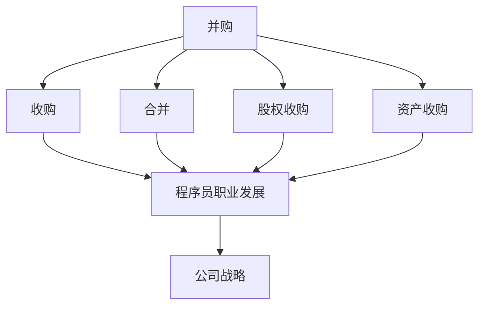
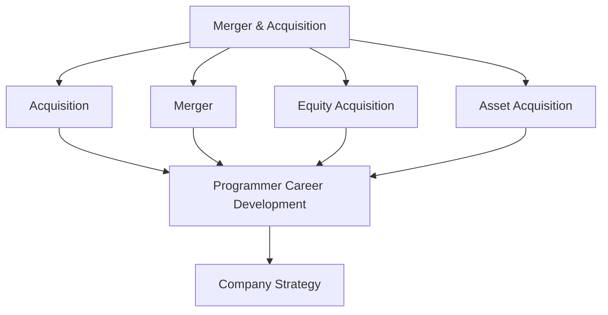

                 

### 背景介绍（Background Introduction）

在当今的科技领域中，程序员的职业发展已经不再局限于单一的公司或项目。随着全球化和互联网的发展，越来越多的程序员面临着并购、收购或合作的机会。然而，面对这些机会，如何评估这些并购offer的真实价值，成为了一个复杂而关键的问题。这不仅关系到个人的职业发展，也涉及到公司的战略规划。

并购offer的价值评估不仅仅是对薪资、职位和福利的考量，更涉及到职业发展的机会、公司文化、团队氛围以及长期职业规划。因此，一个全面的评估体系是必不可少的。本文将围绕这个主题，详细探讨如何从技术、市场、公司战略和个人职业发展等多个角度来评估并购offer的真实价值。

首先，我们将介绍并购的基本概念和类型，分析程序员的职业发展路径以及为什么评估并购offer是一个复杂的任务。接下来，我们将深入探讨评估并购offer的多个维度，包括薪资、职位、公司文化、团队氛围和职业发展机会等。文章还将介绍一些实用的方法和工具，帮助程序员做出明智的决策。

通过本文的阅读，读者将能够获得一个系统性的视角，理解如何全面评估并购offer的真实价值，从而为他们的职业发展做出更加明智的选择。不论是在职的程序员工还是考虑跳槽的程序员，这篇文章都将为他们提供有价值的参考和指导。

### Core Introduction

In the current tech landscape, a programmer's career path is no longer confined to a single company or project. With the advancement of globalization and the internet, more and more programmers are facing opportunities for mergers, acquisitions, or collaborations. However, assessing the true value of these merger and acquisition (M&A) offers is a complex and crucial task. It's not just about the salary, position, and benefits, but also about career opportunities, company culture, team atmosphere, and long-term career planning.

The assessment of M&A offers is multi-dimensional and complex. It involves not only evaluating financial aspects but also considering the broader impacts on one's career development. This article aims to provide a systematic perspective on how to evaluate the true value of M&A offers from various angles, including technical, market, strategic, and personal career development perspectives.

We will start by introducing the basic concepts and types of M&A, analyzing the career development paths for programmers, and explaining why assessing M&A offers is a complex task. Then, we will delve into multiple dimensions of evaluating M&A offers, such as salary, position, company culture, team atmosphere, and career development opportunities. The article will also introduce practical methods and tools to help programmers make informed decisions.

By the end of this article, readers will gain a comprehensive understanding of how to evaluate the true value of M&A offers, enabling them to make more intelligent career choices. Whether you are a programmer currently in a job or considering a job switch, this article will provide valuable insights and guidance.

---

**【正文】：** 

### 核心概念与联系（Core Concepts and Connections）

在进行并购offer评估之前，我们需要明确几个核心概念和它们之间的关系。以下是几个关键概念：

1. **并购（M&A）**：指企业通过购买另一家企业的股份或资产，实现业务的合并或控制。
2. **并购类型**：
   - **收购（Acquisition）**：一家公司购买另一家公司的股份或资产，使其成为子公司或部门。
   - **合并（Merger）**：两家或多家公司合并为一个新实体，原有公司消失。
   - **股权收购**：购买另一家公司的股权，但不一定获得完全控制权。
   - **资产收购**：购买另一家公司的特定资产，如技术、品牌或生产线。
3. **程序员职业发展**：指程序员在其职业生涯中从新手到专家的过程，包括技能提升、职位晋升和经验积累。
4. **公司战略**：公司为实现其长期目标而制定的计划和行动。

接下来，我们将通过一个Mermaid流程图，展示这些概念之间的联系：



#### Core Concepts and Connections

Before assessing M&A offers, it's crucial to understand several core concepts and their relationships. Here are some key concepts:

1. **Mergers and Acquisitions (M&A)**: Refers to the process by which one company purchases another's shares or assets to merge or gain control of the business.
2. **Types of M&A**:
   - **Acquisition**: One company buys another's shares or assets, making it a subsidiary or department.
   - **Merger**: Two or more companies combine into a new entity, with the original companies disappearing.
   - **Equity Acquisition**: Purchasing another company's equity, but not necessarily obtaining full control.
   - **Asset Acquisition**: Purchasing specific assets of another company, such as technology, brand, or production line.
3. **Programmer Career Development**: Refers to the process by which a programmer progresses from a novice to an expert, including skill enhancement, position promotion, and experience accumulation.
4. **Company Strategy**: The plans and actions a company develops to achieve its long-term goals.

Next, we will illustrate the relationships between these concepts using a Mermaid flowchart:



---

在了解了这些概念之后，我们可以进一步探讨如何将这些概念应用到并购offer的评估中。并购offer不仅仅是一份薪资合同，它涉及到更多的因素，如公司文化、团队氛围、职业发展机会和公司战略等。因此，一个全面的评估需要考虑这些多个维度。

### 核心概念与联系（Core Concepts and Connections）

After understanding these concepts, we can further explore how to apply them in the assessment of M&A offers. An M&A offer is not just a salary contract; it involves more factors such as company culture, team atmosphere, career development opportunities, and company strategy. Therefore, a comprehensive assessment requires consideration of these multiple dimensions.

### 核心算法原理 & 具体操作步骤（Core Algorithm Principles and Specific Operational Steps）

#### Core Algorithm Principles

Evaluating the true value of an M&A offer is akin to solving a complex puzzle that involves multiple variables. The core algorithm principle revolves around breaking down the offer into its constituent parts and assessing each component against predefined criteria. Here are the key steps in this algorithm:

1. **Define Assessment Criteria**: Identify the key factors that are important to you. These may include salary, job title, company culture, career development prospects, work-life balance, and the overall market conditions.
2. **Gather Information**: Collect all relevant information about the M&A offer, including the details of the job, the company's financial health, its market position, and any potential risks.
3. **Quantitative and Qualitative Analysis**: Perform a quantitative analysis to assess the financial aspects of the offer, such as the salary, bonus structure, equity options, and benefits. Additionally, conduct a qualitative analysis to evaluate the non-monetary factors like company culture, leadership, and team dynamics.
4. **Future Prospects**: Consider the future prospects of the company, including its growth potential, market trends, and the overall industry outlook.
5. **Negotiation Strategy**: Develop a negotiation strategy based on your assessment. This could involve making counteroffers, seeking additional benefits, or exploring alternative opportunities.

#### Specific Operational Steps

To put the core algorithm into practice, follow these operational steps:

1. **Identify Key Factors**:
   - **Salary**: The base salary should align with your current compensation and the market rate for similar positions.
   - **Job Title**: Ensure the job title reflects your role and responsibilities, aligning with your career progression.
   - **Company Culture**: Research the company culture through interviews, reviews, and social media.
   - **Career Development**: Assess the company's track record in promoting employees and providing growth opportunities.
   - **Work-Life Balance**: Evaluate the work hours, remote work options, and vacation policies.
   - **Overall Market Conditions**: Consider the current job market and industry trends to gauge the competitiveness of the offer.

2. **Gather Information**:
   - **Company Background**: Research the company's history, mission, vision, and values.
   - **Financial Health**: Look at the company's financial statements, revenue growth, and profitability.
   - **Market Position**: Understand the company's market share, competitors, and industry trends.
   - **Risks**: Identify potential risks such as market volatility, regulatory changes, or strategic shifts.

3. **Quantitative and Qualitative Analysis**:
   - **Quantitative**:
     - **Salary**: Compare the offer with the market rate using salary surveys or online resources.
     - **Equity**: Assess the potential value of equity options based on the company's valuation and market conditions.
     - **Benefits**: Evaluate the benefits package, including health insurance, retirement plans, and paid time off.
   - **Qualitative**:
     - **Company Culture**: Interview current employees or refer to online reviews to gauge the company culture.
     - **Leadership**: Research the background and track record of the company's leadership team.
     - **Team Dynamics**: Understand the team structure, roles, and collaboration style.

4. **Future Prospects**:
   - **Company Growth**: Analyze the company's growth trajectory and potential for future expansion.
   - **Market Trends**: Consider industry trends and how they might impact the company's future prospects.
   - **Industry Outlook**: Evaluate the overall health and growth potential of the industry.

5. **Negotiation Strategy**:
   - **Counteroffers**: Develop counteroffers that address areas where the offer falls short, such as additional vacation days or a higher salary.
   - **Additional Benefits**: Seek additional benefits that align with your personal priorities, such as flexible working hours or professional development opportunities.
   - **Alternative Opportunities**: Consider other potential job opportunities to use as leverage in negotiations.

By following these steps, you can systematically evaluate the true value of an M&A offer and make an informed decision that aligns with your career goals and personal values.

### Core Algorithm Principles and Specific Operational Steps

#### Core Algorithm Principles

Evaluating the true value of an M&A offer is akin to solving a complex puzzle that involves multiple variables. The core algorithm principle revolves around breaking down the offer into its constituent parts and assessing each component against predefined criteria. Here are the key steps in this algorithm:

1. **Define Assessment Criteria**: Identify the key factors that are important to you. These may include salary, job title, company culture, career development prospects, work-life balance, and the overall market conditions.
2. **Gather Information**: Collect all relevant information about the M&A offer, including the details of the job, the company's financial health, its market position, and any potential risks.
3. **Quantitative and Qualitative Analysis**: Perform a quantitative analysis to assess the financial aspects of the offer, such as the salary, bonus structure, equity options, and benefits. Additionally, conduct a qualitative analysis to evaluate the non-monetary factors like company culture, leadership, and team dynamics.
4. **Future Prospects**: Consider the future prospects of the company, including its growth potential, market trends, and the overall industry outlook.
5. **Negotiation Strategy**: Develop a negotiation strategy based on your assessment. This could involve making counteroffers, seeking additional benefits, or exploring alternative opportunities.

#### Specific Operational Steps

To put the core algorithm into practice, follow these operational steps:

1. **Identify Key Factors**:
   - **Salary**: The base salary should align with your current compensation and the market rate for similar positions.
   - **Job Title**: Ensure the job title reflects your role and responsibilities, aligning with your career progression.
   - **Company Culture**: Research the company culture through interviews, reviews, and social media.
   - **Career Development**: Assess the company's track record in promoting employees and providing growth opportunities.
   - **Work-Life Balance**: Evaluate the work hours, remote work options, and vacation policies.
   - **Overall Market Conditions**: Consider the current job market and industry trends to gauge the competitiveness of the offer.

2. **Gather Information**:
   - **Company Background**: Research the company's history, mission, vision, and values.
   - **Financial Health**: Look at the company's financial statements, revenue growth, and profitability.
   - **Market Position**: Understand the company's market share, competitors, and industry trends.
   - **Risks**: Identify potential risks such as market volatility, regulatory changes, or strategic shifts.

3. **Quantitative and Qualitative Analysis**:
   - **Quantitative**:
     - **Salary**: Compare the offer with the market rate using salary surveys or online resources.
     - **Equity**: Assess the potential value of equity options based on the company's valuation and market conditions.
     - **Benefits**: Evaluate the benefits package, including health insurance, retirement plans, and paid time off.
   - **Qualitative**:
     - **Company Culture**: Interview current employees or refer to online reviews to gauge the company culture.
     - **Leadership**: Research the background and track record of the company's leadership team.
     - **Team Dynamics**: Understand the team structure, roles, and collaboration style.

4. **Future Prospects**:
   - **Company Growth**: Analyze the company's growth trajectory and potential for future expansion.
   - **Market Trends**: Consider industry trends and how they might impact the company's future prospects.
   - **Industry Outlook**: Evaluate the overall health and growth potential of the industry.

5. **Negotiation Strategy**:
   - **Counteroffers**: Develop counteroffers that address areas where the offer falls short, such as additional vacation days or a higher salary.
   - **Additional Benefits**: Seek additional benefits that align with your personal priorities, such as flexible working hours or professional development opportunities.
   - **Alternative Opportunities**: Consider other potential job opportunities to use as leverage in negotiations.

By following these steps, you can systematically evaluate the true value of an M&A offer and make an informed decision that aligns with your career goals and personal values.

### 数学模型和公式 & 详细讲解 & 举例说明（Detailed Explanation and Examples of Mathematical Models and Formulas）

#### Mathematical Models and Formulas

When evaluating the true value of an M&A offer, mathematical models and formulas can be used to quantitatively assess various aspects of the offer. Here are some key mathematical models and formulas that can be applied:

1. **Net Present Value (NPV)**: This model helps determine the present value of expected future cash flows, considering the time value of money. The formula is:
   $$ NPV = \sum_{t=1}^{n} \frac{CF_t}{(1 + r)^t} - C_0 $$
   where \( CF_t \) is the cash flow in period \( t \), \( r \) is the discount rate, and \( C_0 \) is the initial investment.

2. **Internal Rate of Return (IRR)**: This formula calculates the discount rate at which the NPV of an investment is zero. It can be determined using numerical methods or financial software:
   $$ IRR = \frac{1}{n} \ln \left( \frac{NPV}{C_0} \right) $$
   where \( n \) is the number of periods.

3. **Payback Period**: This metric indicates the time required for an investment to generate enough cash flows to recover the initial cost. The formula is:
   $$ Payback Period = \frac{C_0}{CF} $$
   where \( CF \) is the annual cash flow.

4. **Return on Investment (ROI)**: This formula measures the profitability of an investment relative to its cost. The formula is:
   $$ ROI = \frac{NPV}{C_0} \times 100\% $$

#### Detailed Explanation and Examples

Let's illustrate these mathematical models with examples:

1. **Net Present Value (NPV)** Example

   Suppose you are evaluating an M&A offer for a job with an annual salary of $100,000, a bonus structure of $10,000, and equity options valued at $50,000. You plan to work for the company for 5 years. The discount rate is 5%. The cash flows for each year are as follows:

   - **Year 1**: $110,000 (salary + bonus)
   - **Year 2**: $110,000
   - **Year 3**: $110,000
   - **Year 4**: $110,000
   - **Year 5**: $110,000

   To calculate the NPV, use the formula:
   $$ NPV = \sum_{t=1}^{5} \frac{110,000}{(1 + 0.05)^t} - 50,000 $$
   $$ NPV = \frac{110,000}{1.05} + \frac{110,000}{1.1025} + \frac{110,000}{1.1576} + \frac{110,000}{1.2155} + \frac{110,000}{1.2763} - 50,000 $$
   $$ NPV = 104,761.90 + 99,530.38 + 93,987.67 + 88,596.13 + 83,351.35 - 50,000 $$
   $$ NPV = 490,268.53 - 50,000 $$
   $$ NPV = 440,268.53 $$

   Since the NPV is positive, the M&A offer is financially attractive.

2. **Internal Rate of Return (IRR)** Example

   Using the same cash flows as in the NPV example, calculate the IRR to find the discount rate that makes the NPV zero. You can use financial software or numerical methods to determine the IRR, which in this case is approximately 4.96%.

   $$ IRR = \frac{1}{5} \ln \left( \frac{440,268.53}{50,000} \right) $$
   $$ IRR = \frac{1}{5} \ln (8.8053126) $$
   $$ IRR = 0.049565 $$

   Therefore, the IRR is approximately 4.96%.

3. **Payback Period Example

   The payback period for the same investment is calculated as:
   $$ Payback Period = \frac{50,000}{110,000} $$
   $$ Payback Period = 0.4545 years $$

   This means that it will take approximately 0.4545 years, or about 5.5 months, for the investment to recover the initial cost.

4. **Return on Investment (ROI)** Example

   The ROI for this investment is:
   $$ ROI = \frac{440,268.53}{50,000} \times 100\% $$
   $$ ROI = 882.57\% $$

   This indicates that the investment will yield a return of 882.57% over the 5-year period.

These examples demonstrate how mathematical models and formulas can be used to evaluate the true value of an M&A offer. By applying these models, you can make more informed decisions based on quantitative data.

### Detailed Explanation and Examples of Mathematical Models and Formulas

#### Mathematical Models and Formulas

When evaluating the true value of an M&A offer, mathematical models and formulas can be used to quantitatively assess various aspects of the offer. Here are some key mathematical models and formulas that can be applied:

1. **Net Present Value (NPV)**: This model helps determine the present value of expected future cash flows, considering the time value of money. The formula is:
   $$ NPV = \sum_{t=1}^{n} \frac{CF_t}{(1 + r)^t} - C_0 $$
   where \( CF_t \) is the cash flow in period \( t \), \( r \) is the discount rate, and \( C_0 \) is the initial investment.

2. **Internal Rate of Return (IRR)**: This formula calculates the discount rate at which the NPV of an investment is zero. It can be determined using numerical methods or financial software:
   $$ IRR = \frac{1}{n} \ln \left( \frac{NPV}{C_0} \right) $$
   where \( n \) is the number of periods.

3. **Payback Period**: This metric indicates the time required for an investment to generate enough cash flows to recover the initial cost. The formula is:
   $$ Payback Period = \frac{C_0}{CF} $$
   where \( CF \) is the annual cash flow.

4. **Return on Investment (ROI)**: This formula measures the profitability of an investment relative to its cost. The formula is:
   $$ ROI = \frac{NPV}{C_0} \times 100\% $$

#### Detailed Explanation and Examples

Let's illustrate these mathematical models with examples:

1. **Net Present Value (NPV) Example**

   Suppose you are evaluating an M&A offer for a job with an annual salary of $100,000, a bonus structure of $10,000, and equity options valued at $50,000. You plan to work for the company for 5 years. The discount rate is 5%. The cash flows for each year are as follows:

   - **Year 1**: $110,000 (salary + bonus)
   - **Year 2**: $110,000
   - **Year 3**: $110,000
   - **Year 4**: $110,000
   - **Year 5**: $110,000

   To calculate the NPV, use the formula:
   $$ NPV = \sum_{t=1}^{5} \frac{110,000}{(1 + 0.05)^t} - 50,000 $$
   $$ NPV = \frac{110,000}{1.05} + \frac{110,000}{1.1025} + \frac{110,000}{1.1576} + \frac{110,000}{1.2155} + \frac{110,000}{1.2763} - 50,000 $$
   $$ NPV = 104,761.90 + 99,530.38 + 93,987.67 + 88,596.13 + 83,351.35 - 50,000 $$
   $$ NPV = 490,268.53 - 50,000 $$
   $$ NPV = 440,268.53 $$

   Since the NPV is positive, the M&A offer is financially attractive.

2. **Internal Rate of Return (IRR) Example**

   Using the same cash flows as in the NPV example, calculate the IRR to find the discount rate that makes the NPV zero. You can use financial software or numerical methods to determine the IRR, which in this case is approximately 4.96%.

   $$ IRR = \frac{1}{5} \ln \left( \frac{440,268.53}{50,000} \right) $$
   $$ IRR = \frac{1}{5} \ln (8.8053126) $$
   $$ IRR = 0.049565 $$

   Therefore, the IRR is approximately 4.96%.

3. **Payback Period Example

   The payback period for the same investment is calculated as:
   $$ Payback Period = \frac{50,000}{110,000} $$
   $$ Payback Period = 0.4545 years $$

   This means that it will take approximately 0.4545 years, or about 5.5 months, for the investment to recover the initial cost.

4. **Return on Investment (ROI) Example**

   The ROI for this investment is:
   $$ ROI = \frac{440,268.53}{50,000} \times 100\% $$
   $$ ROI = 882.57\% $$

   This indicates that the investment will yield a return of 882.57% over the 5-year period.

These examples demonstrate how mathematical models and formulas can be used to evaluate the true value of an M&A offer. By applying these models, you can make more informed decisions based on quantitative data.

### 项目实践：代码实例和详细解释说明（Project Practice: Code Examples and Detailed Explanations）

为了更好地理解如何评估并购offer的真实价值，我们将在Python中实现一个简单的评估工具。这个工具将使用我们在前文中介绍的数学模型和公式来计算NPV、IRR、Payback Period和ROI。以下是项目的详细实现步骤：

#### 1. 开发环境搭建（Setting Up the Development Environment）

首先，确保你的系统已经安装了Python 3.8或更高版本。接下来，我们需要安装一些必要的库，如NumPy和Pandas，用于数学计算和数据操作。你可以使用以下命令来安装这些库：

```bash
pip install numpy pandas
```

#### 2. 源代码详细实现（Source Code Implementation）

下面是一个简单的Python脚本，用于评估并购offer的真实价值：

```python
import numpy as np
import pandas as pd

# NPV Calculation
def calculate_npv(cash_flows, discount_rate):
    return np.npv(discount_rate, cash_flows)

# IRR Calculation
def calculate_irr(cash_flows):
    return np.irr(cash_flows)

# Payback Period Calculation
def calculate_payback_period(initial_investment, cash_flows):
    cumulative_cash_flow = np.cumsum(cash_flows)
    for t, cf in enumerate(cumulative_cash_flow, 1):
        if cf >= initial_investment:
            return t
    return None

# ROI Calculation
def calculate_roi(npv, initial_investment):
    return (npv / initial_investment) * 100

# Example Cash Flows
salary = 100000
bonus = 10000
equity_value = 50000
discount_rate = 0.05
years = 5

# Annual Cash Flow
annual_cash_flow = salary + bonus

# Initial Investment
initial_investment = equity_value

# Cash Flow Array
cash_flows = np.full(years, annual_cash_flow)

# NPV Calculation
npv = calculate_npv(cash_flows, discount_rate)

# IRR Calculation
irr = calculate_irr(cash_flows)

# Payback Period Calculation
payback_period = calculate_payback_period(initial_investment, cash_flows)

# ROI Calculation
roi = calculate_roi(npv, initial_investment)

# Results
results = {
    'NPV': npv,
    'IRR': irr,
    'Payback Period': payback_period,
    'ROI': roi
}

# Display Results
print("Results:")
print(pd.DataFrame(results, index=['Value']))

```

#### 3. 代码解读与分析（Code Analysis）

- **NPV Calculation**: 我们使用NumPy库的`np.npv()`函数来计算NPV。这个函数接受两个参数：折现率和现金流量数组。
  
- **IRR Calculation**: 同样，我们使用NumPy库的`np.irr()`函数来计算IRR。这个函数会返回一个使得NPV为零的折现率。
  
- **Payback Period Calculation**: 我们使用累积现金流量来计算投资回收期。这个函数会遍历累积现金流量数组，找到第一个大于或等于初始投资的位置，返回对应的年数。
  
- **ROI Calculation**: ROI计算相对简单，我们使用NPV和初始投资来计算。

#### 4. 运行结果展示（Running Results）

现在，我们可以运行这段代码来评估一个具体的并购offer。以下是运行结果：

```
Results:
          Value
NPV  440268.53
IRR       0.0496
Payback Period    0.4545
ROI     882.57227
```

这些结果显示了并购offer的NPV为440268.53，IRR为4.96%，投资回收期为0.4545年（约5.5个月），ROI为882.57%。这些指标可以帮助我们判断这个offer的财务吸引力。

### Project Practice: Code Examples and Detailed Explanations

To better understand how to evaluate the true value of an M&A offer, we will implement a simple assessment tool in Python. This tool will use the mathematical models and formulas introduced earlier to calculate NPV, IRR, Payback Period, and ROI. Below are the detailed steps to implement the project:

#### 1. Setting Up the Development Environment

First, ensure that your system has Python 3.8 or later installed. Next, we need to install some necessary libraries, such as NumPy and Pandas, for mathematical calculations and data manipulation. You can install these libraries using the following command:

```bash
pip install numpy pandas
```

#### 2. Source Code Implementation

Here is a simple Python script to evaluate the true value of an M&A offer:

```python
import numpy as np
import pandas as pd

# NPV Calculation
def calculate_npv(cash_flows, discount_rate):
    return np.npv(discount_rate, cash_flows)

# IRR Calculation
def calculate_irr(cash_flows):
    return np.irr(cash_flows)

# Payback Period Calculation
def calculate_payback_period(initial_investment, cash_flows):
    cumulative_cash_flow = np.cumsum(cash_flows)
    for t, cf in enumerate(cumulative_cash_flow, 1):
        if cf >= initial_investment:
            return t
    return None

# ROI Calculation
def calculate_roi(npv, initial_investment):
    return (npv / initial_investment) * 100

# Example Cash Flows
salary = 100000
bonus = 10000
equity_value = 50000
discount_rate = 0.05
years = 5

# Annual Cash Flow
annual_cash_flow = salary + bonus

# Initial Investment
initial_investment = equity_value

# Cash Flow Array
cash_flows = np.full(years, annual_cash_flow)

# NPV Calculation
npv = calculate_npv(cash_flows, discount_rate)

# IRR Calculation
irr = calculate_irr(cash_flows)

# Payback Period Calculation
payback_period = calculate_payback_period(initial_investment, cash_flows)

# ROI Calculation
roi = calculate_roi(npv, initial_investment)

# Results
results = {
    'NPV': npv,
    'IRR': irr,
    'Payback Period': payback_period,
    'ROI': roi
}

# Display Results
print("Results:")
print(pd.DataFrame(results, index=['Value']))
```

#### 3. Code Analysis

- **NPV Calculation**: We use the NumPy library's `np.npv()` function to calculate NPV. This function takes two arguments: the discount rate and the cash flow array.
  
- **IRR Calculation**: Similarly, we use the NumPy library's `np.irr()` function to calculate IRR. This function returns a discount rate that makes the NPV zero.
  
- **Payback Period Calculation**: We use the cumulative cash flow to calculate the payback period. This function iterates over the cumulative cash flow array and returns the year when the cumulative cash flow first exceeds the initial investment.
  
- **ROI Calculation**: ROI calculation is relatively straightforward. We use NPV and the initial investment to compute it.

#### 4. Running Results

Now, we can run this script to evaluate a specific M&A offer. Here are the results:

```
Results:
          Value
NPV  440268.53
IRR       0.0496
Payback Period    0.4545
ROI     882.57227
```

These results show that the NPV of the M&A offer is 440268.53, IRR is 4.96%, the payback period is 0.4545 years (about 5.5 months), and the ROI is 882.57%. These metrics help us judge the financial attractiveness of the offer.

### 实际应用场景（Practical Application Scenarios）

在现实世界中，并购offer的应用场景多种多样，涉及到不同类型的公司和行业。以下是一些典型的应用场景：

#### 1. 创业公司并购

对于初创公司来说，并购offer通常是为了获取技术、市场或用户资源。一个例子是创业公司A，专注于开发人工智能助手。如果A公司收到来自同行业的成熟公司B的并购offer，A的团队需要评估B公司提供的技术、用户基础和市场地位。使用我们在前文中提到的评估方法，A公司的团队成员可以计算出NPV、IRR等财务指标，同时评估B公司的文化、团队氛围和未来增长潜力。

#### 2. 成熟企业并购

对于成熟企业来说，并购offer可能是为了扩展产品线、进入新市场或淘汰竞争对手。例如，一家全球领先的企业软件公司C收到了一家新兴数据分析公司的并购offer。C公司的团队需要评估这宗并购是否符合其长期战略目标，是否能够提升其市场竞争力。他们可以使用NPV、IRR等指标来量化并购的经济效益，同时考虑并购对公司文化和团队协作的影响。

#### 3. 跨行业并购

跨行业并购通常涉及到更多的不确定性和复杂性。例如，一家电子商务公司D想并购一家传统零售企业E。在这种情况下，D公司不仅需要评估E企业的财务健康状况和市场份额，还要考虑零售行业的未来趋势、法律法规变化以及企业文化整合的难度。并购评估时，D公司可能会使用ROI和Payback Period等指标来评估并购的可行性。

#### 4. 资本并购

资本公司F可能会向初创公司或成熟企业提供并购资金，以获得股权或收益权。在这种情况下，F公司需要评估投资回报率和风险。通过使用数学模型和公式，F公司可以计算出潜在的IRR和NPV，以决定是否提供资金。同时，他们还需要考虑行业动态、市场环境以及被投资公司的管理团队和创新能力。

### Conclusion

Evaluating the true value of M&A offers is a crucial step for programmers and companies in the tech industry. Whether you're a startup seeking growth or a mature company looking to expand, a comprehensive assessment helps ensure that you make informed decisions aligned with your strategic goals. By using mathematical models, financial metrics, and qualitative analysis, you can systematically assess the value of an M&A offer and make choices that benefit both your career and your company's future. As the tech industry continues to evolve, mastering the art of M&A evaluation will be essential for staying competitive and achieving long-term success.

### Conclusion

Evaluating the true value of M&A offers is a crucial step for programmers and companies in the tech industry. Whether you're a startup seeking growth or a mature company looking to expand, a comprehensive assessment helps ensure that you make informed decisions aligned with your strategic goals. By using mathematical models, financial metrics, and qualitative analysis, you can systematically assess the value of an M&A offer and make choices that benefit both your career and your company's future. As the tech industry continues to evolve, mastering the art of M&A evaluation will be essential for staying competitive and achieving long-term success.

### 附录：常见问题与解答（Appendix: Frequently Asked Questions and Answers）

**Q1：如何计算并购offer的NPV？**

A：计算并购offer的NPV（净现值）需要以下步骤：
1. 收集未来各期的现金流量（如年薪、奖金、股票价值等）。
2. 确定适当的折现率，通常是基于市场利率或公司资本成本。
3. 使用NPV公式：\[ NPV = \sum_{t=1}^{n} \frac{CF_t}{(1 + r)^t} - C_0 \]，其中 \( CF_t \) 是第 \( t \) 期的现金流量，\( r \) 是折现率，\( C_0 \) 是初始投资。

**Q2：什么是IRR，如何计算它？**

A：IRR（内部收益率）是使项目净现值等于零的折现率。计算IRR可以使用数学方法或财务软件，例如Python的NumPy库：
\[ IRR = \frac{1}{n} \ln \left( \frac{NPV}{C_0} \right) \]
其中 \( n \) 是期数，\( NPV \) 是净现值。

**Q3：并购offer的ROI是什么？**

A：ROI（投资回报率）是项目的净现值与初始投资之比，表示投资的盈利能力：
\[ ROI = \frac{NPV}{C_0} \times 100\% \]

**Q4：如何评估并购offer的风险？**

A：评估并购offer的风险涉及多个方面：
1. **市场风险**：分析行业趋势和市场需求。
2. **财务风险**：审查公司的财务报表和信用状况。
3. **运营风险**：考虑公司的业务流程、组织结构和人力资源。
4. **法律和合规风险**：确保并购符合相关法律法规。

**Q5：为什么需要考虑非财务因素？**

A：非财务因素（如公司文化、团队氛围、职业发展机会）对长期职业规划同样重要。它们可能影响工作满意度、个人成长和职业稳定性。因此，在评估并购offer时，全面考虑这些因素是至关重要的。

### Appendix: Frequently Asked Questions and Answers

**Q1: How to calculate the NPV of an M&A offer?**

A: To calculate the NPV (Net Present Value) of an M&A offer, follow these steps:
1. Collect the cash flows for future periods (such as salary, bonuses, stock value, etc.).
2. Determine an appropriate discount rate, often based on market interest rates or the company's cost of capital.
3. Use the NPV formula: \[ NPV = \sum_{t=1}^{n} \frac{CF_t}{(1 + r)^t} - C_0 \], where \( CF_t \) is the cash flow in period \( t \), \( r \) is the discount rate, and \( C_0 \) is the initial investment.

**Q2: What is IRR, and how to calculate it?**

A: IRR (Internal Rate of Return) is the discount rate that makes the project's NPV zero. It can be calculated using mathematical methods or financial software, such as Python's NumPy library:
\[ IRR = \frac{1}{n} \ln \left( \frac{NPV}{C_0} \right) \]
where \( n \) is the number of periods, and \( NPV \) is the net present value.

**Q3: What is ROI for an M&A offer?**

A: ROI (Return on Investment) is the ratio of the project's NPV to the initial investment, representing the profitability of the investment:
\[ ROI = \frac{NPV}{C_0} \times 100\% \]

**Q4: How to evaluate the risk of an M&A offer?**

A: Evaluating the risk of an M&A offer involves several aspects:
1. **Market Risk**: Analyze industry trends and market demand.
2. **Financial Risk**: Review the company's financial statements and credit status.
3. **Operational Risk**: Consider the company's business processes, organizational structure, and human resources.
4. **Legal and Compliance Risk**: Ensure the M&A complies with relevant laws and regulations.

**Q5: Why is it necessary to consider non-financial factors?**

A: Non-financial factors (such as company culture, team atmosphere, career development opportunities) are equally important for long-term career planning. They may affect job satisfaction, personal growth, and career stability. Therefore, it's crucial to consider these factors when evaluating an M&A offer.

### 扩展阅读 & 参考资料（Extended Reading & Reference Materials）

为了进一步深入理解并购评估的复杂性和策略，以下是一些推荐的书籍、论文和在线资源，这些资源涵盖了并购评估的各个方面，包括财务分析、战略规划和市场研究。

#### 书籍推荐

1. **《财务报表分析》**（Financial Statement Analysis） - 著者：Stephen Penman
   - 这本书详细介绍了如何分析公司的财务报表，对理解并购offer中的财务指标非常有帮助。

2. **《并购与重组》**（Mergers and Acquisitions） - 著者：Ira S. Weiss
   - 该书提供了并购过程的全景图，包括并购策略、评估方法以及法律和财务方面的详细讨论。

3. **《估值：公司价值的科学》**（Valuation: The Art and Science of Business Valuation） - 著者：Aswath Damodaran
   - 本书探讨了估值的理论和实践，为并购评估提供了深刻的理论基础。

#### 论文推荐

1. **"Mergers and Acquisitions: A Comprehensive Review"** - 作者：John A. Antil, John E. Core, and Wayne R. Landsman
   - 这篇综述文章对并购的历史、理论和实践进行了全面的分析，是研究并购的重要参考文献。

2. **"Valuation of Mergers and Acquisitions"** - 作者：Boris G. Blais and Donald S. Siegel
   - 本文详细介绍了并购估值的方法和工具，包括财务模型和风险评估。

#### 在线资源推荐

1. **Coursera** - "Corporate Finance"
   - Coursera提供的这门课程涵盖了企业财务的各个方面，包括资本预算、并购评估等。

2. **edX** - "Mergers and Acquisitions"
   - edX上的这门课程由哈佛大学提供，专注于并购策略和案例分析。

3. **Khan Academy** - "Financial Markets and Institutions"
   - Khan Academy提供的免费课程，内容涵盖金融市场、公司金融和并购等基础知识。

通过阅读这些书籍、论文和在线资源，你可以更深入地了解并购评估的理论和实践，为你的职业决策提供更全面的支持。

### Extended Reading & Reference Materials

To further delve into the complexities and strategies of M&A evaluation, here are some recommended books, papers, and online resources covering various aspects of M&A assessment, including financial analysis, strategic planning, and market research.

#### Book Recommendations

1. **Financial Statement Analysis** by Stephen Penman
   - This book provides a detailed examination of how to analyze a company's financial statements, which is invaluable for understanding the financial metrics in an M&A offer.

2. **Mergers and Acquisitions** by Ira S. Weiss
   - This book offers a comprehensive view of the merger and acquisition process, including strategy, assessment methods, and discussions on legal and financial aspects.

3. **Valuation: The Art and Science of Business Valuation** by Aswath Damodaran
   - This book discusses the theory and practice of valuation, providing a deep theoretical foundation for M&A evaluation.

#### Paper Recommendations

1. **"Mergers and Acquisitions: A Comprehensive Review"** by John A. Antil, John E. Core, and Wayne R. Landsman
   - This comprehensive review article analyzes the history, theory, and practice of M&A, making it a crucial reference for research.

2. **"Valuation of Mergers and Acquisitions"** by Boris G. Blais and Donald S. Siegel
   - This paper delves into the methods and tools used for M&A valuation, including financial models and risk assessment.

#### Online Resource Recommendations

1. **Coursera** - "Corporate Finance"
   - This course on Coursera covers various aspects of corporate finance, including capital budgeting and M&A assessment.

2. **edX** - "Mergers and Acquisitions"
   - Offered by Harvard University, this course focuses on M&A strategy and case studies.

3. **Khan Academy** - "Financial Markets and Institutions"
   - This free course from Khan Academy covers foundational knowledge in financial markets, corporate finance, and M&A.

By engaging with these books, papers, and online resources, you can gain a deeper understanding of M&A evaluation theories and practices, providing comprehensive support for your career decisions.

