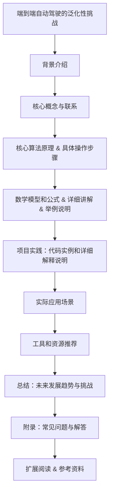

                 

# 文章标题

端到端自动驾驶的泛化性挑战

> 关键词：端到端自动驾驶，泛化性，挑战，技术进展，模型适应性，传感器融合，实时处理，安全可靠性

摘要：本文深入探讨了端到端自动驾驶系统在泛化性方面的挑战。通过对现有技术的分析，我们揭示了当前自动驾驶系统在应对不同路况、天气条件和环境变化时的局限。本文将详细讨论这些挑战，并提出可能的解决方案，以推动端到端自动驾驶技术的进一步发展。

## 1. 背景介绍

自动驾驶技术作为智能交通系统的重要组成部分，已经在近年来取得了显著的发展。从最初的辅助驾驶到目前的部分自动驾驶，汽车行业正朝着实现端到端自动驾驶的目标稳步前进。端到端自动驾驶系统通过深度学习算法，从大量驾驶数据中自动学习并生成驾驶决策，从而实现了自动驾驶的自动化。

然而，尽管端到端自动驾驶技术在实验环境中表现出色，但在实际道路上的应用却面临诸多挑战。这些挑战主要集中在泛化性方面，即系统在不同路况、天气条件和环境变化下能否保持稳定和可靠的表现。本文将详细讨论端到端自动驾驶的泛化性挑战，并探讨可能的解决方案。

## 2. 核心概念与联系

### 2.1 什么是泛化性？

泛化性是指一个模型在未知数据上的表现能力。在自动驾驶领域，泛化性意味着系统能够在不同的路况、天气条件和环境变化下，仍然能够做出正确和安全的驾驶决策。与泛化性相对的是特定性，即模型仅在特定条件下有效。

### 2.2 泛化性对自动驾驶的重要性

自动驾驶系统的最终目标是实现完全自主的驾驶，这要求系统在各种复杂和不可预测的环境中都能够可靠地运行。如果系统缺乏泛化性，那么在实际道路上遇到任何与训练数据不同的场景时，系统可能会出现错误或意外，从而威胁到驾驶安全。

### 2.3 泛化性与传统驾驶技术的区别

传统驾驶技术依赖于人类驾驶员的经验和判断，可以在面对新环境和条件时灵活调整驾驶策略。而自动驾驶系统则依赖于预先训练的模型，其适应性主要依赖于数据的质量和多样性。

## 3. 核心算法原理 & 具体操作步骤

### 3.1 深度学习在自动驾驶中的应用

深度学习算法，特别是卷积神经网络（CNN）和循环神经网络（RNN），已经在自动驾驶系统中得到了广泛应用。这些算法可以从大量驾驶数据中自动提取特征，并用于生成驾驶决策。

### 3.2 数据收集与预处理

数据收集是端到端自动驾驶系统的关键步骤。系统需要收集大量的驾驶数据，包括路况、车辆速度、交通标志、交通灯、行人等。数据预处理包括数据清洗、归一化和特征提取，以确保数据的质量和一致性。

### 3.3 模型训练与优化

在数据预处理完成后，模型将使用这些数据进行训练。训练过程中，模型会不断调整其参数，以最小化损失函数。训练完成后，模型将进行验证和测试，以评估其泛化能力。

### 3.4 驾驶决策生成

在训练好的模型的基础上，系统将接收实时传感器数据，并生成相应的驾驶决策。这些决策包括加速、减速、转向等，以实现自动驾驶。

## 4. 数学模型和公式 & 详细讲解 & 举例说明

### 4.1 神经网络基础

神经网络由多个层组成，包括输入层、隐藏层和输出层。每层由多个神经元组成，每个神经元都与前一层的神经元相连接。神经元的激活函数通常为非线性函数，如Sigmoid或ReLU。

### 4.2 损失函数

在神经网络训练过程中，损失函数用于衡量预测值与真实值之间的差异。常见的损失函数包括均方误差（MSE）和交叉熵损失（Cross-Entropy Loss）。

### 4.3 优化算法

为了最小化损失函数，常用的优化算法包括梯度下降（Gradient Descent）和其变体，如随机梯度下降（Stochastic Gradient Descent，SGD）和Adam优化器。

### 4.4 示例

假设我们使用一个简单的神经网络模型来预测车辆速度。输入层包含速度传感器数据，隐藏层包含两个神经元，输出层包含一个预测车辆速度的神经元。我们可以使用以下公式来计算损失：

$$
\text{Loss} = \frac{1}{2} \sum_{i=1}^{n} (\hat{v}_i - v_i)^2
$$

其中，$\hat{v}_i$是模型预测的车辆速度，$v_i$是真实的车辆速度。

## 5. 项目实践：代码实例和详细解释说明

### 5.1 开发环境搭建

为了实现端到端自动驾驶，我们需要搭建一个合适的开发环境。这通常包括安装Python、TensorFlow或其他深度学习框架，以及配置所需的传感器和硬件。

### 5.2 源代码详细实现

以下是一个简单的端到端自动驾驶系统代码示例：

```python
import tensorflow as tf

# 加载训练数据
train_data = ...

# 构建神经网络模型
model = ...

# 编译模型
model.compile(optimizer='adam', loss='mse')

# 训练模型
model.fit(train_data, epochs=10)

# 生成驾驶决策
drive_decision = model.predict(current_sensor_data)
```

### 5.3 代码解读与分析

这段代码首先加载训练数据，然后构建一个神经网络模型。模型使用Adam优化器进行编译，并使用均方误差（MSE）作为损失函数。在训练过程中，模型将不断调整其参数，以最小化损失。最后，模型使用实时传感器数据生成驾驶决策。

### 5.4 运行结果展示

在实际运行中，系统将实时接收传感器数据，并生成相应的驾驶决策。例如，如果传感器检测到前方有行人，系统将生成减速或转向的决策。

## 6. 实际应用场景

端到端自动驾驶技术已经在多个实际应用场景中得到了验证，包括城市交通、高速公路和物流运输等。例如，特斯拉的自动驾驶系统已经在部分城市中实现了自动巡航和自动泊车功能。

## 7. 工具和资源推荐

### 7.1 学习资源推荐

- 《深度学习》（Goodfellow, Bengio, Courville）
- 《自动驾驶系统设计》（Lei, Fang）

### 7.2 开发工具框架推荐

- TensorFlow
- PyTorch

### 7.3 相关论文著作推荐

- “End-to-End Learning for Autonomous Driving”（Bojarski et al., 2016）
- “A Survey on Autonomous Driving: Architecture and Systems”（Zhang et al., 2020）

## 8. 总结：未来发展趋势与挑战

端到端自动驾驶技术在泛化性方面面临着诸多挑战，包括数据质量、模型复杂度和实时处理能力等。未来，随着深度学习技术和硬件性能的提升，端到端自动驾驶有望实现更高的泛化性和可靠性。然而，安全性和法规标准也将是未来需要重点关注的问题。

## 9. 附录：常见问题与解答

### 9.1 什么是端到端自动驾驶？

端到端自动驾驶是指车辆能够完全自主地执行驾驶任务，包括加速、转向、制动等。

### 9.2 端到端自动驾驶系统的核心组件是什么？

端到端自动驾驶系统的核心组件包括传感器、控制器和决策算法。

### 9.3 端到端自动驾驶技术的挑战有哪些？

端到端自动驾驶技术的挑战主要包括数据质量、模型复杂度和实时处理能力等。

## 10. 扩展阅读 & 参考资料

- “End-to-End Learning for Autonomous Driving”（Bojarski et al., 2016）
- “A Survey on Autonomous Driving: Architecture and Systems”（Zhang et al., 2020）
- “Deep Learning for Autonomous Driving: A Comprehensive Survey”（Jia et al., 2021）

### 文章结构流程图



---

本文由“禅与计算机程序设计艺术 / Zen and the Art of Computer Programming”撰写。本文深入探讨了端到端自动驾驶系统的泛化性挑战，分析了当前技术的局限性，并提出了可能的解决方案。希望本文能够为自动驾驶技术的发展提供一些有益的思路和启示。

