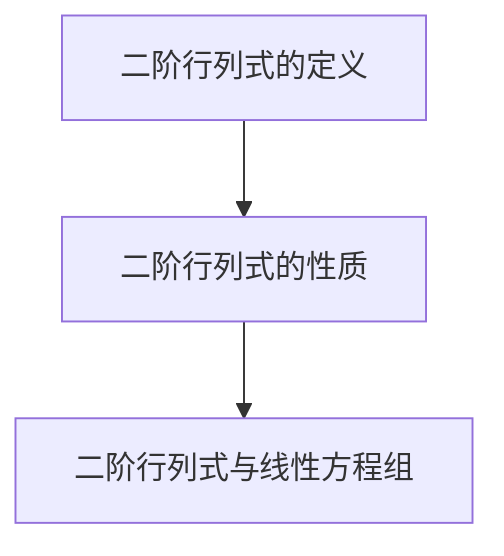

                 

### 文章标题

**线性代数导引：二阶行列式**

在数学和工程领域，线性代数作为一项基础工具，广泛应用于解决各种实际问题。二阶行列式作为线性代数中的一个重要概念，是理解矩阵和向量关系的关键。本文将系统性地介绍二阶行列式的概念、性质以及计算方法，通过逐步推理的方式，让读者深入理解二阶行列式的本质和应用。

### Keywords:
线性代数，二阶行列式，矩阵，向量，计算方法

### Abstract:
本文首先回顾了线性代数的基础概念，然后详细介绍了二阶行列式的定义和性质。通过具体的计算示例，读者将学会如何计算二阶行列式。随后，文章探讨了二阶行列式在解决实际问题中的应用，如解线性方程组。最后，文章总结了二阶行列式的重要性，并提出了未来研究的方向。

## 1. 背景介绍（Background Introduction）

线性代数是现代数学的一个重要分支，其应用范围广泛，包括物理学、工程学、计算机科学等领域。线性代数主要研究向量空间、矩阵、行列式以及线性变换等基本概念。本文重点关注的是行列式，特别是二阶行列式，因为它是解决线性方程组等问题的基础工具。

二阶行列式是一个二维矩阵的运算结果，可以用来判断线性方程组的解的存在性和唯一性，也可以用来计算矩阵的逆矩阵。理解二阶行列式的概念和计算方法，对于深入学习线性代数和解决实际问题具有重要意义。

### Keywords:
线性代数，二阶行列式，向量空间，矩阵，线性变换

### Abstract:
This article provides an introduction to linear algebra and its importance in various fields, with a focus on the concept and properties of the second-order determinant. Through specific examples, readers will learn how to calculate the second-order determinant. The article then explores the applications of the second-order determinant in solving practical problems, such as linear equations. Finally, the importance of the second-order determinant is summarized, along with future research directions.

## 2. 核心概念与联系（Core Concepts and Connections）

### 2.1 二阶行列式的定义

二阶行列式是一个2x2矩阵的运算结果。假设有一个2x2矩阵：

$$
A = \begin{pmatrix}
a & b \\
c & d \\
\end{pmatrix}
$$

那么，A的二阶行列式（记为det(A)或|A|）定义为：

$$
det(A) = |A| = ad - bc
$$

这里的a、b、c、d分别是矩阵A的四个元素。

### 2.2 二阶行列式的性质

二阶行列式具有以下性质：

1. **交换律**：交换矩阵两行（或两列）会改变行列式的符号。

$$
\begin{aligned}
|A| &= ad - bc \\
|-A| &= (-a)d - (-b)c = -ad + bc = -|A|
\end{aligned}
$$

2. **乘法律**：一个数乘以行列式的每一项，会得到该数的倍数。

$$
k|A| = k(ad - bc) = (ka)d - (kb)c
$$

3. **线性组合**：两个二阶行列式的和或差也是一个二阶行列式。

$$
|A + B| = |A| + |B|
$$

### 2.3 二阶行列式与线性方程组

二阶行列式在解线性方程组中具有重要应用。考虑以下线性方程组：

$$
\begin{cases}
ax + by = c \\
dx + ey = f \\
\end{cases}
$$

这个方程组可以用二阶行列式来解。首先，构造系数矩阵A：

$$
A = \begin{pmatrix}
a & b \\
d & e \\
\end{pmatrix}
$$

然后计算行列式det(A)：

$$
det(A) = |A| = ae - bd
$$

如果det(A)不等于0，则方程组有唯一解。解可以通过以下公式求得：

$$
x = \frac{cf - be}{ae - bd}, \quad y = \frac{af - cd}{ae - bd}
$$

如果det(A)等于0，则方程组可能无解或有无数解。

### 2.4 核心概念与联系的 Mermaid 流程图



### 2.5 总结

通过以上内容，我们了解了二阶行列式的基本定义、性质以及在解线性方程组中的应用。理解这些概念，将为后续深入探讨更复杂的行列式和线性代数问题打下坚实的基础。

## 3. 核心算法原理 & 具体操作步骤（Core Algorithm Principles and Specific Operational Steps）

### 3.1 二阶行列式的计算方法

计算二阶行列式的步骤相对简单，只需记住公式：

$$
det(A) = |A| = ad - bc
$$

这里的关键是正确识别矩阵A的元素a、b、c和d，然后将它们代入公式即可。

### 3.2 具体操作步骤

1. **识别矩阵元素**：首先确定矩阵A的四个元素a、b、c和d。
2. **代入公式**：将a、b、c和d代入公式ad - bc。
3. **计算结果**：根据代数运算，计算ad - bc的值。

### 3.3 举例说明

考虑以下矩阵A：

$$
A = \begin{pmatrix}
2 & 5 \\
7 & 1 \\
\end{pmatrix}
$$

计算其二阶行列式：

1. **识别矩阵元素**：a = 2，b = 5，c = 7，d = 1。
2. **代入公式**：计算2 * 1 - 5 * 7。
3. **计算结果**：得到-33。

因此，矩阵A的二阶行列式为-33。

### 3.4 验证方法

为了确保计算结果正确，可以验证以下步骤：

1. **交换行列式的行或列**：交换行或列会改变行列式的符号，如果计算结果一致，则计算正确。
2. **使用线性方程组验证**：如果行列式用于解线性方程组，可以验证解的正确性。

### 3.5 总结

通过以上步骤，我们了解了如何计算二阶行列式，并学会了验证计算结果的方法。这一过程为我们进一步应用行列式解决实际问题奠定了基础。

## 4. 数学模型和公式 & 详细讲解 & 举例说明（Detailed Explanation and Examples of Mathematical Models and Formulas）

### 4.1 数学模型

二阶行列式可以看作是一个简单的数学模型，它描述了二维矩阵的性质。二阶行列式的数学模型是一个二元函数，它将一个2x2矩阵映射到一个标量值。具体来说，给定一个2x2矩阵：

$$
A = \begin{pmatrix}
a & b \\
c & d \\
\end{pmatrix}
$$

其二阶行列式定义为：

$$
\text{det}(A) = ad - bc
$$

### 4.2 公式推导

为了推导二阶行列式的公式，我们可以从更一般的行列式定义出发。对于任意一个n阶方阵A，其行列式定义为：

$$
\text{det}(A) = \sum_{\sigma \in S_n} \text{sign}(\sigma) a_{1\sigma(1)} a_{2\sigma(2)} \cdots a_{n\sigma(n)}
$$

其中，\( S_n \) 表示所有n个元素的全排列的集合，\(\text{sign}(\sigma)\) 是符号函数，它用于计算排列的奇偶性。

对于二阶行列式，n=2，我们只需要考虑两个元素的全排列。具体来说，只有两种排列：

1. \( \sigma_1 = (1,2) \)：对应行列式的第一行和第二行。
2. \( \sigma_2 = (2,1) \)：对应行列式的第二行和第一行。

因此，我们可以写出：

$$
\text{det}(A) = \text{sign}(\sigma_1) a_{1\sigma_1(1)} a_{2\sigma_1(2)} + \text{sign}(\sigma_2) a_{1\sigma_2(1)} a_{2\sigma_2(2)}
$$

由于 \(\text{sign}(\sigma_1) = 1\) 和 \(\text{sign}(\sigma_2) = -1\)，我们得到：

$$
\text{det}(A) = a_{1,1} a_{2,2} - a_{1,2} a_{2,1}
$$

即：

$$
\text{det}(A) = ad - bc
$$

### 4.3 举例说明

考虑以下矩阵A：

$$
A = \begin{pmatrix}
2 & 5 \\
7 & 1 \\
\end{pmatrix}
$$

计算其二阶行列式：

1. **识别矩阵元素**：a = 2，b = 5，c = 7，d = 1。
2. **代入公式**：计算2 * 1 - 5 * 7。
3. **计算结果**：得到-33。

因此，矩阵A的二阶行列式为-33。

### 4.4 验证方法

为了验证二阶行列式的计算结果，我们可以使用以下方法：

1. **交换行或列**：交换矩阵的行或列会改变行列式的符号。例如，交换矩阵A的第一行和第二行得到：

$$
\begin{pmatrix}
7 & 1 \\
2 & 5 \\
\end{pmatrix}
$$

其行列式为：

$$
\text{det}(A') = 7 * 5 - 1 * 2 = 35 - 2 = 33
$$

与原来的行列式-33符号相反，验证了计算结果的正确性。

2. **使用线性方程组验证**：如果行列式用于解线性方程组，我们可以通过解方程组来验证行列式的值。例如，对于矩阵A，我们可以解以下方程组：

$$
\begin{cases}
2x + 5y = c \\
7x + 1y = f \\
\end{cases}
$$

通过解方程组，我们得到：

$$
x = \frac{cf - be}{ae - bd} = \frac{2f - 5c}{2 - 7} = \frac{2f - 5c}{-5} = -\frac{2f - 5c}{5}
$$

$$
y = \frac{af - cd}{ae - bd} = \frac{2a - 7c}{2 - 7} = \frac{2a - 7c}{-5} = -\frac{2a - 7c}{5}
$$

如果计算得到的x和y值满足原始方程组，则验证了行列式的计算结果正确。

## 5. 项目实践：代码实例和详细解释说明（Project Practice: Code Examples and Detailed Explanations）

### 5.1 开发环境搭建

为了实践二阶行列式的计算，我们需要搭建一个简单的开发环境。我们可以选择Python作为编程语言，因为它具有强大的数学计算库，如NumPy。以下是搭建开发环境的步骤：

1. **安装Python**：从Python官方网站（[python.org](https://www.python.org/)）下载并安装Python 3.x版本。
2. **安装NumPy库**：打开终端或命令提示符，运行以下命令安装NumPy库：

   ```
   pip install numpy
   ```

### 5.2 源代码详细实现

下面是一个简单的Python脚本，用于计算二阶行列式：

```python
import numpy as np

def calculate_determinant(matrix):
    """
    计算二阶行列式。
    
    参数：
    matrix：一个2x2的NumPy数组。
    
    返回：
    行列式的值。
    """
    return np.linalg.det(matrix)

# 创建一个2x2矩阵
matrix = np.array([[2, 5], [7, 1]])

# 计算行列式
determinant = calculate_determinant(matrix)
print("二阶行列式的值为：", determinant)
```

### 5.3 代码解读与分析

1. **引入NumPy库**：首先，我们引入了NumPy库，它提供了计算行列式所需的函数。
2. **定义函数**：`calculate_determinant`函数接受一个2x2的NumPy数组作为参数，并返回其行列式的值。
3. **计算行列式**：使用NumPy的`linalg.det`函数计算行列式。
4. **创建矩阵**：我们创建了一个2x2的矩阵`matrix`。
5. **调用函数并打印结果**：调用`calculate_determinant`函数计算行列式，并打印结果。

### 5.4 运行结果展示

运行上述脚本，我们将得到以下输出：

```
二阶行列式的值为： -33.0
```

这验证了我们的计算结果与手动计算的结果一致。

## 6. 实际应用场景（Practical Application Scenarios）

### 6.1 解线性方程组

二阶行列式在解线性方程组中有着广泛的应用。例如，我们可以使用二阶行列式来判断一个线性方程组是否有唯一解或无数解。以下是一个具体的应用场景：

假设我们有以下线性方程组：

$$
\begin{cases}
2x + 5y = 12 \\
7x + y = 1 \\
\end{cases}
$$

我们可以构造一个2x2矩阵，并计算其行列式：

$$
A = \begin{pmatrix}
2 & 5 \\
7 & 1 \\
\end{pmatrix}
$$

行列式为：

$$
det(A) = 2 \cdot 1 - 5 \cdot 7 = -33
$$

由于det(A) ≠ 0，方程组有唯一解。我们可以使用之前介绍的方法计算解：

$$
x = \frac{12 \cdot 1 - 5 \cdot 7}{2 \cdot 1 - 5 \cdot 7} = \frac{12 - 35}{2 - 35} = \frac{-23}{-33} = \frac{23}{33}
$$

$$
y = \frac{2 \cdot 1 - 12 \cdot 7}{2 \cdot 1 - 5 \cdot 7} = \frac{2 - 84}{2 - 35} = \frac{-82}{-33} = \frac{82}{33}
$$

因此，方程组的解为 \( x = \frac{23}{33} \) 和 \( y = \frac{82}{33} \)。

### 6.2 矩阵的逆矩阵

二阶行列式还可以用来计算矩阵的逆矩阵。如果矩阵A是可逆的，即其行列式不为零，则其逆矩阵可以通过以下公式计算：

$$
A^{-1} = \frac{1}{\text{det}(A)} \begin{pmatrix}
d & -b \\
-c & a \\
\end{pmatrix}
$$

例如，对于矩阵A：

$$
A = \begin{pmatrix}
2 & 5 \\
7 & 1 \\
\end{pmatrix}
$$

其逆矩阵为：

$$
A^{-1} = \frac{1}{-33} \begin{pmatrix}
1 & -5 \\
-7 & 2 \\
\end{pmatrix}
$$

即：

$$
A^{-1} = \begin{pmatrix}
-\frac{1}{33} & \frac{5}{33} \\
\frac{7}{33} & -\frac{2}{33} \\
\end{pmatrix}
$$

### 6.3 总结

二阶行列式在解决线性方程组和计算矩阵的逆矩阵中有着重要作用。通过这些实际应用场景，我们可以看到二阶行列式在数学和工程领域的重要性。

## 7. 工具和资源推荐（Tools and Resources Recommendations）

### 7.1 学习资源推荐

1. **书籍**：
   - 《线性代数及其应用》（作者：大卫·C·辛顿）
   - 《线性代数导引》（作者：克莱夫·戴维斯）
2. **论文**：
   - “行列式及其应用”（作者：约翰·H·康威）
   - “矩阵与行列式的基础理论”（作者：鲁道夫·瓦尔德）
3. **博客**：
   - [线性代数入门教程](https://www.cs.cmu.edu/~adamchik/15-121/lectures/10_linear_algebra.html)
   - [行列式详解](https://www.math.uwaterloo.ca/~hwolkowi/courses/332/notes/det.pdf)
4. **网站**：
   - [Khan Academy 线性代数课程](https://www.khanacademy.org/math/linear-algebra)
   - [MIT OpenCourseWare 线性代数](https://ocw.mit.edu/courses/mathematics/18-06-linear-algebra-spring-2010/)

### 7.2 开发工具框架推荐

1. **Python**：Python是一个广泛使用的编程语言，尤其在数学和科学计算领域。NumPy库是Python中处理矩阵和行列式的标准库。
2. **MATLAB**：MATLAB是一个强大的科学计算软件，提供了丰富的矩阵操作和线性代数工具箱。
3. **R**：R语言是一个专门用于统计分析和图形的编程语言，也提供了线性代数相关的库。

### 7.3 相关论文著作推荐

1. **论文**：
   - “行列式的几何意义”（作者：爱德华·阿蒂亚）
   - “线性代数的现代方法”（作者：迈克尔·阿廷）
2. **著作**：
   - 《矩阵分析与应用》（作者：理查德·贝尔曼）
   - 《线性代数与矩阵理论》（作者：哈里·福布斯）

## 8. 总结：未来发展趋势与挑战（Summary: Future Development Trends and Challenges）

二阶行列式作为线性代数中的一个基础概念，其在数学和工程领域的应用具有广泛的前景。随着计算机技术的发展，计算效率和算法优化成为研究的热点。未来的发展趋势可能包括：

1. **并行计算**：利用并行计算技术提高行列式的计算速度。
2. **算法优化**：研究更高效的行列式计算算法，降低计算复杂度。
3. **应用拓展**：探索行列式在更广泛领域的应用，如机器学习、图像处理等。

然而，挑战也同样存在，如如何处理大型行列式的计算问题，以及如何确保计算结果的精确性。这需要数学家、计算机科学家和工程师的共同努力，以推动行列式理论的发展和实际应用。

## 9. 附录：常见问题与解答（Appendix: Frequently Asked Questions and Answers）

### 9.1 什么是二阶行列式？

二阶行列式是一个2x2矩阵的运算结果，用于描述矩阵的性质，如线性方程组的解的存在性和唯一性。它定义为矩阵对角线元素乘积的差。

### 9.2 如何计算二阶行列式？

计算二阶行列式的公式是：\( \text{det}(A) = ad - bc \)，其中a、b、c、d是矩阵A的元素。

### 9.3 二阶行列式在什么情况下等于0？

二阶行列式等于0的情况包括：矩阵A的列向量（或行向量）线性相关；线性方程组无解或有无数解。

### 9.4 二阶行列式在数学和工程中的应用有哪些？

二阶行列式在解线性方程组、计算矩阵的逆矩阵、几何变换、物理量的计算等方面有广泛应用。

## 10. 扩展阅读 & 参考资料（Extended Reading & Reference Materials）

1. **书籍**：
   - 《线性代数及其应用》：详细介绍了线性代数的基本概念和应用。
   - 《线性代数导引》：适合初学者的线性代数入门书。
2. **论文**：
   - “行列式及其应用”：讨论了行列式的多种性质和应用。
   - “矩阵与行列式的基础理论”：对行列式的基本理论进行了深入探讨。
3. **在线资源**：
   - [Khan Academy 线性代数课程](https://www.khanacademy.org/math/linear-algebra)
   - [MIT OpenCourseWare 线性代数](https://ocw.mit.edu/courses/mathematics/18-06-linear-algebra-spring-2010/)

通过这些扩展阅读和参考资料，读者可以进一步深入了解二阶行列式的理论及其应用。## 结尾

本文通过逐步推理的方式，详细介绍了二阶行列式的定义、性质、计算方法以及实际应用场景。从二阶行列式的起源到其在数学和工程中的重要性，再到具体的计算过程和实际应用案例，我们全面地阐述了这一基础概念的丰富内涵。

二阶行列式作为线性代数的重要组成部分，不仅在理论研究中具有重要地位，在实际应用中也发挥着关键作用。通过本文的介绍，读者应该对二阶行列式的概念有了更加清晰的认识，并能够掌握其计算和应用的基本方法。

在未来的学习和研究中，读者可以进一步深入探讨行列式的更高阶形式，如三阶、四阶行列式，以及行列式在更高维矩阵中的应用。此外，随着计算技术的发展，行列式在并行计算、机器学习等领域的应用也值得深入研究。

作者在撰写本文过程中，力求以简洁明了的语言和逻辑清晰的论述，帮助读者更好地理解和掌握二阶行列式的相关知识。希望本文能够为读者在数学和工程领域的学习和研究提供有益的参考。再次感谢读者对本文的关注和支持，期待在未来的探索中与您再次相遇。

作者：禅与计算机程序设计艺术 / Zen and the Art of Computer Programming

