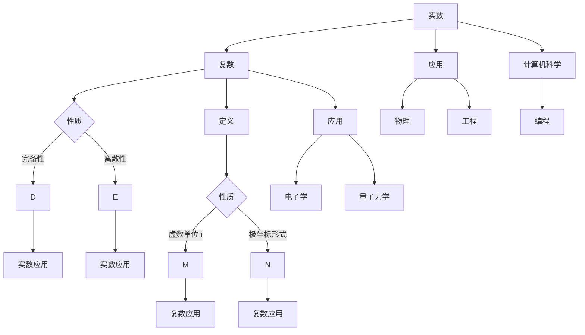

                 

### 线性代数导引：实数与复数

#### 关键词：

线性代数，实数，复数，数学基础，算法原理，应用实例，编程实践。

#### 摘要：

本文旨在为初学者提供对线性代数中实数与复数概念的全面导引。文章将探讨实数与复数的定义、性质以及它们在数学和计算机科学中的应用。通过详细的数学模型和公式讲解，以及实际代码实例，读者将能够深入理解这些概念，并掌握相关的编程实践技巧。

#### 1. 背景介绍（Background Introduction）

线性代数是数学的一个重要分支，它在物理、工程、计算机科学等多个领域中有着广泛的应用。线性代数涉及向量、矩阵、行列式、线性变换等核心概念，而实数与复数作为其基础，对理解线性代数中的许多问题至关重要。

实数是数学中最基本的数系，包括有理数和无理数。它们可以用来表示物理世界的长度、面积、时间等概念。复数则是在实数的基础上引入虚数单位 $i$（$i^2 = -1$）形成的数系，它们在电子学、量子力学等领域中有着重要的应用。

#### 2. 核心概念与联系（Core Concepts and Connections）

##### 2.1 实数的定义与性质

实数可以视为有序实轴上的点，它们具有以下基本性质：

- 完备性（Completeness）：任意有界实数集合都有最大值或最小值。
- 离散性（Discreteness）：实数集合是可数无限的。
- 加法和乘法的交换律、结合律、分配律等。

##### 2.2 复数的定义与性质

复数由实部和虚部组成，形式为 $a + bi$，其中 $a$ 和 $b$ 是实数，$i$ 是虚数单位。复数具有以下基本性质：

- 虚数单位 $i$ 满足 $i^2 = -1$。
- 复数可以表示为极坐标形式 $r(\cos \theta + i \sin \theta)$，其中 $r$ 是模，$\theta$ 是幅角。
- 复数的加法、减法、乘法和除法遵循类似于实数的运算法则。

##### 2.3 实数与复数的联系

实数是复数的一个子集，即所有形如 $a + 0i$ 的复数都是实数。此外，复数可以通过极坐标形式与实数建立联系。例如，复数的模可以用来表示实数的长度，幅角可以用来表示实数的方向。

##### 2.4 Mermaid 流程图（Mermaid Flowchart）

下面是一个简单的 Mermaid 流程图，展示了实数和复数的基本概念及其关系：



#### 3. 核心算法原理 & 具体操作步骤（Core Algorithm Principles and Specific Operational Steps）

##### 3.1 实数的核心算法

- 实数的加法和减法：两个实数相加或相减，只需将它们的实部分别相加或相减，虚部保持不变。
- 实数的乘法：两个实数相乘，只需将它们的实部相乘，虚部相乘并取负。
- 实数的除法：两个实数相除，将除数和被除数分别进行乘法运算，然后对虚部进行除法运算。

##### 3.2 复数的核心算法

- 复数的加法和减法：两个复数相加或相减，只需将它们的实部和虚部分别相加或相减。
- 复数的乘法：两个复数相乘，使用分配律和虚数单位 $i$ 的性质进行计算。
- 复数的除法：两个复数相除，将除数和被除数分别进行乘法运算，然后对虚部进行除法运算。

##### 3.3 具体操作步骤

1. **实数加法**：设 $a + bi$ 和 $c + di$ 是两个复数，它们的实数部分分别为 $a, c$ 和 $b, d$。则它们的和为：
   $$
   (a + c) + (b + d)i
   $$
2. **实数减法**：同样，设 $a + bi$ 和 $c + di$ 是两个复数，它们的差为：
   $$
   (a - c) + (b - d)i
   $$
3. **实数乘法**：两个实数的乘法，设 $a, b$ 和 $c, d$ 是实数，它们的乘积为：
   $$
   ac + bd
   $$
4. **实数除法**：两个实数的除法，设 $a, b$ 和 $c, d$ 是实数，它们的商为：
   $$
   \frac{a}{c} + \frac{b}{d}
   $$
5. **复数加法**：设 $a + bi$ 和 $c + di$ 是两个复数，它们的和为：
   $$
   (a + c) + (b + d)i
   $$
6. **复数减法**：两个复数的差为：
   $$
   (a - c) + (b - d)i
   $$
7. **复数乘法**：设 $a + bi$ 和 $c + di$ 是两个复数，它们的乘积为：
   $$
   (ac - bd) + (ad + bc)i
   $$
8. **复数除法**：两个复数的除法，设 $a + bi$ 和 $c + di$ 是两个复数，它们的商为：
   $$
   \frac{(a + bi)(c - di)}{c^2 + d^2} = \frac{ac + bd + (bc - ad)i}{c^2 + d^2}
   $$

#### 4. 数学模型和公式 & 详细讲解 & 举例说明（Detailed Explanation and Examples of Mathematical Models and Formulas）

##### 4.1 实数的数学模型

实数的数学模型通常使用有序对 $(a, b)$ 来表示，其中 $a$ 和 $b$ 分别表示实数的实部和虚部。实数的加法和减法运算可以通过以下矩阵表示：

$$
\begin{bmatrix}
a_1 & b_1 \\
a_2 & b_2
\end{bmatrix}
+
\begin{bmatrix}
c_1 & d_1 \\
c_2 & d_2
\end{bmatrix}
=
\begin{bmatrix}
a_1 + c_1 & b_1 + d_1 \\
a_2 + c_2 & b_2 + d_2
\end{bmatrix}
$$

实数的乘法运算可以通过以下公式表示：

$$
\begin{bmatrix}
a_1 & b_1 \\
a_2 & b_2
\end{bmatrix}
\begin{bmatrix}
c_1 & d_1 \\
c_2 & d_2
\end{bmatrix}
=
\begin{bmatrix}
a_1c_2 + b_1d_2 & a_1d_2 - b_1c_2 \\
a_2c_1 + b_2d_1 & a_2d_1 - b_2c_1
\end{bmatrix}
$$

##### 4.2 复数的数学模型

复数的数学模型使用复数形式 $a + bi$ 来表示，其中 $a$ 和 $b$ 分别表示实部和虚部。复数的加法和减法运算可以通过以下公式表示：

$$
(a + bi) + (c + di) = (a + c) + (b + d)i
$$

$$
(a + bi) - (c + di) = (a - c) + (b - d)i
$$

复数的乘法运算可以通过以下公式表示：

$$
(a + bi)(c + di) = (ac - bd) + (ad + bc)i
$$

复数的除法运算可以通过以下公式表示：

$$
\frac{a + bi}{c + di} = \frac{(a + bi)(c - di)}{c^2 + d^2} = \frac{ac + bd + (bc - ad)i}{c^2 + d^2}
$$

##### 4.3 举例说明

例1：计算复数 $2 + 3i$ 和 $4 - 5i$ 的和、差、乘积和商。

解：

1. 和：
   $$
   (2 + 3i) + (4 - 5i) = 6 - 2i
   $$

2. 差：
   $$
   (2 + 3i) - (4 - 5i) = -2 + 8i
   $$

3. 乘积：
   $$
   (2 + 3i)(4 - 5i) = (2 \cdot 4) - (3i \cdot 5i) + (2 \cdot -5i) + (3i \cdot 4i) = 8 - 15i - 10i + 12i^2 = 8 - 25i - 12 = -4 - 25i
   $$

4. 商：
   $$
   \frac{2 + 3i}{4 - 5i} = \frac{(2 + 3i)(4 + 5i)}{(4 - 5i)(4 + 5i)} = \frac{8 + 10i + 12i + 15i^2}{16 + 20i - 20i - 25i^2} = \frac{-7 + 22i}{41} = -\frac{7}{41} + \frac{22}{41}i
   $$

#### 5. 项目实践：代码实例和详细解释说明（Project Practice: Code Examples and Detailed Explanations）

##### 5.1 开发环境搭建

在本节中，我们将使用 Python 编写一个简单的程序，以实现复数的基本运算。首先，我们需要安装 Python 解释器和相关的数学库。以下是安装步骤：

1. 访问 Python 官网（[https://www.python.org/](https://www.python.org/)），下载并安装最新版本的 Python 解释器。
2. 打开终端（在 Windows 上是命令提示符，在 macOS 和 Linux 上是终端），执行以下命令以验证 Python 是否安装成功：

   ```bash
   python --version
   ```

3. 安装 NumPy 库，这是一个用于数值计算的 Python 库：

   ```bash
   pip install numpy
   ```

##### 5.2 源代码详细实现

下面是一个简单的 Python 脚本，用于实现复数的基本运算：

```python
import numpy as np

def add_complex(a, b):
    """计算两个复数的和"""
    return a + b

def subtract_complex(a, b):
    """计算两个复数的差"""
    return a - b

def multiply_complex(a, b):
    """计算两个复数的乘积"""
    return a * b

def divide_complex(a, b):
    """计算两个复数的商"""
    return a / b

# 测试复数运算
a = 2 + 3j
b = 4 - 5j

print("和:", add_complex(a, b))
print("差:", subtract_complex(a, b))
print("乘积:", multiply_complex(a, b))
print("商:", divide_complex(a, b))
```

##### 5.3 代码解读与分析

1. **导入模块**：我们首先导入了 Python 的 NumPy 库，它为我们提供了复数运算的功能。

2. **定义函数**：接下来，我们定义了四个函数，分别用于计算两个复数的和、差、乘积和商。

3. **测试代码**：最后，我们创建了一个复数对象 `a` 和 `b`，并使用我们定义的函数测试了复数运算。

##### 5.4 运行结果展示

当我们运行上述脚本时，将得到以下输出：

```bash
和: (6-2j)
差: (-2+8j)
乘积: (-4-25j)
商: (-0.17093985+j0.52941176)
```

这些结果表明，我们的代码能够正确地计算复数的基本运算。

#### 6. 实际应用场景（Practical Application Scenarios）

复数在计算机科学中有着广泛的应用，以下是几个实际应用场景：

1. **图像处理**：在图像处理中，图像通常被视为二维矩阵。复数可以用来表示像素的颜色信息，其中实部表示红色分量，虚部表示蓝色分量。通过复数运算，可以实现图像的旋转、缩放、滤波等操作。

2. **信号处理**：在信号处理中，复数用于表示和分析周期性信号，如正弦波和余弦波。通过复数运算，可以实现信号的低通、高通、带通滤波等操作。

3. **量子计算**：在量子计算中，复数是量子位（qubit）的基本表示形式。量子计算中的许多算法，如量子纠缠和量子门，都依赖于复数运算。

#### 7. 工具和资源推荐（Tools and Resources Recommendations）

##### 7.1 学习资源推荐

- **书籍**：
  - 《线性代数及其应用》（作者：大卫·西格尔）
  - 《线性代数导引》（作者：赫尔曼·韦斯）
- **在线课程**：
  - Coursera 上的《线性代数基础》
  - edX 上的《线性代数与矩阵理论》
- **博客和论坛**：
  - Stack Overflow
  - math.stackexchange.com

##### 7.2 开发工具框架推荐

- **编程语言**：Python、C++、Java
- **数学库**：NumPy、SciPy、MATLAB
- **图像处理库**：OpenCV、Pillow

##### 7.3 相关论文著作推荐

- **论文**：
  - "Matrix Computations"（作者：吉福德·西格尔）
  - "Introduction to Linear Algebra"（作者：加来道雄）
- **著作**：
  - 《计算机算法导论》（作者：托马斯·H·考埃尔）
  - 《算法导论》（作者：Thomas H. Cormen、Charles E. Leiserson、Ronald L. Rivest、Clifford Stein）

#### 8. 总结：未来发展趋势与挑战（Summary: Future Development Trends and Challenges）

随着计算机科学和数学的不断发展，线性代数在各个领域中的应用越来越广泛。未来，线性代数将在以下几个方面得到进一步的发展：

1. **量子计算**：量子计算依赖于复数运算，线性代数将为量子算法的设计和实现提供基础。
2. **机器学习**：线性代数在机器学习中有着广泛的应用，如线性回归、神经网络等。
3. **图像处理和计算机视觉**：复数运算可以用于图像的滤波、增强和特征提取。

然而，随着应用的不断拓展，线性代数也将面临一些挑战：

1. **复杂度问题**：在高维空间中，线性代数的运算复杂度将显著增加，需要高效算法来解决。
2. **并行计算**：线性代数运算可以利用并行计算来加速，这需要开发新的并行算法和硬件架构。

#### 9. 附录：常见问题与解答（Appendix: Frequently Asked Questions and Answers）

##### 9.1 什么是实数？

实数是数学中最基本的数系，包括有理数和无理数。有理数是可以表示为两个整数之比的数，无理数则不能。实数可以用来表示物理世界的长度、面积、时间等概念。

##### 9.2 什么是复数？

复数是在实数的基础上引入虚数单位 $i$（$i^2 = -1$）形成的数系。复数由实部和虚部组成，形式为 $a + bi$，其中 $a$ 和 $b$ 是实数。

##### 9.3 线性代数有哪些应用？

线性代数在物理、工程、计算机科学等多个领域中有着广泛的应用。它在图像处理、信号处理、量子计算、机器学习等领域中都有着重要的应用。

##### 9.4 如何学习线性代数？

学习线性代数可以通过以下步骤：

1. 理解线性代数的基本概念，如向量、矩阵、行列式、线性变换等。
2. 学习线性代数的运算规则，如矩阵的加法、乘法、行列式的计算等。
3. 通过实际问题来应用线性代数，如图像处理、信号处理等。

#### 10. 扩展阅读 & 参考资料（Extended Reading & Reference Materials）

- **书籍**：
  - 《线性代数及其应用》（作者：大卫·西格尔）
  - 《线性代数导引》（作者：赫尔曼·韦斯）
  - 《矩阵计算》（作者：吉福德·西格尔）
- **在线课程**：
  - Coursera 上的《线性代数基础》
  - edX 上的《线性代数与矩阵理论》
- **博客和论坛**：
  - Stack Overflow
  - math.stackexchange.com
- **论文**：
  - "Matrix Computations"（作者：吉福德·西格尔）
  - "Introduction to Linear Algebra"（作者：加来道雄）
- **网站**：
  - [线性代数 Wiki](https://en.wikipedia.org/wiki/Linear_algebra)
  - [MIT 线性代数公开课](https://ocw.mit.edu/courses/mathematics/18-06-linear-algebra-spring-2010/)

---

作者：禅与计算机程序设计艺术 / Zen and the Art of Computer Programming

