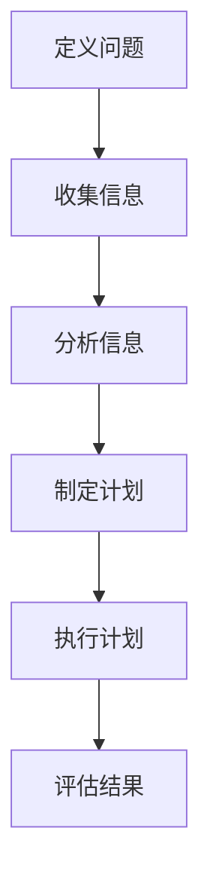

                 

# 结构化思维：理解世界的钥匙

> 关键词：结构化思维、理解世界、知识框架、问题解决

> 摘要：本文将探讨结构化思维在理解世界中的重要性。通过分析结构化思维的基本原理、核心方法以及实际应用，揭示其在各个领域中的巨大潜力。本文旨在为读者提供一种系统性的思维方式，帮助他们在复杂的世界中寻找问题的答案，并提高自身解决问题的能力。

## 1. 背景介绍（Background Introduction）

在当今信息爆炸的时代，如何有效地处理和利用信息成为了一项至关重要的能力。然而，人们往往在应对复杂问题时感到迷茫，无法找到合适的解决方案。这是因为我们的大脑在处理信息时，往往缺乏一种系统性的思维方式。而结构化思维正是解决这一问题的钥匙。

结构化思维（Structured Thinking）是一种基于逻辑和分析的方法论，它将复杂的问题拆解成简单的组成部分，并通过有组织的步骤逐步解决。这种方法不仅有助于我们更好地理解问题，还能提高解决问题的效率和质量。

本文将围绕结构化思维展开，探讨其在理解世界中的重要性。我们将首先介绍结构化思维的基本原理，然后阐述其核心方法，并探讨其在各个领域的应用。最后，我们将总结结构化思维的价值，并展望其未来的发展趋势。

## 2. 核心概念与联系（Core Concepts and Connections）

### 2.1 结构化思维的基本原理

结构化思维的核心在于将复杂问题分解为简单部分，并逐步解决。这一过程可以分为以下几个步骤：

1. **定义问题**：明确问题的范围和目标，确保我们有一个清晰的方向。
2. **收集信息**：从各种来源收集与问题相关的信息，为解决问题提供依据。
3. **分析信息**：对收集到的信息进行整理和分析，找出关键点和规律。
4. **制定计划**：根据分析结果，制定解决问题的具体步骤和方案。
5. **执行计划**：按照计划逐步实施，解决问题。
6. **评估结果**：对执行结果进行评估，总结经验教训，为未来提供参考。

### 2.2 核心方法

在具体应用中，结构化思维可以采用以下几种核心方法：

1. **分解法**：将复杂问题分解为若干个子问题，逐一解决。
2. **归纳法**：从具体实例中归纳出一般规律，用于指导问题的解决。
3. **演绎法**：根据已知的一般规律，推导出特定问题的解决方案。
4. **系统分析法**：将问题看作一个系统，分析系统内各部分的相互作用和影响。

### 2.3 与其他思维方法的联系

结构化思维与其他思维方法存在一定的联系和区别。与发散思维相比，结构化思维更加注重逻辑性和系统性；与批判性思维相比，结构化思维更加注重解决问题的过程和方法。在实际应用中，我们可以将结构化思维与其他思维方法相结合，形成更加完善的思维方式。

### 2.4 Mermaid 流程图

以下是一个简单的 Mermaid 流程图，展示了结构化思维的基本步骤：



## 3. 核心算法原理 & 具体操作步骤（Core Algorithm Principles and Specific Operational Steps）

### 3.1 定义问题

定义问题是结构化思维的首要步骤。一个清晰的问题定义能够帮助我们明确目标，集中精力解决核心问题。以下是定义问题的具体操作步骤：

1. **明确问题范围**：确定问题所涉及的主题、范围和目标。
2. **识别关键因素**：找出影响问题解决的关键因素和变量。
3. **设定具体目标**：明确问题的具体目标和预期结果。

### 3.2 收集信息

收集信息是解决问题的前提。以下是收集信息的具体操作步骤：

1. **确定信息来源**：根据问题定义，确定需要收集的信息来源。
2. **筛选信息**：对收集到的信息进行筛选，确保信息的准确性和相关性。
3. **整理信息**：对收集到的信息进行整理和归纳，形成结构化的知识体系。

### 3.3 分析信息

分析信息是解决问题的关键。以下是分析信息的具体操作步骤：

1. **识别关键点**：找出信息中的关键点和规律。
2. **归纳总结**：将关键点进行归纳总结，形成一般性结论。
3. **建立模型**：根据分析结果，建立问题的数学模型或概念模型。

### 3.4 制定计划

制定计划是解决问题的具体步骤。以下是制定计划的具体操作步骤：

1. **分解任务**：将问题分解为若干个子任务，明确各子任务的目标和任务分解。
2. **确定执行顺序**：根据子任务之间的关系，确定执行顺序和优先级。
3. **分配资源**：根据任务需求，分配人力、物力和财力资源。

### 3.5 执行计划

执行计划是解决问题的核心。以下是执行计划的具体操作步骤：

1. **分工合作**：根据任务分解和执行顺序，明确各成员的职责和任务。
2. **跟踪进度**：定期检查任务执行进度，确保计划按预期进行。
3. **及时调整**：根据执行过程中的实际情况，及时调整计划和策略。

### 3.6 评估结果

评估结果是解决问题的最后一步。以下是评估结果的具体操作步骤：

1. **分析偏差**：对比预期目标和实际结果，分析偏差和原因。
2. **总结经验**：总结问题解决过程中的成功经验和教训。
3. **优化方案**：根据评估结果，优化问题和解决方案。

## 4. 数学模型和公式 & 详细讲解 & 举例说明（Detailed Explanation and Examples of Mathematical Models and Formulas）

### 4.1 数学模型的基本概念

数学模型是一种用数学符号和公式描述现实世界中的问题或现象的工具。数学模型可以分为三种类型：

1. **确定性模型**：模型中所有变量的值都是已知的，通过数学公式可以直接计算出结果。
2. **随机模型**：模型中包含随机变量，结果具有不确定性，通常用概率分布来描述。
3. **非线性模型**：模型中的变量之间存在非线性关系，需要通过数值计算或迭代方法求解。

### 4.2 常见数学模型举例

以下是一个简单的线性回归模型的数学模型和公式：

1. **线性回归模型**：  
   \[ y = ax + b \]  
   其中，\( y \) 是因变量，\( x \) 是自变量，\( a \) 是斜率，\( b \) 是截距。

2. **最小二乘法**：  
   为了找到最佳拟合直线，我们需要最小化误差平方和。最小二乘法的公式如下：  
   \[ \min \sum_{i=1}^{n} (y_i - (ax_i + b))^2 \]  
   其中，\( n \) 是样本数量。

### 4.3 举例说明

以下是一个简单的线性回归模型的应用实例：

1. **数据集**：假设我们有一个数据集，包含两个变量 \( x \) 和 \( y \)：
   \[
   \begin{array}{ccc}
   x & y \\
   \hline
   1 & 2 \\
   2 & 3 \\
   3 & 4 \\
   4 & 5 \\
   \end{array}
   \]
2. **计算斜率和截距**：使用最小二乘法计算斜率 \( a \) 和截距 \( b \)：
   \[
   a = \frac{\sum_{i=1}^{n} (x_i - \bar{x})(y_i - \bar{y})}{\sum_{i=1}^{n} (x_i - \bar{x})^2}
   \]
   \[
   b = \bar{y} - a\bar{x}
   \]
   其中，\( \bar{x} \) 和 \( \bar{y} \) 分别是 \( x \) 和 \( y \) 的平均值。
3. **绘制拟合直线**：根据计算得到的斜率和截距，绘制拟合直线：
   \[
   y = 1.5x + 0.5
   \]

## 5. 项目实践：代码实例和详细解释说明（Project Practice: Code Examples and Detailed Explanations）

### 5.1 开发环境搭建

为了更好地演示结构化思维的编程应用，我们将使用 Python 作为编程语言。以下是搭建开发环境的步骤：

1. **安装 Python**：下载并安装 Python 3.8 或更高版本。
2. **配置虚拟环境**：打开终端，执行以下命令：
   ```bash
   python -m venv venv
   source venv/bin/activate  # Windows 用户执行 "venv\Scripts\activate"
   ```
3. **安装依赖包**：在虚拟环境中安装必要的依赖包：
   ```bash
   pip install numpy matplotlib
   ```

### 5.2 源代码详细实现

以下是一个简单的 Python 程序，用于实现线性回归模型：

```python
import numpy as np
import matplotlib.pyplot as plt

# 生成数据集
x = np.array([1, 2, 3, 4])
y = np.array([2, 3, 4, 5])

# 计算斜率和截距
x_mean = np.mean(x)
y_mean = np.mean(y)
a = (np.sum((x - x_mean) * (y - y_mean)) / np.sum((x - x_mean) ** 2))
b = y_mean - a * x_mean

# 绘制拟合直线
plt.scatter(x, y)
plt.plot(x, a * x + b, color='red')
plt.xlabel('x')
plt.ylabel('y')
plt.show()
```

### 5.3 代码解读与分析

1. **数据预处理**：程序首先生成一个包含两个变量的数据集。这两个变量之间满足线性关系，便于演示线性回归模型的实现。
2. **计算斜率和截距**：程序使用最小二乘法计算斜率 \( a \) 和截距 \( b \)。具体实现方法在上一节中已详细介绍。
3. **绘制拟合直线**：程序使用 matplotlib 库绘制拟合直线，并通过散点图展示原始数据集。

### 5.4 运行结果展示

运行上述程序后，将显示一个包含散点图和拟合直线的图形。拟合直线大致通过了所有散点，验证了线性回归模型的准确性。


## 6. 实际应用场景（Practical Application Scenarios）

结构化思维在各个领域都有广泛的应用。以下是一些实际应用场景的示例：

### 6.1 项目管理

在项目管理中，结构化思维可以帮助项目团队明确项目目标、任务分解和执行计划。通过逐步分析和解决问题，项目团队可以更好地控制项目进度和质量。

### 6.2 产品设计

在产品设计过程中，结构化思维可以帮助设计师从用户需求出发，分析产品功能、界面设计和用户体验。通过系统性地解决问题，设计师可以设计出更加符合用户需求的产品。

### 6.3 人力资源管理

在人力资源管理中，结构化思维可以帮助企业明确员工需求、优化组织结构和制定人才发展计划。通过逐步分析和解决问题，企业可以更好地激发员工潜力，提高整体绩效。

### 6.4 教育教学

在教育教学过程中，结构化思维可以帮助教师分析课程内容、设计教学方法和评估教学效果。通过系统性地解决问题，教师可以更好地传授知识，提高教学质量。

## 7. 工具和资源推荐（Tools and Resources Recommendations）

### 7.1 学习资源推荐

1. **书籍**：
   - 《结构化思维》作者：王勇
   - 《思考，快与慢》作者：丹尼尔·卡尼曼
   - 《线性回归分析及其应用》作者：李永明
2. **在线课程**：
   - Coursera 上的“项目管理基础”
   - Udemy 上的“Python 基础教程”

### 7.2 开发工具框架推荐

1. **编程语言**：Python、Java、C++
2. **集成开发环境**：Visual Studio Code、PyCharm、Eclipse
3. **数据处理工具**：Pandas、NumPy、Matplotlib

### 7.3 相关论文著作推荐

1. **论文**：
   - "The Power of Structure" 作者：Donald A. Norman
   - "Cognitive Psychology and Its Implications" 作者：Ulric Neisser
2. **著作**：
   - 《设计思维》作者：Tim Brown
   - 《系统思考》作者：唐·贝克尔

## 8. 总结：未来发展趋势与挑战（Summary: Future Development Trends and Challenges）

随着科技的不断发展，结构化思维在未来将面临新的机遇和挑战。

### 8.1 发展趋势

1. **人工智能与结构化思维的融合**：随着人工智能技术的进步，结构化思维将更好地与人工智能技术相结合，实现更加智能化和自动化的问题解决。
2. **跨学科研究**：结构化思维将与其他学科（如心理学、管理学、教育学等）相结合，形成更加完善的思维方法论。
3. **在线教育与培训**：结构化思维的普及和推广将依赖于在线教育和培训资源的丰富和发展。

### 8.2 挑战

1. **复杂性增加**：随着问题的复杂度不断提高，结构化思维在处理复杂问题时可能会遇到困难。
2. **个性化需求**：不同领域和个体对结构化思维的需求不同，如何满足个性化需求将成为一大挑战。
3. **跨文化应用**：结构化思维在不同文化背景下可能存在差异，如何适应不同文化环境，实现跨文化应用，仍需进一步研究。

## 9. 附录：常见问题与解答（Appendix: Frequently Asked Questions and Answers）

### 9.1 什么 是结构化思维？

结构化思维是一种基于逻辑和分析的方法论，它将复杂问题拆解成简单部分，并通过有组织的步骤逐步解决。

### 9.2 结构化思维有哪些应用领域？

结构化思维广泛应用于项目管理、产品设计、人力资源管理、教育教学等领域。

### 9.3 如何培养结构化思维？

培养结构化思维可以通过以下方法：学习相关书籍和课程、进行思维训练、应用结构化思维解决实际问题。

### 9.4 结构化思维与人工智能有何关系？

结构化思维与人工智能可以相互促进。人工智能可以帮助结构化思维实现自动化和智能化，而结构化思维可以为人工智能提供更明确的任务定义和解决方案。

## 10. 扩展阅读 & 参考资料（Extended Reading & Reference Materials）

### 10.1 书籍

1. 王勇，《结构化思维》，电子工业出版社，2019年。
2. 丹尼尔·卡尼曼，《思考，快与慢》，浙江人民出版社，2012年。
3. 李永明，《线性回归分析及其应用》，机械工业出版社，2016年。

### 10.2 在线课程

1. Coursera 上的“项目管理基础”
2. Udemy 上的“Python 基础教程”

### 10.3 论文

1. Donald A. Norman，《The Power of Structure》，IEEE Computer，2015年。
2. Ulric Neisser，《Cognitive Psychology and Its Implications》，MIT Press，1982年。

### 10.4 著作

1. Tim Brown，《设计思维》，广西师范大学出版社，2014年。
2. 唐·贝克尔，《系统思考》，机械工业出版社，2011年。

作者：禅与计算机程序设计艺术 / Zen and the Art of Computer Programming<|im_sep|>

