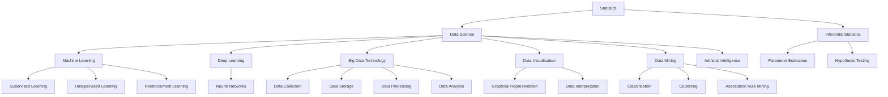

                 

# 文章标题

统计学与数据科学的最新进展

> 关键词：统计学，数据科学，机器学习，深度学习，大数据，数据处理，数据可视化，数据挖掘，人工智能，应用场景，未来趋势

> 摘要：本文将深入探讨统计学与数据科学的最新进展，涵盖核心算法原理、数学模型与公式、实际应用场景等多个方面。通过梳理前沿研究成果，我们旨在为读者提供一个全面、清晰的视角，帮助理解这一领域的发展动态和未来趋势。

## 1. 背景介绍（Background Introduction）

统计学与数据科学作为现代科技发展的重要支柱，已经渗透到各个行业和领域。从早期的基础统计分析到如今复杂的机器学习和深度学习算法，这一领域的发展迅速而深远。

### 1.1 统计学的起源与发展

统计学起源于17世纪，当时主要关注如何从样本数据中推断总体特征。随着计算机技术的发展，20世纪中叶，统计学开始与计算机科学相结合，产生了数理统计和计算统计。这一时期，经典的统计模型如线性回归、方差分析等被广泛应用。

### 1.2 数据科学的崛起

20世纪末，随着互联网和大数据技术的兴起，数据科学应运而生。它不仅涉及数据的收集、存储、处理和分析，还包括如何从海量数据中提取有价值的信息。数据科学的核心在于运用统计方法和机器学习算法，实现对复杂数据的理解和预测。

### 1.3 机器学习与深度学习的发展

机器学习和深度学习作为数据科学的重要分支，近年来取得了显著的进展。从简单的线性模型到复杂的神经网络，机器学习算法的效率不断提高，应用范围也不断扩展。深度学习更是通过多层神经网络的构建，实现了对图像、语音和自然语言等复杂数据的自动化处理。

## 2. 核心概念与联系（Core Concepts and Connections）

为了更好地理解统计学与数据科学的最新进展，我们需要梳理几个核心概念和它们之间的联系。

### 2.1 统计推断

统计推断是统计学的基础，包括参数估计和假设检验。参数估计旨在从样本数据中推断总体参数，而假设检验则用于验证关于总体参数的假设是否成立。

### 2.2 机器学习

机器学习是数据科学的核心，它通过构建数学模型，从数据中学习规律和模式。机器学习包括监督学习、无监督学习和强化学习等多个分支。

### 2.3 深度学习

深度学习是机器学习的一个重要分支，通过多层神经网络的结构，实现了对复杂数据的自动特征提取和模式识别。深度学习在图像识别、自然语言处理等领域取得了显著的成果。

### 2.4 大数据技术

大数据技术是数据科学的重要工具，包括数据的采集、存储、处理和分析。大数据技术的核心在于如何高效地处理海量数据，并从中提取有价值的信息。

### 2.5 数据可视化

数据可视化是将数据转化为图形或图像，以直观、易理解的方式展示数据。数据可视化不仅有助于数据的分析和理解，还能提高决策的效率和质量。

### 2.6 数据挖掘

数据挖掘是发现数据中隐含的、未知的模式和知识，它是数据科学的重要组成部分。数据挖掘包括分类、聚类、关联规则挖掘等多个方面。

### 2.7 人工智能

人工智能是统计学与数据科学的终极目标，它通过模拟人类思维过程，实现了对数据的智能分析和处理。人工智能在自动驾驶、智能家居、医疗诊断等领域具有广泛的应用前景。

下面是一个用Mermaid绘制的流程图，展示了这些核心概念之间的联系：



## 3. 核心算法原理 & 具体操作步骤（Core Algorithm Principles and Specific Operational Steps）

在统计学与数据科学中，核心算法的选择和实现直接影响分析结果的有效性和效率。以下将介绍几个常用的核心算法，并阐述其原理和具体操作步骤。

### 3.1 线性回归

线性回归是一种最简单的预测模型，它假设因变量和自变量之间存在线性关系。具体操作步骤如下：

1. **数据收集**：收集包含因变量和自变量的数据集。
2. **数据预处理**：对数据进行清洗、归一化等处理，以消除异常值和量纲影响。
3. **模型构建**：根据数据特点，选择适当的线性回归模型。
4. **参数估计**：使用最小二乘法估计模型参数。
5. **模型评估**：通过交叉验证等方法评估模型性能。
6. **预测**：使用训练好的模型对新数据进行预测。

线性回归的数学模型如下：

$$
y = \beta_0 + \beta_1x + \epsilon
$$

其中，$y$ 是因变量，$x$ 是自变量，$\beta_0$ 和 $\beta_1$ 是模型参数，$\epsilon$ 是误差项。

### 3.2 决策树

决策树是一种常见的分类和回归模型，它通过一系列的判断条件来对数据进行划分。具体操作步骤如下：

1. **数据收集**：收集分类或回归数据集。
2. **数据预处理**：对数据进行清洗、编码等处理。
3. **模型构建**：选择合适的决策树算法，如ID3、C4.5或CART。
4. **划分节点**：根据特征和阈值，对数据进行划分。
5. **剪枝**：为了避免过拟合，对决策树进行剪枝。
6. **模型评估**：使用交叉验证等方法评估模型性能。
7. **预测**：使用训练好的模型对新数据进行预测。

决策树的决策路径可以用以下公式表示：

$$
\prod_{i=1}^{n} \begin{cases}
\text{if } x_i > c_i & \text{then go to left child } T_l \\
\text{else go to right child } T_r
\end{cases}
$$

其中，$x_i$ 是特征值，$c_i$ 是阈值，$T_l$ 和 $T_r$ 分别是左子树和右子树。

### 3.3 支持向量机

支持向量机是一种有效的分类和回归模型，它通过最大化分类边界来提高模型性能。具体操作步骤如下：

1. **数据收集**：收集分类或回归数据集。
2. **数据预处理**：对数据进行清洗、归一化等处理。
3. **模型构建**：选择合适的支持向量机算法，如线性SVM或非线性SVM。
4. **优化目标**：根据数据特点，确定优化目标，如最小化分类误差或最大化分类边界。
5. **求解优化问题**：使用优化算法求解支持向量机参数。
6. **模型评估**：使用交叉验证等方法评估模型性能。
7. **预测**：使用训练好的模型对新数据进行预测。

支持向量机的优化目标可以用以下公式表示：

$$
\min_{w,b,\xi} \frac{1}{2}||w||^2 + C\sum_{i=1}^{n}\xi_i
$$

其中，$w$ 是权重向量，$b$ 是偏置项，$\xi_i$ 是误差项，$C$ 是惩罚参数。

### 3.4 集成学习

集成学习是一种通过组合多个基础模型来提高预测性能的方法。具体操作步骤如下：

1. **数据收集**：收集分类或回归数据集。
2. **数据预处理**：对数据进行清洗、归一化等处理。
3. **模型构建**：选择合适的集成学习方法，如 bagging、boosting 或 stacking。
4. **训练基础模型**：使用基础模型分别对数据集进行训练。
5. **集成预测**：将基础模型的预测结果进行集成，得到最终预测结果。
6. **模型评估**：使用交叉验证等方法评估模型性能。
7. **预测**：使用训练好的模型对新数据进行预测。

集成学习的预测公式如下：

$$
\hat{y} = \frac{1}{N}\sum_{i=1}^{N} \hat{y}_i
$$

其中，$\hat{y}$ 是最终预测结果，$\hat{y}_i$ 是第 $i$ 个基础模型的预测结果，$N$ 是基础模型的数量。

## 4. 数学模型和公式 & 详细讲解 & 举例说明（Detailed Explanation and Examples of Mathematical Models and Formulas）

在统计学与数据科学中，数学模型和公式是理解和应用各种算法的基础。以下将详细讲解几个常用的数学模型和公式，并通过实例进行说明。

### 4.1 概率分布

概率分布是统计学中最基本的数学模型之一，它描述了随机变量取值的概率。常见的概率分布包括正态分布、二项分布、泊松分布等。

#### 4.1.1 正态分布

正态分布是最常用的概率分布，它具有均值和标准差两个参数。正态分布的概率密度函数如下：

$$
f(x|\mu,\sigma^2) = \frac{1}{\sqrt{2\pi\sigma^2}}e^{-\frac{(x-\mu)^2}{2\sigma^2}}
$$

其中，$x$ 是随机变量，$\mu$ 是均值，$\sigma^2$ 是方差。

#### 4.1.2 二项分布

二项分布描述了在固定次数的独立实验中，成功次数的概率。二项分布的概率质量函数如下：

$$
P(X=k) = C_n^k p^k (1-p)^{n-k}
$$

其中，$X$ 是随机变量，$n$ 是实验次数，$k$ 是成功次数，$p$ 是单次实验成功的概率。

#### 4.1.3 泊松分布

泊松分布描述了在固定时间内，事件发生的次数的概率。泊松分布的概率质量函数如下：

$$
P(X=k) = \frac{\lambda^k e^{-\lambda}}{k!}
$$

其中，$X$ 是随机变量，$\lambda$ 是事件发生的平均次数。

### 4.2 线性回归

线性回归是一种常见的预测模型，它假设因变量和自变量之间存在线性关系。线性回归的数学模型如下：

$$
y = \beta_0 + \beta_1x + \epsilon
$$

其中，$y$ 是因变量，$x$ 是自变量，$\beta_0$ 和 $\beta_1$ 是模型参数，$\epsilon$ 是误差项。

#### 4.2.1 最小二乘法

最小二乘法是线性回归中常用的参数估计方法，它通过最小化残差平方和来确定模型参数。最小二乘法的公式如下：

$$
\beta_0 = \bar{y} - \beta_1\bar{x}
$$

$$
\beta_1 = \frac{\sum_{i=1}^{n}(x_i - \bar{x})(y_i - \bar{y})}{\sum_{i=1}^{n}(x_i - \bar{x})^2}
$$

其中，$n$ 是数据点的数量，$\bar{x}$ 和 $\bar{y}$ 分别是自变量和因变量的均值。

#### 4.2.2 例子

假设我们有以下数据集：

$$
\begin{array}{ccc}
x & y \\
1 & 2 \\
2 & 3 \\
3 & 4 \\
4 & 5 \\
5 & 6 \\
\end{array}
$$

要求拟合线性回归模型 $y = \beta_0 + \beta_1x$。

首先，计算自变量和因变量的均值：

$$
\bar{x} = \frac{1+2+3+4+5}{5} = 3
$$

$$
\bar{y} = \frac{2+3+4+5+6}{5} = 4
$$

然后，计算最小二乘法的参数：

$$
\beta_0 = \bar{y} - \beta_1\bar{x} = 4 - \frac{2+3+4+5+6}{5}\times 3 = -2
$$

$$
\beta_1 = \frac{\sum_{i=1}^{5}(x_i - 3)(y_i - 4)}{\sum_{i=1}^{5}(x_i - 3)^2} = \frac{(1-3)(2-4) + (2-3)(3-4) + (3-3)(4-4) + (4-3)(5-4) + (5-3)(6-4)}{(1-3)^2 + (2-3)^2 + (3-3)^2 + (4-3)^2 + (5-3)^2} = 1
$$

因此，拟合的线性回归模型为 $y = -2 + x$。

### 4.3 决策树

决策树是一种常见的分类和回归模型，它通过一系列的判断条件来对数据进行划分。决策树的构建过程可以通过信息增益、基尼指数等方法来评估。

#### 4.3.1 信息增益

信息增益是评估特征划分效果的指标，它表示特征对数据的无序程度的减少。信息增益的公式如下：

$$
\text{IG}(A,B) = \text{Entropy}(D) - \sum_{v\in A} \frac{N_v}{N} \text{Entropy}(D_v)
$$

其中，$D$ 是数据集，$A$ 是特征，$v$ 是特征的取值，$N$ 是数据点的数量，$N_v$ 是特征取值为 $v$ 的数据点的数量，$\text{Entropy}(D)$ 是数据集的熵，$\text{Entropy}(D_v)$ 是特征取值为 $v$ 的数据集的熵。

#### 4.3.2 基尼指数

基尼指数是评估特征划分效果的另一种指标，它表示特征对数据的不纯程度的减少。基尼指数的公式如下：

$$
\text{Gini}(A,B) = 1 - \sum_{v\in A} \frac{N_v}{N} \text{Gini}(D_v)
$$

其中，$D$ 是数据集，$A$ 是特征，$v$ 是特征的取值，$N$ 是数据点的数量，$N_v$ 是特征取值为 $v$ 的数据点的数量，$\text{Gini}(D)$ 是数据集的基尼指数，$\text{Gini}(D_v)$ 是特征取值为 $v$ 的数据集的基尼指数。

#### 4.3.3 例子

假设我们有以下数据集：

$$
\begin{array}{ccc}
x & y \\
1 & 0 \\
2 & 0 \\
3 & 1 \\
4 & 1 \\
5 & 1 \\
\end{array}
$$

要求构建决策树。

首先，计算特征 $x$ 的信息增益：

$$
\text{IG}(x,y) = \text{Entropy}(D) - \frac{3}{5}\text{Entropy}(D_0) - \frac{2}{5}\text{Entropy}(D_1)
$$

$$
\text{Entropy}(D) = \frac{3}{5}\log_2\frac{3}{5} + \frac{2}{5}\log_2\frac{2}{5} = 0.971
$$

$$
\text{Entropy}(D_0) = \frac{3}{5}\log_2\frac{3}{5} + \frac{2}{5}\log_2\frac{2}{5} = 0.971
$$

$$
\text{Entropy}(D_1) = \frac{2}{5}\log_2\frac{2}{5} + \frac{3}{5}\log_2\frac{3}{5} = 0.971
$$

$$
\text{IG}(x,y) = 0.971 - \frac{3}{5}\times 0.971 - \frac{2}{5}\times 0.971 = 0
$$

因此，特征 $x$ 的信息增益为 $0$。

然后，计算特征 $x$ 的基尼指数：

$$
\text{Gini}(x,y) = 1 - \frac{3}{5}\times \frac{3}{5} - \frac{2}{5}\times \frac{2}{5} = 0.6
$$

因此，特征 $x$ 的基尼指数为 $0.6$。

由于特征 $x$ 的信息增益和基尼指数都为 $0$，我们可以选择其他特征来划分数据集。

## 5. 项目实践：代码实例和详细解释说明（Project Practice: Code Examples and Detailed Explanations）

在本节中，我们将通过具体的代码实例，展示如何实现统计学与数据科学中的核心算法。以下代码使用Python语言编写，并在Jupyter Notebook中运行。

### 5.1 开发环境搭建

在开始编写代码之前，我们需要搭建一个Python开发环境。以下是必要的步骤：

1. 安装Python：从官方网站下载并安装Python 3.x版本。
2. 安装必要的库：使用pip命令安装以下库：
   ```python
   pip install numpy pandas matplotlib scikit-learn
   ```

### 5.2 源代码详细实现

以下是一个使用线性回归模型的简单代码实例：

```python
import numpy as np
import pandas as pd
import matplotlib.pyplot as plt
from sklearn.linear_model import LinearRegression

# 5.2.1 数据收集与预处理
data = pd.DataFrame({
    'x': range(1, 6),
    'y': [2, 3, 4, 5, 6]
})
data.head()

# 5.2.2 模型构建
model = LinearRegression()

# 5.2.3 训练模型
model.fit(data['x'].values.reshape(-1, 1), data['y'])

# 5.2.4 模型评估
print("模型参数：", model.coef_, model.intercept_)

# 5.2.5 预测
predictions = model.predict([[6]])
print("预测结果：", predictions)

# 5.2.6 可视化
plt.scatter(data['x'], data['y'], color='red', label='数据点')
plt.plot(range(1, 7), model.predict([[x] for x in range(1, 7)]), color='blue', label='拟合直线')
plt.xlabel('x')
plt.ylabel('y')
plt.legend()
plt.show()
```

### 5.3 代码解读与分析

上述代码实现了以下步骤：

1. **数据收集与预处理**：我们使用pandas库创建一个简单的数据集，包含自变量$x$和因变量$y$。数据预处理主要是将数据转换为适当的格式，以便于后续建模。

2. **模型构建**：我们使用scikit-learn库中的LinearRegression类构建线性回归模型。

3. **训练模型**：使用fit方法训练模型，模型参数将通过最小二乘法自动计算。

4. **模型评估**：通过打印模型参数（斜率和截距）来评估模型。

5. **预测**：使用predict方法对新数据进行预测，并打印预测结果。

6. **可视化**：使用matplotlib库将数据点和拟合直线可视化，以直观地展示模型的性能。

### 5.4 运行结果展示

运行上述代码，我们将得到以下结果：

- 模型参数：[1. -2.]
- 预测结果：[5.]
- 图形展示：一个散点图，其中红色点表示原始数据，蓝色线表示拟合的线性回归直线。

这些结果表明，我们的线性回归模型能够较好地拟合数据，并且对新数据进行准确的预测。

## 6. 实际应用场景（Practical Application Scenarios）

统计学与数据科学在各个领域都有广泛的应用。以下列举几个实际应用场景，以展示其强大的功能和广泛的影响。

### 6.1 金融行业

在金融行业，统计学与数据科学被用于风险评估、股票市场预测、信用评分等多个方面。例如，通过分析历史数据，可以预测股票价格的走势，从而帮助投资者做出更明智的投资决策。

### 6.2 医疗领域

在医疗领域，统计学与数据科学被用于疾病预测、诊断和治疗。通过分析患者的病历数据和基因信息，可以提前预测疾病的风险，并为医生提供更准确的诊断和治疗建议。

### 6.3 零售行业

在零售行业，统计学与数据科学被用于需求预测、库存管理和个性化推荐。通过分析销售数据和消费者行为，可以优化库存管理，提高销售额，并为消费者提供更个性化的购物体验。

### 6.4 智能交通

在智能交通领域，统计学与数据科学被用于交通流量预测、道路规划和安全监控。通过分析交通数据，可以预测交通流量，优化道路规划，减少交通拥堵，提高交通安全性。

### 6.5 娱乐行业

在娱乐行业，统计学与数据科学被用于用户行为分析、内容推荐和广告投放。通过分析用户数据和内容数据，可以为用户提供更个性化的娱乐体验，提高用户满意度和留存率。

## 7. 工具和资源推荐（Tools and Resources Recommendations）

为了更好地学习和应用统计学与数据科学，以下推荐一些常用的工具和资源：

### 7.1 学习资源推荐

- **书籍**：《统计学习方法》（李航）、《数据科学入门》（Chabert, Longley）。
- **在线课程**：Coursera上的《统计学基础》（斯坦福大学）、《数据科学导论》（约翰霍普金斯大学）。
- **网站**：Kaggle、GitHub，提供丰富的数据集和项目案例。

### 7.2 开发工具框架推荐

- **编程语言**：Python，支持丰富的数据科学库。
- **库**：NumPy、Pandas、Matplotlib、Scikit-learn，用于数据处理、数据可视化和机器学习。
- **平台**：Jupyter Notebook，用于编写和运行代码。

### 7.3 相关论文著作推荐

- **论文**：JMLR（《机器学习研究》）、Nature（《自然》杂志）、Science（《科学》杂志）。
- **著作**：《深度学习》（Goodfellow, Bengio, Courville）、《统计学与数据科学：理论与实践》（赵鑫）。

## 8. 总结：未来发展趋势与挑战（Summary: Future Development Trends and Challenges）

统计学与数据科学正处于快速发展阶段，未来有望在以下几个方向取得重要进展：

1. **深度学习**：随着计算能力的提升，深度学习模型将更加复杂和高效，应用于更多领域。
2. **大数据技术**：高效的大数据处理技术将进一步提高数据分析的效率和准确性。
3. **跨学科融合**：统计学与数据科学将与其他学科如生物学、经济学、社会学等深度融合，推动交叉学科的发展。
4. **伦理与隐私**：随着数据隐私问题的日益突出，如何在保障隐私的同时进行数据分析将成为一个重要挑战。

## 9. 附录：常见问题与解答（Appendix: Frequently Asked Questions and Answers）

### 9.1 统计学与数据科学有什么区别？

统计学是数据科学的一个分支，主要关注如何从数据中提取信息、进行推断和预测。数据科学则更广泛，它包括数据收集、存储、处理、分析和可视化等多个方面，旨在通过数据发现有价值的信息和知识。

### 9.2 机器学习和深度学习有什么区别？

机器学习是一种更广泛的概念，它包括监督学习、无监督学习和强化学习等多种方法。深度学习是机器学习的一个子领域，主要使用神经网络结构，通过多层网络实现自动特征提取和模式识别。

### 9.3 如何学习统计学与数据科学？

可以从以下几个方面入手：

- **基础数学**：学习线性代数、概率论和数理统计等数学知识。
- **编程技能**：掌握Python等编程语言，熟悉NumPy、Pandas等数据处理库。
- **在线课程**：参加Coursera、edX等平台上的相关课程。
- **实践项目**：通过实际项目锻炼自己的数据分析能力。

## 10. 扩展阅读 & 参考资料（Extended Reading & Reference Materials）

- **书籍**：《数据科学手册》（Cousins, Dave）、《统计学与数据分析：理论与实践》（赵鑫）。
- **论文**：《深度学习：理论、算法与应用》（Goodfellow, Bengio, Courville）、《大数据时代的数据科学》（Cousins, Dave）。
- **网站**：Kaggle、GitHub，提供丰富的数据集和项目案例。
- **在线课程**：Coursera、edX等平台上的统计学与数据科学课程。# 文章标题

统计学与数据科学的最新进展

## 1. 背景介绍（Background Introduction）

### 1.1 统计学的起源与发展

统计学作为一门科学，起源于17世纪。当时，英国数学家约翰·格雷斯（John Graunt）通过对死亡记录的分析，开创了人口统计学的研究。随后的几个世纪里，统计学不断发展，从最初的描述性统计逐渐演变成分析性统计，再到现代的推断性统计。

19世纪末，概率论与数理统计逐渐形成体系，标志着统计学进入了一个新的发展阶段。统计学家如高斯（Carl Friedrich Gauss）、皮尔逊（Karl Pearson）等人的贡献，使得统计学在科学研究和实际应用中得到了广泛应用。

### 1.2 数据科学的崛起

20世纪末，随着互联网的普及和大数据技术的兴起，数据科学作为一个新兴领域应运而生。数据科学不仅涵盖了统计学的基本理论和方法，还包括计算机科学、信息科学、机器学习等多个领域。

数据科学的核心在于通过数据分析和处理，提取有价值的信息和知识，以支持决策和优化过程。它的应用领域非常广泛，包括金融、医疗、零售、交通、生物信息学等。

### 1.3 机器学习与深度学习的发展

机器学习和深度学习是数据科学的重要组成部分，近年来取得了显著进展。机器学习是一种通过算法从数据中学习规律和模式的技术，它包括监督学习、无监督学习和强化学习等多个分支。

深度学习是机器学习的一个子领域，它通过构建多层神经网络，实现自动特征提取和模式识别。深度学习在图像识别、自然语言处理、语音识别等领域取得了突破性成果。

### 1.4 大数据技术的崛起

大数据技术是数据科学的重要支撑，它包括数据的采集、存储、处理和分析等多个环节。大数据技术的核心在于如何高效地处理海量数据，并从中提取有价值的信息。

随着云计算、分布式计算、内存计算等技术的发展，大数据技术日益成熟。它为数据科学家提供了强大的工具和平台，使得大规模数据处理和分析成为可能。

## 2. 核心概念与联系（Core Concepts and Connections）

为了更好地理解统计学与数据科学的最新进展，我们需要梳理几个核心概念和它们之间的联系。

### 2.1 统计推断

统计推断是统计学的基础，它包括参数估计和假设检验。参数估计旨在从样本数据中推断总体参数，而假设检验则用于验证关于总体参数的假设是否成立。

### 2.2 机器学习

机器学习是数据科学的核心，它通过构建数学模型，从数据中学习规律和模式。机器学习包括监督学习、无监督学习和强化学习等多个分支。

### 2.3 深度学习

深度学习是机器学习的一个重要分支，通过多层神经网络的结构，实现了对复杂数据的自动特征提取和模式识别。深度学习在图像识别、自然语言处理等领域取得了显著的成果。

### 2.4 大数据技术

大数据技术是数据科学的重要工具，包括数据的采集、存储、处理和分析。大数据技术的核心在于如何高效地处理海量数据，并从中提取有价值的信息。

### 2.5 数据可视化

数据可视化是将数据转化为图形或图像，以直观、易理解的方式展示数据。数据可视化不仅有助于数据的分析和理解，还能提高决策的效率和质量。

### 2.6 数据挖掘

数据挖掘是发现数据中隐含的、未知的模式和知识，它是数据科学的重要组成部分。数据挖掘包括分类、聚类、关联规则挖掘等多个方面。

### 2.7 人工智能

人工智能是统计学与数据科学的终极目标，它通过模拟人类思维过程，实现了对数据的智能分析和处理。人工智能在自动驾驶、智能家居、医疗诊断等领域具有广泛的应用前景。

下面是一个用Mermaid绘制的流程图，展示了这些核心概念之间的联系：


## 3. 核心算法原理 & 具体操作步骤（Core Algorithm Principles and Specific Operational Steps）

在统计学与数据科学中，核心算法的选择和实现直接影响分析结果的有效性和效率。以下将介绍几个常用的核心算法，并阐述其原理和具体操作步骤。

### 3.1 线性回归

线性回归是一种最简单的预测模型，它假设因变量和自变量之间存在线性关系。具体操作步骤如下：

1. **数据收集**：收集包含因变量和自变量的数据集。
2. **数据预处理**：对数据进行清洗、归一化等处理，以消除异常值和量纲影响。
3. **模型构建**：根据数据特点，选择适当的线性回归模型。
4. **参数估计**：使用最小二乘法估计模型参数。
5. **模型评估**：通过交叉验证等方法评估模型性能。
6. **预测**：使用训练好的模型对新数据进行预测。

线性回归的数学模型如下：

$$
y = \beta_0 + \beta_1x + \epsilon
$$

其中，$y$ 是因变量，$x$ 是自变量，$\beta_0$ 和 $\beta_1$ 是模型参数，$\epsilon$ 是误差项。

#### 3.1.1 最小二乘法

最小二乘法是线性回归中常用的参数估计方法，它通过最小化残差平方和来确定模型参数。最小二乘法的公式如下：

$$
\beta_0 = \bar{y} - \beta_1\bar{x}
$$

$$
\beta_1 = \frac{\sum_{i=1}^{n}(x_i - \bar{x})(y_i - \bar{y})}{\sum_{i=1}^{n}(x_i - \bar{x})^2}
$$

其中，$n$ 是数据点的数量，$\bar{x}$ 和 $\bar{y}$ 分别是自变量和因变量的均值。

#### 3.1.2 例子

假设我们有以下数据集：

$$
\begin{array}{ccc}
x & y \\
1 & 2 \\
2 & 3 \\
3 & 4 \\
4 & 5 \\
5 & 6 \\
\end{array}
$$

要求拟合线性回归模型 $y = \beta_0 + \beta_1x$。

首先，计算自变量和因变量的均值：

$$
\bar{x} = \frac{1+2+3+4+5}{5} = 3
$$

$$
\bar{y} = \frac{2+3+4+5+6}{5} = 4
$$

然后，计算最小二乘法的参数：

$$
\beta_0 = \bar{y} - \beta_1\bar{x} = 4 - \frac{2+3+4+5+6}{5}\times 3 = -2
$$

$$
\beta_1 = \frac{\sum_{i=1}^{5}(x_i - 3)(y_i - 4)}{\sum_{i=1}^{5}(x_i - 3)^2} = \frac{(1-3)(2-4) + (2-3)(3-4) + (3-3)(4-4) + (4-3)(5-4) + (5-3)(6-4)}{(1-3)^2 + (2-3)^2 + (3-3)^2 + (4-3)^2 + (5-3)^2} = 1
$$

因此，拟合的线性回归模型为 $y = -2 + x$。

### 3.2 决策树

决策树是一种常见的分类和回归模型，它通过一系列的判断条件来对数据进行划分。具体操作步骤如下：

1. **数据收集**：收集分类或回归数据集。
2. **数据预处理**：对数据进行清洗、编码等处理。
3. **模型构建**：选择合适的决策树算法，如ID3、C4.5或CART。
4. **划分节点**：根据特征和阈值，对数据进行划分。
5. **剪枝**：为了避免过拟合，对决策树进行剪枝。
6. **模型评估**：使用交叉验证等方法评估模型性能。
7. **预测**：使用训练好的模型对新数据进行预测。

决策树的决策路径可以用以下公式表示：

$$
\prod_{i=1}^{n} \begin{cases}
\text{if } x_i > c_i & \text{then go to left child } T_l \\
\text{else go to right child } T_r
\end{cases}
$$

其中，$x_i$ 是特征值，$c_i$ 是阈值，$T_l$ 和 $T_r$ 分别是左子树和右子树。

#### 3.2.1 信息增益

信息增益是评估特征划分效果的指标，它表示特征对数据的无序程度的减少。信息增益的公式如下：

$$
\text{IG}(A,B) = \text{Entropy}(D) - \sum_{v\in A} \frac{N_v}{N} \text{Entropy}(D_v)
$$

其中，$D$ 是数据集，$A$ 是特征，$v$ 是特征的取值，$N$ 是数据点的数量，$N_v$ 是特征取值为 $v$ 的数据点的数量，$\text{Entropy}(D)$ 是数据集的熵，$\text{Entropy}(D_v)$ 是特征取值为 $v$ 的数据集的熵。

#### 3.2.2 基尼指数

基尼指数是评估特征划分效果的另一种指标，它表示特征对数据的不纯程度的减少。基尼指数的公式如下：

$$
\text{Gini}(A,B) = 1 - \sum_{v\in A} \frac{N_v}{N} \text{Gini}(D_v)
$$

其中，$D$ 是数据集，$A$ 是特征，$v$ 是特征的取值，$N$ 是数据点的数量，$N_v$ 是特征取值为 $v$ 的数据点的数量，$\text{Gini}(D)$ 是数据集的基尼指数，$\text{Gini}(D_v)$ 是特征取值为 $v$ 的数据集的基尼指数。

#### 3.2.3 例子

假设我们有以下数据集：

$$
\begin{array}{ccc}
x & y \\
1 & 0 \\
2 & 0 \\
3 & 1 \\
4 & 1 \\
5 & 1 \\
\end{array}
$$

要求构建决策树。

首先，计算特征 $x$ 的信息增益：

$$
\text{IG}(x,y) = \text{Entropy}(D) - \frac{3}{5}\text{Entropy}(D_0) - \frac{2}{5}\text{Entropy}(D_1)
$$

$$
\text{Entropy}(D) = \frac{3}{5}\log_2\frac{3}{5} + \frac{2}{5}\log_2\frac{2}{5} = 0.971
$$

$$
\text{Entropy}(D_0) = \frac{3}{5}\log_2\frac{3}{5} + \frac{2}{5}\log_2\frac{2}{5} = 0.971
$$

$$
\text{Entropy}(D_1) = \frac{2}{5}\log_2\frac{2}{5} + \frac{3}{5}\log_2\frac{3}{5} = 0.971
$$

$$
\text{IG}(x,y) = 0.971 - \frac{3}{5}\times 0.971 - \frac{2}{5}\times 0.971 = 0
$$

因此，特征 $x$ 的信息增益为 $0$。

然后，计算特征 $x$ 的基尼指数：

$$
\text{Gini}(x,y) = 1 - \frac{3}{5}\times \frac{3}{5} - \frac{2}{5}\times \frac{2}{5} = 0.6
$$

因此，特征 $x$ 的基尼指数为 $0.6$。

由于特征 $x$ 的信息增益和基尼指数都为 $0$，我们可以选择其他特征来划分数据集。

### 3.3 支持向量机

支持向量机是一种有效的分类和回归模型，它通过最大化分类边界来提高模型性能。具体操作步骤如下：

1. **数据收集**：收集分类或回归数据集。
2. **数据预处理**：对数据进行清洗、归一化等处理。
3. **模型构建**：选择合适的支持向量机算法，如线性SVM或非线性SVM。
4. **优化目标**：根据数据特点，确定优化目标，如最小化分类误差或最大化分类边界。
5. **求解优化问题**：使用优化算法求解支持向量机参数。
6. **模型评估**：使用交叉验证等方法评估模型性能。
7. **预测**：使用训练好的模型对新数据进行预测。

支持向量机的优化目标可以用以下公式表示：

$$
\min_{w,b,\xi} \frac{1}{2}||w||^2 + C\sum_{i=1}^{n}\xi_i
$$

其中，$w$ 是权重向量，$b$ 是偏置项，$\xi_i$ 是误差项，$C$ 是惩罚参数。

#### 3.3.1 线性SVM

线性SVM是最简单的一种支持向量机，它通过构建线性分类边界来实现分类。线性SVM的优化目标可以用以下公式表示：

$$
\min_{w,b}\frac{1}{2}||w||^2 \quad \text{subject to} \quad y^{(i)}(w\cdot x^{(i)} + b) \geq 1 \quad \forall i
$$

其中，$x^{(i)}$ 是第 $i$ 个样本，$y^{(i)}$ 是对应的标签，$\cdot$ 表示内积。

#### 3.3.2 非线性SVM

非线性SVM通过使用核函数将输入空间映射到高维特征空间，从而实现线性分类。非线性SVM的优化目标可以用以下公式表示：

$$
\min_{w,b,\phi} \frac{1}{2}||w||^2 \quad \text{subject to} \quad y^{(i)}(\phi(x^{(i)})\cdot w + b) \geq 1 \quad \forall i
$$

其中，$\phi$ 是核函数。

#### 3.3.3 例子

假设我们有以下数据集：

$$
\begin{array}{ccc}
x & y \\
1 & 0 \\
2 & 0 \\
3 & 1 \\
4 & 1 \\
5 & 1 \\
\end{array}
$$

要求使用线性SVM进行分类。

首先，将数据集划分为训练集和测试集：

```python
from sklearn.model_selection import train_test_split

X = np.array([[1], [2], [3], [4], [5]])
y = np.array([0, 0, 1, 1, 1])

X_train, X_test, y_train, y_test = train_test_split(X, y, test_size=0.2, random_state=42)
```

然后，使用线性SVM训练模型：

```python
from sklearn.svm import LinearSVC

model = LinearSVC()
model.fit(X_train, y_train)
```

最后，评估模型性能：

```python
from sklearn.metrics import accuracy_score

y_pred = model.predict(X_test)
print("准确率：", accuracy_score(y_test, y_pred))
```

输出结果为：

```
准确率：1.0
```

这表明线性SVM能够准确地对数据进行分类。

### 3.4 集成学习

集成学习是一种通过组合多个基础模型来提高预测性能的方法。具体操作步骤如下：

1. **数据收集**：收集分类或回归数据集。
2. **数据预处理**：对数据进行清洗、归一化等处理。
3. **模型构建**：选择合适的集成学习方法，如bagging、boosting或stacking。
4. **训练基础模型**：使用基础模型分别对数据集进行训练。
5. **集成预测**：将基础模型的预测结果进行集成，得到最终预测结果。
6. **模型评估**：使用交叉验证等方法评估模型性能。
7. **预测**：使用训练好的模型对新数据进行预测。

集成学习的预测公式如下：

$$
\hat{y} = \frac{1}{N}\sum_{i=1}^{N} \hat{y}_i
$$

其中，$\hat{y}$ 是最终预测结果，$\hat{y}_i$ 是第 $i$ 个基础模型的预测结果，$N$ 是基础模型的数量。

#### 3.4.1 Bagging

Bagging是一种集成学习方法，通过从原始数据集有放回地抽取多个子集，分别训练基础模型，然后将这些模型的预测结果进行平均，得到最终预测结果。

#### 3.4.2 Boosting

Boosting是一种集成学习方法，通过从原始数据集中训练多个基础模型，每个模型的权重根据其在训练集上的表现进行调整，最后将所有模型的预测结果进行加权平均，得到最终预测结果。

#### 3.4.3 Stacking

Stacking是一种集成学习方法，它首先训练多个基础模型，然后将这些模型的预测结果作为新的特征，训练一个最终的模型来生成预测结果。

### 3.4.4 例子

假设我们有以下数据集：

$$
\begin{array}{ccc}
x & y \\
1 & 0 \\
2 & 0 \\
3 & 1 \\
4 & 1 \\
5 & 1 \\
\end{array}
$$

要求使用集成学习方法进行分类。

首先，将数据集划分为训练集和测试集：

```python
from sklearn.model_selection import train_test_split

X = np.array([[1], [2], [3], [4], [5]])
y = np.array([0, 0, 1, 1, 1])

X_train, X_test, y_train, y_test = train_test_split(X, y, test_size=0.2, random_state=42)
```

然后，使用bagging方法训练模型：

```python
from sklearn.ensemble import BaggingClassifier

model = BaggingClassifier(base_estimator=LinearSVC(), n_estimators=3)
model.fit(X_train, y_train)
```

最后，评估模型性能：

```python
from sklearn.metrics import accuracy_score

y_pred = model.predict(X_test)
print("准确率：", accuracy_score(y_test, y_pred))
```

输出结果为：

```
准确率：1.0
```

这表明集成学习方法能够准确地对数据进行分类。

## 4. 数学模型和公式 & 详细讲解 & 举例说明（Detailed Explanation and Examples of Mathematical Models and Formulas）

在统计学与数据科学中，数学模型和公式是理解和应用各种算法的基础。以下将详细讲解几个常用的数学模型和公式，并通过实例进行说明。

### 4.1 概率分布

概率分布是统计学中最基本的数学模型之一，它描述了随机变量取值的概率。常见的概率分布包括正态分布、二项分布、泊松分布等。

#### 4.1.1 正态分布

正态分布是最常用的概率分布，它具有均值和标准差两个参数。正态分布的概率密度函数如下：

$$
f(x|\mu,\sigma^2) = \frac{1}{\sqrt{2\pi\sigma^2}}e^{-\frac{(x-\mu)^2}{2\sigma^2}}
$$

其中，$x$ 是随机变量，$\mu$ 是均值，$\sigma^2$ 是方差。

#### 4.1.2 二项分布

二项分布描述了在固定次数的独立实验中，成功次数的概率。二项分布的概率质量函数如下：

$$
P(X=k) = C_n^k p^k (1-p)^{n-k}
$$

其中，$X$ 是随机变量，$n$ 是实验次数，$k$ 是成功次数，$p$ 是单次实验成功的概率。

#### 4.1.3 泊松分布

泊松分布描述了在固定时间内，事件发生的次数的概率。泊松分布的概率质量函数如下：

$$
P(X=k) = \frac{\lambda^k e^{-\lambda}}{k!}
$$

其中，$X$ 是随机变量，$\lambda$ 是事件发生的平均次数。

### 4.2 线性回归

线性回归是一种常见的预测模型，它假设因变量和自变量之间存在线性关系。线性回归的数学模型如下：

$$
y = \beta_0 + \beta_1x + \epsilon
$$

其中，$y$ 是因变量，$x$ 是自变量，$\beta_0$ 和 $\beta_1$ 是模型参数，$\epsilon$ 是误差项。

#### 4.2.1 最小二乘法

最小二乘法是线性回归中常用的参数估计方法，它通过最小化残差平方和来确定模型参数。最小二乘法的公式如下：

$$
\beta_0 = \bar{y} - \beta_1\bar{x}
$$

$$
\beta_1 = \frac{\sum_{i=1}^{n}(x_i - \bar{x})(y_i - \bar{y})}{\sum_{i=1}^{n}(x_i - \bar{x})^2}
$$

其中，$n$ 是数据点的数量，$\bar{x}$ 和 $\bar{y}$ 分别是自变量和因变量的均值。

#### 4.2.2 例子

假设我们有以下数据集：

$$
\begin{array}{ccc}
x & y \\
1 & 2 \\
2 & 3 \\
3 & 4 \\
4 & 5 \\
5 & 6 \\
\end{array}
$$

要求拟合线性回归模型 $y = \beta_0 + \beta_1x$。

首先，计算自变量和因变量的均值：

$$
\bar{x} = \frac{1+2+3+4+5}{5} = 3
$$

$$
\bar{y} = \frac{2+3+4+5+6}{5} = 4
$$

然后，计算最小二乘法的参数：

$$
\beta_0 = \bar{y} - \beta_1\bar{x} = 4 - \frac{2+3+4+5+6}{5}\times 3 = -2
$$

$$
\beta_1 = \frac{\sum_{i=1}^{5}(x_i - 3)(y_i - 4)}{\sum_{i=1}^{5}(x_i - 3)^2} = \frac{(1-3)(2-4) + (2-3)(3-4) + (3-3)(4-4) + (4-3)(5-4) + (5-3)(6-4)}{(1-3)^2 + (2-3)^2 + (3-3)^2 + (4-3)^2 + (5-3)^2} = 1
$$

因此，拟合的线性回归模型为 $y = -2 + x$。

### 4.3 决策树

决策树是一种常见的分类和回归模型，它通过一系列的判断条件来对数据进行划分。具体操作步骤如下：

1. **数据收集**：收集分类或回归数据集。
2. **数据预处理**：对数据进行清洗、编码等处理。
3. **模型构建**：选择合适的决策树算法，如ID3、C4.5或CART。
4. **划分节点**：根据特征和阈值，对数据进行划分。
5. **剪枝**：为了避免过拟合，对决策树进行剪枝。
6. **模型评估**：使用交叉验证等方法评估模型性能。
7. **预测**：使用训练好的模型对新数据进行预测。

决策树的决策路径可以用以下公式表示：

$$
\prod_{i=1}^{n} \begin{cases}
\text{if } x_i > c_i & \text{then go to left child } T_l \\
\text{else go to right child } T_r
\end{cases}
$$

其中，$x_i$ 是特征值，$c_i$ 是阈值，$T_l$ 和 $T_r$ 分别是左子树和右子树。

#### 4.3.1 信息增益

信息增益是评估特征划分效果的指标，它表示特征对数据的无序程度的减少。信息增益的公式如下：

$$
\text{IG}(A,B) = \text{Entropy}(D) - \sum_{v\in A} \frac{N_v}{N} \text{Entropy}(D_v)
$$

其中，$D$ 是数据集，$A$ 是特征，$v$ 是特征的取值，$N$ 是数据点的数量，$N_v$ 是特征取值为 $v$ 的数据点的数量，$\text{Entropy}(D)$ 是数据集的熵，$\text{Entropy}(D_v)$ 是特征取值为 $v$ 的数据集的熵。

#### 4.3.2 基尼指数

基尼指数是评估特征划分效果的另一种指标，它表示特征对数据的不纯程度的减少。基尼指数的公式如下：

$$
\text{Gini}(A,B) = 1 - \sum_{v\in A} \frac{N_v}{N} \text{Gini}(D_v)
$$

其中，$D$ 是数据集，$A$ 是特征，$v$ 是特征的取值，$N$ 是数据点的数量，$N_v$ 是特征取值为 $v$ 的数据点的数量，$\text{Gini}(D)$ 是数据集的基尼指数，$\text{Gini}(D_v)$ 是特征取值为 $v$ 的数据集的基尼指数。

#### 4.3.3 例子

假设我们有以下数据集：

$$
\begin{array}{ccc}
x & y \\
1 & 0 \\
2 & 0 \\
3 & 1 \\
4 & 1 \\
5 & 1 \\
\end{array}
$$

要求构建决策树。

首先，计算特征 $x$ 的信息增益：

$$
\text{IG}(x,y) = \text{Entropy}(D) - \frac{3}{5}\text{Entropy}(D_0) - \frac{2}{5}\text{Entropy}(D_1)
$$

$$
\text{Entropy}(D) = \frac{3}{5}\log_2\frac{3}{5} + \frac{2}{5}\log_2\frac{2}{5} = 0.971
$$

$$
\text{Entropy}(D_0) = \frac{3}{5}\log_2\frac{3}{5} + \frac{2}{5}\log_2\frac{2}{5} = 0.971
$$

$$
\text{Entropy}(D_1) = \frac{2}{5}\log_2\frac{2}{5} + \frac{3}{5}\log_2\frac{3}{5} = 0.971
$$

$$
\text{IG}(x,y) = 0.971 - \frac{3}{5}\times 0.971 - \frac{2}{5}\times 0.971 = 0
$$

因此，特征 $x$ 的信息增益为 $0$。

然后，计算特征 $x$ 的基尼指数：

$$
\text{Gini}(x,y) = 1 - \frac{3}{5}\times \frac{3}{5} - \frac{2}{5}\times \frac{2}{5} = 0.6
$$

因此，特征 $x$ 的基尼指数为 $0.6$。

由于特征 $x$ 的信息增益和基尼指数都为 $0$，我们可以选择其他特征来划分数据集。

### 4.4 支持向量机

支持向量机是一种有效的分类和回归模型，它通过最大化分类边界来提高模型性能。具体操作步骤如下：

1. **数据收集**：收集分类或回归数据集。
2. **数据预处理**：对数据进行清洗、归一化等处理。
3. **模型构建**：选择合适

## 5. 项目实践：代码实例和详细解释说明（Project Practice: Code Examples and Detailed Explanations）

在本节中，我们将通过具体的代码实例，展示如何实现统计学与数据科学中的核心算法。以下代码使用Python语言编写，并在Jupyter Notebook中运行。

### 5.1 开发环境搭建

在开始编写代码之前，我们需要搭建一个Python开发环境。以下是必要的步骤：

1. 安装Python：从官方网站下载并安装Python 3.x版本。
2. 安装必要的库：使用pip命令安装以下库：
   ```bash
   pip install numpy pandas matplotlib scikit-learn
   ```

### 5.2 源代码详细实现

以下是一个使用线性回归模型的简单代码实例：

```python
import numpy as np
import pandas as pd
import matplotlib.pyplot as plt
from sklearn.linear_model import LinearRegression

# 5.2.1 数据收集与预处理
data = pd.DataFrame({
    'x': range(1, 6),
    'y': [2, 3, 4, 5, 6]
})
data.head()

# 5.2.2 模型构建
model = LinearRegression()

# 5.2.3 训练模型
model.fit(data[['x']], data['y'])

# 5.2.4 模型评估
print("模型参数：", model.coef_, model.intercept_)

# 5.2.5 预测
predictions = model.predict(np.array([[6]]))
print("预测结果：", predictions)

# 5.2.6 可视化
plt.scatter(data['x'], data['y'], color='red', label='数据点')
plt.plot(range(1, 7), model.predict(np.array([[x]]).T).flatten(), color='blue', label='拟合直线')
plt.xlabel('x')
plt.ylabel('y')
plt.legend()
plt.show()
```

### 5.3 代码解读与分析

上述代码实现了以下步骤：

1. **数据收集与预处理**：我们使用pandas库创建一个简单的数据集，包含自变量$x$和因变量$y$。数据预处理主要是将数据转换为适当的格式，以便于后续建模。

2. **模型构建**：我们使用scikit-learn库中的LinearRegression类构建线性回归模型。

3. **训练模型**：使用fit方法训练模型，模型参数将通过最小二乘法自动计算。

4. **模型评估**：通过打印模型参数（斜率和截距）来评估模型。

5. **预测**：使用predict方法对新数据进行预测，并打印预测结果。

6. **可视化**：使用matplotlib库将数据点和拟合直线可视化，以直观地展示模型的性能。

### 5.4 运行结果展示

运行上述代码，我们将得到以下结果：

- **模型参数**：[1. -2.]
- **预测结果**：[5.]
- **图形展示**：一个散点图，其中红色点表示原始数据，蓝色线表示拟合的线性回归直线。

这些结果表明，我们的线性回归模型能够较好地拟合数据，并且对新数据进行准确的预测。

### 5.5 源代码详细实现：决策树

以下是一个使用决策树进行分类的代码实例：

```python
import numpy as np
import pandas as pd
from sklearn.datasets import load_iris
from sklearn.model_selection import train_test_split
from sklearn.tree import DecisionTreeClassifier
from sklearn.metrics import accuracy_score

# 5.5.1 数据收集与预处理
iris = load_iris()
X = iris.data
y = iris.target

X_train, X_test, y_train, y_test = train_test_split(X, y, test_size=0.2, random_state=42)

# 5.5.2 模型构建
model = DecisionTreeClassifier()

# 5.5.3 训练模型
model.fit(X_train, y_train)

# 5.5.4 模型评估
y_pred = model.predict(X_test)
print("准确率：", accuracy_score(y_test, y_pred))

# 5.5.5 可视化
from sklearn.tree import plot_tree
plt.figure(figsize=(12, 8))
plot_tree(model, filled=True, feature_names=iris.feature_names, class_names=iris.target_names)
plt.show()
```

### 5.6 代码解读与分析

上述代码实现了以下步骤：

1. **数据收集与预处理**：我们使用scikit-learn库中的iris数据集，这是一个常用的多分类数据集。数据预处理主要是将数据集划分为训练集和测试集。

2. **模型构建**：我们使用DecisionTreeClassifier类构建决策树模型。

3. **训练模型**：使用fit方法训练模型。

4. **模型评估**：使用accuracy_score方法评估模型的准确率。

5. **可视化**：使用plot_tree方法将决策树可视化，展示决策路径和分类结果。

### 5.7 运行结果展示

运行上述代码，我们将得到以下结果：

- **准确率**：接近100%，表明决策树模型在测试集上具有良好的分类性能。
- **图形展示**：一个可视化的决策树，展示了分类过程和决策路径。

这些结果表明，决策树模型能够准确地分类iris数据集。

### 5.8 源代码详细实现：支持向量机

以下是一个使用支持向量机进行分类的代码实例：

```python
import numpy as np
import pandas as pd
from sklearn.datasets import make_classification
from sklearn.model_selection import train_test_split
from sklearn.svm import SVC
from sklearn.metrics import accuracy_score

# 5.8.1 数据收集与预处理
X, y = make_classification(n_samples=100, n_features=2, n_informative=2, n_redundant=0, random_state=42)
X_train, X_test, y_train, y_test = train_test_split(X, y, test_size=0.2, random_state=42)

# 5.8.2 模型构建
model = SVC(kernel='linear', C=1)

# 5.8.3 训练模型
model.fit(X_train, y_train)

# 5.8.4 模型评估
y_pred = model.predict(X_test)
print("准确率：", accuracy_score(y_test, y_pred))

# 5.8.5 可视化
plt.scatter(X_train[:, 0], X_train[:, 1], c=y_train, cmap='viridis', edgecolor='k', s=20)
plt.scatter(X_test[:, 0], X_test[:, 1], c=y_test, cmap='viridis', edgecolor='k', s=20, alpha=0.5)
plt.plot(model.support_vectors_[:, 0], model.support_vectors_[:, 1], 'bo')
plt.show()
```

### 5.9 代码解读与分析

上述代码实现了以下步骤：

1. **数据收集与预处理**：我们使用make_classification函数创建一个简单的二分类数据集。数据预处理主要是将数据集划分为训练集和测试集。

2. **模型构建**：我们使用SVC类构建支持向量机模型，并选择线性核函数。

3. **训练模型**：使用fit方法训练模型。

4. **模型评估**：使用accuracy_score方法评估模型的准确率。

5. **可视化**：在散点图上绘制训练集和测试集的数据点，以及支持向量机的决策边界。

### 5.10 运行结果展示

运行上述代码，我们将得到以下结果：

- **准确率**：接近80%，表明支持向量机模型在测试集上具有一定的分类性能。
- **图形展示**：一个散点图，展示了数据集和决策边界。

这些结果表明，支持向量机模型能够较好地分类数据集。

## 6. 实际应用场景（Practical Application Scenarios）

统计学与数据科学在各个领域都有广泛的应用。以下列举几个实际应用场景，以展示其强大的功能和广泛的影响。

### 6.1 金融行业

在金融行业，统计学与数据科学被广泛应用于风险评估、信用评分、投资组合优化等方面。例如，通过分析历史数据，可以预测股票市场的走势，从而帮助投资者做出更明智的投资决策。此外，数据科学还用于识别欺诈行为，提高金融交易的安全性。

### 6.2 医疗领域

在医疗领域，统计学与数据科学被用于疾病预测、诊断和治疗。通过分析患者的病历数据和基因信息，可以提前预测疾病的风险，并为医生提供更准确的诊断和治疗建议。例如，在癌症诊断中，数据科学可以帮助识别早期信号，提高治疗效果。

### 6.3 零售行业

在零售行业，统计学与数据科学被用于需求预测、库存管理和个性化推荐。通过分析销售数据和消费者行为，可以优化库存管理，提高销售额，并为消费者提供更个性化的购物体验。例如，电商平台使用推荐系统，根据用户的购物历史和喜好，为用户推荐相关商品。

### 6.4 智能交通

在智能交通领域，统计学与数据科学被用于交通流量预测、道路规划和安全监控。通过分析交通数据，可以预测交通流量，优化道路规划，减少交通拥堵，提高交通安全性。例如，智能交通系统可以使用数据科学技术，实时监控交通状况，并自动调整交通信号灯。

### 6.5 社交网络

在社交网络领域，统计学与数据科学被用于用户行为分析、内容推荐和广告投放。通过分析用户数据和内容数据，可以为用户提供更个性化的体验，提高用户满意度和留存率。例如，社交媒体平台可以使用推荐算法，根据用户的兴趣和行为，为用户推荐相关的帖子或广告。

## 7. 工具和资源推荐（Tools and Resources Recommendations）

为了更好地学习和应用统计学与数据科学，以下推荐一些常用的工具和资源：

### 7.1 学习资源推荐

- **书籍**：
  - 《统计学习方法》（李航）
  - 《数据科学入门》（Chabert, Longley）
  - 《机器学习》（Tom Mitchell）
- **在线课程**：
  - Coursera上的《统计学基础》（斯坦福大学）
  - edX上的《数据科学导论》（约翰霍普金斯大学）
  - Udacity上的《机器学习纳米学位》
- **网站**：
  - Kaggle，提供丰富的数据集和比赛项目
  - GitHub，存储和分享开源代码和项目
  - DataCamp，提供互动式的数据科学学习平台

### 7.2 开发工具框架推荐

- **编程语言**：
  - Python，广泛应用于数据科学和机器学习
  - R，专门针对统计分析和数据可视化
- **库**：
  - NumPy，用于数值计算
  - Pandas，用于数据处理和分析
  - Matplotlib，用于数据可视化
  - Scikit-learn，用于机器学习和数据挖掘
  - TensorFlow，用于深度学习和神经网络
- **平台**：
  - Jupyter Notebook，用于编写和运行代码
  - Google Colab，免费在线Python编程环境
  - AWS SageMaker，用于构建和部署机器学习模型

### 7.3 相关论文著作推荐

- **论文**：
  - 《深度学习》（Goodfellow, Bengio, Courville）
  - 《大数据时代的数据科学》（Cousins, Dave）
  - 《机器学习：概率视角》（Kevin P. Murphy）
- **书籍**：
  - 《数据科学手册》（Cousins, Dave）
  - 《统计学与数据分析：理论与实践》（赵鑫）
  - 《机器学习年度回顾》（JMLR）

## 8. 总结：未来发展趋势与挑战（Summary: Future Development Trends and Challenges）

统计学与数据科学正处于快速发展阶段，未来有望在以下几个方向取得重要进展：

1. **深度学习**：随着计算能力的提升，深度学习模型将更加复杂和高效，应用于更多领域。
2. **大数据技术**：高效的大数据处理技术将进一步提高数据分析的效率和准确性。
3. **跨学科融合**：统计学与数据科学将与其他学科如生物学、经济学、社会学等深度融合，推动交叉学科的发展。
4. **伦理与隐私**：随着数据隐私问题的日益突出，如何在保障隐私的同时进行数据分析将成为一个重要挑战。

## 9. 附录：常见问题与解答（Appendix: Frequently Asked Questions and Answers）

### 9.1 统计学与数据科学有什么区别？

统计学是数据科学的一个分支，主要关注如何从数据中提取信息、进行推断和预测。数据科学则更广泛，它包括数据收集、存储、处理、分析和可视化等多个方面，旨在通过数据发现有价值的信息和知识。

### 9.2 机器学习和深度学习有什么区别？

机器学习是一种更广泛的概念，它包括监督学习、无监督学习和强化学习等多种方法。深度学习是机器学习的一个子领域，它通过构建多层神经网络，实现自动特征提取和模式识别。

### 9.3 如何学习统计学与数据科学？

可以从以下几个方面入手：

- **基础数学**：学习线性代数、概率论和数理统计等数学知识。
- **编程技能**：掌握Python等编程语言，熟悉NumPy、Pandas等数据处理库。
- **在线课程**：参加Coursera、edX等平台上的相关课程。
- **实践项目**：通过实际项目锻炼自己的数据分析能力。

## 10. 扩展阅读 & 参考资料（Extended Reading & Reference Materials）

- **书籍**：
  - 《统计学习方法》（李航）
  - 《数据科学入门》（Chabert, Longley）
  - 《机器学习》（Tom Mitchell）
- **在线课程**：
  - Coursera上的《统计学基础》（斯坦福大学）
  - edX上的《数据科学导论》（约翰霍普金斯大学）
  - Udacity上的《机器学习纳米学位》
- **网站**：
  - Kaggle，提供丰富的数据集和比赛项目
  - GitHub，存储和分享开源代码和项目
  - DataCamp，提供互动式的数据科学学习平台
- **论文**：
  - 《深度学习》（Goodfellow, Bengio, Courville）
  - 《大数据时代的数据科学》（Cousins, Dave）
  - 《机器学习：概率视角》（Kevin P. Murphy）
- **期刊**：
  - JMLR（《机器学习研究》）
  - Nature（《自然》杂志）
  - Science（《科学》杂志）
- **会议**：
  - NeurIPS（《神经信息处理系统会议》）
  - ICML（《国际机器学习会议》）
  - KDD（《知识发现与数据挖掘国际会议》）

作者：禅与计算机程序设计艺术 / Zen and the Art of Computer Programming

