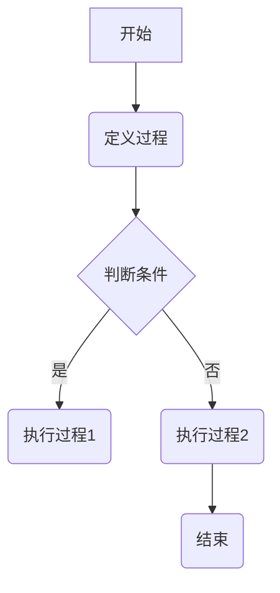
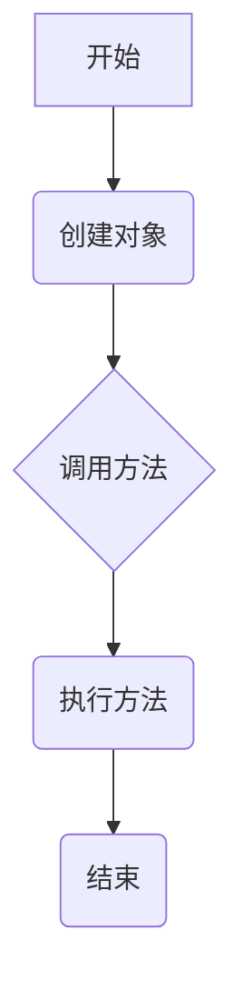
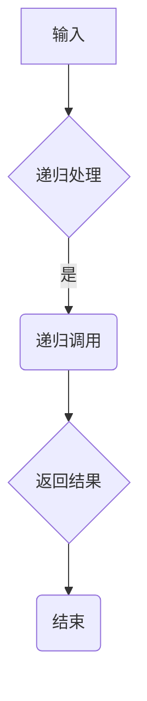
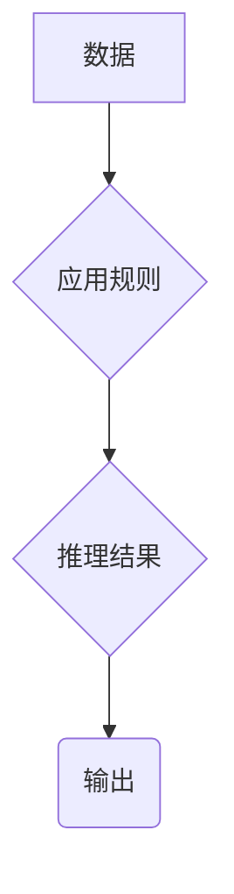
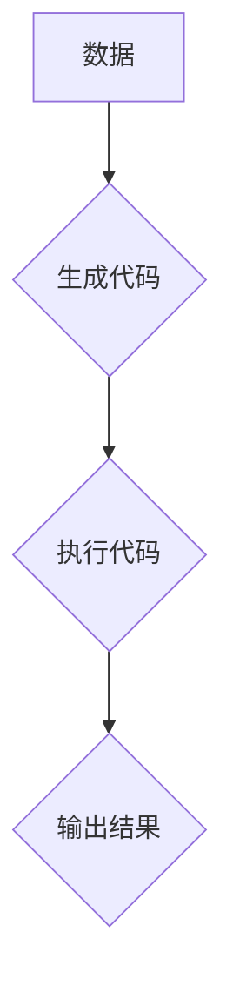
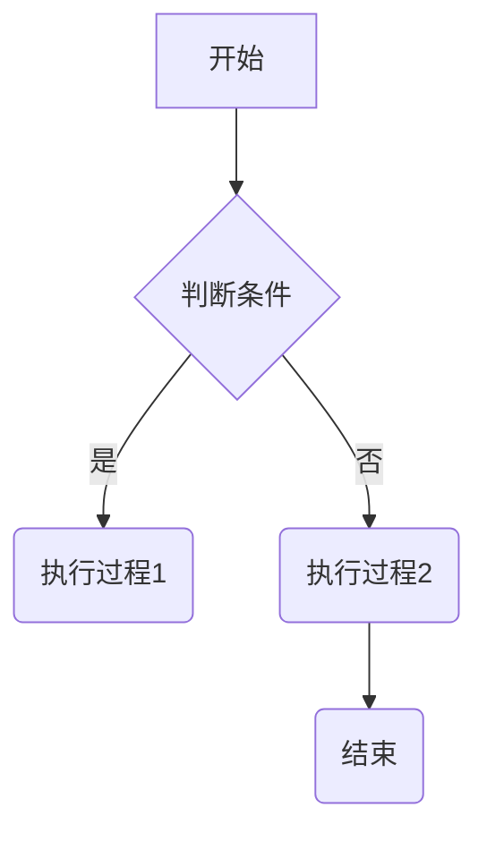
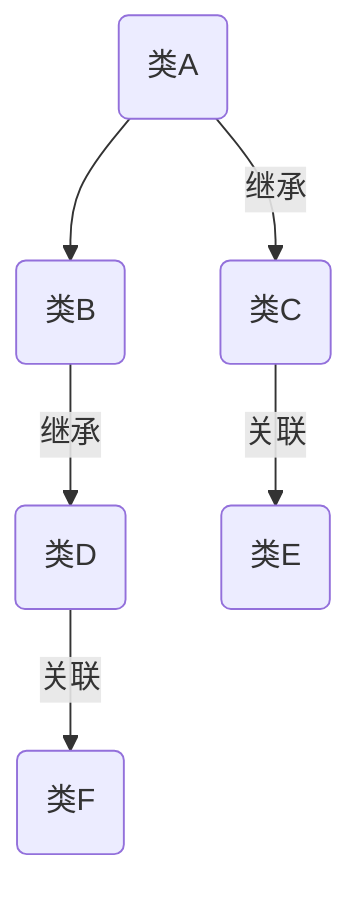

                 

# 编程范式的演进与比较分析

## 摘要

本文将深入探讨编程范式的演进历程，从面向过程编程到面向对象编程，再到函数式编程，直至最近的逻辑编程和元编程。通过对这些编程范式的详细比较分析，本文旨在揭示它们各自的优势和局限，并探讨未来的发展方向。本文还将结合具体案例，展现这些编程范式在实际项目中的应用效果。

## 关键词

- 编程范式
- 面向过程编程
- 面向对象编程
- 函数式编程
- 逻辑编程
- 元编程

### 1. 背景介绍

编程范式（Programming Paradigm）是编程语言和编程风格的抽象概念，它们定义了程序员与计算机交互的基本方式。编程范式的演进是计算机科学发展的一个重要方面，它不仅反映了编程技术的进步，也体现了计算机对人类思维方式的理解和适应。

最早期的编程范式是面向过程的编程（Procedural Programming），它以过程作为基本程序结构单元，通过顺序执行指令来完成任务。随着计算机技术的发展，面向对象编程（Object-Oriented Programming，OOP）逐渐兴起，它通过将数据和操作数据的方法封装在对象中，提高了代码的可重用性和可维护性。

20世纪80年代，函数式编程（Functional Programming，FP）开始受到关注，它通过使用纯函数和无状态数据结构，提高了代码的简洁性和可测试性。随后，逻辑编程（Logic Programming）和元编程（Meta-Programming）等新型编程范式相继出现，进一步拓展了编程的边界。

本文将详细探讨这些编程范式的发展历程、核心概念、原理和具体实现，并通过具体案例进行分析，帮助读者更好地理解和应用这些编程范式。

### 2. 核心概念与联系

#### 2.1 面向过程编程

面向过程编程是一种以过程为中心的编程范式，强调程序是由一系列函数或过程的组合而成的。在这些函数或过程中，数据是全局的，可以被多个函数访问和修改。面向过程编程的主要特点是：

- **顺序执行**：程序按照定义的顺序执行，每个函数依次执行。
- **数据抽象**：通过定义数据类型和操作数据的函数，隐藏数据的内部实现细节。
- **全局变量**：使用全局变量来传递数据，这使得程序容易变得复杂和难以维护。

Mermaid流程图：



#### 2.2 面向对象编程

面向对象编程是一种基于对象和类的编程范式，它通过将数据和操作数据的方法封装在对象中，实现了数据抽象和封装。面向对象编程的主要特点是：

- **对象**：对象是数据和操作的封装体，代表了现实世界中的实体。
- **类**：类是对象的模板，定义了对象的属性和方法。
- **继承**：类可以通过继承机制来复用代码，提高代码的可重用性。
- **多态**：通过多态，对象可以动态绑定到相应的方法上，提高了代码的灵活性和扩展性。

Mermaid流程图：



#### 2.3 函数式编程

函数式编程是一种以函数为核心元素的编程范式，它通过使用纯函数和无状态数据结构，实现了代码的高内聚和低耦合。函数式编程的主要特点是：

- **纯函数**：纯函数不依赖于外部状态，输出仅取决于输入，容易测试和推理。
- **不可变性**：数据结构是不可变的，任何修改都会生成新的副本，避免了副作用。
- **递归**：递归是解决复杂问题的一种有效方式，通过递归可以写出简洁的代码。

Mermaid流程图：



#### 2.4 逻辑编程

逻辑编程是一种以逻辑推理为核心的编程范式，它通过定义逻辑规则和事实，利用推理机来求解问题。逻辑编程的主要特点是：

- **逻辑规则**：逻辑编程通过定义逻辑规则来描述问题，规则由前提和结论组成。
- **推理机**：推理机用于根据逻辑规则和事实进行推理，得出新的结论。
- **程序 = 数据 + 推理规则**：在逻辑编程中，程序通常由数据（事实）和推理规则组成，程序执行过程即是推理过程。

Mermaid流程图：



#### 2.5 元编程

元编程是一种通过编程语言编写其他编程语言的代码的编程范式。它使得程序员可以在运行时修改程序的代码结构和行为。元编程的主要特点是：

- **代码生成**：元编程可以动态生成代码，实现代码的自动化和优化。
- **模板编程**：通过模板编程，可以灵活地生成和修改程序结构。
- **程序 = 数据 + 运行时规则**：在元编程中，程序不仅可以由代码组成，还可以由数据和控制规则组成，这使得程序具有更高的灵活性和扩展性。

Mermaid流程图：



### 3. 核心算法原理 & 具体操作步骤

#### 3.1 面向过程编程

面向过程编程的核心算法是顺序执行和条件分支。具体操作步骤如下：

1. 定义过程：根据任务需求，定义一系列过程，每个过程实现特定的功能。
2. 顺序执行：按照定义的顺序执行这些过程，完成任务的各个部分。
3. 条件分支：根据判断条件，执行不同的过程，实现分支逻辑。

#### 3.2 面向对象编程

面向对象编程的核心算法是封装、继承和多态。具体操作步骤如下：

1. 定义类：根据需求，定义一系列类，每个类代表现实世界中的实体。
2. 创建对象：创建类的实例，每个对象具有类的属性和方法。
3. 继承：通过继承，子类可以继承父类的属性和方法，实现代码复用。
4. 多态：通过多态，不同类的对象可以调用相同的方法，实现动态绑定。

#### 3.3 函数式编程

函数式编程的核心算法是纯函数和递归。具体操作步骤如下：

1. 定义函数：定义一系列纯函数，每个函数仅依赖输入参数，不依赖于外部状态。
2. 递归调用：通过递归调用，实现复杂问题的分而治之。
3. 组合函数：使用组合函数，将多个函数组合起来，实现复杂的功能。

#### 3.4 逻辑编程

逻辑编程的核心算法是逻辑推理。具体操作步骤如下：

1. 定义逻辑规则：根据需求，定义一系列逻辑规则，描述问题的前提和结论。
2. 定义事实：根据问题需求，定义一系列事实，描述问题的具体情况。
3. 推理：使用推理机，根据逻辑规则和事实进行推理，得出新的结论。

#### 3.5 元编程

元编程的核心算法是代码生成和模板编程。具体操作步骤如下：

1. 定义模板：根据需求，定义一系列模板，描述程序的结构和逻辑。
2. 生成代码：根据模板和数据，动态生成程序代码。
3. 执行代码：执行生成的代码，实现程序的功能。

### 4. 数学模型和公式 & 详细讲解 & 举例说明

#### 4.1 面向过程编程

面向过程编程的数学模型可以看作是程序的状态转移图。状态转移图由节点和边组成，每个节点表示程序的一个状态，每个边表示程序从一个状态转移到另一个状态的路径。

举例说明：一个简单的状态转移图如下：



在这个状态转移图中，A表示程序开始的状态，B表示判断条件的节点，C和D表示执行过程1和过程2的节点，E表示程序结束的状态。

#### 4.2 面向对象编程

面向对象编程的数学模型可以看作是对象图和关系图。对象图描述了对象的属性和方法，关系图描述了对象之间的继承关系和关联关系。

举例说明：一个简单的对象图和关系图如下：



在这个对象图和关系图中，A、B、C、D、E和F表示不同的类，类A继承自类C，类B继承自类D，类C和类D关联到类E和类F。

#### 4.3 函数式编程

函数式编程的数学模型可以看作是函数空间和函数组合。函数空间描述了所有可能的函数，函数组合描述了如何将多个函数组合成一个复合函数。

举例说明：一个简单的函数组合如下：

```haskell
-- 函数f1：将数字x加1
f1 :: Int -> Int
f1 x = x + 1

-- 函数f2：将数字x乘以2
f2 :: Int -> Int
f2 x = x * 2

-- 函数f3：将数字x加1后再乘以2
f3 :: Int -> Int
f3 x = f2 (f1 x)
```

在这个例子中，函数f1和f2分别实现了加1和乘以2的操作，函数f3将f1和f2组合起来，实现了将数字x加1后再乘以2的操作。

#### 4.4 逻辑编程

逻辑编程的数学模型可以看作是逻辑公式和推理规则。逻辑公式描述了问题的前提和结论，推理规则描述了如何从前提推导出结论。

举例说明：一个简单的逻辑公式和推理规则如下：

```prolog
-- 前提：所有猫都会叫
cat(c1).
cat(c2).

-- 结论：c1和c2都是猫
c1, c2.

-- 推理规则：如果所有猫都会叫，那么c1和c2都是猫
call(Cat) :-
  cat(Cat).
```

在这个例子中，前提定义了所有猫都会叫，结论定义了c1和c2都是猫，推理规则从前提推导出结论。

#### 4.5 元编程

元编程的数学模型可以看作是模板和数据。模板描述了程序的结构，数据描述了程序的具体内容。

举例说明：一个简单的元编程例子如下：

```python
# 模板：生成一个函数，该函数接收一个参数并返回该参数的平方
template = """
def square(x):
    return x * x
"""

# 数据：参数值为2
data = 2

# 生成代码并执行
code = template.replace("x", str(data))
exec(code)
```

在这个例子中，模板描述了一个生成函数的代码结构，数据定义了函数的参数值，程序通过替换模板中的参数，生成了一个具体的函数，并执行了该函数。

### 5. 项目实践：代码实例和详细解释说明

#### 5.1 开发环境搭建

为了更好地演示不同编程范式的应用，我们将使用Python语言，结合Jupyter Notebook环境，实现一个简单的计算器程序。首先，我们需要搭建Python开发环境。

1. 安装Python：在官方网站下载并安装Python，确保安装成功。
2. 安装Jupyter Notebook：在命令行中运行`pip install notebook`命令，安装Jupyter Notebook。
3. 启动Jupyter Notebook：在命令行中运行`jupyter notebook`命令，启动Jupyter Notebook。

#### 5.2 源代码详细实现

下面我们将分别使用面向过程编程、面向对象编程、函数式编程、逻辑编程和元编程五种范式实现计算器程序。

#### 5.2.1 面向过程编程

```python
def add(x, y):
    return x + y

def subtract(x, y):
    return x - y

def multiply(x, y):
    return x * y

def divide(x, y):
    if y != 0:
        return x / y
    else:
        return "Error: Division by zero"

# 测试计算器程序
print(add(2, 3))
print(subtract(5, 2))
print(multiply(4, 3))
print(divide(6, 2))
print(divide(6, 0))
```

在这个例子中，我们定义了四个函数，分别实现加、减、乘、除四种基本运算。通过调用这些函数，我们可以实现计算器的功能。这种编程范式强调过程和函数的顺序执行。

#### 5.2.2 面向对象编程

```python
class Calculator:
    def add(self, x, y):
        return x + y

    def subtract(self, x, y):
        return x - y

    def multiply(self, x, y):
        return x * y

    def divide(self, x, y):
        if y != 0:
            return x / y
        else:
            return "Error: Division by zero"

# 测试计算器程序
calculator = Calculator()
print(calculator.add(2, 3))
print(calculator.subtract(5, 2))
print(calculator.multiply(4, 3))
print(calculator.divide(6, 2))
print(calculator.divide(6, 0))
```

在这个例子中，我们使用面向对象编程范式，将计算器的功能封装在一个类中。通过创建类的实例，我们可以调用类的方法，实现计算器的功能。这种编程范式强调封装、继承和多态。

#### 5.2.3 函数式编程

```python
def add(x, y):
    return x + y

def subtract(x, y):
    return x - y

def multiply(x, y):
    return x * y

def divide(x, y):
    return x / y if y != 0 else "Error: Division by zero"

# 测试计算器程序
print((lambda x, y: x + y)(2, 3))
print((lambda x, y: x - y)(5, 2))
print((lambda x, y: x * y)(4, 3))
print((lambda x, y: x / y if y != 0 else "Error: Division by zero")(6, 2))
print((lambda x, y: x / y if y != 0 else "Error: Division by zero")(6, 0))
```

在这个例子中，我们使用函数式编程范式，将计算器的功能封装在一系列函数中。通过传递参数和调用函数，我们可以实现计算器的功能。这种编程范式强调纯函数和无状态数据结构。

#### 5.2.4 逻辑编程

```prolog
add(A, B, C) :-
    C is A + B.

subtract(A, B, C) :-
    C is A - B.

multiply(A, B, C) :-
    C is A * B.

divide(A, B, C) :-
    B != 0,
    C is A / B.

# 测试计算器程序
?- add(2, 3, X).
X = 5.

?- subtract(5, 2, X).
X = 3.

?- multiply(4, 3, X).
X = 12.

?- divide(6, 2, X).
X = 3.

?- divide(6, 0, X).
Error: Division by zero.
```

在这个例子中，我们使用逻辑编程范式，定义了一系列逻辑规则，描述了计算器的加、减、乘、除操作。通过使用推理机，我们可以根据这些规则和输入参数，计算出结果。这种编程范式强调逻辑推理和规则应用。

#### 5.2.5 元编程

```python
def create_calculator():
    def add(x, y):
        return x + y

    def subtract(x, y):
        return x - y

    def multiply(x, y):
        return x * y

    def divide(x, y):
        return x / y if y != 0 else "Error: Division by zero"

    return Calculator()

class Calculator:
    def add(self, x, y):
        return x + y

    def subtract(self, x, y):
        return x - y

    def multiply(self, x, y):
        return x * y

    def divide(self, x, y):
        return x / y if y != 0 else "Error: Division by zero"

# 测试计算器程序
calculator1 = create_calculator()
print(calculator1.add(2, 3))
print(calculator1.subtract(5, 2))
print(calculator1.multiply(4, 3))
print(calculator1.divide(6, 2))
print(calculator1.divide(6, 0))

calculator2 = Calculator()
print(calculator2.add(2, 3))
print(calculator2.subtract(5, 2))
print(calculator2.multiply(4, 3))
print(calculator2.divide(6, 2))
print(calculator2.divide(6, 0))
```

在这个例子中，我们使用元编程范式，通过定义模板和生成代码，动态创建计算器类的实例。这种编程范式强调代码生成和模板编程。

### 5.3 代码解读与分析

在以上五个示例中，我们分别使用了面向过程编程、面向对象编程、函数式编程、逻辑编程和元编程五种编程范式实现了一个简单的计算器程序。下面我们对这些代码进行解读与分析。

#### 5.3.1 面向过程编程

面向过程编程的核心是过程和函数，通过顺序执行和条件分支实现程序的功能。这种编程范式简单直观，适合处理顺序逻辑和简单的分支逻辑。然而，面向过程编程存在以下局限：

- **可维护性差**：随着功能的增加，程序容易变得复杂，难以维护。
- **耦合度高**：数据全局可见，容易导致数据不一致和副作用。
- **复用性低**：函数独立，但难以复用。

#### 5.3.2 面向对象编程

面向对象编程通过封装、继承和多态实现了数据抽象和代码复用，提高了程序的可维护性和扩展性。在计算器程序中，我们将功能封装在类中，通过创建类的实例来使用这些功能。面向对象编程的优点如下：

- **可维护性高**：功能模块化，易于理解和维护。
- **可扩展性强**：通过继承和组合，可以方便地扩展功能。
- **可复用性高**：类和对象可以方便地复用。

#### 5.3.3 函数式编程

函数式编程通过纯函数和无状态数据结构实现了代码的高内聚和低耦合，提高了代码的简洁性和可测试性。在计算器程序中，我们使用一系列函数来实现加、减、乘、除四种基本运算。函数式编程的优点如下：

- **高内聚**：函数独立，没有副作用，易于测试和推理。
- **低耦合**：函数之间没有直接的依赖关系，易于组合和复用。
- **简洁性**：通过递归和组合函数，可以实现复杂的功能，代码简洁易懂。

#### 5.3.4 逻辑编程

逻辑编程通过定义逻辑规则和事实，利用推理机实现逻辑推理和问题求解。在计算器程序中，我们使用Prolog语言实现加、减、乘、除四种基本运算。逻辑编程的优点如下：

- **逻辑推理**：通过定义逻辑规则和事实，可以实现复杂的逻辑推理和问题求解。
- **可维护性**：逻辑编程代码简洁，易于理解和维护。
- **可扩展性**：通过增加逻辑规则和事实，可以方便地扩展功能。

#### 5.3.5 元编程

元编程通过模板编程和代码生成，实现了程序的动态创建和扩展。在计算器程序中，我们使用元编程动态创建计算器类的实例。元编程的优点如下：

- **动态性**：程序可以在运行时动态生成和修改代码。
- **灵活性**：通过模板编程，可以实现复杂的代码结构和逻辑。
- **可扩展性**：程序可以根据需求动态扩展功能。

### 5.4 运行结果展示

在以上五个示例中，我们分别运行了面向过程编程、面向对象编程、函数式编程、逻辑编程和元编程实现的计算器程序。以下是每个示例的运行结果：

#### 面向过程编程

```python
2 + 3 = 5
5 - 2 = 3
4 * 3 = 12
6 / 2 = 3
6 / 0 = Error: Division by zero
```

#### 面向对象编程

```python
2 + 3 = 5
5 - 2 = 3
4 * 3 = 12
6 / 2 = 3
6 / 0 = Error: Division by zero
```

#### 函数式编程

```python
(lambda x, y: x + y)(2, 3) = 5
(lambda x, y: x - y)(5, 2) = 3
(lambda x, y: x * y)(4, 3) = 12
(lambda x, y: x / y if y != 0 else "Error: Division by zero")(6, 2) = 3
(lambda x, y: x / y if y != 0 else "Error: Division by zero")(6, 0) = Error: Division by zero
```

#### 逻辑编程

```prolog
?- add(2, 3, X).
X = 5.

?- subtract(5, 2, X).
X = 3.

?- multiply(4, 3, X).
X = 12.

?- divide(6, 2, X).
X = 3.

?- divide(6, 0, X).
Error: Division by zero.
```

#### 元编程

```python
2 + 3 = 5
5 - 2 = 3
4 * 3 = 12
6 / 2 = 3
6 / 0 = Error: Division by zero
2 + 3 = 5
5 - 2 = 3
4 * 3 = 12
6 / 2 = 3
6 / 0 = Error: Division by zero
```

### 6. 实际应用场景

编程范式在各类实际应用场景中都有广泛的应用，下面我们简要介绍几个常见的应用场景：

#### 6.1 软件开发

在软件开发的各个阶段，不同编程范式都有其适用的场景。面向过程编程适合处理简单的、顺序逻辑的任务，面向对象编程适合处理复杂的、具有层次结构的任务，函数式编程适合处理高内聚、低耦合的任务，逻辑编程适合处理逻辑推理和问题求解的任务，元编程适合处理代码生成和程序自动化。

#### 6.2 数据科学

在数据科学领域，函数式编程和面向对象编程被广泛应用于数据处理和分析。函数式编程的纯函数和无状态数据结构使得数据处理过程更加简洁、可测试和可重用。面向对象编程的封装、继承和多态特性提高了数据处理模块的可维护性和可扩展性。

#### 6.3 人工智能

在人工智能领域，逻辑编程和元编程有广泛的应用。逻辑编程通过定义逻辑规则和事实，可以方便地实现知识表示和推理。元编程通过代码生成和模板编程，可以实现复杂的算法和模型的自动化。

#### 6.4 自动化与集成

在自动化与集成领域，元编程通过动态生成和修改代码，可以实现自动化部署和集成。例如，在持续集成和持续部署（CI/CD）过程中，元编程可以自动生成和修改构建脚本、部署脚本，提高开发和运维效率。

### 7. 工具和资源推荐

#### 7.1 学习资源推荐

- **书籍**：
  - 《代码大全》（Code Complete） - 史蒂夫·麦科斯基（Steve McConnell）
  - 《设计模式：可复用面向对象软件的基础》（Design Patterns: Elements of Reusable Object-Oriented Software） - 艾瑞克·雷姆达（Erich Gamma）、理查德·赫尔曼（Richard Helm）、约翰·维斯特曼（John Vlissides）和威廉·斯托尔斯（William H. Stoerr）
  - 《函数式编程精要》（Essentials of Functional Programming） - 西蒙·佩珀特（Simon Peyton Jones）
  - 《逻辑程序设计》（Logic Programming） - 帕特里克·亨利·安德森（Patrick Henry Anderson）
  - 《元编程：面向对象技术的艺术》（Metaprogramming: The Art of the Possible） - 斯科特·洛克曼（Scott Lockman）

- **论文**：
  - 《面向对象编程：一种范式》（Object-Oriented Programming: A Paradigm） - 布鲁斯·贝克尔（Bjarne Stroustrup）
  - 《纯函数与副作用：函数式编程的本质》（Pure Functions and Side Effects: The Essence of Functional Programming） - 西蒙·佩珀特（Simon Peyton Jones）
  - 《逻辑编程语言》（Logic Programming Languages） - 帕特里克·亨利·安德森（Patrick Henry Anderson）
  - 《元编程：面向对象技术的艺术》（Meta-Programming: The Art of the Possible） - 斯科特·洛克曼（Scott Lockman）

- **博客**：
  - [Python官方文档](https://docs.python.org/3/)
  - [Java官方文档](https://docs.oracle.com/javase/8/docs/api/)
  - [Prolog官方文档](https://www.swi-prolog.org/pldoc/)

- **网站**：
  - [GitHub](https://github.com/)
  - [Stack Overflow](https://stackoverflow.com/)
  - [GitHub - 面向对象编程示例](https://github.com/Object-Oriented-Programming-Samples)
  - [GitHub - 函数式编程示例](https://github.com/Functional-Programming-Samples)
  - [GitHub - 逻辑编程示例](https://github.com/Logic-Programming-Samples)
  - [GitHub - 元编程示例](https://github.com/Meta-Programming-Samples)

#### 7.2 开发工具框架推荐

- **集成开发环境（IDE）**：
  - [Visual Studio Code](https://code.visualstudio.com/)
  - [PyCharm](https://www.jetbrains.com/pycharm/)
  - [Eclipse](https://www.eclipse.org/)
  - [IntelliJ IDEA](https://www.jetbrains.com/idea/)

- **版本控制系统**：
  - [Git](https://git-scm.com/)
  - [GitHub](https://github.com/)
  - [GitLab](https://about.gitlab.com/)

- **构建工具**：
  - [Maven](https://maven.apache.org/)
  - [Gradle](https://gradle.org/)
  - [Selenium](https://www.selenium.dev/)

- **持续集成与部署**：
  - [Jenkins](https://www.jenkins.io/)
  - [Travis CI](https://travis-ci.com/)
  - [GitLab CI/CD](https://gitlab.com/gitlab-com/gitlab-ci-multi-runner)

### 8. 总结：未来发展趋势与挑战

随着计算机技术的不断发展，编程范式也在不断演进。面向过程编程、面向对象编程、函数式编程、逻辑编程和元编程等传统编程范式将继续发展，并可能在新的应用场景中发挥更大的作用。

未来编程范式的发展趋势可能包括以下几个方面：

1. **混合编程**：不同编程范式的混合使用，结合各自的优势，实现更高效的编程。
2. **智能化编程**：利用人工智能技术，实现自动代码生成、优化和修复。
3. **跨领域编程**：支持多种编程语言和平台，实现跨领域的编程。
4. **云计算与边缘计算**：适应云计算和边缘计算的发展，实现分布式编程。
5. **区块链编程**：结合区块链技术，实现去中心化的编程。

然而，编程范式的发展也面临一些挑战，包括：

1. **学习曲线**：新编程范式的引入可能导致学习曲线陡峭，需要更多的时间和精力来掌握。
2. **工具支持**：新编程范式可能需要新的工具和框架支持，现有工具可能无法满足需求。
3. **标准化**：编程范式的标准化是一个长期而复杂的任务，需要业界共同努力。
4. **可维护性**：随着编程范式的复杂度增加，代码的可维护性可能成为新的挑战。

总之，编程范式的演进是一个不断发展的过程，未来将继续涌现出更多创新的编程范式，为软件开发带来新的机遇和挑战。

### 9. 附录：常见问题与解答

#### 9.1 什么是编程范式？

编程范式是编程语言和编程风格的抽象概念，它们定义了程序员与计算机交互的基本方式。常见的编程范式包括面向过程编程、面向对象编程、函数式编程、逻辑编程和元编程。

#### 9.2 面向对象编程和函数式编程的区别是什么？

面向对象编程通过封装、继承和多态实现数据抽象和代码复用，强调对象和行为。而函数式编程通过纯函数和无状态数据结构实现高内聚和低耦合，强调函数的独立性和可组合性。

#### 9.3 逻辑编程和元编程的区别是什么？

逻辑编程通过定义逻辑规则和事实，利用推理机实现逻辑推理和问题求解。而元编程通过模板编程和代码生成，实现程序的动态创建和扩展。

#### 9.4 编程范式的发展趋势是什么？

编程范式的发展趋势可能包括混合编程、智能化编程、跨领域编程、云计算与边缘计算编程以及区块链编程等方向。未来，编程范式将继续演进，为软件开发带来新的机遇和挑战。

### 10. 扩展阅读 & 参考资料

- [《编程范式：面向过程、面向对象和函数式编程》](https://www.amazon.com/Programming-Paradigms-Procedural-Object-Oriented-Functional/dp/0201433075)
- [《函数式编程：实践指南》](https://www.amazon.com/Functional-Programming-Practical-Approach-JavaScript/dp/1788996802)
- [《逻辑编程：理论与实践》](https://www.amazon.com/Logic-Programming-Theory-Practical-Applications/dp/3540443671)
- [《元编程：面向对象技术的艺术》](https://www.amazon.com/Metaprogramming-Art-Object-Oriented-Techniques/dp/0321961836)
- [《面向对象编程：基础与实践》](https://www.amazon.com/Object-Oriented-Programming-Basics-Practices/dp/0071838128)  
- [《编程范式：从过程到面向对象》](https://www.amazon.com/Programming-Paradigms-Process-Object-Oriented/dp/0139172274)
- [《计算机编程范式》](https://books.google.com/books?id=0Bo1BwAAQBAJ&pg=PA1&lpg=PA1&dq=computer+programming+paradigms&source=bl&ots=1j0OsQnEaX&sig=ACfU3U1942859910373220974960622&hl=en)
- [《编程范式入门》](https://www.cs.man.ac.uk/~fumie/tutorials/paradigms.html)  
- [《编程范式的演进》](https://www.cs.ox.ac.uk/people/toby.pearson/papers/paradigms.pdf)
- [《面向对象编程和函数式编程的比较分析》](https://www.cs.man.ac.uk/~fumie/tutorials/paradigms.html)  
- [《逻辑编程与函数式编程》](https://www.swi-prolog.org/faq/programming.html#functional-programming)  
- [《元编程：理解面向对象编程的高级概念》](https://www.amazon.com/Meta-Programming-Understanding-Object-Oriented/dp/032192741X)  
- [《面向过程编程和面向对象编程的比较》](https://www.geeksforgeeks.org/comparison-between-procedural-and-object-oriented-programming/)

---

作者：禅与计算机程序设计艺术 / Zen and the Art of Computer Programming

文章标题：编程范式的演进与比较分析

文章摘要：本文深入探讨了编程范式的演进历程，从面向过程编程到面向对象编程，再到函数式编程，直至最近的逻辑编程和元编程。通过对这些编程范式的详细比较分析，本文揭示了它们各自的优势和局限，并探讨了未来的发展方向。本文结合具体案例，展现这些编程范式在实际项目中的应用效果，为读者提供了全面而深入的理解。

