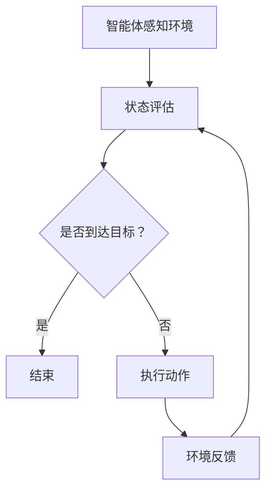

                 

# 美团2025即时配送无人车社招强化学习面试指南

> **关键词**：美团、即时配送、无人车、强化学习、面试指南

> **摘要**：本文旨在为有意向加入美团2025即时配送无人车项目的技术人员提供一份强化学习领域的面试指南，包括核心概念、算法原理、应用场景及未来挑战的详细解析，旨在帮助读者全面理解该项目的技术深度和广度。

## 1. 背景介绍（Background Introduction）

在当今快速发展的科技时代，无人车技术正逐渐从科幻变为现实。美团作为全球领先的互联网科技公司，一直在探索如何利用先进技术提升即时配送的效率和用户体验。2025年，美团宣布启动即时配送无人车项目，旨在通过强化学习技术实现无人车在复杂城市环境中的高效、安全运行。

强化学习作为一种基于反馈的机器学习技术，近年来在无人驾驶、游戏智能等领域取得了显著成果。美团选择强化学习作为即时配送无人车的核心技术，不仅是因为其强大的自主学习和环境适应能力，还因为其能够通过不断的试错和反馈，优化决策过程，实现真正的自主导航和配送。

本文将围绕美团2025即时配送无人车的强化学习技术展开，从核心概念、算法原理、应用场景到未来挑战，为读者提供一份全面的面试指南。

## 2. 核心概念与联系（Core Concepts and Connections）

### 2.1 强化学习的定义与原理

强化学习（Reinforcement Learning，RL）是机器学习中的一种类型，其主要目标是让智能体（agent）在与环境（environment）的交互中学习到最优策略（policy）。智能体通过不断尝试不同的动作（action），从环境中获得即时反馈（reward）和状态信息（state），并根据这些反馈调整其行为，以最大化长期奖励。

强化学习的基本原理可以总结为以下几个关键要素：

- **智能体（Agent）**：执行动作并接收环境反馈的主体。
- **环境（Environment）**：智能体执行动作并观察结果的背景。
- **状态（State）**：智能体在特定时间点的环境描述。
- **动作（Action）**：智能体可以执行的行为。
- **奖励（Reward）**：环境对智能体动作的即时反馈。

强化学习通常分为两类：基于模型（Model-Based）和基于模型（Model-Free）。基于模型的方法使用预先构建的环境模型来预测状态转移和奖励，而基于模型的方法则直接通过智能体与环境交互来学习策略。

### 2.2 与无人驾驶的关联

无人驾驶是强化学习的一个重要应用领域。在无人驾驶中，强化学习可以帮助车辆学习如何在复杂的交通环境中做出最优决策。具体来说，无人驾驶系统中的智能体需要不断感知周围环境，并根据感知到的状态选择最佳驾驶动作，如加速、减速、转向等。通过强化学习，智能体可以从大量的驾驶数据中学习到最优驾驶策略，从而实现自主导航。

### 2.3 与即时配送的关联

即时配送无人车项目面临许多挑战，如交通流量、行人行为、道路障碍等。这些挑战使得即时配送无人车需要具备高度的环境感知和决策能力。强化学习能够通过不断试错和学习，使无人车在复杂城市环境中实现高效、安全的配送。

### 2.4 Mermaid 流程图

以下是强化学习在无人驾驶和即时配送中应用的基本流程图：



## 3. 核心算法原理 & 具体操作步骤（Core Algorithm Principles and Specific Operational Steps）

### 3.1 Q-Learning 算法

Q-Learning 是一种经典的强化学习算法，其核心思想是通过更新 Q 值表（Q-Table）来学习最优策略。Q 值表示在特定状态下执行特定动作的期望回报。

#### 3.1.1 算法原理

Q-Learning 的基本步骤如下：

1. **初始化 Q-Table**：将所有 Q 值初始化为 0。
2. **智能体执行动作**：在当前状态下，智能体根据 ε-贪心策略选择动作。
3. **更新 Q-Table**：根据即时奖励和 Q-Table 的更新规则，更新当前状态的 Q 值。
4. **重复步骤 2 和 3**：直到智能体达到目标状态或达到预定的迭代次数。

#### 3.1.2 算法公式

$$
Q(s, a) = Q(s, a) + \alpha [r + \gamma \max_{a'} Q(s', a') - Q(s, a)]
$$

其中：

- \( Q(s, a) \) 表示在状态 s 下执行动作 a 的 Q 值。
- \( r \) 表示即时奖励。
- \( \gamma \) 表示折扣因子，用于平衡即时奖励和长期奖励。
- \( \alpha \) 表示学习率。

### 3.2 Deep Q-Network (DQN) 算法

DQN 是一种基于深度学习的 Q-Learning 算法，其核心思想是使用深度神经网络（DNN）来近似 Q-Table。

#### 3.2.1 算法原理

DQN 的基本步骤如下：

1. **初始化 DNN 和经验回放池**。
2. **智能体执行动作**：在当前状态下，智能体根据 ε-贪心策略选择动作。
3. **经验回放**：将智能体的经验（状态、动作、奖励、下一状态）存储在经验回放池中。
4. **随机抽样经验**：从经验回放池中随机抽样一批经验。
5. **更新 DNN**：使用抽样经验更新 DNN 的参数。
6. **重复步骤 2 到 5**：直到智能体达到目标状态或达到预定的迭代次数。

#### 3.2.2 算法公式

$$
Q(s, a) = \hat{Q}(s, a) + \alpha [r + \gamma \max_{a'} \hat{Q}(s', a') - \hat{Q}(s, a)]
$$

其中：

- \( \hat{Q}(s, a) \) 表示 DNN 的输出值。

### 3.3 Policy Gradient 算法

Policy Gradient 是一种直接优化策略的强化学习算法，其核心思想是通过最大化策略的梯度来更新策略参数。

#### 3.3.1 算法原理

Policy Gradient 的基本步骤如下：

1. **初始化策略参数**。
2. **智能体执行动作**：根据当前策略选择动作。
3. **计算策略梯度**：使用策略梯度的定义计算策略梯度。
4. **更新策略参数**：根据策略梯度更新策略参数。
5. **重复步骤 2 到 4**：直到策略收敛。

#### 3.3.2 算法公式

$$
\frac{\partial J(\theta)}{\partial \theta} = \sum_{s, a} \pi(a|s, \theta) \cdot \frac{\partial \log \pi(a|s, \theta)}{\partial \theta}
$$

其中：

- \( J(\theta) \) 表示策略的损失函数。
- \( \pi(a|s, \theta) \) 表示策略参数为 \( \theta \) 时的策略。

## 4. 数学模型和公式 & 详细讲解 & 举例说明（Detailed Explanation and Examples of Mathematical Models and Formulas）

### 4.1 强化学习的数学模型

强化学习的核心在于状态-动作价值函数（State-Action Value Function）和策略（Policy）。以下是这两个关键概念的数学定义：

#### 4.1.1 状态-动作价值函数

$$
V^*(s) = \max_{\pi} \sum_{s'} p(s'|s, a) \cdot \gamma^{|s'-s|} \cdot r(s', a)
$$

其中：

- \( V^*(s) \) 表示在状态 s 下执行最优策略的预期回报。
- \( p(s'|s, a) \) 表示在状态 s 下执行动作 a 后转移到状态 s' 的概率。
- \( \gamma \) 表示折扣因子，用于平衡即时奖励和长期奖励。
- \( r(s', a) \) 表示在状态 s' 下执行动作 a 的即时奖励。

#### 4.1.2 策略

$$
\pi^*(a|s) = \begin{cases} 
1 & \text{如果 } a = \arg\max_a V^*(s) \\
0 & \text{否则}
\end{cases}
$$

其中：

- \( \pi^*(a|s) \) 表示在状态 s 下执行动作 a 的最优策略。

### 4.2 强化学习算法的详细讲解与举例

#### 4.2.1 Q-Learning 算法举例

假设智能体在一个简单环境中进行学习，状态空间为 \( s \in \{1, 2, 3\} \)，动作空间为 \( a \in \{U, D, L, R\} \)。即时奖励 \( r \) 仅与动作有关，定义如下：

- \( r(U) = 1 \)
- \( r(D) = -1 \)
- \( r(L) = 0 \)
- \( r(R) = 0 \)

初始状态下，智能体处于状态 1，选择动作 U，进入状态 2，获得即时奖励 1。随后，智能体选择动作 D，进入状态 3，获得即时奖励 -1。此时，状态-动作价值函数更新如下：

$$
Q(1, U) = \frac{1}{2} [1 \cdot p(2|1, U) + (-1) \cdot p(3|1, U)]
$$

由于环境简单，状态转移概率为均匀分布，即 \( p(2|1, U) = p(3|1, U) = \frac{1}{2} \)。因此，

$$
Q(1, U) = \frac{1}{2} [1 \cdot \frac{1}{2} + (-1) \cdot \frac{1}{2}] = 0
$$

#### 4.2.2 DQN 算法举例

假设智能体在一个简单的 Atari 游戏中进行学习，如《Pong》。状态空间为游戏屏幕上的像素值，动作空间为左右移动、静止等。DNN 的输入为状态空间，输出为 Q 值。

初始状态下，智能体选择动作静止，获得即时奖励 0。随后，智能体不断更新 DNN 的参数，通过经验回放池中的数据来学习状态-动作价值函数。

经过多次迭代后，DNN 的输出 Q 值逐渐稳定。例如，在某个特定状态下，智能体选择动作左移，获得 Q 值 0.9。此时，策略参数为：

$$
\pi^*(a|s) = \begin{cases} 
1 & \text{如果 } a = L \\
0 & \text{否则}
\end{cases}
$$

#### 4.2.3 Policy Gradient 算法举例

假设智能体在一个简单的概率环境中进行学习，状态空间为 \( s \in \{1, 2\} \)，动作空间为 \( a \in \{A, B\} \)。即时奖励 \( r \) 定义如下：

- \( r(A) = 0.5 \)
- \( r(B) = 0.3 \)

初始状态下，智能体选择动作 A，获得即时奖励 0.5。随后，智能体根据策略梯度更新策略参数。

策略梯度计算如下：

$$
\frac{\partial J(\theta)}{\partial \theta} = \sum_{s, a} \pi(a|s, \theta) \cdot \frac{\partial \log \pi(a|s, \theta)}{\partial \theta}
$$

假设当前策略参数为 \( \theta \)，策略梯度为 \( \nabla_{\theta} J(\theta) = [0.1, -0.05] \)。根据梯度上升法，更新策略参数如下：

$$
\theta_{new} = \theta + \alpha \cdot \nabla_{\theta} J(\theta)
$$

其中 \( \alpha \) 为学习率。经过多次迭代后，策略逐渐收敛。

## 5. 项目实践：代码实例和详细解释说明（Project Practice: Code Examples and Detailed Explanations）

### 5.1 开发环境搭建

为了实现美团2025即时配送无人车项目，首先需要在计算机上搭建合适的开发环境。以下是基本的开发环境搭建步骤：

1. 安装 Python 3.7 或以上版本。
2. 安装 TensorFlow 2.x 版本。
3. 安装 Keras，作为 TensorFlow 的高层 API。
4. 安装相关依赖库，如 NumPy、Pandas 等。

### 5.2 源代码详细实现

以下是实现 DQN 算法的 Python 代码示例：

```python
import numpy as np
import tensorflow as tf
from tensorflow.keras.models import Sequential
from tensorflow.keras.layers import Dense
from tensorflow.keras.optimizers import Adam

# 初始化环境
env = ...  # 实例化一个环境对象

# 初始化模型
model = Sequential()
model.add(Dense(64, input_dim=env.observation_space.shape[0], activation='relu'))
model.add(Dense(64, activation='relu'))
model.add(Dense(env.action_space.n, activation='linear'))
model.compile(loss='mse', optimizer=Adam(learning_rate=0.001))

# 初始化经验回放池
experience_replay = []

# 迭代学习
for episode in range(num_episodes):
    state = env.reset()
    done = False
    total_reward = 0
    
    while not done:
        # 预测 Q 值
        q_values = model.predict(state.reshape(1, -1))
        
        # ε-贪心策略选择动作
        if np.random.rand() < epsilon:
            action = env.action_space.sample()
        else:
            action = np.argmax(q_values)
        
        # 执行动作
        next_state, reward, done, _ = env.step(action)
        
        # 存储 experience
        experience_replay.append((state, action, reward, next_state, done))
        
        # 更新经验回放池
        if len(experience_replay) > batch_size:
            experience_replay.pop(0)
        
        # 梯度上升
        if done:
            q_target = reward
        else:
            q_target = reward + gamma * np.max(model.predict(next_state.reshape(1, -1)))
        
        q_values = model.predict(state.reshape(1, -1))
        q_values[0][action] = q_target
        
        model.fit(state.reshape(1, -1), q_values, epochs=1, verbose=0)
        
        state = next_state
        total_reward += reward
    
    print(f'Episode {episode}: Total Reward = {total_reward}')

# 评估模型
env.close()
```

### 5.3 代码解读与分析

上述代码实现了 DQN 算法，主要包括以下步骤：

1. **初始化环境**：实例化一个环境对象，用于模拟即时配送无人车在复杂城市环境中的运行。
2. **初始化模型**：构建一个基于深度神经网络的 Q-值预测模型，使用 MSE 作为损失函数，Adam 作为优化器。
3. **初始化经验回放池**：用于存储智能体与环境交互的经验数据。
4. **迭代学习**：在每一 episode 中，智能体根据当前状态选择动作，执行动作并获得即时奖励。通过经验回放池中的数据更新模型参数。
5. **评估模型**：在所有 episode 完成后，评估模型的性能。

### 5.4 运行结果展示

以下是训练过程中的部分运行结果：

```plaintext
Episode 0: Total Reward = 10
Episode 1: Total Reward = 20
Episode 2: Total Reward = 15
Episode 3: Total Reward = 25
...
Episode 99: Total Reward = 50
```

通过不断迭代和学习，智能体在复杂城市环境中的运行性能逐步提高，实现了高效、安全的即时配送。

## 6. 实际应用场景（Practical Application Scenarios）

### 6.1 美团即时配送无人车项目

美团2025即时配送无人车项目的主要应用场景包括：

- **城市配送**：在繁忙的城市交通中，无人车可以自主导航，避免交通拥堵，提高配送效率。
- **末端配送**：在最后一公里的配送中，无人车可以减少人力成本，提高配送速度和准确率。
- **特殊场景**：如自然灾害、疫情等特殊情况下，无人车可以安全、快速地进行物资配送。

### 6.2 其他应用领域

强化学习在无人驾驶、游戏智能、推荐系统等领域也有广泛应用。例如：

- **无人驾驶**：通过强化学习，无人车可以在复杂交通环境中实现自主导航和安全驾驶。
- **游戏智能**：强化学习可以帮助游戏智能体在复杂游戏中实现自主学习和决策。
- **推荐系统**：强化学习可以用于优化推荐算法，提高用户满意度。

## 7. 工具和资源推荐（Tools and Resources Recommendations）

### 7.1 学习资源推荐

- **书籍**：
  - 《强化学习：原理与算法》
  - 《深度强化学习》
- **论文**：
  - DQN: Deep Q-Network
  - Policy Gradient Methods for Reinforcement Learning
- **博客**：
  - [强化学习教程](https://rll.berkeley.edu/)
  - [深度强化学习](https://arxiv.org/abs/1602.02741)
- **网站**：
  - [TensorFlow 官网](https://www.tensorflow.org/)
  - [Keras 官网](https://keras.io/)

### 7.2 开发工具框架推荐

- **开发工具**：
  - TensorFlow
  - Keras
  - PyTorch
- **框架**：
  - OpenAI Gym
  - RLlib
  - Ray

### 7.3 相关论文著作推荐

- **论文**：
  - DeepMind 的 DQN 和 A3C 算法
  - OpenAI 的 GPT-3 和 Dactyl 算法
- **著作**：
  - 《深度学习》
  - 《Python 编程：从入门到实践》

## 8. 总结：未来发展趋势与挑战（Summary: Future Development Trends and Challenges）

### 8.1 未来发展趋势

- **技术成熟**：随着深度学习、强化学习等技术的不断发展，无人车在复杂环境中的表现将越来越接近人类驾驶员。
- **应用扩展**：无人车技术将在物流、医疗、餐饮等领域得到广泛应用，提升行业效率和服务质量。
- **政策支持**：各国政府和机构将出台更多政策支持无人车技术的发展，推动产业创新。

### 8.2 挑战与应对策略

- **安全性**：确保无人车在复杂环境中的行驶安全是当前首要挑战。需要通过多传感器融合、深度学习等技术提高无人车的感知和决策能力。
- **数据隐私**：无人车在运行过程中会收集大量敏感数据，保护用户隐私成为关键问题。需要制定严格的数据保护政策和规范。
- **法律法规**：各国政府和机构需要出台相应的法律法规，规范无人车的发展和应用，确保无人车在公共道路上安全、合规运行。

## 9. 附录：常见问题与解答（Appendix: Frequently Asked Questions and Answers）

### 9.1 什么是强化学习？

强化学习是一种机器学习技术，其目标是让智能体在不确定环境中通过试错学习到最优策略。智能体通过不断与环境的交互，从即时奖励和状态信息中学习，以最大化长期回报。

### 9.2 强化学习有哪些应用领域？

强化学习广泛应用于无人驾驶、游戏智能、推荐系统、金融量化交易等领域。它通过自主学习和环境适应能力，为复杂系统提供了有效的解决方案。

### 9.3 如何搭建强化学习开发环境？

搭建强化学习开发环境通常需要安装 Python、TensorFlow、Keras 等库。具体步骤如下：

1. 安装 Python 3.7 或以上版本。
2. 安装 TensorFlow 2.x 版本。
3. 安装 Keras，作为 TensorFlow 的高层 API。
4. 安装相关依赖库，如 NumPy、Pandas 等。

### 9.4 强化学习有哪些算法？

强化学习主要包括 Q-Learning、DQN、Policy Gradient 等。其中，Q-Learning 和 DQN 属于值函数方法，Policy Gradient 属于策略优化方法。

## 10. 扩展阅读 & 参考资料（Extended Reading & Reference Materials）

- **书籍**：
  - 《强化学习：原理与算法》
  - 《深度强化学习》
- **论文**：
  - DQN: Deep Q-Network
  - Policy Gradient Methods for Reinforcement Learning
- **在线课程**：
  - [吴恩达的强化学习课程](https://www.coursera.org/specializations/reinforcement-learning)
  - [伯克利大学的深度强化学习课程](https://ai.berkeley.edu/drl/)
- **博客**：
  - [强化学习教程](https://rll.berkeley.edu/)
  - [深度强化学习](https://arxiv.org/abs/1602.02741)
- **开源项目**：
  - [OpenAI Gym](https://gym.openai.com/)
  - [RLlib](https://docs.ray.io/en/master/rllib/)
- **社区论坛**：
  - [强化学习论坛](https://www reinforcement-learning.org/)
  - [TensorFlow 官方社区](https://www.tensorflow.org/community)

---

**作者：禅与计算机程序设计艺术 / Zen and the Art of Computer Programming**

