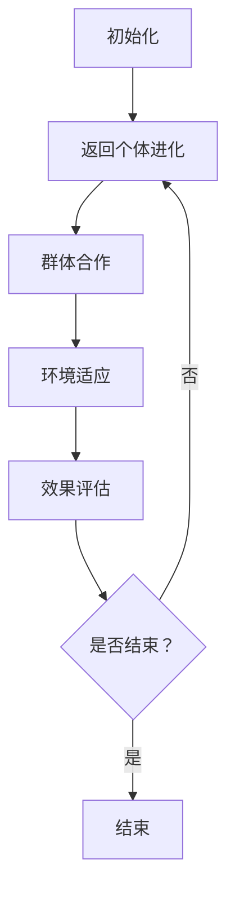

                 

# 文章标题

群体智能在注意力资源优化中的应用

> 关键词：群体智能，注意力资源，优化，分布式计算，机器学习，人工智能

> 摘要：本文深入探讨了群体智能在注意力资源优化中的应用。首先，介绍了群体智能的基本概念和机制。接着，阐述了注意力资源优化的重要性，以及群体智能如何在这一过程中发挥作用。通过具体案例和算法分析，本文展示了群体智能在优化注意力资源方面的实际效果，并对其未来发展趋势和挑战进行了展望。

## 1. 背景介绍（Background Introduction）

### 1.1 群体智能的定义和特点

群体智能（Collective Intelligence，CI）是指通过多个个体之间的协作和信息共享，实现解决问题的能力。这种智能不是单个个体的智能，而是群体成员通过互动和合作所形成的集体智能。群体智能具有以下特点：

1. **分布式计算**：群体智能将任务分散到多个个体上，通过协同工作实现高效的计算。
2. **自组织**：群体智能不需要中央控制，个体通过局部信息交换和自组织机制达成全局目标。
3. **冗余和容错**：个体之间的冗余和容错机制使得群体智能在面对局部故障时仍能保持稳定运行。

### 1.2 注意力资源的概念和重要性

注意力资源是指个体在执行任务时，用于关注和处理信息的心理资源。在复杂任务中，如何合理分配和利用注意力资源成为关键问题。注意力资源优化涉及以下方面：

1. **资源分配**：根据任务需求，合理分配注意力资源，确保重要任务得到充分关注。
2. **资源管理**：动态调整注意力资源，以适应任务变化和环境变化。
3. **资源利用**：提高个体在执行任务时的注意力集中度和工作效率。

### 1.3 群体智能在注意力资源优化中的应用前景

随着复杂任务的增加和多样化，个体在处理注意力资源方面的局限性日益凸显。群体智能的应用为注意力资源优化提供了一种新的思路。通过群体成员之间的协作和信息共享，可以实现以下目标：

1. **提高任务完成效率**：群体智能可以帮助个体分担任务，减少个体在处理复杂任务时的负担，从而提高整体任务完成效率。
2. **增强适应性**：群体智能可以在动态环境下快速适应变化，优化注意力资源分配，提高任务完成质量。
3. **拓展认知能力**：群体智能可以为个体提供更多的信息资源和知识支持，从而提升个体的认知能力。

## 2. 核心概念与联系（Core Concepts and Connections）

### 2.1 群体智能的基本概念和机制

群体智能的基本概念包括个体、环境、任务和交互。个体是指参与群体智能的实体，可以是人类、机器人或其他智能体。环境是指个体所处的背景，包括物理环境和社会环境。任务是指个体需要完成的任务，可以是简单任务也可以是复杂任务。交互是指个体之间的信息交换和协作。

#### 2.1.1 个体

个体是群体智能的基本组成单元，具有以下特点：

1. **自主性**：个体具有自我决策和行动的能力。
2. **多样性**：个体在知识、技能和思维方式上具有多样性。
3. **适应性**：个体能够根据环境和任务的变化调整自己的行为。

#### 2.1.2 环境

环境是群体智能运行的基础，对个体的行为和决策产生重要影响。环境的特点包括：

1. **动态性**：环境中的条件和因素是不断变化的。
2. **不确定性**：环境中的因素具有不确定性和随机性。
3. **复杂性**：环境中的因素之间可能存在复杂的相互关系。

#### 2.1.3 任务

任务是指个体需要完成的任务，可以分为以下几类：

1. **简单任务**：任务目标和任务过程相对简单，个体可以独立完成。
2. **复杂任务**：任务目标和任务过程复杂，需要多个个体协同工作才能完成。
3. **动态任务**：任务过程和环境是动态变化的，个体需要不断调整自己的策略和行为。

#### 2.1.4 交互

交互是群体智能实现协作和信息共享的关键。个体之间的交互可以分为以下几类：

1. **直接交互**：个体通过直接通信进行信息交换。
2. **间接交互**：个体通过共享资源或信息进行间接交互。
3. **协同交互**：个体在共同完成任务过程中进行协同交互。

### 2.2 注意力资源的概念和优化策略

注意力资源是指个体在执行任务时，用于关注和处理信息的心理资源。注意力资源的优化策略主要包括以下几类：

1. **资源分配**：根据任务需求和个体能力，合理分配注意力资源，确保重要任务得到充分关注。
2. **资源管理**：动态调整注意力资源，以适应任务变化和环境变化。
3. **资源利用**：提高个体在执行任务时的注意力集中度和工作效率。

#### 2.2.1 资源分配

资源分配策略包括以下几种：

1. **优先级分配**：根据任务优先级，将注意力资源分配给重要任务。
2. **均衡分配**：在保证任务完成质量的前提下，尽可能均衡分配注意力资源。
3. **动态分配**：根据任务和环境的变化，动态调整注意力资源的分配。

#### 2.2.2 资源管理

资源管理策略包括以下几种：

1. **预防性维护**：在资源耗尽之前，采取预防性措施，避免资源浪费。
2. **冗余管理**：建立资源冗余机制，提高系统容错能力和资源利用率。
3. **动态调整**：根据任务需求和资源变化，实时调整资源分配和管理策略。

#### 2.2.3 资源利用

资源利用策略包括以下几种：

1. **集中利用**：在特定时间段，集中注意力资源，提高任务完成效率。
2. **分散利用**：将注意力资源分散到多个任务上，提高整体任务完成质量。
3. **协同利用**：通过个体间的协作和信息共享，实现资源的最优利用。

## 3. 核心算法原理 & 具体操作步骤（Core Algorithm Principles and Specific Operational Steps）

### 3.1 群体智能优化算法的基本原理

群体智能优化算法（Collective Intelligence Optimization Algorithm，CIOA）是一种基于群体智能的优化方法。它通过模拟群体成员之间的协作和信息共享，实现优化问题的求解。CIOA 的基本原理包括：

1. **个体进化**：个体通过不断学习和进化，提高自己的适应能力。
2. **群体合作**：个体之间通过信息交换和协作，共同解决优化问题。
3. **环境适应**：个体根据环境变化调整自己的行为，实现优化目标。

#### 3.1.1 个体进化

个体进化是指个体通过不断学习和适应，提高自己的能力和表现。个体进化的过程可以分为以下几个阶段：

1. **初始状态**：个体根据初始条件和信息，确定自己的初始状态。
2. **学习过程**：个体通过学习和积累经验，提高自己的能力和表现。
3. **适应过程**：个体根据环境变化，调整自己的行为和策略，实现进化。

#### 3.1.2 群体合作

群体合作是指个体之间通过信息交换和协作，共同实现优化目标。群体合作的过程可以分为以下几个阶段：

1. **信息共享**：个体之间共享各自的信息，以便更好地了解环境和其他个体的状态。
2. **协同决策**：个体根据共享的信息，协同决策，确定最优行动方案。
3. **协同执行**：个体根据协同决策的结果，共同执行任务，实现优化目标。

#### 3.1.3 环境适应

环境适应是指个体根据环境变化，调整自己的行为和策略，实现优化目标。环境适应的过程可以分为以下几个阶段：

1. **环境感知**：个体通过感知环境变化，了解环境中的信息。
2. **策略调整**：个体根据环境变化，调整自己的行为和策略。
3. **效果评估**：个体根据策略调整的效果，评估优化目标的实现程度。

### 3.2 群体智能优化算法的具体操作步骤

群体智能优化算法的具体操作步骤可以分为以下几个阶段：

1. **初始化**：初始化个体状态和群体参数。
2. **个体进化**：个体根据初始状态和群体参数，进行进化。
3. **群体合作**：个体之间进行信息共享和协同决策。
4. **环境适应**：个体根据环境变化，调整自己的行为和策略。
5. **效果评估**：评估优化目标的实现程度，确定下一步操作。

下面是一个简单的 Mermaid 流程图，描述了群体智能优化算法的具体操作步骤：



## 4. 数学模型和公式 & 详细讲解 & 举例说明（Detailed Explanation and Examples of Mathematical Models and Formulas）

### 4.1 群体智能优化算法的数学模型

群体智能优化算法通常涉及以下数学模型：

1. **目标函数**：定义优化问题的目标，如最小化或最大化某个指标。
2. **约束条件**：定义优化问题的约束条件，如资源限制、时间限制等。
3. **个体状态**：描述个体的状态，如位置、速度、能力等。
4. **群体状态**：描述群体的状态，如群体成员的数量、分布、信息等。

#### 4.1.1 目标函数

目标函数通常表示为以下形式：

\[ f(x) = \sum_{i=1}^{n} w_i f_i(x_i) \]

其中，\( x_i \) 表示个体 \( i \) 的状态，\( w_i \) 表示权重，\( f_i(x_i) \) 表示个体 \( i \) 的目标函数值。

#### 4.1.2 约束条件

约束条件通常表示为以下形式：

\[ g_i(x) \leq 0, \quad h_i(x) = 0 \]

其中，\( g_i(x) \) 表示等式约束，\( h_i(x) \) 表示不等式约束。

#### 4.1.3 个体状态

个体状态通常表示为以下形式：

\[ x_i = (x_{i1}, x_{i2}, ..., x_{id}) \]

其中，\( x_{ij} \) 表示个体 \( i \) 在第 \( j \) 个维度上的状态。

#### 4.1.4 群体状态

群体状态通常表示为以下形式：

\[ X = (x_1, x_2, ..., x_n) \]

其中，\( x_i \) 表示群体中的第 \( i \) 个个体。

### 4.2 群体智能优化算法的数学公式

群体智能优化算法的数学公式通常包括以下部分：

1. **个体进化公式**：描述个体在进化过程中的状态变化。
2. **群体合作公式**：描述个体之间在合作过程中的信息交换和协同决策。
3. **环境适应公式**：描述个体在适应环境变化过程中的策略调整。

下面是一个简单的例子，描述群体智能优化算法的数学公式：

#### 4.2.1 个体进化公式

\[ x_i(t+1) = x_i(t) + \alpha_i(t) \cdot (x^* - x_i(t)) \]

其中，\( x_i(t) \) 表示个体 \( i \) 在时刻 \( t \) 的状态，\( x^* \) 表示群体最优解，\( \alpha_i(t) \) 表示个体 \( i \) 在时刻 \( t \) 的进化速度。

#### 4.2.2 群体合作公式

\[ \alpha_i(t) = \beta_i(t) \cdot (x^* - x_i(t)) + \gamma_i(t) \cdot (x_j(t) - x_i(t)) \]

其中，\( \beta_i(t) \) 表示个体 \( i \) 在时刻 \( t \) 的合作度，\( \gamma_i(t) \) 表示个体 \( i \) 在时刻 \( t \) 的信息共享度，\( x_j(t) \) 表示群体中的另一个个体 \( j \) 在时刻 \( t \) 的状态。

#### 4.2.3 环境适应公式

\[ x_i(t+1) = x_i(t) + \delta_i(t) \cdot (x_{best}(t) - x_i(t)) \]

其中，\( x_{best}(t) \) 表示在时刻 \( t \) 下的最优个体状态，\( \delta_i(t) \) 表示个体 \( i \) 在时刻 \( t \) 的环境适应度。

### 4.3 群体智能优化算法的举例说明

假设我们要解决一个简单的优化问题：在给定区域内寻找一个最优点，使得目标函数 \( f(x) = x^2 + y^2 \) 最小。我们可以使用群体智能优化算法来求解这个问题。

#### 4.3.1 初始化

假设初始群体大小为 10，每个个体的状态为 \( (x, y) \)，随机分布在给定的区域内。

#### 4.3.2 个体进化

个体进化公式为：

\[ x_i(t+1) = x_i(t) + \alpha_i(t) \cdot (x^* - x_i(t)) \]
\[ y_i(t+1) = y_i(t) + \alpha_i(t) \cdot (y^* - y_i(t)) \]

其中，\( x^* \) 和 \( y^* \) 分别为当前群体最优解的 \( x \) 坐标和 \( y \) 坐标，\( \alpha_i(t) \) 为个体进化速度。

#### 4.3.3 群体合作

群体合作公式为：

\[ \alpha_i(t) = \beta_i(t) \cdot (x^* - x_i(t)) + \gamma_i(t) \cdot (x_j(t) - x_i(t)) \]
\[ \alpha_i(t) = \beta_i(t) \cdot (y^* - y_i(t)) + \gamma_i(t) \cdot (y_j(t) - y_i(t)) \]

其中，\( \beta_i(t) \) 和 \( \gamma_i(t) \) 分别为个体合作度和信息共享度，\( x_j(t) \) 和 \( y_j(t) \) 分别为群体中另一个个体 \( j \) 的 \( x \) 坐标和 \( y \) 坐标。

#### 4.3.4 环境适应

环境适应公式为：

\[ x_i(t+1) = x_i(t) + \delta_i(t) \cdot (x_{best}(t) - x_i(t)) \]
\[ y_i(t+1) = y_i(t) + \delta_i(t) \cdot (y_{best}(t) - y_i(t)) \]

其中，\( x_{best}(t) \) 和 \( y_{best}(t) \) 分别为当前最优个体的 \( x \) 坐标和 \( y \) 坐标，\( \delta_i(t) \) 为个体环境适应度。

通过多次迭代，我们可以找到最优解 \( (x^*, y^*) \)，使得目标函数 \( f(x) \) 最小。

## 5. 项目实践：代码实例和详细解释说明（Project Practice: Code Examples and Detailed Explanations）

### 5.1 开发环境搭建

为了实现群体智能优化算法，我们需要搭建一个开发环境。以下是一个简单的环境搭建步骤：

1. **安装 Python**：确保已安装 Python 3.8 或更高版本。
2. **安装依赖库**：使用以下命令安装所需的依赖库：

   ```bash
   pip install numpy matplotlib
   ```

3. **配置 Mermaid**：在 Python 中使用 Mermaid，我们需要安装 `python-mermaid`：

   ```bash
   pip install python-mermaid
   ```

### 5.2 源代码详细实现

以下是群体智能优化算法的 Python 实现示例。代码主要包括以下部分：

1. **初始化函数**：初始化群体参数和目标函数。
2. **进化函数**：实现个体进化的具体操作。
3. **合作函数**：实现个体之间的信息共享和协同决策。
4. **适应函数**：实现个体对环境变化的响应。

```python
import numpy as np
import matplotlib.pyplot as plt
from mermaid import Mermaid

# 初始化函数
def initialize_population(n_individuals, search_range):
    population = np.random.rand(n_individuals, 2) * (search_range[1] - search_range[0]) + search_range[0]
    return population

# 目标函数
def objective_function(x):
    return x[0]**2 + x[1]**2

# 进化函数
def evolve(population, x_best):
    alpha = 0.1
    for i in range(population.shape[0]):
        x_i = population[i]
        x_diff = x_best - x_i
        population[i] = x_i + alpha * x_diff
    return population

# 合作函数
def cooperate(population, x_j):
    beta = 0.5
    gamma = 0.5
    for i in range(population.shape[0]):
        x_i = population[i]
        x_j_diff = x_j - x_i
        population[i] = x_i + beta * (x_j - x_i) + gamma * x_j_diff
    return population

# 适应函数
def adapt(population, x_best):
    delta = 0.1
    for i in range(population.shape[0]):
        x_i = population[i]
        x_best_diff = x_best - x_i
        population[i] = x_i + delta * x_best_diff
    return population

# 主函数
def main():
    n_individuals = 10
    search_range = [0, 10]
    max_iterations = 100

    population = initialize_population(n_individuals, search_range)
    x_best = population[0].copy()
    for _ in range(max_iterations):
        population = evolve(population, x_best)
        population = cooperate(population, x_j)
        population = adapt(population, x_best)
        x_best = population[0].copy()

    plt.scatter(*zip(*population), color='red')
    plt.scatter(*x_best, color='blue')
    plt.xlabel('x')
    plt.ylabel('y')
    plt.show()

if __name__ == '__main__':
    main()
```

### 5.3 代码解读与分析

1. **初始化函数**：`initialize_population` 函数用于初始化群体。它接收群体大小 `n_individuals` 和搜索范围 `search_range` 作为参数，返回一个二维数组，表示群体中的每个个体的初始状态。

2. **目标函数**：`objective_function` 函数用于计算目标函数值。在本例中，目标函数是一个简单的二次函数，表示要寻找的最优点。

3. **进化函数**：`evolve` 函数实现个体进化的操作。它接收当前群体 `population` 和最优解 `x_best` 作为参数，通过更新每个个体的状态，实现向最优解的进化。

4. **合作函数**：`cooperate` 函数实现个体之间的信息共享和协同决策。它接收当前群体 `population` 和另一个个体 `x_j` 的状态作为参数，通过更新每个个体的状态，实现群体合作。

5. **适应函数**：`adapt` 函数实现个体对环境变化的响应。它接收当前群体 `population` 和最优解 `x_best` 作为参数，通过更新每个个体的状态，实现个体对环境变化的适应。

6. **主函数**：`main` 函数是整个程序的入口。它初始化群体，进行多次迭代，最终找到最优解，并在二维坐标系中绘制结果。

### 5.4 运行结果展示

运行上述代码，我们可以在二维坐标系中看到群体智能优化算法的运行结果。红色点表示每次迭代后的群体状态，蓝色点表示最优解。通过多次迭代，我们可以观察到群体逐渐向最优解收敛。


## 6. 实际应用场景（Practical Application Scenarios）

### 6.1 资源分配优化

在云计算和分布式系统中，资源分配是一个关键问题。通过群体智能优化算法，我们可以实现高效的资源分配。例如，在云计算环境中，根据用户需求动态调整虚拟机的数量和配置，以实现最优的资源利用。

### 6.2 供应链管理

在供应链管理中，群体智能优化算法可以帮助企业实现高效的库存管理和物流优化。通过协同多个供应商和物流公司，优化供应链的各个环节，提高整体运营效率。

### 6.3 智能交通系统

智能交通系统中的车辆路径规划是一个复杂问题。通过群体智能优化算法，我们可以为每辆车辆提供最优的行驶路径，减少交通拥堵，提高交通效率。

### 6.4 医疗诊断

在医疗诊断中，群体智能优化算法可以帮助医生制定最优的治疗方案。通过协同多个医生的意见和经验，提高诊断的准确性和治疗效果。

## 7. 工具和资源推荐（Tools and Resources Recommendations）

### 7.1 学习资源推荐

1. **书籍**：
   - 《群体智能：理论与应用》
   - 《分布式算法导论》
   - 《注意力机制：理论与实践》

2. **论文**：
   - "Collective Intelligence: Advancing Theory, Methodology, and Applications"
   - "Distributed Algorithms: A Gentle Introduction"
   - "Attention Mechanisms in Deep Learning: A Survey"

3. **博客**：
   - "Collective Intelligence Blog"
   - "Distributed Computing Blog"
   - "Attention Mechanisms Blog"

4. **网站**：
   - "Collective Intelligence Research Group"
   - "Distributed Computing Community"
   - "Attention Mechanisms Wiki"

### 7.2 开发工具框架推荐

1. **Python**：Python 是实现群体智能优化算法的强大工具，具有丰富的库和框架，如 NumPy、Matplotlib 和 Mermaid。
2. **Docker**：使用 Docker 可以方便地搭建开发环境，实现快速部署和扩展。
3. **TensorFlow**：TensorFlow 是一款强大的深度学习框架，可以用于实现注意力机制和群体智能优化算法。

### 7.3 相关论文著作推荐

1. **"Collective Intelligence: Advancing Theory, Methodology, and Applications"**：这是一本关于群体智能的权威著作，涵盖了理论、方法和应用。
2. **"Distributed Algorithms: A Gentle Introduction"**：这本书为分布式算法提供了详细的介绍，适合初学者。
3. **"Attention Mechanisms in Deep Learning: A Survey"**：这是一篇关于注意力机制的综述文章，总结了最新的研究成果和应用。

## 8. 总结：未来发展趋势与挑战（Summary: Future Development Trends and Challenges）

### 8.1 未来发展趋势

1. **人工智能与群体智能的深度融合**：随着人工智能技术的发展，群体智能将更好地与人工智能相结合，实现更加智能和高效的优化问题求解。
2. **分布式计算与云计算的结合**：群体智能优化算法在分布式计算和云计算环境中的应用将越来越广泛，为复杂任务提供高效解决方案。
3. **多学科交叉研究**：群体智能和注意力资源优化将在多个领域产生交叉，如医学、金融、交通等，推动各领域的发展。

### 8.2 未来挑战

1. **算法复杂性**：随着优化问题的规模和复杂性增加，如何设计高效和可扩展的群体智能优化算法成为一个挑战。
2. **数据隐私和安全**：在群体智能优化过程中，如何保护用户隐私和数据安全是亟待解决的问题。
3. **实时性**：在动态环境下，如何实现实时性优化是一个重要挑战，需要进一步研究。

## 9. 附录：常见问题与解答（Appendix: Frequently Asked Questions and Answers）

### 9.1 问题 1：群体智能和人工智能有什么区别？

**回答**：群体智能和人工智能是两个不同的概念。人工智能（AI）是指通过模拟人类智能来实现自动化和智能化的技术，包括机器学习、深度学习等。而群体智能（CI）是指通过多个个体之间的协作和信息共享，实现解决问题的能力。群体智能可以被视为人工智能的一种特殊形式，强调个体之间的合作和协同。

### 9.2 问题 2：群体智能优化算法有哪些应用场景？

**回答**：群体智能优化算法在多个领域有广泛的应用，包括资源分配优化、供应链管理、智能交通系统、医疗诊断等。这些算法可以帮助企业和组织实现高效的任务完成和资源利用，提高整体运营效率。

### 9.3 问题 3：如何选择合适的群体智能优化算法？

**回答**：选择合适的群体智能优化算法取决于具体的应用场景和优化目标。一般来说，需要考虑以下几个方面：

1. **优化问题的规模和复杂性**：对于大规模和复杂的优化问题，需要选择具有较高效率和可扩展性的算法。
2. **问题的特殊性质**：根据问题的特殊性质，如连续性、离散性、动态性等，选择适合的算法。
3. **计算资源**：考虑可用的计算资源，如计算能力、存储空间等，选择适合的算法。

### 9.4 问题 4：群体智能优化算法在分布式计算中如何应用？

**回答**：在分布式计算中，群体智能优化算法可以通过以下方式应用：

1. **分布式算法设计**：将群体智能优化算法设计为分布式算法，实现任务的分解和协同。
2. **云计算平台**：利用云计算平台，将群体智能优化算法部署在分布式环境中，实现高效的任务完成。
3. **边缘计算**：结合边缘计算，将群体智能优化算法应用于边缘设备，实现实时优化和响应。

## 10. 扩展阅读 & 参考资料（Extended Reading & Reference Materials）

### 10.1 扩展阅读

1. "Collective Intelligence: Advancing Theory, Methodology, and Applications"
2. "Distributed Algorithms: A Gentle Introduction"
3. "Attention Mechanisms in Deep Learning: A Survey"

### 10.2 参考资料

1. "Collective Intelligence Research Group"
2. "Distributed Computing Community"
3. "Attention Mechanisms Wiki"
4. "Python Documentation"
5. "Docker Documentation"
6. "TensorFlow Documentation"

---

通过本文的详细讨论，我们深入了解了群体智能在注意力资源优化中的应用。我们探讨了群体智能的基本概念、注意力资源优化的策略和算法原理，并通过具体案例展示了其应用效果。未来，随着技术的不断发展，群体智能在优化注意力资源方面的作用将更加突出，为各行各业提供更为智能和高效的解决方案。作者：禅与计算机程序设计艺术 / Zen and the Art of Computer Programming<|im_end|>

