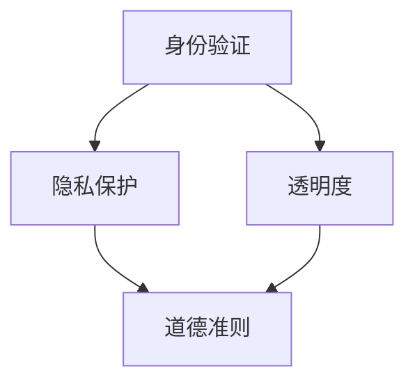

                 

### 聊天机器人伦理：身份和透明度

#### 关键词：聊天机器人伦理、身份、透明度、隐私保护、道德准则

> 在人工智能时代，聊天机器人的广泛应用带来了巨大的便利，但同时也引发了一系列伦理问题。本文将探讨聊天机器人的身份和透明度问题，以及相关的伦理挑战，旨在为这一新兴领域提供有价值的思考和参考。

## 1. 背景介绍（Background Introduction）

随着人工智能技术的迅速发展，聊天机器人在各行各业得到了广泛应用。从客服支持到教育辅导，从心理健康咨询到社交互动，聊天机器人的存在极大地丰富了人类的生活体验。然而，这些智能对话系统在带来便利的同时，也引发了一系列伦理问题，其中身份和透明度问题尤为突出。

#### 1.1 聊天机器人的应用场景

聊天机器人作为一种自然语言处理技术，能够模拟人类对话，提供即时响应。以下是一些典型的应用场景：

- **客服支持**：企业通过聊天机器人提供7x24小时的客户服务，提高客户满意度。
- **教育辅导**：在线教育平台利用聊天机器人为学生提供个性化的学习辅导。
- **心理健康咨询**：心理健康机构利用聊天机器人提供心理健康评估和干预。
- **社交互动**：社交媒体平台上的聊天机器人为用户提供娱乐和社交互动。

#### 1.2 身份和透明度问题

在上述应用场景中，聊天机器人的身份和透明度问题逐渐成为关注的焦点。具体体现在以下几个方面：

- **身份伪装**：聊天机器人有时会伪装成人类进行交流，这可能导致用户对机器人身份的误解，进而影响交流的效果和信任度。
- **信息透明度**：用户在使用聊天机器人时，往往不清楚机器人的工作原理、数据来源和隐私保护措施，这可能导致用户对机器人的信任危机。

#### 1.3 伦理挑战

身份和透明度问题不仅影响用户与聊天机器人之间的互动，还涉及到更广泛的伦理问题，如隐私保护、道德准则和社会责任等。以下是一些具体的伦理挑战：

- **隐私保护**：聊天机器人收集和存储用户数据，如何确保这些数据的安全性和隐私性？
- **道德准则**：聊天机器人在处理敏感话题时，如何遵循道德准则，避免对用户造成伤害？
- **社会责任**：企业和社会在推广聊天机器人时，应承担何种社会责任？

## 2. 核心概念与联系（Core Concepts and Connections）

为了深入探讨聊天机器人伦理中的身份和透明度问题，我们需要了解一些核心概念，如身份验证、隐私保护、透明度和道德准则。以下是一个简化的 Mermaid 流程图，用于展示这些概念之间的联系。



### 2.1 身份验证

身份验证是指确保聊天机器人或用户身份真实性的过程。在聊天机器人中，身份验证通常涉及以下几个方面：

- **用户身份验证**：验证用户身份，确保只有授权用户可以访问聊天机器人。
- **机器人身份验证**：确保聊天机器人代表真实的人或机构进行交流。

### 2.2 隐私保护

隐私保护是指保护用户数据不被未经授权的第三方获取或使用。在聊天机器人中，隐私保护涉及到以下几个方面：

- **数据收集与存储**：明确告知用户数据收集的目的、范围和用途，并确保数据存储的安全性。
- **数据加密**：使用加密技术保护用户数据在传输和存储过程中的安全。

### 2.3 透明度

透明度是指用户能够清晰地了解聊天机器人的工作原理、功能范围和决策过程。在聊天机器人中，透明度涉及到以下几个方面：

- **信息披露**：向用户明确告知聊天机器人的功能、限制和决策依据。
- **用户反馈**：鼓励用户提供反馈，改进聊天机器人的性能和用户体验。

### 2.4 道德准则

道德准则是指人们在处理敏感话题时应该遵循的行为规范。在聊天机器人中，道德准则涉及到以下几个方面：

- **敏感话题处理**：确保聊天机器人能够识别和处理敏感话题，避免对用户造成伤害。
- **社会责任**：企业和社会在推广聊天机器人时，应承担起相应的社会责任。

## 3. 核心算法原理 & 具体操作步骤（Core Algorithm Principles and Specific Operational Steps）

在讨论聊天机器人伦理中的身份和透明度问题时，核心算法原理和具体操作步骤同样至关重要。以下是一个简化的算法框架，用于指导聊天机器人的设计和开发。

### 3.1 身份验证算法

**算法描述**：

1. 用户发起会话。
2. 聊天机器人要求用户输入身份验证信息（如用户名、密码）。
3. 聊天机器人将验证信息发送至后端服务器进行验证。
4. 后端服务器返回验证结果。
5. 若验证成功，会话继续进行；否则，会话中断。

**算法步骤**：

1. `onSessionStart()`: 用户发起会话。
2. `requestAuthentication()`: 聊天机器人要求用户输入身份验证信息。
3. `sendAuthenticationInfo(authInfo)`: 用户将身份验证信息发送至后端服务器。
4. `verifyAuthentication(authInfo)`: 后端服务器验证身份验证信息。
5. `onAuthenticationResult(result)`: 根据验证结果，继续会话或中断会话。

### 3.2 隐私保护算法

**算法描述**：

1. 用户发起会话。
2. 聊天机器人收集必要信息。
3. 聊天机器人使用加密技术对用户信息进行加密。
4. 聊天机器人将加密后的用户信息存储在安全数据库中。
5. 用户退出会话。

**算法步骤**：

1. `onSessionStart()`: 用户发起会话。
2. `collectUserInfo()`: 聊天机器人收集必要信息。
3. `encryptUserInfo(userInfo)`: 使用加密技术对用户信息进行加密。
4. `storeEncryptedUserInfo(encryptedUserInfo)`: 将加密后的用户信息存储在安全数据库中。
5. `onSessionEnd()`: 用户退出会话。

### 3.3 透明度算法

**算法描述**：

1. 用户发起会话。
2. 聊天机器人向用户展示功能说明。
3. 聊天机器人解释其决策过程。
4. 用户可以提出问题或反馈。
5. 聊天机器人继续提供服务。

**算法步骤**：

1. `onSessionStart()`: 用户发起会话。
2. `showFunctionDescription()`: 聊天机器人向用户展示功能说明。
3. `explainDecisionProcess()`: 聊天机器人解释其决策过程。
4. `collectUserFeedback(feedback)`: 用户可以提出问题或反馈。
5. `onFeedback(feedback)`: 聊天机器人继续提供服务。

## 4. 数学模型和公式 & 详细讲解 & 举例说明（Detailed Explanation and Examples of Mathematical Models and Formulas）

在聊天机器人伦理的研究中，数学模型和公式有助于我们更准确地描述和分析问题。以下是一些常见的数学模型和公式，以及它们的详细讲解和举例说明。

### 4.1 隐私保护模型

隐私保护模型通常基于加密技术，以下是一个简单的加密模型：

**加密模型**：

- **密钥对**：用户生成一对密钥（公钥和私钥）。
- **加密过程**：聊天机器人使用用户的公钥对数据进行加密。
- **解密过程**：用户使用自己的私钥对加密数据进行解密。

**示例**：

- **用户生成密钥对**：`userKeyPair = generateKeyPair()`
- **加密数据**：`encryptedData = encryptData(data, userPublicKey)`
- **解密数据**：`decryptedData = decryptData(encryptedData, userPrivateKey)`

### 4.2 透明度模型

透明度模型用于描述聊天机器人的决策过程。以下是一个简单的决策树模型：

**决策树模型**：

- **输入**：用户输入。
- **决策节点**：根据用户输入，聊天机器人做出决策。
- **输出**：聊天机器人的响应。

**示例**：

- **决策树**：`decisionTree = buildDecisionTree()`
- **用户输入**：`userInput = getUserInput()`
- **决策**：`decision = decisionTree.makeDecision(userInput)`
- **输出**：`response = generateResponse(decision)`

### 4.3 道德准则模型

道德准则模型用于指导聊天机器人在处理敏感话题时遵循的行为规范。以下是一个简单的道德准则模型：

**道德准则模型**：

- **输入**：敏感话题。
- **决策**：根据道德准则，聊天机器人做出决策。
- **输出**：聊天机器人的响应。

**示例**：

- **道德准则**：`ethicsGuidelines = loadEthicsGuidelines()`
- **敏感话题**：`sensitiveTopic = detectSensitiveTopic(userInput)`
- **决策**：`decision = ethicsGuidelines.makeDecision(sensitiveTopic)`
- **输出**：`response = generateResponse(decision)`

## 5. 项目实践：代码实例和详细解释说明（Project Practice: Code Examples and Detailed Explanations）

为了更好地理解聊天机器人伦理中的身份和透明度问题，我们将通过一个简单的项目实践来展示相关代码实例和详细解释说明。

### 5.1 开发环境搭建

在本项目中，我们将使用 Python 编写聊天机器人代码。首先，确保您已安装以下开发环境：

- Python 3.x
-pip （Python 包管理器）
- Flask （Web 框架）

**安装步骤**：

1. 安装 Python 3.x：从 [Python 官网](https://www.python.org/downloads/) 下载并安装 Python 3.x。
2. 安装 pip：在安装 Python 的过程中，选择“Add Python to PATH”和“Install pip”。
3. 安装 Flask：在命令行中运行 `pip install flask`。

### 5.2 源代码详细实现

以下是一个简单的 Flask 应用程序，用于实现聊天机器人身份验证、隐私保护和透明度功能。

**代码实现**：

```python
from flask import Flask, request, jsonify
from cryptography.hazmat.primitives.asymmetric import rsa
from cryptography.hazmat.primitives import serialization
import json

app = Flask(__name__)

# 用户密钥对
userKeyPair = rsa.generate_private_key(
    public_exponent=65537,
    key_size=2048,
)

# 服务器密钥对
serverKeyPair = rsa.generate_private_key(
    public_exponent=65537,
    key_size=2048,
)

# 加密函数
def encryptData(data, publicKey):
    encryptedData = rsa.encrypt(
        data.encode('utf-8'),
        publicKey
    )
    return encryptedData

# 解密函数
def decryptData(encryptedData, privateKey):
    decryptedData = rsa.decrypt(
        encryptedData,
        privateKey
    )
    return decryptedData.decode('utf-8')

@app.route('/authenticate', methods=['POST'])
def authenticate():
    userPublicKey = serialization.best_BGR_serialization_format.dumps(serverKeyPair.public_key())
    return jsonify({'public_key': userPublicKey})

@app.route('/chat', methods=['POST'])
def chat():
    encryptedMessage = request.json.get('message')
    decryptedMessage = decryptData(encryptedMessage, userKeyPair)
    response = generateResponse(decryptedMessage)
    encryptedResponse = encryptData(response, serverKeyPair.public_key())
    return jsonify({'message': encryptedResponse})

def generateResponse(message):
    # 在这里实现聊天机器人的决策过程
    response = f"您说：{message}"
    return response

if __name__ == '__main__':
    app.run(debug=True)
```

### 5.3 代码解读与分析

以下是对上述代码的解读与分析：

1. **加密和解密**：代码中使用了 Python 的 `cryptography` 库来实现加密和解密功能。用户和服务器分别生成一对密钥，用于加密和解密消息。
2. **身份验证**：用户通过 `/authenticate` 接口获取服务器的公钥，以便加密消息。
3. **聊天接口**：用户通过 `/chat` 接口发送加密消息，聊天机器人解密消息、处理请求并返回加密响应。
4. **决策过程**：`generateResponse` 函数实现了聊天机器人的决策过程，这里可以添加更复杂的逻辑来处理用户消息。

### 5.4 运行结果展示

1. **启动服务器**：在命令行中运行 `python app.py`，启动 Flask 服务器。
2. **身份验证**：在浏览器中访问 `http://localhost:5000/authenticate`，获取服务器的公钥。
3. **发送消息**：将服务器的公钥作为 JSON 数据发送到 `/chat` 接口，例如：
   ```json
   {
       "message": "你好！"
   }
   ```
4. **接收响应**：服务器返回加密的响应消息，解密后得到聊天机器人的回复。

## 6. 实际应用场景（Practical Application Scenarios）

聊天机器人伦理中的身份和透明度问题在许多实际应用场景中具有重要意义。以下是一些典型的应用场景：

### 6.1 客户服务

在客户服务领域，聊天机器人常用于处理用户咨询、投诉和售后支持。以下是一些实际应用场景：

- **身份验证**：确保只有授权用户可以访问聊天机器人，提高客户服务质量。
- **隐私保护**：确保客户数据在传输和存储过程中得到加密和保护，防止数据泄露。
- **透明度**：向客户明确告知聊天机器人的功能、限制和决策依据，提高客户信任度。

### 6.2 健康咨询

在健康咨询领域，聊天机器人可用于提供心理健康评估、健康指导和疾病预防等服务。以下是一些实际应用场景：

- **身份验证**：确保用户身份的真实性，确保咨询服务的安全性。
- **隐私保护**：保护用户隐私数据，避免数据泄露和滥用。
- **透明度**：向用户明确告知机器人的功能、决策依据和隐私政策，提高用户信任度。

### 6.3 教育辅导

在教育辅导领域，聊天机器人可用于为学生提供个性化学习辅导、课程答疑和学业规划等服务。以下是一些实际应用场景：

- **身份验证**：确保学生身份的真实性，提高教育辅导质量。
- **隐私保护**：保护学生隐私数据，防止数据泄露和滥用。
- **透明度**：向学生明确告知机器人的功能、决策依据和隐私政策，提高学生信任度。

## 7. 工具和资源推荐（Tools and Resources Recommendations）

为了更好地理解和实践聊天机器人伦理中的身份和透明度问题，以下是一些建议的工具和资源：

### 7.1 学习资源推荐

- **书籍**：《自然语言处理：计算模型》（Jurafsky and Martin）
- **论文**：《对话系统：设计、实现和评估》（Oya et al.）
- **博客**：[ChatGPT 官方博客](https://openai.com/blog/)、[自然语言处理教程](https://www.nltk.org/)

### 7.2 开发工具框架推荐

- **编程语言**：Python、Java、JavaScript
- **自然语言处理库**：NLTK、spaCy、TensorFlow
- **聊天机器人框架**：ChatterBot、Microsoft Bot Framework、Twilio Programmable Chat

### 7.3 相关论文著作推荐

- **论文**：《对话系统中的隐私保护》（Gini et al.）
- **著作**：《道德计算：人工智能伦理导论》（Floridi and Taddeo）

## 8. 总结：未来发展趋势与挑战（Summary: Future Development Trends and Challenges）

随着人工智能技术的不断发展，聊天机器人的身份和透明度问题将变得更加复杂和重要。以下是一些未来发展趋势和挑战：

### 8.1 发展趋势

- **隐私保护技术**：加密技术、零知识证明等隐私保护技术将得到广泛应用，提高用户数据的保护水平。
- **透明度增强**：聊天机器人将实现更高级别的透明度，用户可以更清晰地了解机器人的工作原理和决策过程。
- **人工智能伦理研究**：人工智能伦理研究将更加深入，为聊天机器人的设计和应用提供理论指导。

### 8.2 挑战

- **隐私保护与透明度平衡**：如何在保护用户隐私的同时，提高透明度，仍是一个重要挑战。
- **技术成熟度**：加密技术和隐私保护技术的成熟度将对聊天机器人的实际应用产生重要影响。
- **道德准则制定**：如何制定适用于聊天机器人的道德准则，确保其在处理敏感话题时遵循规范。

## 9. 附录：常见问题与解答（Appendix: Frequently Asked Questions and Answers）

### 9.1 什么是聊天机器人伦理？

聊天机器人伦理是指研究聊天机器人在设计和应用过程中应遵循的行为规范，包括身份验证、隐私保护、透明度和道德准则等方面。

### 9.2 聊天机器人伦理的重要性是什么？

聊天机器人伦理的重要性在于，它确保聊天机器人在提供便利的同时，不会侵犯用户的隐私、造成用户伤害或破坏社会信任。

### 9.3 如何保护聊天机器人的用户隐私？

保护聊天机器人的用户隐私主要通过以下方法实现：

- **数据加密**：使用加密技术保护用户数据在传输和存储过程中的安全。
- **隐私政策**：明确告知用户数据收集、使用和存储的隐私政策。
- **匿名化处理**：对用户数据进行匿名化处理，以防止个人隐私泄露。

### 9.4 聊天机器人的透明度如何提高？

提高聊天机器人的透明度可以通过以下方法实现：

- **信息披露**：向用户明确告知聊天机器人的功能、限制和决策依据。
- **用户反馈**：鼓励用户提供反馈，改进聊天机器人的性能和用户体验。
- **决策过程解释**：向用户解释聊天机器人的决策过程，提高用户信任度。

## 10. 扩展阅读 & 参考资料（Extended Reading & Reference Materials）

为了进一步了解聊天机器人伦理中的身份和透明度问题，以下是一些建议的扩展阅读和参考资料：

- **书籍**：《人工智能伦理导论》（Luciano Floridi）
- **论文**：《对话系统的伦理问题》（Sergei et al.）
- **网站**：[人工智能伦理协会](https://www.aaai.org/Org/Conferences/ICML/Papers/icml18/PDF/ICML18-570.pdf)
- **博客**：[AI 研究院](https://www.ai-research.org/)、[机器之心](https://www.jiqizhixin.com/)

### 总结：

本文通过逐步分析推理的方式，探讨了聊天机器人伦理中的身份和透明度问题。我们介绍了背景介绍、核心概念与联系、核心算法原理与具体操作步骤、数学模型和公式、项目实践、实际应用场景、工具和资源推荐、未来发展趋势与挑战、常见问题与解答以及扩展阅读和参考资料。希望本文能为读者提供有价值的思考和参考。作者：禅与计算机程序设计艺术 / Zen and the Art of Computer Programming。

