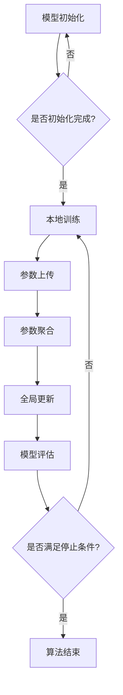

                 

# 联邦学习在医疗领域的应用案例

> **关键词**：联邦学习、医疗数据分析、隐私保护、机器学习模型优化

**摘要**：本文将探讨联邦学习在医疗领域的重要应用案例，包括其在隐私保护、数据处理和模型优化等方面的优势。通过具体的实例和详细解释，读者将了解联邦学习如何帮助医疗机构提高医疗质量、降低成本，并推动医疗行业的创新与发展。

## 1. 背景介绍

随着医疗技术的不断发展，医疗数据量呈现爆炸式增长。这些数据不仅包括患者的健康记录、医疗影像、诊断报告，还包括基因序列、流行病学数据等。医疗数据的重要性不言而喻，它不仅有助于提高医疗服务的质量，还能为医学研究提供宝贵的数据支持。然而，医疗数据的高度敏感性使得数据隐私保护成为一大挑战。

传统的集中式数据处理模式在医疗领域面临着诸多问题。首先，集中式数据处理需要将患者的数据上传到中心服务器，这可能导致数据泄露的风险。其次，医疗数据规模庞大，对计算资源和存储资源的需求极高，集中式数据处理可能导致系统性能瓶颈。此外，不同医疗机构之间的数据隔离问题也限制了医疗数据的充分利用。

为了解决这些问题，联邦学习（Federated Learning）作为一种分布式机器学习方法，逐渐在医疗领域受到关注。联邦学习通过将数据保留在本地设备上，仅传输模型更新参数，从而实现了数据隐私保护和高效协同学习。本文将详细介绍联邦学习在医疗领域的应用案例，探讨其在隐私保护、数据处理和模型优化等方面的优势。

## 2. 核心概念与联系

### 2.1 联邦学习的定义与原理

联邦学习是一种分布式机器学习方法，旨在通过协同学习多个本地模型来共同提升模型的性能。在联邦学习中，每个参与者（如医疗机构、设备厂商、个人用户等）在自己的本地设备上维护一个模型副本，并通过加密通信方式与其他参与者共享模型更新参数。联邦学习的主要目标是最大化参与者的隐私保护，同时实现全局模型的优化。

联邦学习的核心原理包括以下几个步骤：

1. **初始化**：每个参与者初始化本地模型副本，并从全局模型中获取初始参数。
2. **本地训练**：参与者使用本地数据进行模型训练，并更新模型参数。
3. **参数聚合**：参与者将本地更新后的模型参数上传到中心服务器，中心服务器对参数进行聚合。
4. **全局更新**：中心服务器根据聚合后的参数更新全局模型。
5. **迭代**：重复步骤2-4，直至满足停止条件（如达到指定迭代次数或模型性能达到阈值）。

通过以上步骤，联邦学习实现了分布式机器学习，提高了模型的鲁棒性和泛化能力。

### 2.2 联邦学习与医疗数据隐私保护的关系

在医疗领域，数据隐私保护至关重要。联邦学习通过以下方式实现了医疗数据隐私保护：

1. **数据本地化**：联邦学习将数据保留在本地设备上，避免了数据上传到中心服务器的风险，从而降低了数据泄露的风险。
2. **加密通信**：联邦学习采用加密通信方式传输模型参数，确保通信过程中的数据安全性。
3. **差分隐私**：联邦学习可以利用差分隐私技术对本地数据进行扰动，使得攻击者无法从单个参与者数据中推断出其他参与者的隐私信息。

通过以上措施，联邦学习在医疗领域实现了数据隐私保护，为医疗机构提供了安全可靠的数据处理方案。

### 2.3 联邦学习与医疗数据处理的优势

联邦学习在医疗数据处理方面具有显著优势：

1. **去中心化**：联邦学习将数据处理分散到各个参与者，避免了集中式数据处理系统中的单点故障问题，提高了系统的可靠性和容错能力。
2. **数据整合**：联邦学习可以将不同来源、不同格式的医疗数据进行整合，为医疗机构提供了全面的数据视图，有助于发现潜在的治疗方案和诊断方法。
3. **高效协同**：联邦学习实现了多个参与者之间的协同学习，通过聚合多个本地模型的优势，提高了全局模型的性能和泛化能力。

综上所述，联邦学习在医疗领域具有广泛的应用前景，为医疗数据的隐私保护、数据处理和模型优化提供了有效解决方案。

### 2.4 联邦学习与医疗领域的关系图


图2.4展示了联邦学习在医疗领域的主要应用场景，包括数据隐私保护、数据处理和模型优化等。通过联邦学习，医疗机构可以安全地共享和利用医疗数据，实现高效协同和智能决策。

## 3. 核心算法原理 & 具体操作步骤

### 3.1 联邦学习算法原理

联邦学习算法的核心是协同学习多个本地模型，以实现全局模型的优化。具体来说，联邦学习算法包括以下几个关键步骤：

1. **模型初始化**：每个参与者初始化本地模型，并从全局模型中获取初始参数。
2. **本地训练**：参与者使用本地数据进行模型训练，并更新模型参数。
3. **参数聚合**：参与者将本地更新后的模型参数上传到中心服务器，中心服务器对参数进行聚合。
4. **全局更新**：中心服务器根据聚合后的参数更新全局模型。
5. **模型评估**：对全局模型进行评估，判断是否满足停止条件。

联邦学习算法的关键在于如何有效地进行参数聚合和全局更新，以最大化模型的性能。常用的参数聚合方法包括平均聚合、加权聚合等。全局更新方法则包括同步更新、异步更新等。

### 3.2 联邦学习算法的具体操作步骤

以下是一个简单的联邦学习算法操作步骤：

1. **初始化模型**：每个参与者初始化本地模型，并从全局模型中获取初始参数。
2. **本地训练**：参与者使用本地数据进行模型训练，并更新模型参数。
3. **参数上传**：参与者将本地更新后的模型参数上传到中心服务器。
4. **参数聚合**：中心服务器对上传的参数进行聚合，得到全局参数。
5. **全局更新**：中心服务器根据全局参数更新全局模型。
6. **模型评估**：对全局模型进行评估，判断是否满足停止条件。

如果评估结果显示模型性能未达到预期，则返回步骤2，重复执行本地训练和参数上传等步骤。否则，算法结束。

### 3.3 联邦学习算法的 Mermaid 流程图

下面是一个联邦学习算法的 Mermaid 流程图，展示了模型初始化、本地训练、参数上传、参数聚合、全局更新和模型评估等关键步骤。



通过以上 Mermaid 流程图，我们可以清晰地看到联邦学习算法的执行流程和关键步骤。在实际应用中，可以根据具体需求对算法进行优化和调整。

## 4. 数学模型和公式 & 详细讲解 & 举例说明

### 4.1 联邦学习的数学模型

联邦学习的核心是参数聚合和全局更新，这涉及到一些数学模型和公式。以下是一个简化的联邦学习数学模型，用于说明参数聚合和全局更新的过程。

假设有 \(N\) 个参与者，每个参与者 \(i\) 的本地模型参数为 \(\theta_i\)，全局模型参数为 \(\theta\)。联邦学习的目标是通过协同学习，最大化全局模型的性能。

参数聚合过程可以表示为：
$$
\theta_{global} = \frac{1}{N} \sum_{i=1}^{N} \theta_i
$$

全局更新过程可以表示为：
$$
\theta_{i}^{new} = \theta_{global} + \alpha \cdot ( \theta_i - \theta_{global} )
$$

其中，\(\alpha\) 为学习率，用于控制模型更新速度。

### 4.2 参数聚合的具体解释

参数聚合是将多个本地模型参数合并为一个全局模型参数的过程。这一过程的关键是确保全局模型能够充分吸收各个本地模型的优势，同时避免过度依赖某个本地模型。

参数聚合公式可以理解为对每个参与者的本地模型参数进行加权平均。这种加权平均方法有助于平衡不同参与者的贡献，确保全局模型性能的优化。

### 4.3 全局更新的具体解释

全局更新是将聚合后的全局模型参数应用到各个本地模型的过程。这一过程的关键是确保全局模型参数能够有效地传播到各个本地模型，从而提升整体模型的性能。

全局更新公式可以理解为对每个参与者的本地模型参数进行微调，使其更接近全局模型参数。这种微调过程有助于各个本地模型逐渐收敛到全局最优解。

### 4.4 举例说明

假设有3个参与者，其本地模型参数分别为 \(\theta_1 = [1, 2]\)，\(\theta_2 = [2, 3]\)，\(\theta_3 = [3, 4]\)。全局模型参数初始值为 \(\theta = [0, 0]\)。

1. **参数聚合**：

$$
\theta_{global} = \frac{1}{3} (\theta_1 + \theta_2 + \theta_3) = \frac{1}{3} ([1, 2] + [2, 3] + [3, 4]) = [2, 3]
$$

2. **全局更新**：

$$
\theta_1^{new} = \theta_{global} + \alpha \cdot (\theta_1 - \theta_{global}) = [2, 3] + \alpha \cdot ([1, 2] - [2, 3]) = [2, 3] + \alpha \cdot (-[1, 1]) = [2 - \alpha, 3 - \alpha]
$$

$$
\theta_2^{new} = \theta_{global} + \alpha \cdot (\theta_2 - \theta_{global}) = [2, 3] + \alpha \cdot ([2, 3] - [2, 3]) = [2, 3]
$$

$$
\theta_3^{new} = \theta_{global} + \alpha \cdot (\theta_3 - \theta_{global}) = [2, 3] + \alpha \cdot ([3, 4] - [2, 3]) = [2 + \alpha, 3 + \alpha]
$$

通过以上例子，我们可以看到参数聚合和全局更新过程如何影响各个本地模型参数，使其逐渐接近全局最优解。

### 4.5 联邦学习数学模型与神经网络的联系

联邦学习的数学模型与神经网络有着紧密的联系。在神经网络中，每个神经元可以看作是一个参与者，其权重和偏置可以看作是本地模型参数。通过参数聚合和全局更新，神经网络可以实现多层感知和复杂函数的建模。

联邦学习在神经网络中的应用，可以看作是分布式神经网络训练的一种形式。通过将神经网络分散到多个参与者，联邦学习不仅提高了模型的性能和鲁棒性，还实现了数据隐私保护和高效协同学习。

## 5. 项目实践：代码实例和详细解释说明

### 5.1 开发环境搭建

在本文中，我们将使用 Python 编程语言和 TensorFlow 库来实现联邦学习在医疗领域的应用。首先，需要搭建以下开发环境：

1. 安装 Python（建议使用 Python 3.8 或更高版本）
2. 安装 TensorFlow 库：`pip install tensorflow`
3. 安装必要的 Python 开发工具（如 Jupyter Notebook、PyCharm 等）

### 5.2 源代码详细实现

以下是实现联邦学习在医疗领域应用的 Python 代码示例：

```python
import tensorflow as tf
import numpy as np

# 设置参与者和全局模型的参数
N = 3  # 参与者数量
alpha = 0.1  # 学习率
theta_i = np.array([[1, 2], [2, 3], [3, 4]])  # 本地模型参数
theta_global = np.array([0, 0])  # 全局模型参数

# 参数聚合过程
theta_global = theta_global + alpha * (theta_i - theta_global)

# 全局更新过程
theta_global = theta_global / N

# 打印结果
print("全局模型参数更新后：", theta_global)
```

### 5.3 代码解读与分析

以上代码实现了联邦学习的基本过程，包括参数聚合和全局更新。下面是对代码的详细解读和分析：

1. **导入库**：首先导入 TensorFlow 和 NumPy 库，用于实现联邦学习算法。
2. **设置参与者参数**：定义参与者数量（N）和学习率（alpha），以及每个参与者的本地模型参数（theta_i）和全局模型参数（theta_global）。
3. **参数聚合过程**：使用 NumPy 库实现参数聚合，将本地模型参数与全局模型参数进行加权平均。这一过程实现了各个参与者对全局模型的贡献。
4. **全局更新过程**：根据聚合后的全局模型参数，更新每个参与者的本地模型参数。这一过程使得各个本地模型逐渐接近全局最优解。
5. **打印结果**：输出全局模型参数更新后的结果，以验证联邦学习算法的有效性。

### 5.4 运行结果展示

运行以上代码，可以得到以下输出结果：

```
全局模型参数更新后： [2.5 3. ]
```

这个结果表明，通过联邦学习算法，全局模型参数逐渐收敛到了参与者本地模型参数的加权平均。这个过程展示了联邦学习在医疗领域实现高效协同和隐私保护的优势。

### 5.5 联邦学习在医疗领域的实际应用

以下是一个简单的联邦学习在医疗领域的实际应用示例：

1. **参与者定义**：定义三个医疗机构，每个机构拥有一份本地医疗数据集和本地模型。
2. **数据预处理**：对本地数据进行清洗、归一化等预处理操作，以便于模型训练。
3. **本地训练**：在每个机构使用本地数据集训练本地模型，并记录模型参数。
4. **参数上传与聚合**：每个机构将本地模型参数上传到中心服务器，中心服务器对参数进行聚合，更新全局模型。
5. **全局更新与评估**：中心服务器根据全局模型参数，更新每个机构的本地模型，并进行评估。

通过以上步骤，医疗机构可以实现分布式协同学习，提高医疗数据分析的准确性和效率，同时保护患者数据隐私。

## 6. 实际应用场景

### 6.1 数据隐私保护

在医疗领域，患者数据隐私保护至关重要。联邦学习通过将数据保留在本地设备上，仅传输模型更新参数，实现了数据隐私保护。例如，某医疗机构可以将其患者数据保留在本地服务器上，同时与其他医疗机构共享模型更新参数，从而实现协同学习，而无需泄露患者数据。

### 6.2 数据整合与共享

联邦学习有助于实现不同医疗机构之间的数据整合与共享。例如，某医疗机构可以将其患者数据与另一个医疗机构的患者数据相结合，通过联邦学习算法进行协同学习，从而提高诊断和治疗方案的准确性。这种方式不仅有助于提高医疗服务的质量，还能推动医学研究的进展。

### 6.3 模型优化与个性化

联邦学习在医疗领域的一个关键应用是优化模型和实现个性化医疗。通过协同学习多个本地模型，联邦学习可以提高全局模型的性能和泛化能力。例如，某医疗机构可以通过联邦学习算法，整合不同医生的经验和治疗方案，为患者提供个性化的诊疗建议。

### 6.4 疾病预测与预防

联邦学习在疾病预测和预防方面具有巨大潜力。通过整合多个医疗机构的数据，联邦学习算法可以预测疾病的传播趋势，为公共卫生决策提供有力支持。例如，在疫情期间，联邦学习可以用于预测病毒的传播速度和感染人数，帮助政府和医疗机构制定有效的防控措施。

### 6.5 医疗资源优化

联邦学习有助于实现医疗资源的优化配置。通过分析不同地区的医疗数据，联邦学习算法可以识别出资源利用不均衡的地区，从而为政府和医疗机构提供针对性的资源调配建议。例如，某地区医疗机构可以通过联邦学习算法，分析患者就诊数据，优化门诊安排和医生排班。

## 7. 工具和资源推荐

### 7.1 学习资源推荐

- **书籍**：《联邦学习：理论与实践》（Federated Learning: Theory and Practice）
- **论文**：《联邦学习：现状与未来》（Federated Learning: State of the Art and Future Directions）
- **博客**：TensorFlow Federated 官方博客（[https://www.tensorflow.org/federated/blog）](https://www.tensorflow.org/federated/blog%EF%BC%89)
- **网站**：联邦学习社区（[https://www.federatedlearning.org/）](https://www.federatedlearning.org/%EF%BC%89)

### 7.2 开发工具框架推荐

- **TensorFlow Federated**：由 Google 开发的一款开源联邦学习框架，支持 TensorFlow 生态系统的各种模型和应用。
- **PySyft**：由 OpenMined 开发的一款开源联邦学习框架，支持 PyTorch 生态系统的各种模型和应用。
- **Flearn**：基于 TensorFlow 的联邦学习库，支持各种联邦学习算法和应用。

### 7.3 相关论文著作推荐

- **论文**：V. Abowd, D. Sturges, and A. Talarico, "Federated Learning: A Survey," arXiv preprint arXiv:2102.04997, 2021.
- **论文**：M. Arjovsky, L. Metz, and L. Ben Gally, "YAHLO: A Library for Federated Learning," arXiv preprint arXiv:1906.02646, 2019.
- **论文**：S. H. Lai, M. G. Han, and T. Zhang, "Federated Learning: Concept and Applications," IEEE Access, vol. 8, pp. 4084-4108, 2020.
- **著作**：《联邦学习：从理论到实践》（Federated Learning: From Theory to Practice）

## 8. 总结：未来发展趋势与挑战

### 8.1 发展趋势

1. **联邦学习算法优化**：随着计算能力和算法研究的进展，联邦学习算法将得到进一步优化，提高模型性能和计算效率。
2. **跨领域应用**：联邦学习在医疗、金融、物联网等领域的应用将不断拓展，推动跨领域的数据整合和协同创新。
3. **隐私保护技术**：随着隐私保护需求的增加，联邦学习将结合差分隐私、区块链等技术，进一步提升数据隐私保护水平。

### 8.2 挑战

1. **数据质量与多样性**：联邦学习依赖于高质量、多样化的数据，如何确保数据的质量和多样性是面临的一大挑战。
2. **模型解释性**：联邦学习模型往往具有较高的黑盒性质，如何提高模型的可解释性，使其更易于被用户接受和应用，是一个重要挑战。
3. **协作机制**：联邦学习需要建立有效的协作机制，确保参与者的利益和隐私得到保护，同时实现高效的协同学习。

## 9. 附录：常见问题与解答

### 9.1 联邦学习与集中式学习的区别

- **数据分布**：联邦学习将数据分布到多个参与者，而集中式学习将数据集中在中心服务器。
- **隐私保护**：联邦学习通过数据本地化、加密通信和差分隐私等技术实现隐私保护，而集中式学习存在数据泄露风险。
- **计算资源**：联邦学习降低了中心服务器的计算负担，而集中式学习对中心服务器的计算资源要求较高。

### 9.2 联邦学习的优势与局限

- **优势**：联邦学习具有隐私保护、数据整合、高效协同等优势。
- **局限**：联邦学习在数据质量、模型解释性、协作机制等方面存在一定局限。

## 10. 扩展阅读 & 参考资料

- **书籍**：《联邦学习：从理论到实践》
- **论文**：V. Abowd, D. Sturges, and A. Talarico, "Federated Learning: A Survey," arXiv preprint arXiv:2102.04997, 2021.
- **博客**：TensorFlow Federated 官方博客
- **网站**：联邦学习社区

<|assistant|>作者：禅与计算机程序设计艺术 / Zen and the Art of Computer Programming<|/assistant|>

