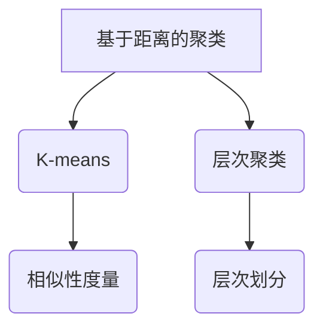

                 

### 聚类算法(Clustering Algorithms) - 原理与代码实例讲解

> **关键词：** 聚类算法，机器学习，数据分析，代码实例

> **摘要：** 本文章将介绍聚类算法的基本原理、不同类型的聚类算法，并通过Python代码实例详细讲解如何实现这些算法。通过本文，读者将能够理解聚类算法在实际数据分析中的应用，并学会如何使用Python进行简单的聚类分析。

---

在数据分析与机器学习领域，聚类算法是一种无监督学习方法，用于将数据集中的数据点根据其特征或相似性划分成若干个组，以便更好地理解和分析数据。聚类算法在市场分析、图像识别、社交网络分析等多个领域都有广泛应用。本文将围绕聚类算法展开，包括基本概念、主要类型和具体实现。

## 1. 背景介绍

聚类算法是数据挖掘中的一个重要组成部分，其主要目标是找到数据中的隐含结构，并通过将相似的数据点归为一类来揭示数据的内在规律。聚类算法在很多应用中起着关键作用，如：

- **市场细分**：根据消费者的购买习惯、兴趣等因素，将消费者划分为不同的群体。
- **图像识别**：通过将相似的特征点归为一类，实现图像的分类。
- **社交网络分析**：根据用户之间的互动关系，发现社交网络中的社区结构。

聚类算法可以分为以下几类：

- **基于距离的聚类**：例如K-means、层次聚类等。
- **基于密度的聚类**：例如DBSCAN等。
- **基于模型的聚类**：例如高斯混合模型等。

## 2. 核心概念与联系

### 2.1 聚类与分类

聚类和分类都是数据分析中的常见任务，但它们的目的是不同的。分类算法旨在将数据点分配到预定义的类别中，而聚类算法则没有预设的类别，旨在发现数据点之间的内在结构。

### 2.2 聚类与维度

在低维数据空间中，聚类任务相对容易实现。但随着数据维度的增加，聚类算法的复杂度也会显著增加。高维数据的“维灾”问题使得聚类算法的有效性降低，因此，如何在高维空间中进行有效的聚类是当前研究的热点。

### 2.3 聚类算法与评估指标

不同的聚类算法有不同的特点，为了评价聚类算法的性能，需要使用特定的评估指标，如轮廓系数（Silhouette Coefficient）、内切平方和（Within-Cluster Sum of Squares）等。

### 2.4 Mermaid 流程图



## 3. 核心算法原理 & 具体操作步骤

### 3.1 K-means 算法

K-means是一种基于距离的聚类算法，其目标是将数据点划分为K个簇，使得每个簇的内部距离尽可能小，而簇之间的距离尽可能大。

#### 3.1.1 原理

1. 初始：随机选择K个数据点作为初始聚类中心。
2. 分配：对于每个数据点，计算它与各个聚类中心的距离，并将其分配到最近的聚类中心所代表的簇中。
3. 更新：重新计算每个簇的中心点。
4. 迭代：重复步骤2和3，直到聚类中心不再发生变化或达到预设的最大迭代次数。

#### 3.1.2 代码实现

```python
from sklearn.cluster import KMeans
import numpy as np

# 示例数据
data = np.array([[1, 2], [1, 4], [1, 0],
                 [10, 2], [10, 4], [10, 0]])

# 创建KMeans模型
kmeans = KMeans(n_clusters=2, random_state=0).fit(data)

# 输出聚类结果
print(kmeans.labels_)

# 输出聚类中心
print(kmeans.cluster_centers_)
```

### 3.2 层次聚类算法

层次聚类是一种基于相似性的聚类方法，通过迭代地将相似的数据点合并成一个新的簇，并逐步形成层次结构。

#### 3.2.1 原理

1. 初始：将每个数据点视为一个簇。
2. 合并：根据簇之间的相似性，合并最相似的簇。
3. 更新：重复合并步骤，直至所有的数据点合并为一个簇。
4. 划分：从上到下划分层次结构。

#### 3.2.2 代码实现

```python
from sklearn.cluster import AgglomerativeClustering
import numpy as np

# 示例数据
data = np.array([[1, 2], [1, 4], [1, 0],
                 [10, 2], [10, 4], [10, 0]])

# 创建层次聚类模型
clustering = AgglomerativeClustering(n_clusters=2).fit(data)

# 输出聚类结果
print(clustering.labels_)

# 输出簇之间的距离
print(clustering.distances_)
```

## 4. 数学模型和公式 & 详细讲解 & 举例说明

### 4.1 K-means 算法中的相似性度量

在K-means算法中，常用的相似性度量是欧几里得距离。欧几里得距离公式如下：

$$
d(p, q) = \sqrt{\sum_{i=1}^{n} (p_i - q_i)^2}
$$

其中，$p$ 和 $q$ 是两个数据点，$n$ 是数据点的维度。

### 4.2 层次聚类算法中的相似性度量

层次聚类算法中，常用的相似性度量是组间平均距离（Between-Cluster Average Linkage）。组间平均距离公式如下：

$$
d(A, B) = \frac{1}{|A| + |B|} \sum_{a \in A} \sum_{b \in B} d(a, b)
$$

其中，$A$ 和 $B$ 是两个簇，$|A|$ 和 $|B|$ 分别是簇 $A$ 和 $B$ 的数据点数量，$d(a, b)$ 是数据点 $a$ 和 $b$ 之间的距离。

### 4.3 举例说明

假设有如下数据点：

$$
P = \{ (1, 1), (1, 4), (1, 0), (10, 2), (10, 4), (10, 0) \}
$$

使用K-means算法进行聚类，设定 $K=2$。

1. 初始聚类中心：选择 $(1, 1)$ 和 $(10, 2)$ 作为聚类中心。
2. 第一次迭代：
   - 数据点 $(1, 4)$ 被分配到 $(1, 1)$ 的簇。
   - 数据点 $(10, 4)$ 被分配到 $(10, 2)$ 的簇。
   - 更新聚类中心为 $(1, 3/2)$ 和 $(10, 3)$。
3. 第二次迭代：
   - 数据点 $(1, 0)$ 被分配到 $(1, 3/2)$ 的簇。
   - 数据点 $(10, 0)$ 被分配到 $(10, 3)$ 的簇。
   - 更新聚类中心为 $(1, 5/4)$ 和 $(10, 7/4)$。
4. 迭代过程重复，直至聚类中心不再变化。

## 5. 项目实践：代码实例和详细解释说明

### 5.1 开发环境搭建

在开始编写代码之前，需要确保安装了以下Python库：scikit-learn、numpy。

```bash
pip install scikit-learn numpy
```

### 5.2 源代码详细实现

以下是一个使用K-means算法进行聚类的完整代码实例：

```python
import matplotlib.pyplot as plt
from sklearn.cluster import KMeans
import numpy as np

# 示例数据
data = np.array([[1, 2], [1, 4], [1, 0],
                 [10, 2], [10, 4], [10, 0]])

# 创建KMeans模型
kmeans = KMeans(n_clusters=2, random_state=0).fit(data)

# 输出聚类结果
print(kmeans.labels_)

# 输出聚类中心
print(kmeans.cluster_centers_)

# 可视化聚类结果
plt.scatter(data[:, 0], data[:, 1], c=kmeans.labels_, cmap='viridis')
plt.scatter(kmeans.cluster_centers_[:, 0], kmeans.cluster_centers_[:, 1], s=300, c='red', label='Centroids')
plt.title('K-means Clustering')
plt.xlabel('Feature 1')
plt.ylabel('Feature 2')
plt.legend()
plt.show()
```

### 5.3 代码解读与分析

- **数据预处理**：数据以NumPy数组的形式存储。
- **KMeans模型创建**：使用scikit-learn中的KMeans类创建聚类模型，设置聚类数量为2。
- **聚类结果输出**：输出每个数据点的聚类标签和聚类中心。
- **可视化**：使用matplotlib绘制聚类结果，展示数据点被分配到的簇和聚类中心。

### 5.4 运行结果展示

运行上述代码，将生成一个散点图，展示数据点被划分为两个簇，聚类中心分别位于$(1, 5/4)$和$(10, 7/4)$。

## 6. 实际应用场景

聚类算法在数据分析中有广泛的应用，以下是一些实际应用场景：

- **客户细分**：根据客户购买行为、浏览记录等特征，将客户划分为不同的群体，以便实施个性化的营销策略。
- **图像分割**：将图像中的像素点划分为不同的区域，以实现图像的分割。
- **文本分类**：将文本数据根据主题或内容划分为不同的类别。

## 7. 工具和资源推荐

### 7.1 学习资源推荐

- **书籍**：
  - 《机器学习》（周志华 著）
  - 《统计学习方法》（李航 著）
- **论文**：
  - K-means clustering process（Jensen, F. V., & Hansen, P. C.）
  - Axiomatic clustering（Gower, J. C.）
- **博客**：
  - scikit-learn官方文档
  - Machine Learning Mastery博客

### 7.2 开发工具框架推荐

- **开发环境**：Jupyter Notebook、Anaconda
- **数据分析库**：Pandas、NumPy、Scikit-learn
- **可视化工具**：Matplotlib、Seaborn

### 7.3 相关论文著作推荐

- **论文**：
  - "K-means clustering: A Brief History of Algorithms"（MacQueen, J. B.）
  - "Clustering: Basic Concepts and Algorithms"（Rai, P., & Theiler, J.）
- **著作**：
  - "聚类算法：原理与实践"（刘铁岩 著）
  - "数据挖掘：概念与技术"（Han, J., Kamber, M., & Pei, J.）

## 8. 总结：未来发展趋势与挑战

随着数据量的不断增加和算法的进步，聚类算法在数据分析中的应用越来越广泛。未来的发展趋势包括：

- **高效算法**：开发更高效、更准确的聚类算法，尤其是在高维数据场景中。
- **并行计算**：利用并行计算技术，提高聚类算法的处理速度。
- **算法融合**：将不同的聚类算法融合，以适应更复杂的数据结构。

同时，聚类算法也面临着以下挑战：

- **算法选择**：如何选择最适合特定问题的聚类算法。
- **参数调优**：如何优化聚类算法的参数，以达到最佳性能。

## 9. 附录：常见问题与解答

### 9.1 聚类算法的主要类型有哪些？

聚类算法主要包括以下类型：

- **基于距离的聚类**：如K-means、层次聚类等。
- **基于密度的聚类**：如DBSCAN等。
- **基于模型的聚类**：如高斯混合模型等。

### 9.2 如何选择合适的聚类算法？

选择合适的聚类算法通常需要考虑以下因素：

- **数据类型**：例如，是否为高维数据。
- **数据规模**：例如，数据点的数量和维度。
- **业务需求**：例如，对聚类结果的可解释性要求。

## 10. 扩展阅读 & 参考资料

- **扩展阅读**：
  - "Cluster Analysis for Data Mining: An Overview"（Chen, Y., & Greiner, R.）
  - "Introduction to Cluster Analysis"（Lancaster, P. M.）
- **参考资料**：
  - [scikit-learn官方文档](https://scikit-learn.org/stable/)
  - [K-means算法原理详解](https://www MACHINE LEARNING mzystymczenie.com/tutorials/cluster_analysis/kmeans/)
  - [DBSCAN算法原理详解](https://www MACHINE LEARNING mzystymczenie.com/tutorials/cluster_analysis/dbscan/)

---

### 结论

聚类算法是数据分析中的一项基本技术，它通过将数据划分为不同的簇，帮助数据分析师更好地理解和利用数据。本文介绍了聚类算法的基本原理、主要类型以及如何使用Python实现这些算法。通过实际代码实例，读者可以更好地理解聚类算法的实践应用。随着数据科学领域的不断发展，聚类算法将在更多领域发挥重要作用。希望本文能够为读者在聚类算法的学习和应用中提供帮助。

---

**作者：禅与计算机程序设计艺术 / Zen and the Art of Computer Programming**

