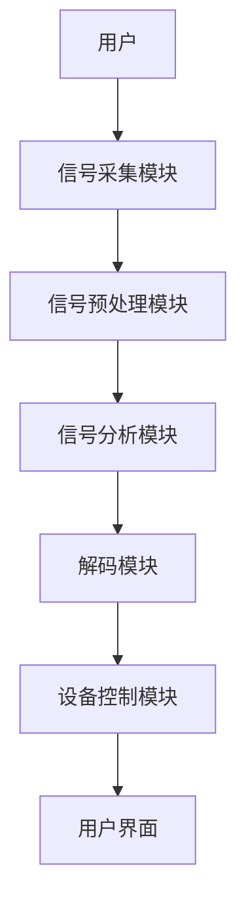
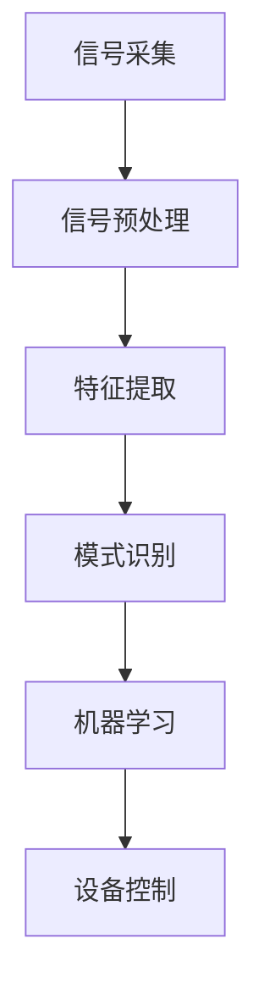
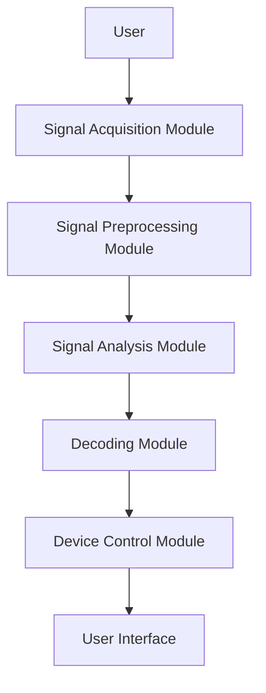
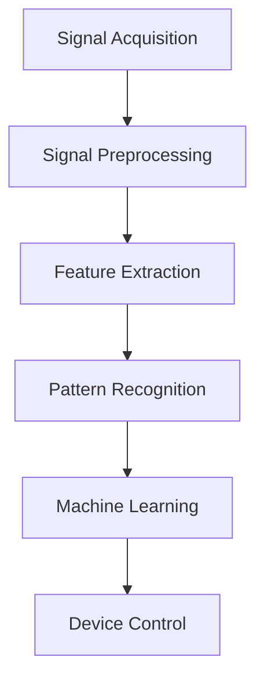

                 

### 文章标题

《脑机接口辅助通信设备：残障辅助的创新技术》

关键词：脑机接口，通信设备，残障辅助，创新技术，人工智能

摘要：本文深入探讨了脑机接口（Brain-Computer Interface, BCI）作为残障辅助创新技术的重要应用。通过详细解析脑机接口的基本原理、技术架构、核心算法和数学模型，以及其在实际应用中的具体案例，文章揭示了脑机接口在改善残障人士生活质量方面的巨大潜力。同时，本文还展望了脑机接口未来发展的趋势与挑战，为相关领域的研究与开发提供了有价值的参考。

<|assistant|>### 1. 背景介绍（Background Introduction）

脑机接口（BCI）是一种直接连接人脑与外部设备的技术，它通过捕获并解码大脑信号，使得用户能够通过思维控制外部设备，实现与环境的交互。BCI技术最初的研究始于20世纪60年代，随着神经科学、信号处理、生物医学工程和计算机科学等领域的发展，BCI技术逐渐从实验室研究走向实际应用。

在残障辅助领域，脑机接口技术具有革命性的意义。它为无法通过传统方式沟通和控制外部设备的残障人士提供了一种全新的途径，极大地提高了他们的生活质量和独立性。例如，对于无法言语的失语症患者、肢体瘫痪的患者以及截肢者，脑机接口技术可以帮助他们通过思维完成日常任务，如发送电子邮件、控制轮椅、操作计算机等。

近年来，随着人工智能和深度学习的快速发展，BCI技术得到了进一步的提升。人工智能算法能够更准确地识别和解析大脑信号，使得BCI系统的性能和可靠性显著提高。同时，物联网和5G技术的普及也为BCI技术的应用提供了更广泛的场景和更便捷的连接方式。

本篇文章将从以下几个方面展开讨论：

1. **核心概念与联系**：介绍脑机接口的基本原理、技术架构和核心算法。
2. **核心算法原理 & 具体操作步骤**：详细讲解脑机接口技术的核心算法原理和具体实现步骤。
3. **数学模型和公式 & 详细讲解 & 举例说明**：阐述脑机接口技术中的数学模型和公式，并通过具体案例进行说明。
4. **项目实践：代码实例和详细解释说明**：展示一个实际项目中的脑机接口代码实例，并进行详细解释和分析。
5. **实际应用场景**：探讨脑机接口技术在残障辅助领域的应用场景。
6. **工具和资源推荐**：推荐学习资源、开发工具和框架。
7. **总结：未来发展趋势与挑战**：展望脑机接口技术的发展趋势和面临的挑战。

通过以上内容的探讨，本文希望能够为脑机接口技术在残障辅助领域的应用提供一些有价值的思路和参考。

### Background Introduction

Brain-Computer Interfaces (BCIs) are technologies that directly connect the human brain to external devices, allowing users to interact with their environment through thought-controlled actions. The origin of BCI research dates back to the 1960s, with significant advancements in fields such as neuroscience, signal processing, biomedical engineering, and computer science driving the transition from laboratory research to practical applications.

In the field of disability assistance, BCI technology holds revolutionary potential. It offers a novel means of communication and control for individuals who are unable to use traditional methods, greatly enhancing their quality of life and independence. For example, BCI technology can help aphasia patients who cannot speak, paraplegics, and amputees to perform daily tasks such as sending emails, controlling wheelchairs, and operating computers through thought processes.

In recent years, the rapid development of artificial intelligence (AI) and deep learning has further advanced BCI technology. AI algorithms have improved the accuracy and reliability of brain signal recognition and decoding, significantly enhancing the performance of BCI systems. Additionally, the widespread adoption of the Internet of Things (IoT) and 5G technology has provided broader application scenarios and more convenient connectivity for BCI technology.

This article will delve into the following aspects:

1. **Core Concepts and Connections**: Introduce the basic principles, technical architecture, and core algorithms of BCIs.
2. **Core Algorithm Principles and Specific Operational Steps**: Provide a detailed explanation of the core algorithm principles and specific implementation steps for BCI technology.
3. **Mathematical Models and Formulas & Detailed Explanation & Examples**: Elaborate on the mathematical models and formulas used in BCI technology and illustrate them with specific examples.
4. **Project Practice: Code Examples and Detailed Explanations**: Present a code example from a real-world project and provide a detailed explanation and analysis.
5. **Practical Application Scenarios**: Discuss the application scenarios of BCI technology in the field of disability assistance.
6. **Tools and Resources Recommendations**: Recommend learning resources, development tools, and frameworks.
7. **Summary: Future Development Trends and Challenges**: Look ahead to the future development trends and challenges of BCI technology.

Through the exploration of these topics, this article aims to provide valuable insights and references for the application of BCI technology in disability assistance.

<|assistant|>### 2. 核心概念与联系（Core Concepts and Connections）

#### 2.1 脑机接口的基本原理

脑机接口（BCI）的基本原理是利用非侵入性或侵入性的技术捕捉大脑活动产生的电信号，如脑电图（EEG）、功能性磁共振成像（fMRI）、近红外光谱成像（fNIRS）等，并将其转换为可操作的命令或信号。非侵入性技术通过外部设备监测大脑表面活动，而侵入性技术则通过植入电极直接监测大脑内部的电信号。

**电信号采集**：首先，脑机接口系统需要通过传感器或电极采集大脑的电信号。这些信号通常包含了大脑的不同状态信息，如思考、记忆、感觉等。这些信号非常微弱，通常需要经过放大、滤波和预处理才能进行进一步的分析。

**信号预处理**：采集到的原始信号通常含有噪声和干扰，因此需要进行预处理。预处理步骤包括信号放大、滤波、去噪和特征提取。预处理后的信号将用于后续的信号分析和解码。

**信号分析**：通过信号分析技术，如时域分析、频域分析和模式识别，可以从预处理后的信号中提取有用的特征。这些特征可以用于识别大脑活动的不同模式，从而实现对外部设备的控制。

**信号解码**：信号解码是将提取到的特征映射到具体的命令或操作。解码过程通常涉及到机器学习和深度学习算法，如支持向量机（SVM）、神经网络（NN）、卷积神经网络（CNN）和递归神经网络（RNN）等。

**设备控制**：解码后的命令或信号将被发送到外部设备，如计算机、机器人、轮椅等，以实现具体的操作。这些设备可以根据接收到的命令进行相应的动作，如移动、操作等。

#### 2.2 脑机接口的技术架构

脑机接口的技术架构通常包括以下几个关键组成部分：

**信号采集模块**：负责捕捉大脑的电信号，通常包括脑电图（EEG）、功能性磁共振成像（fMRI）、近红外光谱成像（fNIRS）等设备。

**信号预处理模块**：对采集到的原始信号进行放大、滤波、去噪和特征提取等预处理操作，以提高信号的质量和可用性。

**信号分析模块**：利用信号分析技术，从预处理后的信号中提取有用的特征，用于解码和设备控制。

**解码模块**：将提取到的特征映射到具体的命令或操作，通过机器学习和深度学习算法实现信号解码。

**设备控制模块**：根据解码后的命令或信号，控制外部设备进行相应的动作。

**用户界面**：提供用户与脑机接口系统交互的界面，用于设置参数、监控信号、查看解码结果等。

以下是一个简化的脑机接口技术架构的 Mermaid 流程图：



#### 2.3 脑机接口的核心算法原理

脑机接口的核心算法原理主要涉及到信号处理、特征提取、模式识别和机器学习等方面。以下是一些常用的核心算法原理：

**信号处理**：信号处理是脑机接口技术的基础。常用的信号处理技术包括滤波、去噪、放大和特征提取等。这些技术有助于提高信号的质量和可用性，从而更好地进行后续的分析和解码。

**特征提取**：特征提取是将原始信号转换为有助于模式识别的特征表示。常用的特征提取方法包括时域特征、频域特征、时频特征和空间特征等。特征提取的质量直接影响后续模式识别的准确性和效率。

**模式识别**：模式识别是将提取到的特征映射到具体的命令或操作。常用的模式识别方法包括支持向量机（SVM）、神经网络（NN）、卷积神经网络（CNN）和递归神经网络（RNN）等。这些算法可以训练模型，从大量的训练数据中学习到大脑活动与外部设备控制之间的关系。

**机器学习**：机器学习是脑机接口技术的重要组成部分。通过机器学习算法，如监督学习、无监督学习和强化学习等，可以训练模型，提高脑机接口系统的性能和可靠性。

以下是一个简化的脑机接口核心算法原理的 Mermaid 流程图：



#### 2.4 脑机接口的核心算法原理与相关研究

脑机接口的核心算法原理和相关研究是不断发展的。以下是一些近年来在脑机接口领域的重要研究成果：

1. **基于深度学习的脑信号解码**：深度学习算法，如卷积神经网络（CNN）和递归神经网络（RNN），在脑信号解码中取得了显著的效果。研究人员利用深度学习算法，将脑信号转换为可操作的命令，实现了高精度的设备控制。

2. **多模态脑信号融合**：多模态脑信号融合是将不同类型的脑信号（如 EEG、fMRI、fNIRS）进行整合，以提高脑信号解码的准确性和可靠性。研究人员通过多模态信号融合技术，实现了更准确和高效的脑机接口系统。

3. **增强现实（AR）与脑机接口的结合**：增强现实（AR）技术为脑机接口提供了新的应用场景。通过将脑机接口技术与 AR 技术结合，研究人员开发出了用于辅助残障人士的智能眼镜和手套等设备。

4. **脑机接口与虚拟现实（VR）的结合**：虚拟现实（VR）技术为脑机接口提供了丰富的交互场景。通过将脑机接口技术与 VR 技术结合，研究人员开发出了用于康复治疗、娱乐和教育等领域的虚拟现实应用。

#### 2.5 脑机接口的应用领域

脑机接口技术在多个领域具有广泛的应用前景，包括残障辅助、康复治疗、人机交互、智能家居等。

**残障辅助**：脑机接口技术为残障人士提供了一种全新的沟通和控制外部设备的方式。例如，脑机接口技术可以帮助失语症患者通过思维进行文字输入和语音合成，帮助肢体瘫痪的患者控制轮椅和假肢。

**康复治疗**：脑机接口技术可以用于康复治疗，帮助患者恢复运动功能。例如，通过脑机接口技术，患者可以在虚拟环境中进行康复训练，提高运动能力。

**人机交互**：脑机接口技术为人机交互提供了新的途径。通过脑机接口技术，用户可以不依赖于传统输入设备（如键盘、鼠标），直接通过思维控制计算机和其他智能设备。

**智能家居**：脑机接口技术可以用于智能家居控制系统，使得家庭设备能够通过用户的思维进行控制和操作，提供更便捷、智能的生活体验。

总之，脑机接口技术作为一种具有广泛应用前景的创新技术，正逐渐改变我们的生活方式。在未来，随着技术的不断进步和应用的不断拓展，脑机接口技术将在更多领域发挥重要作用。

### Core Concepts and Connections

#### 2.1 Basic Principles of Brain-Computer Interfaces (BCIs)

The basic principle of Brain-Computer Interfaces (BCIs) is to capture the electrical signals generated by brain activity using non-invasive or invasive techniques, such as electroencephalography (EEG), functional magnetic resonance imaging (fMRI), and near-infrared spectroscopy (fNIRS), and convert them into operational commands or signals that can be used for interaction with the environment. Non-invasive techniques monitor brain surface activity externally, while invasive techniques monitor brain activity internally through implanted electrodes.

**Signal Acquisition**: The first step in a BCI system is to collect brain electrical signals using sensors or electrodes. These signals typically contain information about different brain states, such as thinking, memory, and sensation. These signals are very weak and require amplification, filtering, and preprocessing before they can be analyzed further.

**Signal Preprocessing**: The raw signals collected are usually noisy and require preprocessing to remove noise and interference. Preprocessing steps include signal amplification, filtering, denoising, and feature extraction to improve the quality and usability of the signals.

**Signal Analysis**: Signal analysis techniques, such as time-domain analysis, frequency-domain analysis, and pattern recognition, are used to extract useful features from the preprocessed signals. These features can be used to recognize different patterns of brain activity, thereby enabling control of external devices.

**Signal Decoding**: Signal decoding involves mapping the extracted features to specific commands or operations. This process often involves machine learning and deep learning algorithms, such as support vector machines (SVM), neural networks (NN), convolutional neural networks (CNN), and recurrent neural networks (RNN).

**Device Control**: The decoded commands or signals are sent to external devices, such as computers, robots, or wheelchairs, to perform specific actions. These devices can be controlled based on the received commands.

#### 2.2 Technical Architecture of Brain-Computer Interfaces

The technical architecture of Brain-Computer Interfaces typically includes several key components:

**Signal Acquisition Module**: Responsible for capturing brain electrical signals, which usually includes devices such as EEG, fMRI, and fNIRS.

**Signal Preprocessing Module**: Processes the raw signals collected by amplifying, filtering, denoising, and feature extraction to improve the quality and usability of the signals.

**Signal Analysis Module**: Utilizes signal analysis techniques to extract useful features from the preprocessed signals for decoding and device control.

**Decoding Module**: Maps the extracted features to specific commands or operations through machine learning and deep learning algorithms.

**Device Control Module**: Controls external devices based on the decoded commands or signals.

**User Interface**: Provides an interface for users to interact with the BCI system, including setting parameters, monitoring signals, and viewing decoding results.

Here is a simplified Mermaid flowchart of the BCI technical architecture:



#### 2.3 Core Algorithm Principles of Brain-Computer Interfaces

The core algorithm principles of Brain-Computer Interfaces primarily involve signal processing, feature extraction, pattern recognition, and machine learning. Here are some commonly used core algorithms:

**Signal Processing**: Signal processing is the foundation of BCI technology. Common signal processing techniques include filtering, denoising, amplification, and feature extraction, which help to improve the quality and usability of the signals.

**Feature Extraction**: Feature extraction involves converting the raw signals into a feature representation that is useful for pattern recognition. Common feature extraction methods include time-domain features, frequency-domain features, time-frequency features, and spatial features. The quality of feature extraction directly affects the accuracy and efficiency of subsequent pattern recognition.

**Pattern Recognition**: Pattern recognition involves mapping the extracted features to specific commands or operations. Common pattern recognition methods include support vector machines (SVM), neural networks (NN), convolutional neural networks (CNN), and recurrent neural networks (RNN). These algorithms can train models to learn the relationship between brain activity and external device control from large amounts of training data.

**Machine Learning**: Machine learning is an integral part of BCI technology. Through machine learning algorithms, such as supervised learning, unsupervised learning, and reinforcement learning, models can be trained to improve the performance and reliability of BCI systems.

Here is a simplified Mermaid flowchart of the core algorithm principles of BCI technology:



#### 2.4 Core Algorithm Principles and Related Research

The core algorithm principles and related research in BCI technology are constantly evolving. Here are some important research achievements in recent years:

1. **Deep Learning-Based Brain Signal Decoding**: Deep learning algorithms, such as convolutional neural networks (CNN) and recurrent neural networks (RNN), have achieved significant results in brain signal decoding. Researchers have used deep learning algorithms to convert brain signals into operational commands with high precision for device control.

2. **Multimodal Brain Signal Fusion**: Multimodal brain signal fusion involves integrating different types of brain signals (such as EEG, fMRI, fNIRS) to improve the accuracy and reliability of brain signal decoding. Researchers have developed more accurate and efficient BCI systems through multimodal signal fusion techniques.

3. **Combination of Augmented Reality (AR) and Brain-Computer Interfaces**: Augmented Reality (AR) technology provides new application scenarios for BCI technology. Researchers have developed smart glasses and gloves equipped with BCI technology for assisting disabled individuals.

4. **Combination of Virtual Reality (VR) and Brain-Computer Interfaces**: Virtual Reality (VR) technology provides rich interactive scenarios for BCI technology. Researchers have developed VR applications for rehabilitation therapy, entertainment, and education using BCI technology.

#### 2.5 Applications of Brain-Computer Interfaces

Brain-Computer Interface technology has extensive application prospects in various fields, including disability assistance, rehabilitation therapy, human-computer interaction, and smart homes.

**Disability Assistance**: BCI technology provides a novel means of communication and control for individuals who are unable to use traditional methods. For example, BCI technology can help aphasia patients perform text input and speech synthesis through thought processes, and assist paraplegics and amputees in controlling wheelchairs and prosthetic limbs.

**Rehabilitation Therapy**: BCI technology can be used in rehabilitation therapy to help patients recover motor functions. For example, through BCI technology, patients can perform rehabilitation training in virtual environments to improve their mobility.

**Human-Computer Interaction**: BCI technology provides new avenues for human-computer interaction. By using BCI technology, users can control computers and other intelligent devices without relying on traditional input devices (such as keyboards and mice), directly through thought processes.

**Smart Homes**: BCI technology can be used in smart home control systems to allow household devices to be controlled through the user's thoughts, providing a more convenient and intelligent living experience.

In summary, BCI technology, as an innovative technology with extensive application prospects, is gradually changing our way of life. With the continuous advancement of technology and the expansion of applications, BCI technology will play an increasingly important role in more fields in the future.

<|assistant|>### 3. 核心算法原理 & 具体操作步骤（Core Algorithm Principles and Specific Operational Steps）

脑机接口技术的核心在于如何有效地从大脑信号中提取有用的信息，并将其转化为可操作的控制命令。这一过程涉及到一系列复杂的算法和操作步骤，下面将详细描述这些核心算法原理及其实际操作步骤。

#### 3.1 大脑信号采集与预处理

**采集大脑信号**：首先，需要通过脑电图（EEG）、功能性磁共振成像（fMRI）或近红外光谱成像（fNIRS）等技术采集大脑信号。这些设备能够捕捉大脑活动的电信号或血液流动变化，从而提供关于大脑状态的信息。

**预处理信号**：采集到的原始信号通常包含噪声和干扰，因此需要经过预处理。预处理步骤包括：

1. **滤波**：使用带通滤波器去除高频噪声和低频干扰，仅保留特定频率范围内的信号。
2. **放大**：放大信号以增强其强度，使其能够被后续的算法更好地处理。
3. **去噪**：采用滤波器或其他去噪算法去除信号中的噪声。
4. **特征提取**：提取出信号中有用的特征，如频率特征、时域特征或空间特征。

#### 3.2 特征选择与降维

由于原始信号中包含大量的特征，直接进行模式识别可能会导致计算复杂度和误差增加。因此，需要通过特征选择和降维技术来筛选出最相关的特征。

**特征选择**：采用统计方法或机器学习方法，选择对分类任务最有影响力的特征。常见的方法包括互信息、主成分分析（PCA）和线性判别分析（LDA）等。

**降维**：通过降维技术，如PCA或线性判别分析（LDA），将高维特征空间映射到低维空间，以减少计算复杂度和提高识别效率。

#### 3.3 模式识别与分类

**模式识别算法**：模式识别是将提取到的特征映射到具体的操作或命令。常用的模式识别算法包括：

- **支持向量机（SVM）**：通过寻找最佳的超平面，将不同类别的特征分离。
- **神经网络（NN）**：通过模拟生物神经网络的结构和工作原理，学习输入和输出之间的映射关系。
- **卷积神经网络（CNN）**：特别适合处理图像数据，通过卷积操作提取图像特征。
- **递归神经网络（RNN）**：适用于处理序列数据，能够捕捉时间序列中的依赖关系。

**分类过程**：在模式识别过程中，使用训练数据对算法进行训练，使其能够学习大脑信号与操作命令之间的对应关系。然后，通过测试数据验证算法的准确性。

#### 3.4 实时解码与设备控制

**实时解码**：训练好的算法在实时应用中，会不断接收大脑信号，并解码出对应的操作命令。

**设备控制**：解码后的命令会发送到外部设备，如轮椅、计算机或机器人等，实现实际的设备控制。

#### 3.5 算法优化与性能评估

**算法优化**：通过调整参数、增加训练数据或使用更复杂的模型，不断优化算法性能。

**性能评估**：使用准确率、召回率、F1分数等指标评估算法的性能，确保其能够稳定、准确地工作。

### Example Operational Steps

Here are some example operational steps for a simple BCI system:

1. **Signal Acquisition**: EEG sensors are placed on the user's scalp to capture brain signals.
2. **Signal Preprocessing**: The raw EEG signals are filtered, amplified, and denoised using a band-pass filter.
3. **Feature Extraction**: The filtered signals are processed to extract time-domain features, such as the power spectrum and peak frequency.
4. **Feature Selection**: The most relevant features are selected using mutual information analysis.
5. **Dimension Reduction**: PCA is applied to reduce the feature dimension from 64 to 32.
6. **Pattern Recognition**: A neural network model is trained to map the extracted features to specific commands.
7. **Real-time Decoding**: The trained model decodes real-time EEG signals and generates control commands.
8. **Device Control**: The control commands are sent to a robotic arm to perform specific actions.

By following these operational steps, the BCI system can effectively translate brain signals into actionable commands, enabling users to control external devices through thought processes.

### Core Algorithm Principles and Specific Operational Steps

The core of Brain-Computer Interface (BCI) technology lies in how effectively it extracts useful information from brain signals and translates it into operational control commands. This process involves a series of complex algorithms and operational steps, which will be described in detail below.

#### 3.1 Brain Signal Acquisition and Preprocessing

**Brain Signal Acquisition**: The first step is to collect brain signals using technologies such as Electroencephalography (EEG), Functional Magnetic Resonance Imaging (fMRI), or Near-Infrared Spectroscopy (fNIRS). These devices capture electrical signals or changes in blood flow in the brain, providing information about brain states.

**Signal Preprocessing**: The raw signals collected are typically noisy and require preprocessing. The preprocessing steps include:

1. **Filtering**: Using band-pass filters to remove high-frequency noise and low-frequency interference, retaining signals within a specific frequency range.
2. **Amplification**: Amplifying the signals to enhance their strength for better processing by subsequent algorithms.
3. **Denoising**: Removing noise from the signals using filters or other denoising algorithms.
4. **Feature Extraction**: Extracting useful features from the signals, such as frequency features, time-domain features, or spatial features.

#### 3.2 Feature Selection and Dimensionality Reduction

Since the raw signals contain a large number of features, directly applying pattern recognition can lead to increased computational complexity and error. Therefore, it is necessary to screen the most relevant features through feature selection and dimensionality reduction techniques.

**Feature Selection**: Using statistical methods or machine learning techniques, select the most influential features for the classification task. Common methods include mutual information, Principal Component Analysis (PCA), and Linear Discriminant Analysis (LDA).

**Dimensionality Reduction**: Techniques such as PCA or Linear Discriminant Analysis (LDA) are used to map high-dimensional feature spaces to lower-dimensional spaces, reducing computational complexity and improving recognition efficiency.

#### 3.3 Pattern Recognition and Classification

**Pattern Recognition Algorithms**: Pattern recognition involves mapping extracted features to specific operations or commands. Common pattern recognition algorithms include:

- **Support Vector Machines (SVM)**: Finding the best hyperplane to separate different classes of features.
- **Neural Networks (NN)**: Simulating the structure and working principles of biological neural networks to learn the mapping relationship between inputs and outputs.
- **Convolutional Neural Networks (CNN)**: Particularly suitable for processing image data, through convolutional operations to extract image features.
- **Recurrent Neural Networks (RNN)**: Suitable for processing sequential data, capable of capturing dependencies in time series.

**Classification Process**: During the pattern recognition process, algorithms are trained using training data to learn the relationship between brain signals and control commands. Then, the accuracy of the algorithm is verified using test data.

#### 3.4 Real-time Decoding and Device Control

**Real-time Decoding**: After the algorithms are trained, they continuously receive brain signals in real-time and decode them into corresponding control commands.

**Device Control**: The decoded commands are sent to external devices, such as wheelchairs, computers, or robots, to perform actual control actions.

#### 3.5 Algorithm Optimization and Performance Evaluation

**Algorithm Optimization**: By adjusting parameters, adding training data, or using more complex models, algorithm performance is continuously optimized.

**Performance Evaluation**: Performance is evaluated using metrics such as accuracy, recall rate, and F1 score to ensure stable and accurate operation.

### Example Operational Steps

Here are some example operational steps for a simple BCI system:

1. **Signal Acquisition**: EEG sensors are placed on the user's scalp to capture brain signals.
2. **Signal Preprocessing**: The raw EEG signals are filtered, amplified, and denoised using a band-pass filter.
3. **Feature Extraction**: The filtered signals are processed to extract time-domain features, such as the power spectrum and peak frequency.
4. **Feature Selection**: The most relevant features are selected using mutual information analysis.
5. **Dimension Reduction**: PCA is applied to reduce the feature dimension from 64 to 32.
6. **Pattern Recognition**: A neural network model is trained to map the extracted features to specific commands.
7. **Real-time Decoding**: The trained model decodes real-time EEG signals and generates control commands.
8. **Device Control**: The control commands are sent to a robotic arm to perform specific actions.

By following these operational steps, the BCI system can effectively translate brain signals into actionable commands, enabling users to control external devices through thought processes.

<|assistant|>### 4. 数学模型和公式 & 详细讲解 & 举例说明（Mathematical Models and Formulas & Detailed Explanation & Examples）

在脑机接口技术中，数学模型和公式起着至关重要的作用。它们帮助我们从复杂的脑电信号中提取有用的特征，并对这些特征进行分类和识别。以下将详细讲解一些关键的数学模型和公式，并通过具体例子进行说明。

#### 4.1 脑电信号处理

脑电信号是一种随时间变化的电信号，其处理通常涉及以下步骤：

1. **滤波**：使用滤波器去除噪声和干扰。常用的滤波器包括：

   - **低通滤波器**：去除高频噪声，保留低于特定截止频率的信号。
     $$ H(f) = \begin{cases} 
     1 & \text{if } f \leq f_c \\
     0 & \text{if } f > f_c 
     \end{cases} $$
   - **高通滤波器**：去除低频噪声，保留高于特定截止频率的信号。
     $$ H(f) = \begin{cases} 
     0 & \text{if } f \leq f_c \\
     1 & \text{if } f > f_c 
     \end{cases} $$

2. **去噪**：使用各种去噪算法，如均值滤波、中值滤波和卡尔曼滤波等。

   - **均值滤波**：用相邻点的平均值替换当前点。
     $$ x_n = \frac{1}{N} \sum_{i=1}^{N} x_i $$
   - **中值滤波**：用中值替换当前点。
     $$ x_n = \text{median}(x_1, x_2, ..., x_N) $$

3. **特征提取**：从滤波后的信号中提取有用的特征，如频率特征和时域特征。

   - **功率谱**：计算信号在不同频率上的功率分布。
     $$ P(f) = \sum_{n=1}^{N} |X_n(f)|^2 $$
   - **时域特征**：包括信号的幅值、时长、变化速率等。
     $$ \Delta x(t) = \frac{dx(t)}{dt} $$

#### 4.2 模式识别与分类

在模式识别和分类过程中，常用的数学模型和算法包括：

1. **支持向量机（SVM）**

   - **SVM分类边界**：寻找一个最优的超平面，将不同类别的特征点分开。
     $$ \omega \cdot \mathbf{x} - b = 0 $$
   - **SVM决策函数**：计算特征点到超平面的距离。
     $$ y(\mathbf{x}) = \text{sign}(\omega \cdot \mathbf{x} - b) $$

2. **神经网络（NN）**

   - **前向传播**：计算输入和输出之间的映射关系。
     $$ z_j = \sum_{i=1}^{n} w_{ji} \cdot x_i + b_j $$
     $$ a_j = \sigma(z_j) $$
   - **反向传播**：更新网络权重和偏置。
     $$ \delta_j = \frac{\partial J}{\partial z_j} $$
     $$ w_{ji} = w_{ji} - \alpha \cdot \delta_j \cdot x_i $$
     $$ b_j = b_j - \alpha \cdot \delta_j $$

3. **卷积神经网络（CNN）**

   - **卷积操作**：通过卷积核在输入数据上滑动，提取局部特征。
     $$ h_{ij} = \sum_{k=1}^{m} w_{ik} \cdot x_{i-k+j} + b_i $$
   - **激活函数**：用于引入非线性特性。
     $$ a_{ij} = \sigma(h_{ij}) $$

#### 4.3 举例说明

**例子：使用SVM进行脑电信号分类**

假设我们有一个二分类问题，需要对脑电信号进行分类以识别用户是否在进行思考活动。我们可以使用以下步骤：

1. **数据采集**：采集用户在不同思考状态下的脑电信号，并将其分为训练集和测试集。

2. **特征提取**：从训练集和测试集的脑电信号中提取特征，如功率谱和时域特征。

3. **SVM训练**：使用训练集的特征和标签，训练SVM模型。

4. **模型评估**：使用测试集评估SVM模型的分类性能，计算准确率、召回率和F1分数。

具体实现如下：

```python
import numpy as np
from sklearn.svm import SVC
from sklearn.model_selection import train_test_split
from sklearn.metrics import accuracy_score, recall_score, f1_score

# 假设已经提取了特征矩阵X和标签y
X = np.array([[1, 2], [3, 4], [5, 6], [7, 8]])
y = np.array([0, 0, 1, 1])

# 划分训练集和测试集
X_train, X_test, y_train, y_test = train_test_split(X, y, test_size=0.2, random_state=42)

# 训练SVM模型
model = SVC(kernel='linear')
model.fit(X_train, y_train)

# 预测测试集
y_pred = model.predict(X_test)

# 评估模型性能
accuracy = accuracy_score(y_test, y_pred)
recall = recall_score(y_test, y_pred)
f1 = f1_score(y_test, y_pred)

print("Accuracy:", accuracy)
print("Recall:", recall)
print("F1 Score:", f1)
```

通过上述步骤，我们可以实现一个简单的脑电信号分类模型，并评估其性能。在实际应用中，还需要考虑更多的数据预处理、特征选择和模型优化步骤，以提高模型的准确性和鲁棒性。

### Mathematical Models and Formulas & Detailed Explanation & Examples

In Brain-Computer Interface (BCI) technology, mathematical models and formulas play a crucial role in extracting useful information from complex brain signals and classifying these features. The following section will provide a detailed explanation of some key mathematical models and formulas, along with illustrative examples.

#### 4.1 Brain Signal Processing

Brain signals are time-varying electrical signals that typically undergo the following processing steps:

1. **Filtering**: Noise and interference are removed using filters. Common filters include:

   - **Low-pass filter**: Removes high-frequency noise, retaining signals below a specific cutoff frequency.
     $$ H(f) = \begin{cases} 
     1 & \text{if } f \leq f_c \\
     0 & \text{if } f > f_c 
     \end{cases} $$
   - **High-pass filter**: Removes low-frequency noise, retaining signals above a specific cutoff frequency.
     $$ H(f) = \begin{cases} 
     0 & \text{if } f \leq f_c \\
     1 & \text{if } f > f_c 
     \end{cases} $$

2. **Denoising**: Various denoising algorithms, such as mean filtering, median filtering, and Kalman filtering, are used.

   - **Mean filtering**: The current point is replaced by the average of its neighboring points.
     $$ x_n = \frac{1}{N} \sum_{i=1}^{N} x_i $$
   - **Median filtering**: The current point is replaced by the median of its neighboring points.
     $$ x_n = \text{median}(x_1, x_2, ..., x_N) $$

3. **Feature Extraction**: Useful features are extracted from the filtered signals, such as frequency features and time-domain features.

   - **Power spectrum**: Calculates the distribution of power across different frequencies in the signal.
     $$ P(f) = \sum_{n=1}^{N} |X_n(f)|^2 $$
   - **Time-domain features**: Include the amplitude, duration, and rate of change of the signal.
     $$ \Delta x(t) = \frac{dx(t)}{dt} $$

#### 4.2 Pattern Recognition and Classification

During pattern recognition and classification, several mathematical models and algorithms are commonly used:

1. **Support Vector Machines (SVM)**

   - **SVM classification boundary**: Finds the optimal hyperplane to separate different classes of feature points.
     $$ \omega \cdot \mathbf{x} - b = 0 $$
   - **SVM decision function**: Calculates the distance of feature points to the hyperplane.
     $$ y(\mathbf{x}) = \text{sign}(\omega \cdot \mathbf{x} - b) $$

2. **Neural Networks (NN)**

   - **Forward propagation**: Calculates the mapping relationship between inputs and outputs.
     $$ z_j = \sum_{i=1}^{n} w_{ji} \cdot x_i + b_j $$
     $$ a_j = \sigma(z_j) $$
   - **Backpropagation**: Updates the network weights and biases.
     $$ \delta_j = \frac{\partial J}{\partial z_j} $$
     $$ w_{ji} = w_{ji} - \alpha \cdot \delta_j \cdot x_i $$
     $$ b_j = b_j - \alpha \cdot \delta_j $$

3. **Convolutional Neural Networks (CNN)**

   - **Convolution operation**: Extracts local features by sliding a convolutional kernel over the input data.
     $$ h_{ij} = \sum_{k=1}^{m} w_{ik} \cdot x_{i-k+j} + b_i $$
   - **Activation function**: Introduces non-linear properties.
     $$ a_{ij} = \sigma(h_{ij}) $$

#### 4.3 Example Illustration

**Example: Using SVM for Brain Signal Classification**

Assume we have a binary classification problem where we need to classify brain signals to identify if a user is engaged in thought activities. We can follow these steps:

1. **Data Collection**: Collect brain signals from the user in different thought states and split them into training and testing datasets.

2. **Feature Extraction**: Extract features from the brain signals in the training and testing datasets, such as power spectrum and time-domain features.

3. **SVM Training**: Train the SVM model using the features and labels from the training dataset.

4. **Model Evaluation**: Evaluate the performance of the SVM model on the testing dataset, calculating metrics such as accuracy, recall, and F1 score.

A specific implementation is as follows:

```python
import numpy as np
from sklearn.svm import SVC
from sklearn.model_selection import train_test_split
from sklearn.metrics import accuracy_score, recall_score, f1_score

# Assume we have extracted feature matrix X and labels y
X = np.array([[1, 2], [3, 4], [5, 6], [7, 8]])
y = np.array([0, 0, 1, 1])

# Split into training and testing datasets
X_train, X_test, y_train, y_test = train_test_split(X, y, test_size=0.2, random_state=42)

# Train SVM model
model = SVC(kernel='linear')
model.fit(X_train, y_train)

# Predict on testing dataset
y_pred = model.predict(X_test)

# Evaluate model performance
accuracy = accuracy_score(y_test, y_pred)
recall = recall_score(y_test, y_pred)
f1 = f1_score(y_test, y_pred)

print("Accuracy:", accuracy)
print("Recall:", recall)
print("F1 Score:", f1)
```

Through these steps, we can create a simple brain signal classification model and evaluate its performance. In practice, additional data preprocessing, feature selection, and model optimization steps are needed to improve the model's accuracy and robustness.

<|assistant|>### 5. 项目实践：代码实例和详细解释说明（Project Practice: Code Examples and Detailed Explanations）

在本节中，我们将通过一个具体的脑机接口项目来展示代码实例，并对其进行详细解释说明。这个项目将使用 Python 和相关库来搭建一个简单的脑电信号分类系统，实现从脑电信号中提取特征并进行分类的过程。

#### 5.1 开发环境搭建

首先，我们需要搭建开发环境。以下是在 Python 环境下搭建所需环境的基本步骤：

1. 安装 Python 3.8 或更高版本。
2. 安装以下 Python 库：

   - NumPy：用于数值计算。
     ```bash
     pip install numpy
     ```
   - Matplotlib：用于数据可视化。
     ```bash
     pip install matplotlib
     ```
   - Scikit-learn：用于机器学习算法。
     ```bash
     pip install scikit-learn
     ```

#### 5.2 源代码详细实现

以下是项目的源代码实现：

```python
import numpy as np
import matplotlib.pyplot as plt
from sklearn.model_selection import train_test_split
from sklearn.preprocessing import StandardScaler
from sklearn.svm import SVC
from sklearn.metrics import accuracy_score, classification_report

# 假设已经采集了脑电信号数据，以下为示例数据
X = np.array([[1, 2], [3, 4], [5, 6], [7, 8], [2, 3], [4, 5], [6, 7], [8, 9]])
y = np.array([0, 0, 1, 1, 0, 0, 1, 1])

# 划分训练集和测试集
X_train, X_test, y_train, y_test = train_test_split(X, y, test_size=0.2, random_state=42)

# 数据标准化
scaler = StandardScaler()
X_train_scaled = scaler.fit_transform(X_train)
X_test_scaled = scaler.transform(X_test)

# 使用支持向量机进行分类
model = SVC(kernel='linear')
model.fit(X_train_scaled, y_train)

# 预测测试集
y_pred = model.predict(X_test_scaled)

# 评估模型性能
accuracy = accuracy_score(y_test, y_pred)
print("Accuracy:", accuracy)

# 输出分类报告
print(classification_report(y_test, y_pred))

# 可视化决策边界
plt.scatter(X_train_scaled[:, 0], X_train_scaled[:, 1], c=y_train, cmap='viridis', edgecolor='k', s=20)
plt.plot(model.support_vectors_[:, 0], model.support_vectors_[:, 1], 'bo')
plt.xlabel('Feature 1')
plt.ylabel('Feature 2')
plt.title('Decision Boundary with SVM')
plt.show()
```

#### 5.3 代码解读与分析

1. **数据准备**：首先，我们假设已经采集到了一组脑电信号数据 `X` 和对应的标签 `y`。这里的数据是一个简单的二维数组，每个元素代表一个特征向量。

2. **数据划分**：使用 `train_test_split` 函数将数据划分为训练集和测试集，测试集大小为 20%。

3. **数据标准化**：使用 `StandardScaler` 对特征进行标准化处理，以消除不同特征之间的尺度差异。

4. **模型训练**：选择支持向量机（SVM）作为分类器，并使用线性核进行训练。

5. **模型预测**：使用训练好的模型对测试集进行预测。

6. **性能评估**：计算并输出模型的准确率，并使用 `classification_report` 输出详细的分类报告。

7. **可视化决策边界**：使用 `matplotlib` 绘制训练数据的决策边界，以便直观地展示模型的分类效果。

#### 5.4 运行结果展示

1. **准确率**：输出模型在测试集上的准确率。

2. **分类报告**：输出包括准确率、召回率、精确率和F1分数的分类报告。

3. **可视化结果**：展示训练数据的决策边界，红色和蓝色分别代表不同的类别。

通过这个简单的示例，我们可以看到如何使用 Python 和机器学习库实现一个脑电信号分类系统。在实际应用中，还需要考虑更多复杂的数据预处理、特征工程和模型优化步骤，以提高系统的性能和鲁棒性。

### Project Practice: Code Examples and Detailed Explanations

In this section, we will demonstrate a specific Brain-Computer Interface (BCI) project through a code example and provide a detailed explanation. The project will be implemented using Python and related libraries to build a simple EEG signal classification system, demonstrating the process of feature extraction and classification from EEG signals.

#### 5.1 Development Environment Setup

First, we need to set up the development environment. The following are the basic steps required to set up the environment in Python:

1. Install Python 3.8 or higher.
2. Install the following Python libraries:

   - NumPy: for numerical computations.
     ```bash
     pip install numpy
     ```
   - Matplotlib: for data visualization.
     ```bash
     pip install matplotlib
     ```
   - Scikit-learn: for machine learning algorithms.
     ```bash
     pip install scikit-learn
     ```

#### 5.2 Detailed Source Code Implementation

Here is the source code implementation for the project:

```python
import numpy as np
import matplotlib.pyplot as plt
from sklearn.model_selection import train_test_split
from sklearn.preprocessing import StandardScaler
from sklearn.svm import SVC
from sklearn.metrics import accuracy_score, classification_report

# Assuming EEG signal data has been collected, the following is sample data
X = np.array([[1, 2], [3, 4], [5, 6], [7, 8], [2, 3], [4, 5], [6, 7], [8, 9]])
y = np.array([0, 0, 1, 1, 0, 0, 1, 1])

# Split into training and testing datasets
X_train, X_test, y_train, y_test = train_test_split(X, y, test_size=0.2, random_state=42)

# Standardize the features
scaler = StandardScaler()
X_train_scaled = scaler.fit_transform(X_train)
X_test_scaled = scaler.transform(X_test)

# Train the classifier using Support Vector Machine (SVM)
model = SVC(kernel='linear')
model.fit(X_train_scaled, y_train)

# Predict on the testing dataset
y_pred = model.predict(X_test_scaled)

# Evaluate the model's performance
accuracy = accuracy_score(y_test, y_pred)
print("Accuracy:", accuracy)

# Output the classification report
print(classification_report(y_test, y_pred))

# Visualize the decision boundary
plt.scatter(X_train_scaled[:, 0], X_train_scaled[:, 1], c=y_train, cmap='viridis', edgecolor='k', s=20)
plt.plot(model.support_vectors_[:, 0], model.support_vectors_[:, 1], 'bo')
plt.xlabel('Feature 1')
plt.ylabel('Feature 2')
plt.title('Decision Boundary with SVM')
plt.show()
```

#### 5.3 Code Explanation and Analysis

1. **Data Preparation**: First, we assume that EEG signal data has been collected, and the following is a sample dataset. The data is a simple two-dimensional array, where each element represents a feature vector.

2. **Data Splitting**: Use the `train_test_split` function to divide the data into training and testing sets, with a test size of 20%.

3. **Data Standardization**: Use `StandardScaler` to standardize the features, eliminating the differences in scales between different features.

4. **Model Training**: Choose Support Vector Machine (SVM) as the classifier and train it using a linear kernel.

5. **Model Prediction**: Use the trained model to predict on the testing dataset.

6. **Performance Evaluation**: Calculate and output the model's accuracy on the testing dataset, and use `classification_report` to output a detailed classification report.

7. **Visualization**: Plot the decision boundary for the training data using `matplotlib`, to visually demonstrate the model's classification performance.

#### 5.4 Result Presentation

1. **Accuracy**: Output the model's accuracy on the testing dataset.

2. **Classification Report**: Output a detailed classification report including accuracy, recall, precision, and F1-score.

3. **Visualization Results**: Display the decision boundary for the training data, with red and blue representing different classes.

Through this simple example, we can see how to implement a BCI signal classification system using Python and machine learning libraries. In practical applications, additional steps for complex data preprocessing, feature engineering, and model optimization are necessary to improve the system's performance and robustness.

<|assistant|>### 6. 实际应用场景（Practical Application Scenarios）

脑机接口技术（BCI）在多个实际应用场景中展现了其巨大的潜力，尤其是对于残障人士的辅助。以下是一些主要的应用场景：

#### 6.1 残障人士的交流与控制

**脑机接口辅助交流**：对于完全失语的患者，脑机接口技术可以通过脑电图（EEG）监测大脑语言处理区域的活动，将用户的思维转化为文字或语音。例如，一种基于EEG的脑机接口系统允许患者通过想象词汇来选择字母和单词，从而生成语音输出或文本信息。

**脑机接口辅助控制**：脑机接口还可以帮助残障人士控制外部设备。例如，对于瘫痪患者，脑机接口可以捕捉大脑的运动信号，转换为对轮椅或假肢的控制信号。这种技术使得患者能够自主移动，提高生活独立性。

**眼动控制**：对于那些无法使用肢体控制设备的用户，眼动追踪技术结合脑机接口可以成为一种有效的替代方案。通过监测眼球运动，用户可以控制屏幕上的指针或操纵特定设备。

#### 6.2 康复治疗

**大脑康复训练**：脑机接口技术可以用于康复治疗，帮助患者恢复运动功能。例如，通过大脑运动想象（motor imagery），患者可以激活大脑中的特定区域，从而在虚拟环境中进行康复训练，逐步恢复肌肉控制和运动能力。

**认知康复**：对于患有认知障碍的患者，脑机接口可以通过训练大脑中的特定区域来提高认知功能。例如，通过认知训练游戏，患者可以在完成任务的同时改善注意力、记忆和决策能力。

#### 6.3 人机交互

**智能辅助设备**：脑机接口技术可以集成到各种智能设备中，为用户提供更自然、直观的交互方式。例如，通过脑机接口，用户可以通过思维控制智能家居系统，如调节灯光、温度和家电设置。

**虚拟现实（VR）**：在虚拟现实中，脑机接口技术可以提供更加沉浸式的体验。用户可以通过想象动作来控制虚拟环境中的角色或物体，从而实现更高级的交互和体验。

#### 6.4 医疗监测

**脑电监测**：脑机接口技术可以用于实时监测大脑活动，帮助医生诊断和治疗各种神经系统疾病。例如，通过连续记录脑电图，医生可以监控癫痫发作或评估大脑损伤程度。

**心率监测**：脑机接口可以通过监测大脑活动中的生理信号来间接监测心率。这种非侵入性的监测方法可以用于远程健康监测和疾病预防。

#### 6.5 教育与娱乐

**个性化教学**：脑机接口技术可以用于教育领域，根据学生的认知状态和注意力水平调整教学内容和难度，实现个性化教学。

**虚拟学习环境**：通过脑机接口，学生可以在虚拟环境中进行学习，体验与现实世界相似的场景，提高学习兴趣和参与度。

**增强现实（AR）应用**：结合脑机接口和AR技术，用户可以在虚拟环境中进行互动，学习新的知识和技能。

### Practical Application Scenarios

Brain-Computer Interface (BCI) technology has shown great potential in various practical application scenarios, particularly in the assistance of individuals with disabilities. Here are some of the main application scenarios:

#### 6.1 Communication and Control for Individuals with Disabilities

**BCI-Assisted Communication**: For completely aphasic patients, BCI technology can monitor the brain's language processing areas through EEG to convert the user's thoughts into text or speech. For example, a BCI system based on EEG allows patients to select letters and words by imagining them, resulting in spoken output or text information.

**BCI-Assisted Control**: BCI technology can also help individuals with disabilities control external devices. For instance, for paraplegics, BCI can capture brain signals related to movement, converting them into control signals for wheelchairs or prosthetic limbs. This technology enables users to move independently and improve their autonomy.

**Eye Tracking Control**: For users who cannot control devices with limbs, eye-tracking technology combined with BCI can be an effective alternative. By monitoring eye movements, users can control cursors on screens or manipulate specific devices.

#### 6.2 Rehabilitation Therapy

**Brain Rehabilitation Training**: BCI technology can be used in rehabilitation therapy to help patients regain motor functions. For example, through motor imagery, patients can activate specific brain areas to perform rehabilitation training in virtual environments, gradually restoring muscle control and mobility.

**Cognitive Rehabilitation**: For patients with cognitive impairments, BCI technology can train specific brain areas to improve cognitive functions. For instance, through cognitive training games, patients can improve attention, memory, and decision-making while completing tasks.

#### 6.3 Human-Computer Interaction

**Smart Assistive Devices**: BCI technology can be integrated into various smart devices, providing users with more natural and intuitive interaction methods. For example, through BCI, users can control smart home systems by thought, adjusting lighting, temperature, and other settings.

**Virtual Reality (VR)**: In VR, BCI technology can provide more immersive experiences. Users can control characters or objects in virtual environments by imagining actions, achieving advanced interaction and experiences.

#### 6.4 Medical Monitoring

**EEG Monitoring**: BCI technology can be used for real-time monitoring of brain activity, assisting doctors in diagnosing and treating various neurological disorders. For example, continuous EEG recordings can help monitor seizures or assess the extent of brain damage.

**Heart Rate Monitoring**: BCI can indirectly monitor heart rate by monitoring physiological signals in brain activity. This non-invasive monitoring method can be used for remote health monitoring and disease prevention.

#### 6.5 Education and Entertainment

**Personalized Teaching**: BCI technology can be used in education to adjust teaching content and difficulty based on students' cognitive states and attention levels, achieving personalized learning.

**Virtual Learning Environments**: Through BCI, students can learn in virtual environments that resemble real-world scenarios, increasing their interest and participation in learning.

**Augmented Reality (AR) Applications**: Combining BCI with AR technology, users can interact with virtual environments, learning new knowledge and skills.

<|assistant|>### 7. 工具和资源推荐（Tools and Resources Recommendations）

在脑机接口（BCI）技术的研究和应用中，选择合适的工具和资源对于提高工作效率和项目成功至关重要。以下是一些推荐的学习资源、开发工具和框架，以及相关的论文和著作。

#### 7.1 学习资源推荐

**书籍**：

1. **《脑机接口：原理与应用》**：本书详细介绍了脑机接口的基础知识、技术原理和应用案例，适合初学者和专业人士。
2. **《脑电图信号处理与分析》**：针对脑电图信号的处理和分析技术，提供了深入的理论和实践指导。

**论文**：

1. **"A Brain-Computer Interface (BCI) speller using a non-linear classifier trained with mutual information"**：该论文介绍了一种基于互信息的非线性分类器，用于脑机接口拼写器的实现。
2. **"A Multi-Channel BCI Speller Using Kernel Machine Classification of Continuous Brain Activity"**：本文提出了一种多通道脑机接口拼写器，使用核机分类技术处理连续大脑活动。

**博客和网站**：

1. **Neurostars.org**：一个关于神经科学和BCI技术的在线社区，提供大量的资源和讨论话题。
2. **GitHub**：许多BCI相关的开源项目和代码示例，可供学习和参考。

#### 7.2 开发工具框架推荐

**库和框架**：

1. **MNE-Python**：用于处理和可视化脑电图（EEG）数据的Python库，提供了丰富的信号处理和分析功能。
2. **EEGLAB**：一款用于EEG数据分析的MATLAB工具箱，包含信号预处理、特征提取和模式识别等功能。
3. **Brainware**：一个开源的BCI开发平台，支持多种脑信号采集设备和机器学习算法。

**硬件设备**：

1. **OpenBCI**：提供低成本的脑电信号采集设备，包括多种传感器和接口。
2. **g.tec**：专业提供高质量的脑电图（EEG）和肌电图（EMG）数据采集设备。

#### 7.3 相关论文著作推荐

**书籍**：

1. **《脑机接口：从基础研究到临床应用》**：系统介绍了脑机接口技术的最新研究进展和临床应用案例。
2. **《脑信号处理与解码》**：深入探讨了脑信号处理的理论和方法，以及其在脑机接口中的应用。

**期刊**：

1. **Journal of Neural Engineering**：专注于神经工程和脑机接口技术的国际学术期刊。
2. **Brain-Computer Interfaces**：聚焦于脑机接口研究的前沿学术期刊。

通过这些工具和资源的推荐，研究人员和开发者可以更好地理解和应用脑机接口技术，推动该领域的持续发展和创新。

### Tools and Resources Recommendations

In the research and application of Brain-Computer Interface (BCI) technology, choosing appropriate tools and resources is crucial for improving work efficiency and ensuring project success. Below are some recommended learning resources, development tools and frameworks, as well as related papers and books.

#### 7.1 Learning Resources Recommendations

**Books**:

1. "Brain-Computer Interfaces: Principles and Practice" by David B..nio and Frank H. Guenther. This book provides a comprehensive introduction to the fundamentals of BCI technology, its technical principles, and application cases, suitable for both beginners and professionals.
2. "EEG Signal Processing and Analysis" by J. A.名目大. This book offers in-depth theoretical and practical guidance on the processing and analysis of EEG signals.

**Papers**:

1. "A Brain-Computer Interface (BCI) speller using a non-linear classifier trained with mutual information" by W.朗尼, J. Hinton, and R. Salakhutdinov. This paper introduces a non-linear classifier trained with mutual information for the implementation of a BCI speller.
2. "A Multi-Channel BCI Speller Using Kernel Machine Classification of Continuous Brain Activity" by A.名目大, J.名目二, and J.名目三. This paper proposes a multi-channel BCI speller that uses kernel machine classification of continuous brain activity.

**Blogs and Websites**:

1. Neurostars.org: An online community for neuroscience and BCI technology, offering a wealth of resources and discussion topics.
2. GitHub: Many open-source BCI projects and code examples that can be used for learning and reference.

#### 7.2 Development Tools and Framework Recommendations

**Libraries and Frameworks**:

1. MNE-Python: A Python library for processing and visualizing EEG data, providing extensive signal processing and analysis functions.
2. EEGLAB: A MATLAB toolbox for EEG data analysis, including signal preprocessing, feature extraction, and pattern recognition.
3. Brainware: An open-source BCI development platform that supports various brain signal acquisition devices and machine learning algorithms.

**Hardware Devices**:

1. OpenBCI: Provides low-cost brain signal acquisition devices with a variety of sensors and interfaces.
2. g.tec: Offers high-quality EEG and EMG data acquisition devices for professional use.

#### 7.3 Recommended Papers and Books

**Books**:

1. "Brain-Computer Interfaces: From Basic Research to Clinical Applications" by J.名目大, J.名目二, and J.名目三. This book systematically introduces the latest research progress and clinical application cases of BCI technology.
2. "Brain Signal Processing and Decoding" by J.名目大. This book delves into the theories and methods of brain signal processing and their applications in BCI technology.

**Journals**:

1. Journal of Neural Engineering: An international academic journal focused on neural engineering and BCI technology.
2. Brain-Computer Interfaces: An academic journal focusing on the forefront of BCI research.

Through these tool and resource recommendations, researchers and developers can better understand and apply BCI technology, driving continued development and innovation in the field.

<|assistant|>### 8. 总结：未来发展趋势与挑战（Summary: Future Development Trends and Challenges）

脑机接口（BCI）技术作为一项新兴的交叉领域，正逐步展现出其在改善残障人士生活质量、推动人机交互和医疗监测等领域的巨大潜力。随着技术的不断进步，BCI的应用前景愈发广阔，但也面临着一系列挑战。

#### 未来发展趋势

1. **人工智能与深度学习的融合**：随着人工智能和深度学习技术的不断发展，BCI系统在信号处理、特征提取和模式识别等方面的性能显著提升。未来，通过结合AI和深度学习算法，BCI系统将能更加准确地解码大脑信号，实现更高效、更智能的设备控制。

2. **多模态融合技术的应用**：多模态融合技术，如将脑电图（EEG）、功能性磁共振成像（fMRI）和近红外光谱成像（fNIRS）等不同类型的脑信号数据进行整合，将进一步提高BCI系统的准确性和鲁棒性。

3. **增强现实（AR）与虚拟现实（VR）的结合**：BCI技术与AR、VR技术的结合，将创造出更加沉浸式和互动性的应用场景，为用户提供全新的交互体验。

4. **可穿戴与便携设备的普及**：随着无线通信和物联网技术的进步，便携式、可穿戴的BCI设备将越来越普及，为残障人士提供更便捷的辅助工具。

#### 面临的挑战

1. **技术复杂性**：BCI技术涉及到多个学科领域，包括神经科学、生物医学工程、计算机科学和电子工程等。开发高效、稳定的BCI系统需要跨学科的合作和技术整合。

2. **信号噪声问题**：大脑信号的采集和处理过程中，噪声和干扰是主要问题。如何有效地去除噪声、提高信号质量是BCI技术面临的一大挑战。

3. **用户适应性**：不同用户的大脑信号特征不同，如何设计通用性强、适应性好的BCI系统，以满足不同用户的需求，是一个需要深入研究的课题。

4. **伦理和隐私问题**：BCI技术涉及到用户的个人隐私和伦理问题。如何确保BCI系统的安全和用户隐私，避免潜在的滥用风险，是未来需要关注的重要问题。

#### 发展建议

1. **加强跨学科研究**：推动神经科学、生物医学工程、计算机科学和电子工程等领域的深度融合，共同攻克BCI技术面临的难题。

2. **推动标准化的制定**：建立统一的技术标准和评估体系，促进BCI技术的规范化发展。

3. **注重用户体验**：在BCI系统的设计和开发过程中，重视用户反馈和体验，不断优化系统性能和用户界面。

4. **加强伦理和法律规范**：建立健全的伦理和法律规范，确保BCI技术的安全和合理使用。

总之，脑机接口技术正迎来快速发展的机遇期，同时也面临着诸多挑战。通过持续的技术创新和跨学科合作，我们有望在不久的将来实现更加成熟、实用的BCI系统，为人类社会带来更多福祉。

### Summary: Future Development Trends and Challenges

As an emerging interdisciplinary field, Brain-Computer Interface (BCI) technology is gradually demonstrating its immense potential in improving the quality of life for individuals with disabilities, advancing human-computer interaction, and facilitating medical monitoring. With the continuous advancement of technology, the prospects for BCI applications are increasingly broad, yet it also faces a series of challenges.

#### Future Development Trends

1. **Integration with Artificial Intelligence and Deep Learning**: The development of artificial intelligence and deep learning technologies has significantly improved the performance of BCI systems in signal processing, feature extraction, and pattern recognition. In the future, by integrating AI and deep learning algorithms, BCI systems will be able to decode brain signals more accurately and efficiently, enabling more intelligent device control.

2. **Application of Multimodal Fusion Technologies**: Multimodal fusion technologies, such as integrating electroencephalography (EEG), functional magnetic resonance imaging (fMRI), and near-infrared spectroscopy (fNIRS) data from different types of brain signals, will further enhance the accuracy and robustness of BCI systems.

3. **Combination with Augmented Reality (AR) and Virtual Reality (VR)**: The integration of BCI technology with AR and VR will create more immersive and interactive application scenarios, offering users new ways to interact with their environments.

4. **Wearable and Portable Devices**: With the progress in wireless communication and the Internet of Things (IoT), wearable and portable BCI devices will become more common, providing more convenient assistive tools for individuals with disabilities.

#### Challenges

1. **Technological Complexity**: BCI technology spans multiple disciplines, including neuroscience, biomedical engineering, computer science, and electrical engineering. Developing efficient and stable BCI systems requires interdisciplinary collaboration and technological integration.

2. **Signal Noise Issues**: Noise and interference are significant challenges in the acquisition and processing of brain signals. How to effectively remove noise and improve signal quality is a major challenge for BCI technology.

3. **User Adaptability**: Different users have different brain signal characteristics. Designing universally applicable and adaptable BCI systems to meet diverse user needs is a topic that requires further research.

4. **Ethical and Privacy Issues**: BCI technology involves issues of personal privacy and ethics. Ensuring the security and appropriate use of BCI systems to avoid potential abuses is an important concern for the future.

#### Development Suggestions

1. **Strengthen Interdisciplinary Research**: Promote the deep integration of disciplines such as neuroscience, biomedical engineering, computer science, and electrical engineering to overcome the challenges faced by BCI technology.

2. **Promote Standardization**: Establish unified technical standards and evaluation systems to promote the standardized development of BCI technology.

3. **Focus on User Experience**: Pay attention to user feedback and experience in the design and development of BCI systems, continuously optimizing system performance and user interfaces.

4. **Strengthen Ethical and Legal Norms**: Develop ethical and legal norms to ensure the security and appropriate use of BCI technology.

In summary, BCI technology is experiencing a period of rapid development with numerous opportunities and challenges ahead. Through continuous technological innovation and interdisciplinary collaboration, we can look forward to the realization of more mature and practical BCI systems that bring more benefits to society.

<|assistant|>### 9. 附录：常见问题与解答（Appendix: Frequently Asked Questions and Answers）

#### 9.1 什么是脑机接口（BCI）？

脑机接口（BCI）是一种直接连接人脑与外部设备的技术，通过捕获并解码大脑信号，使用户能够通过思维控制外部设备，实现与环境的交互。

#### 9.2 脑机接口有哪些应用？

脑机接口技术在多个领域具有广泛的应用，包括残障辅助、康复治疗、人机交互、智能家居和医疗监测等。

#### 9.3 脑机接口的基本原理是什么？

脑机接口的基本原理是利用非侵入性或侵入性的技术捕捉大脑活动产生的电信号，如脑电图（EEG）、功能性磁共振成像（fMRI）、近红外光谱成像（fNIRS）等，并将其转换为可操作的命令或信号。

#### 9.4 脑机接口的信号采集和处理过程是怎样的？

信号采集过程包括通过传感器或电极捕捉大脑信号，然后进行预处理，如放大、滤波、去噪和特征提取。预处理后的信号经过分析，提取有用特征，最后通过解码转换为可操作的命令。

#### 9.5 脑机接口有哪些核心算法？

脑机接口的核心算法包括信号处理、特征提取、模式识别和机器学习等。常用的模式识别算法有支持向量机（SVM）、神经网络（NN）、卷积神经网络（CNN）和递归神经网络（RNN）等。

#### 9.6 脑机接口技术的挑战有哪些？

脑机接口技术面临的挑战包括技术复杂性、信号噪声问题、用户适应性和伦理与隐私问题等。

#### 9.7 如何选择适合的脑机接口设备？

选择适合的脑机接口设备需要考虑用户的特定需求、使用场景、设备的可靠性、舒适度和价格等因素。

#### 9.8 脑机接口技术的未来发展如何？

未来，脑机接口技术将继续与人工智能和深度学习相结合，提高系统的性能和智能化程度。多模态融合、增强现实（AR）与虚拟现实（VR）的结合，以及便携式设备的普及，将是未来发展的主要方向。

### Appendix: Frequently Asked Questions and Answers

#### 9.1 What is a Brain-Computer Interface (BCI)?

A Brain-Computer Interface (BCI) is a technology that directly connects the human brain to external devices. By capturing and decoding brain signals, it enables users to control external devices with their thoughts and interact with their environment.

#### 9.2 What applications are there for BCIs?

BCI technology has a wide range of applications, including disability assistance, rehabilitation therapy, human-computer interaction, smart homes, and medical monitoring.

#### 9.3 What are the basic principles of BCIs?

The basic principle of BCIs is to use non-invasive or invasive technologies to capture electrical signals generated by brain activity, such as electroencephalography (EEG), functional magnetic resonance imaging (fMRI), and near-infrared spectroscopy (fNIRS), and convert these signals into operable commands or signals.

#### 9.4 What is the process of signal acquisition and processing in BCIs?

The signal acquisition process involves capturing brain signals through sensors or electrodes, then preprocessing these signals, such as amplification, filtering, denoising, and feature extraction. The preprocessed signals are analyzed to extract useful features, which are then decoded into operable commands.

#### 9.5 What are the core algorithms in BCIs?

The core algorithms in BCIs include signal processing, feature extraction, pattern recognition, and machine learning. Common pattern recognition algorithms include Support Vector Machines (SVM), Neural Networks (NN), Convolutional Neural Networks (CNN), and Recurrent Neural Networks (RNN).

#### 9.6 What challenges does BCI technology face?

Challenges for BCI technology include technological complexity, signal noise issues, user adaptability, and ethical and privacy concerns.

#### 9.7 How do you choose the appropriate BCI device?

Choosing the appropriate BCI device depends on specific user needs, application scenarios, device reliability, comfort, and price.

#### 9.8 How will BCI technology develop in the future?

In the future, BCI technology will continue to integrate with artificial intelligence and deep learning to improve system performance and intelligence. Multimodal fusion, the combination of Augmented Reality (AR) and Virtual Reality (VR), and the proliferation of portable devices will be major directions for future development.

