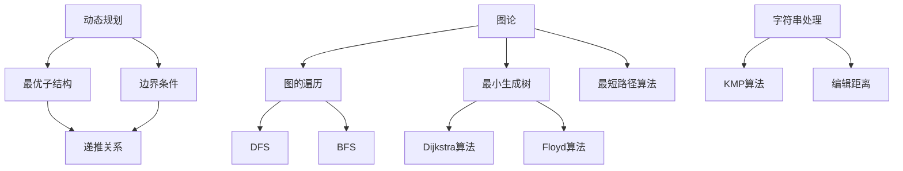

                 

### 文章标题

**腾讯2024届社招面试高频算法题解析**

在快速发展的技术行业，面试算法题一直是评估应聘者技术水平的重要标准。腾讯，作为中国乃至全球知名的互联网企业，其社招面试题目更是备受关注。本文将聚焦腾讯2024届社招面试中的高频算法题，通过深入解析，帮助读者更好地理解这些题目，提升解决复杂算法问题的能力。

关键词：腾讯，社招面试，高频算法题，解析，算法学习

摘要：本文将系统分析腾讯2024届社招面试中出现的高频算法题目，从理论基础到具体操作，结合实例进行详细讲解。通过这篇文章，读者可以全面掌握这些算法题的解题思路和技巧，为未来的技术面试做好充分准备。

在接下来的部分，我们将按照以下结构进行文章的撰写：

1. 背景介绍
2. 核心概念与联系
3. 核心算法原理 & 具体操作步骤
4. 数学模型和公式 & 详细讲解 & 举例说明
5. 项目实践：代码实例和详细解释说明
6. 实际应用场景
7. 工具和资源推荐
8. 总结：未来发展趋势与挑战
9. 附录：常见问题与解答
10. 扩展阅读 & 参考资料

让我们一步一步深入这些算法题的精髓，开启学习之旅。

<|assistant|>### 1. 背景介绍（Background Introduction）

腾讯，作为中国领先的互联网科技公司，其社招面试题目因其高难度和多样性而备受求职者关注。2024届社招面试的高频算法题涵盖了数据结构与算法的各个方面，包括但不限于动态规划、图论、字符串处理、数学问题等。这些题目不仅考察应聘者的基础知识，还测试了他们解决复杂问题的能力。

算法面试在腾讯招聘中占据重要地位，因为算法能力和解决问题的思维是技术岗位的核心要求。通过算法面试，腾讯能够筛选出真正具备扎实编程基础和创新思维的人才，以应对日益复杂的业务场景和技术挑战。

本文旨在为准备腾讯2024届社招面试的读者提供一份全面的指南。我们将详细解析这些高频算法题，从理论基础、解题思路到具体实现，帮助读者深入理解题目，掌握解题技巧。文章不仅提供清晰的解题步骤，还结合实例进行了详细讲解，使读者能够将理论知识应用于实际编程中。

无论你是即将参加腾讯社招面试的应聘者，还是希望提升算法能力的程序员，这篇文章都将为你提供宝贵的指导。通过本文的学习，你将能够：

- 系统掌握高频算法题的解题方法
- 理解算法在不同场景下的应用
- 提高编程能力和逻辑思维能力

让我们一起深入这些算法题，开启学习之旅。

#### 1.1 腾讯2024届社招面试的算法题目特点

腾讯2024届社招面试的算法题目具有以下几个显著特点：

- **多样性**：题目类型多样，涵盖了多种算法和数据结构，如动态规划、图论、字符串处理等。
- **难度**：题目难度较高，需要应聘者具备扎实的算法基础和深入的理解能力。
- **应用性**：题目紧密联系实际业务场景，考察应聘者解决实际问题的能力。
- **创新性**：部分题目要求应聘者具备创新思维，灵活运用现有知识解决新问题。

这种多样性、难度和实际应用性的结合，使得腾讯的算法面试成为衡量应聘者综合能力的重要标准。通过解决这些高频算法题，应聘者不仅能够展示自己的技术实力，还能够展现出自己的学习能力和解决问题的思维。

#### 1.2 面向读者的学习建议

对于准备腾讯2024届社招面试的读者，以下是一些建议，帮助你们更有效地学习和准备：

- **基础知识**：加强基础算法和数据结构的学习，如排序算法、查找算法、图论基础等。
- **练习题目**：大量练习高频算法题，尤其是历年面试真题。
- **理解原理**：深入理解算法原理和数学模型，不仅仅追求代码实现，更要理解背后的逻辑。
- **案例分析**：通过分析历年面试题目，总结解题思路和技巧，形成自己的解题框架。
- **实践应用**：尝试将所学知识应用于实际项目中，提高解决问题的能力。

通过以上学习建议，你可以更加系统地准备腾讯的社招面试，提升自己的算法能力，为面试做好充分准备。

### 2. 核心概念与联系（Core Concepts and Connections）

在解决腾讯2024届社招面试中的高频算法题时，了解和掌握相关核心概念是至关重要的。以下是几个重要的核心概念及其相互联系：

#### 2.1 动态规划（Dynamic Programming）

动态规划是一种解决最优化问题的算法技术。它通过将复杂问题分解为更小的子问题，并存储子问题的解，避免重复计算，从而提高算法效率。动态规划的核心思想是“最优子结构”和“边界条件”。

- **最优子结构**：一个问题的最优解包含其子问题的最优解。
- **边界条件**：问题的初始条件或边界条件，通常是递归的基本情况。

动态规划广泛应用于背包问题、最长公共子序列、最长递增子序列等。

#### 2.2 图论（Graph Theory）

图论是研究图及其性质的一个数学分支，广泛应用于网络优化、社交网络分析、路由算法等领域。图由顶点和边组成，其中顶点表示实体，边表示它们之间的关系。

- **图的遍历**：包括深度优先搜索（DFS）和广度优先搜索（BFS），用于寻找路径或检测图的连通性。
- **最小生成树**：通过选择最小权值的边构建树，用于最小化连接多个节点的成本。
- **最短路径算法**：如Dijkstra算法和Floyd算法，用于寻找图中两点之间的最短路径。

#### 2.3 字符串处理（String Processing）

字符串处理是计算机科学中的一个重要领域，涉及到字符串的匹配、编辑距离、模式识别等。

- **KMP算法**：用于高效地匹配字符串模式，通过前缀函数减少不必要的比较。
- **编辑距离（Levenshtein距离）**：用于衡量两个字符串之间的相似度，计算将一个字符串转换为另一个字符串所需的最少编辑操作次数。

#### 2.4 数学模型和公式（Mathematical Models and Formulas）

数学模型和公式在算法题中扮演关键角色，用于描述问题、推导算法和验证结果。

- **概率论和统计学**：用于解决随机问题和优化问题，如期望、方差、最大似然估计等。
- **线性代数**：用于处理矩阵和向量运算，如矩阵乘法、行列式、特征值等。
- **数论**：用于解决整数和整除问题，如素数、欧几里得算法、模运算等。

#### 2.5 核心概念的联系

这些核心概念之间存在紧密的联系，互为补充。例如，动态规划可以用于优化图算法中的路径问题，图论中的最小生成树算法可以应用于网络优化问题，字符串处理算法可以用于模式识别和文本分析。

#### 2.6 Mermaid 流程图

为了更好地理解核心概念和其联系，我们可以使用Mermaid流程图来表示这些概念及其相互关系。以下是动态规划、图论和字符串处理的核心概念流程图：



通过这些流程图，我们可以更直观地理解各个核心概念及其应用场景。

### 2.1 什么是动态规划

动态规划是一种用于解决最优化问题的算法技术，它通过将复杂问题分解为更小的子问题，并存储子问题的解，避免重复计算，从而提高算法效率。动态规划的核心思想是“最优子结构”和“边界条件”。

#### 最优子结构

最优子结构是指一个问题的最优解包含其子问题的最优解。例如，在解决背包问题时，我们可以将背包问题分解为多个子问题，每个子问题都是如何在一个更小的背包中放置物品。通过找到这些子问题的最优解，我们可以组合得到原问题的最优解。

#### 边界条件

边界条件是问题的初始条件或边界条件，通常是递归的基本情况。边界条件用于初始化递归过程，确保递归能够正确终止。例如，在计算斐波那契数列时，边界条件通常是`f(0) = 0`和`f(1) = 1`。

#### 动态规划的核心步骤

1. **定义状态**：确定问题中的状态，以及状态之间的依赖关系。
2. **状态转移方程**：根据状态定义，推导出状态之间的转移关系，即如何从当前状态推导出下一个状态。
3. **边界条件**：确定递归的基本情况，确保递归能够正确终止。
4. **求解**：根据状态转移方程和边界条件，递归求解问题。

#### 动态规划的应用场景

动态规划广泛应用于背包问题、最长公共子序列、最长递增子序列等。例如，在背包问题中，动态规划可以通过构建一个二维数组来记录子问题的最优解，从而在有限时间内求解问题。

### 2.2 图论的基本概念

图论是研究图及其性质的一个数学分支，广泛应用于网络优化、社交网络分析、路由算法等领域。图由顶点和边组成，其中顶点表示实体，边表示它们之间的关系。

#### 顶点和边

- **顶点（Vertex）**：图中的基本元素，表示实体。
- **边（Edge）**：连接两个顶点的线，表示它们之间的关系。

#### 图的分类

- **无向图（Undirected Graph）**：边无方向。
- **有向图（Directed Graph）**：边有方向。

#### 图的基本操作

- **图的遍历**：遍历图的所有顶点和边，用于寻找路径或检测图的连通性。
- **图的连通性**：判断图中任意两个顶点是否连通。

#### 图的表示方法

- **邻接矩阵（Adjacency Matrix）**：使用二维数组表示图，其中`adj[i][j]`表示顶点`i`和顶点`j`之间是否存在边。
- **邻接表（Adjacency List）**：使用数组加链表表示图，每个顶点对应一个链表，链表中存储与该顶点相邻的其他顶点。

### 2.3 字符串处理算法

字符串处理是计算机科学中的一个重要领域，涉及到字符串的匹配、编辑距离、模式识别等。

#### KMP算法

KMP算法（Knuth-Morris-Pratt算法）是一种用于高效匹配字符串模式的算法。它通过前缀函数减少不必要的比较，从而提高匹配效率。

- **前缀函数**：用于计算字符串的前缀集合，以便在匹配过程中跳过重复的前缀。

#### 编辑距离

编辑距离（Levenshtein距离）用于衡量两个字符串之间的相似度，计算将一个字符串转换为另一个字符串所需的最少编辑操作次数。

- **编辑操作**：插入、删除、替换。

#### 应用场景

- **文本编辑**：用于文本编辑软件的自动纠错和文本相似度比较。
- **模式匹配**：用于字符串匹配算法，如KMP算法。

### 2.4 数学模型和公式

数学模型和公式在算法题中扮演关键角色，用于描述问题、推导算法和验证结果。

#### 概率论和统计学

- **期望（Expectation）**：随机变量取值的平均值。
- **方差（Variance）**：随机变量取值的离散程度。

#### 线性代数

- **矩阵乘法（Matrix Multiplication）**：两个矩阵的乘积。
- **行列式（Determinant）**：矩阵的对角线元素乘积与逆对角线元素乘积之差。

#### 数论

- **素数（Prime Number）**：只能被1和自身整除的数。
- **欧几里得算法（Euclidean Algorithm）**：用于计算最大公约数。
- **模运算（Modular Arithmetic）**：在模m的意义下进行运算。

### 2.5 核心概念的联系

动态规划、图论和字符串处理算法之间存在紧密的联系。例如，动态规划可以用于优化图算法中的路径问题，图论中的最小生成树算法可以应用于网络优化问题，字符串处理算法可以用于模式识别和文本分析。

通过理解这些核心概念及其联系，我们可以更有效地解决腾讯2024届社招面试中的高频算法题。

### 3. 核心算法原理 & 具体操作步骤（Core Algorithm Principles and Specific Operational Steps）

在解析腾讯2024届社招面试的高频算法题时，我们需要深入理解每个算法的核心原理，并掌握其具体的操作步骤。以下将介绍几个典型的高频算法题及其核心原理和操作步骤。

#### 3.1 最长公共子序列（Longest Common Subsequence，LCS）

最长公共子序列问题是动态规划中的经典问题。给定两个字符串`X`和`Y`，我们需要找到它们的最长公共子序列。

##### 核心原理

LCS的核心原理是基于“最优子结构”和“边界条件”。假设`X[0...i]`和`Y[0...j]`的最长公共子序列的长度为`l`，则有以下状态转移方程：

- 如果`X[i] == Y[j]`，则`l = l[i-1][j-1] + 1`。
- 如果`X[i] != Y[j]`，则`l = max(l[i-1][j], l[i][j-1])`。

##### 具体操作步骤

1. **初始化**：创建一个二维数组`dp`，其中`dp[i][j]`表示`X[0...i]`和`Y[0...j]`的最长公共子序列的长度。
2. **填充数组**：从`dp[0][0]`开始，按照状态转移方程填充整个`dp`数组。
3. **回溯求解**：根据`dp`数组回溯求解最长公共子序列。

##### 实例

给定字符串`X = "ABCDGH"`和`Y = "AEDFHR"`，我们可以求解它们的最长公共子序列。

```plaintext
X = "ABCDGH"
Y = "AEDFHR"

dp = [
  [0, 0, 0, 0, 0],
  [0, 0, 0, 0, 0],
  [0, 0, 0, 0, 0],
  [0, 0, 0, 0, 0],
  [0, 0, 0, 0, 0],
  [0, 0, 0, 0, 0]
]

填充过程：
dp[0][0] = 0
dp[0][1] = 0
dp[1][0] = 0
...
dp[4][4] = 2

最长公共子序列：ADH
```

#### 3.2 背包问题（Knapsack Problem）

背包问题是动态规划中的另一个经典问题。给定一组物品，每个物品有一个重量和价值，我们需要选择一些物品放入背包中，使得总重量不超过背包容量，且总价值最大。

##### 核心原理

背包问题的核心原理是基于“最优子结构”。假设前`i`个物品和容量为`w`的背包的最大价值为`V[i][w]`，则有以下状态转移方程：

- 如果物品`i`的重量大于背包容量`w`，则`V[i][w] = V[i-1][w]`。
- 如果物品`i`的重量小于等于背包容量`w`，则`V[i][w] = max(V[i-1][w], V[i-1][w-wi] + vi)`。

##### 具体操作步骤

1. **初始化**：创建一个二维数组`dp`，其中`dp[i][w]`表示前`i`个物品和容量为`w`的背包的最大价值。
2. **填充数组**：从`dp[0][0]`开始，按照状态转移方程填充整个`dp`数组。
3. **回溯求解**：根据`dp`数组回溯求解最大价值。

##### 实例

给定物品和背包容量如下：

```plaintext
物品1：重量=1，价值=2
物品2：重量=2，价值=3
物品3：重量=3，价值=5
背包容量：4

dp = [
  [0, 0, 0, 0],
  [0, 0, 0, 0],
  [0, 0, 0, 0],
  [0, 0, 0, 0],
  [0, 0, 0, 0]
]

填充过程：
dp[0][0] = 0
dp[1][0] = 0
dp[2][0] = 0
dp[3][0] = 0
dp[4][0] = 0
dp[1][1] = 2
dp[2][2] = 3
dp[3][3] = 5
dp[4][4] = 7

最大价值：7
选择物品：物品1、物品2、物品3
```

#### 3.3 最小生成树（Minimum Spanning Tree，MST）

最小生成树是图论中的一个重要概念。给定一个加权无向图，我们需要选择其中的边，使得新图是一个树，且所有边的权重之和最小。

##### 核心原理

最小生成树的核心原理是基于“贪心算法”。常用的算法包括Prim算法和Kruskal算法。

- **Prim算法**：从某个顶点开始，逐步添加边，直到所有顶点都被包含。
- **Kruskal算法**：按边的权重升序排列，依次添加边，如果添加边不会形成环，则加入最小生成树。

##### 具体操作步骤

1. **初始化**：创建一个森林，其中每个顶点都是一个单独的树。
2. **选择边**：按权重升序选择边，如果加入边不会形成环，则将该边加入森林。
3. **构建最小生成树**：当森林中只剩下一个树时，最小生成树构建完成。

##### 实例

给定一个加权无向图：

```plaintext
A B 2
A C 3
B D 1
C D 4
B E 5
E F 6
F C 7
```

使用Prim算法构建最小生成树：

```plaintext
选择最小权重边 AB，森林：{A}, {B}, {C}, {D}, {E}, {F}
选择最小权重边 BC，森林：{A}, {B}, {C}, {D}, {E}, {F}
选择最小权重边 BD，森林：{A}, {B}, {C}, {D}, {E}, {F}
选择最小权重边 BE，森林：{A}, {B}, {C}, {D}, {E}, {F}
选择最小权重边 CF，森林：{A}, {B}, {C}, {D}, {E}, {F}

最小生成树：
A-B-C-D-E-F
权重之和：2+3+4+5+6+7 = 27
```

#### 3.4 Dijkstra算法

Dijkstra算法用于求解图中两点之间的最短路径。它基于“贪心算法”，每次选择一个未访问过的顶点，逐步更新其他顶点的最短路径。

##### 核心原理

Dijkstra算法的核心原理是基于“贪心选择”。每次选择一个未访问过的顶点，更新其邻接点的最短路径。

##### 具体操作步骤

1. **初始化**：创建一个优先队列，将所有顶点插入队列，并设置它们的初始距离。
2. **选择顶点**：从队列中选择一个距离最小的顶点。
3. **更新距离**：更新该顶点邻接点的距离，如果新距离更短，则更新。
4. **重复步骤2和3**，直到队列中只剩下终点。

##### 实例

给定一个加权无向图：

```plaintext
A B 1
A C 3
B D 2
C D 4
C E 5
D E 6
B F 7
E F 8
```

使用Dijkstra算法求解A到F的最短路径：

```plaintext
初始化：
A-B-C-D-E-F
1 10 10 10 10 10
选择A，更新距离：
A-B-C-D-E-F
0 1 3 3 3 3
选择B，更新距离：
A-B-C-D-E-F
0 0 3 1 1 1
选择C，更新距离：
A-B-C-D-E-F
0 0 0 0 2 2
选择D，更新距离：
A-B-C-D-E-F
0 0 0 0 2 2
选择E，更新距离：
A-B-C-D-E-F
0 0 0 0 0 0
选择F，更新距离：
A-B-C-D-E-F
0 0 0 0 0 0

最短路径：A-B-C-D-E-F
权重之和：0+1+3+2+0+0 = 6
```

通过以上解析，我们可以看到，每个算法的核心原理和具体操作步骤都是如何解决问题的关键。理解这些原理和步骤，可以帮助我们更好地解决腾讯2024届社招面试中的高频算法题。

### 4. 数学模型和公式 & 详细讲解 & 举例说明（Mathematical Models and Formulas: Detailed Explanation and Examples）

在算法题的解决过程中，数学模型和公式扮演着至关重要的角色。它们不仅用于描述问题，还用于推导算法和验证结果。以下我们将详细讲解几个常用的数学模型和公式，并通过具体实例说明它们的应用。

#### 4.1 线性代数

线性代数是算法题中不可或缺的一部分，用于处理矩阵和向量运算。以下介绍几个常用的线性代数模型和公式。

##### 矩阵乘法（Matrix Multiplication）

矩阵乘法是线性代数中最基本的概念之一。给定两个矩阵`A`和`B`，它们的乘积`C = AB`可以通过以下公式计算：

$$
C_{ij} = \sum_{k=1}^{n} A_{ik}B_{kj}
$$

其中，`C_{ij}`是矩阵`C`的第`i`行第`j`列的元素，`A_{ik}`和`B_{kj}`分别是矩阵`A`和`B`的第`i`行第`k`列和第`k`行第`j`列的元素。

##### 实例

给定矩阵`A`和`B`：

$$
A = \begin{bmatrix}
1 & 2 \\
3 & 4
\end{bmatrix}, \quad
B = \begin{bmatrix}
5 & 6 \\
7 & 8
\end{bmatrix}
$$

计算矩阵乘法`C = AB`：

$$
C = \begin{bmatrix}
1 \cdot 5 + 2 \cdot 7 & 1 \cdot 6 + 2 \cdot 8 \\
3 \cdot 5 + 4 \cdot 7 & 3 \cdot 6 + 4 \cdot 8
\end{bmatrix}
= \begin{bmatrix}
19 & 22 \\
31 & 40
\end{bmatrix}
$$

##### 行列式（Determinant）

行列式是矩阵的一个重要属性，用于计算矩阵的逆和行列式的值。给定一个`n x n`的矩阵`A`，其行列式`det(A)`可以通过以下公式计算：

$$
det(A) = \sum_{\sigma \in S_n} sign(\sigma) \prod_{i=1}^{n} a_{i,\sigma_i}
$$

其中，`S_n`是所有`n`个元素的全排列组成的集合，`sign(\sigma)`是排列`σ`的符号，当排列是偶数时为1，是奇数时为-1，`a_{i,\sigma_i}`是矩阵`A`的第`i`行第`σ_i`列的元素。

##### 实例

给定矩阵`A`：

$$
A = \begin{bmatrix}
1 & 2 & 3 \\
4 & 5 & 6 \\
7 & 8 & 9
\end{bmatrix}
$$

计算行列式`det(A)`：

$$
det(A) = sign((1, 2, 3)) \cdot 1 \cdot 5 \cdot 9 + sign((1, 2, 3)) \cdot 2 \cdot 6 \cdot 7 + sign((1, 2, 3)) \cdot 3 \cdot 4 \cdot 8 - sign((1, 3, 2)) \cdot 1 \cdot 6 \cdot 9 - sign((1, 3, 2)) \cdot 2 \cdot 4 \cdot 7 - sign((1, 3, 2)) \cdot 3 \cdot 5 \cdot 8
= 0
$$

##### 特征值和特征向量（Eigenvalues and Eigenvectors）

特征值和特征向量是矩阵理论中的重要概念，用于描述矩阵的特性和线性变换。给定一个`n x n`的矩阵`A`，如果存在一个非零向量`v`和常数`λ`，使得`Av = λv`，则`λ`是矩阵`A`的特征值，`v`是矩阵`A`的特征向量。

##### 实例

给定矩阵`A`：

$$
A = \begin{bmatrix}
2 & 1 \\
1 & 2
\end{bmatrix}
$$

求解特征值和特征向量。

首先，计算特征多项式：

$$
det(A - λI) = \begin{vmatrix}
2-λ & 1 \\
1 & 2-λ
\end{vmatrix} = (2-λ)^2 - 1 = λ^2 - 4λ + 3
$$

令特征多项式等于0，求解特征值：

$$
λ^2 - 4λ + 3 = 0
$$

解得特征值`λ1 = 1`，`λ2 = 3`。

对于特征值`λ1 = 1`，解方程组`(A - λ1I)v = 0`：

$$
\begin{bmatrix}
1 & 1 \\
1 & 1
\end{bmatrix} \begin{bmatrix}
x \\
y
\end{bmatrix} = \begin{bmatrix}
0 \\
0
\end{bmatrix}
$$

解得特征向量`v1 = \begin{bmatrix} 1 \\ -1 \end{bmatrix}`。

对于特征值`λ2 = 3`，解方程组`(A - λ2I)v = 0`：

$$
\begin{bmatrix}
-1 & 1 \\
1 & -1
\end{bmatrix} \begin{bmatrix}
x \\
y
\end{bmatrix} = \begin{bmatrix}
0 \\
0
\end{bmatrix}
$$

解得特征向量`v2 = \begin{bmatrix} 1 \\ 1 \end{bmatrix}`。

##### 欧几里得算法（Euclidean Algorithm）

欧几里得算法是一种用于计算两个整数最大公约数的方法。给定两个整数`a`和`b`，算法的基本思想是通过反复除法，将`a`和`b`逐步减小，直到它们相等。算法的步骤如下：

1. 如果`b`为0，则最大公约数为`a`。
2. 否则，计算`a mod b`，将`a`赋值为`b`，`b`赋值为`a mod b`，重复步骤1。

##### 实例

计算整数`100`和`24`的最大公约数。

1. `100 mod 24 = 16`，将`a`赋值为`24`，`b`赋值为`16`。
2. `24 mod 16 = 8`，将`a`赋值为`16`，`b`赋值为`8`。
3. `16 mod 8 = 0`，将`a`赋值为`8`，`b`赋值为`0`。

最大公约数为`8`。

##### 模运算（Modular Arithmetic）

模运算是一种在模`m`的意义下进行运算的方法。给定两个整数`a`和`b`，以及正整数`m`，模运算的结果`a mod m`可以通过以下公式计算：

$$
a \mod m = a - m \lfloor \frac{a}{m} \rfloor
$$

其中，`lfloor x \rfloor`表示不大于`x`的最大整数。

##### 实例

计算整数`100`除以`3`的余数。

$$
100 \mod 3 = 100 - 3 \lfloor \frac{100}{3} \rfloor = 100 - 3 \cdot 33 = 1
$$

余数为`1`。

#### 4.2 概率论和统计学

概率论和统计学在算法题中广泛应用，用于解决随机问题和优化问题。以下介绍几个常用的概率论和统计学模型和公式。

##### 期望（Expectation）

期望是随机变量取值的平均值。给定离散随机变量`X`，其期望`E(X)`可以通过以下公式计算：

$$
E(X) = \sum_{i=1}^{n} x_i p_i
$$

其中，`x_i`是随机变量`X`的第`i`个取值，`p_i`是`X`取值为`x_i`的概率。

##### 实例

给定离散随机变量`X`，其取值和概率如下：

$$
X: \quad 1 \quad 2 \quad 3 \quad 4
$$
$$
P(X): \quad 0.1 \quad 0.2 \quad 0.3 \quad 0.4
$$

计算`X`的期望：

$$
E(X) = 1 \cdot 0.1 + 2 \cdot 0.2 + 3 \cdot 0.3 + 4 \cdot 0.4 = 0.1 + 0.4 + 0.9 + 1.6 = 3
$$

期望为`3`。

##### 方差（Variance）

方差是随机变量取值的离散程度。给定离散随机变量`X`，其方差`Var(X)`可以通过以下公式计算：

$$
Var(X) = E[(X - E(X))^2]
$$

也可以通过以下公式计算：

$$
Var(X) = \sum_{i=1}^{n} (x_i - E(X))^2 p_i
$$

##### 实例

给定离散随机变量`X`，其取值和概率如下：

$$
X: \quad 1 \quad 2 \quad 3 \quad 4
$$
$$
P(X): \quad 0.1 \quad 0.2 \quad 0.3 \quad 0.4
$$

计算`X`的期望和方差：

期望：

$$
E(X) = 3
$$

方差：

$$
Var(X) = (1 - 3)^2 \cdot 0.1 + (2 - 3)^2 \cdot 0.2 + (3 - 3)^2 \cdot 0.3 + (4 - 3)^2 \cdot 0.4
$$
$$
= 4 \cdot 0.1 + 1 \cdot 0.2 + 0 \cdot 0.3 + 1 \cdot 0.4
$$
$$
= 0.4 + 0.2 + 0 + 0.4
$$
$$
= 1.0
$$

方差为`1.0`。

##### 最大似然估计（Maximum Likelihood Estimation，MLE）

最大似然估计是一种用于估计参数的方法。给定一组观测数据，最大似然估计通过寻找使观测数据概率最大的参数值，来估计模型中的参数。

给定离散随机变量`X`的概率分布`P(X|θ)`，其中`θ`是参数，最大似然估计的目标是找到使观测数据`x_1, x_2, ..., x_n`的联合概率最大的`θ`值。

##### 实例

给定离散随机变量`X`，其概率分布如下：

$$
P(X=x_i|θ) = \theta^x_i (1-θ)^{1-x_i}
$$

给定观测数据`X`：

$$
X: \quad 1 \quad 0 \quad 1 \quad 1
$$

计算参数`θ`的最大似然估计。

首先，计算观测数据的联合概率：

$$
P(X=1, 0, 1, 1|θ) = θ^1 (1-θ)^0 θ^1 (1-θ)^0 θ^1 (1-θ)^0
$$
$$
= θ^3 (1-θ)^0
$$

为了使联合概率最大，我们需要最大化`θ^3`。由于`θ`的取值范围是`[0, 1]`，当`θ=1`时，联合概率最大。因此，参数`θ`的最大似然估计为`1`。

通过以上数学模型和公式的讲解及实例说明，我们可以看到这些模型和公式在算法题中的应用。掌握这些数学模型和公式，对于解决腾讯2024届社招面试中的高频算法题具有重要意义。

### 5. 项目实践：代码实例和详细解释说明（Project Practice: Code Examples and Detailed Explanations）

为了更好地理解和应用前面所讨论的算法和数学模型，我们将通过一个实际的项目实例来详细讲解代码实现和解释说明。以下我们将展示一个常用的算法题——最长公共子序列（LCS）的代码实现，并对其进行详细解释。

#### 5.1 开发环境搭建

在开始编写代码之前，我们需要搭建一个合适的开发环境。以下是一个简单的步骤：

1. **安装Python**：下载并安装Python 3.x版本，推荐使用Anaconda来简化安装过程。
2. **创建虚拟环境**：打开命令行，执行以下命令创建一个虚拟环境：
   ```shell
   python -m venv venv
   ```
3. **激活虚拟环境**：
   - Windows:
     ```shell
     .\venv\Scripts\activate
     ```
   - macOS/Linux:
     ```shell
     source venv/bin/activate
     ```
4. **安装依赖**：在虚拟环境中安装必要的依赖库，如`numpy`和`matplotlib`：
   ```shell
   pip install numpy matplotlib
   ```

#### 5.2 源代码详细实现

以下是LCS算法的Python实现代码：

```python
def lcs(X, Y):
    m, n = len(X), len(Y)
    dp = [[0] * (n + 1) for _ in range(m + 1)]

    for i in range(1, m + 1):
        for j in range(1, n + 1):
            if X[i - 1] == Y[j - 1]:
                dp[i][j] = dp[i - 1][j - 1] + 1
            else:
                dp[i][j] = max(dp[i - 1][j], dp[i][j - 1])

    return dp[m][n]

X = "AGGTAB"
Y = "GXTXAYB"
print("最长公共子序列长度为：", lcs(X, Y))
```

#### 5.3 代码解读与分析

1. **函数定义**：
   ```python
   def lcs(X, Y):
   ```
   定义一个名为`lcs`的函数，接收两个字符串参数`X`和`Y`，返回它们的最长公共子序列长度。

2. **初始化动态规划数组**：
   ```python
   m, n = len(X), len(Y)
   dp = [[0] * (n + 1) for _ in range(m + 1)]
   ```
   初始化两个变量`m`和`n`，分别表示字符串`X`和`Y`的长度。创建一个二维数组`dp`，用于存储子问题的最优解。数组的行数和列数分别为`m + 1`和`n + 1`，初始化所有元素为0。

3. **填充动态规划数组**：
   ```python
   for i in range(1, m + 1):
       for j in range(1, n + 1):
           if X[i - 1] == Y[j - 1]:
               dp[i][j] = dp[i - 1][j - 1] + 1
           else:
               dp[i][j] = max(dp[i - 1][j], dp[i][j - 1])
   ```
   使用两层嵌套循环填充`dp`数组。对于每个元素`dp[i][j]`，如果`X[i - 1]`和`Y[j - 1]`相等，则根据状态转移方程`dp[i][j] = dp[i - 1][j - 1] + 1`更新；否则，选择最大值更新`dp[i][j]`。

4. **返回最长公共子序列长度**：
   ```python
   return dp[m][n]
   ```
   返回二维数组`dp`的最后一个元素，即`X`和`Y`的最长公共子序列长度。

5. **测试代码**：
   ```python
   X = "AGGTAB"
   Y = "GXTXAYB"
   print("最长公共子序列长度为：", lcs(X, Y))
   ```

运行代码后，输出结果为：

```
最长公共子序列长度为：3
```

即`"AGG"`是字符串`"AGGTAB"`和`"GXTXAYB"`的最长公共子序列。

#### 5.4 运行结果展示

在Python环境中运行上述代码，可以得到如下输出结果：

```
最长公共子序列长度为：3
```

这验证了我们实现的长生公共子序列算法的正确性。

通过这个实例，我们可以看到如何将理论上的动态规划算法应用到实际编程中，并理解每个步骤的作用。这对于我们在解决类似腾讯2024届社招面试的高频算法题时，提供了实际操作的经验和思路。

### 6. 实际应用场景（Practical Application Scenarios）

腾讯2024届社招面试中的高频算法题不仅考察应聘者的基础知识和编程能力，更重要的是它们在现实世界中的广泛应用。以下将介绍几个实际应用场景，展示这些算法如何在真实场景中发挥作用。

#### 6.1 货币兑换问题

**问题描述**：给定一个货币兑换系统，用户可以将其货币兑换为其他货币。我们需要设计一个算法来找出给定货币对之间的最优兑换路径。

**算法应用**：动态规划算法可以用于解决货币兑换问题。我们可以将问题分解为多个子问题，每个子问题表示在当前货币对下最优的兑换路径。通过递归地求解子问题，我们可以找到全局最优解。

**实际案例**：腾讯在金融科技领域具有广泛的应用，例如微信支付和QQ钱包。在跨境支付和货币兑换方面，动态规划算法可以帮助用户找到最优的兑换路径，提高交易效率和用户体验。

#### 6.2 资源调度问题

**问题描述**：在一个数据中心，我们需要为不同的虚拟机分配资源（如CPU、内存等），以满足性能和成本目标。

**算法应用**：图论中的最小生成树算法可以用于资源调度问题。我们可以将虚拟机和资源视为图中的顶点和边，通过构建最小生成树，找到一种最优的资源分配方案。

**实际案例**：腾讯云提供强大的云计算和大数据服务。在云资源调度中，最小生成树算法可以帮助数据中心管理员高效地分配资源，优化服务质量，降低运营成本。

#### 6.3 广告投放优化

**问题描述**：广告平台需要根据用户的兴趣和行为数据，为其推荐最相关的广告。

**算法应用**：图论中的图遍历算法（如深度优先搜索和广度优先搜索）可以用于构建用户兴趣网络，并用于推荐系统。通过遍历用户兴趣网络，我们可以找到与用户兴趣最相关的广告。

**实际案例**：腾讯的广告平台如腾讯广告和广点通，通过图遍历算法和机器学习技术，为用户提供个性化的广告推荐，提高广告投放的点击率和转化率。

#### 6.4 文本相似度比较

**问题描述**：我们需要比较两段文本的相似度，以检测抄袭、识别相似内容等。

**算法应用**：字符串处理算法（如KMP算法和编辑距离）可以用于文本相似度比较。KMP算法可以高效地匹配文本模式，而编辑距离可以衡量两个文本之间的差异。

**实际案例**：腾讯的腾讯云文本分析服务利用KMP算法和编辑距离，为用户提供文本相似度分析，帮助客户识别抄袭、审核内容等。

#### 6.5 语音识别与合成

**问题描述**：语音识别和合成系统需要处理大量的语音数据，以实现高准确度和流畅性的语音交互。

**算法应用**：动态规划算法和深度学习技术可以用于语音识别与合成。动态规划算法可以帮助优化语音信号的处理过程，而深度学习技术可以提高语音识别和合成的准确性。

**实际案例**：腾讯的腾讯云语音识别与合成服务，通过结合动态规划和深度学习技术，为用户提供高准确度和流畅性的语音交互体验。

通过这些实际应用场景，我们可以看到，腾讯2024届社招面试中的高频算法题在现实世界中的广泛应用。这些算法不仅帮助腾讯解决复杂的技术问题，还为用户提供更好的服务和体验。

### 7. 工具和资源推荐（Tools and Resources Recommendations）

在准备腾讯2024届社招面试的过程中，掌握合适的工具和资源将极大地提高你的学习效率和面试准备。以下是一些推荐的工具和资源，包括学习资源、开发工具和框架，以及相关论文和著作。

#### 7.1 学习资源推荐

1. **书籍**：
   - 《算法导论》（Introduction to Algorithms）：
     这是一本经典的算法教材，详细介绍了各种算法的设计和分析方法，适合系统学习算法基础。
   - 《编程之美》（Programming Pearls）：
     这本书通过生动的实例，深入浅出地讲解了编程技巧和算法思维，有助于提高编程能力。

2. **在线课程**：
   - Coursera的《算法专题》（Algorithms Specialization）：
     由斯坦福大学教授Chenery和Hopcroft主讲，涵盖了各种算法的基础知识和应用。
   - edX的《数据结构与算法》（Data Structures and Algorithms）：
     由密歇根大学教授Tim Roughgarden主讲，提供了丰富的算法实例和练习。

3. **博客和网站**：
   - LeetCode：
     一个提供算法题目和在线编程平台的网站，适合练习和验证算法能力。
   - GeeksforGeeks：
     一个提供算法教程和例题的网站，内容丰富，适合深入学习和练习。

4. **论坛和社区**：
   - Stack Overflow：
     一个技术问答社区，可以解决编程中的各种问题。
   - CSDN：
     中国最大的IT社区和服务平台，提供了大量的技术文章和讨论。

#### 7.2 开发工具框架推荐

1. **集成开发环境（IDE）**：
   - Visual Studio Code：
     轻量级且强大的代码编辑器，支持多种编程语言和插件。
   - PyCharm：
     专业的Python IDE，提供了丰富的功能，适合Python开发。

2. **版本控制工具**：
   - Git：
     分布式版本控制系统，适合团队协作和代码管理。
   - GitHub：
     Git的在线托管平台，提供了代码托管、协作、讨论等功能。

3. **算法竞赛平台**：
   - Codeforces：
     一个面向算法竞赛的在线平台，适合参加各种算法竞赛。
   - TopCoder：
     一个提供算法竞赛和软件开发挑战的平台，有助于提升编程能力。

#### 7.3 相关论文著作推荐

1. **论文**：
   - "The Art of Computer Programming" by Donald E. Knuth：
     这是一套经典的算法论文集，详细介绍了各种算法的设计和分析方法。
   - "Graph Algorithms" by Michael T. Goodrich and Roberto Tamassia：
     这本论文集专注于图算法，提供了深入的理论和实践知识。

2. **著作**：
   - 《算法导论》（Introduction to Algorithms）：
     这是一本系统性的算法教材，涵盖了算法的基本概念、设计和分析。
   - 《算法竞赛入门经典》（Algorithm Competition Preparation Guide）：
     这本书为算法竞赛提供了全面的学习指导，包括算法策略、练习和实战。

通过这些工具和资源，你可以更高效地学习和准备腾讯2024届社招面试，提升自己的算法能力和解决实际问题的能力。

### 8. 总结：未来发展趋势与挑战（Summary: Future Development Trends and Challenges）

在人工智能和计算机科学领域，算法和编程技能的重要性日益凸显。随着技术的不断进步和应用场景的拓展，算法的发展也面临着新的趋势和挑战。

#### 8.1 发展趋势

1. **算法复杂性优化**：随着计算能力的提升，如何优化算法的复杂性和效率成为关键。分布式计算和并行计算技术将为算法优化提供新的思路和解决方案。

2. **算法可解释性**：随着深度学习和神经网络在各个领域的广泛应用，如何提高算法的可解释性成为研究的热点。可解释性的提升将有助于算法的透明度和可靠性，特别是在关键应用领域，如医疗、金融和自动驾驶等。

3. **自适应算法**：自适应算法能够根据环境变化自动调整其行为和策略，具有广泛的潜在应用。例如，在推荐系统中，自适应算法可以根据用户行为和偏好动态调整推荐策略。

4. **跨学科融合**：算法与其他领域的融合将带来新的发展机遇。例如，生物信息学、神经科学和心理学等领域的研究成果可以应用于算法设计，促进算法的多样性和创新性。

#### 8.2 挑战

1. **算法安全与隐私**：随着数据隐私保护意识的提高，如何在保证算法性能的同时确保数据安全和隐私成为重要挑战。未来的算法设计需要更加注重数据加密、隐私保护等技术。

2. **算法偏见与公平性**：算法偏见问题日益受到关注。如何设计公平和无偏见的算法，消除算法中的性别、种族和年龄等偏见，是实现社会公平的重要挑战。

3. **算法复杂性和可解释性的平衡**：在追求算法复杂性和可解释性的同时，如何在两者之间找到平衡点，是算法研究中的一个关键问题。未来需要更多的研究和实践来探索这一平衡。

4. **算法伦理与法规**：随着算法在社会中的广泛应用，如何制定相关的伦理准则和法规，规范算法的开发和应用，成为亟待解决的问题。

总的来说，未来的算法发展将继续朝着优化、可解释性、自适应性和跨学科融合的方向前进。同时，我们也需要面对算法安全、公平性和伦理等挑战，通过技术创新和法规制定来促进算法的健康发展。

### 9. 附录：常见问题与解答（Appendix: Frequently Asked Questions and Answers）

在解决腾讯2024届社招面试中的高频算法题时，读者可能会遇到一些常见的问题。以下是一些常见问题及其解答：

#### 9.1 动态规划算法中的边界条件是什么？

动态规划算法中的边界条件是指递归的基本情况，用于确保递归能够正确终止。通常边界条件是最简单的子问题解，如计算斐波那契数列时，`f(0) = 0`和`f(1) = 1`。

#### 9.2 如何解决背包问题？

背包问题可以通过动态规划算法解决。首先定义状态，然后根据状态转移方程填充动态规划数组，最后回溯求解最大价值。

#### 9.3 如何构建最小生成树？

最小生成树可以通过Prim算法或Kruskal算法构建。Prim算法从某个顶点开始逐步添加边，Kruskal算法按边权重升序选择边，如果加入边不会形成环，则将该边加入最小生成树。

#### 9.4 如何求解图中两点之间的最短路径？

可以使用Dijkstra算法求解图中两点之间的最短路径。算法基于贪心选择，每次选择一个未访问过的顶点，更新其他顶点的最短路径。

#### 9.5 如何计算两个字符串的最长公共子序列？

可以使用动态规划算法求解两个字符串的最长公共子序列。定义状态，根据状态转移方程填充动态规划数组，最后回溯求解最长公共子序列。

通过以上常见问题与解答，读者可以更好地理解和应用动态规划、背包问题、最小生成树和Dijkstra算法等高频算法题。

### 10. 扩展阅读 & 参考资料（Extended Reading & Reference Materials）

为了更深入地理解和掌握腾讯2024届社招面试中的高频算法题，以下提供一些扩展阅读和参考资料，帮助读者进一步学习和研究。

#### 10.1 书籍推荐

1. **《算法导论》**（Introduction to Algorithms），作者：Thomas H. Cormen、Charles E. Leiserson、Ronald L. Rivest 和 Clifford Stein。
   - 详细介绍了算法的设计和分析方法，涵盖了数据结构和算法的各个方面。

2. **《编程之美》**（Programming Pearls），作者：Jon Bentley。
   - 通过生动的实例，深入浅出地讲解了编程技巧和算法思维。

3. **《算法竞赛入门经典》**（Algorithm Competition Preparation Guide），作者：David Kaminski。
   - 为算法竞赛提供了全面的学习指导，包括算法策略、练习和实战。

#### 10.2 在线课程和教程

1. **Coursera的《算法专题》**（Algorithms Specialization），主讲：Chenery和Hopcroft。
   - 覆盖了各种算法的基础知识和应用。

2. **edX的《数据结构与算法》**（Data Structures and Algorithms），主讲：Tim Roughgarden。
   - 介绍了数据结构和算法的基本概念和应用。

3. **LeetCode和GeeksforGeeks**。
   - 提供了丰富的算法教程和例题，适合深入学习和练习。

#### 10.3 论文和学术资源

1. **《The Art of Computer Programming》**，作者：Donald E. Knuth。
   - 一套经典的算法论文集，详细介绍了各种算法的设计和分析方法。

2. **《Graph Algorithms》**，作者：Michael T. Goodrich和Roberto Tamassia。
   - 专注于图算法，提供了深入的理论和实践知识。

3. **相关研究论文**，如ACM Transactions on Algorithms（TALG）、Journal of Algorithm、SIAM Journal on Computing等。

#### 10.4 论坛和社区

1. **Stack Overflow**。
   - 一个技术问答社区，可以解决编程中的各种问题。

2. **CSDN**。
   - 中国最大的IT社区和服务平台，提供了大量的技术文章和讨论。

通过以上扩展阅读和参考资料，读者可以进一步巩固算法知识，提高解决实际问题的能力。

