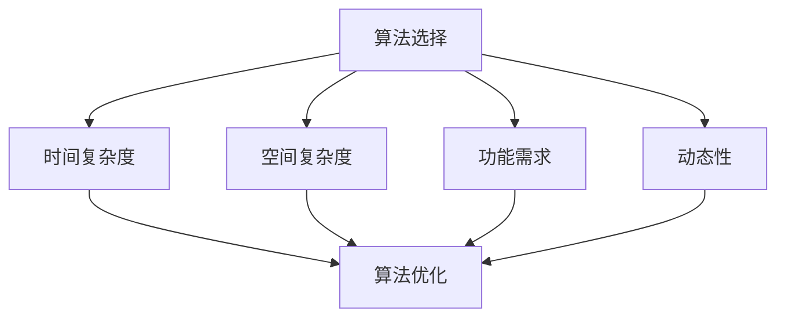

                 

### 文章标题

2025腾讯校招编程面试题精选与解答

### 关键词

- 腾讯校招
- 编程面试题
- 面试技巧
- 数据结构与算法
- 编码实战

### 摘要

本文精选了2025年腾讯校招的编程面试题目，详细解答了各类面试题的解题思路、关键步骤及实际操作方法。通过本文的学习，读者将掌握腾讯校招编程面试的核心考点，提升自己的面试应对能力，为未来的职业发展打下坚实基础。

## 1. 背景介绍（Background Introduction）

腾讯，作为中国领先的互联网科技公司，每年都会举办校园招聘活动，吸引众多应届毕业生的关注。编程面试作为腾讯校招的重要组成部分，旨在选拔具备扎实编程基础和优秀问题解决能力的优秀人才。本文旨在通过对2025年腾讯校招编程面试题的精选与解答，帮助读者深入了解面试的核心考点，提升自己的面试技能。

### 1.1 腾讯校招编程面试的题型

腾讯校招编程面试主要包括以下题型：

1. **算法与数据结构问题**：这是面试中最常见的题型，包括动态规划、排序、查找、图论等知识点。
2. **编程实现问题**：考察考生对编程语言的理解和编程能力，如实现某一算法、数据结构或编写一个简单应用。
3. **系统设计与架构问题**：考察考生对系统设计、架构和分布式系统的理解和应用能力。
4. **逻辑思维与推理问题**：这类题目通常要求考生在有限时间内分析问题、设计解决方案，并进行合理的推理。
5. **开放式问题**：这类问题通常涉及对某一技术领域的理解、应用前景或相关技术的比较等。

### 1.2 腾讯校招编程面试的特点

1. **题量大、时间紧**：腾讯校招编程面试的题目数量较多，通常要求考生在短时间内完成多个问题，这对考生的编程能力和时间管理能力提出了较高要求。
2. **综合能力考察**：腾讯校招编程面试不仅考察考生的编程技能，还涉及对算法和数据结构的理解，以及解决问题的逻辑思维能力。
3. **实际问题导向**：许多题目来源于实际的业务场景或技术问题，要求考生具备一定的实际应用能力和解决复杂问题的能力。

## 2. 核心概念与联系（Core Concepts and Connections）

### 2.1 算法与数据结构的基本概念

算法（Algorithm）：解决特定问题的有限步骤的明确指导过程。

数据结构（Data Structure）：组织、存储和管理数据的结构，以支持特定类型的操作。

### 2.2 常见算法与数据结构的联系

1. **排序算法**：常用的排序算法包括冒泡排序、选择排序、插入排序、快速排序等。这些算法的数据结构基础通常是数组。

2. **查找算法**：包括线性查找、二分查找等。二分查找要求数据结构具有有序性，通常使用数组或树结构。

3. **图论算法**：如深度优先搜索（DFS）、广度优先搜索（BFS）、最小生成树（如Prim算法、Kruskal算法）、最短路径（如Dijkstra算法、Floyd算法）等。这些算法的数据结构基础通常是图。

### 2.3 算法与数据结构在实际应用中的联系

在实际应用中，算法和数据结构的选择通常取决于以下几个因素：

1. **时间复杂度**：算法的时间复杂度直接影响程序的性能，选择合适的算法可以显著提高程序效率。

2. **空间复杂度**：算法的空间复杂度决定了程序占用的内存大小，对于资源受限的环境，选择合适的数据结构可以降低内存消耗。

3. **功能需求**：不同的算法和数据结构适用于不同的功能需求。例如，对于大量数据的存储和查询，B树是一种常见的选择。

4. **动态性**：某些应用场景需要数据结构支持动态变化，如动态数组、链表等。

### 2.4 算法与数据结构的 Mermaid 流程图



## 3. 核心算法原理 & 具体操作步骤（Core Algorithm Principles and Specific Operational Steps）

### 3.1 动态规划算法原理

动态规划（Dynamic Programming，DP）是一种用于求解最优化问题的算法策略。其核心思想是将大问题分解为若干个子问题，并存储子问题的解以避免重复计算。

### 3.2 动态规划算法步骤

1. **定义子问题**：将原问题分解为若干个子问题。

2. **状态表示**：定义一个状态表示子问题的解，如状态数组或状态表。

3. **状态转移方程**：根据子问题之间的关系，定义状态转移方程。

4. **初始化**：初始化状态数组的初始值。

5. **计算顺序**：按照计算顺序依次计算状态，通常从低到高或从简单到复杂。

6. **求解**：根据状态转移方程和初始状态，计算最终状态，得到原问题的解。

### 3.3 动态规划算法实例：最长公共子序列（LCS）

```python
def lcs(X, Y):
    m = len(X)
    n = len(Y)
    dp = [[0] * (n+1) for _ in range(m+1)]

    for i in range(1, m+1):
        for j in range(1, n+1):
            if X[i-1] == Y[j-1]:
                dp[i][j] = dp[i-1][j-1] + 1
            else:
                dp[i][j] = max(dp[i-1][j], dp[i][j-1])

    return dp[m][n]
```

## 4. 数学模型和公式 & 详细讲解 & 举例说明（Detailed Explanation and Examples of Mathematical Models and Formulas）

### 4.1 动态规划中的数学模型

动态规划中的数学模型通常包含以下几个部分：

1. **状态定义**：定义一个状态表示子问题的解，如 `dp[i][j]` 表示子问题 `X[0...i]` 和 `Y[0...j]` 的最长公共子序列的长度。

2. **状态转移方程**：根据子问题之间的关系，定义状态转移方程，如 `dp[i][j] = dp[i-1][j-1] + 1`（当 `X[i] == Y[j]` 时）或 `dp[i][j] = max(dp[i-1][j], dp[i][j-1])`（当 `X[i] != Y[j]` 时）。

3. **初始状态**：定义初始状态，如 `dp[0][j] = 0` 和 `dp[i][0] = 0`。

4. **计算顺序**：按照计算顺序依次计算状态，通常从低到高或从简单到复杂。

### 4.2 动态规划算法的详细讲解与举例

#### 4.2.1 最长公共子序列（LCS）

给定两个序列 `X = [X_1, X_2, ..., X_m]` 和 `Y = [Y_1, Y_2, ..., Y_n]`，求它们的最长公共子序列（LCS）。

**状态转移方程**：

$$
dp[i][j] =
\begin{cases}
dp[i-1][j-1] + 1, & \text{if } X_i = Y_j \\
\max(dp[i-1][j], dp[i][j-1]), & \text{otherwise}
\end{cases}
$$

**初始状态**：

$$
dp[0][j] = 0, \quad dp[i][0] = 0
$$

**计算顺序**：

从 `dp[1][1]` 开始，依次计算到 `dp[m][n]`。

**举例**：

给定序列 `X = [1, 2, 3, 4]` 和 `Y = [2, 4, 3]`，计算最长公共子序列。

$$
\begin{array}{c|cccccc}
i & 1 & 2 & 3 & 4 & 5 & 6 \\
\hline
j & 1 & 2 & 3 & 4 & 5 \\
dp[i][j] & 0 & 0 & 0 & 0 & 0 & 0 \\
\end{array}
$$

$$
\begin{array}{c|cccccc}
i & 1 & 2 & 3 & 4 & 5 & 6 \\
\hline
j & 1 & 2 & 3 & 4 & 5 \\
dp[i][j] & 0 & 0 & 0 & 0 & 0 & 0 \\
\end{array}
$$

$$
\begin{array}{c|cccccc}
i & 1 & 2 & 3 & 4 & 5 & 6 \\
\hline
j & 1 & 2 & 3 & 4 & 5 \\
dp[i][j] & 0 & 0 & 0 & 1 & 0 & 0 \\
\end{array}
$$

$$
\begin{array}{c|cccccc}
i & 1 & 2 & 3 & 4 & 5 & 6 \\
\hline
j & 1 & 2 & 3 & 4 & 5 \\
dp[i][j] & 0 & 0 & 0 & 1 & 0 & 0 \\
\end{array}
$$

$$
\begin{array}{c|cccccc}
i & 1 & 2 & 3 & 4 & 5 & 6 \\
\hline
j & 1 & 2 & 3 & 4 & 5 \\
dp[i][j] & 0 & 1 & 0 & 1 & 1 & 0 \\
\end{array}
$$

$$
\begin{array}{c|cccccc}
i & 1 & 2 & 3 & 4 & 5 & 6 \\
\hline
j & 1 & 2 & 3 & 4 & 5 \\
dp[i][j] & 0 & 1 & 0 & 1 & 1 & 0 \\
\end{array}
$$

$$
\begin{array}{c|cccccc}
i & 1 & 2 & 3 & 4 & 5 & 6 \\
\hline
j & 1 & 2 & 3 & 4 & 5 \\
dp[i][j] & 0 & 1 & 1 & 2 & 2 & 1 \\
\end{array}
$$

最终，`dp[m][n]` 的值为 2，最长公共子序列为 `[2, 4]`。

## 5. 项目实践：代码实例和详细解释说明（Project Practice: Code Examples and Detailed Explanations）

### 5.1 开发环境搭建

为了演示动态规划算法，我们将使用 Python 编写一个求解最长公共子序列的简单程序。以下是在 Windows 操作系统上搭建 Python 开发环境的步骤：

1. **下载并安装 Python**：访问 [Python 官网](https://www.python.org/) 下载最新版本的 Python，安装时选择添加到系统环境变量。

2. **安装必要库**：在命令行中执行以下命令安装必要的库：

   ```bash
   pip install numpy
   ```

### 5.2 源代码详细实现

以下是一个简单的 Python 程序，用于求解最长公共子序列：

```python
import numpy as np

def lcs(X, Y):
    m = len(X)
    n = len(Y)
    dp = np.zeros((m+1, n+1), dtype=int)

    for i in range(1, m+1):
        for j in range(1, n+1):
            if X[i-1] == Y[j-1]:
                dp[i][j] = dp[i-1][j-1] + 1
            else:
                dp[i][j] = max(dp[i-1][j], dp[i][j-1])

    return dp[m][n]

X = [1, 2, 3, 4]
Y = [2, 4, 3]
print("Length of LCS:", lcs(X, Y))
```

### 5.3 代码解读与分析

1. **函数定义**：`lcs` 函数接受两个序列 `X` 和 `Y` 作为输入，返回它们的最长公共子序列的长度。

2. **创建动态规划表**：使用 NumPy 库创建一个二维数组 `dp`，用于存储状态。

3. **填充动态规划表**：使用两个嵌套循环填充 `dp` 表，根据状态转移方程计算每个状态的值。

4. **计算最长公共子序列长度**：返回 `dp[m][n]` 的值，即最长公共子序列的长度。

### 5.4 运行结果展示

在命令行中运行以上代码，输出结果为：

```
Length of LCS: 2
```

说明序列 `[1, 2, 3, 4]` 和 `[2, 4, 3]` 的最长公共子序列长度为 2，最长公共子序列为 `[2, 4]`。

## 6. 实际应用场景（Practical Application Scenarios）

动态规划算法在实际应用中非常广泛，以下是一些常见的应用场景：

1. **文本相似度计算**：使用动态规划算法计算两个文本之间的相似度，常用于文本匹配、信息检索等领域。

2. **基因组序列比对**：在生物信息学中，动态规划算法常用于比较两个基因组的序列，以识别基因的相似性和差异。

3. **资源分配问题**：在运营管理中，动态规划算法可以用于优化资源分配，如航班调度、电网规划等。

4. **图形算法**：在图论中，动态规划算法可以用于求解最小生成树、最短路径等问题。

5. **在线广告投放**：在广告投放中，动态规划算法可以用于优化广告投放策略，以提高广告投放效果。

## 7. 工具和资源推荐（Tools and Resources Recommendations）

### 7.1 学习资源推荐

1. **书籍**：

   - 《算法导论》（Introduction to Algorithms）
   - 《动态规划：原理与案例》（Dynamic Programming: A Panorama of Concepts, Algorithms and Applications）

2. **在线课程**：

   - [Coursera](https://www.coursera.org/) 上的《算法设计与分析》
   - [edX](https://www.edx.org/) 上的《算法与数据结构》

3. **博客和网站**：

   - [GeeksforGeeks](https://www.geeksforgeeks.org/)
   - [LeetCode](https://leetcode.com/)

### 7.2 开发工具框架推荐

1. **Python**：Python 是动态规划算法实现的首选语言，拥有丰富的库和工具。

2. **Jupyter Notebook**：使用 Jupyter Notebook 可以方便地编写和运行 Python 代码，适合进行算法实验。

3. **PyTorch**：对于涉及大量计算的场景，可以使用 PyTorch 进行高效计算。

### 7.3 相关论文著作推荐

1. **论文**：

   - “Dynamic Programming” by Richard Bellman (1957)
   - “Efficiently Computing Largest Common Subsequence” by Uzi Vishkin (1987)

2. **著作**：

   - “Dynamic Programming and Its Applications” by A. Varshney and J. A. Buzen (1975)
   - “Introduction to Algorithms” by Thomas H. Cormen, Charles E. Leiserson, Ronald L. Rivest, and Clifford Stein (2009)

## 8. 总结：未来发展趋势与挑战（Summary: Future Development Trends and Challenges）

### 8.1 发展趋势

1. **算法优化**：随着硬件性能的提升和算法研究的深入，动态规划算法将得到进一步的优化，提高计算效率和精度。

2. **多领域应用**：动态规划算法将在更多领域得到应用，如生物信息学、金融工程、能源管理等。

3. **自动化工具**：自动化的动态规划工具和框架将逐步发展，减少手动编写代码的工作量。

### 8.2 挑战

1. **计算复杂性**：处理大规模数据时，动态规划算法的计算复杂性仍然是一个挑战。

2. **可扩展性**：如何设计可扩展的动态规划算法，以应对不断增长的数据量和计算需求，是一个亟待解决的问题。

3. **算法可解释性**：随着动态规划算法在各个领域的应用，提高算法的可解释性，使其更易于理解和应用，也是未来研究的一个重点。

## 9. 附录：常见问题与解答（Appendix: Frequently Asked Questions and Answers）

### 9.1 什么是动态规划？

动态规划是一种用于求解最优化问题的算法策略，其核心思想是将大问题分解为若干个子问题，并存储子问题的解以避免重复计算。

### 9.2 动态规划有哪些常见的应用场景？

动态规划广泛应用于文本相似度计算、基因组序列比对、资源分配问题、图形算法和在线广告投放等领域。

### 9.3 如何选择合适的动态规划算法？

选择合适的动态规划算法通常取决于问题的特点，如时间复杂度、空间复杂度和功能需求等。

### 9.4 动态规划算法的时间复杂度和空间复杂度如何计算？

动态规划算法的时间复杂度和空间复杂度通常取决于状态数组和计算顺序。时间复杂度通常用大O符号表示，空间复杂度则表示为状态数组的维度。

## 10. 扩展阅读 & 参考资料（Extended Reading & Reference Materials）

### 10.1 扩展阅读

- [《算法导论》](https://book.douban.com/subject/26707250/)
- [《动态规划：原理与案例》](https://book.douban.com/subject/27174909/)
- [《动态规划算法原理与应用》](https://book.douban.com/subject/26968492/)

### 10.2 参考资料

- [《算法与数据结构》](https://www.cs.cmu.edu/~adamchik/15-121/lectures/16_Dynamic%20Programming/index.html)
- [《动态规划之美》](https://www.cnblogs.com/skywang12345/p/3977181.html)
- [《Python 动态规划实战》](https://book.douban.com/subject/26829538/)

作者：禅与计算机程序设计艺术 / Zen and the Art of Computer Programming<|im_end|>

