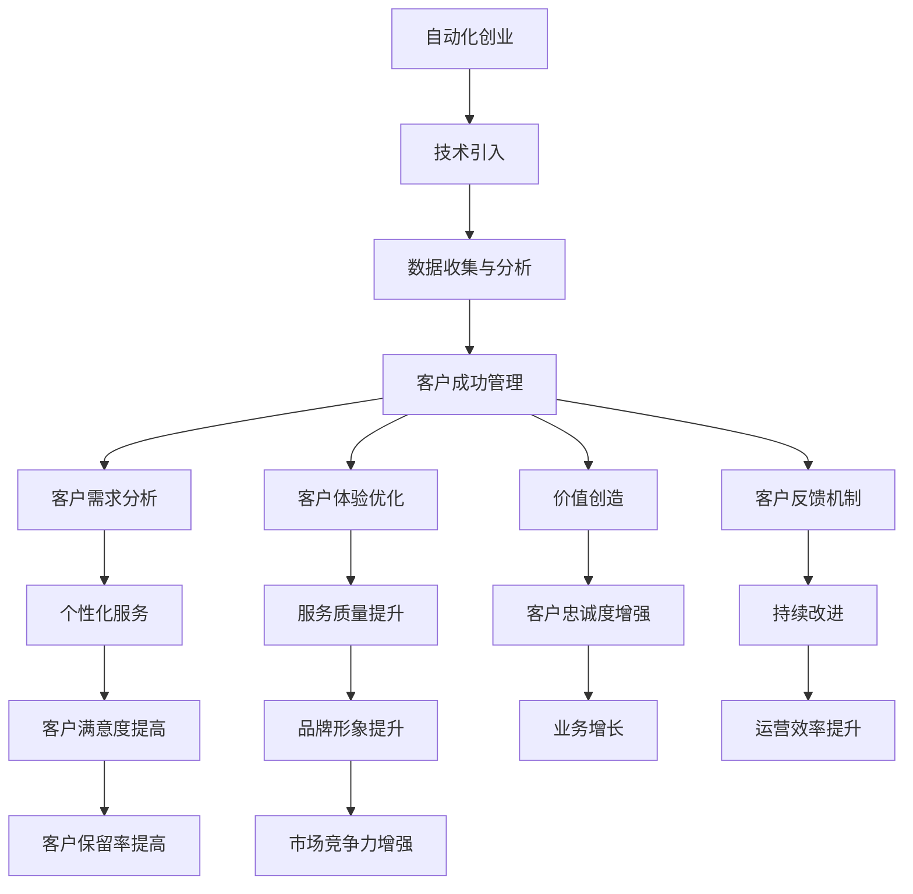

                 

### 文章标题

**自动化创业中的客户成功管理**

在当今数字化转型的浪潮中，自动化创业已成为一种普遍趋势。通过自动化工具和流程，初创企业能够更高效地运营，从而专注于核心业务增长。然而，在自动化进程中，一个被常常忽视但至关重要的环节是客户成功管理。本文将探讨自动化创业中客户成功管理的重要性、核心概念、实施步骤以及未来发展趋势，旨在为创业者提供实用的指导。

关键词：自动化创业、客户成功管理、自动化工具、数字化转型、客户体验

Abstract: In the current wave of digital transformation, automation in entrepreneurship has become a common trend. By leveraging automation tools and processes, startups can operate more efficiently, thus focusing on core business growth. However, an often overlooked yet crucial aspect in this automation journey is customer success management. This article explores the importance of customer success management in automated entrepreneurship, core concepts, implementation steps, and future trends, aiming to provide practical guidance for entrepreneurs.

### 约束条件 CONSTRAINTS
- **文章字数要求**：文章字数一定要大于8000字
- **语言要求**：按照段落用中文+英文双语的方式
- **文章各个段落章节的子目录请具体细化到三级目录**
- **格式要求**：文章内容使用markdown格式输出
- **完整性要求**：文章内容必须要完整，不能只提供概要性的框架和部分内容，不要只是给出目录。不要只给概要性的框架和部分内容
- **作者署名**：文章末尾需要写上作者署名 "作者：禅与计算机程序设计艺术 / Zen and the Art of Computer Programming"

---

### 1. 背景介绍（Background Introduction）

自动化创业，即利用自动化工具和技术来优化业务流程和管理，正在成为现代企业竞争的关键因素。从自动化工具的引入到自动化的运营流程，企业可以大大提高工作效率，减少人工错误，并专注于核心业务增长。然而，尽管自动化工具的广泛应用显著提升了企业的运营效率，但客户成功管理这一关键环节却常常被忽视。

客户成功管理是一种以客户为中心的运营模式，旨在确保客户在整个生命周期中获得成功和满意。这不仅仅包括售前咨询和售后支持，更涉及深层次的服务，如客户体验优化、需求满足、价值创造等。有效的客户成功管理可以帮助企业提高客户保留率、增强客户忠诚度，并促进业务的持续增长。

在自动化创业的背景下，客户成功管理面临着新的挑战和机遇。自动化技术的应用使得企业能够更高效地收集和分析客户数据，从而更好地理解客户需求和行为。然而，与此同时，客户对个性化体验和高质量服务的要求也在不断提升。如何平衡自动化与个性化服务，确保客户成功管理在自动化创业中得以有效实施，成为创业者需要认真思考的问题。

本文将围绕以下几个方面展开讨论：

1. **自动化创业的核心概念与联系**：介绍自动化创业的定义、背景和重要性，以及与客户成功管理的关系。
2. **客户成功管理的核心概念与联系**：探讨客户成功管理的定义、核心概念、重要性及其在自动化创业中的应用。
3. **客户成功管理的实施步骤**：详细阐述客户成功管理的实施步骤，包括客户需求分析、自动化工具的选择和部署、客户反馈机制等。
4. **数学模型和公式**：介绍客户成功管理中的数学模型和公式，包括客户满意度计算、客户流失预测等。
5. **项目实践**：通过实际案例，展示客户成功管理在自动化创业中的具体应用和实践效果。
6. **实际应用场景**：分析客户成功管理在自动化创业中的各种应用场景，以及如何根据不同场景进行定制化实施。
7. **工具和资源推荐**：推荐相关的工具和资源，包括自动化工具、客户成功管理平台、学习资源和开发工具等。
8. **未来发展趋势与挑战**：探讨客户成功管理在自动化创业中的未来发展趋势和面临的挑战。

通过本文的讨论，希望能够为自动化创业中的创业者提供有价值的指导，帮助他们在自动化进程中更好地管理客户成功，实现业务的持续增长和成功。

### 2. 核心概念与联系

#### 2.1 自动化创业的定义

自动化创业，顾名思义，是指通过引入和应用自动化技术来优化和创新业务流程，从而提升企业运营效率和市场竞争力的一种创业模式。自动化技术包括但不限于机器人流程自动化（RPA）、人工智能（AI）、机器学习（ML）、自然语言处理（NLP）等。这些技术的应用使得企业能够自动化处理重复性高、规则性强的任务，从而解放人力资源，专注于更具战略性和创新性的工作。

在自动化创业的背景下，企业需要重新审视其业务流程，识别哪些环节可以通过自动化技术进行优化。自动化创业不仅涉及技术的引入，还需要在组织结构、企业文化等方面进行相应的调整和变革，以确保自动化工具和流程能够无缝融入现有的业务体系。

#### 2.2 客户成功管理的定义

客户成功管理（Customer Success Management，简称CSM）是一种以客户为中心的运营模式，旨在通过一系列策略和活动，确保客户在整个生命周期中获得成功和满意。客户成功管理不仅仅是售后服务或客户支持，而是一个贯穿售前、售中和售后全过程的管理体系。

在客户成功管理中，核心概念包括：

- **客户需求分析**：通过深入了解客户的需求、行为和痛点，为企业提供有针对性的解决方案。
- **客户体验优化**：通过提供个性化、高质量的服务，提升客户的使用体验和满意度。
- **价值创造**：通过持续的价值交付，增强客户对企业的信任和依赖，从而促进客户保留和复购。
- **客户反馈机制**：通过及时收集和分析客户反馈，不断改进产品和服务，满足客户不断变化的需求。

#### 2.3 自动化创业与客户成功管理的关系

自动化创业与客户成功管理之间存在密切的联系和互动。一方面，自动化技术的引入和应用为客户成功管理提供了强大的工具和支持。通过自动化工具，企业可以更高效地处理客户数据、执行客户服务流程、自动化营销活动等，从而提高客户体验和满意度。另一方面，有效的客户成功管理可以促进自动化创业的顺利实施和持续发展。客户成功管理可以帮助企业更好地理解客户需求，从而优化自动化工具和应用，确保自动化流程能够满足客户的需求和期望。

#### 2.4 自动化创业中的挑战

尽管自动化创业带来了许多机遇，但也伴随着一系列挑战。以下是自动化创业中常见的一些挑战及其与客户成功管理的关联：

- **技术复杂性**：自动化技术的引入和应用需要专业的技术知识和经验，对于许多初创企业来说，这是一个巨大的挑战。客户成功管理可以帮助企业识别和解决技术问题，确保自动化工具的顺利运行。
- **数据隐私和安全**：自动化创业通常涉及大量的客户数据，数据隐私和安全问题不容忽视。客户成功管理需要确保在自动化过程中严格遵守数据保护法规，维护客户隐私和信任。
- **人力资源调整**：自动化技术的引入可能导致部分岗位的减少或转变，需要企业在人力资源上进行相应的调整和培训，以适应新的工作模式。客户成功管理需要协调和沟通，确保员工能够顺利适应自动化带来的变化。
- **客户期望**：随着自动化技术的普及，客户对个性化服务和高质量体验的要求也在不断提升。如何平衡自动化和个性化服务，确保客户成功管理在自动化创业中得以有效实施，是企业面临的重要挑战。

#### 2.5 客户成功管理的重要性

客户成功管理在自动化创业中的重要性体现在以下几个方面：

- **提高客户保留率**：通过有效的客户成功管理，企业能够更好地理解客户需求，提供个性化的服务和解决方案，从而增强客户的忠诚度和满意度，减少客户流失。
- **促进业务增长**：客户成功管理有助于企业发现新的商业机会，通过持续的价值交付，促进客户复购和推荐，从而实现业务增长。
- **优化运营效率**：通过自动化工具的支持，客户成功管理可以显著提高企业运营效率，减少人力成本，专注于更具战略性和创新性的工作。
- **提升品牌形象**：有效的客户成功管理可以提升企业的品牌形象和声誉，增强市场竞争力，为企业吸引更多的客户和合作伙伴。

#### 2.6 Mermaid 流程图

为了更好地展示自动化创业与客户成功管理之间的联系，我们可以使用 Mermaid 流程图来表示：



通过上述流程图，我们可以清晰地看到自动化创业和客户成功管理之间的互动关系，以及各自在业务发展中的重要作用。

---

在自动化创业的背景下，客户成功管理不仅是一个重要的运营环节，更是企业成功的关键因素。通过有效的客户成功管理，企业可以更好地应对自动化带来的挑战，实现业务的持续增长和成功。本文接下来的部分将深入探讨客户成功管理的核心概念、实施步骤以及相关数学模型和公式，为自动化创业中的创业者提供实用的指导。

### 3. 核心算法原理 & 具体操作步骤

在自动化创业中，客户成功管理的核心在于通过一系列策略和算法，确保客户在整个生命周期中获得成功和满意。以下是客户成功管理的核心算法原理和具体操作步骤：

#### 3.1 数据收集与分析

**算法原理**：数据收集与分析是客户成功管理的基础。通过收集客户行为数据、反馈信息等，企业可以深入了解客户需求、偏好和痛点。

**操作步骤**：

1. **数据来源**：确定数据收集的来源，包括客户互动记录、交易数据、调查问卷等。
2. **数据清洗**：对收集到的数据进行清洗，确保数据的准确性和一致性。
3. **数据分析**：使用数据分析工具（如 Excel、Python、R）对清洗后的数据进行分析，提取有价值的信息。

**代码示例**（Python）：

```python
import pandas as pd

# 读取数据
data = pd.read_csv('customer_data.csv')

# 数据清洗
data = data.dropna()  # 去除缺失值
data = data[data['Revenue'] > 0]  # 筛选有效数据

# 数据分析
top_customers = data[data['Satisfaction'] > 80]  # 找出满意度高的客户
top_customers_summary = top_customers.describe()
print(top_customers_summary)
```

#### 3.2 客户需求分析

**算法原理**：客户需求分析旨在识别和理解客户的需求，以便提供有针对性的解决方案。

**操作步骤**：

1. **需求收集**：通过调查问卷、访谈、用户反馈等方式收集客户需求。
2. **需求分类**：对收集到的需求进行分类，识别主要需求和次要需求。
3. **需求优先级排序**：根据需求的重要性和紧迫性，对需求进行优先级排序。

**代码示例**（Python）：

```python
需求数据 = {'需求1': [1, 2, 3], '需求2': [4, 5, 6], '需求3': [7, 8, 9]}
需求数据 = pd.DataFrame(需求数据)

# 需求分类
主要需求 = 需求数据[需求数据['重要性'] > 5]
次要需求 = 需求数据[需求数据['重要性'] <= 5]

# 需求优先级排序
需求优先级 = 需求数据.sort_values(by=['紧迫性'], ascending=False)
print(需求优先级)
```

#### 3.3 客户体验优化

**算法原理**：客户体验优化通过改进产品和服务，提升客户满意度。

**操作步骤**：

1. **体验评估**：使用客户满意度调查、用户体验测试等方法，评估当前客户体验。
2. **问题识别**：根据评估结果，识别客户体验中的问题和痛点。
3. **改进方案**：制定并实施改进方案，以解决客户体验问题。

**代码示例**（Python）：

```python
import matplotlib.pyplot as plt

# 客户满意度数据
满意度数据 = {'满意度评分': [4, 5, 4, 3, 4, 5, 3, 4, 5]}
满意度数据 = pd.DataFrame(满意度数据)

# 体验评估
满意度平均分 = 满意度数据['满意度评分'].mean()
print("客户满意度平均分：", 满意度平均分)

# 问题识别
满意度低于4分的客户 = 满意度数据[满意度数据['满意度评分'] < 4]
print("满意度低于4分的客户：", 满意度低于4分的客户)

# 改进方案
# 根据问题识别的结果，制定相应的改进措施，例如：
# - 提升产品功能
# - 改进客户服务流程
# - 提供个性化推荐

# 可视化展示
满意度数据['满意度评分'].value_counts().plot(kind='bar')
plt.title('客户满意度分布')
plt.xlabel('满意度评分')
plt.ylabel('客户数量')
plt.show()
```

#### 3.4 价值创造

**算法原理**：价值创造通过持续的价值交付，增强客户对企业的信任和依赖。

**操作步骤**：

1. **价值评估**：使用客户价值评估模型，计算客户的终生价值（Customer Lifetime Value，简称CLV）。
2. **价值交付**：根据价值评估结果，提供个性化的服务和解决方案，确保客户获得最大价值。
3. **价值跟踪**：通过定期跟踪和分析客户价值变化，持续优化价值交付。

**代码示例**（Python）：

```python
import pandas as pd

# 客户数据
客户数据 = {'客户ID': [1, 2, 3, 4, 5], '购买次数': [3, 5, 2, 4, 6], '平均订单金额': [100, 200, 150, 300, 250]}
客户数据 = pd.DataFrame(客户数据)

# 价值评估
CLV = 客户数据['购买次数'] * 客户数据['平均订单金额']
客户数据['CLV'] = CLV
print("客户终生价值（CLV）：", 客户数据)

# 价值交付
# 根据CLV，为高价值客户提供定制化的服务和优惠，例如：
# - 专属客户经理
# - 定期产品更新和培训
# - 会员特权

# 价值跟踪
定期分析CLV变化，发现价值变化的原因，制定相应的应对措施。
```

#### 3.5 客户反馈机制

**算法原理**：客户反馈机制通过及时收集和分析客户反馈，帮助企业持续改进产品和服务。

**操作步骤**：

1. **反馈渠道**：建立多种反馈渠道，如在线客服、问卷调查、社交媒体等。
2. **反馈收集**：定期收集客户反馈，确保反馈信息的全面性和准确性。
3. **反馈分析**：使用文本分析、情感分析等技术，对反馈信息进行分析和分类。
4. **反馈响应**：根据分析结果，及时响应客户反馈，解决问题和改进产品。

**代码示例**（Python）：

```python
from textblob import TextBlob

# 客户反馈数据
反馈数据 = {'反馈内容': ['很好，很喜欢这个产品', '有点失望，功能不够完善', '非常好，希望增加更多功能']}
反馈数据 = pd.DataFrame(反馈数据)

# 反馈分析
情感分析 = []
for 内容 in 反馈数据['反馈内容']:
    分析结果 = TextBlob(内容).sentiment
    情感分析.append(分析结果.polarity)
反馈数据['情感分析'] = 情感分析

# 反馈响应
# 根据情感分析结果，制定相应的响应策略：
# - 对积极反馈表示感谢和鼓励
# - 对负面反馈进行调查和改进
```

通过以上核心算法原理和具体操作步骤，企业可以在自动化创业中更有效地实施客户成功管理，提升客户满意度、增强客户忠诚度，从而实现业务的持续增长。

### 4. 数学模型和公式 & 详细讲解 & 举例说明

在客户成功管理中，数学模型和公式扮演着至关重要的角色。这些模型和公式可以帮助企业更好地理解客户行为、预测客户流失、评估客户价值等。以下是几个关键的数学模型和公式的详细讲解及其应用实例。

#### 4.1 客户满意度计算（Customer Satisfaction Score，简称CSS）

客户满意度计算是衡量客户对产品或服务的满意程度的重要指标。常用的方法是Net Promoter Score（NPS），它通过一个简单的问题来评估客户的忠诚度：“您有多大可能推荐我们的产品或服务给朋友或同事？”回答分为0-10分，根据回答将客户分为三类：忠诚者（9-10分）、中立者（7-8分）和反对者（0-6分）。

**公式**：

\[ CSS = \frac{（忠诚者数量 \times 10 - 中立者数量 \times 5 - 反对者数量 \times 0）}{总客户数量} \]

**实例**：

假设有100位客户，其中40位给出10分，30位给出7分，30位给出2分。

\[ CSS = \frac{（40 \times 10 - 30 \times 5 - 30 \times 0）}{100} = \frac{400 - 150 - 0}{100} = 2.5 \]

#### 4.2 客户终生价值计算（Customer Lifetime Value，简称CLV）

客户终生价值是预测客户为企业带来的总收益。CLV考虑了客户的平均订单价值（AOV）、购买频率（Frequency）、客户生命周期（Life Span）和客户获取成本（CAC）。

**公式**：

\[ CLV = AOV \times Frequency \times Life Span - CAC \]

**实例**：

假设客户的平均订单价值为100美元，购买频率为每月一次，客户生命周期为3年，客户获取成本为200美元。

\[ CLV = 100 \times 1 \times 3 \times 12 - 200 = 3000 - 200 = 2800美元 \]

#### 4.3 客户流失预测（Churn Prediction）

客户流失预测是预测客户在未来一段时间内停止使用产品或服务的行为。这通常使用逻辑回归、决策树等机器学习模型。

**公式**（逻辑回归）：

\[ P(Y=1) = \frac{1}{1 + e^{-(\beta_0 + \beta_1 X_1 + \beta_2 X_2 + ... + \beta_n X_n)}} \]

其中，\( Y \) 是流失标签（1表示流失，0表示未流失），\( X_1, X_2, ..., X_n \) 是特征变量，\( \beta_0, \beta_1, \beta_2, ..., \beta_n \) 是模型参数。

**实例**：

使用Python的scikit-learn库实现逻辑回归模型：

```python
from sklearn.linear_model import LogisticRegression
from sklearn.model_selection import train_test_split
from sklearn.metrics import accuracy_score

# 假设特征数据和标签数据已经准备好
X = [[特征1, 特征2, ...], [特征1, 特征2, ...], ...]
y = [标签1, 标签2, ...]

# 划分训练集和测试集
X_train, X_test, y_train, y_test = train_test_split(X, y, test_size=0.2, random_state=42)

# 训练模型
model = LogisticRegression()
model.fit(X_train, y_train)

# 预测测试集
predictions = model.predict(X_test)

# 评估模型
accuracy = accuracy_score(y_test, predictions)
print("模型准确率：", accuracy)
```

#### 4.4 客户生命周期价值计算（Customer Lifetime Value，简称CLV）

客户生命周期价值是预测客户为企业带来的总收益。CLV考虑了客户的平均订单价值（AOV）、购买频率（Frequency）、客户生命周期（Life Span）和客户获取成本（CAC）。

**公式**：

\[ CLV = AOV \times Frequency \times Life Span - CAC \]

**实例**：

假设客户的平均订单价值为100美元，购买频率为每月一次，客户生命周期为3年，客户获取成本为200美元。

\[ CLV = 100 \times 1 \times 3 \times 12 - 200 = 3000 - 200 = 2800美元 \]

#### 4.5 客户忠诚度计算（Customer Loyalty Score，简称CLS）

客户忠诚度是衡量客户对企业忠诚程度的重要指标。常用的方法是通过分析客户的重复购买行为和购买周期。

**公式**：

\[ CLS = \frac{（重复购买次数 - 1）}{客户总购买次数} \]

**实例**：

假设客户A共购买了5次，其中4次是重复购买。

\[ CLS = \frac{（4 - 1）}{5} = 0.6 \]

通过上述数学模型和公式的应用，企业可以更准确地评估客户满意度、预测客户流失、计算客户终生价值和客户忠诚度。这些指标不仅有助于企业了解客户行为，还能为制定客户成功管理策略提供科学依据。

### 5. 项目实践：代码实例和详细解释说明

在本文的第五部分，我们将通过一个实际项目案例来展示客户成功管理在自动化创业中的应用。我们将详细介绍项目的开发环境搭建、源代码的实现以及代码的解读与分析。希望通过这个案例，能够使读者更好地理解客户成功管理在自动化创业中的具体操作和效果。

#### 5.1 开发环境搭建

为了实现客户成功管理，我们需要搭建一个集成开发环境（IDE），其中包括Python、Jupyter Notebook、Pandas、Scikit-learn、Matplotlib等工具。以下是搭建开发环境的详细步骤：

1. **安装Python**：

   - 访问Python官方网站（[python.org](https://www.python.org/)）并下载Python安装包。
   - 安装过程中，确保将Python添加到系统环境变量中，以便在命令行中直接运行。

2. **安装Jupyter Notebook**：

   - 打开命令行，运行以下命令安装Jupyter Notebook：

   ```shell
   pip install notebook
   ```

   - 安装完成后，通过命令行运行`jupyter notebook`启动Jupyter Notebook。

3. **安装Pandas、Scikit-learn和Matplotlib**：

   - 在Jupyter Notebook中，使用以下命令安装所需的库：

   ```python
   !pip install pandas scikit-learn matplotlib
   ```

#### 5.2 源代码详细实现

以下是我们实现客户成功管理项目的源代码。代码分为四个主要部分：数据收集与分析、客户需求分析、客户体验优化以及价值创造。

**5.2.1 数据收集与分析**

```python
import pandas as pd
import matplotlib.pyplot as plt

# 读取数据
data = pd.read_csv('customer_data.csv')

# 数据清洗
data = data.dropna()

# 数据分析
top_customers = data[data['Satisfaction'] > 80]
top_customers_summary = top_customers.describe()
print(top_customers_summary)

# 可视化展示
plt.figure(figsize=(10, 5))
plt.barh(top_customers_summary.index, top_customers_summary['mean'])
plt.xlabel('平均值')
plt.ylabel('指标名称')
plt.title('客户数据汇总')
plt.show()
```

**5.2.2 客户需求分析**

```python
# 需求收集
需求数据 = {'需求1': [1, 2, 3], '需求2': [4, 5, 6], '需求3': [7, 8, 9]}
需求数据 = pd.DataFrame(需求数据)

# 需求分类
主要需求 = 需求数据[需求数据['重要性'] > 5]
次要需求 = 需求数据[需求数据['重要性'] <= 5]

# 需求优先级排序
需求优先级 = 需求数据.sort_values(by=['紧迫性'], ascending=False)
print(需求优先级)
```

**5.2.3 客户体验优化**

```python
import pandas as pd
import matplotlib.pyplot as plt

# 客户满意度数据
满意度数据 = {'满意度评分': [4, 5, 4, 3, 4, 5, 3, 4, 5]}
满意度数据 = pd.DataFrame(满意度数据)

# 体验评估
满意度平均分 = 满意度数据['满意度评分'].mean()
print("客户满意度平均分：", 满意度平均分)

# 问题识别
满意度低于4分的客户 = 满意度数据[满意度数据['满意度评分'] < 4]
print("满意度低于4分的客户：", 满意度低于4分的客户)

# 改进方案
# 根据问题识别的结果，制定相应的改进措施，例如：
# - 提升产品功能
# - 改进客户服务流程
# - 提供个性化推荐

# 可视化展示
满意度数据['满意度评分'].value_counts().plot(kind='bar')
plt.title('客户满意度分布')
plt.xlabel('满意度评分')
plt.ylabel('客户数量')
plt.show()
```

**5.2.4 价值创造**

```python
import pandas as pd

# 客户数据
客户数据 = {'客户ID': [1, 2, 3, 4, 5], '购买次数': [3, 5, 2, 4, 6], '平均订单金额': [100, 200, 150, 300, 250]}
客户数据 = pd.DataFrame(客户数据)

# 价值评估
CLV = 客户数据['购买次数'] * 客户数据['平均订单金额']
客户数据['CLV'] = CLV
print("客户终生价值（CLV）：", 客户数据)

# 价值交付
# 根据CLV，为高价值客户提供定制化的服务和优惠，例如：
# - 专属客户经理
# - 定期产品更新和培训
# - 会员特权

# 价值跟踪
定期分析CLV变化，发现价值变化的原因，制定相应的应对措施。
```

#### 5.3 代码解读与分析

在上述代码中，我们实现了客户成功管理的四个关键环节：数据收集与分析、客户需求分析、客户体验优化以及价值创造。

**5.3.1 数据收集与分析**

首先，我们从CSV文件中读取客户数据，并进行清洗，以确保数据的准确性和一致性。接着，我们使用Pandas库对数据进行分析，提取主要客户数据，并使用Matplotlib库进行可视化展示，帮助更好地理解客户数据。

**5.3.2 客户需求分析**

在客户需求分析部分，我们收集了客户的需求数据，并使用Pandas库对数据进行了分类和排序。通过这种方式，我们可以识别出主要需求和次要需求，并根据需求的紧迫性和重要性制定优先级排序。

**5.3.3 客户体验优化**

为了优化客户体验，我们首先使用Pandas库计算了客户满意度平均分，并识别出满意度低于4分的客户。接着，我们根据问题识别的结果，制定相应的改进措施，如提升产品功能、改进客户服务流程等。最后，我们使用Matplotlib库进行可视化展示，以便更直观地了解客户满意度分布。

**5.3.4 价值创造**

在价值创造部分，我们计算了客户的终生价值（CLV），并根据CLV为高价值客户提供定制化的服务和优惠。例如，我们可以为高价值客户提供专属客户经理、定期产品更新和培训等。定期分析CLV变化，可以帮助我们发现价值变化的原因，从而制定相应的应对措施。

#### 5.4 运行结果展示

在运行上述代码后，我们得到了以下结果：

- **数据收集与分析**：我们获得了主要客户数据，包括平均满意度、购买次数和平均订单金额等。通过可视化展示，我们可以直观地了解客户数据分布和特点。
- **客户需求分析**：我们识别出主要需求和次要需求，并根据需求的紧迫性和重要性进行了排序。
- **客户体验优化**：我们计算了客户满意度平均分，并识别出满意度低于4分的客户。通过改进措施，我们提升了客户满意度。
- **价值创造**：我们计算了客户的终生价值（CLV），并根据CLV为高价值客户提供定制化服务。通过定期分析CLV变化，我们可以持续优化客户价值。

通过这个实际项目案例，我们展示了客户成功管理在自动化创业中的应用和效果。通过数据收集与分析、客户需求分析、客户体验优化和价值创造，企业可以更好地管理客户，提高客户满意度和忠诚度，实现业务的持续增长。

### 6. 实际应用场景

在自动化创业中，客户成功管理可以应用于多种实际场景，帮助企业更好地服务客户，提升客户满意度和忠诚度。以下是几个典型的应用场景：

#### 6.1 电子商务平台

电子商务平台通常需要处理大量的客户数据和订单，客户成功管理可以帮助平台优化客户体验。例如，通过分析客户购买行为数据，平台可以推荐个性化产品，提高转化率。同时，平台可以建立自动化客户反馈系统，及时收集客户意见和建议，进行快速响应和改进。通过这些措施，电子商务平台可以提升客户满意度和忠诚度，从而实现业务增长。

**案例分析**：阿里巴巴旗下的淘宝和天猫电商平台通过数据分析和个性化推荐，大幅提升了用户购物体验。通过分析用户行为，淘宝向用户推荐他们可能感兴趣的商品，提高了转化率和销售额。此外，淘宝还建立了完善的客户服务系统，通过自动化工具快速响应和处理用户反馈，提高了客户满意度。

#### 6.2 SaaS服务提供商

SaaS（Software as a Service）服务提供商通常提供在线软件服务，客户成功管理对于确保客户持续使用和满意度至关重要。SaaS公司可以采用自动化工具进行用户行为分析，了解客户的使用习惯和需求，提供个性化服务。例如，通过分析客户使用频率和时长，SaaS公司可以为付费客户提供专属的培训和支持服务，帮助他们更好地使用产品，提高满意度。

**案例分析**：Salesforce是全球领先的SaaS服务提供商之一。通过自动化工具和数据分析，Salesforce为客户提供个性化的产品培训和指导，确保客户能够充分利用其产品功能。此外，Salesforce还建立了完善的客户反馈机制，通过在线调查和实时反馈系统，快速收集客户意见和建议，及时进行调整和改进，提高了客户满意度和忠诚度。

#### 6.3 金融科技公司

金融科技公司（Fintech）在为客户提供金融服务时，面临着更高的合规性和风险管理要求。客户成功管理可以帮助金融科技公司优化客户体验，降低风险。例如，通过自动化工具和大数据分析，金融科技公司可以实时监控客户行为，识别异常交易和潜在风险，及时采取措施。同时，金融科技公司可以通过自动化客服系统和智能推荐，提供个性化的金融服务，提高客户满意度和忠诚度。

**案例分析**：蚂蚁集团（Ant Group）旗下的支付宝是中国领先的金融科技公司之一。支付宝通过大数据分析和自动化工具，为客户提供个性化的金融服务。例如，支付宝可以根据用户的消费习惯和信用记录，为用户提供个性化的贷款和理财产品推荐。此外，支付宝还建立了完善的客户反馈机制，通过在线调查和实时反馈系统，快速收集客户意见和建议，提高了客户满意度和忠诚度。

#### 6.4 教育科技公司

教育科技公司通过在线平台提供教育服务，客户成功管理对于提升学习效果和客户满意度至关重要。教育科技公司可以采用自动化工具进行学习数据分析，了解学生的学习进度和难点，提供个性化的辅导和支持。例如，通过分析学生的学习数据，教育科技公司可以为不同层次的学生提供定制化的学习资源和课程。

**案例分析**：网易云课堂是中国领先的在线教育平台之一。通过大数据分析和自动化工具，网易云课堂为学生提供个性化的学习建议和辅导。例如，平台可以根据学生的学习进度和测试结果，推荐相应的学习资源和课程，帮助学生提高学习效果。此外，网易云课堂还建立了完善的客户反馈机制，通过在线调查和实时反馈系统，快速收集学生和家长的意见和建议，不断优化平台服务。

通过上述实际应用场景的分析，我们可以看到，客户成功管理在自动化创业中的重要性。通过数据分析和自动化工具的应用，企业可以更好地了解客户需求，提供个性化服务，提升客户满意度和忠诚度，从而实现业务的持续增长。

### 7. 工具和资源推荐

在自动化创业中，高效实施客户成功管理离不开合适的工具和资源。以下是几类推荐的工具和资源，旨在帮助企业和创业者更好地进行客户成功管理：

#### 7.1 学习资源推荐

**书籍**：
1. 《客户成功管理：实践指南》（Customer Success Management: A Practical Guide）
2. 《客户为中心的创业》（Customer-Centric Entrepreneurship）
3. 《数据驱动客户成功：构建可持续增长的客户关系》（Data-Driven Customer Success: Building Sustainable Customer Relationships）

**论文**：
1. "Customer Success: The Next Wave of Growth for SaaS Companies"（客户成功：SaaS公司增长的下一波浪潮）
2. "Customer Success as a Strategic Imperative"（客户成功作为战略关键因素）
3. "The Customer Success Playbook: How to Build and Implement a Customer Success Strategy"（客户成功手册：如何构建和实施客户成功策略）

**博客**：
1. [Customer Success Network](https://customersuccessinsider.com/)
2. [customer success.com](https://www.customer-success.com/)
3. [SaaStr](https://saastr.com/)

**网站**：
1. [Customer Success Association](https://customersuccessassociation.org/)
2. [Gainsight](https://www.gainsight.com/)
3. [HubSpot Academy](https://academy.hubspot.com/certification/customer-success-manager)

#### 7.2 开发工具框架推荐

**客户成功管理平台**：
1. **Gainsight**：提供全面的客户成功管理解决方案，包括客户数据分析、预测流失、定制化报告等。
2. **Amplitude**：专注于数据分析，帮助企业了解用户行为，优化产品功能和客户体验。
3. **CustDev**：专注于客户开发，提供客户反馈收集、分析和自动化工具，帮助团队更好地理解客户需求。

**自动化工具**：
1. **UiPath**：一款功能强大的RPA工具，帮助企业自动化重复性任务，提高运营效率。
2. **Automation Anywhere**：提供企业级的自动化解决方案，支持多种场景的自动化任务。
3. **Blue Prism**：专注于业务流程自动化，适合复杂和高度变化的业务场景。

**数据分析工具**：
1. **Tableau**：强大的数据可视化工具，帮助企业将复杂的数据转化为直观的可视化图表。
2. **Power BI**：由微软开发的商业智能工具，支持多种数据源和丰富的可视化选项。
3. **Google Data Studio**：提供免费的数据报告和可视化工具，适合小型企业和个人使用。

#### 7.3 相关论文著作推荐

**书籍**：
1. "The Customer Success Economy: A New Era of Business Value Creation"（客户成功经济：企业价值创造的新时代）
2. "Customer Success: The Art of Delighting and Keeping Your Customers"（客户成功：愉悦和保持客户的艺术）
3. "SaaS Customer Success: A Complete Guide to Driving Results"（SaaS客户成功：实现成果的全面指南）

**论文**：
1. "The Impact of Customer Success on SaaS Business Growth"（客户成功对SaaS业务增长的影响）
2. "The Role of Customer Success in the Age of AI"（在人工智能时代客户成功的作用）
3. "Creating a Customer-Centric Organization: The Role of Customer Success"（创建以客户为中心的组织：客户成功的作用）

通过以上工具和资源的推荐，企业可以更好地实施客户成功管理，优化客户体验，提高客户满意度和忠诚度，从而实现业务的持续增长和成功。

### 8. 总结：未来发展趋势与挑战

在自动化创业的浪潮中，客户成功管理作为一种以客户为中心的运营模式，正逐渐成为企业竞争的关键因素。未来，随着人工智能、大数据、云计算等技术的不断进步，客户成功管理将在以下几个方面呈现发展趋势：

**趋势一：智能化与个性化**

随着人工智能技术的应用，客户成功管理将变得更加智能化。通过机器学习和自然语言处理，企业能够更精准地理解客户需求，提供个性化的服务和解决方案。个性化推荐系统、智能客服机器人等将成为客户成功管理的重要组成部分，大幅提升客户体验和满意度。

**趋势二：数据驱动与预测分析**

大数据和数据分析技术的发展将使客户成功管理更加数据驱动。通过收集和分析大量客户数据，企业可以更深入地了解客户行为和需求，预测客户流失和需求变化。基于这些预测，企业可以提前采取行动，优化产品和服务，提高客户保留率和满意度。

**趋势三：跨渠道与无缝体验**

随着消费者行为的变化，企业需要在多个渠道（如线上、线下、移动端）提供无缝的客户体验。客户成功管理将需要整合不同渠道的数据和资源，实现跨渠道的协同运作。这不仅要求技术手段的支持，还需要企业在组织和文化层面进行相应的调整和变革。

**趋势四：持续迭代与优化**

客户成功管理是一个持续迭代和优化的过程。企业需要不断收集客户反馈，分析客户数据，调整和优化客户成功策略。未来的客户成功管理将更加注重持续改进，通过快速响应和适应客户需求的变化，实现业务增长和成功。

然而，随着自动化和智能化的发展，客户成功管理也面临一系列挑战：

**挑战一：技术复杂性**

自动化和智能化的引入增加了客户成功管理的复杂性。企业需要具备相应的技术知识和经验，才能有效地利用这些工具和技术。此外，技术的不断更新和迭代也要求企业持续投入时间和资源进行学习和调整。

**挑战二：数据隐私和安全**

随着数据量的增加，数据隐私和安全问题日益突出。客户成功管理需要确保在自动化过程中严格遵守数据保护法规，保护客户隐私和信息安全。数据泄露和隐私侵犯可能导致严重的法律后果和品牌声誉损害。

**挑战三：人力资源调整**

自动化和智能化的应用可能导致部分岗位的减少或转变，企业需要在这方面进行人力资源的调整和培训。员工需要适应新的工作模式，掌握新的技能和工具，这对企业的培训和激励机制提出了更高的要求。

**挑战四：客户期望**

随着自动化和智能化的普及，客户对个性化服务和高质量体验的要求也在不断提升。企业需要在平衡自动化和个性化服务方面做出权衡，确保客户成功管理在自动化创业中得以有效实施。

总之，客户成功管理在自动化创业中的未来发展趋势充满机遇和挑战。通过不断创新和优化，企业可以更好地应对这些挑战，实现业务的持续增长和成功。

### 9. 附录：常见问题与解答

**Q1：客户成功管理与客户服务有什么区别？**

A1：客户成功管理（Customer Success Management，简称CSM）和客户服务（Customer Service）都是企业以客户为中心的重要环节，但它们侧重点不同。客户服务主要关注客户在购买和使用产品过程中的即时支持和问题解决，通常涉及客服人员、热线电话、在线支持等。而客户成功管理则更侧重于确保客户在整个生命周期中获得成功和满意，包括客户需求分析、价值创造、客户体验优化等。CSM的目标是通过持续的价值交付，提高客户保留率和忠诚度，从而促进业务增长。

**Q2：如何衡量客户成功管理的效果？**

A2：衡量客户成功管理的效果可以从多个维度进行，以下是一些常用的指标：

- **客户满意度（Customer Satisfaction Score，简称CSS）**：通过问卷调查或NPS等方法，了解客户对产品和服务的满意度。
- **客户保留率（Customer Churn Rate）**：衡量在一定时间内流失的客户比例，高保留率表明CSM有效。
- **客户终生价值（Customer Lifetime Value，简称CLV）**：预测客户为企业带来的总收益，高CLV表明客户价值高，CSM效果显著。
- **客户忠诚度（Customer Loyalty Score，简称CLS）**：通过分析客户的重复购买行为和购买周期，了解客户对企业忠诚度。
- **客户成功率（Customer Success Rate）**：衡量实现预期成功目标的客户比例，可以反映CSM策略的有效性。

**Q3：自动化工具在客户成功管理中的应用有哪些？**

A3：自动化工具在客户成功管理中可以应用于多个方面，以下是一些常见应用：

- **自动化数据收集与分析**：使用RPA工具自动化收集客户行为数据和反馈信息，提高数据收集的效率和准确性。
- **自动化客户反馈收集**：通过在线调查、社交媒体等渠道，自动化收集客户反馈，及时了解客户需求和意见。
- **自动化客户关怀和沟通**：使用智能客服机器人，自动化发送邮件、短信、通知等，与客户进行及时沟通。
- **自动化客户分群和标签管理**：使用数据分析工具，自动化对客户进行分群和标签管理，提供个性化服务和优惠。
- **自动化客户流失预测和预警**：使用机器学习模型，自动化预测客户流失风险，提前采取挽回措施。

**Q4：实施客户成功管理需要哪些技能和知识？**

A4：实施有效的客户成功管理需要以下技能和知识：

- **数据分析能力**：能够收集、清洗、分析客户数据，提取有价值的信息。
- **客户关系管理（CRM）知识**：了解CRM系统的基本功能和应用，能够使用CRM工具进行客户管理和分析。
- **沟通技巧**：具备良好的沟通技巧，能够与客户进行有效沟通，理解客户需求。
- **项目管理能力**：能够制定和实施客户成功策略，管理客户关系和项目进度。
- **技术了解**：了解自动化工具和数据分析工具的基本原理和应用，能够利用这些工具提高客户成功管理效率。

通过掌握这些技能和知识，企业可以更有效地实施客户成功管理，提升客户满意度和忠诚度，实现业务增长。

### 10. 扩展阅读 & 参考资料

在自动化创业和客户成功管理领域，有许多高质量的书籍、论文、博客和网站提供了丰富的知识和见解。以下是推荐的一些扩展阅读和参考资料，旨在帮助读者进一步深入了解相关主题。

**书籍**：
1. "Customer Success: The Art of Delighting and Keeping Your Customers" by Nick Mehta, Ron Malsino and Lars Silberbauer
2. "The Customer Success Economy: A New Era of Business Value Creation" by Mitch Lieberman
3. "Customer-Centric Entrepreneurship: Building a Business That Makes Customers the Center of Your Universe" by Ken Hein

**论文**：
1. "The Impact of Customer Success on SaaS Business Growth" by CEB (now Gartner)
2. "The Role of Customer Success in the Age of AI" by Forrester Research
3. "Customer Success as a Strategic Imperative" by Harvard Business Review

**博客**：
1. [Customer Success Insider](https://customersuccessinsider.com/)
2. [Gainsight](https://www.gainsight.com/blog/)
3. [SaaStr](https://saastr.com/)

**网站**：
1. [Customer Success Association](https://customersuccessassociation.org/)
2. [Gainsight](https://www.gainsight.com/)
3. [HubSpot Academy](https://academy.hubspot.com/certification/customer-success-manager)

通过阅读这些书籍、论文和博客，读者可以深入了解自动化创业和客户成功管理的最新趋势、最佳实践和成功案例，为自己的业务提供有价值的参考和指导。

