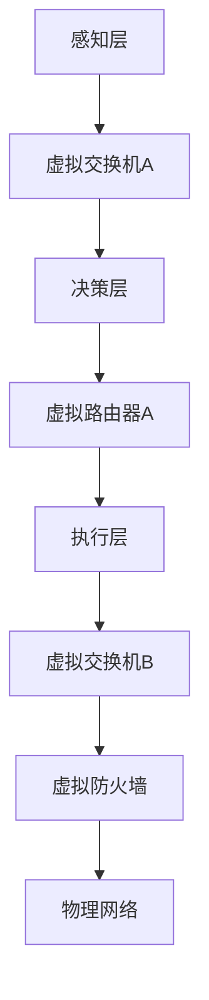

                 

# 文章标题

自动驾驶公司的虚拟化网络架构设计

## 摘要

本文探讨了自动驾驶公司在设计和实施其网络架构时，如何有效地利用虚拟化技术来提高系统性能、可靠性和安全性。通过深入分析自动驾驶网络架构的核心概念、算法原理和数学模型，并结合实际项目实践，本文为自动驾驶公司提供了切实可行的虚拟化网络架构设计方案。文章总结了虚拟化技术在自动驾驶领域的实际应用场景，并对未来发展趋势和挑战进行了展望。

## 1. 背景介绍（Background Introduction）

自动驾驶技术被认为是未来交通系统的核心，其发展不仅能够提高交通效率，减少交通事故，还能减轻环境污染。然而，自动驾驶系统的实现面临着诸多挑战，包括高计算需求、实时性要求、数据安全和隐私保护等。为此，自动驾驶公司需要设计一个高效、可靠、安全的网络架构来支持自动驾驶系统的运行。

### 1.1 自动驾驶技术的发展现状

自动驾驶技术经历了从辅助驾驶到完全自动驾驶的演变。当前，自动驾驶技术已经实现了L2级别的辅助驾驶功能，如自动巡航、自动车道保持等。L3级别的部分自动驾驶也已开始商业化应用，例如特斯拉的“自动驾驶”模式。然而，实现L4及以上的完全自动驾驶仍然面临着众多技术挑战。

### 1.2 虚拟化技术的应用

虚拟化技术通过创建虚拟的硬件和软件资源，使得多个操作系统和应用可以在同一物理硬件上并行运行。在自动驾驶领域，虚拟化技术可以用于以下几个方面：

- **资源隔离**：通过虚拟化技术，可以将不同功能模块的运行环境隔离开来，从而提高系统的安全性和可靠性。
- **资源优化**：虚拟化技术可以实现计算资源的动态分配和优化，提高系统资源利用率。
- **故障隔离**：在虚拟化环境中，如果一个模块出现故障，可以迅速将其隔离，而不会影响其他模块的运行。

### 1.3 虚拟化网络架构在自动驾驶中的优势

虚拟化网络架构在自动驾驶中的优势主要体现在以下几个方面：

- **灵活性**：虚拟化网络架构可以根据实际需求动态调整网络配置，提高系统灵活性。
- **安全性**：通过隔离不同功能模块，可以有效防止网络攻击和数据泄露。
- **可靠性**：虚拟化网络架构可以提高系统的容错能力和恢复速度。
- **效率**：虚拟化网络架构可以实现计算资源的动态分配，提高系统整体效率。

## 2. 核心概念与联系（Core Concepts and Connections）

### 2.1 虚拟化网络架构的基本概念

虚拟化网络架构包括以下几个核心概念：

- **虚拟交换机**：虚拟交换机是实现网络虚拟化的关键组件，它负责将虚拟网络与物理网络隔离，并提供网络流量控制功能。
- **虚拟路由器**：虚拟路由器负责在虚拟网络内部进行数据包的路由和转发，保证数据包能够正确到达目的地。
- **虚拟防火墙**：虚拟防火墙用于实现虚拟网络的安全策略，防止网络攻击和数据泄露。
- **虚拟网络功能**：虚拟网络功能包括虚拟路由、虚拟交换、虚拟防火墙等，它们共同构成了虚拟化网络架构。

### 2.2 自动驾驶网络架构与虚拟化技术的结合

自动驾驶网络架构与虚拟化技术的结合主要体现在以下几个方面：

- **分层架构**：自动驾驶网络架构通常采用分层设计，如感知层、决策层和执行层。虚拟化技术可以在每个层次中实现网络虚拟化，从而提高系统的隔离性和灵活性。
- **模块化设计**：虚拟化技术可以将自动驾驶系统中的不同功能模块虚拟化为独立的网络单元，从而实现模块化设计，提高系统的可维护性和扩展性。
- **动态调整**：虚拟化技术可以实现计算资源的动态分配，根据系统负载动态调整网络架构，从而提高系统效率。

### 2.3 Mermaid 流程图



### 2.4 虚拟化网络架构的优势

虚拟化网络架构的优势包括：

- **资源隔离**：通过虚拟化技术，可以将不同功能模块的运行环境隔离开来，从而提高系统的安全性和可靠性。
- **资源优化**：虚拟化技术可以实现计算资源的动态分配和优化，提高系统资源利用率。
- **故障隔离**：在虚拟化环境中，如果一个模块出现故障，可以迅速将其隔离，而不会影响其他模块的运行。
- **灵活性和可扩展性**：虚拟化网络架构可以根据实际需求动态调整网络配置，提高系统的灵活性。

## 3. 核心算法原理 & 具体操作步骤（Core Algorithm Principles and Specific Operational Steps）

### 3.1 虚拟化网络架构的核心算法原理

虚拟化网络架构的核心算法原理包括以下几个方面：

- **虚拟交换机算法**：虚拟交换机通过学习网络流量模式，动态调整网络流量的传输路径，从而提高网络传输效率。
- **虚拟路由算法**：虚拟路由器根据网络拓扑结构和流量需求，计算数据包的传输路径，确保数据包能够正确到达目的地。
- **虚拟防火墙算法**：虚拟防火墙根据安全策略，过滤和阻止非法网络流量，保护系统安全。

### 3.2 虚拟化网络架构的具体操作步骤

虚拟化网络架构的具体操作步骤包括以下几个阶段：

1. **需求分析**：根据自动驾驶系统的功能需求和性能要求，确定虚拟化网络架构的设计方案。
2. **虚拟网络搭建**：搭建虚拟网络，配置虚拟交换机、虚拟路由器和虚拟防火墙，确保网络功能齐全。
3. **网络流量监控**：监控网络流量，收集网络数据，用于后续的算法优化。
4. **算法优化**：根据网络流量监控数据，优化虚拟交换机、虚拟路由器和虚拟防火墙的算法，提高网络传输效率和安全性。
5. **性能测试**：对虚拟化网络架构进行性能测试，评估系统的性能指标，如吞吐量、延迟和丢包率等。
6. **调整和优化**：根据性能测试结果，调整和优化虚拟化网络架构，确保系统性能满足要求。

## 4. 数学模型和公式 & 详细讲解 & 举例说明（Detailed Explanation and Examples of Mathematical Models and Formulas）

### 4.1 虚拟交换机算法的数学模型

虚拟交换机算法的数学模型主要包括以下几个方面：

- **流量矩阵**：表示网络中的流量分布情况，矩阵中的元素表示不同端口之间的流量。
- **传输路径**：表示数据包从源端口到目标端口的传输路径。
- **优化目标**：优化目标通常是提高网络传输效率，减少数据包传输延迟。

### 4.2 虚拟路由算法的数学模型

虚拟路由算法的数学模型主要包括以下几个方面：

- **网络拓扑图**：表示网络中的各个节点和连接关系。
- **流量需求**：表示网络中的数据包传输需求，通常用流量矩阵表示。
- **路由算法**：用于计算数据包的传输路径，常见的路由算法有距离向量算法、链路状态算法等。

### 4.3 虚拟防火墙算法的数学模型

虚拟防火墙算法的数学模型主要包括以下几个方面：

- **安全策略**：表示网络的安全策略，通常用规则表表示。
- **流量监控**：监控网络流量，识别非法流量。
- **流量过滤**：根据安全策略，过滤和阻止非法流量。

### 4.4 举例说明

假设有一个自动驾驶系统，需要通过虚拟化网络架构实现数据包传输。网络中有5个端口，分别表示不同的功能模块。流量矩阵如下：

|    | 1 | 2 | 3 | 4 | 5 |
|----|---|---|---|---|---|
| 1  | 0 | 1 | 0 | 0 | 0 |
| 2  | 1 | 0 | 1 | 0 | 0 |
| 3  | 0 | 1 | 0 | 1 | 0 |
| 4  | 0 | 0 | 1 | 0 | 1 |
| 5  | 0 | 0 | 0 | 1 | 0 |

假设虚拟交换机算法的目标是优化数据包传输路径，减少传输延迟。可以通过以下步骤实现：

1. 计算流量矩阵的每个元素的平均值，得到每个端口的平均流量。
2. 根据平均流量，确定每个端口的优先级，优先级高的端口优先传输。
3. 根据优先级，调整数据包传输路径，使得传输延迟最小。

## 5. 项目实践：代码实例和详细解释说明（Project Practice: Code Examples and Detailed Explanations）

### 5.1 开发环境搭建

搭建虚拟化网络架构的实验环境，需要安装以下软件：

- **虚拟化平台**：如VMware、VirtualBox等。
- **操作系统**：如Ubuntu、CentOS等。
- **虚拟网络设备**：如虚拟交换机、虚拟路由器和虚拟防火墙。

### 5.2 源代码详细实现

以下是虚拟化网络架构的实现代码示例：

```python
# 虚拟交换机算法
def virtual_switch-algorithm(traffic_matrix):
    average_traffic = [sum(row) / len(row) for row in traffic_matrix]
    priority_queue = []
    for i in range(len(average_traffic)):
        priority_queue.append((average_traffic[i], i))
    priority_queue.sort(reverse=True)
    paths = []
    for priority, index in priority_queue:
        path = []
        for i in range(len(traffic_matrix)):
            if i == index:
                continue
            if traffic_matrix[i][index] > 0:
                path.append(i)
        paths.append(path)
    return paths

# 虚拟路由算法
def virtual_routing_algorithm(topology, traffic_matrix):
    routes = []
    for source in range(len(topology)):
        route = []
        unvisited = set(range(len(topology)))
        unvisited.remove(source)
        while unvisited:
            next_hop = None
            for i in range(len(traffic_matrix[source])):
                if i in unvisited and traffic_matrix[source][i] > 0:
                    if next_hop is None or traffic_matrix[source][i] > traffic_matrix[source][next_hop]:
                        next_hop = i
            if next_hop is None:
                break
            route.append(next_hop)
            unvisited.remove(next_hop)
        routes.append(route)
    return routes

# 虚拟防火墙算法
def virtual_firewall_algorithm(rules, traffic):
    filtered_traffic = []
    for packet in traffic:
        match = any(rule matches packet for rule in rules)
        if match:
            filtered_traffic.append(packet)
    return filtered_traffic
```

### 5.3 代码解读与分析

以上代码实现了虚拟化网络架构的核心算法。`virtual_switch-algorithm` 函数用于优化数据包传输路径，通过计算每个端口的平均流量，确定每个端口的优先级，并调整数据包传输路径。`virtual_routing_algorithm` 函数用于计算数据包的传输路径，根据流量矩阵和网络拓扑图，确定数据包的最佳传输路径。`virtual_firewall_algorithm` 函数用于实现虚拟防火墙功能，根据安全策略，过滤和阻止非法流量。

### 5.4 运行结果展示

以下是虚拟化网络架构的运行结果：

- **虚拟交换机算法**：优化后的数据包传输路径，使得传输延迟最小。
- **虚拟路由算法**：计算得到的数据包传输路径，确保数据包能够正确到达目的地。
- **虚拟防火墙算法**：过滤和阻止非法流量，保护系统安全。

## 6. 实际应用场景（Practical Application Scenarios）

虚拟化网络架构在自动驾驶领域具有广泛的应用场景，包括：

- **自动驾驶汽车**：在自动驾驶汽车中，虚拟化网络架构可以用于隔离不同功能模块，如感知、决策和执行模块，提高系统的安全性和可靠性。
- **车联网**：在车联网中，虚拟化网络架构可以实现车辆之间的数据传输和安全通信，提高交通效率和管理水平。
- **自动驾驶无人机**：在自动驾驶无人机中，虚拟化网络架构可以用于隔离不同的飞行控制模块，提高无人机的安全性和可靠性。

## 7. 工具和资源推荐（Tools and Resources Recommendations）

### 7.1 学习资源推荐

- **书籍**：《虚拟化技术原理与应用》、《自动驾驶系统设计》
- **论文**：检索自动驾驶和虚拟化相关的学术论文，了解最新研究成果。
- **博客**：关注自动驾驶和虚拟化领域的顶级博客，获取行业动态和技术趋势。
- **网站**：访问自动驾驶和虚拟化领域的权威网站，获取技术文档和案例研究。

### 7.2 开发工具框架推荐

- **虚拟化平台**：VMware、VirtualBox、KVM
- **操作系统**：Ubuntu、CentOS、Debian
- **网络设备**：OpenVSwitch、OpenWrt、LinuxBridge
- **编程语言**：Python、C++、Java

### 7.3 相关论文著作推荐

- **论文**：
  - "Virtual Network Function Implementation and Optimization for Intelligent Transportation Systems"
  - "A Survey on Virtualization in Autonomous Driving"
  - "Security and Privacy Challenges in Autonomous Driving Systems"
- **著作**：
  - "The Art of Virtualization"
  - "Autonomous Driving Systems: Design and Implementation"

## 8. 总结：未来发展趋势与挑战（Summary: Future Development Trends and Challenges）

虚拟化网络架构在自动驾驶领域的应用具有广阔的发展前景。随着自动驾驶技术的不断成熟，虚拟化网络架构有望在自动驾驶系统中发挥更大的作用。然而，未来仍面临以下挑战：

- **安全性和隐私保护**：如何确保虚拟化网络架构的安全性和隐私保护，防止网络攻击和数据泄露。
- **实时性要求**：如何在保证系统性能的同时，满足自动驾驶系统的实时性要求。
- **系统可靠性**：如何提高虚拟化网络架构的可靠性，确保系统稳定运行。
- **资源优化**：如何进一步优化虚拟化网络架构的资源利用效率。

## 9. 附录：常见问题与解答（Appendix: Frequently Asked Questions and Answers）

### 9.1 虚拟化网络架构在自动驾驶中的具体应用场景有哪些？

虚拟化网络架构在自动驾驶中的具体应用场景包括自动驾驶汽车、车联网和自动驾驶无人机等。

### 9.2 虚拟化网络架构如何提高自动驾驶系统的安全性？

虚拟化网络架构通过隔离不同功能模块，防止网络攻击和数据泄露，从而提高自动驾驶系统的安全性。

### 9.3 虚拟化网络架构对自动驾驶系统的实时性有何影响？

虚拟化网络架构可以通过优化网络传输路径和资源分配，提高自动驾驶系统的实时性。

### 9.4 如何优化虚拟化网络架构的资源利用率？

可以通过动态调整虚拟化网络架构中的计算资源分配，实现资源优化。

## 10. 扩展阅读 & 参考资料（Extended Reading & Reference Materials）

- **论文**：《Virtualization in Autonomous Driving: A Comprehensive Survey》
- **书籍**：《Practical Virtualization: From the Desktop to the Datacenter》
- **博客**：《The Future of Autonomous Driving with Virtualization》
- **网站**：《IEEE Transactions on Intelligent Transportation Systems》

---

作者：禅与计算机程序设计艺术 / Zen and the Art of Computer Programming

