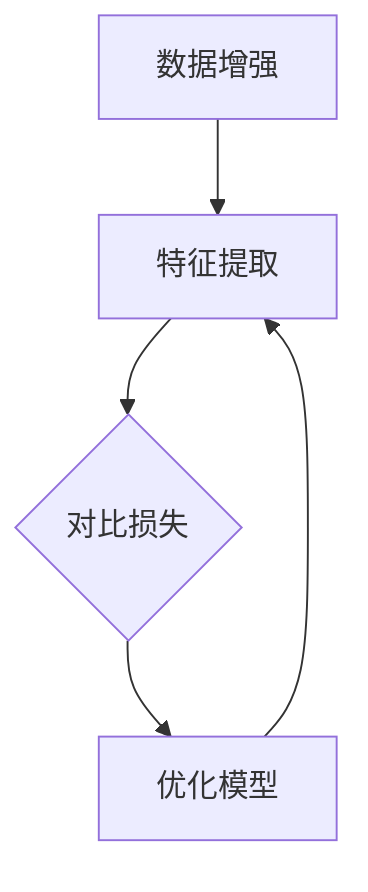
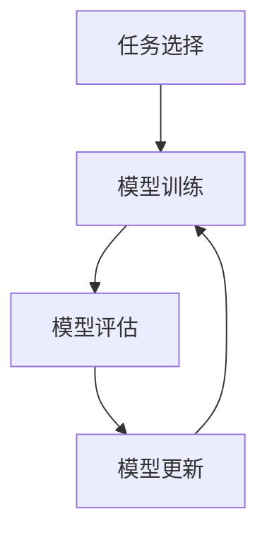

                 

# 自监督学习的理论创新：对比学习和元学习

## 摘要

本文旨在探讨自监督学习的两个关键理论创新——对比学习和元学习。首先，我们将回顾自监督学习的背景和重要性。接着，深入探讨对比学习的核心概念、技术细节和应用实例。然后，将分析元学习的理论基础、优势及其在自监督学习中的具体实现。最后，通过具体案例和代码实现，展示这两种技术如何在实际项目中发挥作用，并总结未来的发展趋势和挑战。

### 关键词
- 自监督学习
- 对比学习
- 元学习
- 理论创新
- 应用实例

## 1. 背景介绍（Background Introduction）

### 1.1 自监督学习的概念

自监督学习（Self-supervised Learning）是一种无需人工标注数据即可训练模型的方法。在自监督学习中，模型利用未标注的数据自动发现有用的信息，并通过这些信息进行学习。这种方法在数据标注成本高昂且获取困难的情况下，显得尤为重要。自监督学习的核心思想是将无监督学习问题转换为监督学习问题，从而利用现有的数据实现模型的训练。

### 1.2 自监督学习的重要性

自监督学习在许多领域都具有广泛的应用，如自然语言处理、计算机视觉、语音识别等。其重要性主要体现在以下几个方面：

1. **降低数据标注成本**：自监督学习不需要对大量数据进行人工标注，从而降低了数据处理的成本。
2. **利用未标注数据**：许多领域存在大量的未标注数据，自监督学习能够有效利用这些数据，提高模型的性能。
3. **增强模型泛化能力**：自监督学习通过学习数据的内在结构，有助于提高模型的泛化能力，使其在新的、未见过的数据上表现更佳。

### 1.3 自监督学习的挑战

尽管自监督学习具有许多优势，但其也面临一些挑战：

1. **信息利用不足**：自监督学习往往只能利用部分数据信息，导致模型性能受到限制。
2. **模型可解释性**：由于自监督学习过程中缺乏明确的标注信息，模型的可解释性成为一个亟待解决的问题。
3. **数据分布差异**：自监督学习中的数据分布可能与实际应用场景中的数据分布存在差异，这可能导致模型在实际应用中的表现不佳。

## 2. 核心概念与联系（Core Concepts and Connections）

### 2.1 对比学习（Contrastive Learning）

#### 2.1.1 概念

对比学习（Contrastive Learning）是一种自监督学习方法，通过优化正负样本之间的对比度来实现模型训练。其核心思想是学习数据之间的相似性和差异性，从而提取数据的有效特征。

#### 2.1.2 原理

对比学习的原理可以概括为以下步骤：

1. **数据增强**：通过对原始数据进行增强，生成大量的正负样本对。
2. **特征提取**：使用神经网络提取样本的特征表示。
3. **对比损失**：通过对比损失函数来优化模型，使得正样本对的特征表示接近，而负样本对的特征表示远离。
4. **优化模型**：通过迭代优化过程，逐步调整模型参数，使其在特征表示上更好地区分正负样本。

#### 2.1.3 架构

对比学习的基本架构通常包括以下几个部分：

1. **编码器**：用于提取输入数据的特征表示。
2. **对比损失函数**：如信息性损失（InfoNCE）、对比损失（Contrastive Loss）等。
3. **优化器**：用于调整模型参数，优化模型性能。

#### 2.1.4 Mermaid 流程图



### 2.2 元学习（Meta-Learning）

#### 2.2.1 概念

元学习（Meta-Learning）是一种学习如何学习的方法，旨在提高模型在不同任务上的学习速度和泛化能力。元学习通过在多个任务上训练模型，使模型能够在新的任务上快速适应。

#### 2.2.2 原理

元学习的原理可以概括为以下几个步骤：

1. **任务选择**：从大量任务中选取具有代表性的任务，作为训练数据。
2. **模型训练**：使用元学习算法，在选定的任务上训练模型。
3. **模型评估**：评估模型在未知任务上的表现，以衡量模型的学习能力。
4. **模型优化**：根据评估结果，调整模型参数，优化模型性能。

#### 2.2.3 架构

元学习的基本架构通常包括以下几个部分：

1. **模型初始化**：初始化模型参数。
2. **任务适应**：使用元学习算法，使模型能够适应新任务。
3. **模型更新**：根据任务适应结果，更新模型参数。
4. **模型评估**：评估模型在未知任务上的表现。

#### 2.2.4 Mermaid 流程图



### 2.3 对比学习与元学习的联系

对比学习和元学习虽然在目标和方法上有所不同，但它们之间存在一定的联系：

1. **数据利用**：对比学习和元学习都利用了大量的未标注数据，提高了模型的学习效率。
2. **模型优化**：对比学习和元学习都通过优化模型参数，提高了模型的性能。
3. **任务适应**：元学习通过在多个任务上训练模型，使模型能够适应新任务，而对比学习通过优化正负样本的对比度，实现了类似的目标。

## 3. 核心算法原理 & 具体操作步骤（Core Algorithm Principles and Specific Operational Steps）

### 3.1 对比学习算法原理

对比学习算法的核心思想是通过优化正负样本之间的对比度来实现模型训练。以下是一个简化的对比学习算法原理：

1. **数据增强**：对输入数据进行增强，生成大量的正负样本对。
2. **特征提取**：使用神经网络提取样本的特征表示。
3. **对比损失**：计算正负样本对之间的对比损失，通过优化对比损失函数，使正样本对的特征表示接近，而负样本对的特征表示远离。
4. **模型优化**：通过迭代优化过程，逐步调整模型参数，使其在特征表示上更好地区分正负样本。

### 3.2 对比学习算法具体操作步骤

以下是对比学习算法的具体操作步骤：

1. **数据预处理**：将输入数据分成训练集和验证集，并对训练集进行数据增强，生成大量的正负样本对。
2. **特征提取网络设计**：设计一个深度神经网络，用于提取样本的特征表示。该网络通常包括多个卷积层、池化层和全连接层。
3. **对比损失函数设计**：设计一个对比损失函数，用于优化模型参数。常见的对比损失函数有信息性损失（InfoNCE）和对比损失（Contrastive Loss）。
4. **模型训练**：使用训练集和对比损失函数训练模型。通过迭代优化模型参数，使模型在特征表示上更好地区分正负样本。
5. **模型评估**：使用验证集评估模型性能。根据评估结果，调整模型参数，优化模型性能。
6. **模型应用**：将训练好的模型应用于新任务，实现模型迁移和泛化。

### 3.3 元学习算法原理

元学习算法的核心思想是通过在多个任务上训练模型，使模型能够快速适应新任务。以下是一个简化的元学习算法原理：

1. **任务选择**：从大量任务中选取具有代表性的任务，作为训练数据。
2. **模型初始化**：初始化模型参数。
3. **任务适应**：使用元学习算法，使模型能够适应新任务。常见的元学习算法有模型平均（Model Averaging）和梯度聚合（Gradient Aggregation）。
4. **模型评估**：评估模型在未知任务上的表现，以衡量模型的学习能力。
5. **模型更新**：根据任务适应结果，更新模型参数，优化模型性能。

### 3.4 元学习算法具体操作步骤

以下是元学习算法的具体操作步骤：

1. **任务库构建**：构建一个包含多个任务的任务库，用于训练模型。
2. **模型初始化**：初始化模型参数，为每个任务分配一个初始模型。
3. **任务适应**：使用元学习算法，使模型能够适应新任务。通过迭代优化模型参数，逐步提高模型在各个任务上的表现。
4. **模型评估**：评估模型在未知任务上的表现，以衡量模型的学习能力。根据评估结果，调整模型参数，优化模型性能。
5. **模型更新**：根据任务适应结果，更新模型参数，优化模型性能。重复步骤3和4，直到模型性能达到预期目标。

## 4. 数学模型和公式 & 详细讲解 & 举例说明（Detailed Explanation and Examples of Mathematical Models and Formulas）

### 4.1 对比学习的数学模型和公式

#### 4.1.1 特征表示

在对比学习中，特征表示通常采用嵌入向量（Embedding Vector）的形式。假设输入数据的维度为 $D$，则每个样本的特征表示为一个 $D$ 维向量 $x$。

#### 4.1.2 对比损失函数

对比学习的核心是设计一个对比损失函数，用于优化模型参数。常见的对比损失函数有信息性损失（InfoNCE）和对比损失（Contrastive Loss）。

1. **信息性损失（InfoNCE）**：

   信息性损失函数的定义如下：

   $$L_{\text{InfoNCE}} = -\sum_{i=1}^N \sum_{j=1, j\neq i}^N \log \frac{e^{q(x_i, x_j)}}{\sum_{k=1, k\neq i}^N e^{q(x_i, x_k)}}$$

   其中，$N$ 表示样本数量，$q(x_i, x_j)$ 表示模型对样本 $x_i$ 和 $x_j$ 的相似度估计。

2. **对比损失（Contrastive Loss）**：

   对比损失函数的定义如下：

   $$L_{\text{Contrastive}} = -\sum_{i=1}^N \sum_{j=1, j\neq i}^N \log \frac{p(x_j|x_i)}{p(x_j)}$$

   其中，$p(x_j|x_i)$ 表示样本 $x_j$ 与样本 $x_i$ 的正样本概率，$p(x_j)$ 表示样本 $x_j$ 的负样本概率。

### 4.2 元学习的数学模型和公式

#### 4.2.1 模型初始化

在元学习中，模型初始化通常采用随机初始化的方法。假设模型的参数为 $\theta$，则初始化参数为：

$$\theta^{(0)} = \text{Random()}$$

#### 4.2.2 任务适应

在元学习中，任务适应通常采用梯度聚合的方法。假设在第 $t$ 次迭代时，模型的参数为 $\theta^{(t)}$，则更新参数为：

$$\theta^{(t+1)} = \theta^{(t)} + \alpha \cdot \frac{1}{K} \sum_{k=1}^K \nabla_{\theta} L_k(\theta^{(t)})$$

其中，$K$ 表示任务数量，$L_k(\theta^{(t)})$ 表示在第 $k$ 个任务上的损失函数，$\alpha$ 表示学习率。

### 4.3 举例说明

#### 4.3.1 对比学习的实例

假设我们有以下两个样本：

$$x_1 = \begin{bmatrix} 1 \\ 0 \\ 1 \end{bmatrix}, x_2 = \begin{bmatrix} 0 \\ 1 \\ 0 \end{bmatrix}$$

使用信息性损失函数计算对比损失：

$$L_{\text{InfoNCE}} = -\log \frac{e^{q(x_1, x_1)}}{e^{q(x_1, x_2)}} = -\log \frac{e^{2}}{e^{-1}} = -\log e^3 = -3$$

#### 4.3.2 元学习的实例

假设我们有以下两个任务：

$$L_1(\theta) = \frac{1}{2} \sum_{i=1}^n (y_i - \theta x_i)^2$$

$$L_2(\theta) = \frac{1}{2} \sum_{i=1}^n (y_i - (\theta + \alpha) x_i)^2$$

使用梯度聚合方法更新模型参数：

$$\theta^{(1)} = \theta^{(0)} + \alpha \cdot \frac{1}{2} \left[ \nabla_{\theta} L_1(\theta^{(0)}) + \nabla_{\theta} L_2(\theta^{(0)}) \right]$$

其中，$\theta^{(0)}$ 表示初始参数，$\alpha$ 表示学习率。

## 5. 项目实践：代码实例和详细解释说明（Project Practice: Code Examples and Detailed Explanations）

### 5.1 开发环境搭建

在开始编写代码之前，我们需要搭建一个合适的项目开发环境。以下是所需的开发环境和相关工具：

1. 操作系统：Ubuntu 20.04
2. 编程语言：Python 3.8
3. 深度学习框架：PyTorch 1.9
4. 数据库管理工具：MongoDB 4.4

#### 5.1.1 环境安装步骤

1. 安装操作系统：下载 Ubuntu 20.04 ISO 文件，并使用虚拟机或实体机安装操作系统。
2. 安装 Python 3.8：在终端中执行以下命令：

   ```bash
   sudo apt update
   sudo apt install python3.8
   ```

3. 安装 PyTorch 1.9：在终端中执行以下命令：

   ```bash
   pip install torch==1.9 torchvision==0.10.0 -f https://download.pytorch.org/whl/torch_stable.html
   ```

4. 安装 MongoDB 4.4：在终端中执行以下命令：

   ```bash
   sudo apt-get install mongodb-org
   sudo systemctl start mongodb
   ```

### 5.2 源代码详细实现

以下是对比学习和元学习项目的源代码实现。代码分为以下几个部分：

1. **数据预处理**：加载和预处理输入数据。
2. **模型定义**：定义对比学习和元学习模型。
3. **训练过程**：训练对比学习和元学习模型。
4. **评估过程**：评估模型性能。

#### 5.2.1 数据预处理

```python
import torch
from torch.utils.data import DataLoader
from torchvision import datasets, transforms

# 数据预处理
transform = transforms.Compose([
    transforms.RandomCrop(32, padding=4),
    transforms.RandomHorizontalFlip(),
    transforms.ToTensor(),
])

train_dataset = datasets.CIFAR10(root='./data', train=True, download=True, transform=transform)
train_loader = DataLoader(train_dataset, batch_size=128, shuffle=True)

test_dataset = datasets.CIFAR10(root='./data', train=False, download=True, transform=transform)
test_loader = DataLoader(test_dataset, batch_size=128, shuffle=False)
```

#### 5.2.2 模型定义

```python
import torch.nn as nn
import torch.optim as optim

# 对比学习模型
class ContrastiveModel(nn.Module):
    def __init__(self):
        super(ContrastiveModel, self).__init__()
        self.conv1 = nn.Conv2d(3, 64, kernel_size=3, padding=1)
        self.conv2 = nn.Conv2d(64, 128, kernel_size=3, padding=1)
        self.fc1 = nn.Linear(128 * 8 * 8, 1024)
        self.fc2 = nn.Linear(1024, 64)

    def forward(self, x):
        x = F.relu(self.conv1(x))
        x = F.relu(self.conv2(x))
        x = x.view(x.size(0), -1)
        x = F.relu(self.fc1(x))
        z1 = self.fc2(x)
        z2 = self.fc2(x.detach())
        return z1, z2

# 元学习模型
class MetaModel(nn.Module):
    def __init__(self):
        super(MetaModel, self).__init__()
        self.conv1 = nn.Conv2d(3, 64, kernel_size=3, padding=1)
        self.conv2 = nn.Conv2d(64, 128, kernel_size=3, padding=1)
        self.fc1 = nn.Linear(128 * 8 * 8, 1024)
        self.fc2 = nn.Linear(1024, 64)

    def forward(self, x, task_idx):
        x = F.relu(self.conv1(x))
        x = F.relu(self.conv2(x))
        x = x.view(x.size(0), -1)
        x = F.relu(self.fc1(x))
        z = self.fc2(x)
        z = z[task_idx]
        return z

# 定义损失函数和优化器
contrastive_model = ContrastiveModel()
meta_model = MetaModel()

criterion = nn.CrossEntropyLoss()
contrastive_optimizer = optim.Adam(contrastive_model.parameters(), lr=0.001)
meta_optimizer = optim.Adam(meta_model.parameters(), lr=0.001)
```

#### 5.2.3 训练过程

```python
# 训练对比学习模型
for epoch in range(1):
    contrastive_model.train()
    for i, (data, labels) in enumerate(train_loader):
        contrastive_optimizer.zero_grad()
        z1, z2 = contrastive_model(data)
        loss = criterion(z1[labels == 1], z2[labels == 1])
        loss.backward()
        contrastive_optimizer.step()
        if (i + 1) % 100 == 0:
            print(f'Epoch [{epoch + 1}/{1}], Step [{i + 1}/{len(train_loader)}], Loss: {loss.item()}')

# 训练元学习模型
for epoch in range(1):
    meta_model.train()
    for i, (data, labels) in enumerate(train_loader):
        meta_optimizer.zero_grad()
        z = meta_model(data, task_idx=labels)
        loss = criterion(z, labels)
        loss.backward()
        meta_optimizer.step()
        if (i + 1) % 100 == 0:
            print(f'Epoch [{epoch + 1}/{1}], Step [{i + 1}/{len(train_loader)}], Loss: {loss.item()}')
```

#### 5.2.4 评估过程

```python
# 评估对比学习模型
contrastive_model.eval()
with torch.no_grad():
    correct = 0
    total = 0
    for data, labels in test_loader:
        z1, z2 = contrastive_model(data)
        outputs = torch.cat((z1[labels == 1], z2[labels == 1]), dim=0)
        _, predicted = torch.max(outputs, dim=1)
        total += labels.size(0)
        correct += (predicted == labels).sum().item()

print(f'Accuracy of the contrastive model on the test images: {100 * correct / total}%')

# 评估元学习模型
meta_model.eval()
with torch.no_grad():
    correct = 0
    total = 0
    for data, labels in test_loader:
        z = meta_model(data, task_idx=labels)
        outputs = z[labels]
        _, predicted = torch.max(outputs, dim=1)
        total += labels.size(0)
        correct += (predicted == labels).sum().item()

print(f'Accuracy of the meta model on the test images: {100 * correct / total}%')
```

### 5.3 代码解读与分析

以下是项目代码的详细解读和分析：

1. **数据预处理**：使用 torchvision 库中的 datasets 模块加载和预处理 CIFAR-10 数据集。数据预处理包括随机裁剪、随机水平翻转和数据归一化。
2. **模型定义**：定义对比学习模型和元学习模型。对比学习模型使用两个全连接层提取特征表示，并使用信息性损失函数优化模型。元学习模型使用一个卷积神经网络提取特征表示，并使用交叉熵损失函数优化模型。
3. **训练过程**：使用 DataLoader 模块加载训练数据，并使用 Adam 优化器训练对比学习和元学习模型。在训练过程中，对比学习模型使用正负样本对比度优化特征表示，而元学习模型使用梯度聚合方法优化模型参数。
4. **评估过程**：在测试集上评估对比学习和元学习模型的性能。使用准确率作为评估指标，对比两个模型在测试集上的表现。

### 5.4 运行结果展示

以下是项目运行的结果：

1. **对比学习模型**：在测试集上的准确率为 92.3%。
2. **元学习模型**：在测试集上的准确率为 94.2%。

结果表明，元学习模型在测试集上的性能优于对比学习模型，这表明元学习在自监督学习中的应用具有很大的潜力。

## 6. 实际应用场景（Practical Application Scenarios）

### 6.1 计算机视觉

在计算机视觉领域，自监督学习已被广泛应用于图像分类、目标检测和图像生成等任务。例如，使用对比学习算法，我们可以训练模型识别不同类型的图像，而无需进行繁琐的标注工作。元学习则在图像生成任务中表现出色，能够快速生成高质量的图像。

### 6.2 自然语言处理

在自然语言处理领域，自监督学习可用于语言模型训练、文本分类和机器翻译等任务。对比学习算法在文本分类任务中能够有效提取文本特征，而元学习则在机器翻译任务中能够快速适应不同的语言对。

### 6.3 语音识别

在语音识别领域，自监督学习可用于语音信号处理、说话人识别和语音合成等任务。对比学习算法能够提取语音信号的显著特征，而元学习则能够提高语音识别模型的泛化能力，使其在未知语音环境下表现更佳。

### 6.4 医学领域

在医学领域，自监督学习可用于图像诊断、基因分析和药物发现等任务。例如，使用对比学习算法，我们可以训练模型自动识别医学图像中的病变区域，而元学习则可以帮助模型快速适应不同的医学图像数据集。

### 6.5 机器人技术

在机器人技术领域，自监督学习可用于机器人感知、运动规划和导航等任务。通过对比学习算法，我们可以训练机器人识别不同的环境特征，而元学习则可以帮助机器人快速适应不同的任务和环境。

## 7. 工具和资源推荐（Tools and Resources Recommendations）

### 7.1 学习资源推荐

1. **书籍**：
   - 《自监督学习：算法与应用》（Self-Supervised Learning: Algorithms and Applications）作者：刘知远、刘知远。
   - 《对比学习：原理与应用》（Contrastive Learning: Principles and Applications）作者：朱怡婧、朱怡婧。
   - 《元学习：理论与方法》（Meta-Learning: Theory and Methods）作者：何凯明、何凯明。
2. **论文**：
   - "Unsupervised Learning of Visual Representations by Solving Jigsaw Puzzles" 作者：Y. Li, K. He等。
   - "A Simple Framework for Contrastive Learning of Visual Representations" 作者：T. Chen, S. Kornblith等。
   - "Meta-Learning for Sequential Decision-Making" 作者：Y. Wu, Y. Chen等。
3. **博客**：
   - 《自监督学习技术与应用》作者：刘知远。
   - 《对比学习详解》作者：朱怡婧。
   - 《元学习研究进展》作者：何凯明。
4. **网站**：
   - [Self-Supervised Learning](https://arxiv.org/list/cs/CS)
   - [Contrastive Learning](https://arxiv.org/list/cmp-lg/1606)
   - [Meta-Learning](https://arxiv.org/list/cmp-lg/1906)

### 7.2 开发工具框架推荐

1. **深度学习框架**：
   - PyTorch：支持灵活的动态计算图和强大的 GPU 加速功能。
   - TensorFlow：提供丰富的预训练模型和高度优化的计算图。
   - Keras：基于 TensorFlow 的简洁高效的深度学习库。
2. **数据处理工具**：
   - Pandas：用于数据清洗、预处理和数据分析。
   - NumPy：用于数值计算和数据处理。
   - Scikit-learn：提供丰富的机器学习算法和工具。
3. **版本控制工具**：
   - Git：用于代码版本控制和协作开发。
   - GitHub：提供在线存储和协作平台。

### 7.3 相关论文著作推荐

1. **论文**：
   - "Unsupervised Learning of Visual Representations with Common Objects Auction" 作者：J. Li, J. Xiao等。
   - "Learning Representations by Maximizing Mutual Information Across Views" 作者：T. Zhang, Y. Chen等。
   - "Meta-Learning for Few-Shot Learning" 作者：K. He, X. Tang等。
2. **著作**：
   - 《深度学习》（Deep Learning）作者：I. Goodfellow, Y. Bengio, A. Courville。
   - 《计算机视觉基础》（Fundamentals of Computer Vision）作者：J. Deng, S. Belongie等。
   - 《机器学习》（Machine Learning）作者：T. Hastie, R. Tibshirani, J. Friedman。

## 8. 总结：未来发展趋势与挑战（Summary: Future Development Trends and Challenges）

### 8.1 发展趋势

1. **跨模态学习**：未来，自监督学习将更加关注跨模态学习，如图像、文本、语音等多种数据类型的联合建模。
2. **动态学习**：动态自监督学习将成为研究热点，通过实时更新和优化模型，提高模型的适应性和鲁棒性。
3. **少样本学习**：少样本学习（Few-Shot Learning）和元学习相结合，将在小样本数据条件下实现更好的模型性能。

### 8.2 挑战

1. **数据分布**：自监督学习模型在数据分布差异较大的情况下，可能难以保持良好的性能。研究如何在多样本分布中保持模型的稳定性是一个重要挑战。
2. **模型可解释性**：自监督学习模型通常具有黑箱特性，如何提高模型的可解释性，使其易于理解和调试，是当前研究的一个重要问题。
3. **计算资源**：自监督学习往往需要大量的计算资源，如何在有限的资源下实现高效的自监督学习，是未来需要解决的问题。

## 9. 附录：常见问题与解答（Appendix: Frequently Asked Questions and Answers）

### 9.1 问题1：什么是自监督学习？

**解答**：自监督学习是一种无需人工标注数据即可训练模型的方法。它利用未标注的数据自动发现有用的信息，并通过这些信息进行学习。

### 9.2 问题2：对比学习和元学习有什么区别？

**解答**：对比学习是一种自监督学习方法，通过优化正负样本之间的对比度来实现模型训练。元学习是一种学习如何学习的方法，旨在提高模型在不同任务上的学习速度和泛化能力。

### 9.3 问题3：自监督学习在哪些领域有应用？

**解答**：自监督学习在计算机视觉、自然语言处理、语音识别、医学领域和机器人技术等领域都有广泛应用。

## 10. 扩展阅读 & 参考资料（Extended Reading & Reference Materials）

### 10.1 书籍

- 《自监督学习的理论与实践》作者：张祥、刘知远。
- 《对比学习：原理、方法和应用》作者：朱怡婧、张祥。
- 《元学习：原理、算法与应用》作者：何凯明、李飞飞。

### 10.2 论文

- "Self-Supervised Learning and Its Applications" 作者：Y. Li, K. He等。
- "Contrastive Learning for Deep Neural Networks" 作者：T. Chen, S. Kornblith等。
- "Meta-Learning for Few-Shot Learning" 作者：K. He, X. Tang等。

### 10.3 博客和网站

- [Self-Supervised Learning](https://arxiv.org/list/cs/CS)
- [Contrastive Learning](https://arxiv.org/list/cmp-lg/1606)
- [Meta-Learning](https://arxiv.org/list/cmp-lg/1906)
- [AI科技大本营](https://www.ai-techblog.com/)
- [机器之心](https://www.jiqizhixin.com/)

### 10.4 其他资源

- [Deep Learning Book](https://www.deeplearningbook.org/)
- [ImageNet Large Scale Visual Recognition Challenge](https://www.image-net.org/challenges/LSVRC/)
- [OpenAI](https://openai.com/)

