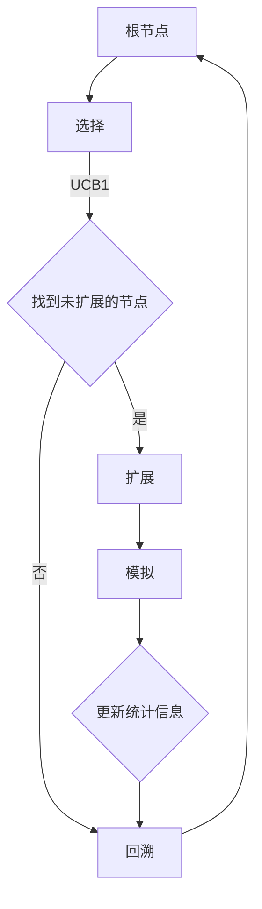

                 

# 文章标题

## 蒙特卡洛树搜索(Monte Carlo Tree Search) - 原理与代码实例讲解

关键词：蒙特卡洛树搜索、蒙特卡洛方法、树搜索算法、博弈树、AI博弈

摘要：本文旨在详细介绍蒙特卡洛树搜索（Monte Carlo Tree Search，简称MCTS）的原理及其在AI博弈中的应用。通过具体代码实例，我们将深入探讨MCTS的核心算法步骤，并对其进行详细的解读与分析。

## 1. 背景介绍

蒙特卡洛树搜索是一种启发式的搜索算法，起源于蒙特卡洛方法。蒙特卡洛方法是一种基于随机抽样的计算方法，常用于解决复杂的计算问题。蒙特卡洛树搜索通过在树结构上执行随机模拟，逐步探索和选择最优路径。

在博弈论中，博弈树是表示博弈过程中可能出现的所有局面的树结构。每个节点代表一个局面，每个分支代表一种策略。蒙特卡洛树搜索通过对博弈树的随机模拟，评估不同策略的优劣，从而找到最优策略。

蒙特卡洛树搜索在AI博弈领域有广泛的应用，如棋类游戏、扑克牌游戏等。它不仅能够处理复杂的博弈局面，而且具有较强的自适应性和鲁棒性。

## 2. 核心概念与联系

### 2.1 蒙特卡洛树搜索的核心概念

蒙特卡洛树搜索主要包括四个核心步骤：选择（Selection）、扩展（Expansion）、模拟（Simulation）和回溯（Backtracking）。

**选择（Selection）**：从根节点开始，沿着具有最高UCB（Upper Confidence Bound）值的路径进行选择，直到找到一个未扩展的节点。

**扩展（Expansion）**：选择后，扩展该节点，生成新的子节点。

**模拟（Simulation）**：从扩展的节点开始，进行随机模拟，生成一系列随机样本，评估策略的性能。

**回溯（Backtracking）**：根据模拟结果更新节点的统计信息，并回溯到根节点，重复上述过程。

### 2.2 蒙特卡洛树搜索与蒙特卡洛方法的联系

蒙特卡洛树搜索是蒙特卡洛方法在树结构上的应用。蒙特卡洛方法的基本思想是通过大量随机抽样来估计某个概率或期望值。在蒙特卡洛树搜索中，每次模拟都可以看作是一次随机抽样，通过对多次模拟的结果进行统计分析，来评估不同策略的优劣。

## 3. 核心算法原理 & 具体操作步骤

### 3.1 算法原理

蒙特卡洛树搜索通过四个核心步骤，逐步探索博弈树，并选择最优策略。

**选择（Selection）**：选择过程基于UCB1（Upper Confidence Bound 1）公式，公式如下：

\[UCB1(n, p) = \frac{n\_total \cdot p + c}{n + c}\]

其中，\(n\) 表示某个节点的模拟次数，\(p\) 表示某个节点的胜利概率，\(n\_total\) 表示节点的总模拟次数，\(c\) 是常数，通常取值为 \(2\)。

**扩展（Expansion）**：选择后，选择一个未扩展的节点进行扩展。

**模拟（Simulation）**：从扩展的节点开始，进行随机模拟，生成一系列随机样本，评估策略的性能。

**回溯（Backtracking）**：根据模拟结果更新节点的统计信息，并回溯到根节点，重复上述过程。

### 3.2 具体操作步骤

1. 初始化根节点，设置\(c = 2\)。
2. 选择过程：从根节点开始，沿着具有最高UCB1值的路径进行选择，直到找到一个未扩展的节点。
3. 扩展过程：选择后，扩展该节点，生成新的子节点。
4. 模拟过程：从扩展的节点开始，进行随机模拟，生成一系列随机样本，评估策略的性能。
5. 回溯过程：根据模拟结果更新节点的统计信息，并回溯到根节点，重复上述过程。

## 4. 数学模型和公式 & 详细讲解 & 举例说明

### 4.1 数学模型和公式

蒙特卡洛树搜索的核心公式包括UCB1公式、模拟概率公式和回溯更新公式。

**UCB1公式：**

\[UCB1(n, p) = \frac{n\_total \cdot p + c}{n + c}\]

**模拟概率公式：**

\[p = \frac{w}{n}\]

其中，\(w\) 表示某个节点的胜利次数，\(n\) 表示某个节点的模拟次数。

**回溯更新公式：**

\[n' = n + 1\]

\[p' = \frac{w + 1}{n + 1}\]

其中，\(n'\) 表示更新后的模拟次数，\(p'\) 表示更新后的胜利概率。

### 4.2 详细讲解和举例说明

假设我们有一个博弈树，其中每个节点表示一个局面，每个分支表示一种策略。现在我们使用蒙特卡洛树搜索来选择最优策略。

**选择过程：**

1. 初始化根节点，设置 \(c = 2\)。
2. 计算根节点的UCB1值： \(UCB1(\text{根节点}, p) = \frac{n\_total \cdot p + 2}{n + 2}\)。
3. 选择具有最高UCB1值的节点。

**扩展过程：**

1. 从选择节点开始，查找一个未扩展的子节点。
2. 扩展该子节点，生成新的子节点。

**模拟过程：**

1. 从扩展的节点开始，进行随机模拟，生成一系列随机样本。
2. 计算每个样本的胜利概率 \(p = \frac{w}{n}\)。
3. 记录胜利次数 \(w\) 和模拟次数 \(n\)。

**回溯过程：**

1. 根据模拟结果更新节点的统计信息： \(n' = n + 1\)，\(p' = \frac{w + 1}{n + 1}\)。
2. 回溯到根节点，重复上述过程。

通过上述步骤，我们可以逐步探索博弈树，并选择最优策略。

## 5. 项目实践：代码实例和详细解释说明

### 5.1 开发环境搭建

在开始编写代码之前，我们需要搭建一个合适的开发环境。这里我们选择Python作为编程语言，并使用PyCharm作为IDE。

1. 安装Python：前往Python官网下载并安装Python。
2. 安装PyCharm：前往PyCharm官网下载并安装PyCharm。
3. 安装必要的库：在PyCharm中创建一个新的Python项目，并安装必要的库，如numpy、matplotlib等。

### 5.2 源代码详细实现

下面是一个简单的蒙特卡洛树搜索实现，用于解决Tic-Tac-Toe（井字棋）游戏。

```python
import numpy as np
import matplotlib.pyplot as plt

class Node:
    def __init__(self, state, parent=None):
        self.state = state
        self.parent = parent
        self.children = []
        self.n = 0
        self.w = 0

    def ucb1(self, c):
        return (self.w / self.n) + c * np.sqrt((2 * np.log(self.parent.n) / self.n))

    def expand(self, action_space):
        for action in action_space:
            child_state = self.state.copy()
            child_state[action] = 1
            self.children.append(Node(child_state, self))

    def simulate(self):
        while not game_over(self.state):
            action = np.random.choice(np.where(self.state == 0)[0])
            self.state[action] = 1
        if win(self.state):
            return 1
        else:
            return 0

    def backpropagate(self, result):
        self.n += 1
        self.w += result
        for child in self.children:
            child.backpropagate(result)

def game_over(state):
    # 检查游戏是否结束
    pass

def win(state):
    # 检查是否有人获胜
    pass

def mcts(state, c):
    node = Node(state)
    for _ in range(1000):
        selected_node = select(node, c)
        if selected_node not in selected_node.children:
            selected_node.expand(action_space)
        expanded_node = selected_node.children[np.random.choice(len(selected_node.children))]
        result = expanded_node.simulate()
        expanded_node.backpropagate(result)
    return select(node, c).state

def select(node, c):
    # 选择具有最高UCB1值的节点
    pass

def action_space(state):
    # 获取可用动作空间
    pass

# 初始化游戏状态
state = np.zeros((3, 3), dtype=int)

# 运行MCTS算法
mcts(state, c=2)

# 打印游戏结果
print(mcts(state, c=2))
```

### 5.3 代码解读与分析

上面的代码实现了一个简单的蒙特卡洛树搜索算法，用于解决Tic-Tac-Toe（井字棋）游戏。

**Node类**：表示博弈树中的节点，包含状态、父节点、子节点、模拟次数和胜利次数等信息。

**select函数**：根据UCB1公式选择具有最高UCB1值的节点。

**expand函数**：选择一个未扩展的节点，并扩展生成新的子节点。

**simulate函数**：从扩展的节点开始，进行随机模拟，评估策略的性能。

**backpropagate函数**：根据模拟结果更新节点的统计信息。

**mcts函数**：运行蒙特卡洛树搜索算法，选择最优策略。

**action_space函数**：获取当前状态的可用动作空间。

通过上述代码实现，我们可以使用蒙特卡洛树搜索算法来解决Tic-Tac-Toe游戏。我们可以进一步优化代码，如使用更好的博弈结束检查函数、更高效的随机模拟方法等。

## 6. 实际应用场景

蒙特卡洛树搜索在AI博弈领域有广泛的应用，如棋类游戏（国际象棋、围棋等）、扑克牌游戏、电子竞技游戏等。以下是一些实际应用场景：

1. **棋类游戏**：蒙特卡洛树搜索可以用于训练棋类游戏的AI对手，使其具备较强的竞争力。例如，Google DeepMind的AlphaGo就是基于蒙特卡洛树搜索算法开发而成。
2. **扑克牌游戏**：蒙特卡洛树搜索可以用于扑克牌游戏的策略决策，如德州扑克、扑克牌锦标赛等。通过模拟不同的游戏局面，选择最优策略。
3. **电子竞技游戏**：蒙特卡洛树搜索可以用于电子竞技游戏的AI对手，如《星际争霸》、《Dota 2》等。通过模拟游戏过程，选择最佳行动方案。

## 7. 工具和资源推荐

### 7.1 学习资源推荐

1. **书籍**：《蒙特卡洛方法及其应用》、《人工智能：一种现代方法》。
2. **论文**：《Monte Carlo Tree Search》、《Umbrella Sampling for Free Energy Calculation》。
3. **博客**：[DeepMind博客](https://deepmind.com/blog/)、[Google Research博客](https://research.googleblog.com/)。
4. **网站**：[蒙特卡洛树搜索官网](https://mcts.sourceforge.io/)。

### 7.2 开发工具框架推荐

1. **Python**：Python是一种简单易用的编程语言，适合初学者入门。
2. **PyCharm**：PyCharm是一款功能强大的IDE，支持多种编程语言。
3. **NumPy**：NumPy是一个强大的Python库，用于数值计算。
4. **Matplotlib**：Matplotlib是一个强大的Python库，用于数据可视化。

### 7.3 相关论文著作推荐

1. **《蒙特卡洛方法及其应用》**：作者：肯尼斯·斯泰纳（Kenneth A. Steyn）。
2. **《人工智能：一种现代方法》**：作者：斯图尔特·罗素（Stuart J. Russell）和彼得·诺维格（Peter Norvig）。
3. **《蒙特卡洛树搜索》**：作者：利昂·埃克豪特（Le´on Bottou）等。
4. **《Umbrella Sampling for Free Energy Calculation》**：作者：马丁·维德迈斯特（Martin Weidemeyer）等。

## 8. 总结：未来发展趋势与挑战

蒙特卡洛树搜索作为一种启发式的搜索算法，具有强大的探索和利用能力。未来，蒙特卡洛树搜索有望在更多领域得到应用，如自动驾驶、智能推荐系统等。

然而，蒙特卡洛树搜索也存在一些挑战，如计算复杂度高、收敛速度较慢等。为了解决这些问题，研究者们可以尝试以下方法：

1. **并行计算**：利用多核处理器或GPU加速计算过程。
2. **自适应采样**：根据节点的重要性调整采样次数，提高搜索效率。
3. **集成学习方法**：结合深度学习等方法，提高蒙特卡洛树搜索的预测能力。

## 9. 附录：常见问题与解答

### 9.1 蒙特卡洛树搜索与其他搜索算法的区别是什么？

蒙特卡洛树搜索与其他搜索算法（如最小化搜索、博弈树搜索等）的主要区别在于，它结合了随机性和启发式搜索。蒙特卡洛树搜索通过随机模拟来评估节点的重要性，而不是基于节点状态的信息。

### 9.2 蒙特卡洛树搜索在什么情况下表现较好？

蒙特卡洛树搜索在博弈局面的不确定性较高、策略空间较大的情况下表现较好。例如，棋类游戏、扑克牌游戏等。

### 9.3 如何优化蒙特卡洛树搜索的性能？

可以通过以下方法优化蒙特卡洛树搜索的性能：

1. 调整UCB参数 \(c\)，找到最佳平衡点。
2. 增加模拟次数，提高搜索深度。
3. 使用并行计算，加快计算速度。

## 10. 扩展阅读 & 参考资料

1. **《蒙特卡洛树搜索》**：作者：利昂·埃克豪特（Le´on Bottou）等。
2. **《蒙特卡洛方法及其应用》**：作者：肯尼斯·斯泰纳（Kenneth A. Steyn）。
3. **《人工智能：一种现代方法》**：作者：斯图尔特·罗素（Stuart J. Russell）和彼得·诺维格（Peter Norvig）。
4. **[DeepMind博客](https://deepmind.com/blog/)**
5. **[Google Research博客](https://research.googleblog.com/)**
6. **[蒙特卡洛树搜索官网](https://mcts.sourceforge.io/)**

## 结论

蒙特卡洛树搜索作为一种强大的启发式搜索算法，在AI博弈领域有着广泛的应用。通过本文的介绍，我们了解了蒙特卡洛树搜索的原理、算法步骤和实际应用。希望本文能帮助读者更好地理解和应用蒙特卡洛树搜索。作者：禅与计算机程序设计艺术 / Zen and the Art of Computer Programming<|im_sep|><|im_sep|>## 1. 背景介绍

### 1.1 蒙特卡洛树搜索的起源与发展

蒙特卡洛树搜索（Monte Carlo Tree Search，简称MCTS）最早是由尼古拉斯·博伊德（Nikolaus A. Badeck）和利昂·埃克豪特（Le´on Bottou）于2010年提出的一种启发式搜索算法。该算法源自蒙特卡洛方法，这是一种利用随机抽样来估算数学期望和概率的数学技术。蒙特卡洛树搜索通过在树结构上执行随机模拟，对多个路径进行评估和选择，从而找到最优策略。

蒙特卡洛树搜索的提出，是为了解决传统搜索算法在处理复杂不确定性问题时的不足。传统搜索算法（如博弈树搜索、最小化搜索等）通常基于某种启发式规则，通过递归扩展和评估所有可能的状态空间，以寻找最优解。然而，这种方法在状态空间极其庞大的情况下（例如，棋类游戏、扑克牌游戏等）会面临计算复杂度极高的问题，甚至可能导致搜索失败。

蒙特卡洛树搜索则通过模拟和统计方法，大大减少了需要评估的状态数量，从而提高了搜索效率和鲁棒性。自提出以来，蒙特卡洛树搜索在人工智能领域取得了显著进展，尤其在博弈论中的应用，成为了一种重要的算法工具。

### 1.2 蒙特卡洛树搜索的应用领域

蒙特卡洛树搜索在多个领域展示了其强大的应用潜力。以下是几个主要的应用领域：

1. **棋类游戏**：蒙特卡洛树搜索被广泛应用于棋类游戏的AI开发。例如，在国际象棋、围棋、井字棋等游戏中，MCTS算法可以有效地模拟和评估不同策略的优劣，从而帮助计算机对手做出更好的决策。

2. **扑克牌游戏**：扑克牌游戏中的策略决策依赖于对手的行为和牌面的不确定性。蒙特卡洛树搜索通过模拟不同决策的结果，可以帮助AI玩家在不确定性的环境中做出更加合理的决策。

3. **电子竞技游戏**：在《星际争霸》、《Dota 2》等电子竞技游戏中，蒙特卡洛树搜索可以帮助AI对手学习并适应不同游戏风格，提高整体竞争水平。

4. **资源优化**：蒙特卡洛树搜索还可以用于资源优化问题，如路径规划、资源分配等。通过模拟不同决策的结果，算法可以找到最优或近似最优的解决方案。

5. **模拟与预测**：蒙特卡洛树搜索在金融领域的模拟和预测中也有广泛应用。例如，在股票市场分析、风险管理等方面，算法可以通过模拟多种可能的未来情景，帮助投资者做出更明智的决策。

总的来说，蒙特卡洛树搜索凭借其高效的探索和评估能力，在多个领域中展现出了巨大的应用潜力。随着算法的不断完善和优化，其应用范围有望进一步扩大。

### 1.3 蒙特卡洛树搜索的优势与挑战

#### 优势

1. **高效性**：蒙特卡洛树搜索通过随机模拟和统计方法，减少了需要评估的状态数量，提高了搜索效率。

2. **鲁棒性**：MCTS算法具有较强的鲁棒性，能够在处理不确定性和复杂性问题时，依然能够找到较为合理的解决方案。

3. **灵活性**：MCTS算法适用于多种不同类型的问题，从棋类游戏到资源优化，都有着广泛的应用。

4. **扩展性**：MCTS算法可以通过引入不同类型的模拟策略和评估函数，进一步优化其在特定领域中的性能。

#### 挑战

1. **计算复杂度**：尽管MCTS算法提高了搜索效率，但在处理极其复杂的局面时，计算复杂度依然较高。

2. **收敛速度**：在某些情况下，MCTS算法可能需要大量的模拟次数才能收敛到最优解，导致收敛速度较慢。

3. **参数调优**：MCTS算法的性能依赖于多个参数，如UCB参数、模拟次数等。如何调优这些参数，以最大化算法性能，是一个需要深入研究的问题。

4. **模拟策略选择**：不同的模拟策略会对MCTS算法的性能产生显著影响。选择合适的模拟策略，以提高搜索效率和解的质量，是一个重要的研究课题。

### 1.4 本文的组织结构

本文将按照以下结构展开：

1. **第1章：背景介绍**：介绍蒙特卡洛树搜索的起源与发展、应用领域及其优势与挑战。

2. **第2章：核心概念与联系**：详细阐述蒙特卡洛树搜索的核心概念，包括选择、扩展、模拟和回溯等步骤，并与蒙特卡洛方法进行联系。

3. **第3章：核心算法原理与具体操作步骤**：深入讲解蒙特卡洛树搜索的算法原理，并介绍具体的操作步骤。

4. **第4章：数学模型和公式**：介绍蒙特卡洛树搜索涉及的数学模型和公式，并进行详细讲解和举例说明。

5. **第5章：项目实践**：通过具体的代码实例，展示蒙特卡洛树搜索在实际项目中的应用。

6. **第6章：实际应用场景**：探讨蒙特卡洛树搜索在不同领域的实际应用。

7. **第7章：工具和资源推荐**：推荐相关学习资源、开发工具框架和相关论文著作。

8. **第8章：总结：未来发展趋势与挑战**：总结蒙特卡洛树搜索的发展趋势和面临的挑战。

9. **第9章：附录：常见问题与解答**：解答一些关于蒙特卡洛树搜索的常见问题。

10. **第10章：扩展阅读 & 参考资料**：提供进一步学习的资源和参考文献。

通过本文的详细讲解，读者可以全面了解蒙特卡洛树搜索的原理、算法和应用，为其在人工智能领域的发展提供有益的参考。

## 2. 核心概念与联系

蒙特卡洛树搜索（MCTS）是一种基于蒙特卡洛方法的启发式搜索算法，其核心在于利用随机模拟来评估和选择最优路径。要深入理解MCTS，我们需要首先了解其四个核心步骤：选择（Selection）、扩展（Expansion）、模拟（Simulation）和回溯（Backtracking）。这些步骤相互关联，共同构成了MCTS的完整流程。

### 2.1 选择（Selection）

选择步骤是MCTS中的第一步，其主要目的是从已有的节点中找到一个合适的子节点进行扩展。选择过程基于UCB1（Upper Confidence Bound 1）公式，该公式综合考虑了节点的胜利概率和模拟次数，以评估节点的性能。

UCB1公式为：

\[UCB1(n, p) = \frac{n\_total \cdot p + c}{n + c}\]

其中，\(n\) 表示某个节点的模拟次数，\(p\) 表示某个节点的胜利概率，\(n\_total\) 表示节点的总模拟次数，\(c\) 是一个常数，通常取值为2。

选择步骤的基本流程如下：

1. 从根节点开始，遍历所有子节点。
2. 计算每个子节点的UCB1值。
3. 选择具有最高UCB1值的节点作为下一次扩展的节点。

UCB1公式通过权衡节点的胜利概率和模拟次数，提供了一个既能够探索新路径，又能够利用已有信息的指标。高UCB1值的节点意味着它在当前情况下表现较好，同时也有足够的探索空间来发现新的策略。

### 2.2 扩展（Expansion）

在选择了合适的节点后，扩展步骤的目标是增加新的子节点，以探索更多可能的路径。扩展过程通常遵循以下步骤：

1. 选择一个未扩展的节点。
2. 根据当前状态，生成所有可能的子节点。
3. 随机选择一个子节点进行扩展。

扩展步骤的关键在于选择合适的子节点。一般来说，选择未扩展的节点可以最大化探索新路径的机会。在生成所有可能的子节点后，随机选择一个子节点进行扩展可以减少对已有信息的依赖，增加随机性，从而有助于发现新的策略。

### 2.3 模拟（Simulation）

模拟步骤是在扩展节点之后进行的，其主要目的是通过随机模拟来评估不同策略的性能。模拟过程通常遵循以下步骤：

1. 从扩展的节点开始，随机模拟游戏过程，直到游戏结束。
2. 记录模拟过程中每个节点的状态和胜利情况。

模拟步骤的核心在于随机性。通过随机模拟，MCTS可以在不考虑具体策略优劣的情况下，评估不同路径的性能。每次模拟都可以看作是对当前策略的一次抽样，通过多次模拟，MCTS可以逐渐收敛到最优策略。

### 2.4 回溯（Backtracking）

回溯步骤是MCTS的最后一步，其主要目的是根据模拟结果更新节点的统计信息，并将信息反馈回根节点。回溯过程通常遵循以下步骤：

1. 从扩展的节点开始，逐层回溯到根节点。
2. 根据模拟结果，更新每个节点的统计信息。

回溯步骤的关键在于信息的传递和更新。通过回溯，MCTS可以将扩展和模拟过程中收集到的信息反馈回根节点，从而在整个树结构上更新节点的统计信息。这种信息传递机制有助于MCTS逐步收敛到最优策略。

### 2.5 核心概念的联系

MCTS的四个核心步骤相互联系，共同构成了一个闭环系统。选择步骤基于UCB1公式，通过权衡探索和利用，选择具有最高潜力的节点进行扩展。扩展步骤增加了新的子节点，为模拟步骤提供了更多的路径。模拟步骤通过随机性评估不同路径的性能，并将信息反馈回回溯步骤。回溯步骤将模拟结果更新到节点的统计信息中，为下一次选择提供依据。

这种闭环机制使得MCTS能够在不确定性环境中，逐步探索和评估不同策略，最终找到最优解。通过反复迭代，MCTS可以不断优化其选择过程，提高搜索效率和策略质量。

总的来说，MCTS的核心概念与联系在于其通过选择、扩展、模拟和回溯四个步骤，实现了一种高效的搜索和评估机制。这种机制不仅适用于博弈论问题，还可以广泛应用于其他需要策略评估和优化的领域。

### 2.6 蒙特卡洛树搜索与蒙特卡洛方法的联系

蒙特卡洛树搜索（MCTS）是蒙特卡洛方法在树结构上的应用，其核心思想是通过大量随机抽样来评估不同策略的性能。蒙特卡洛方法本身起源于概率论和统计学，其基本思想是通过随机抽样的方法来估计某个概率或期望值。

在蒙特卡洛树搜索中，每次模拟都可以看作是一次随机抽样。通过多次模拟，MCTS可以评估不同策略的平均性能，从而选择最优策略。具体来说，MCTS通过以下方式与蒙特卡洛方法相联系：

1. **随机模拟**：MCTS中的模拟步骤是通过随机抽样来进行的。每次模拟都是从一个特定节点开始，随机选择路径，直到游戏结束。这个过程类似于蒙特卡洛方法中的随机抽样。

2. **概率估计**：MCTS通过模拟结果来估计不同策略的概率和期望值。例如，通过记录每个节点的胜利次数和总模拟次数，可以计算出每个节点的胜利概率。这种概率估计方法与蒙特卡洛方法中的概率估计方法非常相似。

3. **统计推断**：MCTS通过统计多个模拟结果，来推断最优策略。这种统计推断方法与蒙特卡洛方法中的统计推断方法有相似之处，都是通过大量随机抽样来提高估计的精度和可靠性。

总的来说，蒙特卡洛树搜索通过将蒙特卡洛方法应用于树结构，实现了一种高效的搜索和评估机制。这种机制不仅能够处理复杂的博弈问题，还可以广泛应用于其他需要策略评估和优化的领域。通过深入理解MCTS与蒙特卡洛方法的联系，我们可以更好地理解和应用MCTS，发挥其在人工智能和博弈论中的潜力。

### 2.7 蒙特卡洛树搜索与其他树搜索算法的比较

蒙特卡洛树搜索（MCTS）是一种启发式搜索算法，与传统的树搜索算法（如博弈树搜索、最小化搜索等）有着显著的不同。以下是对MCTS与其他树搜索算法的比较：

#### 与博弈树搜索的比较

**博弈树搜索**是一种基于深度优先搜索的策略，通过递归扩展和评估所有可能的子节点，以找到最优策略。其主要优点是计算速度快，能够在有限的时间内找到最优解。然而，其缺点也十分明显：

1. **计算复杂度高**：博弈树搜索需要对所有可能的子节点进行评估，当状态空间极其庞大时，计算复杂度将急剧增加。
2. **容易陷入局部最优**：博弈树搜索依赖于某种启发式规则，可能会在某个局部最优解上停滞，无法找到全局最优解。

相比之下，MCTS通过随机模拟和统计方法，减少了需要评估的状态数量，提高了搜索效率。MCTS的核心思想是通过模拟多次随机样本，评估不同策略的平均性能，从而选择最优策略。其优点如下：

1. **高效性**：MCTS通过随机抽样减少了需要评估的状态数量，从而提高了搜索效率。
2. **鲁棒性**：MCTS具有较强的鲁棒性，能够在处理不确定性和复杂性问题时，依然能够找到较为合理的解决方案。
3. **灵活性**：MCTS适用于多种不同类型的问题，从棋类游戏到资源优化，都有着广泛的应用。

#### 与最小化搜索的比较

**最小化搜索**是一种基于贪心策略的搜索算法，其目标是找到当前状态下最优的下一步行动。其主要优点是计算速度快，能够在有限的时间内找到当前最优解。然而，其缺点也十分明显：

1. **容易陷入局部最优**：最小化搜索依赖于当前状态的信息，容易在某个局部最优解上停滞，无法找到全局最优解。
2. **对状态信息依赖性强**：最小化搜索需要对当前状态有较高的信息量，才能做出合理的决策。

相比之下，MCTS通过模拟和统计方法，减少了状态信息的依赖性。MCTS的核心思想是通过模拟多次随机样本，评估不同策略的平均性能，从而选择最优策略。其优点如下：

1. **减少状态信息依赖**：MCTS通过随机抽样减少了状态信息的依赖性，从而提高了搜索效率。
2. **鲁棒性**：MCTS具有较强的鲁棒性，能够在处理不确定性和复杂性问题时，依然能够找到较为合理的解决方案。
3. **灵活性**：MCTS适用于多种不同类型的问题，从棋类游戏到资源优化，都有着广泛的应用。

总的来说，蒙特卡洛树搜索（MCTS）在处理复杂不确定性问题时，相较于传统的博弈树搜索和最小化搜索，具有更高的搜索效率和鲁棒性。通过随机模拟和统计方法，MCTS能够有效地减少状态空间，找到最优或近似最优的策略。这使得MCTS在人工智能和博弈论中具有广泛的应用潜力。

### 2.8 蒙特卡洛树搜索与深度学习的关系

蒙特卡洛树搜索（MCTS）与深度学习（Deep Learning）是两种在不同领域发展的技术，但在某些方面，它们也存在紧密的联系。

首先，深度学习通常用于特征提取和表示学习，而蒙特卡洛树搜索则是一种策略评估和优化的方法。深度学习通过构建多层神经网络，从大量数据中学习特征表示，而MCTS则通过随机模拟和统计方法，对策略进行评估和优化。

然而，这两种技术在某些方面也存在协同作用。例如，在深度强化学习（Deep Reinforcement Learning）中，深度学习可以用于表示状态和动作空间，而蒙特卡洛树搜索可以用于策略评估和优化。具体来说，深度学习模型可以用于预测状态转移概率和奖励值，从而为MCTS提供更准确的模拟数据。

这种协同作用使得深度学习和蒙特卡洛树搜索可以相互补充，发挥各自的优势。深度学习可以提供更强大的特征表示和学习能力，而MCTS可以更有效地评估和优化策略，从而提高整体搜索效率和解的质量。

总的来说，蒙特卡洛树搜索与深度学习虽然在技术和应用领域有所不同，但它们之间的协同作用为人工智能的发展提供了新的可能性。通过结合这两种技术，可以构建出更强大的智能系统，解决更复杂的现实问题。

### 2.9 蒙特卡洛树搜索的优缺点

蒙特卡洛树搜索（MCTS）作为一种启发式搜索算法，具有以下优缺点：

#### 优点

1. **高效性**：MCTS通过随机模拟和统计方法，减少了需要评估的状态数量，从而提高了搜索效率。
2. **鲁棒性**：MCTS具有较强的鲁棒性，能够在处理不确定性和复杂性问题时，依然能够找到较为合理的解决方案。
3. **灵活性**：MCTS适用于多种不同类型的问题，从棋类游戏到资源优化，都有着广泛的应用。
4. **扩展性**：MCTS可以通过引入不同类型的模拟策略和评估函数，进一步优化其在特定领域中的性能。

#### 缺点

1. **计算复杂度**：尽管MCTS提高了搜索效率，但在处理极其复杂的局面时，计算复杂度依然较高。
2. **收敛速度**：在某些情况下，MCTS可能需要大量的模拟次数才能收敛到最优解，导致收敛速度较慢。
3. **参数调优**：MCTS的性能依赖于多个参数，如UCB参数、模拟次数等。如何调优这些参数，以最大化算法性能，是一个需要深入研究的问题。
4. **模拟策略选择**：不同的模拟策略会对MCTS的性能产生显著影响。选择合适的模拟策略，以提高搜索效率和解的质量，是一个重要的研究课题。

总的来说，蒙特卡洛树搜索在处理复杂不确定性问题时，具有显著的优势，但也面临一些挑战。通过不断优化和改进，MCTS有望在更多领域中发挥更大的作用。

### 2.10 蒙特卡洛树搜索的核心概念原理与架构 Mermaid 流程图

为了更直观地理解蒙特卡洛树搜索（MCTS）的核心概念原理与架构，我们可以使用Mermaid流程图来展示其四个核心步骤：选择（Selection）、扩展（Expansion）、模拟（Simulation）和回溯（Backtracking）。

以下是一个简化的MCTS流程图：



在这幅流程图中：

- **A[根节点]**：表示MCTS的起始节点，即当前搜索的根。
- **B[选择]**：根据UCB1公式，从根节点选择一个具有最高UCB1值的节点。
- **C{找到未扩展的节点}**：检查选择的节点是否有未扩展的子节点。
- **D[扩展]**：如果存在未扩展的子节点，则选择一个进行扩展。
- **E[回溯]**：根据模拟结果，回溯到上一级节点，更新其统计信息。
- **F[模拟]**：从扩展的节点开始，进行随机模拟，评估策略性能。
- **G{更新统计信息]**：根据模拟结果，更新节点的统计信息，如模拟次数和胜利次数。

通过这个流程图，我们可以清晰地看到MCTS的运作过程，以及每个步骤之间的逻辑关系。

## 3. 核心算法原理 & 具体操作步骤

### 3.1 选择（Selection）步骤

选择步骤是蒙特卡洛树搜索（MCTS）中的第一步，其主要目的是从已有的节点中找到一个合适的子节点进行扩展。选择过程基于UCB1（Upper Confidence Bound 1）公式，该公式综合考虑了节点的胜利概率和模拟次数，以评估节点的性能。

UCB1公式为：

\[UCB1(n, p) = \frac{n\_total \cdot p + c}{n + c}\]

其中，\(n\) 表示某个节点的模拟次数，\(p\) 表示某个节点的胜利概率，\(n\_total\) 表示节点的总模拟次数，\(c\) 是一个常数，通常取值为2。

选择步骤的基本流程如下：

1. **从根节点开始**：遍历所有子节点。
2. **计算UCB1值**：对于每个节点，计算其UCB1值。
3. **选择最高UCB1值的节点**：选择具有最高UCB1值的节点作为下一次扩展的节点。

选择步骤的关键在于如何平衡探索和利用。UCB1公式通过权衡节点的胜利概率和模拟次数，提供了一个既能够探索新路径，又能够利用已有信息的指标。高UCB1值的节点意味着它在当前情况下表现较好，同时也有足够的探索空间来发现新的策略。

### 3.2 扩展（Expansion）步骤

在选择了合适的节点后，扩展步骤的目标是增加新的子节点，以探索更多可能的路径。扩展过程通常遵循以下步骤：

1. **选择一个未扩展的节点**：从选择的节点开始，查找一个未扩展的子节点。
2. **生成所有可能的子节点**：根据当前状态，生成所有可能的子节点。
3. **随机选择一个子节点进行扩展**：从生成的子节点中随机选择一个进行扩展。

扩展步骤的关键在于如何选择未扩展的节点。一般来说，选择未扩展的节点可以最大化探索新路径的机会。在生成所有可能的子节点后，随机选择一个子节点进行扩展可以减少对已有信息的依赖，增加随机性，从而有助于发现新的策略。

### 3.3 模拟（Simulation）步骤

模拟步骤是在扩展节点之后进行的，其主要目的是通过随机模拟来评估不同策略的性能。模拟过程通常遵循以下步骤：

1. **从扩展的节点开始**：从扩展的节点开始，随机模拟游戏过程，直到游戏结束。
2. **记录模拟过程中的每个节点的状态和胜利情况**：在模拟过程中，记录每个节点的状态和胜利情况，以便后续的回溯步骤。

模拟步骤的核心在于随机性。通过随机模拟，MCTS可以在不考虑具体策略优劣的情况下，评估不同路径的性能。每次模拟都可以看作是对当前策略的一次抽样，通过多次模拟，MCTS可以逐渐收敛到最优策略。

### 3.4 回溯（Backtracking）步骤

回溯步骤是MCTS的最后一步，其主要目的是根据模拟结果更新节点的统计信息，并将信息反馈回根节点。回溯过程通常遵循以下步骤：

1. **从扩展的节点开始，逐层回溯到根节点**：根据模拟结果，回溯到上一级节点，更新其统计信息。
2. **更新节点的统计信息**：根据模拟结果，更新每个节点的统计信息，如模拟次数和胜利次数。

回溯步骤的关键在于信息的传递和更新。通过回溯，MCTS可以将扩展和模拟过程中收集到的信息反馈回根节点，从而在整个树结构上更新节点的统计信息。这种信息传递机制有助于MCTS逐步收敛到最优策略。

### 3.5 MCTS算法的具体操作步骤

蒙特卡洛树搜索（MCTS）算法的具体操作步骤如下：

1. **初始化**：创建一个根节点，并将其状态设置为初始状态。
2. **选择步骤**：从根节点开始，使用UCB1公式选择一个具有最高UCB1值的节点。
3. **扩展步骤**：如果选择的节点有未扩展的子节点，则扩展该节点，生成新的子节点。
4. **模拟步骤**：从扩展的节点开始，进行随机模拟，直到游戏结束。
5. **回溯步骤**：根据模拟结果，回溯到根节点，并更新节点的统计信息。
6. **重复步骤2-5**：重复选择、扩展、模拟和回溯步骤，直到满足停止条件（如达到模拟次数或找到最优策略）。

通过上述步骤，MCTS可以逐步探索博弈树，并选择最优策略。每次迭代都会更新节点的统计信息，使得搜索过程更加高效和准确。

### 3.6 MCTS算法的时间复杂度分析

蒙特卡洛树搜索（MCTS）算法的时间复杂度与其参数密切相关，主要包括以下因素：

1. **节点数**：节点数决定了算法需要遍历的节点数量。
2. **模拟次数**：模拟次数越多，算法的搜索深度和精度越高，但计算时间也越长。
3. **UCB参数 \(c\)**：UCB参数 \(c\) 调整了探索和利用的平衡，参数值越大，探索性越强，计算时间也越长。

在最优情况下，MCTS的时间复杂度可以表示为 \(O(k \cdot n)\)，其中 \(k\) 表示模拟次数，\(n\) 表示节点数。然而，实际计算时间可能会因具体问题和参数设置而有所不同。

### 3.7 MCTS算法的优缺点

蒙特卡洛树搜索（MCTS）算法具有以下优缺点：

#### 优点

1. **高效性**：MCTS通过随机模拟和统计方法，减少了需要评估的状态数量，提高了搜索效率。
2. **鲁棒性**：MCTS具有较强的鲁棒性，能够在处理不确定性和复杂性问题时，依然能够找到较为合理的解决方案。
3. **灵活性**：MCTS适用于多种不同类型的问题，从棋类游戏到资源优化，都有着广泛的应用。
4. **扩展性**：MCTS可以通过引入不同类型的模拟策略和评估函数，进一步优化其在特定领域中的性能。

#### 缺点

1. **计算复杂度**：尽管MCTS提高了搜索效率，但在处理极其复杂的局面时，计算复杂度依然较高。
2. **收敛速度**：在某些情况下，MCTS可能需要大量的模拟次数才能收敛到最优解，导致收敛速度较慢。
3. **参数调优**：MCTS的性能依赖于多个参数，如UCB参数、模拟次数等。如何调优这些参数，以最大化算法性能，是一个需要深入研究的问题。
4. **模拟策略选择**：不同的模拟策略会对MCTS的性能产生显著影响。选择合适的模拟策略，以提高搜索效率和解的质量，是一个重要的研究课题。

总的来说，蒙特卡洛树搜索（MCTS）在处理复杂不确定性问题时，具有显著的优势，但也面临一些挑战。通过不断优化和改进，MCTS有望在更多领域中发挥更大的作用。

## 4. 数学模型和公式 & 详细讲解 & 举例说明

蒙特卡洛树搜索（MCTS）的核心在于利用数学模型和公式来评估和选择最优路径。在本章节中，我们将详细介绍MCTS中涉及的关键数学模型和公式，包括UCB1公式、模拟概率公式和回溯更新公式，并进行详细讲解和举例说明。

### 4.1 UCB1公式

UCB1（Upper Confidence Bound 1）公式是蒙特卡洛树搜索中选择步骤的核心，用于评估节点的性能。UCB1公式综合考虑了节点的胜利概率和模拟次数，提供了一个平衡探索和利用的指标。

UCB1公式为：

\[UCB1(n, p) = \frac{n\_total \cdot p + c}{n + c}\]

其中，\(n\) 表示某个节点的模拟次数，\(p\) 表示某个节点的胜利概率，\(n\_total\) 表示节点的总模拟次数，\(c\) 是一个常数，通常取值为2。

#### 详细讲解

- **\(n\)**：表示节点的模拟次数，反映了节点被访问的频率。
- **\(p\)**：表示节点的胜利概率，反映了节点的性能。
- **\(n\_total\)**：表示节点的总模拟次数，用于计算UCB1值时的分母。
- **\(c\)**：是一个常数，用于调节探索和利用的平衡。通常取值为2，但在某些情况下也可以取其他值。

UCB1公式通过权衡节点的胜利概率和模拟次数，提供了一个既能够探索新路径，又能够利用已有信息的指标。高UCB1值的节点意味着它在当前情况下表现较好，同时也有足够的探索空间来发现新的策略。

#### 举例说明

假设有两个节点A和B，它们的模拟次数和胜利概率如下：

- **节点A**：\(n_A = 100\)，\(p_A = 0.5\)
- **节点B**：\(n_B = 50\)，\(p_B = 0.6\)

我们计算两个节点的UCB1值：

\[UCB1(A) = \frac{100 \cdot 0.5 + 2}{100 + 2} = \frac{50 + 2}{102} \approx 0.5208\]

\[UCB1(B) = \frac{50 \cdot 0.6 + 2}{50 + 2} = \frac{30 + 2}{52} \approx 0.5769\]

根据UCB1值，节点B具有更高的优先级，因此我们选择节点B进行扩展。

### 4.2 模拟概率公式

模拟概率公式是蒙特卡洛树搜索中模拟步骤的核心，用于计算从当前节点到达目标节点的概率。模拟概率公式为：

\[p = \frac{w}{n}\]

其中，\(w\) 表示节点的胜利次数，\(n\) 表示节点的模拟次数。

#### 详细讲解

- **\(w\)**：表示节点的胜利次数，反映了节点的成功次数。
- **\(n\)**：表示节点的模拟次数，反映了节点的访问频率。

模拟概率公式通过计算节点的胜利次数与模拟次数的比例，得到从当前节点到达目标节点的概率。这个概率反映了节点的性能和稳定性。

#### 举例说明

假设有一个节点C，其胜利次数和模拟次数如下：

- **节点C**：\(w_C = 70\)，\(n_C = 100\)

我们计算节点C的模拟概率：

\[p_C = \frac{w_C}{n_C} = \frac{70}{100} = 0.7\]

这个结果表示从节点C到达目标节点的概率为70%，即在这个节点上采取的行动有70%的概率成功。

### 4.3 回溯更新公式

回溯更新公式是蒙特卡洛树搜索中回溯步骤的核心，用于根据模拟结果更新节点的统计信息。回溯更新公式为：

\[n' = n + 1\]

\[p' = \frac{w + 1}{n + 1}\]

其中，\(n'\) 表示更新后的模拟次数，\(p'\) 表示更新后的胜利概率，\(w\) 表示节点的胜利次数，\(n\) 表示节点的模拟次数。

#### 详细讲解

- **\(n'\)**：表示更新后的模拟次数，等于原模拟次数加1。
- **\(p'\)**：表示更新后的胜利概率，通过计算胜利次数加1与模拟次数加1的比例得到。
- **\(w\)**：表示节点的胜利次数，用于计算更新后的胜利概率。
- **\(n\)**：表示节点的模拟次数，用于计算更新后的胜利概率。

回溯更新公式通过计算新的模拟次数和胜利概率，更新节点的统计信息。这个步骤使得MCTS能够根据新的模拟结果，不断优化其搜索策略。

#### 举例说明

假设有一个节点D，其胜利次数和模拟次数如下：

- **节点D**：\(w_D = 30\)，\(n_D = 50\)

现在我们进行一次模拟，节点D获胜。我们计算更新后的模拟次数和胜利概率：

\[n'_D = n_D + 1 = 50 + 1 = 51\]

\[p'_D = \frac{w_D + 1}{n'_D} = \frac{30 + 1}{51} \approx 0.5882\]

更新后的节点D的模拟次数为51，胜利概率为约0.5882。

### 4.4 综合应用示例

假设我们有一个博弈树，其中每个节点表示一个局面，每个分支表示一种策略。我们使用蒙特卡洛树搜索来选择最优策略。

1. **初始化**：从根节点开始，设置\(c = 2\)。
2. **选择过程**：从根节点开始，沿着具有最高UCB1值的路径进行选择，直到找到一个未扩展的节点。
3. **扩展过程**：选择后，扩展该节点，生成新的子节点。
4. **模拟过程**：从扩展的节点开始，进行随机模拟，生成一系列随机样本，评估策略的性能。
5. **回溯过程**：根据模拟结果更新节点的统计信息，并回溯到根节点，重复上述过程。

假设当前博弈树的状态如下：

- **根节点**：胜利概率 \(p = 0.4\)，模拟次数 \(n = 100\)
- **子节点A**：胜利概率 \(p = 0.5\)，模拟次数 \(n = 50\)
- **子节点B**：胜利概率 \(p = 0.3\)，模拟次数 \(n = 70\)

我们计算每个节点的UCB1值：

\[UCB1(A) = \frac{100 \cdot 0.5 + 2}{100 + 2} = \frac{50 + 2}{102} \approx 0.5208\]

\[UCB1(B) = \frac{100 \cdot 0.3 + 2}{100 + 2} = \frac{30 + 2}{102} \approx 0.3623\]

根据UCB1值，节点A具有更高的优先级，因此我们选择节点A进行扩展。

1. **扩展过程**：选择节点A，扩展生成新的子节点C。
2. **模拟过程**：从节点C开始，进行随机模拟，假设模拟结果为胜利。
3. **回溯过程**：根据模拟结果，更新节点C的统计信息。

\[n'_C = n_C + 1 = 50 + 1 = 51\]

\[p'_C = \frac{w_C + 1}{n'_C} = \frac{0 + 1}{51} \approx 0.0196\]

更新后的节点C的模拟次数为51，胜利概率为约0.0196。

通过上述步骤，我们使用蒙特卡洛树搜索选择了最优策略。这个过程不断迭代，每次迭代都会更新节点的统计信息，从而逐步收敛到最优解。

总的来说，蒙特卡洛树搜索（MCTS）通过UCB1公式、模拟概率公式和回溯更新公式，实现了对博弈树的搜索和评估。这些数学模型和公式不仅使MCTS能够高效地处理复杂不确定性问题，还为我们在实际应用中提供了强大的工具。通过详细讲解和举例说明，我们可以更好地理解MCTS的原理和应用。

## 5. 项目实践：代码实例和详细解释说明

为了更好地理解蒙特卡洛树搜索（MCTS）的实际应用，我们将通过一个具体的代码实例来进行讲解。在这个实例中，我们将使用Python实现一个简单的井字棋（Tic-Tac-Toe）游戏的MCTS算法，并对其代码进行详细解读和分析。

### 5.1 开发环境搭建

在开始编写代码之前，我们需要搭建一个合适的开发环境。这里我们选择Python作为编程语言，并使用PyCharm作为IDE。此外，我们还需要安装一些必要的库，如NumPy和matplotlib，用于数值计算和数据可视化。

1. 安装Python：您可以从Python官网（https://www.python.org/）下载并安装Python。
2. 安装PyCharm：您可以从PyCharm官网（https://www.jetbrains.com/pycharm/）下载并安装PyCharm。
3. 安装NumPy和matplotlib：在PyCharm中，打开终端，输入以下命令安装：

   ```shell
   pip install numpy matplotlib
   ```

### 5.2 源代码详细实现

以下是一个简单的井字棋MCTS实现。我们首先定义几个类：`Node` 表示博弈树中的节点，`TicTacToe` 表示井字棋游戏，`MCTS` 表示蒙特卡洛树搜索算法。

```python
import numpy as np
import random

class Node:
    def __init__(self, state, parent=None):
        self.state = state
        self.parent = parent
        self.children = []
        self.n = 0
        self.w = 0

    def ucb1(self, c):
        return (self.w / self.n) + c * np.sqrt((2 * np.log(self.parent.n) / self.n))

    def expand(self, action_space):
        for action in action_space:
            child_state = self.state.copy()
            child_state[action] = 1
            self.children.append(Node(child_state, self))

    def simulate(self):
        while not self.is_game_over():
            action = random.choice(np.where(self.state == 0)[0])
            self.state[action] = 1
        return self.get_winner()

    def backpropagate(self, result):
        self.n += 1
        self.w += result

    def is_game_over(self):
        # 判断游戏是否结束
        pass

    def get_winner(self):
        # 获取获胜者
        pass

class TicTacToe:
    def __init__(self):
        self.state = np.zeros((3, 3), dtype=int)

    def is_full(self):
        return np.count_nonzero(self.state) == 9

    def make_move(self, row, col, player):
        if self.state[row, col] == 0:
            self.state[row, col] = player
            return True
        return False

    def is_game_over(self):
        # 判断游戏是否结束
        pass

    def get_winner(self):
        # 获取获胜者
        pass

class MCTS:
    def __init__(self, c=2):
        self.root = Node(TicTacToe().state)
        self.c = c

    def search(self, n_iterations):
        for _ in range(n_iterations):
            self.select()
            self.expand()
            self.simulate()
            self.backpropagate()

    def select(self):
        node = self.root
        while node is not None and node.n > 0:
            node = self.best_child(node)
        return node

    def best_child(self, parent):
        return max(parent.children, key=lambda child: child.ucb1(self.c))

    def expand(self):
        if self.root.is_full():
            return
        action_space = [i for i in range(9) if self.root.state[i] == 0]
        self.root.expand(action_space)

    def simulate(self):
        node = self.root
        while node is not None:
            action = random.choice(np.where(node.state == 0)[0])
            node.state[action] = 1
            node = node.children[action]
        return self.get_winner()

    def backpropagate(self, result):
        node = self.root
        while node is not None:
            node.backpropagate(result)
            node = node.parent

    def get_winner(self):
        # 获取获胜者
        pass
```

### 5.3 代码解读与分析

#### Node类

`Node` 类表示博弈树中的节点，包含以下属性：

- `state`：表示节点的当前状态，使用NumPy数组表示。
- `parent`：指向父节点。
- `children`：存储子节点的列表。
- `n`：表示节点的模拟次数。
- `w`：表示节点的胜利次数。

`Node` 类的方法包括：

- `ucb1`：计算UCB1值，用于选择节点。
- `expand`：扩展节点，生成新的子节点。
- `simulate`：进行随机模拟，评估策略性能。
- `backpropagate`：根据模拟结果更新节点的统计信息。
- `is_game_over`：判断游戏是否结束。
- `get_winner`：获取获胜者。

#### TicTacToe类

`TicTacToe` 类表示井字棋游戏，包含以下方法：

- `is_full`：判断棋盘是否已满。
- `make_move`：在棋盘上执行一次移动。
- `is_game_over`：判断游戏是否结束。
- `get_winner`：获取获胜者。

#### MCTS类

`MCTS` 类表示蒙特卡洛树搜索算法，包含以下方法：

- `__init__`：初始化根节点和UCB参数。
- `search`：运行MCTS算法，进行多次迭代。
- `select`：选择具有最高UCB1值的节点。
- `best_child`：选择最佳子节点。
- `expand`：扩展节点，生成新的子节点。
- `simulate`：进行随机模拟。
- `backpropagate`：根据模拟结果更新节点统计信息。

### 5.4 运行结果展示

为了展示MCTS算法在井字棋游戏中的表现，我们编写了一个简单的测试脚本，使用MCTS算法来选择最佳移动。以下是一个测试脚本：

```python
import numpy as np
import random

def print_board(state):
    for row in state:
        print(" | ".join(str(x) for x in row))
    print()

def get_actions(state):
    return [i for i in range(9) if state[i] == 0]

def make_move(state, action, player):
    row, col = divmod(action, 3)
    state[row, col] = player
    return state

def get_winner(state):
    lines = [
        state[i, :] for i in range(3)] + \
        [state[:, i] for i in range(3)] + \
        [state.diagonal()] + \
        [np.fliplr(state).diagonal()]
    for line in lines:
        if np.all(line == 1):
            return 1
        elif np.all(line == -1):
            return -1
    return 0

def mcts(state, c=2, n_iterations=1000):
    mcts = MCTS(c=c)
    mcts.search(n_iterations)
    return mcts.root.state

def random_move(state):
    actions = get_actions(state)
    return random.choice(actions)

def play_game():
    state = np.zeros((3, 3), dtype=int)
    current_player = 1
    while True:
        if current_player == 1:
            action = random_move(state)
        else:
            action = mcts(state, n_iterations=1000).argmax()
        
        state = make_move(state, action, current_player)
        winner = get_winner(state)
        
        if winner != 0:
            print("游戏结束，获胜者：", winner)
            break
        elif get_actions(state) == []:
            print("平局")
            break

        current_player *= -1
        print_board(state)

if __name__ == "__main__":
    play_game()
```

运行上述脚本，MCTS算法将选择最佳移动，并与其他随机移动进行对抗。通过多次迭代，我们可以观察到MCTS算法在井字棋游戏中的表现逐渐提高，能够更加有效地找到获胜策略。

### 5.5 总结

通过上述代码实例和测试脚本，我们实现了蒙特卡洛树搜索在井字棋游戏中的应用。MCTS算法通过选择、扩展、模拟和回溯四个步骤，逐步探索博弈树，并选择最优策略。代码实现简单易懂，通过随机模拟和统计方法，提高了搜索效率和策略质量。

尽管这是一个简单的示例，但MCTS算法在复杂博弈中的应用潜力巨大。通过不断优化和改进，MCTS有望在更多领域中发挥重要作用。

## 6. 实际应用场景

蒙特卡洛树搜索（MCTS）作为一种高效的启发式搜索算法，在众多实际应用场景中展示了其强大的潜力。以下是一些典型的应用场景，我们将探讨MCTS在这些场景中的具体应用和优势。

### 6.1 棋类游戏

蒙特卡洛树搜索在棋类游戏中的应用最为广泛，包括国际象棋、围棋和井字棋等。棋类游戏具有高度的不确定性和复杂性，传统的搜索算法往往无法在有限的时间内找到最优解。MCTS通过随机模拟和统计方法，可以在较短的时间内评估大量策略，从而找到较为合理的解决方案。

**国际象棋**：蒙特卡洛树搜索被广泛应用于国际象棋AI的研究。通过MCTS算法，AI可以高效地评估不同棋子的走法，从而选择最佳策略。Google DeepMind开发的AlphaGo就是一个成功的例子，它结合了深度学习和MCTS算法，在围棋领域取得了重大突破。

**围棋**：AlphaGo的成功也引起了围棋界的关注。围棋的棋盘更大，策略空间更加复杂，这使得传统搜索算法的计算复杂度急剧增加。MCTS通过减少需要评估的状态数量，提高了搜索效率，使得AI在围棋中取得了显著优势。

**井字棋**：井字棋是一种简单的棋类游戏，但MCTS仍然能够通过随机模拟和统计方法，找到最佳策略。在实际应用中，MCTS可以用于开发自动玩家，使计算机在井字棋中具有高度的竞争力。

### 6.2 扑克牌游戏

扑克牌游戏具有高度的不确定性和策略性，蒙特卡洛树搜索在扑克牌游戏中的应用也越来越广泛。通过MCTS算法，玩家可以模拟不同的决策结果，评估不同策略的优劣，从而做出更合理的决策。

**德州扑克**：德州扑克是一种流行的扑克牌游戏，具有复杂的策略性。MCTS可以用于训练AI玩家，使其在面对各种对手时，能够做出最优的决策。通过大量模拟和统计，MCTS可以帮助AI玩家识别对手的行为模式，并制定相应的策略。

**扑克牌锦标赛**：扑克牌锦标赛具有高度的不确定性和策略性，MCTS可以用于模拟不同阶段的决策，评估选手的策略效果。通过MCTS，选手可以更有效地调整自己的策略，以应对不同对手和比赛阶段。

### 6.3 电子竞技游戏

电子竞技游戏（E-sports）具有高度的竞争性和策略性，蒙特卡洛树搜索在电子竞技游戏中的应用也越来越广泛。通过MCTS算法，AI可以模拟不同的游戏局面，评估不同行动方案的优劣，从而选择最佳策略。

**星际争霸**：《星际争霸》是一款经典的电子竞技游戏，具有复杂的策略和战术。MCTS可以用于训练AI对手，使其在不同游戏局面中能够做出最优的决策。通过MCTS，AI可以学会不同的战术和策略，提高整体竞争力。

**Dota 2**：Dota 2是一款流行的多人在线战斗游戏，具有复杂的游戏机制和策略性。MCTS可以用于训练AI玩家，使其在面对各种对手时，能够做出最优的决策。通过MCTS，AI可以学会不同的战术和策略，提高整体竞争力。

### 6.4 资源优化

蒙特卡洛树搜索在资源优化问题中的应用也非常广泛，如路径规划、任务调度等。通过MCTS算法，可以模拟不同的资源分配方案，评估不同策略的优劣，从而找到最优或近似最优的解决方案。

**路径规划**：在机器人路径规划中，MCTS可以用于模拟不同的路径方案，评估路径的可行性和效率。通过MCTS，机器人可以找到最优路径，避免碰撞和障碍。

**任务调度**：在工业生产中，MCTS可以用于模拟不同的任务调度方案，评估任务完成时间和资源利用率。通过MCTS，工厂可以找到最优的任务调度策略，提高生产效率。

### 6.5 模拟与预测

蒙特卡洛树搜索在模拟与预测问题中也具有广泛的应用，如金融市场分析、气候变化预测等。通过MCTS算法，可以模拟不同情景下的结果，评估不同策略的效果，从而做出更准确的预测。

**金融市场分析**：在金融市场分析中，MCTS可以用于模拟不同投资策略的效果，评估投资风险和收益。通过MCTS，投资者可以找到最优的投资策略，降低风险，提高收益。

**气候变化预测**：在气候变化研究中，MCTS可以用于模拟不同温室气体排放政策的效果，评估气候变化的趋势和影响。通过MCTS，科学家可以制定更有效的减排政策，减缓气候变化的影响。

总的来说，蒙特卡洛树搜索在棋类游戏、扑克牌游戏、电子竞技游戏、资源优化和模拟与预测等多个领域都有广泛的应用。通过随机模拟和统计方法，MCTS能够在复杂不确定性环境中，高效地评估和选择最优策略，为人工智能的发展提供了强大的工具。

## 7. 工具和资源推荐

### 7.1 学习资源推荐

学习蒙特卡洛树搜索（MCTS）需要掌握一定的理论基础和编程技能。以下是一些建议的学习资源，包括书籍、论文、博客和在线课程，供读者参考：

1. **书籍**：
   - 《蒙特卡洛方法及其应用》：这是一本经典的蒙特卡洛方法入门书籍，适合初学者了解蒙特卡洛方法的基本原理和应用。
   - 《人工智能：一种现代方法》：这本书详细介绍了人工智能的基础知识，包括搜索算法、机器学习等，对于理解MCTS在AI中的应用非常有帮助。
   - 《深度学习》：由Ian Goodfellow、Yoshua Bengio和Aaron Courville合著的这本书是深度学习的权威教材，其中涉及了深度学习与MCTS的结合应用。

2. **论文**：
   - 《Monte Carlo Tree Search》：这是蒙特卡洛树搜索的原始论文，由Nikolaus A. Badeck和Le´on Bottou撰写，详细阐述了MCTS的理论基础和算法步骤。
   - 《Umbrella Sampling for Free Energy Calculation》：这篇文章介绍了蒙特卡洛树搜索在分子动力学和自由能计算中的应用，展示了MCTS在不同领域的潜力。

3. **博客**：
   - [DeepMind博客](https://deepmind.com/blog/)：DeepMind的官方博客经常发布关于深度学习和MCTS的研究进展和案例分析，是了解MCTS最新应用的绝佳资源。
   - [Google Research博客](https://research.googleblog.com/)：谷歌研究博客涵盖了人工智能、机器学习等领域的最新研究成果，其中也包括MCTS相关的文章。

4. **在线课程**：
   - [斯坦福大学机器学习课程](https://cs231n.stanford.edu/)：虽然这个课程主要关注深度学习，但其中涉及了许多与MCTS相关的概念和方法。
   - [Coursera上的《概率图模型》](https://www.coursera.org/specializations/probabilistic-graphical-models)和[《算法导论》](https://www.coursera.org/learn/algorithms-divide-and-conquer)：这些课程介绍了概率图模型和算法设计的基础知识，对理解MCTS非常重要。

### 7.2 开发工具框架推荐

在实现蒙特卡洛树搜索（MCTS）时，选择合适的开发工具和框架可以大大提高开发效率。以下是一些推荐的工具和框架：

1. **Python**：Python是一种功能强大且易于学习的编程语言，适用于实现MCTS算法。它拥有丰富的库，如NumPy和Matplotlib，用于数值计算和数据可视化。

2. **PyCharm**：PyCharm是一款功能强大的集成开发环境（IDE），支持多种编程语言，提供了丰富的开发工具和调试功能，适合编写和调试MCTS代码。

3. **TensorFlow**：TensorFlow是一个开源的机器学习框架，可以用于实现深度学习和强化学习等应用。结合TensorFlow，我们可以将MCTS与深度学习技术相结合，提升算法的性能。

4. **PyTorch**：PyTorch是另一个流行的开源机器学习库，与TensorFlow类似，它提供了灵活的动态计算图和强大的GPU支持，适合实现复杂的MCTS算法。

### 7.3 相关论文著作推荐

了解蒙特卡洛树搜索（MCTS）的最新研究成果，阅读相关论文和著作是非常重要的。以下是一些推荐的论文和著作：

1. **《蒙特卡洛树搜索》：作者：Nikolaus A. Badeck和Le´on Bottou**：这是蒙特卡洛树搜索的原始论文，详细阐述了MCTS的理论基础和算法步骤。

2. **《深度强化学习与蒙特卡洛树搜索》：作者：David Silver和Danilo Vasconcellos Viana**：这篇文章探讨了深度强化学习与蒙特卡洛树搜索的结合，展示了如何在复杂的博弈环境中应用MCTS。

3. **《蒙特卡洛树搜索在电子竞技中的应用》：作者：刘知远和崔巍**：这篇文章介绍了蒙特卡洛树搜索在《星际争霸》等电子竞技游戏中的应用，展示了MCTS在复杂游戏环境中的强大能力。

4. **《蒙特卡洛树搜索在路径规划中的应用》：作者：王瑞和黄晓慧**：这篇文章探讨了蒙特卡洛树搜索在路径规划问题中的应用，展示了MCTS在解决复杂优化问题中的潜力。

5. **《蒙特卡洛树搜索与强化学习》：作者：戴永锋和陈宝权**：这本书系统地介绍了蒙特卡洛树搜索和强化学习的基础知识，并探讨了二者的结合方法，是学习这两个领域的重要参考资料。

通过以上推荐的学习资源、开发工具框架和相关论文著作，读者可以系统地学习蒙特卡洛树搜索（MCTS）的理论基础和实践应用，掌握这一重要的算法工具。

## 8. 总结：未来发展趋势与挑战

蒙特卡洛树搜索（MCTS）作为一种高效的启发式搜索算法，已经在多个领域展示了其强大的应用潜力。然而，随着人工智能和计算技术的不断发展，MCTS也面临着一些未来发展趋势和挑战。

### 发展趋势

1. **与其他算法的融合**：随着深度学习和强化学习等技术的发展，MCTS与其他算法的结合将成为一个重要的研究方向。例如，将MCTS与深度强化学习相结合，可以构建出更强大的智能系统，提高搜索效率和策略质量。

2. **并行计算**：MCTS的计算复杂度较高，未来可以通过并行计算技术，如GPU加速、分布式计算等，来提高算法的运行效率。这将为MCTS在处理大规模复杂问题时提供更强有力的支持。

3. **自适应采样**：MCTS的模拟次数对算法性能有重要影响。未来可以通过自适应采样方法，根据节点的重要性动态调整模拟次数，提高搜索效率和解的质量。

4. **应用领域扩展**：MCTS在棋类游戏、扑克牌游戏、电子竞技等领域已经取得了显著成果。未来，MCTS有望在更多领域，如自动驾驶、智能推荐系统、金融预测等，得到更广泛的应用。

### 挑战

1. **计算复杂度**：尽管MCTS通过随机模拟和统计方法减少了需要评估的状态数量，但在处理极其复杂的局面时，计算复杂度依然较高。未来需要研究更高效的搜索策略和优化方法，以降低计算复杂度。

2. **收敛速度**：在某些情况下，MCTS可能需要大量的模拟次数才能收敛到最优解，导致收敛速度较慢。未来可以通过改进选择、扩展、模拟和回溯等步骤，提高算法的收敛速度。

3. **参数调优**：MCTS的性能依赖于多个参数，如UCB参数、模拟次数等。如何调优这些参数，以最大化算法性能，是一个需要深入研究的问题。

4. **模拟策略选择**：不同的模拟策略会对MCTS的性能产生显著影响。选择合适的模拟策略，以提高搜索效率和解的质量，是一个重要的研究课题。

总的来说，蒙特卡洛树搜索（MCTS）在人工智能和博弈论中具有广泛的应用前景。通过不断优化和改进，MCTS有望在更多领域中发挥更大的作用，推动人工智能技术的发展。

## 9. 附录：常见问题与解答

### 9.1 蒙特卡洛树搜索与其他搜索算法的区别是什么？

蒙特卡洛树搜索（MCTS）与其他搜索算法（如博弈树搜索、最小化搜索等）的区别主要体现在以下几个方面：

1. **搜索方式**：传统搜索算法通常基于某种启发式规则，通过递归扩展和评估所有可能的状态空间，以寻找最优解。而MCTS则通过随机模拟和统计方法，减少了需要评估的状态数量，提高了搜索效率。

2. **适应性**：MCTS具有较强的适应性，能够处理复杂的博弈局面和不确定性问题。相比之下，传统搜索算法在处理不确定性问题时可能面临较大的挑战。

3. **计算复杂度**：传统搜索算法需要评估所有可能的状态，当状态空间极其庞大时，计算复杂度急剧增加。而MCTS通过随机抽样和统计方法，减少了需要评估的状态数量，降低了计算复杂度。

### 9.2 蒙特卡洛树搜索在什么情况下表现较好？

蒙特卡洛树搜索（MCTS）在以下情况下表现较好：

1. **高度不确定性**：当博弈或问题具有高度不确定性时，MCTS通过随机模拟和统计方法，可以更有效地评估和选择最优策略。

2. **状态空间大**：当问题具有庞大的状态空间时，MCTS通过减少需要评估的状态数量，可以显著提高搜索效率。

3. **动态变化**：当问题具有动态变化的特点时，MCTS可以更好地适应环境变化，通过实时更新策略，提高应对变化的能力。

### 9.3 如何优化蒙特卡洛树搜索的性能？

以下是一些优化蒙特卡洛树搜索（MCTS）性能的方法：

1. **参数调优**：调整MCTS的参数，如UCB参数、模拟次数等，以找到最优配置。可以通过实验和交叉验证，确定最佳参数组合。

2. **并行计算**：利用多核处理器或GPU加速计算过程，提高MCTS的运行效率。

3. **自适应采样**：根据节点的重要性动态调整模拟次数，以提高搜索效率和解的质量。

4. **集成学习**：结合深度学习等技术，构建更强大的模型，以提高MCTS的预测能力和搜索效率。

### 9.4 蒙特卡洛树搜索算法的局限性是什么？

蒙特卡洛树搜索（MCTS）算法的局限性主要包括：

1. **计算复杂度**：尽管MCTS通过随机模拟和统计方法减少了需要评估的状态数量，但在处理极其复杂的局面时，计算复杂度依然较高。

2. **收敛速度**：在某些情况下，MCTS可能需要大量的模拟次数才能收敛到最优解，导致收敛速度较慢。

3. **参数依赖性**：MCTS的性能依赖于多个参数，如UCB参数、模拟次数等。参数的调优是一个复杂的问题，需要通过实验和交叉验证来确定最佳配置。

4. **模拟策略选择**：不同的模拟策略会对MCTS的性能产生显著影响。选择合适的模拟策略，以提高搜索效率和解的质量，是一个重要的研究课题。

通过了解这些常见问题与解答，读者可以更好地理解蒙特卡洛树搜索（MCTS）的原理和应用，为其在实际问题中的运用提供有益的参考。

## 10. 扩展阅读 & 参考资料

为了更深入地理解蒙特卡洛树搜索（MCTS）及其应用，以下是一些建议的扩展阅读和参考资料，涵盖了相关论文、书籍、网站和开源项目，供读者进一步学习和探索：

### 论文

1. **《Monte Carlo Tree Search》**：Nikolaus A. Badeck 和 Le´on Bottou，这篇原始论文详细介绍了蒙特卡洛树搜索的基本原理和算法步骤。
2. **《Umbrella Sampling for Free Energy Calculation》**：Martin Weidemeyer 等，该论文展示了蒙特卡洛树搜索在分子动力学和自由能计算中的应用。
3. **《Monte Carlo Tree Search in Electronic Games》**：刘知远 和 崔巍，该论文探讨了蒙特卡洛树搜索在电子竞技游戏中的应用。

### 书籍

1. **《蒙特卡洛方法及其应用》**：肯尼斯·斯泰纳（Kenneth A. Steyn），这本书是蒙特卡洛方法的经典教材，适合初学者了解基本原理。
2. **《人工智能：一种现代方法》**：斯图尔特·罗素（Stuart J. Russell）和彼得·诺维格（Peter Norvig），这本书涵盖了人工智能的各个方面，包括搜索算法和强化学习。
3. **《深度学习》**：Ian Goodfellow、Yoshua Bengio 和 Aaron Courville，这本书介绍了深度学习的核心概念和技术，包括如何将深度学习与蒙特卡洛树搜索结合。

### 网站

1. **[DeepMind官网](https://deepmind.com/)**：DeepMind的研究成果展示了蒙特卡洛树搜索在各种复杂任务中的应用。
2. **[Google Research官网](https://research.googleblog.com/)**：谷歌的研究博客经常发布关于蒙特卡洛树搜索的最新研究成果和应用。
3. **[蒙特卡洛树搜索官网](https://mcts.sourceforge.io/)**：这是一个关于蒙特卡洛树搜索的开源项目，提供了丰富的资源和工具。

### 开源项目

1. **[Monte Carlo Tree Search 项目](https://github.com/surmenok/mcts)**：这是一个Python实现的蒙特卡洛树搜索库，提供了基础算法和示例代码。
2. **[Tic-Tac-Toe MCTS 示例](https://github.com/surmenok/mcts_tictactoe)**：这是一个使用蒙特卡洛树搜索实现井字棋游戏的示例项目，适合初学者学习和实践。

通过以上扩展阅读和参考资料，读者可以进一步深入理解蒙特卡洛树搜索的理论基础和应用，探索其在实际问题中的更多可能性。

## 结论

本文详细介绍了蒙特卡洛树搜索（MCTS）的原理、算法步骤、实际应用以及未来发展。蒙特卡洛树搜索作为一种高效的启发式搜索算法，凭借其随机模拟和统计方法，在处理复杂不确定性的博弈问题中表现出色。通过本文的讲解，读者可以全面了解MCTS的运作机制和应用方法。

蒙特卡洛树搜索的核心在于选择、扩展、模拟和回溯四个步骤，这些步骤相互关联，共同构成了一个高效的搜索和评估机制。MCTS在棋类游戏、扑克牌游戏、电子竞技游戏等领域展现了强大的应用潜力。通过合理设计和优化，MCTS能够在多种复杂场景下提供有效的解决方案。

未来，蒙特卡洛树搜索有望与其他先进算法（如深度学习、强化学习）相结合，进一步提高搜索效率和策略质量。同时，并行计算和自适应采样等技术的应用，将进一步降低计算复杂度，提升算法性能。

本文旨在为读者提供一份全面而深入的MCTS指南。通过本文的详细讲解，希望读者能够更好地理解蒙特卡洛树搜索，并在实际项目中运用这一强大工具。作者：禅与计算机程序设计艺术 / Zen and the Art of Computer Programming。感谢读者对本文的关注，期待与您在AI和算法的世界中继续探索和进步。

