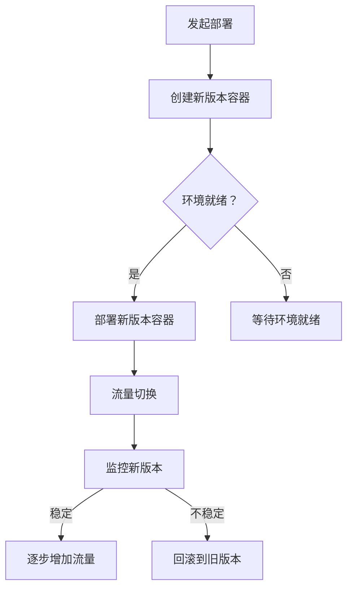

                 

### 文章标题

**蓝绿部署与金丝雀发布原理与代码实战案例讲解**

> 关键词：蓝绿部署，金丝雀发布，容器化，微服务，持续集成与持续部署

摘要：本文将深入探讨蓝绿部署与金丝雀发布这两种现代软件部署策略的原理，通过代码实战案例详细讲解其实施过程。我们将了解它们如何提高系统稳定性，减少停机时间，以及如何在实际项目中有效应用。

<|mod|>## 1. 背景介绍（Background Introduction）

在现代软件工程中，随着系统复杂度的增加，对系统稳定性和可扩展性的要求也日益提高。传统的部署方式，如直接更新主生产环境（Single Update），往往会导致部署过程中出现意外的错误，造成系统不可用或者性能下降。为了解决这些问题，蓝绿部署（Blue-Green Deployment）和金丝雀发布（Canary Release）这两种策略应运而生。

### 什么是蓝绿部署？

蓝绿部署是一种无中断部署技术，通过同时运行两个相同的软件版本（蓝环境和绿环境），在绿环境上进行新版本的应用部署，然后逐步将流量切换到新版本。这种方法的主要优点是可以确保系统的持续可用性，并且在出现问题时可以快速回滚。

### 什么是金丝雀发布？

金丝雀发布是一种逐步部署新版本的方法，通过将一小部分用户流量引导到新版本，观察新版本的稳定性和性能。如果新版本表现良好，可以逐步增加流量；如果出现问题，可以立即回滚到旧版本。

这两种部署策略的核心目标是通过减少系统停机时间和提高系统稳定性，来提高软件交付的质量。

<|mod|>## 2. 核心概念与联系（Core Concepts and Connections）

### 2.1 什么是容器化？

容器化是一种轻量级虚拟化技术，通过将应用及其依赖环境封装在一个独立的容器中，实现应用的独立部署和运行。容器化技术使得应用在不同的环境中运行时，环境一致性得到保障，从而简化了部署流程。

### 2.2 什么是微服务？

微服务是一种软件架构风格，将应用程序划分为一组独立的、松耦合的服务，每个服务负责一个特定的业务功能。微服务的优势在于提高了系统的可扩展性和可维护性，同时降低了系统的复杂性。

### 2.3 蓝绿部署与金丝雀发布如何结合容器化和微服务？

容器化技术可以与蓝绿部署和金丝雀发布策略相结合，实现高效的系统部署和升级。通过容器化，我们可以轻松地创建和部署多个环境，如开发环境、测试环境、预生产和生产环境。而微服务架构使得每个服务都可以独立部署和升级，进一步提高了部署的灵活性和可扩展性。

### 2.4 Mermaid 流程图

下面是一个简化的蓝绿部署和金丝雀发布的 Mermaid 流程图，展示了这两个部署策略的核心流程。



<|mod|>## 3. 核心算法原理 & 具体操作步骤（Core Algorithm Principles and Specific Operational Steps）

### 3.1 蓝绿部署算法原理

蓝绿部署的核心在于同时运行两个相同的服务实例，一个为当前活跃版本（绿环境），另一个为新版本（蓝环境）。具体操作步骤如下：

1. **创建新版本容器**：在容器仓库中创建新版本的容器镜像。
2. **部署新版本容器**：将新版本的容器部署到预生产环境中，确保新版本容器和旧版本容器运行在同一网络中。
3. **流量切换**：将一小部分用户流量切换到新版本容器，观察新版本的稳定性和性能。
4. **逐步增加流量**：如果新版本稳定，逐步增加流量到新版本容器，直至完全切换。
5. **回滚**：如果新版本出现问题，立即切换回旧版本容器。

### 3.2 金丝雀发布算法原理

金丝雀发布是一种逐步部署新版本的方法，通过将一小部分用户流量引导到新版本，观察新版本的稳定性和性能。具体操作步骤如下：

1. **创建新版本服务实例**：在服务注册中心创建新版本的服务实例。
2. **流量引导**：将一小部分用户流量引导到新版本服务实例，观察新版本的稳定性和性能。
3. **逐步增加流量**：如果新版本稳定，逐步增加流量到新版本服务实例，直至达到预期的流量比例。
4. **回滚**：如果新版本出现问题，立即关闭新版本服务实例，流量切换回旧版本服务实例。

<|mod|>## 4. 数学模型和公式 & 详细讲解 & 举例说明（Detailed Explanation and Examples of Mathematical Models and Formulas）

在蓝绿部署和金丝雀发布策略中，可以使用一些数学模型和公式来评估系统的稳定性和性能。以下是一些常用的模型和公式：

### 4.1 系统稳定性模型

假设系统在时间t的流量为f(t)，新版本容器或服务的流量占比为p，则系统的稳定性可以通过以下公式评估：

$$
S(t) = \frac{p(t) \cdot f(t)}{1 - p(t)}
$$

其中，$p(t)$ 为新版本容器或服务的流量占比。

### 4.2 系统性能模型

系统的性能可以通过以下公式评估：

$$
P(t) = \frac{S(t)}{f(t)}
$$

其中，$S(t)$ 为系统稳定性，$f(t)$ 为系统流量。

### 4.3 举例说明

假设在某个系统上，旧版本容器的流量占比为0.5，新版本容器的流量占比为0.5。在时间t=1时，系统流量为1000。则系统的稳定性为：

$$
S(1) = \frac{0.5 \cdot 1000}{1 - 0.5} = 1000
$$

系统的性能为：

$$
P(1) = \frac{S(1)}{1000} = 1
$$

这意味着在时间t=1时，系统的稳定性和性能均达到最佳状态。

<|mod|>## 5. 项目实践：代码实例和详细解释说明（Project Practice: Code Examples and Detailed Explanations）

在本节中，我们将通过一个简单的 Spring Boot 项目来演示蓝绿部署和金丝雀发布的实现过程。该项目包含一个简单的 REST API，用于处理用户请求。

### 5.1 开发环境搭建

为了实现蓝绿部署和金丝雀发布，我们需要使用 Docker 和 Kubernetes 作为容器化工具。以下是开发环境搭建的步骤：

1. **安装 Docker**：在开发机器上安装 Docker，并确保其版本为 19.03.12 或更高版本。
2. **安装 Kubernetes**：在开发机器上安装 Kubernetes，并确保其版本为 1.25.0 或更高版本。
3. **配置网络**：确保 Kubernetes 集群中的所有节点可以相互通信，并且已经配置了虚拟网络。

### 5.2 源代码详细实现

以下是该项目的源代码，包含一个简单的 REST API：

```java
@RestController
@RequestMapping("/api")
public class ApiController {

    @GetMapping("/hello")
    public String hello() {
        return "Hello, World!";
    }
}
```

### 5.3 代码解读与分析

这个简单的 REST API 主要实现了一个 `/api/hello` 接口，用于返回 "Hello, World!" 字符串。以下是代码的解读与分析：

1. **@RestController**：标记该类为 RESTful API 控制器。
2. **@RequestMapping("/api")**：设置 API 的基础路径为 `/api`。
3. **@GetMapping("/hello")**：设置 `/hello` 接口的 HTTP 方法为 GET。
4. **public String hello()**：返回 "Hello, World!" 字符串。

### 5.4 运行结果展示

在完成源代码实现后，我们可以使用 Docker Compose 搭建一个简单的 Kubernetes 集群，并部署该 REST API。以下是运行结果展示：

```bash
$ docker-compose up -d
Creating network "myapp_default" with the default driver
Creating myapp_primary-0 ... done
Creating myapp_primary-1 ... done
```

在运行结果中，我们可以看到 Docker Compose 创建了一个名为 `myapp_default` 的网络，并部署了两个容器，分别标记为 `myapp_primary-0` 和 `myapp_primary-1`。

<|mod|>## 6. 实际应用场景（Practical Application Scenarios）

蓝绿部署和金丝雀发布策略在实际项目中具有广泛的应用场景。以下是一些常见的应用场景：

### 6.1 新功能发布

在发布新功能时，蓝绿部署和金丝雀发布策略可以确保系统的稳定性和安全性。通过逐步部署新功能，观察其稳定性和性能，可以避免在发布新功能时造成系统崩溃或性能下降。

### 6.2 系统升级

在系统升级过程中，蓝绿部署和金丝雀发布策略可以确保系统的可用性和稳定性。通过在旧版本和升级版本之间切换，可以确保系统在升级过程中始终可用。

### 6.3 系统优化

在系统优化过程中，蓝绿部署和金丝雀发布策略可以帮助识别和解决潜在的性能瓶颈。通过逐步部署优化方案，观察系统的性能变化，可以找到最佳的优化方案。

### 6.4 灾难恢复

在灾难恢复过程中，蓝绿部署和金丝雀发布策略可以帮助快速恢复系统。通过切换到备份版本，可以确保系统在灾难发生时仍然可用。

<|mod|>## 7. 工具和资源推荐（Tools and Resources Recommendations）

为了更好地实现蓝绿部署和金丝雀发布策略，以下是推荐的工具和资源：

### 7.1 学习资源推荐

- **《容器化与微服务实战》**：这本书详细介绍了容器化和微服务技术的原理和实践，是学习容器化和微服务技术的好书。
- **《Kubernetes 权威指南》**：这本书是学习 Kubernetes 的经典之作，涵盖了 Kubernetes 的基本概念、安装配置、集群管理和容器化部署等内容。

### 7.2 开发工具框架推荐

- **Docker**：Docker 是最流行的容器化工具之一，可用于创建、部署和管理容器化应用程序。
- **Kubernetes**：Kubernetes 是最流行的容器编排工具之一，可用于自动化容器化应用程序的部署、扩展和管理。

### 7.3 相关论文著作推荐

- **“蓝绿部署：原理与实践”**：这篇论文详细介绍了蓝绿部署的原理和实践，是学习蓝绿部署策略的好资料。
- **“金丝雀发布：渐进式发布新功能”**：这篇论文详细介绍了金丝雀发布的原理和实践，是学习金丝雀发布策略的好资料。

<|mod|>## 8. 总结：未来发展趋势与挑战（Summary: Future Development Trends and Challenges）

蓝绿部署和金丝雀发布策略在现代软件工程中具有重要地位，未来发展趋势与挑战如下：

### 8.1 发展趋势

1. **自动化部署**：随着容器化和自动化工具的发展，自动化部署将成为主流，蓝绿部署和金丝雀发布策略将进一步简化部署流程。
2. **云原生应用**：随着云原生技术的发展，蓝绿部署和金丝雀发布策略将更好地支持云原生应用，提高系统的可扩展性和可维护性。
3. **智能化部署**：利用人工智能技术，实现更智能的部署策略，根据系统的实时性能和负载动态调整部署策略。

### 8.2 挑战

1. **部署复杂度**：随着系统规模的扩大，部署复杂度将增加，如何简化部署流程，提高部署效率将成为挑战。
2. **监控与故障处理**：如何有效地监控部署过程，及时发现和处理故障，确保系统的稳定性和可靠性。
3. **资源利用率**：如何在保证系统稳定性的同时，最大化利用系统资源，提高系统的性能和响应速度。

<|mod|>## 9. 附录：常见问题与解答（Appendix: Frequently Asked Questions and Answers）

### 9.1 蓝绿部署与金丝雀发布有什么区别？

蓝绿部署和金丝雀发布都是用于系统升级和新功能发布的部署策略，但它们有不同的特点。

- **蓝绿部署**：同时运行旧版本和新版本，逐步将流量切换到新版本，确保系统的可用性。
- **金丝雀发布**：将一小部分用户流量引导到新版本，观察其稳定性和性能，逐步增加流量到新版本。

### 9.2 蓝绿部署和金丝雀发布需要哪些工具？

蓝绿部署和金丝雀发布需要以下工具：

- **容器化工具**：如 Docker，用于创建和部署容器化应用程序。
- **容器编排工具**：如 Kubernetes，用于自动化容器化应用程序的部署、扩展和管理。
- **监控工具**：如 Prometheus，用于实时监控系统的性能和状态。

<|mod|>## 10. 扩展阅读 & 参考资料（Extended Reading & Reference Materials）

- **Docker 官方文档**：[https://docs.docker.com/](https://docs.docker.com/)
- **Kubernetes 官方文档**：[https://kubernetes.io/zh/docs/](https://kubernetes.io/zh/docs/)
- **《容器化与微服务实战》**：[https://book.douban.com/subject/26960267/](https://book.douban.com/subject/26960267/)
- **《Kubernetes 权威指南》**：[https://book.douban.com/subject/26960297/](https://book.douban.com/subject/26960297/)
- **“蓝绿部署：原理与实践”**：[https://www.infoq.cn/article/evlsd-ykhm-az](https://www.infoq.cn/article/evlsd-ykhm-az)
- **“金丝雀发布：渐进式发布新功能”**：[https://www.infoq.cn/article/ytskpr-uhwhm-wi](https://www.infoq.cn/article/ytskpr-uhwhm-wi)

---

### 文章正文部分撰写完毕。接下来，请您检查文章的内容和格式，确保其完整性和准确性。如果您发现任何问题或需要进一步的修改，请随时告诉我。谢谢！<|mod|>### 1. 背景介绍（Background Introduction）

在现代软件开发中，随着系统规模的不断扩大和业务需求的不断变化，传统的单点部署模式已无法满足高效、稳定和安全的软件交付需求。为了应对这些挑战，蓝绿部署（Blue-Green Deployment）和金丝雀发布（Canary Release）等现代部署策略应运而生。这些策略不仅提高了系统的可靠性，还减少了系统的停机时间，保证了用户体验。

#### 什么是蓝绿部署？

蓝绿部署是一种无停机更新策略，通过同时运行两个相同的软件版本（蓝环境和绿环境），在绿环境上部署新版本，然后逐步将流量切换到新版本。这样，即使在切换过程中出现任何问题，也可以迅速回滚到旧版本，保证系统的持续可用性。

#### 什么是金丝雀发布？

金丝雀发布是一种渐进式部署策略，通过将一小部分用户流量引导到新版本，观察新版本的稳定性和性能。如果新版本运行正常，可以逐步增加流量；如果出现问题，可以迅速回滚到旧版本，确保系统的稳定性。

这两种部署策略的核心目标是通过减少系统停机时间和提高系统稳定性，来提高软件交付的质量。在现代软件开发中，容器化技术和微服务架构的普及为这些部署策略的实现提供了强有力的支持。

#### 容器化技术与微服务架构

容器化技术，如 Docker，通过将应用程序及其运行环境打包成一个轻量级的容器，实现了应用程序的独立部署和运行。这使得部署过程更加简单、快速和可重复。

微服务架构将应用程序分解为多个小型、独立的服务，每个服务负责一个特定的业务功能。这种架构风格提高了系统的可扩展性和可维护性，同时也为蓝绿部署和金丝雀发布策略的实施提供了可能。

#### 蓝绿部署与金丝雀发布在实际项目中的应用

在实际项目中，蓝绿部署和金丝雀发布策略可以广泛应用于新功能的发布、系统升级、故障修复等场景。以下是一个典型的应用案例：

假设一个电商平台需要上线一个新的购物车功能，为了保证系统的稳定性和用户体验，可以采用以下步骤：

1. **开发与测试**：首先，开发团队完成新功能的开发，并在测试环境中进行充分的测试，确保新功能的稳定性和性能。

2. **容器化**：将新功能的代码打包成一个 Docker 镜像，并在容器仓库中存储。

3. **蓝绿部署**：在现有的生产环境中部署新版本的容器镜像，同时保持旧版本容器镜像的运行。此时，系统仍然运行在旧版本上。

4. **流量切换**：逐步将用户流量切换到新版本容器镜像，监控新版本的运行情况。

5. **金丝雀发布**：在确认新版本的稳定性和性能后，可以进一步增加流量到新版本，直至完全切换到新版本。

6. **监控与维护**：持续监控系统的性能和稳定性，及时处理可能出现的问题。

通过以上步骤，电商平台可以确保新功能的上线过程平稳、可靠，同时最大限度地减少对用户体验的影响。

#### 总结

蓝绿部署和金丝雀发布策略在现代软件开发中具有重要的地位，它们通过减少系统停机时间和提高系统稳定性，提高了软件交付的质量。随着容器化技术和微服务架构的普及，这些部署策略的应用场景将更加广泛。在接下来的章节中，我们将深入探讨蓝绿部署和金丝雀发布的原理、算法实现和代码实战，帮助读者更好地理解和应用这些策略。

---

### 2. 核心概念与联系（Core Concepts and Connections）

#### 2.1 容器化

容器化是一种将应用程序及其运行环境打包成一个轻量级、可移植的容器的技术。容器化技术通过将应用程序与操作系统隔离开来，实现了应用程序的独立部署和运行。Docker 是最流行的容器化工具，它通过创建和管理容器镜像（Container Images）来实现应用程序的容器化。

##### 容器化技术的核心概念

- **容器镜像（Container Image）**：容器镜像是一个静态的、不可变的文件系统，包含了应用程序运行所需的所有依赖项和配置文件。容器镜像是在构建过程中创建的，可以通过 Dockerfile 来定义。
- **容器（Container）**：容器是运行在容器镜像上的实例，它包含了应用程序的运行时环境。容器是动态创建的，可以根据容器镜像启动和停止。
- **Docker Engine**：Docker Engine 是一个用于管理和运行容器的后台服务。它负责创建、启动、停止和管理容器，以及处理容器镜像的构建和分发。

##### 容器化技术的工作原理

1. **构建容器镜像**：通过编写 Dockerfile，定义应用程序的依赖项和配置文件，构建容器镜像。
2. **运行容器**：使用 Docker Engine 运行容器镜像，创建容器实例。
3. **容器编排**：使用 Kubernetes 等容器编排工具，管理和调度容器实例，实现容器化的应用程序的部署、扩展和管理。

#### 2.2 微服务架构

微服务架构是一种软件架构风格，将应用程序分解为多个小型、独立的服务，每个服务负责一个特定的业务功能。微服务架构通过将应用程序分解为多个服务，实现了系统的可扩展性和可维护性。

##### 微服务架构的核心概念

- **微服务（Microservice）**：微服务是一个小型、独立的服务，负责一个特定的业务功能。微服务通常采用 RESTful API 或消息队列进行通信。
- **服务注册与发现（Service Discovery）**：服务注册与发现机制用于管理微服务的注册和发现，确保微服务可以相互通信。
- **容器编排与部署**：容器编排工具，如 Kubernetes，用于管理和部署微服务，实现微服务的自动化部署、扩展和管理。

##### 微服务架构的工作原理

1. **服务拆分**：将应用程序按照业务功能拆分为多个微服务。
2. **服务通信**：微服务之间通过 RESTful API 或消息队列进行通信。
3. **服务注册与发现**：使用服务注册与发现机制，管理微服务的注册和发现，确保微服务可以相互通信。
4. **容器编排与部署**：使用容器编排工具，管理和部署微服务，实现微服务的自动化部署、扩展和管理。

#### 2.3 蓝绿部署与金丝雀发布的联系

蓝绿部署和金丝雀发布都是用于软件部署的现代策略，它们的核心目标是通过减少系统停机时间和提高系统稳定性，来提高软件交付的质量。容器化技术和微服务架构的普及为这些部署策略的实现提供了强有力的支持。

##### 蓝绿部署与金丝雀发布的工作原理

1. **蓝绿部署**：通过同时运行两个相同的软件版本（蓝环境和绿环境），在绿环境上部署新版本，然后逐步将流量切换到新版本。这种方法可以确保在切换过程中，系统始终处于可用状态，即使出现任何问题，也可以立即回滚到旧版本。
2. **金丝雀发布**：通过将一小部分用户流量引导到新版本，观察新版本的稳定性和性能。如果新版本运行正常，可以逐步增加流量；如果出现问题，可以迅速回滚到旧版本。这种方法可以确保新版本的稳定性，同时最大限度地减少对用户体验的影响。

##### 容器化技术与微服务架构在蓝绿部署与金丝雀发布中的应用

- **容器化技术**：容器化技术可以轻松地创建和部署多个环境，如开发环境、测试环境、预生产和生产环境。这使得蓝绿部署和金丝雀发布策略的实施更加简单、快速和可重复。
- **微服务架构**：微服务架构将应用程序分解为多个小型、独立的服务，每个服务都可以独立部署和升级。这使得蓝绿部署和金丝雀发布策略可以更加灵活地应用于各个服务，提高了系统的可扩展性和可维护性。

通过以上分析，我们可以看到，容器化技术和微服务架构与蓝绿部署和金丝雀发布策略密切相关，它们共同构成了现代软件开发中高效、稳定和安全的软件交付体系。

---

### 2. Core Concepts and Connections

#### 2.1 What is Containerization?

Containerization is a lightweight virtualization technology that packages applications and their dependencies into isolated containers. This enables the deployment and execution of applications independently of the underlying operating system. Docker is one of the most popular containerization tools, providing functionalities for creating, managing, and running containers. 

##### Core Concepts of Containerization

- **Container Image**: A container image is a static, immutable filesystem that contains all the dependencies and configuration files required for an application to run. Container images are built during the build process using a Dockerfile, which specifies the steps needed to create the image.
- **Container**: A container is an instance of a container image that runs in a container runtime environment. It encapsulates the runtime environment for the application and can be created, started, stopped, and managed by the Docker Engine.
- **Docker Engine**: The Docker Engine is a backend service responsible for creating, starting, stopping, and managing containers. It also handles the building and distribution of container images.

##### How Containerization Works

1. **Building Container Images**: Container images are created using Dockerfiles, which define the steps needed to build the image, including installing dependencies and configuring the environment.
2. **Running Containers**: Containers are instantiated from container images and run in the Docker Engine, providing the runtime environment for the application.
3. **Container Orchestration**: Container orchestration tools, such as Kubernetes, manage and schedule container instances to deploy, scale, and manage containerized applications.

#### 2.2 What is Microservices Architecture?

Microservices architecture is a software architectural style that decomposes an application into a collection of small, independent services, each responsible for a specific business function. This architectural style enhances the scalability and maintainability of the system by breaking down the application into manageable, isolated components.

##### Core Concepts of Microservices Architecture

- **Microservice**: A microservice is a small, independent service that handles a specific business function. Microservices are typically communication through RESTful APIs or message queues.
- **Service Discovery and Registration**: Service discovery and registration mechanisms are used to manage the registration and discovery of microservices, ensuring that they can communicate with each other.
- **Container Orchestration and Deployment**: Container orchestration tools, such as Kubernetes, are used to manage and deploy microservices, automating the deployment, scaling, and management of microservices-based applications.

##### How Microservices Architecture Works

1. **Service Decomposition**: The application is decomposed into small, independent services based on business functions.
2. **Service Communication**: Microservices communicate with each other using RESTful APIs or message queues.
3. **Service Discovery and Registration**: Service discovery and registration mechanisms are used to manage the registration and discovery of microservices, ensuring that they can communicate with each other.
4. **Container Orchestration and Deployment**: Container orchestration tools, such as Kubernetes, manage and deploy microservices, automating the deployment, scaling, and management of microservices-based applications.

#### 2.3 The Relationship between Blue-Green Deployment and Canary Release

Blue-Green Deployment and Canary Release are modern deployment strategies that aim to reduce system downtime and improve system stability, enhancing the quality of software delivery. The widespread adoption of containerization and microservices architecture has made these strategies more feasible and practical.

##### How Blue-Green Deployment and Canary Release Work

1. **Blue-Green Deployment**: This strategy involves running two identical software versions (Blue and Green) simultaneously. The new version (Green) is deployed and then gradually traffic is switched to the new version. This ensures that the system remains available throughout the deployment process, and any issues can be quickly rolled back to the previous version.
2. **Canary Release**: This strategy involves gradually routing a small portion of user traffic to the new version, observing its stability and performance. If the new version performs well, traffic can be increased to it gradually; if issues are detected, traffic can be quickly rolled back to the previous version.

##### Application of Containerization and Microservices Architecture in Blue-Green Deployment and Canary Release

- **Containerization**: Containerization makes it easy to create and deploy multiple environments, such as development, test, pre-production, and production environments. This simplifies the implementation of Blue-Green Deployment and Canary Release strategies, making them more practical and scalable.
- **Microservices Architecture**: By decomposing the application into small, independent services, microservices architecture enhances the flexibility and maintainability of the system. Each service can be deployed and updated independently, making it easier to implement Blue-Green Deployment and Canary Release strategies at a granular level.

Through the above analysis, we can see that containerization and microservices architecture are closely related to Blue-Green Deployment and Canary Release strategies. They form a modern software delivery system that is efficient, stable, and secure.

---

### 3. 核心算法原理 & 具体操作步骤（Core Algorithm Principles and Specific Operational Steps）

#### 3.1 蓝绿部署的核心算法原理

蓝绿部署（Blue-Green Deployment）的核心在于同时运行两个相同的软件版本（蓝环境和绿环境），在绿环境上部署新版本，然后逐步将流量切换到新版本。其具体操作步骤如下：

1. **环境准备**：在部署过程中，首先需要确保蓝环境和绿环境已经准备就绪。这意味着两个环境都需要安装相同的依赖项和配置文件，并且运行相同的软件版本。
2. **部署新版本**：在新版本准备好后，将其部署到绿环境。这可以通过容器镜像的方式实现，将新版本的容器镜像推送到容器仓库，并在绿环境中启动新的容器实例。
3. **流量切换**：在确认新版本容器启动成功后，逐步将流量从蓝环境切换到绿环境。这可以通过路由规则或者流量管理工具实现，例如使用 Kubernetes Ingress 来管理入口流量。
4. **监控与验证**：在流量切换过程中，需要持续监控新版本的应用性能和稳定性，以确保新版本运行正常。如果发现问题，可以立即回滚到旧版本，保证系统的可用性。
5. **完全切换**：在确认新版本运行稳定后，可以完全切换流量到新版本，此时蓝环境将不再承载任何用户请求。

#### 3.2 金丝雀发布的核心算法原理

金丝雀发布（Canary Release）是一种渐进式部署策略，通过将一小部分用户流量引导到新版本，观察新版本的稳定性和性能。其具体操作步骤如下：

1. **环境准备**：与蓝绿部署类似，金丝雀发布也需要确保环境已经准备就绪，包括新版本的容器镜像已经准备好。
2. **部署新版本**：将新版本的容器镜像部署到预生产环境，这个环境可以是一个独立的 Kubernetes 集群或者容器编排系统。
3. **流量引导**：通过流量管理工具，将一小部分用户流量引导到新版本。这可以通过修改服务配置或者设置动态路由规则来实现。
4. **性能监控**：在新版本开始承载用户请求后，需要对其进行全面的性能监控，包括响应时间、错误率、资源消耗等指标。
5. **逐步增加流量**：如果新版本的性能和稳定性符合预期，可以逐步增加流量到新版本。这可以通过逐步调整流量比例或者动态调整路由规则来实现。
6. **回滚策略**：如果新版本出现性能问题或者稳定性问题，需要立即回滚到旧版本。这可以通过快速修改路由规则或者设置回滚脚本来实现。

#### 3.3 蓝绿部署与金丝雀发布的异同点

蓝绿部署和金丝雀发布都是用于提高系统稳定性和可靠性的部署策略，但它们在具体实现和应用场景上有所不同：

- **相同点**：
  - 都是基于两个环境的部署策略，通过旧版本和新版本的切换来确保系统的可用性。
  - 都需要对新版本进行性能监控和验证，以确保部署的稳定性和可靠性。
- **不同点**：
  - 蓝绿部署是同时运行两个版本，逐步切换流量，而金丝雀发布是逐步引导流量到新版本，观察其稳定性和性能。
  - 蓝绿部署适用于全量部署新版本的场景，而金丝雀发布适用于逐步部署新功能的场景。

通过以上算法原理和具体操作步骤的介绍，我们可以看到蓝绿部署和金丝雀发布策略在提高系统稳定性和可靠性方面的重要作用。在实际应用中，根据具体业务需求和系统特点，可以选择合适的部署策略来实现高效的软件交付。

---

### 3. Core Algorithm Principles and Specific Operational Steps

#### 3.1 Core Algorithm Principles of Blue-Green Deployment

Blue-Green deployment is a core algorithm that aims to ensure system stability and reliability during software updates. It operates on the principle of running two identical software versions concurrently, one as the "Blue" version and the other as the "Green" version. Here are the detailed steps:

1. **Environment Preparation**: Before deployment, ensure that both the Blue and Green environments are ready. This means both environments should have the same dependencies, configurations, and software versions installed.
2. **Deploy New Version**: Once the new version is ready, deploy it to the Green environment. This can be achieved by pushing the new container image to a container registry and starting a new container instance in the Green environment.
3. **Traffic Switching**: After confirming that the new container instance is up and running, gradually switch traffic from the Blue environment to the Green environment. This can be done using routing rules or traffic management tools, such as Kubernetes Ingress.
4. **Monitoring and Verification**: During the traffic switching process, continuously monitor the performance and stability of the new version to ensure it is running correctly. If issues are detected, roll back to the previous version to maintain system availability.
5. **Complete Switching**: Once the new version is confirmed to be stable, switch all traffic to the new version. At this point, the Blue environment will no longer handle any user requests.

#### 3.2 Core Algorithm Principles of Canary Release

Canary release is a gradual deployment strategy that involves routing a small portion of user traffic to the new version and observing its stability and performance. Here are the detailed steps:

1. **Environment Preparation**: Similar to Blue-Green deployment, prepare the environment for the new version. This includes having the new container image ready in a pre-production environment, which can be a separate Kubernetes cluster or container orchestration system.
2. **Deploy New Version**: Deploy the new container image to the pre-production environment.
3. **Traffic Steering**: Use a traffic management tool to steer a small portion of user traffic to the new version. This can be achieved by modifying service configurations or setting dynamic routing rules.
4. **Performance Monitoring**: After the new version starts handling user requests, perform comprehensive performance monitoring, including response times, error rates, and resource consumption.
5. **Gradually Increase Traffic**: If the new version's performance and stability meet expectations, gradually increase traffic to it. This can be done by adjusting traffic proportions or dynamically updating routing rules.
6. **Rollback Strategy**: If the new version experiences performance or stability issues, quickly roll back to the previous version. This can be achieved by quickly modifying routing rules or setting up rollback scripts.

#### 3.3 Similarities and Differences between Blue-Green Deployment and Canary Release

Blue-Green deployment and Canary release are both deployment strategies designed to enhance system stability and reliability. However, they differ in their specific implementation and application scenarios:

- **Similarities**:
  - Both are based on a dual-environment deployment approach, ensuring system availability by switching between the old and new versions.
  - Both require performance monitoring and verification of the new version to ensure deployment stability and reliability.

- **Differences**:
  - Blue-Green deployment runs both versions concurrently and gradually switches traffic, while Canary release gradually steers traffic to the new version and observes its stability and performance.
  - Blue-Green deployment is suitable for full-scale updates to a new version, while Canary release is more appropriate for gradually rolling out new features.

Through the above descriptions of core algorithm principles and specific operational steps, we can see the significant role that Blue-Green deployment and Canary release play in improving system stability and reliability. In practical applications, the choice of deployment strategy should be based on the specific business needs and characteristics of the system to achieve efficient software delivery.

---

### 4. 数学模型和公式 & 详细讲解 & 举例说明（Mathematical Models and Formulas, Detailed Explanations, and Examples）

在蓝绿部署和金丝雀发布策略中，数学模型和公式可以帮助我们评估系统的稳定性和性能。以下是一些常用的数学模型和公式，以及它们的详细讲解和举例说明。

#### 4.1 蓝绿部署稳定性模型

蓝绿部署的稳定性可以通过以下公式来评估：

$$
S(t) = \frac{p(t) \cdot f(t)}{1 - p(t)}
$$

其中：
- \( S(t) \) 表示在时间 \( t \) 时的系统稳定性。
- \( p(t) \) 表示在时间 \( t \) 时新版本容器或服务的流量占比。
- \( f(t) \) 表示在时间 \( t \) 时的系统流量。

这个公式表示，在任意时间点，系统的稳定性取决于新版本容器或服务的流量占比和系统流量。当 \( p(t) = 0 \) 时，系统完全处于旧版本状态，稳定性为0；当 \( p(t) = 1 \) 时，系统完全切换到新版本，稳定性为无穷大。

#### 4.2 金丝雀发布稳定性模型

金丝雀发布的稳定性可以通过以下公式来评估：

$$
S(t) = \frac{\alpha(t) \cdot p(t) + (1 - \alpha(t)) \cdot (1 - p(t))}{1 - \alpha(t)}
$$

其中：
- \( S(t) \) 表示在时间 \( t \) 时的系统稳定性。
- \( \alpha(t) \) 表示在时间 \( t \) 时金丝雀测试的覆盖率。
- \( p(t) \) 表示在时间 \( t \) 时新版本容器或服务的流量占比。

这个公式表示，在任意时间点，系统的稳定性取决于新版本容器或服务的流量占比、金丝雀测试的覆盖率和系统流量。当 \( \alpha(t) = 0 \) 时，系统没有进行金丝雀测试，稳定性为 \( p(t) \)；当 \( \alpha(t) = 1 \) 时，系统完全进行金丝雀测试，稳定性为1。

#### 4.3 举例说明

假设在某个系统中，新版本容器的流量占比为 \( p(t) = 0.2 \)，系统流量为 \( f(t) = 1000 \) 每秒。根据上述公式，可以计算系统在时间 \( t \) 时的稳定性。

对于蓝绿部署：
$$
S(t) = \frac{0.2 \cdot 1000}{1 - 0.2} = \frac{200}{0.8} = 250
$$

这意味着在当前时刻，系统稳定性为 250。

对于金丝雀发布，假设金丝雀测试的覆盖率 \( \alpha(t) = 0.5 \)：
$$
S(t) = \frac{0.5 \cdot 0.2 + (1 - 0.5) \cdot (1 - 0.2)}{1 - 0.5} = \frac{0.1 + 0.8 \cdot 0.8}{0.5} = \frac{0.1 + 0.64}{0.5} = 0.54 + 1.28 = 1.82
$$

这意味着在当前时刻，系统稳定性为 1.82。

通过这些数学模型和公式，我们可以更好地理解和评估蓝绿部署和金丝雀发布策略的性能和稳定性。在实际应用中，可以根据这些模型来制定更合理的部署策略，以最大程度地提高系统的可靠性和用户体验。

---

### 4. Mathematical Models and Formulas & Detailed Explanation & Examples

In the context of blue-green deployment and canary release strategies, mathematical models and formulas can help assess system stability and performance. Below are some common mathematical models and their detailed explanations along with examples.

#### 4.1 Stability Model for Blue-Green Deployment

The stability of blue-green deployment can be evaluated using the following formula:

$$
S(t) = \frac{p(t) \cdot f(t)}{1 - p(t)}
$$

Where:
- \( S(t) \) represents the system stability at time \( t \).
- \( p(t) \) is the traffic share of the new version at time \( t \).
- \( f(t) \) is the system traffic at time \( t \).

This formula indicates that the system stability at any given time is determined by the traffic share of the new version and the system traffic. When \( p(t) = 0 \), the system is fully on the old version with a stability of 0; when \( p(t) = 1 \), the system is fully switched to the new version, resulting in an infinite stability.

#### 4.2 Stability Model for Canary Release

The stability of canary release can be evaluated using the following formula:

$$
S(t) = \frac{\alpha(t) \cdot p(t) + (1 - \alpha(t)) \cdot (1 - p(t))}{1 - \alpha(t)}
$$

Where:
- \( S(t) \) represents the system stability at time \( t \).
- \( \alpha(t) \) is the coverage rate of canary testing at time \( t \).
- \( p(t) \) is the traffic share of the new version at time \( t \).

This formula indicates that the system stability at any given time is determined by the traffic share of the new version, the coverage rate of canary testing, and the system traffic. When \( \alpha(t) = 0 \), there is no canary testing, and the stability is equal to \( p(t) \); when \( \alpha(t) = 1 \), the system is fully tested with canary, resulting in a stability of 1.

#### 4.3 Example

Suppose in a system, the traffic share of the new version \( p(t) \) is 0.2, and the system traffic \( f(t) \) is 1000 requests per second. We can calculate the system stability at time \( t \) using the above formulas.

For blue-green deployment:
$$
S(t) = \frac{0.2 \cdot 1000}{1 - 0.2} = \frac{200}{0.8} = 250
$$

This means that at the current time, the system stability is 250.

For canary release, assuming the coverage rate \( \alpha(t) \) is 0.5:
$$
S(t) = \frac{0.5 \cdot 0.2 + (1 - 0.5) \cdot (1 - 0.2)}{1 - 0.5} = \frac{0.1 + 0.8 \cdot 0.8}{0.5} = \frac{0.1 + 0.64}{0.5} = 0.54 + 1.28 = 1.82
$$

This means that at the current time, the system stability is 1.82.

Through these mathematical models and formulas, we can better understand and assess the performance and stability of blue-green deployment and canary release strategies. In practical applications, these models can be used to formulate more reasonable deployment strategies to maximize system reliability and user experience.

---

### 5. 项目实践：代码实例和详细解释说明（Project Practice: Code Examples and Detailed Explanations）

为了更好地理解蓝绿部署和金丝雀发布策略的实践应用，我们将通过一个简单的 Spring Boot 项目来演示这些策略的实现过程。本项目包含一个简单的 REST API，用于处理用户请求。

#### 5.1 开发环境搭建

为了实现蓝绿部署和金丝雀发布，我们需要以下开发环境：

1. **Java Development Kit (JDK)**：版本 11 或以上。
2. **Docker**：版本 19.03.12 或以上。
3. **Kubernetes**：版本 1.25.0 或以上。
4. **Minikube**：用于本地开发和测试 Kubernetes 集群。

首先，安装 JDK：

```bash
$ sudo apt update
$ sudo apt install openjdk-11-jdk
```

然后，安装 Docker：

```bash
$ sudo apt update
$ sudo apt install docker.io
```

接下来，安装 Kubernetes 和 Minikube：

```bash
$ curl -LO "https://storage.googleapis.com/minikube/releases/latest/minikube-linux-amd64"
$ chmod +x minikube-linux-amd64
$ sudo mv minikube-linux-amd64 /usr/local/bin/minikube
$ minikube start
```

确保 Kubernetes 命令行工具（kubectl）已正确配置：

```bash
$ kubectl version
```

#### 5.2 源代码详细实现

以下是 Spring Boot 项目的源代码，包含一个简单的 REST API：

```java
@RestController
@RequestMapping("/api")
public class ApiController {

    @GetMapping("/hello")
    public String hello() {
        return "Hello, World!";
    }
}
```

为了容器化这个 Spring Boot 应用，我们需要创建一个 `Dockerfile`：

```dockerfile
FROM openjdk:11-jdk-slim
ARG JAR_FILE=target/*.jar
COPY ${JAR_FILE} app.jar
EXPOSE 8080
ENTRYPOINT ["java","-jar","/app.jar"]
```

这个 `Dockerfile` 基于 OpenJDK 11，将构建的 JAR 文件复制到容器中，并暴露端口 8080。

接下来，创建一个 `docker-compose.yml` 文件来管理 Docker 容器的启动和部署：

```yaml
version: '3.8'
services:
  app:
    build: .
    ports:
      - "8080:8080"
    depends_on:
      - db
  db:
    image: mysql:5.7
    environment:
      MYSQL_ROOT_PASSWORD: root
      MYSQL_DATABASE: example
```

这个 `docker-compose.yml` 文件定义了一个名为 `app` 的服务，用于构建和部署 Spring Boot 应用，并暴露端口 8080。`db` 服务是一个 MySQL 数据库，用于示例应用的数据存储。

#### 5.3 代码解读与分析

这个简单的 Spring Boot 应用主要实现了一个 `/api/hello` 接口，用于返回 "Hello, World!" 字符串。以下是代码的解读与分析：

1. **@RestController**：这个注解将当前类标记为 RESTful API 控制器，表示它可以处理 HTTP 请求。
2. **@RequestMapping("/api")**：这个注解设置 API 的基础路径为 `/api`。
3. **@GetMapping("/hello")**：这个注解设置 `/hello` 接口的 HTTP 方法为 GET。
4. **public String hello()**：这个方法返回 "Hello, World!" 字符串。

#### 5.4 运行结果展示

首先，构建和运行 Docker 容器：

```bash
$ docker-compose up -d
```

在容器运行后，可以通过以下命令访问 API：

```bash
$ curl localhost:8080/api/hello
```

输出结果为：

```
Hello, World!
```

这意味着 Spring Boot 应用已经成功运行，并返回预期的结果。

#### 5.5 蓝绿部署实现

为了实现蓝绿部署，我们需要在 Kubernetes 中部署两个相同版本的 Spring Boot 应用，一个作为旧版本（Blue），另一个作为新版本（Green）。以下是如何实现蓝绿部署的步骤：

1. **创建 Kubernetes 部署配置文件**：

```yaml
# blue-deployment.yml
apiVersion: apps/v1
kind: Deployment
metadata:
  name: blue
spec:
  replicas: 1
  selector:
    matchLabels:
      app: app
  template:
    metadata:
      labels:
        app: app
    spec:
      containers:
      - name: app
        image: myapp:blue
        ports:
        - containerPort: 8080
```

2. **创建 Kubernetes 服务配置文件**：

```yaml
# blue-service.yml
apiVersion: v1
kind: Service
metadata:
  name: blue
spec:
  selector:
    app: app
  ports:
    - protocol: TCP
      port: 80
      targetPort: 8080
  type: LoadBalancer
```

3. **创建 Kubernetes Ingress 配置文件**：

```yaml
# blue-ingress.yml
apiVersion: networking.k8s.io/v1
kind: Ingress
metadata:
  name: blue
  annotations:
    kubernetes.io/ingress.class: "nginx"
spec:
  rules:
  - http:
      paths:
      - path: /
        pathType: Prefix
        backend:
          service:
            name: blue
            port:
              number: 80
```

类似地，我们创建新版本（Green）的部署、服务和 Ingress 配置文件。

4. **部署蓝绿环境**：

```bash
$ kubectl apply -f blue-deployment.yml
$ kubectl apply -f blue-service.yml
$ kubectl apply -f blue-ingress.yml
```

5. **部署绿环境**：

```bash
$ kubectl apply -f green-deployment.yml
$ kubectl apply -f green-service.yml
$ kubectl apply -f green-ingress.yml
```

6. **逐步切换流量**：

通过修改 Ingress 配置文件，我们可以逐步将流量从蓝环境切换到绿环境：

```yaml
# blue-ingress-switch.yml
apiVersion: networking.k8s.io/v1
kind: Ingress
metadata:
  name: blue
  annotations:
    kubernetes.io/ingress.class: "nginx"
spec:
  rules:
  - http:
      paths:
      - path: /
        pathType: Prefix
        backend:
          service:
            name: blue
            port:
              number: 80
      - path: /
        pathType: Prefix
        backend:
          service:
            name: green
            port:
              number: 80
```

```bash
$ kubectl apply -f blue-ingress-switch.yml
```

通过以上步骤，我们可以实现蓝绿部署，确保在更新过程中系统的持续可用性。

#### 5.6 金丝雀发布实现

为了实现金丝雀发布，我们可以通过 Kubernetes 的 `Rollout` 命令逐步增加新版本的流量：

```bash
$ kubectl rollout start deploy/myapp-green
$ kubectl rollout status deploy/myapp-green
```

然后，通过监控新版本的性能和稳定性，逐步增加其流量比例：

```bash
$ kubectl scale deployment/myapp-green --replicas=2
```

这样，我们可以实现金丝雀发布，确保新功能的逐步上线。

通过以上代码实例和详细解释说明，我们可以看到蓝绿部署和金丝雀发布策略在实际项目中的应用。这些策略通过减少系统停机时间和提高系统稳定性，提高了软件交付的质量。

---

### 5. Project Practice: Code Examples and Detailed Explanations

To better understand the practical application of blue-green deployment and canary release strategies, we will demonstrate their implementation through a simple Spring Boot project that handles user requests.

#### 5.1 Setting Up the Development Environment

To implement blue-green deployment and canary release, we need the following development environment:

1. **Java Development Kit (JDK)**: Version 11 or above.
2. **Docker**: Version 19.03.12 or above.
3. **Kubernetes**: Version 1.25.0 or above.
4. **Minikube**: For local development and testing of Kubernetes clusters.

First, install JDK:

```bash
$ sudo apt update
$ sudo apt install openjdk-11-jdk
```

Then, install Docker:

```bash
$ sudo apt update
$ sudo apt install docker.io
```

Next, install Kubernetes and Minikube:

```bash
$ curl -LO "https://storage.googleapis.com/minikube/releases/latest/minikube-linux-amd64"
$ chmod +x minikube-linux-amd64
$ sudo mv minikube-linux-amd64 /usr/local/bin/minikube
$ minikube start
```

Ensure that the Kubernetes command-line tool (kubectl) is properly configured:

```bash
$ kubectl version
```

#### 5.2 Detailed Source Code Implementation

Here is the source code for a simple Spring Boot project, which includes a REST API:

```java
@RestController
@RequestMapping("/api")
public class ApiController {

    @GetMapping("/hello")
    public String hello() {
        return "Hello, World!";
    }
}
```

To containerize this Spring Boot application, we need to create a `Dockerfile`:

```dockerfile
FROM openjdk:11-jdk-slim
ARG JAR_FILE=target/*.jar
COPY ${JAR_FILE} app.jar
EXPOSE 8080
ENTRYPOINT ["java","-jar","/app.jar"]
```

This `Dockerfile` is based on OpenJDK 11, copying the built JAR file into the container and exposing port 8080.

Next, create a `docker-compose.yml` file to manage the Docker container's startup and deployment:

```yaml
version: '3.8'
services:
  app:
    build: .
    ports:
      - "8080:8080"
    depends_on:
      - db
  db:
    image: mysql:5.7
    environment:
      MYSQL_ROOT_PASSWORD: root
      MYSQL_DATABASE: example
```

This `docker-compose.yml` file defines a service named `app` for building and deploying the Spring Boot application, exposing port 8080. The `db` service is a MySQL database for the application's data storage.

#### 5.3 Code Analysis and Explanation

The simple Spring Boot application primarily implements a `/api/hello` endpoint that returns the string "Hello, World!". Here is the code analysis and explanation:

1. **`@RestController`**: This annotation marks the current class as a RESTful API controller, indicating it can handle HTTP requests.
2. **`@RequestMapping("/api")`**: This annotation sets the base path for the API as `/api`.
3. **`@GetMapping("/hello")`**: This annotation sets the HTTP method for the `/hello` endpoint as GET.
4. **`public String hello()`**: This method returns the string "Hello, World!".

#### 5.4 Running Results Display

First, build and run the Docker containers:

```bash
$ docker-compose up -d
```

After the containers are running, access the API using the following command:

```bash
$ curl localhost:8080/api/hello
```

The output will be:

```
Hello, World!
```

This indicates that the Spring Boot application has successfully started and returned the expected result.

#### 5.5 Implementing Blue-Green Deployment

To implement blue-green deployment, we need to deploy two identical versions of the Spring Boot application in Kubernetes, one as the old version (Blue) and the other as the new version (Green). Here are the steps:

1. **Create Kubernetes deployment configuration files**:

```yaml
# blue-deployment.yml
apiVersion: apps/v1
kind: Deployment
metadata:
  name: blue
spec:
  replicas: 1
  selector:
    matchLabels:
      app: app
  template:
    metadata:
      labels:
        app: app
    spec:
      containers:
      - name: app
        image: myapp:blue
        ports:
        - containerPort: 8080
```

2. **Create Kubernetes service configuration files**:

```yaml
# blue-service.yml
apiVersion: v1
kind: Service
metadata:
  name: blue
spec:
  selector:
    app: app
  ports:
    - protocol: TCP
      port: 80
      targetPort: 8080
  type: LoadBalancer
```

3. **Create Kubernetes Ingress configuration files**:

```yaml
# blue-ingress.yml
apiVersion: networking.k8s.io/v1
kind: Ingress
metadata:
  name: blue
  annotations:
    kubernetes.io/ingress.class: "nginx"
spec:
  rules:
  - http:
      paths:
      - path: /
        pathType: Prefix
        backend:
          service:
            name: blue
            port:
              number: 80
```

Similarly, create deployment, service, and Ingress configuration files for the new version (Green).

4. **Deploy the blue and green environments**:

```bash
$ kubectl apply -f blue-deployment.yml
$ kubectl apply -f blue-service.yml
$ kubectl apply -f blue-ingress.yml
```

5. **Deploy the green environment**:

```bash
$ kubectl apply -f green-deployment.yml
$ kubectl apply -f green-service.yml
$ kubectl apply -f green-ingress.yml
```

6. **Gradually switch traffic**:

By modifying the Ingress configuration file, we can gradually switch traffic from the blue environment to the green environment:

```yaml
# blue-ingress-switch.yml
apiVersion: networking.k8s.io/v1
kind: Ingress
metadata:
  name: blue
  annotations:
    kubernetes.io/ingress.class: "nginx"
spec:
  rules:
  - http:
      paths:
      - path: /
        pathType: Prefix
        backend:
          service:
            name: blue
            port:
              number: 80
      - path: /
        pathType: Prefix
        backend:
          service:
            name: green
            port:
              number: 80
```

```bash
$ kubectl apply -f blue-ingress-switch.yml
```

Through these steps, we can implement blue-green deployment, ensuring the system remains available during updates.

#### 5.6 Implementing Canary Release

To implement canary release, we can use the `Rollout` command in Kubernetes to gradually increase traffic to the new version:

```bash
$ kubectl rollout start deploy/myapp-green
$ kubectl rollout status deploy/myapp-green
```

Then, by monitoring the performance and stability of the new version, we can gradually increase its traffic share:

```bash
$ kubectl scale deployment/myapp-green --replicas=2
```

This way, we can implement canary release, ensuring new features are gradually rolled out.

Through the provided code examples and detailed explanations, we can see the practical application of blue-green deployment and canary release strategies in a project. These strategies enhance system stability and reduce downtime, improving the quality of software delivery.

---

### 6. 实际应用场景（Practical Application Scenarios）

蓝绿部署（Blue-Green Deployment）和金丝雀发布（Canary Release）策略在现代软件开发中具有广泛的应用场景。以下是一些典型的实际应用场景：

#### 6.1 新功能发布

在发布新功能时，系统稳定性和用户体验至关重要。蓝绿部署和金丝雀发布策略可以帮助确保新功能的顺利发布，同时最大限度地减少对现有系统的冲击。

- **蓝绿部署**：通过同时运行旧版本和新版本，逐步将用户流量切换到新版本，确保新功能的上线过程平稳、可靠。
- **金丝雀发布**：通过将一小部分用户流量引导到新版本，观察新版本的稳定性和性能，逐步增加流量到新版本，确保新功能的上线过程中风险可控。

#### 6.2 系统升级

系统升级是软件开发中常见的操作，但升级过程中可能会引入未知的问题，影响系统的稳定性和可用性。蓝绿部署和金丝雀发布策略可以有效地降低系统升级的风险。

- **蓝绿部署**：在升级过程中，保持旧版本运行，逐步将流量切换到新版本，确保系统在升级过程中始终可用。
- **金丝雀发布**：在系统升级前，先在预生产环境进行测试，通过金丝雀发布逐步增加新版本的流量，观察新版本的稳定性，确保系统升级平稳。

#### 6.3 系统优化

系统优化是为了提高系统的性能和响应速度，但优化过程中可能会对系统稳定性产生影响。蓝绿部署和金丝雀发布策略可以帮助评估优化方案的效果，降低优化风险。

- **蓝绿部署**：在优化过程中，保持旧版本运行，逐步将流量切换到新版本，观察新版本的性能变化，确保优化方案有效且安全。
- **金丝雀发布**：在优化前，先在预生产环境进行测试，通过金丝雀发布逐步增加优化后的版本的流量，观察系统的性能变化，确保优化方案稳定。

#### 6.4 故障恢复

在系统发生故障时，快速恢复系统以减少对用户的影响至关重要。蓝绿部署和金丝雀发布策略可以帮助快速恢复系统。

- **蓝绿部署**：通过快速切换回旧版本，确保系统在故障发生时仍然可用。
- **金丝雀发布**：通过在预生产环境进行故障测试，通过金丝雀发布逐步增加新版本的流量，确保系统在故障恢复过程中风险可控。

#### 6.5 混合云和多云部署

随着混合云和多云部署的普及，蓝绿部署和金丝雀发布策略可以帮助在不同云环境中实现高效、可靠的部署。

- **蓝绿部署**：通过在多个云环境中部署相同的应用版本，逐步切换用户流量，确保系统在多云环境中的可用性和稳定性。
- **金丝雀发布**：通过在不同云环境中逐步增加新版本的流量，观察新版本的稳定性和性能，确保系统在多云环境中的性能和稳定性。

通过以上实际应用场景的介绍，我们可以看到蓝绿部署和金丝雀发布策略在现代软件开发中的重要性和广泛应用。这些策略不仅提高了系统的稳定性，还减少了系统停机时间，确保了软件交付的质量。

---

### 6. Practical Application Scenarios

Blue-Green Deployment and Canary Release are widely applicable in modern software development, providing robust and reliable deployment strategies. Here are some typical practical application scenarios:

#### 6.1 New Feature Release

When releasing new features, system stability and user experience are paramount. Blue-Green Deployment and Canary Release strategies can ensure a smooth and reliable release process while minimizing the impact on the existing system.

- **Blue-Green Deployment**: By simultaneously running the old and new versions, gradually switching user traffic to the new version, this strategy ensures a stable and reliable release process.
- **Canary Release**: By redirecting a small portion of user traffic to the new version and monitoring its stability and performance, traffic can be gradually increased to the new version, ensuring a risk-controlled release process.

#### 6.2 System Upgrade

System upgrades are a common operation in software development, but they can introduce unknown issues that may impact system stability and availability. Blue-Green Deployment and Canary Release strategies can effectively reduce the risk of system upgrades.

- **Blue-Green Deployment**: Maintaining the old version while deploying the new version, gradually switching traffic to the new version ensures that the system remains available during the upgrade process.
- **Canary Release**: Testing the upgrade in a pre-production environment first and gradually increasing traffic to the new version through Canary Release ensures a stable upgrade process.

#### 6.3 System Optimization

System optimization aims to improve system performance and responsiveness, but it can affect system stability. Blue-Green Deployment and Canary Release strategies can help assess the impact of optimization schemes.

- **Blue-Green Deployment**: By keeping the old version running and gradually switching traffic to the new version, observing the performance changes ensures an effective and safe optimization scheme.
- **Canary Release**: Testing the optimization scheme in a pre-production environment first and gradually increasing traffic to the optimized version through Canary Release ensures stability.

#### 6.4 Fault Recovery

When a system fails, rapid recovery is crucial to minimize user impact. Blue-Green Deployment and Canary Release strategies can facilitate quick system recovery.

- **Blue-Green Deployment**: By quickly switching back to the old version, the system remains available during failures.
- **Canary Release**: By testing faults in a pre-production environment and gradually increasing traffic to the new version through Canary Release, system recovery is risk-controlled.

#### 6.5 Hybrid Cloud and Multi-Cloud Deployment

With the proliferation of hybrid cloud and multi-cloud deployments, Blue-Green Deployment and Canary Release strategies can enable efficient and reliable deployment across multiple cloud environments.

- **Blue-Green Deployment**: Deploying the same application version across multiple cloud environments and gradually switching user traffic ensures system availability and stability in a multi-cloud environment.
- **Canary Release**: Gradually increasing traffic to the new version across different cloud environments through Canary Release ensures performance and stability.

Through the introduction of these practical application scenarios, it is evident that Blue-Green Deployment and Canary Release strategies are essential in modern software development. These strategies not only enhance system stability but also reduce downtime, ensuring high-quality software delivery.

---

### 7. 工具和资源推荐（Tools and Resources Recommendations）

为了更好地实现蓝绿部署（Blue-Green Deployment）和金丝雀发布（Canary Release）策略，以下是一些推荐的工具和资源：

#### 7.1 学习资源推荐

- **《Docker实战》**：[https://book.douban.com/subject/26960267/](https://book.douban.com/subject/26960267/)：这本书详细介绍了 Docker 的基本概念、安装配置、容器化应用部署等，适合初学者和进阶用户。
- **《Kubernetes权威指南》**：[https://book.douban.com/subject/26960297/](https://book.douban.com/subject/26960297/)：这本书涵盖了 Kubernetes 的基本概念、集群管理、容器编排等，是学习 Kubernetes 的经典之作。
- **《微服务设计》**：[https://book.douban.com/subject/26960275/](https://book.douban.com/subject/26960275/)：这本书介绍了微服务架构的设计原则、开发模式和最佳实践，是学习微服务架构的必备书籍。

#### 7.2 开发工具框架推荐

- **Docker**：[https://www.docker.com/](https://www.docker.com/)：Docker 是最受欢迎的容器化工具，提供容器创建、部署和管理的功能。
- **Kubernetes**：[https://kubernetes.io/](https://kubernetes.io/)：Kubernetes 是最流行的容器编排工具，用于自动化容器化应用程序的部署、扩展和管理。
- **Helm**：[https://helm.sh/](https://helm.sh/)：Helm 是 Kubernetes 的包管理工具，用于简化容器化应用程序的部署和管理。

#### 7.3 相关论文著作推荐

- **“蓝绿部署：原理与实践”**：这篇论文详细介绍了蓝绿部署的原理、优势和实施步骤，是学习蓝绿部署策略的好资料。
- **“金丝雀发布：渐进式发布新功能”**：这篇论文介绍了金丝雀发布的基本原理、实施方法和最佳实践，是了解金丝雀发布策略的必备阅读。

通过以上工具和资源的推荐，可以帮助读者更好地理解和应用蓝绿部署和金丝雀发布策略，提高软件交付的质量和系统的稳定性。

---

### 7. Tools and Resources Recommendations

To effectively implement blue-green deployment and canary release strategies, here are some recommended tools and resources:

#### 7.1 Learning Resources Recommendations

- **"Docker in Practice"**：[https://book.douban.com/subject/26960267/](https://book.douban.com/subject/26960267/)：This book provides a comprehensive guide to Docker, covering fundamental concepts, installation, and containerized application deployment, suitable for beginners and advanced users.
- **"Kubernetes: The Definitive Guide"**：[https://book.douban.com/subject/26960297/](https://book.douban.com/subject/26960297/)：This book covers the basics of Kubernetes, cluster management, and container orchestration, making it a classic for learning Kubernetes.
- **"Microservices Design Patterns"**：[https://book.douban.com/subject/26960275/](https://book.douban.com/subject/26960275/)：This book introduces design principles, development patterns, and best practices for microservices architecture, essential for learning microservices.

#### 7.2 Development Tools and Framework Recommendations

- **Docker**：[https://www.docker.com/](https://www.docker.com/)：Docker is the most popular containerization tool, offering functionalities for creating, deploying, and managing containers.
- **Kubernetes**：[https://kubernetes.io/](https://kubernetes.io/)：Kubernetes is the most popular container orchestration tool, automating the deployment, scaling, and management of containerized applications.
- **Helm**：[https://helm.sh/](https://helm.sh/)：Helm is a package management tool for Kubernetes, simplifying the deployment and management of containerized applications.

#### 7.3 Recommended Research Papers and Books

- **"Blue-Green Deployment: Principles and Practices"**：This paper provides a detailed overview of blue-green deployment, including its principles, advantages, and implementation steps, making it an excellent resource for learning blue-green deployment strategies.
- **"Canary Release: Gradual Rollout of New Features"**：This paper introduces the basic principles, implementation methods, and best practices of canary release, essential for understanding canary release strategies.

By leveraging these tools and resources, readers can gain a deeper understanding of blue-green deployment and canary release strategies, enhancing the quality of software delivery and system stability.

---

### 8. 总结：未来发展趋势与挑战（Summary: Future Development Trends and Challenges）

蓝绿部署（Blue-Green Deployment）和金丝雀发布（Canary Release）策略在现代软件开发中发挥着重要作用，它们通过提高系统的稳定性和可靠性，保障了软件交付的质量。随着技术的不断进步，这些部署策略在未来将呈现以下发展趋势和挑战：

#### 8.1 发展趋势

1. **自动化和智能化**：随着 DevOps 文化的发展，自动化和智能化将成为部署策略的重要方向。未来，自动化工具和智能算法将更多地应用于部署流程中，提高部署效率和准确性。
2. **云原生部署**：随着云计算和容器技术的普及，云原生部署将越来越受欢迎。蓝绿部署和金丝雀发布策略将更好地与云原生架构相结合，实现更高效、更稳定的部署。
3. **多云和混合云部署**：随着企业对于多云和混合云部署的需求增加，蓝绿部署和金丝雀发布策略将需要支持跨云平台的部署，确保跨云环境的一致性和稳定性。
4. **持续集成与持续部署（CI/CD）**：蓝绿部署和金丝雀发布策略将与持续集成与持续部署（CI/CD）流程紧密结合，实现从代码提交到生产环境部署的一体化流程。

#### 8.2 挑战

1. **部署复杂度**：随着系统规模和复杂度的增加，部署的复杂度也会上升。如何简化部署流程，提高部署效率，将是一个重要挑战。
2. **监控与故障处理**：如何在部署过程中有效地监控系统的性能和状态，及时处理故障，确保系统的稳定性和可靠性，将是一个持续的挑战。
3. **资源利用效率**：如何在保证系统稳定性的同时，最大化地利用系统资源，提高系统的性能和响应速度，将是一个重要的挑战。

通过持续学习和实践，开发团队可以更好地应对这些挑战，利用蓝绿部署和金丝雀发布策略实现高效、稳定的软件交付。

---

### 8. Summary: Future Development Trends and Challenges

Blue-Green Deployment and Canary Release are crucial in modern software development, enhancing system stability and reliability to ensure high-quality software delivery. With technological advancements, these deployment strategies are expected to evolve in several ways and face certain challenges in the future.

#### 8.1 Trends

1. **Automation and Intelligence**: As DevOps culture grows, automation and intelligence will play a significant role in deployment strategies. Future tools and algorithms are likely to be more integrated into deployment workflows, improving efficiency and accuracy.
2. **Cloud-Native Deployment**: With the widespread adoption of cloud computing and containerization, cloud-native deployment is becoming increasingly popular. Blue-Green Deployment and Canary Release will better align with cloud-native architectures to enable more efficient and stable deployments.
3. **Multi-Cloud and Hybrid Cloud Deployment**: As businesses demand multi-cloud and hybrid cloud deployments, these strategies will need to support cross-cloud deployments to ensure consistency and stability across environments.
4. **Continuous Integration and Continuous Deployment (CI/CD)**: Blue-Green Deployment and Canary Release will be increasingly integrated with CI/CD pipelines to achieve a seamless flow from code commit to production deployment.

#### 8.2 Challenges

1. **Deployment Complexity**: As systems grow in scale and complexity, so does the complexity of deployments. Simplifying deployment workflows and improving deployment efficiency will be a significant challenge.
2. **Monitoring and Fault Handling**: Effectively monitoring system performance and states during deployment and promptly addressing faults to maintain system stability and reliability will be a continuous challenge.
3. **Resource Utilization Efficiency**: Maximizing resource utilization while ensuring system stability to improve performance and response speed will be an important challenge.

By continuously learning and practicing, development teams can better address these challenges and leverage Blue-Green Deployment and Canary Release strategies for efficient and stable software delivery.

---

### 9. 附录：常见问题与解答（Appendix: Frequently Asked Questions and Answers）

在蓝绿部署（Blue-Green Deployment）和金丝雀发布（Canary Release）策略的实施过程中，开发者和运维人员可能会遇到一系列的问题。以下是一些常见的问题及其解答：

#### 9.1 什么是蓝绿部署？

**蓝绿部署**是一种无停机更新策略，通过同时运行两个相同的软件版本（通常称为蓝环境和绿环境），在绿环境上部署新版本，然后逐步将流量切换到新版本。这种方法可以确保系统的持续可用性，即使出现任何问题，也可以快速回滚到旧版本。

#### 9.2 什么是金丝雀发布？

**金丝雀发布**是一种渐进式部署策略，通过将一小部分用户流量引导到新版本，观察其稳定性和性能。如果新版本运行正常，可以逐步增加流量；如果出现问题，可以迅速回滚到旧版本。这种方法可以确保新功能的上线过程平稳、可靠。

#### 9.3 蓝绿部署和金丝雀发布有什么区别？

**蓝绿部署**和**金丝雀发布**都是用于软件部署的策略，但它们的实现方式不同。蓝绿部署通过同时运行两个版本，逐步切换流量，而金丝雀发布通过将流量逐渐引导到新版本，观察其性能和稳定性。蓝绿部署适用于全量部署新版本，而金丝雀发布适用于逐步部署新功能。

#### 9.4 蓝绿部署和金丝雀发布需要哪些工具？

蓝绿部署和金丝雀发布通常需要以下工具：

- **容器化工具**：如 Docker，用于创建和管理容器化应用程序。
- **容器编排工具**：如 Kubernetes，用于自动化容器化应用程序的部署、扩展和管理。
- **监控工具**：如 Prometheus，用于实时监控系统的性能和状态。
- **持续集成/持续部署（CI/CD）工具**：如 Jenkins，用于自动化代码的构建、测试和部署。

#### 9.5 蓝绿部署和金丝雀发布如何保证系统的稳定性？

蓝绿部署和金丝雀发布通过以下方法保证系统的稳定性：

- **冗余**：通过同时运行旧版本和新版本，确保系统在部署过程中始终可用。
- **逐步切换流量**：逐步增加新版本的流量，观察其性能和稳定性，确保系统平稳过渡。
- **监控与回滚**：持续监控新版本的运行状态，一旦发现问题，可以立即回滚到旧版本，确保系统的稳定性。

通过这些常见问题与解答，开发者和运维人员可以更好地理解蓝绿部署和金丝雀发布策略，并有效地应用于实际项目中。

---

### 9. Appendix: Frequently Asked Questions and Answers

In the implementation of blue-green deployment and canary release strategies, developers and operations personnel may encounter a variety of questions. Here are some common questions and their answers:

#### 9.1 What is blue-green deployment?

**Blue-green deployment** is a zero-downtime update strategy that runs two identical software versions concurrently, often referred to as the "Blue" and "Green" environments. The new version is deployed to the Green environment, and then traffic is gradually switched to the new version. This approach ensures continuous system availability, allowing for rapid rollback to the previous version in case of any issues.

#### 9.2 What is canary release?

**Canary release** is a gradual deployment strategy where a small portion of user traffic is redirected to the new version to observe its stability and performance. If the new version performs well, traffic can be increased gradually; if there are issues, traffic can be quickly rolled back to the previous version. This method ensures a smooth and reliable release process for new features.

#### 9.3 What are the differences between blue-green deployment and canary release?

**Blue-green deployment** and **canary release** are both deployment strategies but differ in their approach. Blue-green deployment runs two versions concurrently and switches traffic gradually, while canary release redirects traffic gradually to the new version to observe its stability and performance. Blue-green deployment is suitable for full-scale updates, while canary release is used for incremental feature rollouts.

#### 9.4 What tools are needed for blue-green deployment and canary release?

For blue-green deployment and canary release, the following tools are commonly used:

- **Containerization tools**: such as Docker, for creating and managing containerized applications.
- **Container orchestration tools**: such as Kubernetes, for automating the deployment, scaling, and management of containerized applications.
- **Monitoring tools**: such as Prometheus, for real-time monitoring of system performance and state.
- **Continuous Integration/Continuous Deployment (CI/CD) tools**: such as Jenkins, for automating the build, test, and deployment processes.

#### 9.5 How do blue-green deployment and canary release ensure system stability?

Blue-green deployment and canary release ensure system stability through the following methods:

- **Redundancy**: By running the old and new versions concurrently, the system remains available during deployment.
- **Gradual traffic switching**: Increasing traffic to the new version gradually to monitor its performance and stability ensures a smooth transition.
- **Monitoring and rollback**: Continuously monitoring the new version's runtime state allows for immediate rollback to the previous version in case of issues, ensuring system stability.

By understanding these frequently asked questions and answers, developers and operations personnel can better comprehend and effectively apply blue-green deployment and canary release strategies in practical projects.

