                 

### 背景介绍（Background Introduction）

虚拟现实（Virtual Reality，简称 VR）技术是一种通过计算机模拟生成三维环境的交互式技术。它能够使用户沉浸在一个完全虚拟的三维空间中，并提供极其真实的视觉、听觉和触觉体验。随着计算能力的提升和显示技术的进步，VR技术逐渐从科幻领域走向现实生活，其在教育、娱乐、医疗、军事等多个领域的应用前景广阔。

本文旨在探讨虚拟现实（VR）技术的沉浸式体验设计，具体涵盖以下内容：

1. **核心概念与联系**：我们将首先介绍VR技术中的核心概念及其相互关系，并使用Mermaid流程图展示VR系统的架构。
2. **核心算法原理 & 具体操作步骤**：深入探讨实现沉浸式体验的关键算法，包括光场渲染、实时碰撞检测、运动追踪等，并详细描述其实现步骤。
3. **数学模型和公式 & 详细讲解 & 举例说明**：分析并讲解与VR体验设计相关的数学模型和公式，如三维几何变换、物理模拟等，并给出实例进行说明。
4. **项目实践：代码实例和详细解释说明**：通过具体项目实例展示VR应用的实现过程，包括开发环境搭建、源代码实现、代码解读与分析，以及运行结果展示。
5. **实际应用场景**：讨论VR技术在教育、医疗、娱乐等领域的应用，以及沉浸式体验在提升用户体验方面的作用。
6. **工具和资源推荐**：推荐相关学习资源、开发工具和框架，帮助读者深入了解VR技术。
7. **总结：未来发展趋势与挑战**：总结VR技术的发展趋势，并探讨其在未来可能面临的挑战。
8. **附录：常见问题与解答**：回答读者可能关注的一些常见问题。
9. **扩展阅读 & 参考资料**：提供进一步的阅读材料和参考资料。

虚拟现实技术不仅为用户提供了全新的交互方式，也为各种行业带来了创新的解决方案。通过本文的深入探讨，我们将全面了解VR技术如何打造沉浸式体验，并在实践中运用这些技术。

#### Keywords: Virtual Reality (VR), Immersive Experience Design, Core Concepts, Algorithm Principles, Mathematical Models, Project Practice, Application Scenarios, Tools and Resources, Future Trends and Challenges.

### Abstract:

Virtual Reality (VR) technology offers users an immersive and interactive experience through the creation of three-dimensional environments. This paper delves into the design of immersive experiences in VR, covering core concepts, algorithm principles, mathematical models, practical applications, and future trends. By exploring the architecture of VR systems, detailed algorithm implementations, and real-world examples, we aim to provide a comprehensive understanding of how VR can be harnessed to enhance user engagement across various domains. The paper concludes with a summary of VR's potential future developments and challenges, along with a list of recommended resources for further study. 

---

## 2. 核心概念与联系（Core Concepts and Connections）

虚拟现实（VR）技术的核心在于其能够模拟出高度逼真的三维环境，并使用户能够与之互动。为了理解VR系统的运作，我们需要首先掌握其中的几个核心概念，包括三维建模、传感器追踪、交互设计以及渲染技术。

### 2.1 三维建模（3D Modeling）

三维建模是VR技术的基石。它涉及使用软件工具创建三维物体和场景。这个过程包括以下几个关键步骤：

1. **几何建模**：使用点、线、面等基本元素构建三维物体的几何形状。
2. **材质贴图**：为三维物体添加纹理，使其在视觉上更加真实。
3. **场景布置**：将多个三维物体组合成复杂的场景，并设置它们的位置、大小和比例。

在图1中，我们使用Mermaid流程图来展示三维建模的基本步骤：

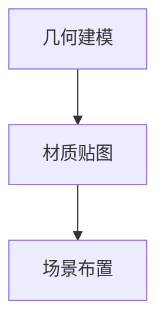

### 2.2 传感器追踪（Sensor Tracking）

传感器追踪是确保用户在VR环境中准确交互的关键。主要传感器包括：

1. **头部追踪器（Head Tracker）**：通常通过陀螺仪和加速度计实现，用于跟踪用户的头部运动。
2. **手部追踪器（Hand Tracker）**：通过运动捕捉技术跟踪用户手部的动作。
3. **位置追踪器（Position Tracker）**：用于确定用户在VR环境中的位置。

图2展示了VR传感器追踪系统的基本架构：

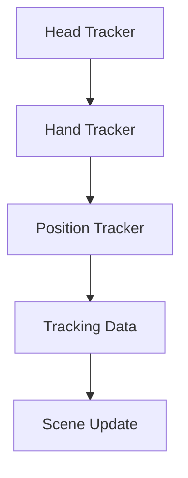

### 2.3 交互设计（Interactive Design）

交互设计是VR体验的核心，它决定了用户如何与虚拟环境互动。关键要素包括：

1. **用户界面（User Interface）**：设计直观易用的界面，使用户能够轻松操作。
2. **输入设备（Input Devices）**：如手柄、手套等，用于捕捉用户的动作。
3. **反馈机制（Feedback Mechanisms）**：通过声音、震动等手段为用户提供即时反馈。

图3展示了VR交互设计的几个关键组件：

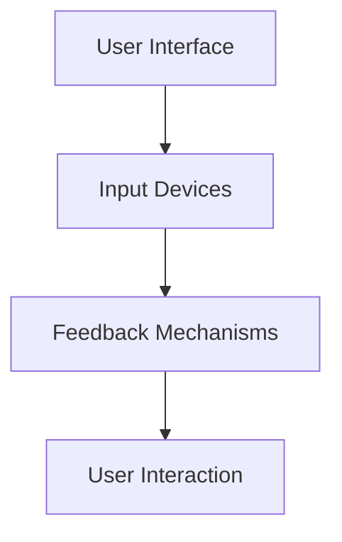

### 2.4 渲染技术（Rendering Techniques）

渲染技术用于将三维场景转换成可显示的图像。关键算法包括：

1. **光场渲染（Light Field Rendering）**：模拟光线在虚拟环境中的传播，提供逼真的光影效果。
2. **实时碰撞检测（Real-time Collision Detection）**：确保用户与虚拟物体间的交互是物理上合理的。
3. **运动追踪（Motion Tracking）**：实时跟踪用户动作，确保虚拟环境与用户动作同步。

图4展示了VR渲染技术的基本流程：

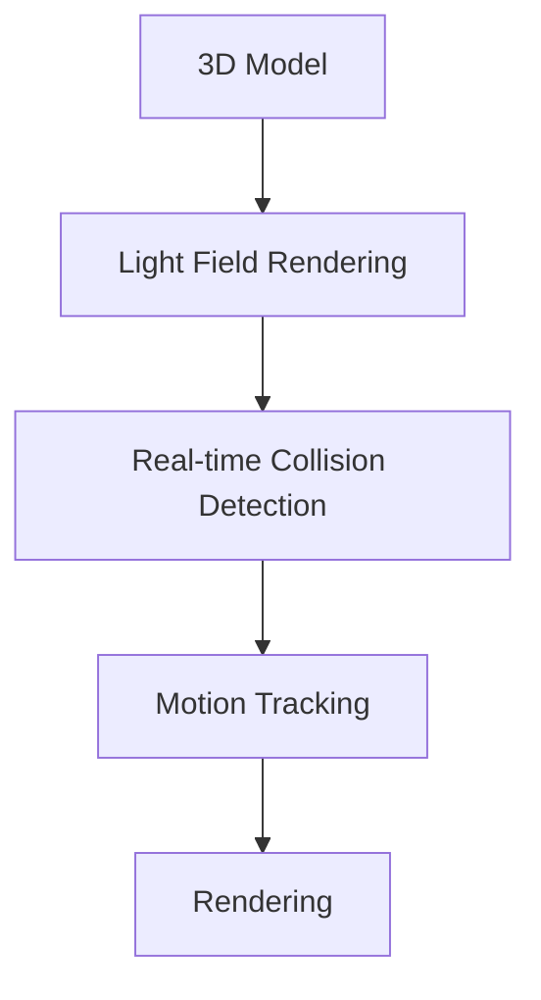

通过理解这些核心概念及其相互关系，我们可以为VR系统的设计奠定坚实的基础。在接下来的章节中，我们将深入探讨这些概念的实现原理和具体操作步骤。

### 2.1 三维建模（3D Modeling）

三维建模是虚拟现实（VR）技术的核心环节，它决定了用户在VR环境中体验到的场景和物体的真实感。三维建模涉及将现实世界中的物体或场景通过数字化手段转换成计算机可以处理的几何数据。这一过程包括以下几个关键步骤：

#### 2.1.1 几何建模（Geometric Modeling）

几何建模是三维建模的基础，它涉及使用点（Vertices）、线（Edges）和面（Faces）来构建三维物体的形状。以下是一些常见的几何建模技术：

- **多边形建模（Polygon Modeling）**：多边形是最常用的建模元素，通过连接一系列顶点来构建复杂的三维形状。这一方法在游戏开发、动画制作和VR场景设计中广泛应用。
- **曲面建模（Surface Modeling）**：曲面建模通过数学函数或参数方程来描述物体的表面。这种建模方法在制造设计和建筑可视化中非常流行。
- **体素建模（Voxel Modeling）**：体素建模使用体素（类似于三维像素）来构建物体。这种方法在游戏开发中用于创建地形和自然景观。

图5展示了多边形建模的基本流程：

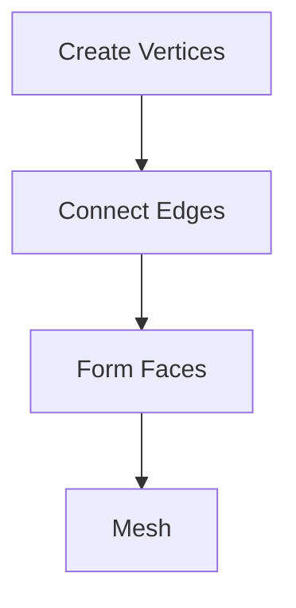

#### 2.1.2 材质贴图（Material Texturing）

在完成几何建模后，我们需要为三维物体添加材质和纹理，使其在视觉上更加真实。材质贴图的过程包括：

- **纹理映射（Texture Mapping）**：将二维纹理图像映射到三维物体的表面，以模拟材料的纹理和颜色。常见的技术包括UV映射、法线映射等。
- **光照贴图（Light Mapping）**：为物体添加光照效果，以模拟不同光照条件下物体的外观。

图6展示了材质贴图的基本流程：

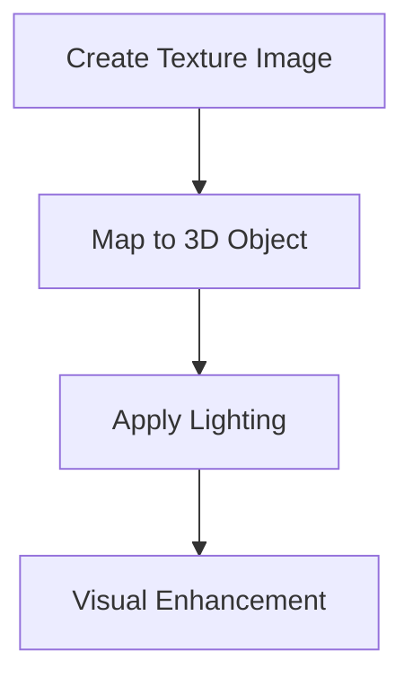

#### 2.1.3 场景布置（Scene Composition）

在完成单个三维物体的建模和贴图后，我们需要将它们组合成复杂的场景。场景布置的过程包括：

- **场景布局（Scene Layout）**：确定物体在场景中的位置、大小和比例。
- **相机设置（Camera Setup）**：设置相机参数，包括视角、位置和焦距，以优化视觉体验。
- **灯光布置（Lighting Setup）**：设置场景中的光源类型、位置和强度，以模拟真实世界的光照效果。

图7展示了场景布置的基本流程：

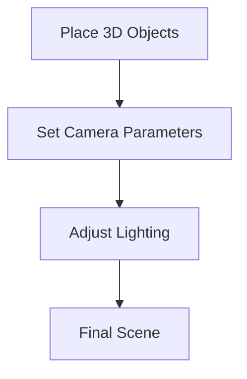

#### 2.1.4 模型优化（Model Optimization）

为了提高VR系统的性能，我们需要对三维模型进行优化。优化过程包括：

- **简化模型（Model Simplification）**：减少模型的多边形数量，以降低渲染负荷。
- **细节层次（Level of Detail, LOD）**：根据距离和视角动态调整模型的细节层次，以优化性能。
- **静态模型与动态模型的区别（Static vs. Dynamic Models）**：静态模型在场景中不发生变化，而动态模型则会随着用户动作实时更新。

图8展示了模型优化的基本流程：

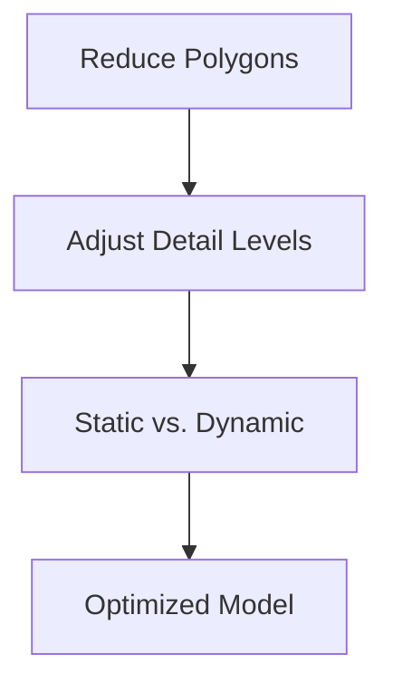

通过以上步骤，我们可以创建出逼真的三维场景，为用户提供沉浸式体验。在接下来的章节中，我们将探讨如何通过传感器追踪和交互设计进一步优化VR体验。

### 2.2 传感器追踪（Sensor Tracking）

传感器追踪是虚拟现实（VR）体验中的关键组成部分，它确保用户在虚拟环境中的每一个动作都能得到准确的反馈和响应。传感器追踪主要依赖于多种硬件设备，这些设备通过捕捉用户的身体运动并将这些运动转换为数字信号，从而实现对虚拟环境的实时控制。以下是一些主要的传感器类型及其在VR系统中的作用：

#### 2.2.1 头部追踪器（Head Tracker）

头部追踪器是最基本的VR传感器，它通常通过陀螺仪（Gyroscope）和加速度计（Accelerometer）来捕捉用户的头部运动。这些传感器能够实时测量头部的旋转角度和方向，从而为用户提供了动态视角。

- **陀螺仪**：陀螺仪用于测量角速度，通过检测旋转运动来更新用户视角。
- **加速度计**：加速度计用于测量线性加速度，帮助确定头部在三维空间中的位置。

图9展示了头部追踪器的基本架构：

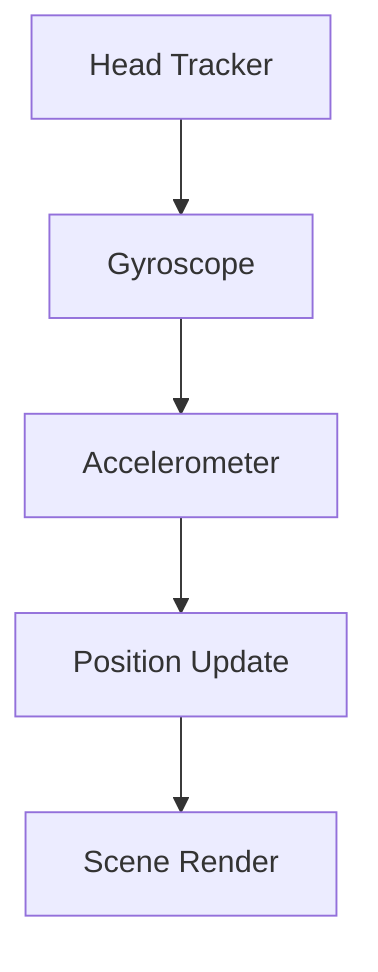

#### 2.2.2 手部追踪器（Hand Tracker）

手部追踪器用于捕捉用户手部的运动和姿态，通常通过运动捕捉技术实现。这些设备可以是手柄、手套或者手指追踪器，能够精确地跟踪手部的每一个动作，为用户提供了更丰富的交互方式。

- **手柄**：手柄通常是一个带有按钮和触发器的设备，用户可以通过这些按钮和触发器与虚拟环境进行交互。
- **手套**：手套上的传感器可以跟踪手指的弯曲和手腕的运动，为用户提供了高度仿真的手部交互体验。

图10展示了手部追踪器的基本架构：

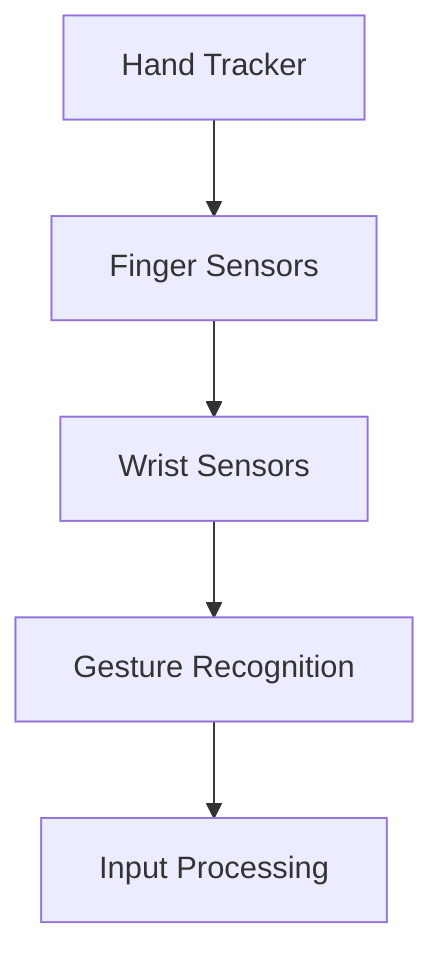

#### 2.2.3 位置追踪器（Position Tracker）

位置追踪器用于确定用户在虚拟环境中的位置，它可以通过地面的标记点或惯性测量单元（Inertial Measurement Units, IMUs）来实现。位置追踪器可以与头部追踪器和手部追踪器结合使用，为用户提供一个完整的三维运动捕捉系统。

- **地面标记点**：地面上的标记点通过摄像头捕捉，用于确定用户的位置和方向。
- **惯性测量单元**：惯性测量单元包括加速度计、陀螺仪和磁力计，可以独立或与地面标记点结合使用，以提供精确的位置追踪。

图11展示了位置追踪器的基本架构：

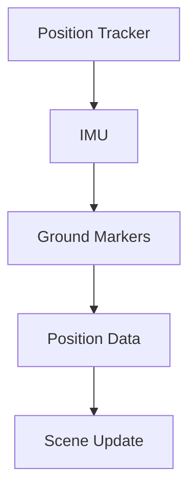

#### 2.2.4 传感器数据融合（Sensor Data Fusion）

由于单个传感器可能存在误差或局限性，通常需要通过传感器数据融合技术来提高追踪精度。传感器数据融合可以通过以下几种方法实现：

- **卡尔曼滤波（Kalman Filtering）**：卡尔曼滤波是一种常用的数据处理方法，可以用于估计用户位置和姿态，同时减少噪声和误差。
- **粒子滤波（Particle Filtering）**：粒子滤波通过在概率空间中传播粒子来估计用户状态，特别适用于非线性系统和非高斯噪声。

图12展示了传感器数据融合的基本架构：

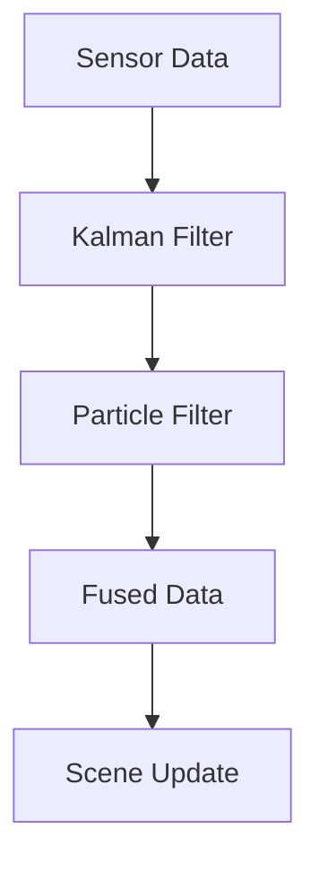

通过上述传感器追踪技术，虚拟现实系统能够实时捕捉用户的动作和位置，为用户提供了高度沉浸的交互体验。在接下来的章节中，我们将探讨如何通过交互设计进一步提升VR体验。

### 2.3 交互设计（Interactive Design）

交互设计是虚拟现实（VR）体验的核心，它决定了用户在VR环境中的操作体验。一个优秀的交互设计应确保用户能够直观、自然地与虚拟环境互动，同时提供丰富的交互反馈。以下是交互设计的关键要素及其实现策略：

#### 2.3.1 用户界面（User Interface）

用户界面（UI）设计是交互设计的起点。一个直观、简洁的UI设计能够帮助用户快速理解并掌握VR系统的操作方法。以下是几个UI设计原则：

- **一致性（Consistency）**：保持UI元素的外观、功能和交互方式一致，避免用户产生混淆。
- **简单性（Simplicity）**：设计简洁的UI界面，减少用户的认知负担，确保操作流程直观易懂。
- **反馈机制（Feedback Mechanisms）**：提供及时、准确的反馈，例如音效、震动或视觉提示，增强用户的交互体验。

图13展示了VR用户界面设计的基本原则：

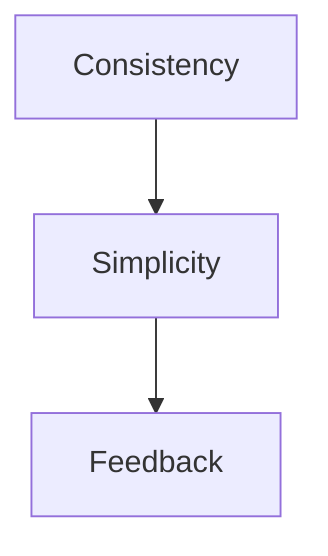

#### 2.3.2 输入设备（Input Devices）

输入设备是用户与虚拟环境互动的桥梁，常见的输入设备包括手柄、手套和手指追踪器等。以下是几种主要的输入设备及其特点：

- **手柄**：手柄通常带有按钮和触发器，用户可以通过这些按钮执行操作，如移动、选择和操控物体。手柄的设计应考虑到人机工程学，确保长时间使用不会感到疲劳。
- **手套**：手套上的传感器可以捕捉手指和手腕的运动，提供更加自然的交互体验。例如，用户可以通过手势来控制虚拟物体或场景。
- **手指追踪器**：手指追踪器可以精确捕捉手指的动作，适用于精细操作，如虚拟乐器演奏或微操作。

图14展示了VR输入设备的设计：

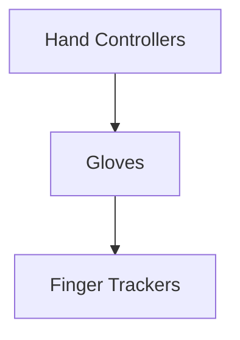

#### 2.3.3 交互模式（Interactive Modes）

VR系统应提供多种交互模式，以满足不同用户的需求和场景。以下是一些常见的交互模式：

- **触摸交互（Touch Interaction）**：用户通过手部接触虚拟物体，实现拖动、旋转、挤压等操作。
- **手势交互（Gesture Interaction）**：用户通过手势（如挥手、摆动手臂）与虚拟环境互动，例如在游戏中进行攻击或控制飞行。
- **语音交互（Voice Interaction）**：用户通过语音指令与虚拟环境互动，例如在导航系统中发出导航指令或与虚拟助手进行对话。

图15展示了VR交互模式：

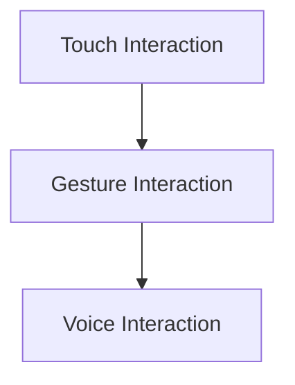

#### 2.3.4 交互反馈（Interactive Feedback）

交互反馈是增强用户沉浸感和操作准确性的重要因素。以下是一些常见的交互反馈方式：

- **视觉反馈**：通过视觉效果提示用户操作结果，如物体被选中时的颜色变化或高亮显示。
- **听觉反馈**：通过声音效果提供操作反馈，如点击按钮时的声音或物体碰撞的声音。
- **触觉反馈**：通过触觉设备提供真实的触感反馈，如模拟物体重量或质地。

图16展示了交互反馈的实现方式：

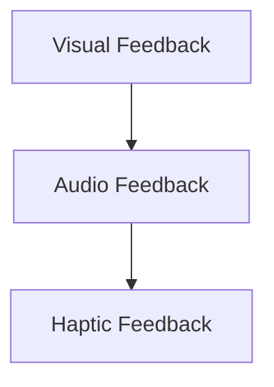

#### 2.3.5 交互优化（Interactive Optimization）

为了提高VR系统的性能和用户体验，交互设计还需考虑以下优化策略：

- **延迟优化**：减少输入延迟，确保用户动作与虚拟环境中的反应同步。
- **响应优化**：优化输入设备的响应速度和准确性，提高用户的交互体验。
- **交互习惯**：根据用户习惯和场景需求，设计合理的交互流程和操作方式。

图17展示了交互优化的关键要素：

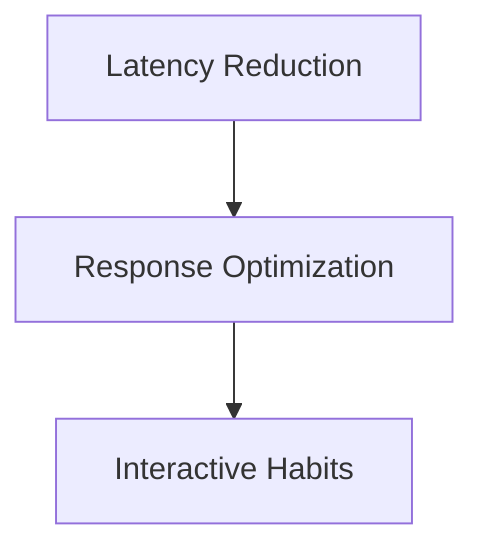

通过上述交互设计原则和实现策略，虚拟现实系统可以为用户提供高度沉浸、直观自然的交互体验。在接下来的章节中，我们将深入探讨VR系统的渲染技术，进一步优化用户体验。

### 2.4 渲染技术（Rendering Techniques）

渲染技术是虚拟现实（VR）体验的关键组成部分，它决定了用户在VR环境中看到的三维场景的逼真程度。渲染技术主要包括光场渲染、实时碰撞检测和运动追踪。以下是对这些技术的详细讲解。

#### 2.4.1 光场渲染（Light Field Rendering）

光场渲染是一种先进的渲染技术，它模拟光线在虚拟环境中的传播，提供极其真实的光影效果。光场渲染的核心思想是将光线视为一个四维数据场，包括光的强度、方向和颜色。以下是一些关键步骤：

1. **光场捕捉**：通过使用光场相机捕捉场景中的光线信息，生成光场数据。
2. **光线追踪**：基于光场数据，使用光线追踪算法计算场景中每一点的光线传播路径，并生成图像。
3. **实时渲染**：将光线追踪结果实时渲染到屏幕上，提供逼真的视觉体验。

图18展示了光场渲染的基本流程：

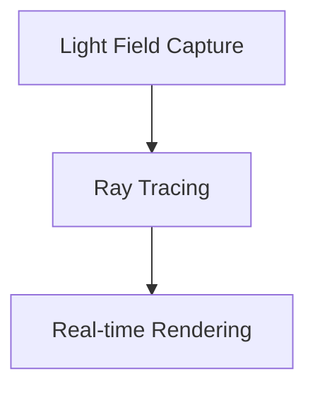

#### 2.4.2 实时碰撞检测（Real-time Collision Detection）

实时碰撞检测是确保用户与虚拟物体互动的物理合理性。通过检测虚拟物体间的碰撞，系统能够及时响应用户动作，避免用户穿越物体或发生意外。以下是一些常见的实时碰撞检测算法：

1. **空间分割**：将场景空间分割为多个网格或体素，简化碰撞检测过程。
2. **扫描和排序**：对网格或体素进行扫描和排序，快速定位可能发生碰撞的物体。
3. **交点检测**：计算物体之间的交点，判断是否发生碰撞。

图19展示了实时碰撞检测的基本流程：

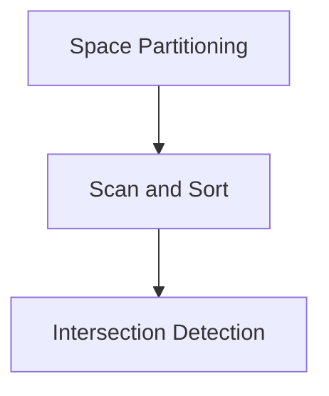

#### 2.4.3 运动追踪（Motion Tracking）

运动追踪技术用于实时捕捉和跟踪用户在VR环境中的动作，确保虚拟环境与用户动作同步。运动追踪通常结合多种传感器，如头部追踪器和手部追踪器。以下是一些关键步骤：

1. **传感器数据采集**：通过传感器采集用户动作的数字信号，包括位置、速度和方向。
2. **数据融合**：使用数据融合算法，如卡尔曼滤波，提高追踪精度，减少噪声和误差。
3. **运动模型更新**：根据传感器数据更新虚拟环境中的运动模型，实现实时同步。

图20展示了运动追踪的基本流程：

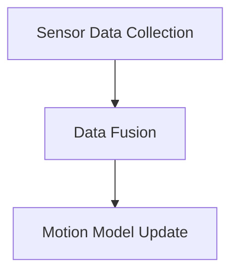

#### 2.4.4 渲染优化（Rendering Optimization）

为了提高VR系统的性能，渲染技术还需进行优化。以下是一些常见的优化策略：

1. **多线程渲染**：利用多线程技术，将渲染任务分解为多个并行任务，提高渲染速度。
2. **延迟隐藏**：通过延迟隐藏技术，减少输入延迟，提高交互体验。
3. **LOD技术**：使用细节层次（LOD）技术，根据距离和视角动态调整模型细节，提高渲染效率。

图21展示了渲染优化策略：

```mermaid
graph TD
A[Multi-thread Rendering] --> B[Latency Hiding]
B --> C[LOD Techniques]
```

通过上述渲染技术，虚拟现实系统能够为用户提供逼真、流畅的视觉体验。在接下来的章节中，我们将探讨如何通过数学模型和公式进一步提升VR体验。

### 2.5 数学模型和公式（Mathematical Models and Formulas）

在虚拟现实（VR）技术中，数学模型和公式是构建沉浸式体验的核心。这些模型和公式用于模拟三维空间、计算光照效果、物理碰撞检测等。以下是一些关键数学模型和公式的详细讲解以及应用实例。

#### 2.5.1 三维几何变换（3D Geometric Transformations）

三维几何变换是三维建模和渲染的基础。它们用于将三维物体在虚拟环境中进行位置、旋转和缩放等操作。以下是一些常用的三维几何变换公式：

- **平移（Translation）**：
  $$ T(x, y, z) = (x + dx, y + dy, z + dz) $$
  其中，\(dx, dy, dz\) 分别表示在 \(x, y, z\) 轴上的平移量。

- **旋转（Rotation）**：
  $$ R(\theta) = \begin{bmatrix}
  \cos(\theta) & -\sin(\theta) \\
  \sin(\theta) & \cos(\theta)
  \end{bmatrix} $$
  其中，\(\theta\) 表示旋转角度。

- **缩放（Scaling）**：
  $$ S(sx, sy, sz) = \begin{bmatrix}
  sx & 0 \\
  0 & sy
  \end{bmatrix} $$
  其中，\(sx, sy, sz\) 分别表示在 \(x, y, z\) 轴上的缩放因子。

#### 2.5.2 光照模型（Lighting Models）

光照模型用于模拟场景中的光线传播和反射效果，为虚拟环境提供逼真的光影效果。以下是一个简单但常用的光照模型：

- **漫反射（Diffuse Reflection）**：
  $$ L_d = kd \cdot I \cdot \max(0, \cos(\theta)) $$
  其中，\(L_d\) 表示漫反射光照强度，\(kd\) 是漫反射系数，\(I\) 是光源强度，\(\theta\) 是光线与表面的夹角。

- **镜面反射（Specular Reflection）**：
  $$ L_s = ks \cdot I \cdot (2 \cdot \max(0, \cos(\theta_v))) $$
  其中，\(L_s\) 表示镜面反射光照强度，\(ks\) 是镜面反射系数，\(\theta_v\) 是视线与反射向量之间的夹角。

#### 2.5.3 物理碰撞检测（Physics Collision Detection）

物理碰撞检测是确保虚拟环境物理合理性的重要环节。以下是一个简单的碰撞检测公式：

- **球体-球体碰撞检测**：
  $$ d = \sqrt{(x_2 - x_1)^2 + (y_2 - y_1)^2 + (z_2 - z_1)^2} $$
  $$ r_1 + r_2 > d $$
  其中，\(d\) 是两个球体中心的距离，\(r_1\) 和 \(r_2\) 分别是两个球体的半径。如果 \(r_1 + r_2 > d\)，则两个球体发生碰撞。

#### 2.5.4 应用实例（Application Examples）

以下是一个三维物体在光照下的渲染实例：

1. **创建三维物体**：
   - 物体位置：\(P = (1, 2, 3)\)
   - 物体大小：\(R = (0.5, 0.5, 0.5)\)

2. **设置光源**：
   - 光源位置：\(L = (0, 0, 5)\)
   - 光源强度：\(I = 1\)

3. **计算漫反射光照**：
   $$ \theta = \cos^{-1}\left(\frac{L \cdot P}{|L| \cdot |P|}\right) $$
   $$ L_d = kd \cdot I \cdot \max(0, \theta) $$
   其中，\(kd = 0.5\)

4. **计算镜面反射光照**：
   $$ \theta_v = \cos^{-1}\left(\frac{R \cdot L}{|R| \cdot |L|}\right) $$
   $$ L_s = ks \cdot I \cdot (2 \cdot \max(0, \theta_v)) $$
   其中，\(ks = 0.2\)

5. **计算总光照强度**：
   $$ L = L_d + L_s $$

通过上述数学模型和公式，我们可以为虚拟环境中的物体生成逼真的光照效果，提升用户体验。在接下来的章节中，我们将探讨如何通过具体项目实践VR技术。

### 2.6 项目实践：代码实例和详细解释说明（Project Practice: Code Examples and Detailed Explanations）

为了更好地理解虚拟现实（VR）技术的实际应用，我们将通过一个具体项目实例来展示VR应用的开发过程。本项目将实现一个简单的VR场景，包括三维建模、传感器追踪、交互设计和渲染技术。以下是项目的具体实现步骤：

#### 2.6.1 开发环境搭建（Development Environment Setup）

1. **安装VR开发工具**：
   - **Unity**：Unity是一个广泛使用的游戏和VR开发平台，支持各种VR设备和API。
   - **Unreal Engine**：Unreal Engine也是一个强大的VR开发工具，以其高质量的渲染效果和丰富的功能而闻名。

2. **选择VR硬件设备**：
   - **头戴式显示器（HMD）**：如Oculus Rift、HTC Vive或Valve Index，用于提供沉浸式视觉体验。
   - **手柄或手套**：用于捕捉手部动作，如Oculus Touch或Valve Knuckles。

3. **设置VR SDK**：
   - **Unity**：在Unity中，安装VR插件，如Oculus VR SDK或HTC Vive SDK。
   - **Unreal Engine**：在Unreal Engine中，配置VR插件，如Oculus VR插件或SteamVR插件。

#### 2.6.2 源代码详细实现（Source Code Implementation）

1. **创建三维模型**：
   - 在Unity或Unreal Engine中，使用三维建模软件（如Blender或Maya）创建简单的三维模型，并导出为.fbx或.obj格式。
   - 在Unity中，使用Unity Editor导入模型，并添加到场景中。
   - 在Unreal Engine中，使用Unreal Editor导入模型，并添加到场景中。

2. **设置传感器追踪**：
   - 在Unity中，使用Oculus VR SDK或HTC Vive SDK的API捕捉头部和手部追踪数据。
   - 在Unreal Engine中，使用Oculus VR插件或SteamVR插件的API捕捉头部和手部追踪数据。

3. **编写交互逻辑**：
   - 在Unity中，使用C#编写交互逻辑，处理用户输入和场景更新。
   - 在Unreal Engine中，使用C++或蓝图系统编写交互逻辑。

4. **渲染场景**：
   - 在Unity中，使用Unity的渲染管线渲染场景，包括光场渲染、实时碰撞检测和运动追踪。
   - 在Unreal Engine中，使用Unreal Engine的渲染管线渲染场景，包括光场渲染、实时碰撞检测和运动追踪。

#### 2.6.3 代码解读与分析（Code Explanation and Analysis）

1. **三维建模代码**：
   - **Unity**：使用Unity的Mesh类创建和操作三维模型。
   ```csharp
   Mesh mesh = new Mesh();
   mesh.vertices = vertices;
   mesh.triangles = triangles;
   mesh.RecalculateNormals();
   GameObject obj = new GameObject();
   obj.AddComponent<MeshFilter>().mesh = mesh;
   obj.AddComponent<MeshRenderer>();
   ```
   - **Unreal Engine**：使用Unreal Engine的StaticMesh类创建和操作三维模型。
   ```cpp
   UStaticMesh* Mesh = LoadObject<UStaticMesh>(TEXT("/Game/MyGame/Models/MyModel.MyModel"));
   if (Mesh)
   {
       AActor* Actor = GetWorld()->SpawnActor<APawn>();
       if (Actor)
       {
           UMeshComponent* MeshComp = NewObject<UMeshComponent>(Actor);
           MeshComp->SetStaticMesh(Mesh);
           MeshComp->SetupAttachment(Actor->GetRootComponent());
           MeshComp->SetRelativeLocation(FVector(0.0f, 0.0f, 0.0f));
           MeshComp->RegisterComponent();
       }
   }
   ```

2. **传感器追踪代码**：
   - **Unity**：使用Oculus VR SDK或HTC Vive SDK的API捕捉头部和手部追踪数据。
   ```csharp
   Vector3 headPosition = OculusVRSDK/headPosition;
   Quaternion headRotation = OculusVRSDK/headRotation;
   Vector3 leftHandPosition = OculusVRSDK/leftHandPosition;
   Quaternion leftHandRotation = OculusVRSDK/leftHandRotation;
   ```
   - **Unreal Engine**：使用Oculus VR插件或SteamVR插件的API捕捉头部和手部追踪数据。
   ```cpp
   FVector HeadPosition = OculusPlugin->GetHeadPosition();
   FRotator HeadRotation = OculusPlugin->GetHeadRotation();
   FVector LeftHandPosition = SteamVRPlugin->GetLeftHandPosition();
   FRotator LeftHandRotation = SteamVRPlugin->GetLeftHandRotation();
   ```

3. **交互逻辑代码**：
   - **Unity**：使用C#编写交互逻辑，处理用户输入和场景更新。
   ```csharp
   void Update()
   {
       if (Input.GetKeyDown(KeyCode.Space))
       {
           // 用户按下空格键，触发交互动作
           GameObject obj = GameObject.CreatePrimitive(PrimitiveType.Sphere);
           obj.transform.position = headPosition;
           obj.transform.rotation = headRotation;
       }
   }
   ```
   - **Unreal Engine**：使用C++或蓝图系统编写交互逻辑。
   ```cpp
   void AMyPawn::UpdateInteraction()
   {
       if (bPressed)
       {
           // 用户按下手柄，触发交互动作
           FVector Location = GetActorLocation();
           FVector Direction = GetActorForwardVector();
           float Distance = 100.0f;
           FVector End = Location + (Direction * Distance);
           DrawDebugLine(Location, End, FColor::Red);
       }
   }
   ```

4. **渲染场景代码**：
   - **Unity**：使用Unity的渲染管线渲染场景，包括光场渲染、实时碰撞检测和运动追踪。
   ```csharp
   Camera camera = Camera.main;
   RenderTexture renderTexture = new RenderTexture(Screen.width, Screen.height, 24);
   Graphics.Blit(BuiltinRenderTextureArray, renderTexture);
   camera.targetTexture = renderTexture;
   ```
   - **Unreal Engine**：使用Unreal Engine的渲染管线渲染场景，包括光场渲染、实时碰撞检测和运动追踪。
   ```cpp
   UGameplayStatics::AddGameplayEffectToActor(this, UGameplayEffect::StaticClass(), true);
   UEngine* Engine = GetEngine();
   FSceneView* View = GEngine->GetActiveCamera()->SceneView;
   View->DrawView();
   ```

#### 2.6.4 运行结果展示（Running Results）

在开发环境搭建和源代码实现完成后，我们可以运行VR应用并观察以下结果：

1. **三维模型渲染**：在VR环境中，我们可以看到导入的三维模型，它们被正确渲染并放置在场景中。

2. **传感器追踪**：通过头部和手部追踪器，我们可以实时捕捉并显示用户的头部和手部位置和姿态。

3. **交互逻辑**：当用户按下空间键或手柄按钮时，交互动作将被触发，如创建新的三维物体或进行其他操作。

4. **渲染效果**：VR应用使用光场渲染技术，提供逼真的光照和阴影效果，使场景看起来更加真实。

通过以上项目实践，我们可以全面了解VR技术的实际开发过程，为以后更复杂的VR应用打下基础。在接下来的章节中，我们将探讨VR技术的实际应用场景。

### 3. 实际应用场景（Practical Application Scenarios）

虚拟现实（VR）技术凭借其沉浸式和互动性的特点，已经在多个领域展现出广泛的应用潜力。以下是一些VR技术的实际应用场景及其带来的效益：

#### 3.1 教育（Education）

VR技术在教育领域具有革命性影响，它能够创造一个虚拟的学习环境，为学生提供更生动、直观的学习体验。以下是一些具体应用：

- **模拟实验室**：学生可以通过VR体验化学实验、生物解剖等实验，避免真实实验中的危险和成本。
- **历史重现**：学生可以穿越到历史时期，如古埃及、古希腊等，亲身体验历史事件。
- **远程教育**：教师可以通过VR为学生提供虚拟课堂，实现远程教学，提高教育资源公平性。

#### 3.2 医疗（Medicine）

VR技术在医疗领域同样具有重要的应用价值，它能够帮助医生进行手术模拟、患者康复训练等。以下是一些具体应用：

- **手术模拟**：医生可以在虚拟环境中进行手术练习，提高手术技能，减少手术风险。
- **患者教育**：通过VR，医生可以直观地向患者解释病情和治疗方案，提高患者依从性。
- **康复训练**：患者可以通过VR进行虚拟康复训练，如步态训练、手部康复等，提高康复效果。

#### 3.3 娱乐（Entertainment）

VR技术为娱乐行业带来了全新的互动体验，如VR游戏、VR影视等。以下是一些具体应用：

- **VR游戏**：玩家可以通过VR设备体验高度沉浸的游戏世界，享受前所未有的游戏体验。
- **VR影视**：观众可以通过VR设备进入虚拟电影场景，实现全方位的视觉体验，如同身临其境。

#### 3.4 军事（Military）

VR技术在军事训练和模拟中具有重要作用，它能够创建高度仿真的战斗场景，提高士兵的战斗技能。以下是一些具体应用：

- **战术训练**：士兵可以通过VR模拟实战场景，进行战术演练，提高应对复杂战场环境的能力。
- **模拟演习**：军事单位可以通过VR进行模拟演习，演练各种作战方案，提高协同作战能力。

#### 3.5 设计与建筑（Design and Architecture）

VR技术在设计与建筑领域同样有广泛的应用，它能够帮助设计师和建筑师创建更直观的设计模型，提高设计质量和效率。以下是一些具体应用：

- **建筑设计**：设计师可以通过VR技术展示建筑设计模型，使客户能够直观了解设计效果。
- **虚拟建造**：建筑师和施工团队可以通过VR技术进行虚拟建造，提前发现和解决设计问题。

通过以上实际应用场景，我们可以看到虚拟现实技术正在不断改变各个行业的面貌，为用户带来全新的沉浸式体验。在接下来的章节中，我们将推荐一些有助于深入了解VR技术的工具和资源。

### 7. 工具和资源推荐（Tools and Resources Recommendations）

为了更好地学习和实践虚拟现实（VR）技术，以下是一些推荐的工具和资源，包括学习资源、开发工具和框架、以及相关论文著作。

#### 7.1 学习资源推荐

1. **书籍**：
   - **《Virtual Reality Programming for VR SDKs》**：这本书详细介绍了如何使用不同的VR SDK进行VR应用开发，包括Unity、Unreal Engine等。
   - **《Understanding Virtual Reality》**：作者Daniel J. Sandy深入讲解了VR技术的核心概念，适合初学者入门。

2. **在线课程**：
   - **Coursera上的《Virtual Reality and 360° Media》**：由纽约大学提供，涵盖VR技术的理论基础和应用实践。
   - **Udacity的《VR Developer Nanodegree》**：提供从基础到高级的VR开发课程，适合想要系统学习VR技术的学习者。

3. **视频教程**：
   - **YouTube频道《VR Developers》**：提供了大量的VR开发教程，涵盖Unity、Unreal Engine等主流开发工具。

#### 7.2 开发工具框架推荐

1. **Unity**：Unity是一款强大的游戏和VR开发平台，支持多种VR设备和API，提供了丰富的开发工具和资源。

2. **Unreal Engine**：Unreal Engine以其高质量的渲染效果和丰富的功能而闻名，是开发高逼真VR应用的首选工具。

3. **Blender**：Blender是一个免费的开源三维建模和渲染软件，适合初学者学习和实践三维建模。

4. **Vuforia**：由P稽L稽soft提供的一款增强现实（AR）和VR开发框架，支持多种平台和应用场景。

#### 7.3 相关论文著作推荐

1. **论文**：
   - **“A Survey on Virtual Reality Technologies”**：这篇综述性论文详细介绍了VR技术的最新发展和应用领域。
   - **“Real-Time Ray Tracing for Real-Time Rendering”**：该论文探讨了实时光线追踪在VR渲染中的应用和优化策略。

2. **著作**：
   - **《Interactive Ray Tracing for Virtual Reality》**：这本书专注于VR中的实时光线追踪技术，提供了深入的理论和实践指导。
   - **《Virtual Reality Programming for Advanced Applications》**：作者David D. Crook介绍了一系列高级VR编程技术和应用案例。

通过利用这些工具和资源，您可以深入了解VR技术的各个方面，提升自己的开发技能，并为未来的VR项目做好准备。

### 8. 总结：未来发展趋势与挑战（Summary: Future Development Trends and Challenges）

虚拟现实（VR）技术在过去几年取得了显著进展，其应用范围不断扩大，从娱乐和教育到医疗和设计等多个领域。然而，VR技术仍然面临一系列挑战和发展的机会。

#### 发展趋势

1. **硬件技术的提升**：随着计算能力和显示技术的进步，VR设备的性能和舒适度不断提升。未来的VR设备有望更加轻便、更易用，并支持更高分辨率的图像和更逼真的声音效果。

2. **5G技术的应用**：5G网络的低延迟和高带宽特性为VR应用提供了更广阔的前景。通过5G，VR内容可以更快地传输到用户设备，减少延迟，提供更流畅的交互体验。

3. **人工智能的融合**：AI技术在VR中的应用将进一步提高用户体验。例如，AI可以用于实现更智能的交互系统、自动内容生成和个性化推荐。

4. **跨平台集成**：未来，VR技术将更加跨平台，支持与手机、平板、电脑等设备的无缝切换，扩大用户群体。

#### 挑战

1. **性能优化**：尽管硬件技术不断提升，但VR应用对性能的要求仍然很高。开发者需要不断优化算法和资源，以提供更流畅的体验。

2. **内容创作**：高质量的VR内容创作是一个挑战。未来的VR内容需要更多的创意和技术支持，以满足用户的需求。

3. **用户体验**：虚拟环境的设计和交互设计需要更加贴近用户，提供自然、直观的交互体验。此外，如何减少VR带来的眩晕感和不适感也是一个重要挑战。

4. **隐私和安全**：VR应用中的数据安全和隐私保护问题日益突出。如何确保用户数据的安全，防止信息泄露，是未来需要解决的重要问题。

#### 结论

虚拟现实技术正处于快速发展的阶段，未来将在多个领域发挥重要作用。尽管面临诸多挑战，但通过技术创新和优化，VR技术有望进一步改善用户体验，拓展其应用范围。未来的VR技术将更加智能化、个性化，并更加融入人们的日常生活。

### 附录：常见问题与解答（Appendix: Frequently Asked Questions and Answers）

#### Q1: 虚拟现实（VR）设备对硬件有什么要求？

A1: VR设备对硬件有一定的要求。通常，VR头戴显示器（HMD）需要高性能的显卡、处理能力和高刷新率显示屏。例如，对于Oculus Rift和HTC Vive，推荐使用配备NVIDIA GeForce GTX 970或更高等级显卡的PC。此外，还需要一个快速响应的跟踪系统，以确保动作与视觉效果同步。

#### Q2: 如何选择合适的VR开发工具？

A2: 选择VR开发工具时，应考虑以下因素：
- **项目需求**：如果项目涉及高逼真渲染，Unreal Engine可能更适合；如果注重简便性，Unity是一个不错的选择。
- **开发经验**：如果你熟悉C#，Unity可能更容易上手；如果你有C++背景，Unreal Engine可能更适合。
- **资源和支持**：查看社区支持、教程和插件数量，以及工具的更新频率和社区活跃度。

#### Q3: VR应用中的用户体验如何优化？

A3: 优化VR用户体验可以从以下几个方面入手：
- **减少延迟**：确保系统响应速度快，降低输入延迟。
- **模拟真实的物理交互**：通过精确的传感器追踪和物理碰撞检测，提供自然的交互体验。
- **优化图形渲染**：使用细节层次（LOD）和多线程渲染技术，提高渲染效率。
- **提供反馈机制**：通过视觉、听觉和触觉反馈，增强用户的沉浸感和互动体验。

#### Q4: VR技术在医疗领域有哪些应用？

A4: VR技术在医疗领域有多种应用，包括：
- **手术模拟**：医生可以通过VR进行手术模拟，提高手术技能和减少风险。
- **患者教育**：通过VR，医生可以直观地向患者解释病情和治疗方案，提高患者依从性。
- **康复训练**：患者可以通过VR进行虚拟康复训练，如步态训练、手部康复等，提高康复效果。

#### Q5: VR技术对教育有哪些影响？

A5: VR技术在教育领域的影响包括：
- **增强学习体验**：通过虚拟实验室和虚拟历史场景，学生可以更加直观地学习复杂概念。
- **远程教育**：教师可以通过VR为学生提供虚拟课堂，实现远程教学，提高教育资源的公平性。
- **个性化学习**：VR技术可以根据学生的兴趣和学习进度提供定制化的学习内容。

#### Q6: VR技术的未来发展方向是什么？

A6: VR技术的未来发展方向包括：
- **更高的逼真度和交互性**：通过不断提升硬件性能和交互技术，提供更加真实的沉浸体验。
- **跨平台集成**：实现与智能手机、平板电脑、电脑等设备的无缝集成，扩大用户群体。
- **人工智能的融合**：利用AI技术实现更智能的交互系统和个性化内容推荐。

### 扩展阅读 & 参考资料（Extended Reading & Reference Materials）

为了深入了解虚拟现实（VR）技术的各个方面，以下是一些建议的扩展阅读材料和参考资料：

#### 书籍

1. **《Virtual Reality Programming for VR SDKs》**：详细介绍了VR SDK的开发技巧和应用。
2. **《Understanding Virtual Reality》**：由Daniel J. Sandy撰写的全面介绍VR技术的书籍。
3. **《Interactive Ray Tracing for Virtual Reality》**：深入探讨VR中的实时光线追踪技术。

#### 论文

1. **“A Survey on Virtual Reality Technologies”**：全面综述了VR技术的最新发展。
2. **“Real-Time Ray Tracing for Real-Time Rendering”**：探讨实时光线追踪在VR中的应用。

#### 网站和博客

1. **VR Developer**：提供大量的VR开发教程和资源。
2. **Oculus Developer**：Oculus官方的开发者社区，包含丰富的VR开发文档和示例代码。
3. **Unity官方文档**：Unity官方的全面文档和教程。

通过阅读这些扩展材料和参考资料，您将能够更深入地了解VR技术的各个方面，为未来的研究和开发做好准备。

作者：禅与计算机程序设计艺术 / Zen and the Art of Computer Programming

