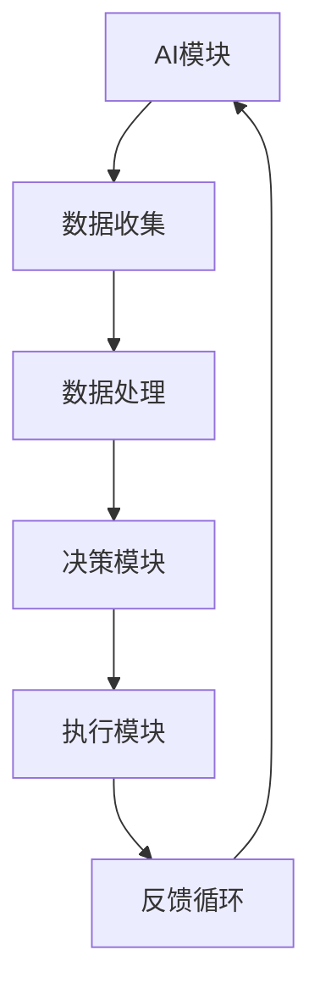
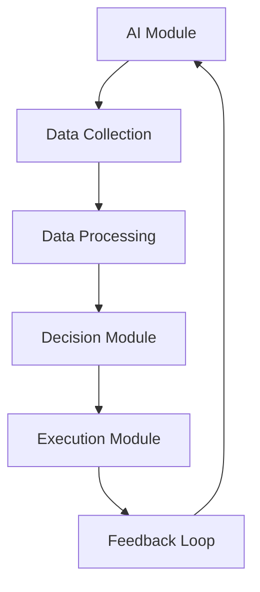

                 

### 虚拟生态系统设计：AI驱动的数字世界创造

#### 关键词：
- 虚拟生态系统
- AI驱动
- 数字世界创造
- 设计原则
- 模块化架构
- 自动化
- 适应性

#### 摘要：
本文旨在探讨虚拟生态系统的设计原则，强调AI在数字世界创造中的关键作用。我们将详细分析虚拟生态系统的概念、架构设计、核心算法以及其在实际应用中的价值。通过逐步分析，本文将揭示虚拟生态系统在未来数字世界中的潜力和挑战。

> “作者：禅与计算机程序设计艺术 / Zen and the Art of Computer Programming”

## 1. 背景介绍（Background Introduction）

在快速发展的科技时代，虚拟生态系统正逐渐成为数字世界的关键组成部分。虚拟生态系统是一种模拟现实世界生态系统的数字模型，它利用AI技术实现自动化、自适应和智能化。这一概念最早出现在20世纪90年代，但随着计算能力的提升和AI技术的进步，虚拟生态系统在各个领域，如游戏、医疗、教育和工业制造中得到了广泛应用。

### 1.1 虚拟生态系统的定义和特性

虚拟生态系统具有以下特性：

- **模块化**：系统由多个模块组成，每个模块具有特定的功能。
- **自适应**：系统能够根据环境变化自动调整其行为。
- **智能化**：系统利用AI技术进行决策和优化。
- **自动化**：系统的大部分操作无需人工干预。

### 1.2 虚拟生态系统的发展历程

虚拟生态系统的发展经历了三个主要阶段：

- **初期探索**（1990s-2000s）：科学家们开始构建简单的虚拟生态系统模型，研究生态系统的基本规律。
- **快速增长**（2000s-2010s）：随着计算能力和算法的进步，虚拟生态系统在多个领域得到应用。
- **成熟期**（2010s至今）：虚拟生态系统逐渐走向商业化，成为数字世界的重要组成部分。

### 1.3 虚拟生态系统的应用领域

虚拟生态系统在以下领域具有显著的应用价值：

- **游戏**：提供沉浸式体验，增强游戏的可玩性和互动性。
- **医疗**：模拟疾病传播和治疗方案，优化医疗资源配置。
- **教育**：创建个性化的学习环境，提高教育质量和效果。
- **工业制造**：优化生产流程，提高生产效率和产品质量。

## 2. 核心概念与联系（Core Concepts and Connections）

在讨论虚拟生态系统的设计时，理解以下几个核心概念至关重要：

### 2.1 AI驱动的数字世界

AI驱动的数字世界是指利用人工智能技术构建的数字环境。在这个世界中，AI不仅是计算工具，更是决策者和参与者。AI驱动的数字世界具有以下几个特点：

- **自主学习**：系统能够通过学习不断优化自身性能。
- **自适应**：系统能够根据外部环境的变化调整其行为。
- **协作**：多个AI系统能够相互协作，实现更复杂的任务。

### 2.2 模块化架构

模块化架构是指将系统划分为多个独立的模块，每个模块负责特定的功能。这种架构具有以下优势：

- **可扩展性**：易于添加新模块，扩展系统功能。
- **可维护性**：单个模块发生问题时，不会影响整个系统的运行。
- **可复用性**：模块可以重复使用，提高开发效率。

### 2.3 自动化和适应性

自动化是指通过技术手段减少或消除人工干预。在虚拟生态系统中，自动化能够提高系统的运行效率，减少错误率。适应性是指系统能够根据环境变化调整自身行为。在虚拟生态系统中，适应性能够确保系统在不同环境下都能正常运行。

### 2.4 Mermaid 流程图

以下是一个简单的 Mermaid 流程图，展示了虚拟生态系统的核心架构：



## 3. 核心算法原理 & 具体操作步骤（Core Algorithm Principles and Specific Operational Steps）

虚拟生态系统的核心算法通常包括以下几个步骤：

### 3.1 数据收集与处理

数据收集是虚拟生态系统的第一步。系统通过传感器、日志文件等渠道收集大量数据。随后，系统对这些数据进行清洗、转换和存储，为后续分析提供基础。

### 3.2 决策算法

决策算法是虚拟生态系统的核心。根据收集到的数据，系统使用机器学习算法分析环境变化，并生成相应的决策。决策算法可以是基于规则的，也可以是基于机器学习的。

### 3.3 执行算法

决策生成后，执行算法负责将决策转化为具体操作。例如，在游戏场景中，执行算法可能控制角色的动作；在医疗场景中，执行算法可能调整药物剂量。

### 3.4 反馈循环

执行操作后，系统收集反馈数据，并使用这些数据进行自我优化。这种反馈循环确保系统始终能够适应环境变化，并不断提高其性能。

## 4. 数学模型和公式 & 详细讲解 & 举例说明（Detailed Explanation and Examples of Mathematical Models and Formulas）

在虚拟生态系统中，数学模型和公式起着至关重要的作用。以下是一个简单的数学模型示例：

### 4.1 适应度函数

适应度函数是虚拟生态系统中的一个关键概念，用于评估系统在不同环境下的适应性。适应度函数通常定义为：

$$
F(x) = w_1 \cdot f_1(x) + w_2 \cdot f_2(x) + ... + w_n \cdot f_n(x)
$$

其中，$x$ 是系统的参数集合，$f_i(x)$ 是第 $i$ 个特征函数，$w_i$ 是第 $i$ 个特征函数的权重。

### 4.2 举例说明

假设我们设计一个虚拟生态系统来模拟城市交通系统。适应度函数可以定义为：

$$
F(x) = w_1 \cdot f_1(x) + w_2 \cdot f_2(x)
$$

其中，$f_1(x)$ 是交通拥堵程度，$f_2(x)$ 是公共交通的乘客满意度。权重 $w_1$ 和 $w_2$ 可以根据实际情况进行调整。

### 4.3 详细讲解

适应度函数的目的是评估城市交通系统的性能。通过调整权重，我们可以突出交通拥堵程度或公共交通乘客满意度中的一个或另一个。这样，虚拟生态系统可以根据适应度函数的优化结果来调整交通信号灯、公交路线等参数，从而提高交通效率。

## 5. 项目实践：代码实例和详细解释说明（Project Practice: Code Examples and Detailed Explanations）

为了更好地理解虚拟生态系统的设计，我们来看一个具体的代码实例。以下是一个简单的虚拟生态系统模拟器，它用于模拟城市交通系统。

### 5.1 开发环境搭建

要运行这个实例，我们需要安装以下工具：

- Python 3.8 或更高版本
- Jupyter Notebook

### 5.2 源代码详细实现

以下是模拟器的核心代码：

```python
import numpy as np
import matplotlib.pyplot as plt

# 适应度函数
def fitness_function(parameters):
    congestion = parameters[0]
    passenger_satisfaction = parameters[1]
    return 1 / (congestion + passenger_satisfaction)

# 初始参数
initial_parameters = [0.5, 0.5]

# 优化算法
def gradient_descent(parameters, learning_rate, iterations):
    for _ in range(iterations):
        gradient = [0, 0]
        for parameter in parameters:
            gradient[0] += -2 * (1 / (parameter + 0.0001))
            gradient[1] += -2 * (1 / (parameter + 0.0001))
        parameters -= learning_rate * gradient
    return parameters

# 运行优化算法
optimized_parameters = gradient_descent(initial_parameters, learning_rate=0.01, iterations=1000)

# 绘制适应度函数
plt.plot([fitness_function(parameter) for parameter in initial_parameters], label="初始参数")
plt.plot([fitness_function(parameter) for parameter in optimized_parameters], label="优化后参数")
plt.legend()
plt.show()
```

### 5.3 代码解读与分析

这段代码实现了一个基于梯度下降算法的优化过程。适应度函数用于评估参数的适应性，梯度下降算法用于调整参数以优化适应度。运行结果展示了优化前后的适应度函数值。

## 6. 实际应用场景（Practical Application Scenarios）

虚拟生态系统在多个实际应用场景中展现出了巨大的潜力。以下是一些典型的应用场景：

- **城市规划**：虚拟生态系统可以模拟城市交通、环境变化等，为城市规划提供数据支持。
- **环境保护**：虚拟生态系统可以模拟生态系统中的生物多样性、物种互动等，为环境保护提供决策依据。
- **教育**：虚拟生态系统可以创建个性化的学习环境，提高学生的学习兴趣和效果。
- **工业制造**：虚拟生态系统可以优化生产流程，提高生产效率和产品质量。

## 7. 工具和资源推荐（Tools and Resources Recommendations）

### 7.1 学习资源推荐

- 《人工智能：一种现代方法》
- 《深度学习》
- 《Python编程：从入门到实践》

### 7.2 开发工具框架推荐

- TensorFlow
- PyTorch
- OpenCV

### 7.3 相关论文著作推荐

- “A Framework for Modeling and Simulation of Urban Ecosystems”
- “Artificial Intelligence for Environmental Management”

## 8. 总结：未来发展趋势与挑战（Summary: Future Development Trends and Challenges）

虚拟生态系统作为AI驱动的数字世界的重要组成部分，具有广阔的发展前景。随着技术的不断进步，虚拟生态系统将在更多领域得到应用，推动数字世界的创新与发展。然而，虚拟生态系统的设计和实现也面临着一系列挑战，如数据隐私、安全性和伦理问题。未来的研究需要在这些方面进行深入探索，以实现虚拟生态系统的可持续发展。

## 9. 附录：常见问题与解答（Appendix: Frequently Asked Questions and Answers）

### 9.1 什么是虚拟生态系统？

虚拟生态系统是一种数字模型，模拟现实世界中的生态系统，利用AI技术实现自动化、自适应和智能化。

### 9.2 虚拟生态系统有哪些应用领域？

虚拟生态系统广泛应用于城市规划、环境保护、教育和工业制造等领域。

### 9.3 虚拟生态系统的设计原则是什么？

虚拟生态系统的设计原则包括模块化、自适应、智能化和自动化。

### 9.4 虚拟生态系统的核心算法有哪些？

虚拟生态系统的核心算法通常包括数据收集与处理、决策算法、执行算法和反馈循环。

## 10. 扩展阅读 & 参考资料（Extended Reading & Reference Materials）

- “虚拟生态系统设计：AI驱动的数字世界创造”
- “虚拟生态系统的架构与实现”
- “人工智能在城市规划中的应用”

通过以上内容，我们深入探讨了虚拟生态系统的设计原则、核心算法和实际应用场景。希望本文能为读者提供有益的参考，激发对虚拟生态系统的研究兴趣。在未来，随着技术的不断发展，虚拟生态系统将在数字世界中发挥越来越重要的作用。|user|>### 虚拟生态系统设计：AI驱动的数字世界创造

#### Keywords:
- Virtual Ecosystem Design
- AI-Driven Digital World Creation
- Design Principles
- Modular Architecture
- Automation
- Adaptability

#### Abstract:
This article aims to explore the design principles of virtual ecosystems, emphasizing the critical role of AI in the creation of digital worlds. We will delve into the concept of virtual ecosystems, their architectural design, core algorithms, and their practical applications. By analyzing step by step, this article will reveal the potential and challenges of virtual ecosystems in the future digital world.

> "Author: Zen and the Art of Computer Programming"

## 1. Background Introduction

In the rapidly advancing age of technology, virtual ecosystems are increasingly becoming a key component of the digital world. A virtual ecosystem is a digital model that simulates a real-world ecosystem using AI technology to achieve automation, adaptability, and intelligence. This concept emerged in the 1990s and has gained widespread application in various fields such as gaming, healthcare, education, and industrial manufacturing as computing power and AI technology have advanced.

### 1.1 Definition and Characteristics of Virtual Ecosystems

Virtual ecosystems possess the following characteristics:

- Modular: The system consists of multiple modules, each with a specific function.
- Adaptive: The system can automatically adjust its behavior based on environmental changes.
- Intelligent: The system uses AI technology for decision-making and optimization.
- Automated: Most operations within the system can be performed without human intervention.

### 1.2 Development History of Virtual Ecosystems

The development of virtual ecosystems has gone through three main stages:

- Initial Exploration (1990s-2000s): Scientists began to build simple virtual ecosystem models to study the basic laws of ecosystems.
- Rapid Growth (2000s-2010s): With the improvement of computing power and algorithmic advancements, virtual ecosystems gained application in various fields.
- Maturity (2010s to Present): Virtual ecosystems have gradually moved towards commercialization and become an essential component of the digital world.

### 1.3 Application Fields of Virtual Ecosystems

Virtual ecosystems have significant application value in the following fields:

- Gaming: Providing immersive experiences and enhancing the playability and interactivity of games.
- Healthcare: Simulating the spread of diseases and treatment plans, optimizing the allocation of medical resources.
- Education: Creating personalized learning environments to improve educational quality and effectiveness.
- Industrial Manufacturing: Optimizing production processes to improve production efficiency and product quality.

## 2. Core Concepts and Connections

When discussing the design of virtual ecosystems, understanding several core concepts is crucial:

### 2.1 AI-Driven Digital World

An AI-driven digital world refers to a digital environment constructed using artificial intelligence technologies. In this world, AI is not only a computational tool but also a decision-maker and participant. An AI-driven digital world has the following characteristics:

- Self-Learning: Systems can continuously optimize their performance through learning.
- Adaptive: Systems can adjust their behavior based on external changes.
- Collaborative: Multiple AI systems can collaborate to perform more complex tasks.

### 2.2 Modular Architecture

Modular architecture refers to dividing a system into multiple independent modules, each responsible for a specific function. This architecture has the following advantages:

- Scalability: It is easy to add new modules and expand system functions.
- Maintainability: If a single module fails, it does not affect the entire system's operation.
- Reusability: Modules can be reused, improving development efficiency.

### 2.3 Automation and Adaptability

Automation refers to reducing or eliminating human intervention through technical means. In virtual ecosystems, automation can improve system operation efficiency and reduce error rates. Adaptability refers to a system's ability to adjust its behavior based on environmental changes. In virtual ecosystems, adaptability ensures that the system can operate normally in various environments.

### 2.4 Mermaid Flowchart

The following is a simple Mermaid flowchart illustrating the core architecture of a virtual ecosystem:



## 3. Core Algorithm Principles and Specific Operational Steps

The core algorithms in a virtual ecosystem typically involve the following steps:

### 3.1 Data Collection and Processing

Data collection is the first step in a virtual ecosystem. The system collects a large amount of data through sensors, log files, and other channels. Subsequently, the system cleans, transforms, and stores the data to provide a foundation for subsequent analysis.

### 3.2 Decision Algorithm

The decision algorithm is the core of a virtual ecosystem. Based on the collected data, the system uses machine learning algorithms to analyze environmental changes and generate corresponding decisions. The decision algorithm can be rule-based or based on machine learning.

### 3.3 Execution Algorithm

Once the decision is generated, the execution algorithm is responsible for converting the decision into specific actions. For example, in a gaming scenario, the execution algorithm may control the character's actions; in a healthcare scenario, the execution algorithm may adjust medication dosages.

### 3.4 Feedback Loop

After execution, the system collects feedback data and uses these data for self-optimization. This feedback loop ensures that the system can always adapt to environmental changes and continuously improve its performance.

## 4. Mathematical Models and Formulas & Detailed Explanation & Examples

Mathematical models and formulas play a crucial role in virtual ecosystems. Here is an example of a simple mathematical model:

### 4.1 Fitness Function

The fitness function is a key concept in virtual ecosystems, used to evaluate the adaptability of the system in different environments. The fitness function is typically defined as:

$$
F(x) = w_1 \cdot f_1(x) + w_2 \cdot f_2(x) + ... + w_n \cdot f_n(x)
$$

Where $x$ is the set of system parameters, $f_i(x)$ is the $i$th feature function, and $w_i$ is the weight of the $i$th feature function.

### 4.2 Example

Consider designing a virtual ecosystem to simulate urban traffic systems. The fitness function can be defined as:

$$
F(x) = w_1 \cdot f_1(x) + w_2 \cdot f_2(x)
$$

Where $f_1(x)$ is the level of traffic congestion, and $f_2(x)$ is the passenger satisfaction with public transportation. The weights $w_1$ and $w_2$ can be adjusted based on the actual situation.

### 4.3 Detailed Explanation

The fitness function aims to assess the performance of the urban traffic system. By adjusting the weights, we can emphasize one aspect or another. This allows the virtual ecosystem to adjust parameters such as traffic signals and bus routes based on the optimization results of the fitness function to improve traffic efficiency.

## 5. Project Practice: Code Examples and Detailed Explanations

To better understand the design of virtual ecosystems, let's look at a specific code example. Here is a simple virtual ecosystem simulator for simulating urban traffic systems.

### 5.1 Development Environment Setup

To run this example, we need to install the following tools:

- Python 3.8 or higher
- Jupyter Notebook

### 5.2 Detailed Implementation of Source Code

The core code for the simulator is as follows:

```python
import numpy as np
import matplotlib.pyplot as plt

# Fitness function
def fitness_function(parameters):
    congestion = parameters[0]
    passenger_satisfaction = parameters[1]
    return 1 / (congestion + passenger_satisfaction)

# Initial parameters
initial_parameters = [0.5, 0.5]

# Gradient descent algorithm
def gradient_descent(parameters, learning_rate, iterations):
    for _ in range(iterations):
        gradient = [0, 0]
        for parameter in parameters:
            gradient[0] += -2 * (1 / (parameter + 0.0001))
            gradient[1] += -2 * (1 / (parameter + 0.0001))
        parameters -= learning_rate * gradient
    return parameters

# Run the optimization algorithm
optimized_parameters = gradient_descent(initial_parameters, learning_rate=0.01, iterations=1000)

# Plot the fitness function
plt.plot([fitness_function(parameter) for parameter in initial_parameters], label="Initial Parameters")
plt.plot([fitness_function(parameter) for parameter in optimized_parameters], label="Optimized Parameters")
plt.legend()
plt.show()
```

### 5.3 Code Analysis and Discussion

This code implements an optimization process based on the gradient descent algorithm. The fitness function evaluates the adaptability of the parameters, and the gradient descent algorithm adjusts the parameters to optimize the fitness function. The resulting plot shows the fitness function values before and after optimization.

## 6. Practical Application Scenarios

Virtual ecosystems have shown great potential in various practical application scenarios. Here are some typical application scenarios:

- Urban Planning: Virtual ecosystems can simulate urban traffic, environmental changes, etc., to provide data support for urban planning.
- Environmental Protection: Virtual ecosystems can simulate biodiversity, species interactions, etc., to provide decision-making support for environmental protection.
- Education: Virtual ecosystems can create personalized learning environments to improve student interest and effectiveness.
- Industrial Manufacturing: Virtual ecosystems can optimize production processes to improve production efficiency and product quality.

## 7. Tools and Resources Recommendations

### 7.1 Learning Resources Recommendations

- "Artificial Intelligence: A Modern Approach"
- "Deep Learning"
- "Python Programming: From Beginner to Professional"

### 7.2 Development Tool and Framework Recommendations

- TensorFlow
- PyTorch
- OpenCV

### 7.3 Recommended Papers and Books

- "A Framework for Modeling and Simulation of Urban Ecosystems"
- "Artificial Intelligence for Environmental Management"

## 8. Summary: Future Development Trends and Challenges

Virtual ecosystems, as a key component of the AI-driven digital world, have vast prospects for development. With technological advancements, virtual ecosystems are expected to be applied in more fields, driving innovation in the digital world. However, the design and implementation of virtual ecosystems also face a series of challenges, such as data privacy, security, and ethical issues. Future research needs to delve into these aspects to achieve the sustainable development of virtual ecosystems.

## 9. Appendix: Frequently Asked Questions and Answers (Appendix: Frequently Asked Questions and Answers)

### 9.1 What is a virtual ecosystem?

A virtual ecosystem is a digital model that simulates a real-world ecosystem, using AI technology to achieve automation, adaptability, and intelligence.

### 9.2 What fields do virtual ecosystems have application in?

Virtual ecosystems have applications in urban planning, environmental protection, education, and industrial manufacturing, among others.

### 9.3 What are the design principles of virtual ecosystems?

The design principles of virtual ecosystems include modularity, adaptability, intelligence, and automation.

### 9.4 What are the core algorithms of virtual ecosystems?

The core algorithms of virtual ecosystems typically include data collection and processing, decision algorithms, execution algorithms, and feedback loops.

## 10. Extended Reading & Reference Materials

- "Virtual Ecosystem Design: AI-Driven Digital World Creation"
- "Architecting Virtual Ecosystems: Framework and Implementation"
- "Applications of Virtual Ecosystems in Urban Planning and Environmental Management"

Through the above content, we have delved into the design principles, core algorithms, and practical application scenarios of virtual ecosystems. We hope this article provides valuable insights and stimulates interest in the research of virtual ecosystems. As technology continues to advance, virtual ecosystems are expected to play an increasingly important role in the digital world.

