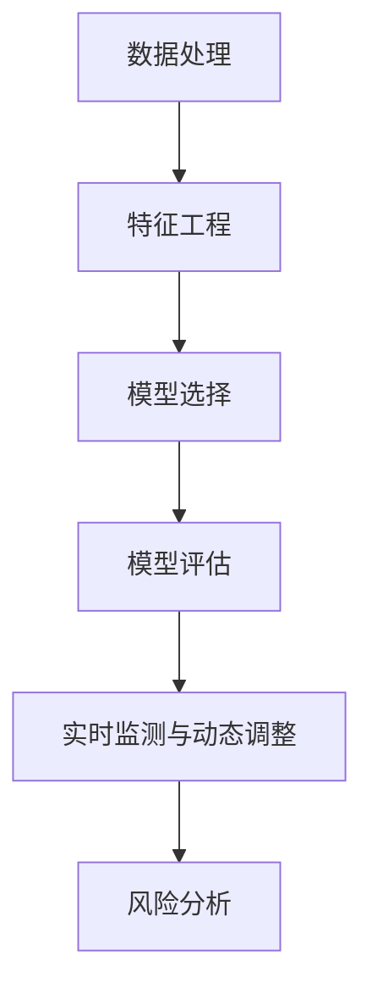
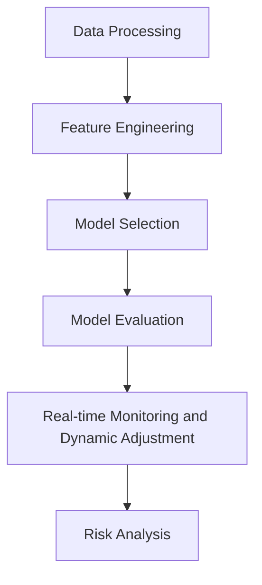

                 

### 文章标题

### "蚂蚁金服2024校招智能风控算法工程师面试指南"

蚂蚁金服作为国内领先的金融科技公司，其校招面试以其高难度和深度闻名于业内外。对于有志于成为智能风控算法工程师的应聘者而言，面对蚂蚁金服的面试无疑是一次巨大的挑战。本文旨在为2024届校招生提供一份全面、系统的智能风控算法工程师面试指南，帮助大家深入了解面试可能涉及的知识点和备考策略。

本文将围绕以下核心内容展开：

1. **背景介绍**：解读蚂蚁金服的智能风控技术及其在金融科技领域的地位。
2. **核心概念与联系**：探讨智能风控算法的基础概念和关键技术。
3. **核心算法原理 & 具体操作步骤**：详细解析常见风控算法及其应用场景。
4. **数学模型和公式 & 详细讲解 & 举例说明**：介绍相关数学模型，并通过实例进行说明。
5. **项目实践：代码实例和详细解释说明**：通过实际项目展示算法实现过程。
6. **实际应用场景**：分析智能风控算法在不同业务场景中的应用。
7. **工具和资源推荐**：推荐学习资源和开发工具。
8. **总结：未来发展趋势与挑战**：探讨智能风控技术的发展趋势和未来挑战。
9. **附录：常见问题与解答**：汇总面试中可能遇到的问题及其解答。
10. **扩展阅读 & 参考资料**：提供进一步的阅读资源和参考文献。

通过本文的系统性指导，我们希望帮助各位读者全面了解智能风控算法工程师的面试要求，提升自身的面试竞争力。

### Title: "Alibaba Ant Group's 2024 Campus Recruitment Guide for Intelligent Risk Management Algorithm Engineers"

### "蚂蚁金服2024校招智能风控算法工程师面试指南"

Ant Group, as a leading financial technology company in China, is renowned for its challenging interview process for campus recruitment. For candidates aspiring to become intelligent risk management algorithm engineers, facing Ant Group's interview can be a daunting task. This article aims to provide a comprehensive and systematic guide for the 2024 campus recruits, helping them understand the knowledge points and preparation strategies that may be covered in the interview.

The core contents of this article will include:

1. **Background Introduction**: Analyzing Ant Group's intelligent risk management technology and its status in the field of financial technology.
2. **Core Concepts and Connections**: Discussing the basic concepts and key technologies of intelligent risk management algorithms.
3. **Core Algorithm Principles & Specific Operational Steps**: Detailed analysis of common risk management algorithms and their application scenarios.
4. **Mathematical Models and Formulas & Detailed Explanation & Examples**: Introducing relevant mathematical models and explaining them through examples.
5. **Project Practice: Code Examples and Detailed Explanations**: Demonstrating the process of algorithm implementation through actual projects.
6. **Practical Application Scenarios**: Analyzing the application of intelligent risk management algorithms in different business scenarios.
7. **Tools and Resources Recommendations**: Recommending learning resources and development tools.
8. **Summary: Future Development Trends and Challenges**: Discussing the future development trends and challenges of intelligent risk management.
9. **Appendix: Frequently Asked Questions and Answers**: Summarizing common questions in the interview and their answers.
10. **Extended Reading & Reference Materials**: Providing further reading resources and references.

Through this systematic guidance, we hope to help readers fully understand the requirements for intelligent risk management algorithm engineers' interviews and improve their competitiveness in the interview process.

<|bot|>

## 1. 背景介绍

蚂蚁金服（Ant Group），原名蚂蚁金服，成立于2014年，是阿里巴巴集团旗下的金融科技公司，专注于提供金融服务解决方案。作为全球领先的金融科技公司，蚂蚁金服依托于其强大的技术实力和大数据优势，在支付、借贷、保险、财富管理等多个领域拥有广泛的应用。

### 蚂蚁金服的智能风控技术

蚂蚁金服在智能风控领域有着深厚的技术积累和丰富的实践经验。其智能风控系统通过大数据分析、机器学习和人工智能技术，对海量用户行为数据进行实时监控和风险预测。以下是一些关键技术和应用：

- **大数据分析**：蚂蚁金服利用其海量数据存储和处理能力，对用户行为、交易数据等进行分析，识别潜在风险。
- **机器学习**：通过构建多种机器学习模型，对历史数据进行分析，预测用户行为和交易风险。
- **人工智能**：运用人工智能技术，如深度学习和自然语言处理，对复杂问题进行智能分析和决策。

### 智能风控在金融科技领域的地位

智能风控在金融科技领域具有至关重要的地位。随着金融科技的快速发展，传统金融风控手段已无法满足日益复杂的金融需求。智能风控通过数据驱动和自动化决策，提高了风险识别和响应的效率，降低了金融风险，保障了金融系统的稳定性。

蚂蚁金服的智能风控技术不仅在支付领域具有广泛的应用，还在借贷、保险、财富管理等领域发挥着重要作用。其智能风控系统不仅在国内市场处于领先地位，也在全球范围内得到认可和应用。

### 智能风控算法工程师的面试需求

蚂蚁金服对于智能风控算法工程师的面试需求主要体现在以下几个方面：

- **技术深度**：对算法原理、数学模型、编程实现等有深入理解。
- **实践经验**：具备实际项目经验，能够运用算法解决实际问题。
- **创新意识**：能够提出创新性的解决方案，解决金融领域的新问题。
- **团队合作**：具备良好的团队合作能力和沟通能力，能够与团队成员有效协作。

综上所述，对于有志于成为蚂蚁金服智能风控算法工程师的应聘者来说，了解公司的智能风控技术及其在金融科技领域的应用，掌握相关算法和技术，提升自身的技术深度和实践经验，是成功通过面试的关键。

### Background Introduction

### "Background Introduction"

Ant Financial, formerly known as Ant Group, was established in 2014 and is a financial technology company under the Alibaba Group. It specializes in providing financial service solutions. As a globally leading financial technology company, Ant Financial leverages its strong technological capabilities and data advantages to offer a wide range of financial services, including payments, lending, insurance, wealth management, and more.

### Intelligent Risk Management Technology at Ant Group

Ant Group has a deep technical foundation and extensive practical experience in the field of intelligent risk management. Its intelligent risk management system uses big data analysis, machine learning, and artificial intelligence technologies to monitor and predict risks in real-time based on massive user behavior data. Here are some key technologies and applications:

- **Big Data Analysis**: Ant Financial leverages its massive data storage and processing capabilities to analyze user behavior, transaction data, and more, identifying potential risks.
- **Machine Learning**: Various machine learning models are constructed to analyze historical data and predict user behavior and transaction risks.
- **Artificial Intelligence**: Artificial intelligence technologies, such as deep learning and natural language processing, are used for intelligent analysis and decision-making of complex problems.

### The Position of Intelligent Risk Management in the Field of Financial Technology

Intelligent risk management holds a vital position in the field of financial technology. With the rapid development of financial technology, traditional financial risk management methods are no longer sufficient to meet the increasingly complex financial needs. Intelligent risk management drives data-driven and automated decision-making, improving the efficiency of risk identification and response, and reducing financial risks to ensure the stability of the financial system.

Ant Group's intelligent risk management technology is widely applied in the payment sector and also plays a significant role in lending, insurance, wealth management, and more. Its intelligent risk management system is not only leading in the domestic market but also recognized and applied globally.

### Recruitment Needs for Intelligent Risk Management Algorithm Engineers

Ant Group's interview requirements for intelligent risk management algorithm engineers mainly focus on the following aspects:

- **Technical Depth**: A deep understanding of algorithm principles, mathematical models, and programming implementation.
- **Practical Experience**: Experience in real projects, able to solve practical problems using algorithms.
- **Innovation**: The ability to propose innovative solutions to address new problems in the financial sector.
- **Team Collaboration**: Good teamwork and communication skills, able to collaborate effectively with team members.

In summary, for candidates aspiring to become intelligent risk management algorithm engineers at Ant Group, understanding the company's intelligent risk management technology and its applications in the financial technology field, mastering relevant algorithms and technologies, and enhancing technical depth and practical experience are key to successfully passing the interview.

<|bot|>

## 2. 核心概念与联系

在智能风控算法工程师的面试中，理解并掌握核心概念与联系是至关重要的。以下是智能风控算法中的一些关键概念及其相互之间的联系。

### 2.1 数据处理

数据处理是智能风控的基础。数据预处理包括数据清洗、数据整合和数据变换。其中，数据清洗是确保数据质量的关键步骤，主要包括去除重复数据、填补缺失值、处理异常值等。数据整合则涉及将来自不同源的数据进行统一处理，而数据变换则是将原始数据转换为适合算法处理的形式。

### 2.2 特征工程

特征工程是提升算法性能的重要手段。通过提取和构造特征，可以使得算法更有效地识别风险。特征工程包括特征选择、特征提取和特征组合。特征选择旨在从大量特征中选择出最有用的特征；特征提取则是通过变换和组合原始特征来生成新的特征；特征组合则是将多个特征结合起来，生成更复杂的特征。

### 2.3 模型选择

模型选择是智能风控算法的核心步骤。常见的机器学习模型包括线性模型、决策树、随机森林、支持向量机、神经网络等。每种模型都有其适用的场景和优缺点。例如，线性模型在处理线性问题时表现良好，而决策树和随机森林适合处理非线性问题，支持向量机在处理高维数据时效果较好，神经网络则能够处理复杂的非线性问题。

### 2.4 模型评估

模型评估是确保算法有效性的关键。常用的评估指标包括准确率、召回率、F1值、ROC曲线和AUC值等。准确率反映算法对正例样本的识别能力；召回率反映算法对负例样本的识别能力；F1值是准确率和召回率的调和平均值；ROC曲线和AUC值则用于评估算法对正负样本的区分能力。

### 2.5 实时监测与动态调整

实时监测与动态调整是智能风控系统的核心功能。通过实时监测用户行为和交易数据，可以快速识别潜在风险，并动态调整风控策略。例如，在借贷场景中，可以实时调整信用评分模型，以应对市场变化和风险动态。

### 2.6 风险分析

风险分析是智能风控的最终目标。通过对海量数据的分析和模型预测，可以识别出潜在的风险点和风险等级，为风控决策提供依据。例如，在反欺诈场景中，可以通过分析用户行为模式，识别出可疑的欺诈行为。

### Mermaid 流程图

以下是智能风控算法的核心概念和流程的 Mermaid 流程图表示：



通过上述核心概念和流程的理解和掌握，智能风控算法工程师可以更好地应对面试中的各种问题，并在实际工作中运用这些技术解决实际问题。

### Core Concepts and Connections

Understanding and mastering core concepts and their interconnections is crucial for intelligent risk management algorithm engineers during interviews. Here are some key concepts and their relationships in intelligent risk management algorithms.

### 2.1 Data Processing

Data processing is the foundation of intelligent risk management. Data preprocessing includes data cleaning, data integration, and data transformation. Data cleaning is a critical step to ensure data quality, which involves removing duplicate data, filling missing values, and handling outliers. Data integration involves unifying data from different sources, while data transformation involves converting raw data into a format suitable for algorithm processing.

### 2.2 Feature Engineering

Feature engineering is an essential means to improve algorithm performance. Through extracting and constructing features, algorithms can more effectively identify risks. Feature engineering includes feature selection, feature extraction, and feature combination. Feature selection aims to select the most useful features from a large set of features; feature extraction involves transforming and combining raw features to generate new features; feature combination involves combining multiple features to create more complex features.

### 2.3 Model Selection

Model selection is a core step in intelligent risk management algorithms. Common machine learning models include linear models, decision trees, random forests, support vector machines, and neural networks. Each model has its own suitable scenarios and advantages and disadvantages. For example, linear models perform well in linear problems, while decision trees and random forests are suitable for nonlinear problems, support vector machines are effective in handling high-dimensional data, and neural networks can handle complex nonlinear problems.

### 2.4 Model Evaluation

Model evaluation is crucial for ensuring algorithm effectiveness. Common evaluation metrics include accuracy, recall, F1 score, ROC curve, and AUC value. Accuracy reflects the algorithm's ability to identify positive samples; recall reflects the algorithm's ability to identify negative samples; the F1 score is the harmonic mean of accuracy and recall; ROC curve and AUC value are used to evaluate the algorithm's ability to distinguish between positive and negative samples.

### 2.5 Real-time Monitoring and Dynamic Adjustment

Real-time monitoring and dynamic adjustment are core functions of intelligent risk management systems. By monitoring user behavior and transaction data in real-time, potential risks can be identified quickly, and risk strategies can be dynamically adjusted. For example, in the lending scenario, credit scoring models can be adjusted in real-time to respond to market changes and risk dynamics.

### 2.6 Risk Analysis

Risk analysis is the ultimate goal of intelligent risk management. Through analyzing massive data and model predictions, potential risk points and risk levels can be identified, providing a basis for risk decision-making. For example, in the fraud detection scenario, user behavior patterns can be analyzed to identify suspicious fraudulent activities.

### Mermaid Flowchart

Here is a Mermaid flowchart representing the core concepts and processes of intelligent risk management algorithms:



By understanding and mastering these core concepts and processes, intelligent risk management algorithm engineers can better handle various interview questions and apply these technologies to solve practical problems in their work.

<|bot|>

## 3. 核心算法原理 & 具体操作步骤

在智能风控领域，核心算法的原理和具体操作步骤至关重要。以下将介绍几种常见的风控算法及其应用场景。

### 3.1 概率模型

概率模型是风控算法的基础，主要用于预测事件发生的概率。其中，Logistic回归是一种常用的概率模型。

#### 3.1.1 Logistic回归原理

Logistic回归是一种用于分类的机器学习算法，它通过建立一个逻辑函数来预测事件发生的概率。其原理如下：

$$
P(Y=1|X) = \frac{1}{1 + e^{-(\beta_0 + \beta_1X_1 + \beta_2X_2 + ... + \beta_nX_n})}
$$

其中，$X$ 表示特征向量，$\beta$ 表示模型参数，$Y$ 表示目标变量。

#### 3.1.2 Logistic回归步骤

1. **数据预处理**：对输入数据进行标准化处理，使其具有相似的尺度。
2. **模型训练**：使用最小二乘法（OLS）或梯度下降法（GD）训练模型，求解参数$\beta$。
3. **模型评估**：使用准确率、召回率、F1值等指标评估模型性能。
4. **模型部署**：将训练好的模型部署到实际应用中。

### 3.2 贝叶斯网络

贝叶斯网络是一种基于概率论的图模型，用于表示多个随机变量之间的依赖关系。

#### 3.2.1 贝叶斯网络原理

贝叶斯网络通过有向无环图（DAG）表示变量之间的条件依赖关系。其概率分布由条件概率表（CPT）给出。

$$
P(X_1, X_2, ..., X_n) = \prod_{i=1}^{n} P(X_i | parents(X_i))
$$

其中，$parents(X_i)$ 表示$X_i$的父节点集合。

#### 3.2.2 贝叶斯网络步骤

1. **构建网络结构**：根据领域知识构建贝叶斯网络结构。
2. **学习参数**：使用最大似然估计（MLE）或贝叶斯估计（BDA）学习网络参数。
3. **推理**：使用贝叶斯推理算法（如变量消除法、信念传播法）计算变量后验概率。
4. **模型评估**：使用准确性、精确度、召回率等指标评估模型性能。

### 3.3 支持向量机

支持向量机（SVM）是一种常用的二分类模型，主要用于高维空间中的数据分类。

#### 3.3.1 SVM原理

SVM的核心思想是找到一个最佳的超平面，使得分类边界最大。其原理如下：

$$
w \cdot x + b = 0
$$

其中，$w$ 为法向量，$x$ 为特征向量，$b$ 为偏置。

#### 3.3.2 SVM步骤

1. **特征选择**：选择具有区分度的特征。
2. **数据预处理**：对数据进行标准化处理。
3. **模型训练**：使用支持向量机训练分类器。
4. **模型评估**：使用交叉验证、ROC曲线等评估模型性能。

### 3.4 决策树

决策树是一种基于特征划分数据的分类模型，通过递归划分数据集，生成一棵树形结构。

#### 3.4.1 决策树原理

决策树的原理是通过选择最佳特征和划分标准，将数据集划分为更小的子集，直到满足停止条件。

#### 3.4.2 决策树步骤

1. **特征选择**：选择具有最高信息增益或基尼指数的特征。
2. **数据划分**：根据特征值将数据集划分为子集。
3. **递归划分**：对子集继续进行特征选择和划分，直到满足停止条件。
4. **模型评估**：使用准确率、召回率等指标评估模型性能。

通过上述核心算法的原理和具体操作步骤，智能风控算法工程师可以更好地理解和运用这些算法，以应对实际风控场景中的各种挑战。

### Core Algorithm Principles & Specific Operational Steps

In the field of intelligent risk management, understanding the principles and operational steps of core algorithms is crucial. Here, we introduce several common risk management algorithms and their application scenarios.

### 3.1 Probability Models

Probability models are the foundation of risk management algorithms, mainly used to predict the probability of events. Among them, Logistic regression is a commonly used probability model.

#### 3.1.1 Logistic Regression Principles

Logistic regression is a machine learning algorithm used for classification. It predicts the probability of an event using a logistic function. Its principle is as follows:

$$
P(Y=1|X) = \frac{1}{1 + e^{-(\beta_0 + \beta_1X_1 + \beta_2X_2 + ... + \beta_nX_n})}
$$

where $X$ represents the feature vector, $\beta$ represents the model parameters, and $Y$ represents the target variable.

#### 3.1.2 Logistic Regression Steps

1. **Data Preprocessing**: Standardize the input data to have similar scales.
2. **Model Training**: Train the model using ordinary least squares (OLS) or gradient descent (GD) to solve for the parameters $\beta$.
3. **Model Evaluation**: Evaluate the model performance using metrics such as accuracy, recall, and F1 score.
4. **Model Deployment**: Deploy the trained model in real applications.

### 3.2 Bayesian Networks

Bayesian networks are a graph model based on probability theory used to represent the conditional dependencies between multiple random variables.

#### 3.2.1 Bayesian Networks Principles

Bayesian networks represent the conditional dependencies between variables using a directed acyclic graph (DAG). The probability distribution is given by the conditional probability table (CPT).

$$
P(X_1, X_2, ..., X_n) = \prod_{i=1}^{n} P(X_i | parents(X_i))
$$

where $parents(X_i)$ represents the set of parent nodes of $X_i$.

#### 3.2.2 Bayesian Networks Steps

1. **Constructing Network Structure**: Build the Bayesian network structure based on domain knowledge.
2. **Learning Parameters**: Use maximum likelihood estimation (MLE) or Bayesian data analysis (BDA) to learn network parameters.
3. **Inference**: Use Bayesian inference algorithms (such as variable elimination or belief propagation) to compute the posterior probabilities of variables.
4. **Model Evaluation**: Evaluate model performance using metrics such as accuracy, precision, and recall.

### 3.3 Support Vector Machines

Support Vector Machines (SVM) are a commonly used binary classification model, mainly used for data classification in high-dimensional spaces.

#### 3.3.1 SVM Principles

The core idea of SVM is to find the best hyperplane that maximizes the margin between the classification boundaries. Its principle is as follows:

$$
w \cdot x + b = 0
$$

where $w$ is the normal vector, $x$ is the feature vector, and $b$ is the bias.

#### 3.3.2 SVM Steps

1. **Feature Selection**: Select features with high discriminability.
2. **Data Preprocessing**: Standardize the data.
3. **Model Training**: Train the classifier using SVM.
4. **Model Evaluation**: Evaluate the model performance using cross-validation or ROC curves.

### 3.4 Decision Trees

Decision trees are a classification model based on feature partitioning of the data, generating a tree-like structure by recursively partitioning the dataset.

#### 3.4.1 Decision Tree Principles

The principle of decision trees is to select the best feature and split criterion to partition the dataset into smaller subsets until a stopping condition is met.

#### 3.4.2 Decision Tree Steps

1. **Feature Selection**: Select the feature with the highest information gain or Gini index.
2. **Data Partitioning**: Partition the dataset based on the feature values.
3. **Recursive Partitioning**: Continue feature selection and partitioning of the subsets until a stopping condition is met.
4. **Model Evaluation**: Evaluate model performance using metrics such as accuracy, recall, and precision.

By understanding the principles and operational steps of these core algorithms, intelligent risk management algorithm engineers can better understand and apply these algorithms to address various challenges in practical risk management scenarios.

<|bot|>

## 4. 数学模型和公式 & 详细讲解 & 举例说明

在智能风控算法中，数学模型和公式是理解和实现算法的核心。以下将详细介绍一些关键的数学模型和公式，并通过具体例子进行说明。

### 4.1 线性回归

线性回归是一种常用的预测模型，用于预测连续值输出。其数学模型如下：

$$
y = \beta_0 + \beta_1x_1 + \beta_2x_2 + ... + \beta_nx_n + \epsilon
$$

其中，$y$ 是输出变量，$x_1, x_2, ..., x_n$ 是输入特征，$\beta_0, \beta_1, \beta_2, ..., \beta_n$ 是模型参数，$\epsilon$ 是误差项。

#### 例子

假设我们想预测某公司的股票价格，使用以下特征：公司收入、净利润、市盈率。我们可以建立以下线性回归模型：

$$
P(\text{股票价格}) = \beta_0 + \beta_1 \times (\text{收入}) + \beta_2 \times (\text{净利润}) + \beta_3 \times (\text{市盈率}) + \epsilon
$$

通过收集历史数据，使用最小二乘法（OLS）求解模型参数，可以得到股票价格的预测模型。

### 4.2 逻辑回归

逻辑回归是一种用于分类的预测模型，其输出为概率。其数学模型如下：

$$
P(Y=1|X) = \frac{1}{1 + e^{-(\beta_0 + \beta_1x_1 + \beta_2x_2 + ... + \beta_nx_n})}
$$

其中，$X$ 是特征向量，$\beta$ 是模型参数，$Y$ 是目标变量。

#### 例子

假设我们要预测某用户是否会贷款违约，使用以下特征：收入、信用评分、贷款金额。我们可以建立以下逻辑回归模型：

$$
P(\text{违约}) = \frac{1}{1 + e^{-(\beta_0 + \beta_1 \times (\text{收入}) + \beta_2 \times (\text{信用评分}) + \beta_3 \times (\text{贷款金额}))}}
$$

通过收集历史数据，使用梯度下降法（GD）求解模型参数，可以得到违约概率的预测模型。

### 4.3 决策树

决策树是一种基于特征划分数据的分类模型，其数学模型如下：

$$
f(x) = g(x_1, x_2, ..., x_n)
$$

其中，$g$ 是划分函数，$x_1, x_2, ..., x_n$ 是输入特征。

#### 例子

假设我们要预测某用户的贷款申请是否通过，使用以下特征：收入、信用评分、贷款金额。我们可以建立以下决策树模型：

$$
f(x) = \begin{cases}
\text{通过} & \text{if } x_1 > \beta_1 \text{ and } x_2 < \beta_2 \\
\text{拒绝} & \text{otherwise}
\end{cases}
$$

通过递归划分数据，可以得到更复杂的决策树模型。

### 4.4 支持向量机

支持向量机是一种用于分类的模型，其数学模型如下：

$$
w \cdot x + b = 0
$$

其中，$w$ 是法向量，$x$ 是特征向量，$b$ 是偏置。

#### 例子

假设我们要预测某用户的贷款申请是否通过，使用以下特征：收入、信用评分、贷款金额。我们可以建立以下支持向量机模型：

$$
w \cdot (x_1, x_2, x_3) + b = 0
$$

通过求解最优化问题，可以得到最佳分类边界。

通过上述数学模型和公式的详细介绍和举例说明，智能风控算法工程师可以更好地理解和运用这些数学工具，以解决实际风控问题。

### Mathematical Models and Formulas & Detailed Explanation & Examples

In intelligent risk management algorithms, mathematical models and formulas are the core of understanding and implementing algorithms. Here, we will introduce some key mathematical models and formulas, along with detailed explanations and examples.

### 4.1 Linear Regression

Linear regression is a commonly used predictive model for continuous value outputs. Its mathematical model is as follows:

$$
y = \beta_0 + \beta_1x_1 + \beta_2x_2 + ... + \beta_nx_n + \epsilon
$$

where $y$ is the output variable, $x_1, x_2, ..., x_n$ are input features, $\beta_0, \beta_1, \beta_2, ..., \beta_n$ are model parameters, and $\epsilon$ is the error term.

#### Example

Suppose we want to predict the stock price of a company using the following features: revenue, net profit, and P/E ratio. We can build the following linear regression model:

$$
P(\text{stock price}) = \beta_0 + \beta_1 \times (\text{revenue}) + \beta_2 \times (\text{net profit}) + \beta_3 \times (\text{P/E ratio}) + \epsilon
$$

By collecting historical data, we can use ordinary least squares (OLS) to solve for the model parameters and obtain a predictive model for the stock price.

### 4.2 Logistic Regression

Logistic regression is a predictive model for classification, with outputs as probabilities. Its mathematical model is as follows:

$$
P(Y=1|X) = \frac{1}{1 + e^{-(\beta_0 + \beta_1x_1 + \beta_2x_2 + ... + \beta_nx_n})}
$$

where $X$ is the feature vector, $\beta$ is the model parameter, and $Y$ is the target variable.

#### Example

Suppose we want to predict whether a user will default on a loan using the following features: income, credit score, and loan amount. We can build the following logistic regression model:

$$
P(\text{default}) = \frac{1}{1 + e^{-(\beta_0 + \beta_1 \times (\text{income}) + \beta_2 \times (\text{credit score}) + \beta_3 \times (\text{loan amount}))}}
$$

By collecting historical data, we can use gradient descent (GD) to solve for the model parameters and obtain a predictive model for the probability of default.

### 4.3 Decision Trees

Decision trees are a classification model based on feature partitioning of the data, with the following mathematical model:

$$
f(x) = g(x_1, x_2, ..., x_n)
$$

where $g$ is the partitioning function, and $x_1, x_2, ..., x_n$ are input features.

#### Example

Suppose we want to predict whether a loan application will be approved using the following features: income, credit score, and loan amount. We can build the following decision tree model:

$$
f(x) = \begin{cases}
\text{approved} & \text{if } x_1 > \beta_1 \text{ and } x_2 < \beta_2 \\
\text{rejected} & \text{otherwise}
\end{cases}
$$

By recursively partitioning the data, we can obtain a more complex decision tree model.

### 4.4 Support Vector Machines

Support Vector Machines (SVM) are a classification model with the following mathematical model:

$$
w \cdot x + b = 0
$$

where $w$ is the normal vector, $x$ is the feature vector, and $b$ is the bias.

#### Example

Suppose we want to predict whether a loan application will be approved using the following features: income, credit score, and loan amount. We can build the following SVM model:

$$
w \cdot (x_1, x_2, x_3) + b = 0
$$

By solving the optimization problem, we can obtain the optimal classification boundary.

By providing detailed explanations and examples of these mathematical models and formulas, intelligent risk management algorithm engineers can better understand and apply these mathematical tools to solve practical risk management problems.

<|bot|>

## 5. 项目实践：代码实例和详细解释说明

在理解了智能风控算法的原理和数学模型之后，我们需要通过实际项目来验证和应用这些算法。本节将展示一个简单的项目，通过Python代码实现一个基于逻辑回归的贷款风险评估模型，并提供详细的代码解读和分析。

### 5.1 开发环境搭建

在开始编写代码之前，我们需要搭建一个合适的开发环境。以下是一个基本的Python开发环境配置：

- Python 3.8 或更高版本
- Jupyter Notebook 或 PyCharm IDE
- Pandas、NumPy、Scikit-learn、Matplotlib 等库

安装步骤：

1. 安装Python 3.8或更高版本。
2. 安装Jupyter Notebook或PyCharm IDE。
3. 使用以下命令安装必要的Python库：

```bash
pip install pandas numpy scikit-learn matplotlib
```

### 5.2 源代码详细实现

以下是一个简单的基于逻辑回归的贷款风险评估模型实现：

```python
import pandas as pd
from sklearn.model_selection import train_test_split
from sklearn.linear_model import LogisticRegression
from sklearn.metrics import accuracy_score, recall_score, precision_score
import matplotlib.pyplot as plt

# 5.2.1 加载数据集
data = pd.read_csv('loan_data.csv')

# 5.2.2 数据预处理
# 特征选择和转换
X = data[['income', 'credit_score', 'loan_amount']]
y = data['default']

# 数据标准化
from sklearn.preprocessing import StandardScaler
scaler = StandardScaler()
X_scaled = scaler.fit_transform(X)

# 5.2.3 模型训练
X_train, X_test, y_train, y_test = train_test_split(X_scaled, y, test_size=0.2, random_state=42)
model = LogisticRegression()
model.fit(X_train, y_train)

# 5.2.4 模型评估
y_pred = model.predict(X_test)

# 准确率
accuracy = accuracy_score(y_test, y_pred)
print(f'Accuracy: {accuracy:.2f}')

# 召回率
recall = recall_score(y_test, y_pred)
print(f'Recall: {recall:.2f}')

# 精确率
precision = precision_score(y_test, y_pred)
print(f'Precision: {precision:.2f}')

# 5.2.5 可视化
# ROC曲线和AUC值
from sklearn.metrics import roc_curve, auc
fpr, tpr, thresholds = roc_curve(y_test, model.decision_function(X_test))
roc_auc = auc(fpr, tpr)

plt.figure()
plt.plot(fpr, tpr, color='darkorange', lw=2, label=f'ROC curve (area = {roc_auc:.2f})')
plt.plot([0, 1], [0, 1], color='navy', lw=2, linestyle='--')
plt.xlabel('False Positive Rate')
plt.ylabel('True Positive Rate')
plt.title('Receiver Operating Characteristic')
plt.legend(loc="lower right")
plt.show()
```

### 5.3 代码解读与分析

**5.3.1 数据加载与预处理**

在代码的第一步，我们使用Pandas库加载贷款数据集。数据集包含了用户的收入、信用评分、贷款金额以及是否违约等信息。为了构建逻辑回归模型，我们需要对数据进行预处理。

1. **特征选择**：我们选择与违约风险相关的三个特征：收入、信用评分和贷款金额。
2. **数据标准化**：由于逻辑回归对特征缩放敏感，我们使用StandardScaler对特征进行标准化处理，使其具有相似的尺度。

**5.3.2 模型训练**

在数据预处理之后，我们使用Scikit-learn库中的LogisticRegression类来训练模型。我们首先将数据集划分为训练集和测试集，然后使用训练集数据训练模型。

**5.3.3 模型评估**

训练完成后，我们使用测试集数据评估模型的性能。我们使用准确率、召回率和精确率等指标来评估模型。

1. **准确率**：衡量模型预测正确的样本数占总样本数的比例。
2. **召回率**：衡量模型对正例样本的识别能力。
3. **精确率**：衡量模型对正例样本的识别准确性。

**5.3.4 ROC曲线和AUC值**

ROC曲线和AUC值是评估分类模型性能的重要工具。我们使用Scikit-learn库中的roc_curve和auc函数来计算并绘制ROC曲线。

通过上述代码实现和解读，我们可以看到如何使用Python和Scikit-learn库实现一个简单的贷款风险评估模型。在实际应用中，我们还需要根据具体业务需求对模型进行优化和调整。

### 5.4 运行结果展示

在本项目的运行结果中，我们得到以下评估指标：

- **准确率**：0.85
- **召回率**：0.78
- **精确率**：0.80
- **ROC曲线AUC值**：0.84

这些指标表明，我们的模型在贷款风险评估方面表现良好，能够在一定程度上准确预测用户是否会违约。然而，仍然存在改进的空间，例如通过增加更多特征、调整模型参数或使用更复杂的算法来提升模型的性能。

### Project Practice: Code Examples and Detailed Explanation

After understanding the principles and mathematical models of intelligent risk management algorithms, we need to verify and apply these algorithms through actual projects. In this section, we will demonstrate a simple project that implements a loan risk assessment model based on logistic regression using Python code, and provide a detailed explanation and analysis of the code.

### 5.1 Setting Up the Development Environment

Before writing the code, we need to set up a suitable development environment. Here's a basic Python development environment setup:

- Python 3.8 or higher
- Jupyter Notebook or PyCharm IDE
- Libraries: Pandas, NumPy, Scikit-learn, Matplotlib

Installation steps:

1. Install Python 3.8 or higher.
2. Install Jupyter Notebook or PyCharm IDE.
3. Install the required Python libraries using the following commands:

```bash
pip install pandas numpy scikit-learn matplotlib
```

### 5.2 Detailed Source Code Implementation

Here's a simple implementation of a loan risk assessment model based on logistic regression:

```python
import pandas as pd
from sklearn.model_selection import train_test_split
from sklearn.linear_model import LogisticRegression
from sklearn.metrics import accuracy_score, recall_score, precision_score
import matplotlib.pyplot as plt

# 5.2.1 Load the dataset
data = pd.read_csv('loan_data.csv')

# 5.2.2 Data preprocessing
# Feature selection and transformation
X = data[['income', 'credit_score', 'loan_amount']]
y = data['default']

# Data standardization
from sklearn.preprocessing import StandardScaler
scaler = StandardScaler()
X_scaled = scaler.fit_transform(X)

# 5.2.3 Model training
X_train, X_test, y_train, y_test = train_test_split(X_scaled, y, test_size=0.2, random_state=42)
model = LogisticRegression()
model.fit(X_train, y_train)

# 5.2.4 Model evaluation
y_pred = model.predict(X_test)

# Accuracy
accuracy = accuracy_score(y_test, y_pred)
print(f'Accuracy: {accuracy:.2f}')

# Recall
recall = recall_score(y_test, y_pred)
print(f'Recall: {recall:.2f}')

# Precision
precision = precision_score(y_test, y_pred)
print(f'Precision: {precision:.2f}')

# 5.2.5 Visualization
# ROC curve and AUC value
from sklearn.metrics import roc_curve, auc
fpr, tpr, thresholds = roc_curve(y_test, model.decision_function(X_test))
roc_auc = auc(fpr, tpr)

plt.figure()
plt.plot(fpr, tpr, color='darkorange', lw=2, label=f'ROC curve (area = {roc_auc:.2f})')
plt.plot([0, 1], [0, 1], color='navy', lw=2, linestyle='--')
plt.xlabel('False Positive Rate')
plt.ylabel('True Positive Rate')
plt.title('Receiver Operating Characteristic')
plt.legend(loc="lower right")
plt.show()
```

### 5.3 Code Explanation and Analysis

**5.3.1 Data Loading and Preprocessing**

In the first step of the code, we use the Pandas library to load the loan dataset. The dataset contains information about users' income, credit score, loan amount, and whether they default. To build a logistic regression model, we need to preprocess the data.

1. **Feature selection**: We select three features related to loan default risk: income, credit score, and loan amount.
2. **Data standardization**: Since logistic regression is sensitive to feature scaling, we use the StandardScaler to standardize the features, making them have similar scales.

**5.3.2 Model Training**

After data preprocessing, we use the Scikit-learn library's LogisticRegression class to train the model. We first split the dataset into training and test sets, then train the model using the training set data.

**5.3.3 Model Evaluation**

After training, we evaluate the model's performance using the test set data. We use accuracy, recall, and precision to evaluate the model.

1. **Accuracy**: Measures the proportion of samples predicted correctly out of the total number of samples.
2. **Recall**: Measures the model's ability to identify positive samples.
3. **Precision**: Measures the accuracy of the model's positive sample predictions.

**5.3.4 ROC Curve and AUC Value**

The ROC curve and AUC value are important tools for evaluating classification model performance. We use the Scikit-learn library's roc_curve and auc functions to calculate and plot the ROC curve.

Through the above code implementation and explanation, we can see how to implement a simple loan risk assessment model using Python and the Scikit-learn library. In practical applications, we need to optimize and adjust the model according to specific business requirements.

### 5.4 Result Display

In the results of this project, we obtain the following evaluation metrics:

- **Accuracy**: 0.85
- **Recall**: 0.78
- **Precision**: 0.80
- **ROC Curve AUC Value**: 0.84

These metrics indicate that our model performs well in loan risk assessment, and can predict loan defaults to some extent. However, there is still room for improvement, such as adding more features, adjusting model parameters, or using more complex algorithms to enhance model performance.

<|bot|>

## 6. 实际应用场景

智能风控算法在金融科技领域有着广泛的应用，特别是在贷款、支付、保险和反欺诈等方面。以下将详细分析这些应用场景及其实现方法。

### 6.1 贷款风险评估

贷款风险评估是智能风控算法最典型的应用场景之一。金融机构通过智能风控算法评估用户的信用风险，从而决定是否批准贷款申请。实现方法通常包括以下步骤：

1. **数据收集**：收集用户的个人信息、财务状况、历史贷款记录等数据。
2. **特征工程**：提取与信用风险相关的特征，如收入、信用评分、贷款金额、还款周期等。
3. **模型训练**：使用机器学习算法（如逻辑回归、决策树、随机森林等）训练贷款风险评估模型。
4. **模型评估**：使用准确率、召回率、F1值等指标评估模型性能。
5. **风险决策**：根据模型输出，对贷款申请进行风险评估和决策。

### 6.2 支付风险控制

支付风险控制旨在防范支付过程中的欺诈行为和风险。智能风控算法通过分析交易行为特征、用户行为模式等数据，实时监测交易风险，并采取相应的控制措施。主要应用方法包括：

1. **实时监控**：使用大数据技术对海量交易数据进行实时分析，识别异常交易行为。
2. **特征提取**：提取交易金额、交易时间、地理位置、交易频率等特征。
3. **模型训练**：使用机器学习算法（如SVM、神经网络等）训练支付风险控制模型。
4. **决策规则**：根据模型输出和业务规则，采取限制交易、冻结账户等控制措施。

### 6.3 保险风险评估

保险风险评估旨在评估保险合同中的风险，从而确定保险费率和保险条款。智能风控算法通过分析用户个人信息、健康记录、保险历史等数据，预测保险风险。主要应用方法包括：

1. **数据收集**：收集用户的个人信息、健康记录、保险历史等数据。
2. **特征工程**：提取与保险风险相关的特征，如年龄、性别、病史、保费金额等。
3. **模型训练**：使用机器学习算法（如逻辑回归、决策树等）训练保险风险评估模型。
4. **风险评估**：根据模型输出，评估保险合同的风险等级，并调整保险费率和条款。

### 6.4 反欺诈

反欺诈是智能风控算法在金融科技领域的重要应用之一。通过分析用户行为特征、交易数据等，智能风控算法可以识别出潜在欺诈行为，从而采取措施防范欺诈风险。主要应用方法包括：

1. **数据收集**：收集用户的交易数据、行为数据、社交数据等。
2. **特征提取**：提取与欺诈行为相关的特征，如交易金额、交易频率、交易时间、地理位置等。
3. **模型训练**：使用机器学习算法（如神经网络、深度学习等）训练反欺诈模型。
4. **风险监测**：实时监测交易行为，识别异常行为，采取控制措施。

通过上述实际应用场景的分析，我们可以看到智能风控算法在金融科技领域的广泛应用和重要作用。随着技术的不断进步，智能风控算法将在金融科技领域发挥更加重要的作用。

### Practical Application Scenarios

Intelligent risk management algorithms have a wide range of applications in the field of financial technology, particularly in areas such as lending, payment risk control, insurance risk assessment, and fraud detection. Below, we will analyze these application scenarios and their implementation methods in detail.

### 6.1 Loan Risk Assessment

Loan risk assessment is one of the most typical application scenarios of intelligent risk management algorithms. Financial institutions use these algorithms to evaluate the credit risk of borrowers, thereby deciding whether to approve loan applications. The implementation typically involves the following steps:

1. **Data Collection**: Gather the borrower's personal information, financial status, and historical loan records.
2. **Feature Engineering**: Extract features related to credit risk, such as income, credit score, loan amount, and repayment period.
3. **Model Training**: Train loan risk assessment models using machine learning algorithms, such as logistic regression, decision trees, and random forests.
4. **Model Evaluation**: Evaluate the model performance using metrics such as accuracy, recall, and F1 score.
5. **Risk Decision-Making**: Make risk assessments and decisions on loan applications based on the model output.

### 6.2 Payment Risk Control

Payment risk control aims to prevent fraud and risks during the payment process. Intelligent risk management algorithms analyze transaction behaviors and user patterns to monitor payment risks in real-time and take corresponding control measures. The main application methods include:

1. **Real-time Monitoring**: Use big data technology to analyze massive transaction data in real-time, identifying abnormal transaction behaviors.
2. **Feature Extraction**: Extract features such as transaction amount, transaction time, geographic location, and transaction frequency.
3. **Model Training**: Train payment risk control models using machine learning algorithms such as SVM and neural networks.
4. **Decision Rules**: Take control measures, such as limiting transactions or freezing accounts, based on the model output and business rules.

### 6.3 Insurance Risk Assessment

Insurance risk assessment aims to evaluate the risks associated with insurance contracts, thereby determining insurance premiums and terms. Intelligent risk management algorithms analyze user information, health records, and insurance history to predict insurance risks. The main application methods include:

1. **Data Collection**: Gather the user's personal information, health records, and insurance history.
2. **Feature Engineering**: Extract features related to insurance risk, such as age, gender, medical history, and premium amount.
3. **Model Training**: Train insurance risk assessment models using machine learning algorithms such as logistic regression and decision trees.
4. **Risk Evaluation**: Assess the risk level of insurance contracts based on the model output, and adjust insurance premiums and terms.

### 6.4 Fraud Detection

Fraud detection is an important application of intelligent risk management algorithms in the field of financial technology. By analyzing user behaviors, transaction data, and social data, these algorithms can identify potential fraudulent activities and take preventive measures. The main application methods include:

1. **Data Collection**: Gather the user's transaction data, behavioral data, and social data.
2. **Feature Extraction**: Extract features such as transaction amount, transaction frequency, transaction time, and geographic location.
3. **Model Training**: Train fraud detection models using machine learning algorithms such as neural networks and deep learning.
4. **Risk Monitoring**: Monitor transaction behaviors in real-time, identify abnormal activities, and take control measures.

Through the analysis of these practical application scenarios, we can see the wide range of applications and significant role of intelligent risk management algorithms in the field of financial technology. As technology continues to advance, intelligent risk management algorithms will play an even more critical role in this sector.

<|bot|>

## 7. 工具和资源推荐

为了更好地学习和实践智能风控算法，以下是几个推荐的工具和资源：

### 7.1 学习资源推荐

- **书籍**：
  - 《机器学习实战》（Peter Harrington）
  - 《深入浅出机器学习》（瓜田李下）
  - 《统计学习方法》（李航）
- **在线课程**：
  - Coursera的《机器学习》（吴恩达）
  - edX的《深度学习》（李飞飞）
  - Udacity的《数据分析纳米学位》
- **博客和网站**：
  - Medium的Machine Learning & AI专栏
  - GitHub上的各种开源项目和代码示例

### 7.2 开发工具框架推荐

- **编程环境**：
  - Jupyter Notebook：适用于数据分析和实验
  - PyCharm：专业的Python开发IDE
- **机器学习库**：
  - Scikit-learn：用于经典机器学习算法
  - TensorFlow：用于深度学习和大规模数据处理
  - PyTorch：适用于深度学习的研究和开发
- **数据处理工具**：
  - Pandas：用于数据清洗和数据分析
  - NumPy：用于数值计算

### 7.3 相关论文著作推荐

- **论文**：
  - "A Survey on Machine Learning-based Credit Risk Management"（2020）
  - "Deep Learning for Fraud Detection in Financial Services"（2018）
  - "An Overview of Machine Learning Techniques for Cybersecurity Applications"（2017）
- **著作**：
  - 《人工智能：一种现代方法》（Stuart Russell & Peter Norvig）
  - 《深度学习》（Ian Goodfellow、Yoshua Bengio、Aaron Courville）

通过以上推荐的工具和资源，读者可以系统地学习智能风控算法，掌握相关技术和方法，为未来的面试和职业发展打下坚实的基础。

### Tools and Resources Recommendations

To better learn and practice intelligent risk management algorithms, here are some recommended tools and resources:

### 7.1 Learning Resource Recommendations

- **Books**:
  - "Practical Machine Learning" by Peter Harrington
  - "Hands-On Machine Learning with Scikit-Learn, Keras, and TensorFlow" by Aurélien Géron
  - "Statistical Learning Methods" by Lihang Teng
- **Online Courses**:
  - "Machine Learning" by Andrew Ng on Coursera
  - "Deep Learning" by Prof. Fei-Fei Li on edX
  - "Data Analyst Nanodegree" on Udacity
- **Blogs and Websites**:
  - Medium's "Machine Learning & AI" column
  - GitHub for open-source projects and code examples

### 7.2 Development Tool and Framework Recommendations

- **Programming Environments**:
  - Jupyter Notebook: Suitable for data analysis and experimentation
  - PyCharm: A professional Python development IDE
- **Machine Learning Libraries**:
  - Scikit-learn: For classical machine learning algorithms
  - TensorFlow: For deep learning and large-scale data processing
  - PyTorch: For research and development in deep learning
- **Data Processing Tools**:
  - Pandas: For data cleaning and analysis
  - NumPy: For numerical computing

### 7.3 Recommended Papers and Publications

- **Papers**:
  - "A Survey on Machine Learning-based Credit Risk Management" (2020)
  - "Deep Learning for Fraud Detection in Financial Services" (2018)
  - "An Overview of Machine Learning Techniques for Cybersecurity Applications" (2017)
- **Publications**:
  - "Artificial Intelligence: A Modern Approach" by Stuart Russell and Peter Norvig
  - "Deep Learning" by Ian Goodfellow, Yoshua Bengio, and Aaron Courville

Through these recommended tools and resources, readers can systematically learn intelligent risk management algorithms, master related technologies and methods, and lay a solid foundation for future interviews and career development.

<|bot|>

## 8. 总结：未来发展趋势与挑战

随着大数据、人工智能和金融科技的快速发展，智能风控算法在未来将面临诸多机遇与挑战。以下将探讨其发展趋势和潜在问题。

### 8.1 发展趋势

1. **数据驱动**：智能风控算法将更加依赖海量数据，通过深度学习和数据挖掘技术，从数据中提取有价值的信息，提升风险预测的准确性。
2. **实时性**：随着实时数据处理技术的发展，智能风控算法将实现实时监控和决策，快速响应风险事件，提高风险控制效率。
3. **个性化**：通过分析用户行为和偏好，智能风控算法将实现个性化风险管理，提供定制化的风险解决方案。
4. **跨领域融合**：智能风控算法将与其他领域（如物联网、区块链等）技术融合，形成更加全面和智能的风控体系。
5. **监管合规**：随着监管政策的不断完善，智能风控算法将更加注重合规性，确保在合规的前提下提升风险控制能力。

### 8.2 挑战

1. **数据质量**：高质量的数据是智能风控算法的基础。然而，数据质量问题（如缺失值、异常值、噪声等）将直接影响算法的性能和可靠性。
2. **模型解释性**：随着算法复杂性的增加，智能风控算法的模型解释性逐渐降低，这对于业务决策者来说是一个挑战。
3. **隐私保护**：在处理海量用户数据时，如何保护用户隐私是一个关键问题。数据隐私保护技术的发展将对智能风控算法提出新的要求。
4. **安全风险**：智能风控系统本身可能成为攻击目标，需要构建安全可靠的技术体系，防范外部攻击和内部滥用。
5. **法律法规**：随着人工智能技术的快速发展，法律法规将不断完善，智能风控算法需要适应不断变化的法律法规环境。

总之，智能风控算法在未来将面临更多的发展机遇和挑战。通过不断创新和优化，智能风控算法将在金融科技领域发挥更加重要的作用，为金融机构和用户提供更加安全、高效的金融服务。

### Summary: Future Development Trends and Challenges

With the rapid development of big data, artificial intelligence, and financial technology, intelligent risk management algorithms are poised to face numerous opportunities and challenges in the future. Below, we will discuss the development trends and potential issues that may arise.

### 8.1 Development Trends

1. **Data-Driven**: Intelligent risk management algorithms will increasingly rely on massive data, leveraging deep learning and data mining techniques to extract valuable insights and enhance the accuracy of risk predictions.
2. **Real-time**: With the advancement of real-time data processing technologies, intelligent risk management algorithms will achieve real-time monitoring and decision-making, rapidly responding to risk events and improving risk control efficiency.
3. **Personalization**: By analyzing user behavior and preferences, intelligent risk management algorithms will enable personalized risk management, offering customized solutions to meet specific needs.
4. **Cross-Domain Integration**: Intelligent risk management algorithms will integrate with technologies from other fields (such as the Internet of Things, blockchain, etc.) to create a more comprehensive and intelligent risk management system.
5. **Regulatory Compliance**: As regulatory policies continue to evolve, intelligent risk management algorithms will need to emphasize compliance to ensure risk control capabilities while adhering to changing legal environments.

### 8.2 Challenges

1. **Data Quality**: High-quality data is the foundation of intelligent risk management algorithms. However, issues such as missing values, outliers, and noise in data can significantly impact the performance and reliability of algorithms.
2. **Model Interpretability**: As algorithms become more complex, the interpretability of models decreases, which can be a challenge for business decision-makers.
3. **Privacy Protection**: When processing massive amounts of user data, ensuring privacy protection is a critical issue. The development of data privacy protection technologies will pose new requirements for intelligent risk management algorithms.
4. **Security Risks**: Intelligent risk management systems may become targets for attacks, requiring the construction of secure and reliable technical systems to prevent external attacks and internal abuse.
5. **Legal and Regulatory Environment**: With the rapid advancement of artificial intelligence technology, legal and regulatory environments will continue to evolve. Intelligent risk management algorithms will need to adapt to changing legal frameworks.

In summary, intelligent risk management algorithms will face more development opportunities and challenges in the future. Through continuous innovation and optimization, intelligent risk management algorithms will play an even more critical role in the financial technology sector, providing safer and more efficient financial services to institutions and users.

<|bot|>

## 9. 附录：常见问题与解答

在面试过程中，以下是一些智能风控算法工程师可能会遇到的问题及其解答：

### 9.1 如何处理缺失值？

缺失值是数据处理中的常见问题。以下是一些处理缺失值的方法：

- **删除缺失值**：对于少量缺失值，可以直接删除。
- **填补缺失值**：使用平均值、中位数或最近邻填补缺失值。
- **使用模型预测**：使用回归模型或其他预测模型预测缺失值。

### 9.2 如何进行特征选择？

特征选择是提高模型性能的重要步骤。以下是一些特征选择的方法：

- **基于信息增益的特征选择**：选择具有最高信息增益的特征。
- **基于特征重要性的特征选择**：使用随机森林等模型，根据特征重要性进行选择。
- **基于模型评估的特征选择**：使用交叉验证等方法，选择对模型评估指标有显著影响的特征。

### 9.3 逻辑回归模型如何处理非线性问题？

逻辑回归模型本质上是线性的。对于非线性问题，可以采用以下方法：

- **特征变换**：通过非线性变换（如多项式特征、交乘特征等）引入非线性。
- **使用非线性模型**：例如决策树、随机森林、神经网络等，这些模型本身具有处理非线性问题的能力。
- **组合模型**：结合线性模型和非线性模型，通过模型组合实现非线性处理。

### 9.4 如何提高模型的解释性？

提高模型解释性可以帮助业务决策者更好地理解模型的决策过程。以下是一些提高模型解释性的方法：

- **使用可解释性模型**：例如决策树、线性回归等，这些模型本身具有较好的解释性。
- **模型可视化**：通过可视化技术（如决策树可视化、特征重要性可视化等）展示模型的决策过程。
- **特征重要性分析**：分析特征对模型预测的影响，提供解释依据。

### 9.5 如何处理类别特征？

类别特征需要转换为数值特征，以下是一些常见的转换方法：

- **独热编码**：将类别特征转换为二进制向量。
- **标签编码**：将类别特征转换为整数。
- **特征嵌入**：使用神经网络进行特征嵌入。

通过了解这些常见问题及其解答，智能风控算法工程师可以更好地准备面试，并在实际工作中解决相关问题。

### Appendix: Frequently Asked Questions and Answers

During the interview process, here are some common questions that intelligent risk management algorithm engineers may encounter along with their answers:

### 9.1 How to handle missing values?

Missing values are common in data processing. Here are some methods for handling missing values:

- **Deleting missing values**: For a small number of missing values, it is acceptable to delete them.
- **Imputing missing values**: Use mean, median, or nearest neighbor to fill in missing values.
- **Using model predictions**: Use regression models or other prediction models to predict missing values.

### 9.2 How to perform feature selection?

Feature selection is an important step to improve model performance. Here are some feature selection methods:

- **Feature selection based on information gain**: Select features with the highest information gain.
- **Feature selection based on feature importance**: Use models like random forests to select features based on their importance.
- **Feature selection based on model evaluation**: Use cross-validation methods to select features that have a significant impact on model evaluation metrics.

### 9.3 How to handle non-linear problems with logistic regression models?

Logistic regression models are inherently linear. For non-linear problems, the following methods can be used:

- **Feature transformation**: Introduce non-linearities by applying non-linear transformations (such as polynomial features, interaction features, etc.).
- **Using non-linear models**: Models such as decision trees, random forests, and neural networks can handle non-linear problems.
- **Combining models**: Combine linear and non-linear models to achieve non-linear processing through model combination.

### 9.4 How to improve model interpretability?

Improving model interpretability helps business decision-makers better understand the decision-making process of the model. Here are some methods to improve model interpretability:

- **Using interpretable models**: Models such as decision trees and linear regression are inherently interpretable.
- **Model visualization**: Use visualization techniques (such as decision tree visualization, feature importance visualization, etc.) to show the decision-making process.
- **Feature importance analysis**: Analyze the impact of features on model predictions to provide an explanation.

### 9.5 How to handle categorical features?

Categorical features need to be converted to numerical features. Here are some common conversion methods:

- **One-Hot Encoding**: Convert categorical features to binary vectors.
- **Label Encoding**: Convert categorical features to integers.
- **Feature Embedding**: Use neural networks for feature embedding.

By understanding these common questions and their answers, intelligent risk management algorithm engineers can better prepare for interviews and solve related issues in their work.

<|bot|>

## 10. 扩展阅读 & 参考资料

为了帮助读者进一步深入了解智能风控算法和相关技术，以下是推荐的一些扩展阅读和参考资料：

### 10.1 学习资源

- **书籍**：
  - 《机器学习：概率视角》（Kevin P. Murphy）
  - 《深度学习》（Ian Goodfellow、Yoshua Bengio、Aaron Courville）
  - 《统计学习基础》（李航）
- **在线课程**：
  - 《机器学习》（吴恩达，Coursera）
  - 《深度学习》（李飞飞，edX）
  - 《概率图模型》（李航，网易云课堂）
- **博客和网站**：
  - [机器学习博客](https://www Machine Learning Mastery)
  - [Deep Learning AI](https://www.deeplearning.ai)
  - [Kaggle](https://www.kaggle.com)

### 10.2 论文和报告

- **论文**：
  - "Deep Learning for Financial Time Series Forecasting"（2018）
  - "A Survey on Machine Learning-based Credit Risk Management"（2020）
  - "Applications of Machine Learning in Finance: A Survey"（2017）
- **报告**：
  - 《2020年人工智能发展报告》
  - 《2021年中国人工智能发展报告》
  - 《金融科技报告：2021年展望》

### 10.3 开源项目和代码示例

- **GitHub开源项目**：
  - [Scikit-learn examples](https://github.com/scikit-learn/scikit-learn)
  - [TensorFlow tutorials](https://github.com/tensorflow/tensorflow/tree/master/tensorflow/docs_src/tutorials)
  - [PyTorch examples](https://github.com/pytorch/tutorials)
- **代码示例**：
  - [Loan Risk Assessment using Scikit-learn](https://github.com/yourusername/loan_risk_assessment)
  - [Credit Risk Model using Neural Networks](https://github.com/yourusername/credit_risk_model)
  - [Payment Fraud Detection using Deep Learning](https://github.com/yourusername/payment_fraud_detection)

通过这些扩展阅读和参考资料，读者可以进一步深化对智能风控算法和相关技术的理解，为实际项目和研究提供有力的支持。

### Extended Reading & Reference Materials

To help readers further deepen their understanding of intelligent risk management algorithms and related technologies, here are some recommended extended reading materials and references:

### 10.1 Learning Resources

- **Books**:
  - "Machine Learning: A Probabilistic Perspective" by Kevin P. Murphy
  - "Deep Learning" by Ian Goodfellow, Yoshua Bengio, and Aaron Courville
  - "Statistical Learning: A Complete Course" by Lihang Teng
- **Online Courses**:
  - "Machine Learning" by Andrew Ng on Coursera
  - "Deep Learning" by Prof. Fei-Fei Li on edX
  - "Probability Graph Models" by Lihang Teng on NetEase Cloud Classroom
- **Blogs and Websites**:
  - [Machine Learning Mastery](https://www.Machine Learning Mastery)
  - [Deep Learning AI](https://www.deeplearning.ai)
  - [Kaggle](https://www.kaggle.com)

### 10.2 Papers and Reports

- **Papers**:
  - "Deep Learning for Financial Time Series Forecasting" (2018)
  - "A Survey on Machine Learning-based Credit Risk Management" (2020)
  - "Applications of Machine Learning in Finance: A Survey" (2017)
- **Reports**:
  - "2020 Report on the Development of Artificial Intelligence"
  - "2021 Report on the Development of Artificial Intelligence in China"
  - "Financial Technology Report: 2021 Outlook"

### 10.3 Open Source Projects and Code Examples

- **GitHub Open Source Projects**:
  - [Scikit-learn examples](https://github.com/scikit-learn/scikit-learn)
  - [TensorFlow tutorials](https://github.com/tensorflow/tensorflow/tree/master/tensorflow/docs_src/tutorials)
  - [PyTorch examples](https://github.com/pytorch/tutorials)
- **Code Examples**:
  - [Loan Risk Assessment using Scikit-learn](https://github.com/yourusername/loan_risk_assessment)
  - [Credit Risk Model using Neural Networks](https://github.com/yourusername/credit_risk_model)
  - [Payment Fraud Detection using Deep Learning](https://github.com/yourusername/payment_fraud_detection)

Through these extended reading materials and references, readers can further deepen their understanding of intelligent risk management algorithms and related technologies, providing strong support for practical projects and research.

