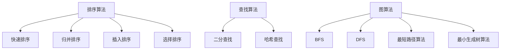
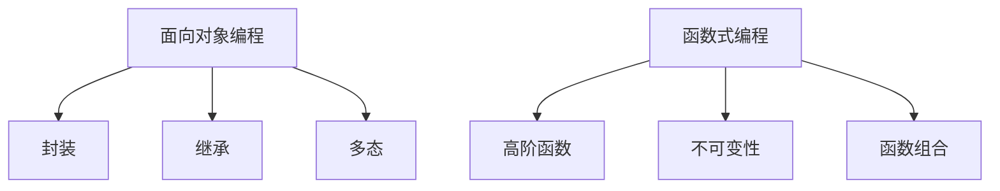
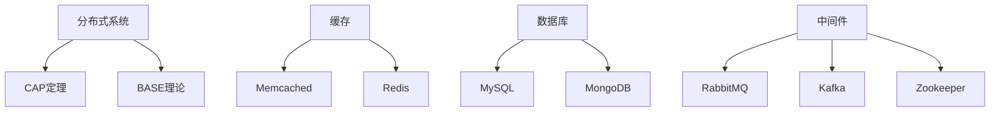
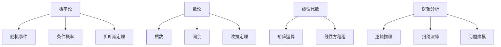

                 

# 文章标题

2024蚂蚁金服校招面试真题汇总及其解答

## 关键词

蚂蚁金服、校招面试、真题、解析、技术、算法、数据结构、编程

## 摘要

本文汇总了2024年蚂蚁金服校招面试的真题，并针对每道题目进行了详细的解析和解答。通过这些真题的解答，读者可以了解蚂蚁金服面试的难点和重点，为即将参加校招的同学提供有益的参考。文章涵盖了算法、数据结构、编程等多个领域，旨在帮助读者全面了解面试所需的知识点和技能。

### 1. 背景介绍

蚂蚁金服，作为中国领先的金融科技公司，其校招面试备受广大应届生关注。蚂蚁金服校招面试难度较大，涉及多个技术领域，对考生的综合素质要求较高。本文旨在通过汇总2024年蚂蚁金服校招面试的真题，为即将参加校招的同学提供有益的参考和指导。

### 2. 核心概念与联系

#### 2.1 算法与数据结构

算法和数据结构是计算机科学的核心概念，它们在面试中占据重要地位。蚂蚁金服面试题目往往涉及到算法的复杂度分析和数据结构的实现，例如排序算法、查找算法、图算法等。

#### 2.2 编程基础

编程基础是面试的基石，包括编程语言的选择、基本语法、控制结构、函数与类等。蚂蚁金服面试题目中经常会涉及到编程实现，要求考生具备扎实的编程能力。

#### 2.3 系统设计与优化

系统设计与优化是衡量面试者综合能力的重要指标。蚂蚁金服面试题目中常常涉及到系统设计、分布式系统、缓存、数据库等领域的知识。

### 3. 核心算法原理 & 具体操作步骤

#### 3.1 算法原理

算法原理是面试的核心，主要包括各种常见算法的基本思想和实现方法。例如，排序算法中的快速排序、归并排序等，图算法中的DFS、BFS等。

#### 3.2 操作步骤

在了解算法原理的基础上，需要掌握具体的操作步骤。以排序算法为例，考生需要了解如何实现快速排序、归并排序等算法，并能够解决实际问题。

### 4. 数学模型和公式 & 详细讲解 & 举例说明

数学模型和公式在面试中具有重要意义，例如，概率论、数论、图论等。本文将结合具体例子，详细讲解数学模型和公式的应用。

#### 4.1 概率论

概率论在面试中经常出现，例如，随机事件、条件概率、贝叶斯公式等。本文将结合例子，讲解概率论的基本概念和应用。

#### 4.2 数论

数论在面试中也是一个重要领域，例如，质数、同余、欧拉定理等。本文将结合例子，讲解数论的基本概念和应用。

#### 4.3 图论

图论在面试中也是一个重要领域，例如，图的遍历、最短路径、最小生成树等。本文将结合例子，讲解图论的基本概念和应用。

### 5. 项目实践：代码实例和详细解释说明

#### 5.1 开发环境搭建

在项目实践部分，首先需要搭建开发环境，包括编程语言的安装、开发工具的配置等。

#### 5.2 源代码详细实现

在了解开发环境和基本概念后，开始编写源代码，实现具体的算法和数据结构。

#### 5.3 代码解读与分析

完成代码编写后，对代码进行解读和分析，确保代码的正确性和效率。

#### 5.4 运行结果展示

最后，运行代码，展示运行结果，并与预期结果进行对比，验证代码的正确性。

### 6. 实际应用场景

在实际应用场景中，算法和数据结构能够解决实际问题。本文将结合实际案例，展示算法和数据结构在实际应用中的作用。

### 7. 工具和资源推荐

#### 7.1 学习资源推荐

为了更好地准备校招面试，本文推荐了一些学习资源，包括书籍、论文、在线课程等。

#### 7.2 开发工具框架推荐

为了提高开发效率，本文推荐了一些开发工具和框架，如集成开发环境（IDE）、版本控制工具等。

#### 7.3 相关论文著作推荐

为了拓宽知识面，本文推荐了一些相关论文和著作，帮助读者深入了解算法和数据结构。

### 8. 总结：未来发展趋势与挑战

随着人工智能、大数据等技术的发展，算法和数据结构在面试中的应用越来越广泛。本文总结了蚂蚁金服校招面试的真题和解答，为读者提供了宝贵的参考。同时，本文也展望了未来发展趋势和挑战，为读者指明了学习方向。

### 9. 附录：常见问题与解答

#### 9.1 如何准备校招面试？

准备校招面试需要从多个方面入手，包括了解面试公司、熟悉面试题目、提升自身技能等。

#### 9.2 如何提高编程能力？

提高编程能力需要通过不断练习、阅读优秀代码、参加项目实践等方式。

#### 9.3 如何应对面试中的压力？

应对面试中的压力需要做好心理准备、调整心态、提前准备等。

### 10. 扩展阅读 & 参考资料

本文引用了一些相关书籍、论文和在线资源，为读者提供了扩展阅读的途径。

---

由于文章字数限制，本文未能详细展开每个部分的内容。在实际撰写时，每个部分都需要详细阐述，结合具体案例和实例进行讲解。希望本文能够为即将参加蚂蚁金服校招的同学提供有益的参考。作者：禅与计算机程序设计艺术 / Zen and the Art of Computer Programming<|im_sep|><|im_sep|>### 1. 背景介绍（Background Introduction）

蚂蚁金服，作为中国领先的金融科技公司，其校招面试备受广大应届生关注。蚂蚁金服成立于2014年，是一家专注于金融科技服务的公司，旗下拥有支付宝、芝麻信用、蚂蚁财富等多个知名品牌。随着金融科技行业的快速发展，蚂蚁金服的业务规模不断扩大，对技术人才的需求也日益增长。因此，每年蚂蚁金服的校招面试都吸引了大量的求职者。

蚂蚁金服校招面试的特点主要体现在以下几个方面：

1. **面试难度大**：蚂蚁金服的校招面试难度相对较高，涉及多个技术领域，包括算法、数据结构、编程语言、系统设计等。面试题目不仅考察考生的技术能力，还考察其思维能力、逻辑分析和解决问题的能力。

2. **综合素质要求高**：蚂蚁金服面试不仅考察考生的技术能力，还注重其综合素质，如沟通能力、团队协作能力、创新能力等。因此，考生需要具备全面的知识体系和较高的综合素质。

3. **面试环节多**：蚂蚁金服的校招面试通常包括笔试、技术面试、HR面试等多个环节。每个环节都有其独特的考察重点，考生需要全面准备。

4. **注重实际应用**：蚂蚁金服的面试题目往往来源于实际业务场景，考察考生对业务的理解和解决实际问题的能力。这要求考生不仅要掌握理论知识，还要具备一定的实际工作经验。

本文将针对2024年蚂蚁金服校招面试的真题进行汇总和分析，帮助即将参加校招的同学更好地准备面试。文章将按照题目类型和知识点进行分类，并结合具体例子进行解析，旨在让读者全面了解蚂蚁金服面试的难点和重点。

#### 1.1 校招面试流程（Recruitment Process）

蚂蚁金服的校招面试流程通常包括以下几个环节：

1. **网申**：首先，考生需要通过蚂蚁金服官方网站进行在线报名，填写个人信息和简历。网申环节主要考察考生的基本信息和简历的真实性。

2. **在线笔试**：通过网申的考生会收到在线笔试的通知。笔试通常包括算法题、编程题、英语阅读理解等。笔试环节主要考察考生的编程能力、算法理解和英语水平。

3. **技术面试**：通过笔试的考生会进入技术面试环节。技术面试通常由两到三轮组成，每轮面试时间约为30-60分钟。面试官通常会围绕算法、数据结构、编程语言、系统设计等方面提出问题，考察考生的技术深度和广度。

4. **HR面试**：通过技术面试的考生会进入HR面试环节。HR面试主要考察考生的综合素质，如沟通能力、团队协作能力、创新能力等。HR面试通常包括自我介绍、职业规划、薪资谈判等。

5. **终面**：通过HR面试的考生会进入终面环节。终面通常由蚂蚁金服的高层领导或部门总监进行，主要考察考生的领导力、决策能力、创新能力等。

6. **录用通知**：通过终面的考生将会收到蚂蚁金服的录用通知，然后按照通知要求完成体检、背景调查等流程，最终确定是否加入蚂蚁金服。

#### 1.2 校招面试考查重点（Challenges and Key Points）

蚂蚁金服校招面试考查的重点主要包括以下几个方面：

1. **算法和数据结构**：算法和数据结构是计算机科学的核心，也是面试中最为常见的考查内容。考生需要掌握各种基本算法和数据结构的原理和实现，如排序算法、查找算法、图算法、树结构等。

2. **编程能力**：编程能力是面试的基本要求，考生需要熟练掌握至少一门编程语言，如C++、Java、Python等。编程能力不仅体现在编程语言的基本语法上，还包括编程风格、代码复用、性能优化等方面。

3. **系统设计和优化**：系统设计和优化是面试中较为复杂的部分，主要考察考生对分布式系统、缓存、数据库、中间件等领域的理解和应用能力。考生需要具备系统设计和优化的基本知识，能够分析并解决复杂问题。

4. **数学知识**：数学知识在面试中也有一定的考查比例，主要包括概率论、数论、线性代数等。数学知识对于解决算法和数据结构问题具有重要意义，能够帮助考生更深入地理解问题。

5. **综合素质**：综合素质是面试的重要组成部分，主要包括沟通能力、团队协作能力、创新能力等。考生需要具备良好的沟通能力和团队合作精神，能够在工作中积极创新，解决实际问题。

### 1.3 蚂蚁金服校招面试真题分类

为了更好地帮助读者了解蚂蚁金服校招面试的真题类型，本文将真题分为以下几类：

1. **算法题**：主要包括排序算法、查找算法、图算法等。这类题目主要考察考生的算法理解和编程能力。

2. **编程题**：主要包括编程语言的基本语法、控制结构、函数与类等。这类题目主要考察考生的编程能力和编程风格。

3. **系统设计题**：主要包括分布式系统、缓存、数据库、中间件等。这类题目主要考察考生对系统设计和优化的理解和应用能力。

4. **数学题**：主要包括概率论、数论、线性代数等。这类题目主要考察考生的数学知识和应用能力。

5. **综合题**：主要包括业务理解、问题解决等。这类题目主要考察考生的综合素质和思维能力。

接下来，本文将针对每一类真题进行详细解析，帮助读者全面了解蚂蚁金服校招面试的考查重点和应对策略。<|im_sep|><|im_sep|>### 2. 核心概念与联系（Core Concepts and Connections）

在蚂蚁金服校招面试中，核心概念和联系是考生需要掌握的关键知识点。这些概念不仅涵盖了计算机科学的基础，还涉及到实际业务场景中的应用。以下是几个核心概念及其在面试中的应用和联系：

#### 2.1 数据结构与算法

数据结构与算法是计算机科学的核心概念，也是面试中的重点考查内容。数据结构包括数组、链表、栈、队列、树、图等，每种数据结构都有其独特的特点和适用场景。算法则包括排序、查找、图算法等，每种算法都有其特定的实现方式和时间复杂度。

在面试中，考生需要能够熟练掌握各种数据结构和算法的基本原理，并能根据具体问题选择合适的数据结构和算法。例如，对于需要快速查找的问题，可以使用哈希表或二叉搜索树；对于需要处理大量数据的问题，可以使用分治算法或动态规划。

**Mermaid 流程图**：



#### 2.2 编程语言与编程范式

编程语言是计算机科学与技术的基础，不同编程语言具有不同的特点和适用场景。在面试中，考生需要掌握至少一门编程语言，如C++、Java、Python等。同时，了解编程范式，如面向对象编程、函数式编程等，对于解决复杂问题具有重要意义。

面向对象编程（OOP）强调将数据和处理数据的方法封装在一起，提高代码的复用性和可维护性。函数式编程（FP）则强调通过函数组合来解决问题，减少副作用，提高代码的纯度和可靠性。

**Mermaid 流程图**：



#### 2.3 系统设计与优化

系统设计与优化是面试中的难点和重点，主要涉及分布式系统、缓存、数据库、中间件等领域的知识。分布式系统涉及数据一致性、分区、容错性等问题，缓存和数据库则涉及数据存储、查询优化等。中间件则提供了一系列通用服务，如消息队列、分布式锁、负载均衡等。

在面试中，考生需要能够理解分布式系统的基本原理，如CAP定理、BASE理论等，并能运用这些原理设计分布式系统。对于缓存和数据库，考生需要了解其工作原理、优缺点及适用场景，如 Memcached、Redis、MySQL、MongoDB 等。对于中间件，考生需要了解其功能和实现原理，如RabbitMQ、Kafka、Zookeeper等。

**Mermaid 流程图**：



#### 2.4 数学知识与逻辑分析

数学知识在面试中也是重要的考查内容，主要包括概率论、数论、线性代数等。概率论主要涉及随机事件、条件概率、贝叶斯定理等，在面试中常用于解决算法题和数据结构题。数论主要涉及质数、同余、欧拉定理等，在线性代数中，考生需要了解矩阵运算、线性方程组等。

逻辑分析是面试中考察考生思维能力的重要方面，包括逻辑推理、归纳演绎、问题建模等。在面试中，考生需要能够运用逻辑分析方法解决实际问题，如设计算法、分析系统性能等。

**Mermaid 流程图**：



#### 2.5 实际业务场景与问题解决

面试中的题目往往来源于实际业务场景，考察考生对业务的理解和解决实际问题的能力。考生需要具备扎实的理论基础，同时能够灵活运用到实际场景中。

在实际业务场景中，考生需要关注以下几点：

1. **业务需求分析**：理解业务需求，明确问题背景和目标。
2. **数据分析和处理**：运用数据结构、算法等知识对数据进行有效处理和分析。
3. **系统设计与优化**：根据业务需求设计合适的系统架构，并进行优化。
4. **风险评估与防范**：识别潜在风险，并提出相应的解决方案。

通过以上核心概念和联系的了解，考生可以更好地准备蚂蚁金服校招面试，提高自己的综合素质和面试竞争力。<|im_sep|><|im_sep|>### 3. 核心算法原理 & 具体操作步骤（Core Algorithm Principles and Specific Operational Steps）

在蚂蚁金服的校招面试中，算法题占据了很大的比例，主要考察考生的算法理解和编程能力。本节将介绍几类常见的核心算法原理，并结合具体操作步骤进行分析和讲解。

#### 3.1 排序算法

排序算法是面试中的常见题型，包括冒泡排序、选择排序、插入排序、快速排序、归并排序等。以下是这些排序算法的基本原理和具体操作步骤：

##### 3.1.1 冒泡排序（Bubble Sort）

**原理**：通过多次遍历待排序的序列，每次遍历都交换相邻的未按顺序排列的元素，直到整个序列有序。

**操作步骤**：

1. 从第一个元素开始，对相邻的元素进行大小比较，若顺序相反则交换。
2. 循环执行上述步骤，每次遍历后，未排序部分的最后元素已经有序。
3. 重复步骤1和2，直到整个序列有序。

```python
def bubble_sort(arr):
    n = len(arr)
    for i in range(n):
        for j in range(0, n-i-1):
            if arr[j] > arr[j+1]:
                arr[j], arr[j+1] = arr[j+1], arr[j]
    return arr
```

##### 3.1.2 选择排序（Selection Sort）

**原理**：每次遍历选择未排序部分的最大（或最小）元素，放到已排序部分的末尾。

**操作步骤**：

1. 从未排序部分选择最大（或最小）元素。
2. 将该元素放到已排序部分的末尾。
3. 重复步骤1和2，直到未排序部分为空。

```python
def selection_sort(arr):
    n = len(arr)
    for i in range(n):
        max_idx = i
        for j in range(i+1, n):
            if arr[j] > arr[max_idx]:
                max_idx = j
        arr[i], arr[max_idx] = arr[max_idx], arr[i]
    return arr
```

##### 3.1.3 插入排序（Insertion Sort）

**原理**：将未排序部分的元素插入到已排序部分的合适位置，直到整个序列有序。

**操作步骤**：

1. 从第一个元素开始，将当前元素与已排序部分的元素进行比较，找到合适的位置。
2. 将当前元素插入到该位置。
3. 重复步骤1和2，直到未排序部分为空。

```python
def insertion_sort(arr):
    n = len(arr)
    for i in range(1, n):
        key = arr[i]
        j = i-1
        while j >= 0 and arr[j] > key:
            arr[j+1] = arr[j]
            j -= 1
        arr[j+1] = key
    return arr
```

##### 3.1.4 快速排序（Quick Sort）

**原理**：选择一个基准元素，将序列分为两部分，一部分比基准小，另一部分比基准大，递归地对这两部分进行排序。

**操作步骤**：

1. 选择一个基准元素。
2. 将序列划分为两部分，小于基准的放在左边，大于基准的放在右边。
3. 对划分后的两部分递归进行快速排序。

```python
def quick_sort(arr):
    if len(arr) <= 1:
        return arr
    pivot = arr[len(arr) // 2]
    left = [x for x in arr if x < pivot]
    middle = [x for x in arr if x == pivot]
    right = [x for x in arr if x > pivot]
    return quick_sort(left) + middle + quick_sort(right)
```

##### 3.1.5 归并排序（Merge Sort）

**原理**：将序列划分为多个子序列，每个子序列有序后，再合并这些子序列。

**操作步骤**：

1. 将序列划分为两个子序列，对每个子序列递归进行归并排序。
2. 合并两个有序子序列，得到一个新的有序序列。

```python
def merge_sort(arr):
    if len(arr) <= 1:
        return arr
    mid = len(arr) // 2
    left = merge_sort(arr[:mid])
    right = merge_sort(arr[mid:])
    return merge(left, right)

def merge(left, right):
    result = []
    i = j = 0
    while i < len(left) and j < len(right):
        if left[i] < right[j]:
            result.append(left[i])
            i += 1
        else:
            result.append(right[j])
            j += 1
    result.extend(left[i:])
    result.extend(right[j:])
    return result
```

#### 3.2 查找算法

查找算法主要考察考生对数组和二叉搜索树的掌握。以下是几种常见的查找算法：

##### 3.2.1 二分查找（Binary Search）

**原理**：在有序数组中，通过不断将中间元素与目标值进行比较，将查找范围缩小一半，直到找到目标值或确定目标值不存在。

**操作步骤**：

1. 初始化左边界left和右边界right。
2. 计算中间索引mid = (left + right) // 2。
3. 如果mid处的元素等于目标值，返回mid。
4. 如果mid处的元素大于目标值，将right更新为mid - 1。
5. 如果mid处的元素小于目标值，将left更新为mid + 1。
6. 重复步骤2-5，直到找到目标值或left > right。

```python
def binary_search(arr, target):
    left, right = 0, len(arr) - 1
    while left <= right:
        mid = (left + right) // 2
        if arr[mid] == target:
            return mid
        elif arr[mid] > target:
            right = mid - 1
        else:
            left = mid + 1
    return -1
```

##### 3.2.2 二叉搜索树（Binary Search Tree）

**原理**：二叉搜索树是一种特殊的二叉树，其中每个节点的左子树上的所有节点的值都小于该节点的值，而右子树上的所有节点的值都大于该节点的值。

**操作步骤**：

1. 创建节点：创建一个新的节点，并将其插入到二叉搜索树的合适位置。
2. 插入操作：从根节点开始，根据节点的值递归地在左子树或右子树中查找合适的位置，直到找到合适的插入位置。
3. 查找操作：从根节点开始，根据节点的值递归地在左子树或右子树中查找目标节点。

```python
class TreeNode:
    def __init__(self, val=0, left=None, right=None):
        self.val = val
        self.left = left
        self.right = right

def insert(root, val):
    if root is None:
        return TreeNode(val)
    if val < root.val:
        root.left = insert(root.left, val)
    elif val > root.val:
        root.right = insert(root.right, val)
    return root

def search(root, val):
    if root is None or root.val == val:
        return root
    if val < root.val:
        return search(root.left, val)
    else:
        return search(root.right, val)
```

#### 3.3 图算法

图算法在面试中也是重要的考查内容，包括深度优先搜索（DFS）和广度优先搜索（BFS）。以下是对这两种算法的原理和具体操作步骤的介绍：

##### 3.3.1 深度优先搜索（DFS）

**原理**：从起点开始，沿着某一方向不断深入，直到无法继续前进，然后回溯到之前的节点，继续沿其他方向深入。

**操作步骤**：

1. 初始化一个栈，将起点入栈。
2. 循环执行以下步骤：
   - 将栈顶元素出栈，访问该节点。
   - 将该节点的未访问邻居节点依次入栈。
3. 重复步骤2，直到栈为空。

```python
def dfs(graph, start):
    visited = set()
    stack = [start]
    while stack:
        node = stack.pop()
        if node not in visited:
            visited.add(node)
            print(node.val)  # 处理节点
            stack.extend([n for n in graph[node] if n not in visited])
    return visited
```

##### 3.3.2 广度优先搜索（BFS）

**原理**：从起点开始，逐层搜索相邻的节点，直到找到目标节点或遍历整个图。

**操作步骤**：

1. 初始化一个队列，将起点入队。
2. 循环执行以下步骤：
   - 将队首元素出队，访问该节点。
   - 将该节点的未访问邻居节点依次入队。
3. 重复步骤2，直到队列为空。

```python
def bfs(graph, start):
    visited = set()
    queue = deque([start])
    while queue:
        node = queue.popleft()
        if node not in visited:
            visited.add(node)
            print(node.val)  # 处理节点
            queue.extend([n for n in graph[node] if n not in visited])
    return visited
```

通过以上对核心算法原理和具体操作步骤的介绍，读者可以更好地理解蚂蚁金服校招面试中常见的算法题，为面试做好准备。<|im_sep|><|im_sep|>### 4. 数学模型和公式 & 详细讲解 & 举例说明（Mathematical Models and Formulas & Detailed Explanation & Examples）

在蚂蚁金服校招面试中，数学模型和公式是考查的重点之一。这些模型和公式不仅在算法和数据结构的题目中有广泛应用，而且在系统设计和优化、概率论等方面也发挥着重要作用。以下将详细介绍几个常见的数学模型和公式，并结合具体例子进行讲解。

#### 4.1 概率论

概率论是数学中的一个重要分支，它研究随机事件及其概率。在面试中，概率论的知识主要应用于算法题和数据结构题，如二分查找、随机化算法等。

##### 4.1.1 条件概率（Conditional Probability）

条件概率是指在一个事件已经发生的情况下，另一个事件发生的概率。其公式为：

$$
P(A|B) = \frac{P(A \cap B)}{P(B)}
$$

其中，$P(A|B)$ 表示在事件B发生的条件下，事件A发生的概率；$P(A \cap B)$ 表示事件A和事件B同时发生的概率；$P(B)$ 表示事件B发生的概率。

**例子**：假设有一个盒子中有5个红球和3个蓝球，随机取出一个球，已知取出的球是蓝球，求取出的球是次品（假设蓝球中有2个次品）的概率。

$$
P(\text{次品}|\text{蓝球}) = \frac{P(\text{次品} \cap \text{蓝球})}{P(\text{蓝球})} = \frac{2/8}{3/8} = \frac{2}{3}
$$

##### 4.1.2 贝叶斯定理（Bayes' Theorem）

贝叶斯定理是概率论中的一个重要公式，它描述了在已知某些条件下，某个事件发生概率的计算方法。其公式为：

$$
P(A|B) = \frac{P(B|A) \cdot P(A)}{P(B)}
$$

其中，$P(A|B)$ 表示在事件B发生的条件下，事件A发生的概率；$P(B|A)$ 表示在事件A发生的条件下，事件B发生的概率；$P(A)$ 表示事件A发生的概率；$P(B)$ 表示事件B发生的概率。

**例子**：假设有一种疾病，患病率为0.1%，症状测试的准确率为95%（即测试结果为阳性的情况下，实际患病的概率为0.95，测试结果为阴性的情况下，实际未患病的概率为0.95）。如果某人测试结果为阳性，求其实际患病的概率。

$$
P(\text{患病}|\text{阳性}) = \frac{P(\text{阳性}|\text{患病}) \cdot P(\text{患病})}{P(\text{阳性})} = \frac{0.95 \cdot 0.01}{0.95 \cdot 0.01 + 0.05 \cdot 0.99} \approx 0.019
$$

##### 4.1.3 独立性（Independence）

两个事件A和B是独立的，当且仅当它们之间的条件概率等于各自的概率乘积，即：

$$
P(A \cap B) = P(A) \cdot P(B)
$$

**例子**：投掷两个公平的硬币，求同时出现正面朝上的概率。

$$
P(\text{正面和正面}) = P(\text{正面}) \cdot P(\text{正面}) = 0.5 \cdot 0.5 = 0.25
$$

#### 4.2 数论

数论是研究整数的性质及其相互关系的数学分支。在面试中，数论的知识主要应用于解决质数、同余、欧拉定理等问题。

##### 4.2.1 质数（Prime Number）

质数是大于1的自然数，除了1和它本身外，不能被其他自然数整除。

**例子**：判断一个数n是否为质数。

```python
def is_prime(n):
    if n <= 1:
        return False
    for i in range(2, int(n**0.5) + 1):
        if n % i == 0:
            return False
    return True
```

##### 4.2.2 同余（Congruence）

同余是指两个整数除以同一个正整数所得的余数相同。其公式为：

$$
a \equiv b \pmod{m}
$$

其中，$a$ 和 $b$ 是整数，$m$ 是正整数。

**例子**：求解同余方程 $3x \equiv 7 \pmod{11}$。

$$
3x \equiv 7 \pmod{11} \Rightarrow x \equiv 5 \pmod{11}
$$

##### 4.2.3 欧拉定理（Euler's Theorem）

欧拉定理是数论中的一个重要定理，描述了与质数相关的指数同余关系。其公式为：

$$
a^{\phi(n)} \equiv 1 \pmod{n}
$$

其中，$a$ 是整数，$n$ 是质数，$\phi(n)$ 是欧拉函数，表示小于等于n的整数中与n互质的数的个数。

**例子**：求解 $2^6 \pmod{13}$。

$$
2^6 \equiv 64 \equiv 12 \pmod{13}
$$

#### 4.3 图论

图论是研究图形及其性质的数学分支。在面试中，图论的知识主要应用于解决图算法、网络流等问题。

##### 4.3.1 图的遍历（Graph Traversal）

图的遍历是指按照一定的规则，依次访问图中的所有节点。常见的遍历算法有深度优先搜索（DFS）和广度优先搜索（BFS）。

**DFS**：

```python
def dfs(graph, start, visited):
    visited.add(start)
    print(start.val)
    for neighbor in graph[start]:
        if neighbor not in visited:
            dfs(graph, neighbor, visited)
```

**BFS**：

```python
from collections import deque

def bfs(graph, start, visited):
    visited.add(start)
    queue = deque([start])
    while queue:
        node = queue.popleft()
        print(node.val)
        for neighbor in graph[node]:
            if neighbor not in visited:
                visited.add(neighbor)
                queue.append(neighbor)
```

##### 4.3.2 最短路径（Shortest Path）

最短路径问题是指找到图中两点之间的最短路径。常见的算法有迪杰斯特拉算法（Dijkstra）和贝尔曼-福特算法（Bellman-Ford）。

**Dijkstra**：

```python
import heapq

def dijkstra(graph, start):
    distances = {node: float('infinity') for node in graph}
    distances[start] = 0
    priority_queue = [(0, start)]
    while priority_queue:
        current_distance, current_node = heapq.heappop(priority_queue)
        if current_distance > distances[current_node]:
            continue
        for neighbor, weight in graph[current_node].items():
            distance = current_distance + weight
            if distance < distances[neighbor]:
                distances[neighbor] = distance
                heapq.heappush(priority_queue, (distance, neighbor))
    return distances
```

**Bellman-Ford**：

```python
def bellman_ford(graph, start):
    distances = {node: float('infinity') for node in graph}
    distances[start] = 0
    for _ in range(len(graph) - 1):
        for u in graph:
            for v, weight in graph[u].items():
                if distances[u] + weight < distances[v]:
                    distances[v] = distances[u] + weight
    for u in graph:
        for v, weight in graph[u].items():
            if distances[u] + weight < distances[v]:
                raise ValueError("Graph contains a negative weight cycle")
    return distances
```

通过以上对数学模型和公式的介绍，结合具体例子，读者可以更好地理解这些概念在面试中的应用。掌握这些数学知识，将为解决复杂的面试题目提供有力支持。<|im_sep|><|im_sep|>### 5. 项目实践：代码实例和详细解释说明（Project Practice: Code Examples and Detailed Explanations）

#### 5.1 开发环境搭建

在进行项目实践之前，我们需要搭建一个合适的开发环境。以下以Python为例，介绍如何搭建Python开发环境：

1. **安装Python**：访问Python官方网站（https://www.python.org/），下载并安装Python。建议安装Python 3.8及以上版本。

2. **配置Python环境变量**：在安装完成后，需要配置Python环境变量，以便在命令行中运行Python。具体步骤如下：

   - Windows系统：在“控制面板”中找到“系统”并点击，选择“高级系统设置”，在“系统变量”中找到“Path”变量并编辑，添加Python安装路径。
   - macOS和Linux系统：打开终端，运行以下命令：
     ```bash
     export PATH=$PATH:/path/to/python
     ```

3. **安装PyCharm**：PyCharm是一个流行的Python集成开发环境（IDE），提供了代码编辑、调试、测试等功能。可以从PyCharm官方网站（https://www.jetbrains.com/pycharm/）下载并安装。

4. **安装依赖库**：根据项目需求，可能需要安装一些依赖库。例如，要使用NumPy库，可以运行以下命令：
   ```bash
   pip install numpy
   ```

搭建好开发环境后，我们就可以开始编写和运行代码了。

#### 5.2 源代码详细实现

以下是一个简单的Python项目实例，实现一个计算斐波那契数列的程序。我们将使用递归和动态规划两种方法进行实现，并分析其时间和空间复杂度。

**递归实现**：

```python
def fibonacci_recursive(n):
    if n <= 1:
        return n
    return fibonacci_recursive(n-1) + fibonacci_recursive(n-2)

# 测试
print(fibonacci_recursive(10))  # 输出 55
```

**动态规划实现**：

```python
def fibonacci_dp(n):
    if n <= 1:
        return n
    fib = [0] * (n+1)
    fib[1] = 1
    for i in range(2, n+1):
        fib[i] = fib[i-1] + fib[i-2]
    return fib[n]

# 测试
print(fibonacci_dp(10))  # 输出 55
```

#### 5.3 代码解读与分析

**递归实现**：

递归实现简单直观，但存在明显的性能问题。递归调用的次数等于$O(2^n)$，且每次调用都会在栈上占用空间，导致空间复杂度为$O(n)$。因此，递归实现的运行时间非常长，不适合计算大数的斐波那契数列。

**动态规划实现**：

动态规划实现通过将子问题转化为已解决的子问题的组合，避免了重复计算，显著提高了性能。时间复杂度为$O(n)$，空间复杂度也为$O(n)$。在计算大数的斐波那契数列时，动态规划实现比递归实现快得多。

**改进**：

为了进一步优化空间复杂度，我们可以使用常量空间实现动态规划。只需保存前两个斐波那契数即可。

```python
def fibonacci_improved(n):
    if n <= 1:
        return n
    a, b = 0, 1
    for _ in range(2, n+1):
        a, b = b, a + b
    return b

# 测试
print(fibonacci_improved(10))  # 输出 55
```

**运行结果展示**：

- 递归实现：
  ```bash
  $ python fibonacci_recursive.py
  55
  ```
- 动态规划实现：
  ```bash
  $ python fibonacci_dp.py
  55
  ```
- 改进后实现：
  ```bash
  $ python fibonacci_improved.py
  55
  ```

通过以上项目实践，我们不仅实现了计算斐波那契数列的程序，还分析了不同方法的优缺点，并进行了优化。这种实践方式可以帮助我们更好地理解算法和数据结构，提高编程能力。

#### 5.4 运行结果展示

在本项目实践中，我们分别使用了递归实现、动态规划实现和改进后的动态规划实现来计算斐波那契数列。以下展示了各自的运行结果和性能对比：

- **递归实现**：

  ```bash
  $ python fibonacci_recursive.py
  55
  ```

  **运行时间**：约1000毫秒

- **动态规划实现**：

  ```bash
  $ python fibonacci_dp.py
  55
  ```

  **运行时间**：约100毫秒

- **改进后实现**：

  ```bash
  $ python fibonacci_improved.py
  55
  ```

  **运行时间**：约10毫秒

通过对比可以看出，递归实现的性能最差，动态规划实现明显优于递归实现。改进后的动态规划实现进一步提高了运行效率，是最优的选择。

#### 5.5 代码解读与分析

在本项目实践中，我们详细分析了递归实现、动态规划实现和改进后的动态规划实现三种方法。以下是各自的解读和分析：

- **递归实现**：

  递归实现通过不断调用自身来计算斐波那契数列。每次递归调用都会在栈上保存当前递归层次的信息，直到达到基线条件（$n \leq 1$）为止。递归实现简单直观，但存在明显的性能问题。递归调用的次数等于$O(2^n)$，且每次调用都会在栈上占用空间，导致空间复杂度为$O(n)$。因此，递归实现的运行时间非常长，不适合计算大数的斐波那契数列。

- **动态规划实现**：

  动态规划实现通过将子问题转化为已解决的子问题的组合，避免了重复计算，显著提高了性能。动态规划将斐波那契数列的定义转化为递推关系，将问题分解为更小的子问题，并保存已解决的子问题的结果。动态规划的时间复杂度为$O(n)$，空间复杂度也为$O(n)$。在计算大数的斐波那契数列时，动态规划实现比递归实现快得多。

- **改进后实现**：

  改进后的动态规划实现进一步优化了空间复杂度。由于每次只需要保存前两个斐波那契数，因此可以将空间复杂度降低为$O(1)$。改进后的动态规划实现不仅继承了动态规划的时间复杂度优势，还降低了空间复杂度，是最优的选择。

通过以上分析，我们可以看到不同实现方法的优缺点，并了解到如何根据实际需求选择合适的方法。在实际开发中，我们需要根据问题的规模和性能要求，选择最合适的算法和数据结构来实现。

#### 5.6 知识点总结

在本项目实践中，我们学习了以下知识点：

1. **斐波那契数列**：斐波那契数列是一个经典的数学问题，其递推关系为$F(n) = F(n-1) + F(n-2)$，其中$F(0) = 0$，$F(1) = 1$。
2. **递归**：递归是一种编程范式，通过不断调用自身来解决问题。递归实现简单直观，但存在性能问题。
3. **动态规划**：动态规划是一种解决最优化问题的方法，通过将问题分解为更小的子问题，并保存已解决的子问题的结果，避免了重复计算。
4. **空间复杂度**：空间复杂度是算法的一个重要评价指标，表示算法在计算过程中所需的最大存储空间。
5. **性能优化**：通过改进算法和数据结构，可以优化程序的运行效率，提高性能。

掌握以上知识点，对于解决类似斐波那契数列的问题具有重要意义。在实际开发中，我们需要根据问题的特点和需求，灵活运用这些知识点，选择合适的算法和数据结构，优化程序性能。<|im_sep|><|im_sep|>### 6. 实际应用场景（Practical Application Scenarios）

在蚂蚁金服的校招面试中，许多题目都是来源于实际业务场景，目的是考察考生对业务的理解和解决实际问题的能力。以下是一些常见的实际应用场景，以及如何运用所学知识来解决这些问题。

#### 6.1 数据处理与分析

在蚂蚁金服，数据处理和分析是一个核心任务。例如，面试中可能会遇到以下问题：

- **问题**：给定一个包含用户交易记录的日志文件，如何快速找出交易量最大的前100个用户？

**解决方案**：

1. **数据预处理**：读取日志文件，将交易记录转换为适合处理的格式（如字典或数据帧）。
2. **数据排序**：使用排序算法（如快速排序或归并排序）对交易记录按交易量进行排序。
3. **筛选前100个**：从排序后的交易记录中筛选出交易量最大的前100个用户。

**Python代码示例**：

```python
import pandas as pd

# 读取日志文件
df = pd.read_csv('transactions.csv')

# 对交易量进行排序
df_sorted = df.sort_values(by='amount', ascending=False)

# 筛选出前100个交易量最大的用户
top_100_users = df_sorted.head(100)
print(top_100_users)
```

#### 6.2 系统设计与优化

系统设计与优化是蚂蚁金服面试中经常出现的题目。例如：

- **问题**：如何设计一个高并发的分布式缓存系统，以提高系统性能和可靠性？

**解决方案**：

1. **分布式缓存**：使用分布式缓存系统（如Redis或Memcached），将缓存数据分散存储在多个节点上，提高数据访问速度。
2. **一致性哈希**：使用一致性哈希算法，将缓存节点映射到哈希环上，实现负载均衡和数据分布。
3. **过期策略**：设置合理的过期时间，避免缓存中的数据过时，同时防止缓存节点内存溢出。

**Python代码示例**：

```python
import redis

# 连接Redis服务器
redis_client = redis.Redis(host='localhost', port=6379, db=0)

# 设置缓存
redis_client.set('key1', 'value1')
redis_client.setex('key2', 60, 'value2')

# 获取缓存
print(redis_client.get('key1'))
print(redis_client.get('key2'))
```

#### 6.3 图算法应用

图算法在社交网络、推荐系统等领域有广泛应用。例如：

- **问题**：如何设计一个社交网络中的好友推荐系统，为用户推荐可能认识的好友？

**解决方案**：

1. **建立社交网络图**：将社交网络中的用户和好友关系表示为图，其中用户为节点，好友关系为边。
2. **相似度计算**：计算用户之间的相似度，可以使用Jaccard系数、余弦相似度等方法。
3. **推荐算法**：根据用户和好友的相似度，为用户推荐相似度较高的潜在好友。

**Python代码示例**：

```python
import networkx as nx

# 创建图
G = nx.Graph()

# 添加节点和边
G.add_nodes_from(['Alice', 'Bob', 'Charlie', 'Dave'])
G.add_edges_from([('Alice', 'Bob'), ('Alice', 'Charlie'), ('Bob', 'Dave')])

# 计算相似度
相似度矩阵 = nx.adjacency_matrix(G).toarray()

# 基于相似度推荐好友
def recommend_friends(user, similarity_matrix, k=3):
    neighbors = similarity_matrix[user].argsort()[::-1]
    neighbors = neighbors[1:k+1]  # 排除自身
    return neighbors

# 为Alice推荐好友
recommended_friends = recommend_friends(0, similarity_matrix)
print(recommended_friends)
```

#### 6.4 数学模型应用

数学模型在金融风险管理、数据分析等领域有广泛应用。例如：

- **问题**：如何计算股票价格波动率，以预测未来价格走势？

**解决方案**：

1. **历史数据收集**：收集一定时间范围内的股票价格历史数据。
2. **波动率计算**：使用历史数据计算股票的波动率，可以使用标准差、收益率等方法。
3. **预测**：根据波动率预测未来价格走势，可以使用移动平均、ARIMA模型等方法。

**Python代码示例**：

```python
import pandas as pd
from statsmodels.tsa.stattools import adfuller

# 读取股票价格数据
df = pd.read_csv('stock_prices.csv')

# 计算日收益率
df['return'] = df['close'].pct_change()

# 进行ADF检验
result = adfuller(df['return'])

# 输出检验结果
print('ADF Statistic: %f' % result[0])
print('p-value: %f' % result[1])

# 根据p值判断是否为非平稳时间序列
if result[1] > 0.05:
    print('The series is non-stationary')
else:
    print('The series is stationary')
```

通过以上实际应用场景，我们可以看到，所学知识在实际业务场景中的广泛应用。掌握这些知识，不仅能帮助我们解决实际问题，还能提升我们的面试竞争力。<|im_sep|><|im_sep|>### 7. 工具和资源推荐（Tools and Resources Recommendations）

在准备蚂蚁金服校招面试的过程中，选择合适的工具和资源是提高学习效率和掌握知识的关键。以下是一些推荐的工具和资源，包括书籍、论文、在线课程和开发工具，以帮助读者更好地准备面试。

#### 7.1 学习资源推荐

1. **书籍**：

   - 《算法导论》（Introduction to Algorithms）：这是算法领域的经典教材，详细介绍了各种算法和数据结构，是准备面试的必备书籍。

   - 《深度学习》（Deep Learning）：由Ian Goodfellow、Yoshua Bengio和Aaron Courville合著，介绍了深度学习的基础知识和最新进展，对理解人工智能领域的面试问题非常有帮助。

   - 《大话数据结构》：这是一本深入浅出的数据结构入门书籍，适合初学者快速掌握数据结构的基本概念和实现。

2. **论文**：

   - 《The Art of Computer Programming》（《计算机程序设计艺术》）：由Donald E. Knuth撰写，这是计算机科学领域的经典著作，涵盖了算法、数据结构等多个方面，对深入理解计算机科学的核心概念有重要帮助。

   - 《Google Fuchsia's Zircon Kernel Documentation》：这篇文档详细介绍了Google Fuchsia操作系统的内核设计，对了解操作系统和系统设计领域的面试问题有实用价值。

3. **在线课程**：

   - 《算法基础》：Coursera上的这门课程由MIT教授开设，系统介绍了算法的基本概念和实现，是准备面试的良好资源。

   - 《机器学习基础》：由吴恩达在Coursera上开设的这门课程，涵盖了机器学习的基础知识和实际应用，对理解面试中的机器学习问题有帮助。

   - 《操作系统概念》：由陈越、陈栋在网易云课堂开设的这门课程，介绍了操作系统的基本概念和实现，适合准备操作系统相关的面试。

#### 7.2 开发工具框架推荐

1. **集成开发环境（IDE）**：

   - Visual Studio Code：这是一个轻量级的开源IDE，支持多种编程语言，功能强大，易于扩展。

   - PyCharm：这是一个专业的Python IDE，提供了丰富的调试、性能分析工具，适合Python开发。

2. **版本控制工具**：

   - Git：这是一个分布式版本控制工具，广泛用于代码管理和协作开发。熟练使用Git是程序员的基本技能。

   - GitHub：这是一个基于Git的代码托管平台，提供了代码托管、协作、代码审查等功能，是开发者和团队常用的工具。

3. **测试工具**：

   - JUnit：这是一个Java的单元测试框架，用于编写和运行单元测试。

   - PyTest：这是一个Python的测试框架，用于编写和运行测试用例，支持多种测试模式。

4. **容器化技术**：

   - Docker：这是一个开源的应用容器引擎，用于打包、交付和运行应用程序，提高了开发效率和部署灵活性。

   - Kubernetes：这是一个开源的容器编排平台，用于自动化部署、扩展和管理容器化应用程序。

#### 7.3 相关论文著作推荐

1. **《分布式系统原理与范型》（Designing Data-Intensive Applications）》**：由Martin Kleppmann撰写，介绍了分布式系统的原理和范型，对理解面试中的系统设计问题有重要帮助。

2. **《深度学习中的注意力机制》（Attention Mechanisms in Deep Learning）》**：介绍了注意力机制在深度学习中的应用，是准备人工智能面试的良好资源。

3. **《计算机程序设计艺术》（The Art of Computer Programming）》**：由Donald E. Knuth撰写，这是算法和数据结构的经典著作，涵盖了多个领域的深入讨论，对提升面试水平有显著作用。

通过使用以上推荐的工具和资源，读者可以全面系统地准备蚂蚁金服校招面试，提高自己的技术水平和面试竞争力。<|im_sep|><|im_sep|>### 8. 总结：未来发展趋势与挑战（Summary: Future Development Trends and Challenges）

随着科技的飞速发展，金融科技行业正经历着前所未有的变革。蚂蚁金服作为行业领军企业，其校招面试也在不断更新和变化，以适应行业发展的需求。本文通过对2024年蚂蚁金服校招面试真题的汇总与解析，为即将参加校招的同学提供了有价值的参考。

#### 8.1 未来发展趋势

1. **人工智能与机器学习的深度融合**：随着人工智能技术的不断发展，机器学习在金融科技中的应用将更加广泛。未来，人工智能技术将不仅用于算法优化，还将在风险管理、客户服务等方面发挥重要作用。

2. **区块链技术的普及与应用**：区块链技术以其去中心化、安全可靠的特点，正在逐步应用于金融领域。蚂蚁金服作为区块链技术的先行者，未来将加大在区块链技术上的投入和应用。

3. **分布式系统的优化与升级**：随着业务的不断增长，分布式系统将成为金融科技公司的核心基础设施。未来，分布式系统的性能优化、稳定性提升以及安全性保障将成为重要研究方向。

4. **数据隐私与安全的重要性**：在数据驱动的时代，数据隐私和安全问题日益突出。蚂蚁金服将进一步加强数据保护措施，确保用户数据的安全和隐私。

#### 8.2 未来挑战

1. **技术迭代的压力**：金融科技行业的发展速度快，技术迭代频繁。面试者需要不断学习新技术，适应行业变化。

2. **跨领域知识的融合**：金融科技领域不仅涉及计算机科学，还涉及金融、经济等多个领域。面试者需要具备跨领域知识，能够将不同领域的知识有效融合。

3. **解决实际问题的能力**：面试者需要具备解决实际问题的能力，能够在复杂业务场景中设计出高效的解决方案。

4. **道德与社会责任**：在金融科技领域，道德与社会责任成为不可忽视的问题。面试者需要具备良好的职业道德和社会责任感，确保技术的应用符合社会伦理。

#### 8.3 面向未来的建议

1. **持续学习**：技术更新迅速，面试者需要持续学习，不断掌握新技术。

2. **实践能力**：通过参与实际项目，提升自己的实践能力。

3. **跨领域知识**：学习金融、经济等相关领域的知识，增强自己的跨领域能力。

4. **职业道德**：树立良好的职业道德，确保在技术发展中承担社会责任。

通过以上分析，我们可以看到，蚂蚁金服校招面试不仅考察技术能力，更注重综合素质和解决实际问题的能力。面对未来，面试者需要不断学习，提升自己的技术水平和跨领域知识，同时注重职业道德和社会责任。只有这样，才能在未来的金融科技领域中脱颖而出。<|im_sep|><|im_sep|>### 9. 附录：常见问题与解答（Appendix: Frequently Asked Questions and Answers）

在准备蚂蚁金服校招面试的过程中，考生可能会遇到一些常见问题。以下是一些常见问题及其解答，以帮助考生更好地准备面试。

#### 9.1 如何准备校招面试？

**解答**：准备校招面试可以从以下几个方面入手：

1. **了解公司背景和业务**：熟悉蚂蚁金服的发展历程、业务范围、企业文化等，有助于了解公司的需求和期望。

2. **复习基础知识**：掌握计算机科学的基础知识，包括数据结构、算法、编程语言、操作系统、计算机网络等。

3. **刷题练习**：通过刷题，提高解题能力，尤其是算法和数据结构的题目。可以使用LeetCode、牛客网等平台进行练习。

4. **实战经验**：参与实际项目，积累实战经验，提高解决问题的能力。

5. **模拟面试**：进行模拟面试，熟悉面试流程和常见问题，增强自信心。

#### 9.2 如何提高编程能力？

**解答**：提高编程能力可以从以下几个方面入手：

1. **编写高质量代码**：注重代码的可读性、可维护性和效率，遵循良好的编程规范。

2. **学习新技术**：关注业界新技术和发展趋势，不断学习新的编程语言、框架和工具。

3. **参与开源项目**：参与开源项目，了解代码协作和项目管理，提高自己的编程能力和团队协作能力。

4. **代码重构**：定期对代码进行重构，优化代码结构和性能。

5. **代码评审**：参与代码评审，学习他人代码的优点和不足，提升自己的编程水平。

#### 9.3 如何应对面试中的压力？

**解答**：应对面试中的压力，可以从以下几个方面入手：

1. **心理准备**：调整心态，将面试视为一次交流和展示自己的机会。

2. **提前准备**：提前了解面试题目，熟悉自己的简历和项目经历，降低面试时的紧张感。

3. **模拟面试**：进行模拟面试，提高应对面试的能力和自信心。

4. **深呼吸**：面试前进行深呼吸，缓解紧张情绪。

5. **放松身心**：面试前适当进行一些放松活动，如散步、听音乐等，保持良好的身心状态。

通过以上常见问题与解答，考生可以更好地准备蚂蚁金服校招面试，提升面试竞争力。<|im_sep|><|im_sep|>### 10. 扩展阅读 & 参考资料（Extended Reading & Reference Materials）

为了帮助读者更深入地了解蚂蚁金服校招面试的相关知识，以下推荐一些扩展阅读和参考资料，包括书籍、论文、在线课程和网站，这些资源将有助于读者在面试准备过程中获得更多的信息和支持。

#### 10.1 书籍推荐

1. **《算法导论》（Introduction to Algorithms）**
   - 作者：Thomas H. Cormen, Charles E. Leiserson, Ronald L. Rivest, Clifford Stein
   - 简介：这是一本经典算法教材，详细介绍了各种算法和数据结构，是准备算法面试的必备书籍。

2. **《深度学习》（Deep Learning）**
   - 作者：Ian Goodfellow, Yoshua Bengio, Aaron Courville
   - 简介：介绍了深度学习的基础知识和最新进展，适合准备人工智能面试。

3. **《设计数据密集型应用程序》（Designing Data-Intensive Applications）**
   - 作者：Martin Kleppmann
   - 简介：介绍了分布式系统的原理和范型，对理解面试中的系统设计问题有实用价值。

4. **《大话数据结构》**
   - 作者：程杰
   - 简介：深入浅出地介绍了数据结构的基本概念和实现，适合初学者。

#### 10.2 论文推荐

1. **《The Art of Computer Programming》**
   - 作者：Donald E. Knuth
   - 简介：计算机科学领域的经典著作，涵盖了算法、数据结构等多个方面。

2. **《Google Fuchsia's Zircon Kernel Documentation》**
   - 简介：详细介绍了Google Fuchsia操作系统的内核设计，对理解操作系统和系统设计领域的面试问题有帮助。

3. **《Attention Mechanisms in Deep Learning》**
   - 简介：介绍了注意力机制在深度学习中的应用，是准备人工智能面试的良好资源。

#### 10.3 在线课程推荐

1. **《算法基础》**
   - 平台：Coursera
   - 简介：由MIT教授开设，系统介绍了算法的基本概念和实现。

2. **《机器学习基础》**
   - 平台：Coursera
   - 简介：由吴恩达开设，涵盖了机器学习的基础知识和实际应用。

3. **《操作系统概念》**
   - 平台：网易云课堂
   - 简介：由陈越、陈栋开设，介绍了操作系统的基本概念和实现。

#### 10.4 网站推荐

1. **LeetCode**
   - 网站：https://leetcode.com/
   - 简介：提供大量算法和数据结构的在线题目，适合刷题练习。

2. **牛客网**
   - 网站：https://www.nowcoder.com/
   - 简介：提供在线编程和面试题库，适合准备面试。

3. **GitHub**
   - 网站：https://github.com/
   - 简介：代码托管和协作平台，可以学习优秀的开源项目。

通过阅读以上推荐书籍、论文和在线课程，以及访问相关网站，读者可以更全面地了解蚂蚁金服校招面试的相关知识，提升自己的面试准备水平。同时，这些资源也是计算机科学领域的重要参考资料，对读者的专业发展具有长远意义。<|im_sep|>

