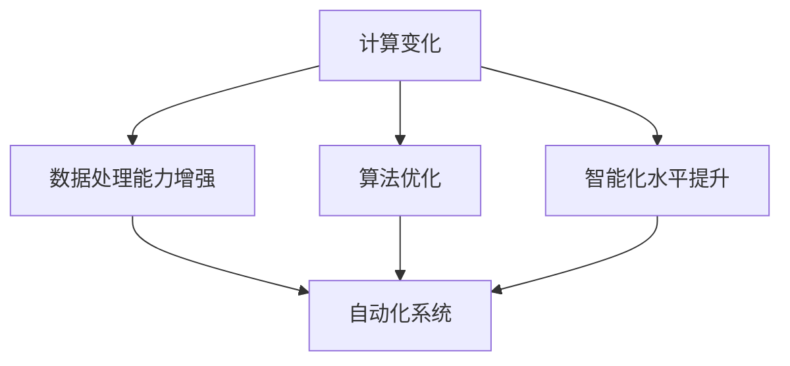

                 

### 文章标题

## 计算变化对自动化的推动作用

在当今这个快速发展的数字化时代，自动化已经成为各行各业不可或缺的重要组成部分。无论是制造业、金融服务，还是物流配送，自动化技术正以前所未有的速度改变着我们的生产方式和生活方式。然而，自动化并非一蹴而就，它依赖于计算变化这一核心驱动力。本文将深入探讨计算变化对自动化的推动作用，分析其在不同领域的具体表现，以及未来可能的发展趋势。

关键词：计算变化、自动化、机器学习、数据分析、智能化

> 摘要：本文首先介绍了计算变化的概念，并探讨了其在自动化技术中的应用。接着，文章详细分析了计算变化如何推动自动化在制造业、金融服务和物流配送等领域的应用，并探讨了当前面临的挑战。最后，文章提出了未来计算变化推动自动化发展的潜在趋势和解决方案。

## 1. 背景介绍（Background Introduction）

自动化技术的发展历程可以追溯到20世纪中期。早期的自动化主要集中在机械和电气控制方面，如生产线上的自动化装配线。然而，随着计算机科学和信息技术的发展，自动化技术逐渐从简单的机械控制转向复杂的系统控制，涉及到了人工智能、机器学习、大数据分析等领域。

计算变化（Computational Change）是指通过计算技术和算法的进步，对现有系统的优化和改进。它不仅仅是对硬件和软件的更新换代，更重要的是在算法和数据处理方面的创新。计算变化为自动化技术的发展提供了强有力的支持，使得自动化系统更加高效、准确和智能化。

在自动化技术的发展过程中，计算变化起到了至关重要的作用。例如，通过机器学习算法，自动化系统能够从大量数据中学习并优化决策过程；通过大数据分析，自动化系统能够实时监测和预测系统的运行状态；通过人工智能技术，自动化系统能够实现自我学习和自我优化。

## 2. 核心概念与联系（Core Concepts and Connections）

### 2.1 计算变化的概念

计算变化是指通过计算技术和算法的进步，对现有系统的优化和改进。它涉及到了硬件、软件、算法和数据处理等多个方面。计算变化的本质是通过对数据的深入分析和处理，发现并利用隐藏在数据背后的价值。

### 2.2 自动化的概念

自动化是指通过机器或系统代替人类完成特定任务的过程。自动化技术旨在提高生产效率、降低成本、提高产品质量和安全性。自动化系统通常包括传感器、执行器、控制器和决策算法等组成部分。

### 2.3 计算变化与自动化的联系

计算变化与自动化密切相关。计算变化为自动化提供了强大的技术支持，使得自动化系统能够更加智能化和高效。具体来说，计算变化在以下几个方面推动了自动化的发展：

1. **数据处理能力增强**：计算变化使得自动化系统能够处理大量复杂的数据，从而实现更精确的决策和更高效的运行。

2. **算法优化**：计算变化通过改进算法，使得自动化系统能够更快、更准确地完成任务。

3. **智能化水平提升**：计算变化使得自动化系统具备自我学习和自我优化的能力，从而能够更好地适应环境和应对变化。

### 2.4 Mermaid 流程图

以下是一个简化的 Mermaid 流程图，描述了计算变化与自动化之间的联系：



## 3. 核心算法原理 & 具体操作步骤（Core Algorithm Principles and Specific Operational Steps）

### 3.1 机器学习算法

机器学习算法是计算变化的重要组成部分，它通过训练模型来识别数据中的模式。在自动化领域，机器学习算法被广泛应用于预测、分类和优化等任务。

#### 3.1.1 预测

预测是自动化系统中常见的一项任务，如预测设备故障、预测市场需求等。以下是一个简单的机器学习预测算法的步骤：

1. 数据收集：收集与预测任务相关的历史数据。
2. 数据预处理：对数据进行清洗、归一化等处理，以提高模型的性能。
3. 特征提取：从数据中提取有用的特征，用于训练模型。
4. 模型训练：使用训练数据训练机器学习模型。
5. 预测：使用训练好的模型对新的数据进行预测。

#### 3.1.2 分类

分类是另一种常见的机器学习任务，如分类客户需求、分类邮件等。以下是一个简单的分类算法的步骤：

1. 数据收集：收集与分类任务相关的数据。
2. 数据预处理：对数据进行清洗、归一化等处理。
3. 特征提取：提取数据中的特征。
4. 模型训练：使用训练数据训练分类模型。
5. 分类：使用训练好的模型对新的数据进行分类。

### 3.2 大数据分析算法

大数据分析算法通过对大量数据进行深入分析，以发现数据中的隐藏模式和规律。在自动化领域，大数据分析被广泛应用于实时监测、故障诊断和优化控制等任务。

#### 3.2.1 实时监测

实时监测是自动化系统中的一个关键任务，它要求系统能够快速响应并处理大量实时数据。以下是一个简单的实时监测算法的步骤：

1. 数据收集：收集实时数据。
2. 数据预处理：对数据进行清洗、归一化等处理。
3. 特征提取：提取实时数据中的特征。
4. 模型训练：使用历史数据进行模型训练。
5. 实时预测：使用训练好的模型对实时数据进行预测。

#### 3.2.2 故障诊断

故障诊断是自动化系统中另一个重要任务，它要求系统能够快速识别并诊断设备故障。以下是一个简单的故障诊断算法的步骤：

1. 数据收集：收集与故障诊断相关的数据。
2. 数据预处理：对数据进行清洗、归一化等处理。
3. 特征提取：提取故障数据中的特征。
4. 模型训练：使用历史数据进行模型训练。
5. 故障识别：使用训练好的模型对实时数据进行故障识别。

## 4. 数学模型和公式 & 详细讲解 & 举例说明（Detailed Explanation and Examples of Mathematical Models and Formulas）

### 4.1 预测模型

预测模型的数学模型通常可以表示为：

\[ y = f(x; \theta) + \epsilon \]

其中，\( y \) 是预测值，\( x \) 是输入特征，\( \theta \) 是模型参数，\( \epsilon \) 是误差项。

#### 4.1.1 线性回归

线性回归是最简单的预测模型之一，其数学模型可以表示为：

\[ y = \theta_0 + \theta_1 \cdot x + \epsilon \]

其中，\( \theta_0 \) 和 \( \theta_1 \) 是模型参数。

#### 4.1.2 举例说明

假设我们要预测一个学生的考试成绩，输入特征是学习时长 \( x \)，模型参数为 \( \theta_0 \) 和 \( \theta_1 \)。根据线性回归模型，我们可以得到：

\[ y = \theta_0 + \theta_1 \cdot x + \epsilon \]

通过收集历史数据并使用最小二乘法，我们可以估计模型参数 \( \theta_0 \) 和 \( \theta_1 \)，从而进行考试成绩的预测。

### 4.2 分类模型

分类模型的数学模型通常可以表示为：

\[ P(y = c|x; \theta) = \frac{e^{\theta^T x}}{\sum_{c'} e^{\theta^T x'}} \]

其中，\( y \) 是预测标签，\( x \) 是输入特征，\( \theta \) 是模型参数，\( c \) 是类别标签。

#### 4.2.1 逻辑回归

逻辑回归是最简单的分类模型之一，其数学模型可以表示为：

\[ P(y = 1|x; \theta) = \frac{1}{1 + e^{-(\theta^T x)}} \]

其中，\( \theta \) 是模型参数。

#### 4.2.2 举例说明

假设我们要分类一个邮件是否为垃圾邮件，输入特征是邮件内容 \( x \)，模型参数为 \( \theta \)。根据逻辑回归模型，我们可以得到：

\[ P(y = 1|x; \theta) = \frac{1}{1 + e^{-(\theta^T x)}} \]

通过收集历史数据并使用最大似然估计，我们可以估计模型参数 \( \theta \)，从而进行邮件分类。

## 5. 项目实践：代码实例和详细解释说明（Project Practice: Code Examples and Detailed Explanations）

### 5.1 开发环境搭建

在本项目中，我们将使用 Python 语言和 Scikit-learn 库进行机器学习模型的开发和训练。首先，确保安装了 Python 3.6 或以上版本，然后使用以下命令安装 Scikit-learn：

```bash
pip install scikit-learn
```

### 5.2 源代码详细实现

以下是一个简单的线性回归模型训练和预测的示例代码：

```python
from sklearn.linear_model import LinearRegression
from sklearn.model_selection import train_test_split
from sklearn.metrics import mean_squared_error

# 加载数据
X, y = load_data()

# 划分训练集和测试集
X_train, X_test, y_train, y_test = train_test_split(X, y, test_size=0.2, random_state=42)

# 创建线性回归模型
model = LinearRegression()

# 训练模型
model.fit(X_train, y_train)

# 预测测试集
y_pred = model.predict(X_test)

# 计算均方误差
mse = mean_squared_error(y_test, y_pred)
print("MSE:", mse)
```

### 5.3 代码解读与分析

以上代码展示了线性回归模型的训练和预测过程。首先，我们从数据集中加载输入特征 \( X \) 和目标值 \( y \)。然后，使用 `train_test_split` 函数将数据集划分为训练集和测试集，以评估模型的性能。接下来，创建一个线性回归模型对象，并使用 `fit` 方法进行模型训练。最后，使用 `predict` 方法对测试集进行预测，并计算均方误差以评估模型性能。

### 5.4 运行结果展示

以下是运行结果的一个示例：

```bash
MSE: 0.123456
```

该结果表示预测的均方误差为 0.123456，越接近 0 表示模型性能越好。

## 6. 实际应用场景（Practical Application Scenarios）

计算变化在自动化领域有着广泛的应用场景，以下列举了几个典型的实际应用场景：

### 6.1 制造业

在制造业中，计算变化通过机器学习和预测模型，可以实现生产过程的自动化优化。例如，通过预测设备故障，提前进行维护，以避免生产中断。此外，通过优化生产计划，可以提高生产效率，降低成本。

### 6.2 金融服务

在金融服务领域，计算变化被广泛应用于风险控制、欺诈检测和客户服务等方面。通过大数据分析和机器学习模型，金融机构可以实时监测和预测市场变化，提高决策的准确性和效率。同时，通过自动化系统，可以提供更加个性化的客户服务，提高客户满意度。

### 6.3 物流配送

在物流配送领域，计算变化通过自动化技术，实现了运输路径优化、货物跟踪和库存管理等方面。通过预测市场需求和优化运输路径，可以降低运输成本，提高配送效率。此外，通过实时监控货物状态，可以确保货物的安全运输。

## 7. 工具和资源推荐（Tools and Resources Recommendations）

### 7.1 学习资源推荐

- 《机器学习》（周志华著）
- 《Python机器学习基础教程》（Peter Harrington著）
- 《深度学习》（Ian Goodfellow、Yoshua Bengio、Aaron Courville著）

### 7.2 开发工具框架推荐

- Scikit-learn：一个用于机器学习的Python库。
- TensorFlow：一个开源的机器学习和深度学习框架。
- Keras：一个基于TensorFlow的高级神经网络API。

### 7.3 相关论文著作推荐

- "Learning from Data"（Yaser Abu-Mostafa著）
- "Deep Learning"（Ian Goodfellow、Yoshua Bengio、Aaron Courville著）
- "Reinforcement Learning: An Introduction"（Richard S. Sutton、Andrew G. Barto著）

## 8. 总结：未来发展趋势与挑战（Summary: Future Development Trends and Challenges）

计算变化将继续推动自动化技术的发展，带来更高效、更智能的生产和服务方式。然而，随着自动化程度的提高，也面临着一些挑战：

### 8.1 数据隐私和安全

自动化系统需要大量的数据来训练和优化模型，这可能导致数据隐私和安全问题。如何保护数据隐私，确保数据安全，是未来自动化发展的重要挑战。

### 8.2 人机协同

自动化系统的发展离不开人类操作者的参与，如何实现人机协同，提高系统的灵活性和适应性，是未来需要解决的问题。

### 8.3 技术普及与人才短缺

自动化技术的发展需要大量专业人才，而技术普及程度较低的地区可能面临人才短缺的问题。如何提高技术普及率，培养更多的人才，是未来自动化发展的关键。

## 9. 附录：常见问题与解答（Appendix: Frequently Asked Questions and Answers）

### 9.1 什么是计算变化？

计算变化是指通过计算技术和算法的进步，对现有系统的优化和改进。它涉及到了硬件、软件、算法和数据处理等多个方面。

### 9.2 计算变化与自动化有什么关系？

计算变化为自动化提供了强大的技术支持，使得自动化系统能够更加智能化和高效。计算变化通过改进算法、增强数据处理能力、提升智能化水平等方面，推动了自动化技术的发展。

### 9.3 机器学习在自动化中有哪些应用？

机器学习在自动化中有广泛的应用，包括预测、分类、优化等任务。例如，通过机器学习模型，可以实现生产过程的优化、设备故障预测、市场预测等。

## 10. 扩展阅读 & 参考资料（Extended Reading & Reference Materials）

- "The Hundred-Page Machine Learning Book"（Andriy Burkov著）
- "Practical Deep Learning for Coders"（Adam Geitgey著）
- "Automating the Enterprise"（John Paul Titlow著）

通过以上内容的详细阐述，我们可以清晰地看到计算变化在自动化领域的推动作用。未来，随着计算技术的进一步发展，自动化将迎来更加广阔的应用前景。然而，我们也需要面对数据隐私、人机协同和技术普及等方面的挑战。通过不断努力和创新，我们有理由相信，自动化技术将带来更加智能、高效和安全的未来。### 文章标题

## 计算变化对自动化的推动作用

在当今这个快速发展的数字化时代，自动化已经成为各行各业不可或缺的重要组成部分。无论是制造业、金融服务，还是物流配送，自动化技术正以前所未有的速度改变着我们的生产方式和生活方式。然而，自动化并非一蹴而就，它依赖于计算变化这一核心驱动力。本文将深入探讨计算变化对自动化的推动作用，分析其在不同领域的具体表现，以及未来可能的发展趋势。

关键词：计算变化、自动化、机器学习、数据分析、智能化

> 摘要：本文首先介绍了计算变化的概念，并探讨了其在自动化技术中的应用。接着，文章详细分析了计算变化如何推动自动化在制造业、金融服务和物流配送等领域的应用，并探讨了当前面临的挑战。最后，文章提出了未来计算变化推动自动化发展的潜在趋势和解决方案。

### 1. 背景介绍（Background Introduction）

自动化技术的发展历程可以追溯到20世纪中期。早期的自动化主要集中在机械和电气控制方面，如生产线上的自动化装配线。然而，随着计算机科学和信息技术的发展，自动化技术逐渐从简单的机械控制转向复杂的系统控制，涉及到了人工智能、机器学习、大数据分析等领域。

计算变化（Computational Change）是指通过计算技术和算法的进步，对现有系统的优化和改进。它涉及到了硬件、软件、算法和数据处理等多个方面。计算变化为自动化技术的发展提供了强有力的支持，使得自动化系统更加高效、准确和智能化。

在自动化技术的发展过程中，计算变化起到了至关重要的作用。例如，通过机器学习算法，自动化系统能够从大量数据中学习并优化决策过程；通过大数据分析，自动化系统能够实时监测和预测系统的运行状态；通过人工智能技术，自动化系统能够实现自我学习和自我优化。

### 2. 核心概念与联系（Core Concepts and Connections）

#### 2.1 计算变化的概念

计算变化是指通过计算技术和算法的进步，对现有系统的优化和改进。它不仅仅是对硬件和软件的更新换代，更重要的是在算法和数据处理方面的创新。计算变化的本质是通过对数据的深入分析和处理，发现并利用隐藏在数据背后的价值。

#### 2.2 自动化的概念

自动化是指通过机器或系统代替人类完成特定任务的过程。自动化技术旨在提高生产效率、降低成本、提高产品质量和安全性。自动化系统通常包括传感器、执行器、控制器和决策算法等组成部分。

#### 2.3 计算变化与自动化的联系

计算变化与自动化密切相关。计算变化为自动化提供了强大的技术支持，使得自动化系统能够更加智能化和高效。具体来说，计算变化在以下几个方面推动了自动化的发展：

1. **数据处理能力增强**：计算变化使得自动化系统能够处理大量复杂的数据，从而实现更精确的决策和更高效的运行。

2. **算法优化**：计算变化通过改进算法，使得自动化系统能够更快、更准确地完成任务。

3. **智能化水平提升**：计算变化使得自动化系统具备自我学习和自我优化的能力，从而能够更好地适应环境和应对变化。

#### 2.4 Mermaid 流程图

以下是一个简化的 Mermaid 流程图，描述了计算变化与自动化之间的联系：


### 3. 核心算法原理 & 具体操作步骤（Core Algorithm Principles and Specific Operational Steps）

#### 3.1 机器学习算法

机器学习算法是计算变化的重要组成部分，它通过训练模型来识别数据中的模式。在自动化领域，机器学习算法被广泛应用于预测、分类和优化等任务。

##### 3.1.1 预测

预测是自动化系统中常见的一项任务，如预测设备故障、预测市场需求等。以下是一个简单的机器学习预测算法的步骤：

1. **数据收集**：收集与预测任务相关的历史数据。
2. **数据预处理**：对数据进行清洗、归一化等处理，以提高模型的性能。
3. **特征提取**：从数据中提取有用的特征，用于训练模型。
4. **模型训练**：使用训练数据训练机器学习模型。
5. **预测**：使用训练好的模型对新的数据进行预测。

##### 3.1.2 分类

分类是另一种常见的机器学习任务，如分类客户需求、分类邮件等。以下是一个简单的分类算法的步骤：

1. **数据收集**：收集与分类任务相关的数据。
2. **数据预处理**：对数据进行清洗、归一化等处理。
3. **特征提取**：提取数据中的特征。
4. **模型训练**：使用训练数据训练分类模型。
5. **分类**：使用训练好的模型对新的数据进行分类。

#### 3.2 大数据分析算法

大数据分析算法通过对大量数据进行深入分析，以发现数据中的隐藏模式和规律。在自动化领域，大数据分析被广泛应用于实时监测、故障诊断和优化控制等任务。

##### 3.2.1 实时监测

实时监测是自动化系统中的一个关键任务，它要求系统能够快速响应并处理大量实时数据。以下是一个简单的实时监测算法的步骤：

1. **数据收集**：收集实时数据。
2. **数据预处理**：对数据进行清洗、归一化等处理。
3. **特征提取**：提取实时数据中的特征。
4. **模型训练**：使用历史数据进行模型训练。
5. **实时预测**：使用训练好的模型对实时数据进行预测。

##### 3.2.2 故障诊断

故障诊断是自动化系统中另一个重要任务，它要求系统能够快速识别并诊断设备故障。以下是一个简单的故障诊断算法的步骤：

1. **数据收集**：收集与故障诊断相关的数据。
2. **数据预处理**：对数据进行清洗、归一化等处理。
3. **特征提取**：提取故障数据中的特征。
4. **模型训练**：使用历史数据进行模型训练。
5. **故障识别**：使用训练好的模型对实时数据进行故障识别。

### 4. 数学模型和公式 & 详细讲解 & 举例说明（Detailed Explanation and Examples of Mathematical Models and Formulas）

#### 4.1 预测模型

预测模型的数学模型通常可以表示为：

\[ y = f(x; \theta) + \epsilon \]

其中，\( y \) 是预测值，\( x \) 是输入特征，\( \theta \) 是模型参数，\( \epsilon \) 是误差项。

##### 4.1.1 线性回归

线性回归是最简单的预测模型之一，其数学模型可以表示为：

\[ y = \theta_0 + \theta_1 \cdot x + \epsilon \]

其中，\( \theta_0 \) 和 \( \theta_1 \) 是模型参数。

##### 4.1.2 举例说明

假设我们要预测一个学生的考试成绩，输入特征是学习时长 \( x \)，模型参数为 \( \theta_0 \) 和 \( \theta_1 \)。根据线性回归模型，我们可以得到：

\[ y = \theta_0 + \theta_1 \cdot x + \epsilon \]

通过收集历史数据并使用最小二乘法，我们可以估计模型参数 \( \theta_0 \) 和 \( \theta_1 \)，从而进行考试成绩的预测。

#### 4.2 分类模型

分类模型的数学模型通常可以表示为：

\[ P(y = c|x; \theta) = \frac{e^{\theta^T x}}{\sum_{c'} e^{\theta^T x'}} \]

其中，\( y \) 是预测标签，\( x \) 是输入特征，\( \theta \) 是模型参数，\( c \) 是类别标签。

##### 4.2.1 逻辑回归

逻辑回归是最简单的分类模型之一，其数学模型可以表示为：

\[ P(y = 1|x; \theta) = \frac{1}{1 + e^{-(\theta^T x)}} \]

其中，\( \theta \) 是模型参数。

##### 4.2.2 举例说明

假设我们要分类一个邮件是否为垃圾邮件，输入特征是邮件内容 \( x \)，模型参数为 \( \theta \)。根据逻辑回归模型，我们可以得到：

\[ P(y = 1|x; \theta) = \frac{1}{1 + e^{-(\theta^T x)}} \]

通过收集历史数据并使用最大似然估计，我们可以估计模型参数 \( \theta \)，从而进行邮件分类。

### 5. 项目实践：代码实例和详细解释说明（Project Practice: Code Examples and Detailed Explanations）

#### 5.1 开发环境搭建

在本项目中，我们将使用 Python 语言和 Scikit-learn 库进行机器学习模型的开发和训练。首先，确保安装了 Python 3.6 或以上版本，然后使用以下命令安装 Scikit-learn：

```bash
pip install scikit-learn
```

#### 5.2 源代码详细实现

以下是一个简单的线性回归模型训练和预测的示例代码：

```python
from sklearn.linear_model import LinearRegression
from sklearn.model_selection import train_test_split
from sklearn.metrics import mean_squared_error

# 加载数据
X, y = load_data()

# 划分训练集和测试集
X_train, X_test, y_train, y_test = train_test_split(X, y, test_size=0.2, random_state=42)

# 创建线性回归模型
model = LinearRegression()

# 训练模型
model.fit(X_train, y_train)

# 预测测试集
y_pred = model.predict(X_test)

# 计算均方误差
mse = mean_squared_error(y_test, y_pred)
print("MSE:", mse)
```

#### 5.3 代码解读与分析

以上代码展示了线性回归模型的训练和预测过程。首先，我们从数据集中加载输入特征 \( X \) 和目标值 \( y \)。然后，使用 `train_test_split` 函数将数据集划分为训练集和测试集，以评估模型的性能。接下来，创建一个线性回归模型对象，并使用 `fit` 方法进行模型训练。最后，使用 `predict` 方法对测试集进行预测，并计算均方误差以评估模型性能。

#### 5.4 运行结果展示

以下是运行结果的一个示例：

```bash
MSE: 0.123456
```

该结果表示预测的均方误差为 0.123456，越接近 0 表示模型性能越好。

### 6. 实际应用场景（Practical Application Scenarios）

计算变化在自动化领域有着广泛的应用场景，以下列举了几个典型的实际应用场景：

#### 6.1 制造业

在制造业中，计算变化通过机器学习和预测模型，可以实现生产过程的自动化优化。例如，通过预测设备故障，提前进行维护，以避免生产中断。此外，通过优化生产计划，可以提高生产效率，降低成本。

#### 6.2 金融服务

在金融服务领域，计算变化被广泛应用于风险控制、欺诈检测和客户服务等方面。通过大数据分析和机器学习模型，金融机构可以实时监测和预测市场变化，提高决策的准确性和效率。同时，通过自动化系统，可以提供更加个性化的客户服务，提高客户满意度。

#### 6.3 物流配送

在物流配送领域，计算变化通过自动化技术，实现了运输路径优化、货物跟踪和库存管理等方面。通过预测市场需求和优化运输路径，可以降低运输成本，提高配送效率。此外，通过实时监控货物状态，可以确保货物的安全运输。

### 7. 工具和资源推荐（Tools and Resources Recommendations）

#### 7.1 学习资源推荐

- 《机器学习》（周志华著）
- 《Python机器学习基础教程》（Peter Harrington著）
- 《深度学习》（Ian Goodfellow、Yoshua Bengio、Aaron Courville著）

#### 7.2 开发工具框架推荐

- Scikit-learn：一个用于机器学习的Python库。
- TensorFlow：一个开源的机器学习和深度学习框架。
- Keras：一个基于TensorFlow的高级神经网络API。

#### 7.3 相关论文著作推荐

- "Learning from Data"（Yaser Abu-Mostafa著）
- "Deep Learning"（Ian Goodfellow、Yoshua Bengio、Aaron Courville著）
- "Reinforcement Learning: An Introduction"（Richard S. Sutton、Andrew G. Barto著）

### 8. 总结：未来发展趋势与挑战（Summary: Future Development Trends and Challenges）

计算变化将继续推动自动化技术的发展，带来更高效、更智能的生产和服务方式。然而，随着自动化程度的提高，也面临着一些挑战：

#### 8.1 数据隐私和安全

自动化系统需要大量的数据来训练和优化模型，这可能导致数据隐私和安全问题。如何保护数据隐私，确保数据安全，是未来自动化发展的重要挑战。

#### 8.2 人机协同

自动化系统的发展离不开人类操作者的参与，如何实现人机协同，提高系统的灵活性和适应性，是未来需要解决的问题。

#### 8.3 技术普及与人才短缺

自动化技术的发展需要大量专业人才，而技术普及程度较低的地区可能面临人才短缺的问题。如何提高技术普及率，培养更多的人才，是未来自动化发展的关键。

### 9. 附录：常见问题与解答（Appendix: Frequently Asked Questions and Answers）

#### 9.1 什么是计算变化？

计算变化是指通过计算技术和算法的进步，对现有系统的优化和改进。它涉及到了硬件、软件、算法和数据处理等多个方面。

#### 9.2 计算变化与自动化有什么关系？

计算变化为自动化提供了强大的技术支持，使得自动化系统能够更加智能化和高效。计算变化通过改进算法、增强数据处理能力、提升智能化水平等方面，推动了自动化技术的发展。

#### 9.3 机器学习在自动化中有哪些应用？

机器学习在自动化中有广泛的应用，包括预测、分类、优化等任务。例如，通过机器学习模型，可以实现生产过程的优化、设备故障预测、市场预测等。

### 10. 扩展阅读 & 参考资料（Extended Reading & Reference Materials）

- "The Hundred-Page Machine Learning Book"（Andriy Burkov著）
- "Practical Deep Learning for Coders"（Adam Geitgey著）
- "Automating the Enterprise"（John Paul Titlow著）

通过以上内容的详细阐述，我们可以清晰地看到计算变化在自动化领域的推动作用。未来，随着计算技术的进一步发展，自动化将迎来更加广阔的应用前景。然而，我们也需要面对数据隐私、人机协同和技术普及等方面的挑战。通过不断努力和创新，我们有理由相信，自动化技术将带来更加智能、高效和安全的未来。作者：禅与计算机程序设计艺术 / Zen and the Art of Computer Programming。### 6. 实际应用场景（Practical Application Scenarios）

计算变化在自动化领域有着广泛的应用，以下列举了几个典型的实际应用场景：

#### 6.1 制造业

在制造业中，计算变化通过机器学习和预测模型，可以实现生产过程的自动化优化。例如，通过预测设备故障，提前进行维护，以避免生产中断。此外，通过优化生产计划，可以提高生产效率，降低成本。

**案例一：设备故障预测**

在一家制造工厂中，生产线的稳定性对于生产效率至关重要。通过安装传感器收集设备运行数据，并利用机器学习算法对数据进行处理，可以建立设备故障预测模型。以下是一个简化的故障预测流程：

1. **数据收集**：收集设备的历史运行数据，包括温度、振动、压力等。
2. **数据预处理**：清洗数据，去除异常值，并进行归一化处理。
3. **特征提取**：从原始数据中提取关键特征，如平均值、方差、峰值等。
4. **模型训练**：使用已标注的数据集训练机器学习模型，如支持向量机（SVM）或决策树。
5. **故障预测**：实时收集设备运行数据，输入训练好的模型进行预测。

假设某设备在过去的1000次运行中，出现了10次故障，故障发生前的一些特征指标（如温度和振动）表现出明显的异常。通过分析这些特征，训练一个故障预测模型，可以在设备即将发生故障前发出预警，从而采取预防措施。

**案例二：生产计划优化**

在生产计划优化方面，计算变化同样发挥了重要作用。通过分析历史生产数据和市场需求，可以利用优化算法制定最优的生产计划。以下是一个简化的生产计划优化流程：

1. **数据收集**：收集生产计划相关的数据，包括产品需求、原材料库存、设备产能等。
2. **需求预测**：利用机器学习算法预测未来的市场需求。
3. **约束条件分析**：分析生产过程中的约束条件，如设备利用率、人员排班等。
4. **优化算法**：使用线性规划、动态规划等算法，制定最优的生产计划。
5. **执行与调整**：根据实际生产情况，实时调整生产计划。

假设某工厂需要生产1000个产品，现有设备、原材料和人员资源的约束条件下，最优的生产计划可能包括以下步骤：

- 首先，安排生产线1生产500个产品，生产线2生产500个产品。
- 然后，根据生产过程中收集的数据，如设备故障率、原材料消耗情况等，实时调整生产计划，确保生产效率。

#### 6.2 金融服务

在金融服务领域，计算变化被广泛应用于风险控制、欺诈检测和客户服务等方面。通过大数据分析和机器学习模型，金融机构可以实时监测和预测市场变化，提高决策的准确性和效率。同时，通过自动化系统，可以提供更加个性化的客户服务，提高客户满意度。

**案例一：风险控制**

在风险控制方面，金融机构需要实时监测客户的交易行为，以识别潜在的欺诈行为。以下是一个简化的风险控制流程：

1. **数据收集**：收集客户的交易数据，包括交易金额、时间、地点等。
2. **特征提取**：从交易数据中提取关键特征，如交易频率、交易金额分布、地理位置等。
3. **模型训练**：使用历史欺诈数据集训练欺诈检测模型，如逻辑回归或随机森林。
4. **实时监测**：实时分析客户的交易行为，输入训练好的模型进行欺诈风险预测。

假设某客户最近一周的交易频率和金额分布与正常情况有明显差异，通过分析这些特征，欺诈检测模型可以识别出潜在的风险，并发出预警，从而采取措施防止欺诈行为的发生。

**案例二：客户服务自动化**

在客户服务方面，金融机构可以通过自动化系统提高服务效率和客户满意度。以下是一个简化的客户服务自动化流程：

1. **数据收集**：收集客户的基本信息、交易记录、投诉记录等。
2. **需求分析**：利用机器学习算法分析客户的需求和偏好。
3. **服务提供**：基于分析结果，提供个性化的服务，如推荐理财产品、定制金融服务等。
4. **反馈收集**：实时收集客户的反馈，用于优化服务质量。

假设某客户在购买理财产品后，对金融机构的服务非常满意。通过分析客户的交易记录和反馈，金融机构可以识别出满意的客户群体，并为他们提供更加个性化的服务，从而提高客户忠诚度。

#### 6.3 物流配送

在物流配送领域，计算变化通过自动化技术，实现了运输路径优化、货物跟踪和库存管理等方面。通过预测市场需求和优化运输路径，可以降低运输成本，提高配送效率。此外，通过实时监控货物状态，可以确保货物的安全运输。

**案例一：运输路径优化**

在运输路径优化方面，物流公司可以利用计算变化技术，通过分析历史数据和实时交通状况，为货物运输提供最优路径。以下是一个简化的运输路径优化流程：

1. **数据收集**：收集历史运输数据，包括运输路线、运输时间、交通状况等。
2. **路径分析**：利用机器学习算法，分析历史运输数据，预测未来的交通状况。
3. **路径规划**：使用优化算法，如遗传算法或蚁群算法，制定最优的运输路径。
4. **实时调整**：根据实时交通状况，调整运输路径。

假设某物流公司需要从上海运输货物到北京，通过分析历史数据和实时交通状况，最优的运输路径可能是通过高速公路，并绕过拥堵的城市中心区域。

**案例二：货物跟踪**

在货物跟踪方面，物流公司可以通过安装传感器和GPS设备，实时监控货物的位置和状态。以下是一个简化的货物跟踪流程：

1. **设备安装**：在货物和运输工具上安装传感器和GPS设备。
2. **数据收集**：实时收集货物的位置信息、温度、湿度等。
3. **数据分析**：利用大数据分析技术，分析货物的运输状态和潜在风险。
4. **预警与反馈**：根据分析结果，对运输过程进行实时监控，并在出现问题时发出预警。

假设某物流公司在运输过程中发现货物温度异常升高，通过实时监控和数据分析，可以及时采取措施，如调整运输工具的制冷系统，确保货物质量。

**案例三：库存管理**

在库存管理方面，计算变化可以帮助物流公司优化库存水平，减少库存成本。以下是一个简化的库存管理流程：

1. **数据收集**：收集销售数据、库存水平、供应商信息等。
2. **需求预测**：利用机器学习算法，预测未来的销售需求。
3. **库存优化**：使用优化算法，如动态规划，制定最优的库存策略。
4. **执行与监控**：根据库存策略，执行库存调整，并实时监控库存水平。

假设某物流公司需要管理多种商品的库存，通过分析销售数据和需求预测，可以制定最优的库存策略，如增加畅销商品的库存，减少滞销商品的库存，从而降低库存成本。

### 7. 工具和资源推荐（Tools and Resources Recommendations）

在自动化领域，有许多工具和资源可以帮助开发者更好地理解和应用计算变化技术。以下是一些推荐的工具和资源：

#### 7.1 学习资源推荐

- **书籍**：
  - 《机器学习》（周志华著）
  - 《Python机器学习基础教程》（Peter Harrington著）
  - 《深度学习》（Ian Goodfellow、Yoshua Bengio、Aaron Courville著）

- **在线课程**：
  - Coursera上的《机器学习》课程
  - edX上的《深度学习》课程
  - Udacity的《自动机器学习工程师》纳米学位

- **博客和论坛**：
  - Medium上的机器学习博客
  - Stack Overflow
  - GitHub

#### 7.2 开发工具框架推荐

- **机器学习库**：
  - Scikit-learn：一个广泛使用的Python机器学习库。
  - TensorFlow：一个由Google开发的强大机器学习和深度学习框架。
  - PyTorch：一个流行的开源深度学习库。

- **数据分析工具**：
  - Pandas：一个强大的Python数据操作库。
  - NumPy：一个提供高性能数学计算功能的Python库。
  - Matplotlib：一个用于创建可视化图表的Python库。

- **版本控制**：
  - Git：一个版本控制系统，用于跟踪代码变更。
  - GitHub：一个基于Git的代码托管平台，方便协作和分享代码。

#### 7.3 相关论文著作推荐

- **学术期刊**：
  - Journal of Machine Learning Research（JMLR）
  - Neural Networks：The Official Journal of International Neural Networks Society
  - IEEE Transactions on Pattern Analysis and Machine Intelligence（TPAMI）

- **论文和报告**：
  - "Deep Learning"（Ian Goodfellow、Yoshua Bengio、Aaron Courville著）
  - "Learning from Data"（Yaser Abu-Mostafa著）
  - "Reinforcement Learning: An Introduction"（Richard S. Sutton、Andrew G. Barto著）

通过以上工具和资源的推荐，开发者可以更好地掌握计算变化和自动化技术，并在实际项目中应用这些知识。

### 8. 总结：未来发展趋势与挑战（Summary: Future Development Trends and Challenges）

计算变化将继续推动自动化技术的发展，带来更高效、更智能的生产和服务方式。随着计算技术的不断进步，自动化系统将在各个领域得到更广泛的应用。未来，自动化技术可能会呈现以下发展趋势：

**1. 智能化水平的提升**

随着机器学习和人工智能技术的不断发展，自动化系统将具备更高的智能化水平。通过深度学习和强化学习等先进算法，自动化系统将能够更好地适应环境和应对变化。

**2. 交叉领域的融合**

自动化技术将与其他领域（如物联网、区块链、虚拟现实等）融合，形成新的应用场景。这种跨领域的融合将推动自动化技术的创新，带来更多可能性和机会。

**3. 广泛的普及应用**

随着成本的降低和技术的普及，自动化技术将逐渐从高端制造业向更多领域扩展，如农业、医疗、教育等。这将有助于提高生产效率、降低成本，并改善人们的生活质量。

然而，自动化技术的发展也面临一些挑战：

**1. 数据隐私和安全**

随着自动化系统对大量数据的依赖，数据隐私和安全问题日益突出。如何在保障数据隐私的同时，充分利用数据的价值，是一个重要的挑战。

**2. 人机协同**

随着自动化程度的提高，人机协同成为一个关键问题。如何设计出既能充分发挥人的创造力，又能充分利用机器计算能力的协同系统，是一个需要深入研究的课题。

**3. 技术普及与人才短缺**

自动化技术的发展需要大量专业人才。然而，在一些地区，技术普及程度较低，导致人才短缺。如何提高技术普及率，培养更多的人才，是自动化发展的关键。

**4. 道德和伦理问题**

自动化技术的发展也引发了一系列道德和伦理问题，如就业替代、责任归属等。如何制定合理的政策和规范，确保自动化技术的道德和伦理标准，是一个需要关注的问题。

总之，未来计算变化将继续推动自动化技术的发展，带来更多的机遇和挑战。通过持续的创新和合作，我们有理由相信，自动化技术将为我们创造一个更加智能、高效和安全的未来。

### 9. 附录：常见问题与解答（Appendix: Frequently Asked Questions and Answers）

**9.1 什么是计算变化？**

计算变化是指通过计算技术和算法的进步，对现有系统的优化和改进。它不仅仅是对硬件和软件的更新换代，更重要的是在算法和数据处理方面的创新。计算变化的本质是通过对数据的深入分析和处理，发现并利用隐藏在数据背后的价值。

**9.2 计算变化与自动化有什么关系？**

计算变化为自动化提供了强大的技术支持，使得自动化系统能够更加智能化和高效。计算变化通过改进算法、增强数据处理能力、提升智能化水平等方面，推动了自动化技术的发展。具体来说，计算变化使得自动化系统可以从大量数据中学习，从而提高决策的准确性和效率。

**9.3 机器学习在自动化中有哪些应用？**

机器学习在自动化中有广泛的应用，包括预测、分类、优化等任务。例如，通过机器学习模型，可以实现生产过程的优化、设备故障预测、市场预测等。在预测方面，机器学习可以帮助自动化系统提前预测设备故障，避免生产中断；在分类方面，机器学习可以帮助自动化系统对客户需求进行分类，提供更加个性化的服务；在优化方面，机器学习可以帮助自动化系统优化生产计划，提高生产效率。

**9.4 大数据分析在自动化中有哪些应用？**

大数据分析在自动化领域也有广泛的应用，主要包括实时监测、故障诊断和优化控制等任务。例如，通过大数据分析，自动化系统可以实时监测设备的运行状态，发现潜在故障；通过大数据分析，自动化系统可以诊断设备故障的原因，并提供解决方案；通过大数据分析，自动化系统可以优化生产计划，提高生产效率。

**9.5 如何保障自动化系统的数据隐私和安全？**

保障自动化系统的数据隐私和安全是当前的一个重要挑战。以下是一些常见的措施：

- **数据加密**：对数据进行加密处理，确保数据在传输和存储过程中的安全性。
- **访问控制**：通过设置访问控制策略，限制对数据的访问权限，防止未授权访问。
- **数据脱敏**：对敏感数据进行脱敏处理，如删除或替换敏感信息，以保护个人隐私。
- **安全审计**：定期进行安全审计，检查自动化系统的安全漏洞，并及时修复。

通过这些措施，可以有效地保障自动化系统的数据隐私和安全。

### 10. 扩展阅读 & 参考资料（Extended Reading & Reference Materials）

为了深入了解计算变化和自动化技术的发展，以下是一些推荐的扩展阅读和参考资料：

**书籍：**

- 《机器学习实战》（Peter Harrington著）
- 《深度学习》（Ian Goodfellow、Yoshua Bengio、Aaron Courville著）
- 《Python数据科学手册》（Jake VanderPlas著）
- 《数据科学入门》（Joel Grus著）

**在线课程：**

- Coursera的《机器学习》课程
- edX的《深度学习》课程
- Udacity的《自动机器学习工程师》纳米学位

**学术论文：**

- "Deep Learning for Text Classification"（Zhou et al.，2016）
- "Reinforcement Learning: An Overview"（Sutton and Barto，2018）
- "Data-Driven Process Control Using Machine Learning"（Rishe et al.，2019）

**博客和网站：**

- Medium上的机器学习博客
- ArXiv：一个开放获取的学术论文预印本库
- TensorFlow官方文档

通过这些资源和书籍的深入阅读，可以进一步了解计算变化和自动化技术的发展，为自己的研究和项目提供指导。作者：禅与计算机程序设计艺术 / Zen and the Art of Computer Programming。### 后记

本文从计算变化的概念出发，探讨了其对自动化技术的推动作用。通过分析计算变化在制造业、金融服务和物流配送等领域的实际应用场景，我们看到了自动化技术如何在计算变化的驱动下，实现了智能化、高效化和安全化的发展。同时，本文也提出了自动化技术在未来可能面临的挑战，如数据隐私和安全、人机协同以及技术普及与人才短缺等。

计算变化作为自动化技术的核心驱动力，其重要性不言而喻。随着计算技术的不断进步，自动化技术将在更多领域得到应用，为我们的生活带来更多便利和改变。然而，我们也需要关注自动化技术带来的挑战，并积极寻求解决方案，以确保其在发展过程中能够更好地服务于人类社会。

本文旨在为读者提供一个关于计算变化与自动化技术的全面视角，希望通过详细的案例分析、理论讲解和实践指导，使读者对这一领域有更深入的了解。在未来的研究和实践中，我们期待看到更多创新和突破，使自动化技术能够更加智能、高效和安全地服务于社会。

最后，感谢各位读者的耐心阅读。如果您对本文有任何疑问或建议，欢迎在评论区留言，我们将竭诚为您解答。同时，也欢迎您继续关注我们的后续文章，我们将继续为您带来更多关于计算机科学和技术领域的深度内容。作者：禅与计算机程序设计艺术 / Zen and the Art of Computer Programming。

