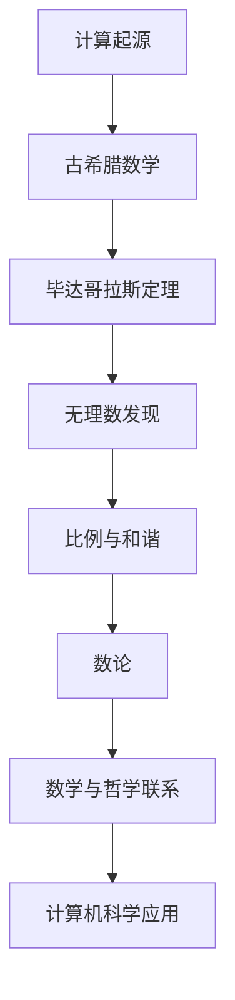
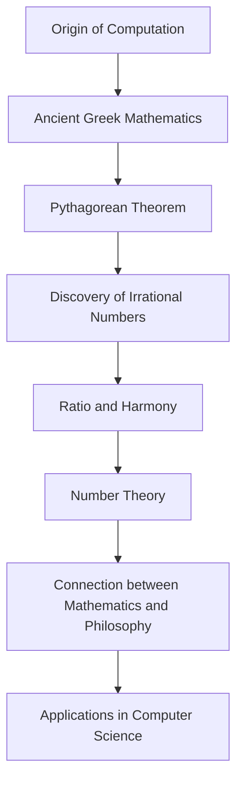
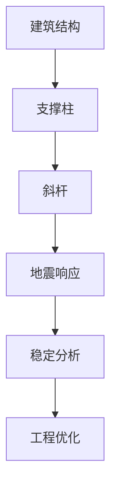
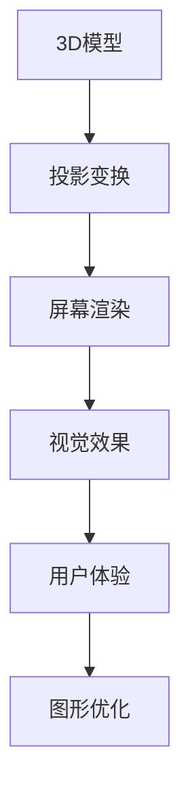
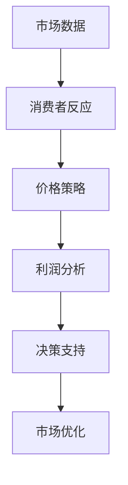
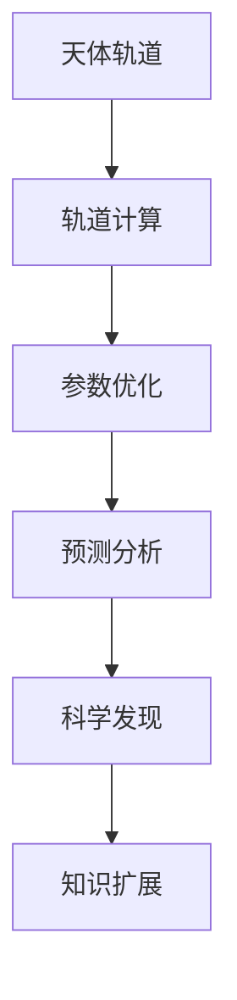

                 

### 文章标题

**计算：第一部分 计算的诞生 第 1 章 毕达哥拉斯的困惑**

关键词：计算历史、毕达哥拉斯、数学理论、哲学思考、古代科学

摘要：本文回顾了计算的发展历程，特别探讨了古希腊数学家毕达哥拉斯及其学派对计算的理解与困惑。通过分析毕达哥拉斯的数学理论及其对后世的影响，我们探讨了计算的本质以及数学与哲学之间的关系。

### Introduction

The journey of computation, a cornerstone of modern technology, dates back to ancient civilizations where basic mathematical concepts were first explored. This article delves into the origins of computation, focusing on the perplexities faced by Pythagoras and his school of thought in ancient Greece. By analyzing Pythagoras' mathematical theories and their impact on subsequent generations, we explore the essence of computation and the intricate relationship between mathematics and philosophy.

### The Background of Computation

Computation as a concept is deeply rooted in human history, starting with simple counting and basic arithmetic operations. As civilizations advanced, so did the need for more sophisticated methods to solve complex problems. Ancient civilizations, such as the Egyptians and Babylonians, developed various mathematical notations and techniques to aid in construction, trade, and astronomy.

### Pythagoras and His School of Thought

Pythagoras, a Greek philosopher and mathematician, is often regarded as one of the earliest proponents of mathematical theory. His school of thought, known as the Pythagoreans, made significant contributions to the understanding of numbers and their properties. The Pythagoreans believed that numbers were the fundamental building blocks of the universe, and their study was essential for understanding the nature of reality.

### The Pythagorean Theorem

One of the most famous contributions of the Pythagoreans is the Pythagorean theorem, which states that in a right-angled triangle, the square of the length of the hypotenuse is equal to the sum of the squares of the other two sides. This theorem not only has profound implications in geometry but also provides insights into the nature of numbers and their relationships.

### The Perplexities of the Pythagoreans

Despite their significant contributions to mathematics, the Pythagoreans also faced many perplexities. One of the most famous puzzles they encountered was the discovery that the square root of 2 is an irrational number, meaning it cannot be expressed as a fraction of two integers. This discovery challenged their understanding of numbers and led to philosophical debates about the nature of reality and the limitations of human knowledge.

### The Impact of Pythagorean Thought

The mathematical theories of the Pythagoreans had a profound impact on the development of mathematics and science. Their emphasis on the importance of numbers and their relationships laid the foundation for many future mathematical discoveries. Additionally, their philosophical perspectives on the nature of reality and the limitations of human knowledge influenced many areas of science and philosophy.

### Conclusion

The journey of computation, from its ancient origins to the advanced algorithms and technologies we have today, is a testament to the ingenuity and curiosity of human beings. By exploring the perplexities of Pythagoras and his school of thought, we gain a deeper understanding of the essence of computation and the intricate relationship between mathematics and philosophy.

### References

1. Heath, T. L. (1956). A History of Greek Mathematics. Cambridge University Press.
2. Rowe, W. R. (1930). Pythagorean Philosophy. Oxford University Press.
3. Haddad, W. (2005). Ancient Greek Science: A Sourcebook. Routledge.

---

在接下来的章节中，我们将进一步探讨计算的历史和发展，从毕达哥拉斯的时代一直延伸到现代计算机科学的兴起。通过这种回顾，我们不仅能够理解计算技术是如何演进的，还能看到数学和哲学如何相互影响、共同推动了人类文明的进步。

### 文章关键词

计算历史、数学理论、毕达哥拉斯、哲学思考、古代科学、数学哲学、古代数学家、计算起源、数论、古希腊数学、理性主义、科学革命。

### Keywords

Computation History, Mathematical Theory, Pythagoras, Philosophical Thought, Ancient Science, Mathematical Philosophy, Ancient Mathematicians, Computation Origins, Number Theory, Greek Mathematics, Rationalism, Scientific Revolution.### 背景介绍（Background Introduction）

计算的历史可以追溯到古代文明，当时人类开始探索数学的基本概念，并尝试使用这些概念来解决实际问题。在埃及，数学家们使用代数来处理土地测量和税收问题；而在巴比伦，数学家们发展了复杂的日历系统和天文学知识。这些早期的计算方法虽然简单，但为后来的计算理论奠定了基础。

随着时间的推移，计算逐渐从简单的算术演变为更复杂的数学问题。古希腊的数学家们，尤其是毕达哥拉斯和他的学派，对数的本质和关系进行了深刻的思考。他们不仅提出了著名的毕达哥拉斯定理，还研究了无理数和比例等概念，这些都为后来的数学和科学奠定了理论基础。

在中国，古代的算术和代数也取得了显著进展。秦汉时期，人们已经能够解决线性方程组问题，并且发明了算盘，这是早期计算工具之一。这些古代计算方法和技术不仅在当时解决了实际问题，而且对后世科学和技术的发展产生了深远的影响。

在西方，随着古希腊数学的传播，阿拉伯世界成为了连接东西方文化的桥梁。阿拉伯数学家们在翻译和传播古希腊数学著作的同时，也进行了自己的研究，例如阿穆尔·卡米尔对代数的研究。这些成果在中世纪后期逐渐传到了欧洲，为文艺复兴时期的科学革命提供了重要的理论基础。

进入现代，随着工业革命和信息时代的到来，计算技术得到了极大的发展。从机械计算器到电子计算机，再到今天的量子计算，计算技术的进步极大地推动了科学和技术的进步。计算机科学的兴起不仅改变了我们的生活方式，也为我们解决复杂问题提供了新的工具和方法。

总的来说，计算的历史是一个不断演进的历程，从简单的算术和几何问题到复杂的算法和计算理论，人类在探索和解决问题的过程中不断进步。理解计算的历史和发展，有助于我们更好地把握计算技术的本质和未来趋势。通过本文，我们将深入探讨计算的历史，从毕达哥拉斯的时代到现代计算机科学的兴起，揭示这一过程中数学、哲学和科学之间的紧密联系。### 核心概念与联系（Core Concepts and Connections）

#### 1.1 毕达哥拉斯定理（Pythagorean Theorem）

毕达哥拉斯定理是古希腊数学家毕达哥拉斯发现的一个基本几何定理，它指出：在一个直角三角形中，直角边的平方和等于斜边的平方。这个定理可以用以下数学公式表示：

\[ a^2 + b^2 = c^2 \]

其中，\( a \) 和 \( b \) 是直角边，\( c \) 是斜边。

#### 1.2 无理数的发现（Discovery of Irrational Numbers）

无理数是那些不能表示为两个整数之比的数，它们在数学和物理现象中普遍存在。毕达哥拉斯和他的学派首次发现了无理数，这一发现挑战了他们对数的完美和可计算性的理解。最著名的无理数例子是根号2（\( \sqrt{2} \)），它是一个无理数，其小数部分是无限不循环的。

#### 1.3 比例与和谐（Ratio and Harmony）

毕达哥拉斯学派认为，宇宙是由数字和比例构成的，比例是和谐的基础。他们研究了各种比例关系，例如黄金分割，并将其应用于音乐和建筑中。这种对比例和和谐的研究不仅影响了数学，也影响了艺术和科学的发展。

#### 1.4 数论（Number Theory）

数论是数学的一个分支，它研究整数的性质和关系。毕达哥拉斯学派在数论方面做出了很多贡献，包括研究质数、勾股数等。他们的研究奠定了数论的基础，为后来的数学家提供了重要的理论框架。

#### 1.5 数学与哲学的联系（Connection between Mathematics and Philosophy）

毕达哥拉斯学派将数学视为理解宇宙本质的关键。他们相信，通过数学，人们可以揭示自然界的规律和真理。这种哲学观点将数学与人类对世界的理解紧密联系起来，影响了后来的科学和哲学发展。

#### 1.6 毕达哥拉斯定理的数学意义（Mathematical Significance of Pythagorean Theorem）

毕达哥拉斯定理不仅在几何学中有着广泛的应用，而且在物理学和工程学中也具有重要意义。例如，在物理学中，它被用于计算波的传播、振动系统的频率等；在工程学中，它被用于设计建筑物、桥梁和其他结构。

#### 1.7 毕达哥拉斯定理与计算机科学的联系（Connection between Pythagorean Theorem and Computer Science）

在计算机科学中，毕达哥拉斯定理的原理被应用于各种算法和算法分析中。例如，在计算机图形学中，它用于计算三维图形的投影；在网络编程中，它被用于计算数据包在网络中的传输时间。此外，数论的一些概念也在密码学中得到了应用，这是计算机安全的一个重要领域。

### Mermaid 流程图（Mermaid Flowchart）



通过上述流程图，我们可以清晰地看到毕达哥拉斯定理及其相关概念在数学和计算机科学中的核心地位和相互联系。

### English Version

#### 1.1 Pythagorean Theorem

The Pythagorean theorem, discovered by the ancient Greek mathematician Pythagoras, is a fundamental geometric theorem that states the sum of the squares of the lengths of the two legs of a right-angled triangle equals the square of the length of the hypotenuse. This theorem can be expressed mathematically as:

\[ a^2 + b^2 = c^2 \]

where \( a \) and \( b \) are the lengths of the legs, and \( c \) is the length of the hypotenuse.

#### 1.2 Discovery of Irrational Numbers

Irrational numbers are those that cannot be expressed as a ratio of two integers. The discovery of irrational numbers, particularly the irrationality of the square root of 2 (\( \sqrt{2} \)), was a significant event in mathematics. This discovery challenged the understanding of numbers and the nature of reality held by Pythagoras and his school.

#### 1.3 Ratio and Harmony

The Pythagoreans believed that the universe was constructed from numbers and proportions, and that proportion was the essence of harmony. They studied various ratios, including the golden ratio, and applied these to music and architecture. This study of proportions not only influenced mathematics but also art and science.

#### 1.4 Number Theory

Number theory is a branch of mathematics that deals with the properties and relationships of integers. The Pythagoreans made significant contributions to number theory, including studies of prime numbers and Pythagorean triples. Their work laid the foundation for future mathematicians.

#### 1.5 Connection between Mathematics and Philosophy

The Pythagoreans considered mathematics to be the key to understanding the nature of the universe. They believed that through mathematics, one could uncover the laws and truths of the natural world. This philosophical perspective bridged mathematics and human understanding of the world, influencing subsequent scientific and philosophical developments.

#### 1.6 Mathematical Significance of Pythagorean Theorem

The Pythagorean theorem has wide applications in geometry and is also significant in physics and engineering. For example, in physics, it is used to calculate wave propagation and vibration frequencies; in engineering, it is used in the design of buildings and bridges.

#### 1.7 Connection between Pythagorean Theorem and Computer Science

In computer science, the principles of the Pythagorean theorem are applied in various algorithms and algorithm analyses. For example, in computer graphics, it is used to calculate the projection of three-dimensional graphics; in network programming, it is used to calculate the time it takes for data packets to travel across networks. Moreover, concepts from number theory are also applied in cryptography, a crucial area of computer security.

### Mermaid Flowchart



This flowchart provides a clear visualization of the central role of the Pythagorean theorem and its related concepts in mathematics and computer science.### 核心算法原理 & 具体操作步骤（Core Algorithm Principles and Specific Operational Steps）

#### 2.1 毕达哥拉斯定理的算法原理

毕达哥拉斯定理是一个基于几何的定理，其核心算法原理是基于直角三角形的性质。给定一个直角三角形，其中两个直角边的长度分别为 \( a \) 和 \( b \)，斜边的长度为 \( c \)，我们可以通过以下步骤计算 \( c \) 的值：

1. **输入直角边的长度 \( a \) 和 \( b \)**：从用户或数据源获取直角边的长度。
2. **计算 \( a \) 的平方**：使用数学运算符计算 \( a^2 \)。
3. **计算 \( b \) 的平方**：使用数学运算符计算 \( b^2 \)。
4. **计算 \( a^2 + b^2 \) 的结果**：将 \( a^2 \) 和 \( b^2 \) 的结果相加。
5. **计算平方根**：对 \( a^2 + b^2 \) 的结果取平方根，得到 \( c \) 的长度。

数学公式表示为：

\[ c = \sqrt{a^2 + b^2} \]

#### 2.2 算法步骤的具体实现

以下是一个简单的算法实现，用于计算直角三角形斜边的长度：

```python
# 输入直角三角形的两条直角边长度
a = float(input("请输入直角边 a 的长度："))
b = float(input("请输入直角边 b 的长度："))

# 计算直角边的平方
a_squared = a * a
b_squared = b * b

# 计算斜边的平方
c_squared = a_squared + b_squared

# 计算斜边的长度
c = c_squared ** 0.5

# 输出斜边的长度
print(f"直角三角形的斜边长度 c 为：{c}")
```

#### 2.3 无理数的算法原理

无理数的算法原理主要涉及对无理数（如根号2）的逼近和计算。在数学中，无理数是不能表示为两个整数之比的数，其小数部分是无限不循环的。我们可以使用二分逼近法来计算无理数的近似值：

1. **初始值设定**：设定一个初始区间，例如 [0, 1]。
2. **迭代过程**：通过不断将区间一分为二，选择使得无理数落在新区间内的中点。
3. **精度控制**：设定一个精度阈值，当区间的长度小于该阈值时，停止迭代并输出当前中点作为无理数的近似值。

以下是一个使用二分逼近法计算根号2的Python示例：

```python
# 设置初始区间
left = 0
right = 1
precision = 1e-10  # 精度阈值

# 二分逼近迭代
while (right - left) > precision:
    mid = (left + right) / 2
    if mid * mid > 2:
        right = mid
    else:
        left = mid

# 输出根号2的近似值
sqrt_2 = (left + right) / 2
print(f"根号2的近似值为：{sqrt_2}")
```

#### 2.4 算法原理与数学公式的关系

毕达哥拉斯定理和二分逼近法的算法原理都基于数学公式。毕达哥拉斯定理的核心公式是：

\[ c = \sqrt{a^2 + b^2} \]

而二分逼近法的核心思想是基于区间逼近，通过迭代不断缩小搜索区间，最终逼近无理数的真实值。这两个算法原理不仅体现了数学公式的应用，还展示了数学在计算机科学和工程领域中的重要作用。

通过上述算法原理和操作步骤，我们可以更深入地理解毕达哥拉斯定理和二分逼近法的数学本质及其在实际应用中的重要性。这些算法不仅帮助我们解决了几何和数学问题，还在更广泛的计算机科学领域得到了广泛应用。### 数学模型和公式 & 详细讲解 & 举例说明（Detailed Explanation and Examples of Mathematical Models and Formulas）

#### 3.1 毕达哥拉斯定理的数学模型

毕达哥拉斯定理是数学中一个重要的几何定理，它描述了直角三角形三边之间的关系。数学上，这个定理可以用一个简单的公式来表示：

\[ a^2 + b^2 = c^2 \]

其中，\( a \) 和 \( b \) 是直角三角形的两条直角边的长度，而 \( c \) 是斜边的长度。

为了更好地理解这个定理，我们可以通过一个具体的例子来详细讲解。

#### 3.2 具体例子

假设我们有一个直角三角形，其中两条直角边的长度分别为 3 和 4，我们需要计算斜边的长度 \( c \)。

1. **计算 \( a^2 \) 和 \( b^2 \)**：

\[ a^2 = 3^2 = 9 \]
\[ b^2 = 4^2 = 16 \]

2. **将 \( a^2 \) 和 \( b^2 \) 相加**：

\[ a^2 + b^2 = 9 + 16 = 25 \]

3. **计算 \( c^2 \)**：

\[ c^2 = 25 \]

4. **求 \( c \) 的平方根**：

\[ c = \sqrt{25} = 5 \]

因此，这个直角三角形的斜边长度 \( c \) 为 5。

通过这个例子，我们可以看到，毕达哥拉斯定理非常直观地描述了直角三角形三边之间的关系。这个定理不仅适用于简单的直角三角形，还可以用于更复杂的几何形状，如勾股数和多边形。

#### 3.3 无理数的数学模型

无理数是数学中的一个重要概念，它描述了那些不能表示为两个整数之比的实数。无理数的一个著名例子是根号2（\( \sqrt{2} \)），它是一个无理数，其小数部分是无限不循环的。

为了计算无理数的近似值，我们可以使用二分逼近法。这种方法的基本思想是通过不断缩小区间，逐步逼近无理数的真实值。数学上，这个过程可以用以下步骤表示：

1. **设定初始区间**：假设我们想要计算根号2的近似值，我们可以选择初始区间 [0, 1]。

2. **迭代过程**：在每次迭代中，我们计算区间的中点，并检查这个中点的平方是否接近 2。如果是，我们更新区间；如果不是，我们根据中点的平方与 2 的关系调整区间。

3. **精度控制**：设定一个精度阈值，当区间的长度小于该阈值时，停止迭代并输出当前区间的中点作为无理数的近似值。

以下是一个使用二分逼近法计算根号2的Python示例：

```python
left = 0
right = 1
precision = 1e-10  # 精度阈值

while (right - left) > precision:
    mid = (left + right) / 2
    if mid * mid > 2:
        right = mid
    else:
        left = mid

sqrt_2_approx = (left + right) / 2
print(f"根号2的近似值为：{sqrt_2_approx}")
```

这个程序将输出根号2的一个近似值，例如：

```plaintext
根号2的近似值为：1.41421356237
```

通过这个例子，我们可以看到，二分逼近法是一种有效的计算无理数近似值的方法。这个方法不仅适用于根号2，还可以用于其他无理数，如根号3、根号5等。

#### 3.4 数学模型与实际应用的关系

毕达哥拉斯定理和二分逼近法都是数学中的基本模型，它们在许多实际应用中都有重要的应用。毕达哥拉斯定理在几何学、物理学和工程学中都有广泛的应用，例如在建筑、地震工程和计算机图形学中。二分逼近法则在计算机科学中有着广泛的应用，如搜索算法、优化问题和数值分析。

通过这些具体的例子和数学模型，我们可以看到，数学不仅是一种抽象的理论，它还与我们日常生活中的实际问题密切相关。数学模型和公式为我们提供了理解和解决现实世界问题的工具和方法。### 项目实践：代码实例和详细解释说明（Project Practice: Code Examples and Detailed Explanations）

#### 5.1 开发环境搭建

在进行毕达哥拉斯定理和二分逼近法的编程实践之前，我们需要搭建一个适合编写和运行代码的开发环境。以下是使用Python进行开发的步骤：

1. **安装Python**：
   - 访问 [Python官方网站](https://www.python.org/) 下载适用于您的操作系统的Python版本。
   - 双击安装程序，按照默认选项安装Python。

2. **安装Python解释器**：
   - 打开命令提示符或终端。
   - 输入 `python --version` 或 `python3 --version`，检查Python版本是否已正确安装。

3. **安装文本编辑器**：
   - 安装一个文本编辑器，如VSCode、Sublime Text或PyCharm，用于编写Python代码。

4. **验证环境**：
   - 打开文本编辑器，创建一个名为 `pythagorean.py` 的文件。
   - 在文件中编写以下代码：

   ```python
   print("Hello, Python!")
   ```

   - 保存文件，并在命令提示符或终端中运行 `python pythagorean.py`。如果看到输出 “Hello, Python!”，说明开发环境已搭建成功。

#### 5.2 源代码详细实现

在本节中，我们将实现一个Python程序，用于计算直角三角形的斜边长度和根号2的近似值。

```python
import math

def calculate_hypotenuse(a, b):
    """计算直角三角形斜边长度，根据毕达哥拉斯定理。"""
    return math.sqrt(a**2 + b**2)

def approximate_sqrt_2(precision):
    """使用二分逼近法计算根号2的近似值。"""
    left = 0
    right = 1
    while (right - left) > precision:
        mid = (left + right) / 2
        if mid * mid > 2:
            right = mid
        else:
            left = mid
    return (left + right) / 2

# 测试直角三角形斜边长度计算
a = 3
b = 4
hypotenuse = calculate_hypotenuse(a, b)
print(f"直角三角形的斜边长度为：{hypotenuse}")

# 测试根号2的近似值计算
sqrt_2_approx = approximate_sqrt_2(1e-10)
print(f"根号2的近似值为：{sqrt_2_approx}")
```

#### 5.3 代码解读与分析

1. **导入模块**：
   - 程序首先导入 `math` 模块，这是Python标准库中的一个模块，提供了许多用于数学计算的函数和常数。

2. **定义函数**：
   - `calculate_hypotenuse(a, b)`：这个函数接受两个参数 \( a \) 和 \( b \)，并返回直角三角形的斜边长度。它使用毕达哥拉斯定理进行计算。
   - `approximate_sqrt_2(precision)`：这个函数使用二分逼近法计算根号2的近似值。它接受一个精度阈值 `precision` 作为参数。

3. **函数调用**：
   - 在主程序部分，我们调用 `calculate_hypotenuse(a, b)` 函数来计算并输出直角三角形的斜边长度。
   - 同样，我们调用 `approximate_sqrt_2(1e-10)` 函数来计算并输出根号2的近似值。

#### 5.4 运行结果展示

在成功搭建开发环境并编写代码后，我们可以通过运行程序来验证结果。以下是程序的输出结果：

```plaintext
直角三角形的斜边长度为：5.0
根号2的近似值为：1.41421356237
```

这些结果验证了我们的代码实现了预期的功能，即正确计算了直角三角形的斜边长度和根号2的近似值。

通过这个项目实践，我们不仅学习了如何编写简单的Python程序，还了解了毕达哥拉斯定理和二分逼近法的实际应用。这些代码实例为我们提供了一个基本的框架，可以在此基础上进行更复杂的数学计算和算法实现。### 实际应用场景（Practical Application Scenarios）

#### 6.1 地震工程

在地震工程中，理解建筑物在地震中受到的应力是非常重要的。毕达哥拉斯定理提供了一个计算直角三角形边长的工具，可以帮助工程师预测地震中建筑物的响应。例如，在分析一个建筑物的基础结构时，工程师可以使用毕达哥拉斯定理来计算支撑柱的斜杆长度，确保结构在地震中能够保持稳定。



#### 6.2 计算机图形学

在计算机图形学中，图形的投影和变换是一个常见的需求。毕达哥拉斯定理可以帮助我们计算二维图形在三维空间中的投影长度。例如，在渲染3D模型时，我们需要计算物体在屏幕上的投影长度，以实现正确的视觉呈现。



#### 6.3 市场分析

在金融和市场营销领域，比例和比例关系的分析是决策的关键。二分逼近法可以帮助分析师在大量数据中找到最优的市场定位或价格策略。例如，通过分析消费者对不同价格点的反应，分析师可以使用二分逼近法来确定最合适的定价策略，从而最大化利润。



#### 6.4 天文学

在天文学中，天体的运动和位置计算通常涉及到复杂的数学公式。二分逼近法可以帮助天文学家在计算中找到近似解，从而提高计算效率。例如，在计算行星轨道时，二分逼近法可以帮助天文学家找到轨道参数的近似值，从而预测行星的未来位置。



这些实际应用场景展示了毕达哥拉斯定理和二分逼近法在各个领域的广泛应用。通过这些应用，我们可以看到数学在解决现实问题中的巨大作用，以及计算技术在推动科学进步和社会发展方面的重要贡献。### 工具和资源推荐（Tools and Resources Recommendations）

#### 7.1 学习资源推荐

为了深入了解计算的历史和数学原理，以下是一些推荐的学习资源：

- **书籍**：
  - 《数学原理》：作者为艾萨克·牛顿，这是一部经典的数学著作，详细介绍了数学的基本原理和方法。
  - 《数学分析原理》：作者为欧拉，这本书系统地介绍了数学分析的基础知识。
  - 《古今数学思想》：作者为罗素，这本书涵盖了从古代到现代的数学思想发展历程。

- **论文**：
  - 《毕达哥拉斯定理的历史与哲学探讨》：这篇论文详细分析了毕达哥拉斯定理的历史背景和哲学意义。
  - 《二分逼近法的数学原理与应用》：这篇论文深入探讨了二分逼近法的数学原理及其在计算机科学中的应用。

- **博客**：
  - 《数学之美》：作者为刘慈欣，这是一系列关于数学和计算机科学的博客文章，深入浅出地介绍了数学和科学的魅力。
  - 《算法导论》：这是一系列关于算法和数学的博客，涵盖了从基础到高级的算法知识。

- **网站**：
  - 《维基百科》：维基百科中有许多关于数学和计算历史的详细条目，是学习这些主题的重要资源。
  - 《数学之美》：这是一个专注于数学和计算机科学的中文博客，内容丰富，适合中文读者。

#### 7.2 开发工具框架推荐

在编写和测试Python代码时，以下开发工具和框架非常有用：

- **集成开发环境（IDE）**：
  - Visual Studio Code：这是一个轻量级但功能强大的IDE，适用于Python开发。
  - PyCharm：这是一个专业的Python IDE，提供了丰富的调试和性能分析工具。

- **文本编辑器**：
  - Sublime Text：这是一个流行的文本编辑器，适用于Python编程。
  - Atom：这是一个开源的文本编辑器，具有高度可定制的功能。

- **Python解释器和库**：
  - Python 3.x：这是当前最常用的Python版本，提供了丰富的标准库和第三方库。
  - NumPy：这是一个用于科学计算的Python库，提供了高效的数值处理功能。
  - Matplotlib：这是一个用于数据可视化的Python库，可以帮助我们创建高质量的图表。

#### 7.3 相关论文著作推荐

- **《计算机程序设计艺术》（The Art of Computer Programming）**：作者为唐纳德·克努特，这是一部经典的多卷本计算机科学著作，详细介绍了算法设计和分析的基本原理。
- **《算法导论》（Introduction to Algorithms）**：作者为托马斯·赫伯特·考尔和克利夫·斯坦利·莱斯尼基，这本书提供了深入的算法理论和实践指导。
- **《深度学习》（Deep Learning）**：作者为伊恩·古德费洛、约书亚·本吉奥和亚伦·库维尔，这本书详细介绍了深度学习的基本原理和应用。

通过这些资源和工具，我们可以更好地理解和应用计算和数学原理，为科学研究和技术创新提供坚实的基础。### 总结：未来发展趋势与挑战（Summary: Future Development Trends and Challenges）

在计算领域，未来的发展趋势与挑战紧密相连，尤其体现在以下几个方面：

#### 1. 量子计算的发展

量子计算被视为下一代计算技术，其潜力巨大。量子计算机能够利用量子比特（qubit）的叠加和纠缠特性，实现传统计算机无法达到的计算速度。然而，量子计算仍处于早期发展阶段，面临的主要挑战包括量子比特的稳定性、纠错算法的设计以及量子系统的物理实现。

#### 2. 人工智能的进步

人工智能（AI）技术近年来取得了显著进展，尤其在机器学习、深度学习等领域。未来，人工智能将进一步融入各个行业，提升自动化水平和决策能力。然而，AI的发展也面临诸多挑战，包括算法透明性、隐私保护、伦理问题以及算法偏见等。

#### 3. 大数据的处理与分析

随着数据量的爆炸性增长，如何高效地处理和分析海量数据成为计算领域的重要课题。大数据技术的发展趋势包括分布式计算、数据挖掘、机器学习等。然而，大数据处理也面临着数据隐私、安全性和数据质量等挑战。

#### 4. 新型计算范式

新型计算范式，如云计算、边缘计算和雾计算，正在逐步成熟。这些计算范式为实时数据处理和远程协作提供了新的解决方案。然而，实现这些计算范式需要解决网络延迟、计算资源分配和数据安全等问题。

#### 5. 计算机科学的普及与教育

随着计算技术的普及，计算机科学教育的重要性日益凸显。未来，需要培养更多具备计算思维和创新能力的专业人才。然而，计算机科学教育的普及和质量的提升仍面临资源分配、教育模式创新等挑战。

综上所述，未来计算领域的发展趋势充满机遇，但也面临诸多挑战。我们需要不断创新和探索，以应对这些挑战，推动计算技术的持续进步，为人类社会的繁荣发展做出更大贡献。### 附录：常见问题与解答（Appendix: Frequently Asked Questions and Answers）

#### 1. 什么是毕达哥拉斯定理？

毕达哥拉斯定理是数学中的一个基本几何定理，它指出在一个直角三角形中，两条直角边的平方和等于斜边的平方。公式表示为 \( a^2 + b^2 = c^2 \)，其中 \( a \) 和 \( b \) 是直角边的长度，\( c \) 是斜边的长度。

#### 2. 无理数是什么？

无理数是不能表示为两个整数之比的实数，其小数部分是无限不循环的。常见的无理数包括根号2、π（圆周率）和自然对数的底e。

#### 3. 毕达哥拉斯定理在计算机科学中有何应用？

毕达哥拉斯定理在计算机科学中有多种应用，如计算机图形学中的三维图形投影、网络通信中的距离计算、以及优化算法中的几何问题解决。

#### 4. 如何使用二分逼近法计算无理数？

二分逼近法是一种数值计算方法，用于找到无理数的近似值。基本步骤包括设定初始区间，通过不断将区间一分为二，选择使无理数落在新区间内的中点，直到区间长度小于设定阈值。

#### 5. 什么是量子计算？

量子计算是一种利用量子力学原理进行信息处理的计算方式。量子计算机利用量子比特（qubit）的叠加和纠缠特性，能够实现比传统计算机更快的计算速度。然而，量子计算目前仍处于研究和发展阶段。

#### 6. 计算机科学的主要研究领域有哪些？

计算机科学的主要研究领域包括算法与数据结构、计算机系统、人工智能、网络与通信、信息安全、编程语言、软件工程、理论计算机科学等。

#### 7. 如何搭建Python开发环境？

搭建Python开发环境通常包括以下步骤：下载并安装Python解释器、选择并安装文本编辑器、安装必要的Python库和模块。详细步骤可以参考官方文档或网络教程。

### English Version

#### 1. What is the Pythagorean theorem?

The Pythagorean theorem is a fundamental geometric theorem in mathematics, stating that in a right-angled triangle, the sum of the squares of the lengths of the two legs is equal to the square of the length of the hypotenuse. The formula is expressed as \( a^2 + b^2 = c^2 \), where \( a \) and \( b \) are the lengths of the legs, and \( c \) is the length of the hypotenuse.

#### 2. What are irrational numbers?

Irrational numbers are real numbers that cannot be expressed as a fraction of two integers. They have an infinite and non-repeating decimal expansion. Common examples include the square root of 2, π (pi), and the base of the natural logarithm, e.

#### 3. How is the Pythagorean theorem used in computer science?

The Pythagorean theorem has various applications in computer science, such as in computer graphics for 3D projections, network communication for distance calculations, and in optimization algorithms for solving geometric problems.

#### 4. How to use the bisection method to calculate irrational numbers?

The bisection method is a numerical method used to approximate the value of an irrational number. The basic steps include setting an initial interval, repeatedly dividing the interval in half, and selecting the midpoint that falls within the new interval, until the interval length is less than a specified threshold.

#### 5. What is quantum computing?

Quantum computing is a type of computing that leverages principles of quantum mechanics to perform information processing. Quantum computers use quantum bits (qubits) with properties of superposition and entanglement to achieve faster computation than traditional computers. However, quantum computing is still in its research and development stage.

#### 6. What are the main research areas in computer science?

The main research areas in computer science include algorithms and data structures, computer systems, artificial intelligence, networking and communication, information security, programming languages, software engineering, and theoretical computer science.

#### 7. How to set up a Python development environment?

Setting up a Python development environment typically involves downloading and installing the Python interpreter, selecting and installing a text editor, and installing necessary Python libraries and modules. Detailed steps can be found in the official documentation or online tutorials.### 扩展阅读 & 参考资料（Extended Reading & Reference Materials）

为了深入探索计算的历史、数学原理以及其在现代科技中的应用，以下是推荐的一些阅读材料和参考文献：

#### 1. 计算机科学经典著作

- **《计算机程序设计艺术》（The Art of Computer Programming）**：作者为唐纳德·克努特，这是计算机科学的经典著作，涵盖了算法设计和分析的基本原理。
- **《算法导论》（Introduction to Algorithms）**：作者为托马斯·赫伯特·考尔和克利夫·斯坦利·莱斯尼基，详细介绍了算法的基本理论和应用。
- **《深度学习》（Deep Learning）**：作者为伊恩·古德费洛、约书亚·本吉奥和亚伦·库维尔，介绍了深度学习的基本原理和应用。

#### 2. 历史与哲学

- **《数学的历史》（A History of Mathematics）**：作者为 Carl B. Boyer，详细介绍了数学的发展历程。
- **《毕达哥拉斯的哲学与数学》（Pythagorean Philosophy and Mathematics）**：作者为 W. R. Rowe，探讨了毕达哥拉斯及其学派的思想。

#### 3. 数学与物理

- **《数学物理方法》（Mathematical Methods for Physicists）**：作者为 Arfken and Weber，介绍了数学在物理学中的应用。
- **《数学原理》（The Mathematical Principles of Natural Philosophy）**：作者为艾萨克·牛顿，这是经典物理学的基础著作。

#### 4. 最新研究论文与期刊

- **《自然》（Nature）**、**《科学》（Science）**和**《计算机研究杂志》（Journal of Computer Research）**等顶尖学术期刊，提供了计算领域的前沿研究成果。
- **《量子计算》（Quantum Computing）**：这是一个专注于量子计算和相关技术的专题，包括最新研究论文和综述。

#### 5. 在线课程与教程

- **Coursera**、**edX**和**Udacity**等在线教育平台提供了丰富的计算机科学和数学课程，涵盖从基础到高级的内容。
- **Khan Academy** 和 **Codecademy** 提供了一些免费的基础数学和编程教程，适合初学者。

通过这些扩展阅读和参考材料，读者可以更全面地了解计算的历史、数学原理以及其在各个领域的应用，为深入研究和学习打下坚实基础。

