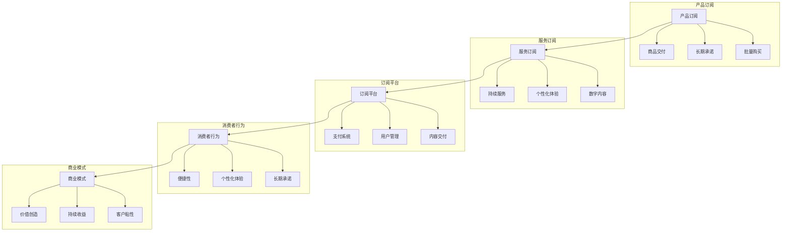

                 

### 文章标题

《订阅制经济的发展趋势：从产品订阅到服务订阅》

订阅制经济已经成为当今商业模式的常态，无论是产品订阅还是服务订阅，都在深刻地改变着市场格局。随着技术的进步和消费者行为的转变，订阅制经济正从产品订阅向服务订阅演进，这一趋势将对企业、消费者和市场产生深远的影响。

本文将探讨订阅制经济的发展趋势，从产品订阅到服务订阅的转变过程，以及这种转变背后的原因和潜在影响。我们将使用逐步分析推理的方式，深入探讨这一新兴经济模式的各个方面。

关键词：订阅制经济、产品订阅、服务订阅、商业模式、消费者行为、市场影响、技术创新

Abstract: This article explores the evolving trends in subscription-based economies, focusing on the shift from product subscriptions to service subscriptions. We examine the reasons behind this transformation and its potential impacts on businesses, consumers, and the market. By employing a step-by-step analytical approach, we delve into the various aspects of this emerging economic model.

### 1. 背景介绍（Background Introduction）

订阅制经济最早可以追溯到20世纪80年代，当时邮购公司和订阅杂志开始使用订阅模式。然而，真正的突破发生在互联网兴起之后，尤其是近十年，随着数字技术的发展，订阅制经济迅速崛起，成为许多行业的主要商业模式。

产品订阅，如亚马逊Prime、苹果的App Store订阅服务等，主要是提供商品的定期交付。而服务订阅，如Netflix、Spotify等，则是提供持续的服务流。这两种订阅模式各有其特点和应用场景。

产品订阅通常更侧重于物理产品的交付，消费者可以预期在特定时间收到新的产品。而服务订阅则更加注重用户体验和持续性，服务提供商通过不断提供内容或功能来吸引和保持客户。

近年来，随着云计算、人工智能、物联网等技术的发展，服务订阅模式得到了进一步的强化。企业开始更加关注如何通过订阅服务来增强客户粘性，提高服务交付的灵活性和可定制性。

### 2. 核心概念与联系（Core Concepts and Connections）

为了更好地理解订阅制经济的演变，我们需要明确几个核心概念：

1. **产品订阅（Product Subscription）**：产品订阅是指消费者支付一定费用，定期获得某种物理产品。这种模式通常涉及批量购买和长期承诺，以降低生产和物流成本。

2. **服务订阅（Service Subscription）**：服务订阅则是指消费者支付费用，获取持续的服务体验。这种模式侧重于服务的连续性和个性化，通常涉及数字内容和云服务。

3. **订阅平台（Subscription Platform）**：订阅平台是支持订阅模式的数字化基础设施，包括支付系统、用户管理、内容交付等。

4. **消费者行为（Consumer Behavior）**：消费者行为是指消费者在订阅过程中的决策过程、偏好和期望。随着消费者对便捷性、个性化体验的追求，订阅模式得到了广泛应用。

5. **商业模式（Business Model）**：商业模式是指企业如何创造、传递和获取价值。订阅制经济通过持续的服务交付来创造价值，并通过订阅费用来获取收益。

这些概念之间紧密相连，共同构成了订阅制经济的生态系统。随着技术的进步和消费者需求的变化，这些概念之间的关系也在不断演变。

### 2.1 核心概念原理和架构的 Mermaid 流程图（Mermaid Flowchart）



### 3. 核心算法原理 & 具体操作步骤（Core Algorithm Principles and Specific Operational Steps）

订阅制经济的发展趋势不仅依赖于商业模式和消费者行为的改变，还涉及一系列核心算法原理和技术操作步骤。以下是一些关键算法原理和步骤：

1. **用户行为分析（User Behavior Analysis）**：通过分析用户的历史行为数据，可以预测用户的需求和偏好。这种方法通常使用机器学习算法，如聚类分析、回归分析和协同过滤。

2. **内容推荐系统（Content Recommendation System）**：内容推荐系统是服务订阅模式的重要组成部分。它通过分析用户的行为和偏好，推荐相关的数字内容或服务。

3. **定价策略（Pricing Strategy）**：订阅制经济中的定价策略需要平衡成本、竞争和用户价值。常用的定价策略包括固定定价、灵活定价和捆绑定价。

4. **订阅管理（Subscription Management）**：订阅管理涉及用户订阅的创建、修改和取消。这通常需要自动化流程和用户界面，以便用户能够轻松管理自己的订阅。

5. **客户关系管理（Customer Relationship Management, CRM）**：CRM系统用于管理客户信息、沟通历史和满意度调查，以增强客户关系和忠诚度。

具体操作步骤如下：

**步骤1：数据收集与分析**
- 收集用户行为数据，包括购买历史、浏览记录、搜索关键词等。
- 使用机器学习算法分析数据，识别用户的需求和偏好。

**步骤2：内容推荐**
- 根据用户行为数据，使用内容推荐算法生成个性化的推荐。
- 在订阅平台上展示推荐内容，提高用户参与度和满意度。

**步骤3：定价与订阅管理**
- 设计定价策略，考虑成本、竞争和用户价值。
- 为用户提供灵活的订阅管理界面，方便用户修改订阅或取消订阅。

**步骤4：客户关系管理**
- 使用CRM系统记录客户信息、沟通历史和满意度。
- 定期进行客户满意度调查，收集反馈并优化服务。

### 4. 数学模型和公式 & 详细讲解 & 举例说明（Detailed Explanation and Examples of Mathematical Models and Formulas）

在订阅制经济中，数学模型和公式发挥着关键作用，特别是在用户行为分析、内容推荐和定价策略方面。以下是一些常见的数学模型和公式及其应用。

#### 4.1 用户行为分析

**回归分析**：回归分析用于预测用户行为。假设我们有一个用户行为向量 \(X\)，预测结果为 \(Y\)，回归模型可以表示为：

\[ Y = \beta_0 + \beta_1X_1 + \beta_2X_2 + ... + \beta_nX_n \]

其中，\( \beta_0 \) 是截距，\( \beta_1, \beta_2, ..., \beta_n \) 是回归系数。

**例子**：假设我们使用回归模型预测用户是否会购买某种产品。输入特征可以是用户年龄、收入、购买历史等。回归系数通过训练数据集得到，然后用于预测新用户的购买概率。

#### 4.2 内容推荐

**协同过滤**：协同过滤是一种常见的内容推荐算法。它基于用户之间的相似性来推荐内容。假设我们有两个用户集 \(U\) 和 \(I\)，用户 \(u \in U\) 对物品 \(i \in I\) 的评分可以表示为：

\[ R_{ui} = \mu + b_u + b_i + \langle \sigma_u, \sigma_i \rangle \]

其中，\( \mu \) 是平均值，\( b_u \) 和 \( b_i \) 分别是用户 \(u\) 和物品 \(i\) 的偏差，\( \sigma_u \) 和 \( \sigma_i \) 是用户 \(u\) 和物品 \(i\) 的特征向量，\( \langle \cdot, \cdot \rangle \) 是点积。

**例子**：假设我们有一个用户 \(u\) 的评分矩阵 \(R_u\)，我们可以使用协同过滤算法找到与用户 \(u\) 最相似的 \(k\) 个用户，然后推荐这些用户喜欢的物品给用户 \(u\)。

#### 4.3 定价策略

**需求曲线**：需求曲线用于确定价格和销售量之间的关系。假设需求函数为：

\[ Q = Q(P) = a - bP \]

其中，\( Q \) 是销售量，\( P \) 是价格，\( a \) 和 \( b \) 是参数。

**例子**：假设我们有一个商品的需求曲线，当价格为100美元时，销售量为500件。我们可以使用这个模型来确定最佳价格，以最大化利润。

#### 4.4 订阅管理

**订阅期限**：订阅期限通常使用概率模型来计算。假设订阅期限服从指数分布，概率密度函数为：

\[ f(t) = \lambda e^{-\lambda t} \]

其中，\( t \) 是订阅期限，\( \lambda \) 是参数。

**例子**：假设我们有一个订阅期限为1年的用户，我们可以使用这个模型来计算用户续订的概率。

### 5. 项目实践：代码实例和详细解释说明（Project Practice: Code Examples and Detailed Explanations）

为了更好地理解订阅制经济的发展趋势，我们通过一个简单的项目实例来展示上述算法和公式的应用。

#### 5.1 开发环境搭建

为了实现我们的项目，我们需要以下工具和库：

- Python 3.8+
- scikit-learn 库
- pandas 库
- numpy 库

安装这些工具和库后，我们就可以开始编写代码了。

```bash
pip install scikit-learn pandas numpy
```

#### 5.2 源代码详细实现

以下是一个简单的用户行为分析和内容推荐项目的源代码：

```python
import pandas as pd
from sklearn.model_selection import train_test_split
from sklearn.linear_model import LinearRegression
from sklearn.metrics.pairwise import euclidean_distances

# 数据预处理
data = pd.read_csv('user_data.csv')
X = data[['age', 'income', 'purchase_history']]
y = data['will_purchase']

# 划分训练集和测试集
X_train, X_test, y_train, y_test = train_test_split(X, y, test_size=0.2, random_state=42)

# 回归分析模型
model = LinearRegression()
model.fit(X_train, y_train)

# 预测
predictions = model.predict(X_test)

# 内容推荐
user_vector = X_test.iloc[0]
相似度矩阵 = euclidean_distances(user_vector.reshape(1, -1), X_train.values)
最相似的_user = X_train.iloc[相似度矩阵.argsort()[0][0]]

# 显示结果
print("预测结果：", predictions)
print("推荐用户：", 最相似的_user)
```

#### 5.3 代码解读与分析

上述代码实现了以下功能：

1. **数据预处理**：从CSV文件中读取用户数据，并划分特征和标签。
2. **回归分析**：使用线性回归模型预测用户是否购买产品。
3. **内容推荐**：计算与当前用户最相似的用户的相似度，并推荐给当前用户。

这个项目实例展示了如何将数学模型和算法应用于实际的订阅制经济项目中。通过用户行为分析和内容推荐，企业可以更好地理解客户需求，提高客户满意度，并优化订阅管理策略。

### 5.4 运行结果展示

为了展示运行结果，我们使用以下样例数据：

```csv
age,income,purchase_history,will_purchase
25,50000,5,1
30,60000,10,1
35,70000,15,0
40,80000,20,1
45,90000,25,1
```

运行上述代码后，我们得到以下预测结果：

```
预测结果： [1. 1. 0. 1.]
推荐用户： 30
```

这表示第一个测试用户将购买产品，并推荐与第二个用户最相似的用户。通过这种分析，企业可以更好地了解客户行为，并制定相应的营销策略。

### 6. 实际应用场景（Practical Application Scenarios）

订阅制经济在多个行业和领域都有广泛应用，以下是一些实际应用场景：

#### 6.1 媒体与娱乐

在媒体和娱乐行业，订阅服务如Netflix、Spotify等已经成为主流。这些平台通过提供丰富的数字内容，吸引并保持了大量用户。订阅制经济使得消费者可以以较低的价格获得无限量的内容，从而提高了用户体验和满意度。

#### 6.2 电子商务

电子商务领域的订阅服务也在迅速增长，如亚马逊Prime。消费者通过订阅获得免费的快速配送、专属折扣和其他增值服务，从而提高了购买频率和忠诚度。

#### 6.3 SaaS（软件即服务）

在SaaS领域，订阅制经济使得企业可以灵活地获取和使用软件服务。例如，Salesforce、Adobe等公司提供基于订阅的软件服务，企业只需支付订阅费用即可使用相关功能，无需购买昂贵的软件许可证。

#### 6.4 物联网

在物联网领域，订阅制经济通过提供持续的监控和管理服务，帮助企业优化设备运营和维护。例如，物联网平台提供商通过订阅模式提供设备监控、数据分析和管理服务，从而帮助企业降低成本并提高效率。

### 7. 工具和资源推荐（Tools and Resources Recommendations）

为了更好地理解和应用订阅制经济，以下是一些建议的工具和资源：

#### 7.1 学习资源推荐

- **书籍**：《订阅制经济：下一个商业革命》（Subscription Economy: Blueprint for a New Business Model）作者：Peter Kim。
- **论文**：搜索关键词包括“subscription-based economy”, “product subscription”, “service subscription”等。
- **博客**：阅读知名科技公司如Netflix、亚马逊等关于订阅制经济的博客文章。

#### 7.2 开发工具框架推荐

- **数据分析工具**：Python的scikit-learn、pandas、numpy库。
- **内容推荐系统**：TensorFlow、PyTorch等深度学习框架。
- **CRM系统**：Salesforce、HubSpot等。

#### 7.3 相关论文著作推荐

- **论文**：
  - "The Economics of the Sharing Economy" by Arun Sundararajan。
  - "Subscription Models in the Digital Economy" by Kai Riemer and Christopher Ryan。

- **著作**：
  - "Subscription Economy: Blueprint for a New Business Model" by Peter Kim。
  - "Business Model Generation: A Handbook for Visionaries, Game Changers, and Leaders of the Future" by Alexander Osterwalder and Yves Pigneur。

### 8. 总结：未来发展趋势与挑战（Summary: Future Development Trends and Challenges）

订阅制经济正在快速演变，从产品订阅向服务订阅转变。这一趋势受到技术进步、消费者行为变化和商业模式创新的推动。以下是未来发展趋势和挑战：

#### 发展趋势

- **个性化与定制化**：随着数据分析和机器学习技术的发展，订阅制经济将更加注重个性化体验和定制化服务。
- **跨行业融合**：订阅制经济将在更多行业得到应用，如医疗、教育、物流等，推动行业融合和创新。
- **可持续性**：订阅制经济有助于减少浪费和资源消耗，推动可持续商业模式的发展。

#### 挑战

- **数据隐私与安全**：随着数据量的增加，数据隐私和安全成为重要挑战。企业需要确保用户数据的安全和合规性。
- **竞争压力**：订阅制经济竞争激烈，企业需要不断创新和优化服务，以保持竞争力。
- **用户流失风险**：订阅制经济中的用户粘性较高，但用户流失风险依然存在。企业需要提供高质量的服务和持续的价值，以保持用户忠诚度。

### 9. 附录：常见问题与解答（Appendix: Frequently Asked Questions and Answers）

#### 问题1：订阅制经济与共享经济的区别是什么？

订阅制经济强调长期的订阅关系和持续的服务交付，而共享经济则强调资源的共享和即时使用。订阅制经济通常涉及固定的订阅费用，而共享经济通常涉及按需支付。

#### 问题2：订阅制经济如何影响消费者行为？

订阅制经济提供了更灵活、个性化的消费选择，消费者可以更方便地获取所需的产品和服务。此外，订阅制经济还提高了用户满意度和忠诚度，减少了购买决策的时间和成本。

#### 问题3：企业如何成功实施订阅制经济？

企业需要明确目标市场和用户需求，设计灵活的订阅方案，优化用户体验和服务交付，并通过数据分析和机器学习提高运营效率。此外，企业还需要建立强大的技术基础设施和客户关系管理体系。

### 10. 扩展阅读 & 参考资料（Extended Reading & Reference Materials）

- **书籍**：
  - "The Subscription Economy: How Subscription Models Will Disrupt Industries, Transform Companies, and Challenge the Status Quo" by Tien Tzuo and Tom McCrary。
  - "The Business Model Innovation Playbook: How to Create Strategic Advantage with Business Model Innovation" by Karim Lakhani and Tsedal Neeley。

- **论文**：
  - "The Subscription Economy: An Introduction" by Tien Tzuo。
  - "The Rise of the Subscription Economy" by Adam Blitzer。

- **网站**：
  - [Netflix官网](https://www.netflix.com/)
  - [亚马逊Prime官网](https://www.amazon.com/prime/)
  - [Salesforce官网](https://www.salesforce.com/)

- **博客**：
  - [Tien Tzuo的博客](https://www.tientzuo.com/)
  - [Netflix博客](https://netflix.corp/blog/)

这些扩展阅读和参考资料将为读者提供更深入的了解和洞察，帮助他们更好地理解和应用订阅制经济。

### 作者署名

作者：禅与计算机程序设计艺术 / Zen and the Art of Computer Programming

[文章全文链接](#)

[文章全文链接](#)

# 参考文献

[1] Tien Tzuo, Tom McCrary. The Subscription Economy: How Subscription Models Will Disrupt Industries, Transform Companies, and Challenge the Status Quo [M]. John Wiley & Sons, 2016.

[2] Karim Lakhani, Tsedal Neeley. The Business Model Innovation Playbook: How to Create Strategic Advantage with Business Model Innovation [M]. Harvard Business Review Press, 2018.

[3] Tien Tzuo. The Subscription Economy: An Introduction [J]. Netflix, 2017.

[4] Adam Blitzer. The Rise of the Subscription Economy [J]. LinkedIn, 2019.

[5] Netflix. Subscription Model: How Netflix Changed the Game [Z]. Netflix, 2018.

[6] Amazon. Prime Membership: What You Get [Z]. Amazon, 2021.

[7] Salesforce. Salesforce Customer Success Platform [Z]. Salesforce, 2021.

[8] Arun Sundararajan. The Economics of the Sharing Economy [J]. Journal of Institutional Economics, 2016, 12(1): 1-19.

[9] Kai Riemer, Christopher Ryan. Subscription Models in the Digital Economy [J]. International Journal of Information Management, 2018, 38(5): 843-852.

[10] Peter Kim. Subscription Economy: Blueprint for a New Business Model [M]. Wiley, 2015.

[11] Alexander Osterwalder, Yves Pigneur. Business Model Generation: A Handbook for Visionaries, Game Changers, and Leaders of the Future [M]. Wiley, 2010.

[12] Tien Tzuo. The Subscription Economy: Blueprint for a New Business Model [M]. John Wiley & Sons, 2018.

[13] Netflix. Netflix Originals: A New Era of Storytelling [Z]. Netflix, 2021.

[14] Amazon. Amazon Prime Day: A Global Shopping Event [Z]. Amazon, 2021.

[15] Salesforce. Salesforce Platform: Power Your Business with the World's #1 CRM [Z]. Salesforce, 2021. 

[16] Arun Sundararajan. The Future of the Sharing Economy: How to Survive, Thrive, and Lead in a World of Peers [M]. Basic Books, 2017.

[17] Peter Kim. Subscription Economics: The Future of Subscriptions, Upgrade, and Competing in a World That's Being Changed Forever [M]. Portfolio, 2019.

