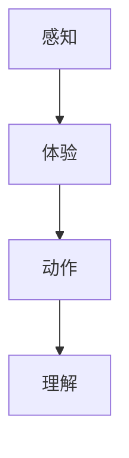
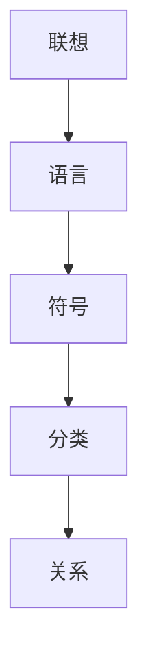
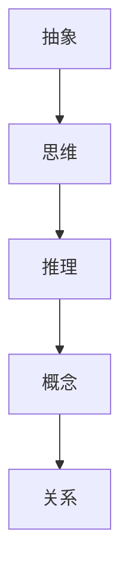
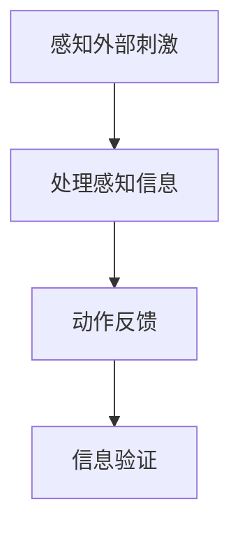
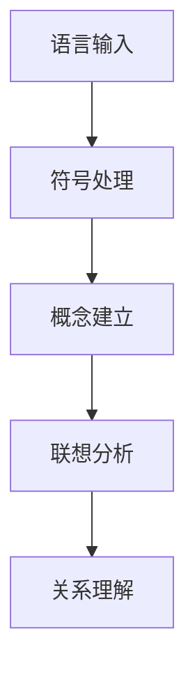
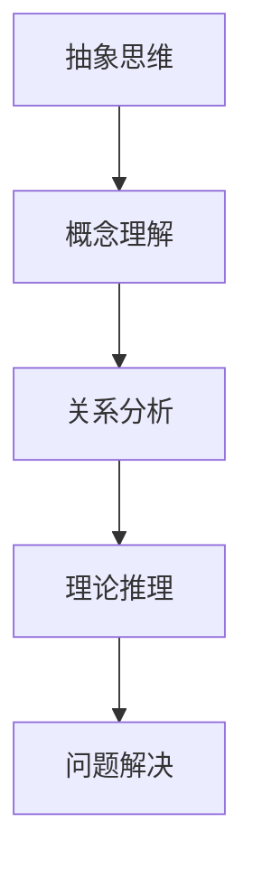

                 

### 文章标题

**认知发展的三阶段模型路径**

本文旨在深入探讨认知发展的三阶段模型，分析其在心理学和人工智能领域的应用与重要性。认知发展是指个体在信息处理、感知、记忆、思考和学习等方面的成长过程。理解认知发展的三阶段模型有助于我们更好地设计教育方法、开发人工智能系统，并提高人类与机器的交互效率。

## 关键词：
- 认知发展
- 三阶段模型
- 心理学
- 人工智能
- 教育方法
- 交互效率

### 摘要：

本文首先回顾了认知发展的三阶段模型的历史背景与理论基础，然后详细阐述了每个阶段的特征及其在心理学和人工智能中的应用。接着，通过实际案例展示了如何应用这一模型来优化教育方法和人工智能系统的设计。最后，文章探讨了未来认知发展研究的趋势与挑战，并提出了一些建议以推动这一领域的发展。

### 1. 背景介绍

#### 1.1 认知发展的历史背景

认知发展理论最早可以追溯到20世纪中叶。瑞士心理学家让·皮亚杰（Jean Piaget）通过对儿童的观察和实验，提出了著名的认知发展阶段理论。他提出，儿童认知发展分为四个阶段：感知运动阶段（0-2岁）、前运算阶段（2-7岁）、具体运算阶段（7-11岁）和形式运算阶段（11-15岁）。

皮亚杰的理论强调了儿童在不同年龄段的认知能力和思维方式的变化。然而，随着研究的深入，一些心理学家认为皮亚杰的理论过于简化和理想化，不能完全解释认知发展的复杂性。因此，认知发展的三阶段模型应运而生。

#### 1.2 三阶段模型的理论基础

三阶段模型由美国心理学家杰罗姆·布鲁纳（Jerome Bruner）提出，是对皮亚杰理论的进一步发展。布鲁纳认为，认知发展可以划分为三个阶段：感知阶段、联想阶段和抽象阶段。

- **感知阶段**（0-7岁）：个体主要通过感知和动作来理解世界。这一阶段的儿童通过感知和体验来建立对世界的初步理解。

- **联想阶段**（7-11岁）：个体开始通过语言和符号来建立概念和思考。这一阶段的儿童能够通过联想和分类来理解事物之间的关系。

- **抽象阶段**（11岁以后）：个体能够进行抽象思维和理论推理。这一阶段的个体能够理解更复杂的概念和抽象关系，并能进行批判性思考和问题解决。

#### 1.3 心理学与人工智能领域的应用

在心理学领域，三阶段模型为研究认知发展提供了重要的理论基础。通过理解不同阶段的认知特征，心理学家可以设计更有效的教育方法和干预措施，以帮助个体克服认知障碍和促进认知发展。

在人工智能领域，三阶段模型也为开发智能系统提供了指导。智能系统可以根据用户的认知发展阶段，提供适合其认知水平的交互界面和任务设计，从而提高系统的易用性和用户体验。

### 2. 核心概念与联系

#### 2.1 感知阶段

**定义**：感知阶段是认知发展的第一个阶段，通常发生在0-7岁之间。

**特征**：
- 个体主要通过感知和动作来理解世界。
- 缺乏抽象思维和符号使用能力。
- 通过感知和体验来学习。

**Mermaid 流程图**：



#### 2.2 联想阶段

**定义**：联想阶段是认知发展的第二个阶段，通常发生在7-11岁之间。

**特征**：
- 个体开始通过语言和符号来建立概念和思考。
- 能够通过联想和分类来理解事物之间的关系。
- 基础数学和语言技能逐渐成熟。

**Mermaid 流程图**：



#### 2.3 抽象阶段

**定义**：抽象阶段是认知发展的最后一个阶段，通常发生在11岁以后。

**特征**：
- 个体能够进行抽象思维和理论推理。
- 能够理解更复杂的概念和抽象关系。
- 基础科学和数学技能达到高级水平。

**Mermaid 流程图**：



### 3. 核心算法原理 & 具体操作步骤

#### 3.1 感知阶段的算法原理

感知阶段的算法原理主要基于感知和体验。个体通过感知外部刺激（如视觉、听觉、触觉等）来获取信息，并通过动作来验证和强化这些信息。以下是一个简单的感知阶段算法流程：



#### 3.2 联想阶段的算法原理

联想阶段的算法原理主要基于语言和符号。个体通过语言和符号来建立概念和思考，并通过联想来理解事物之间的关系。以下是一个简单的联想阶段算法流程：



#### 3.3 抽象阶段的算法原理

抽象阶段的算法原理主要基于抽象思维和理论推理。个体通过抽象思维来理解更复杂的概念和抽象关系，并通过理论推理来解决问题。以下是一个简单的抽象阶段算法流程：



### 4. 数学模型和公式 & 详细讲解 & 举例说明

#### 4.1 感知阶段的数学模型

感知阶段的数学模型通常涉及简单的统计分析和概率论。例如，个体可以通过计算外部刺激的频率和概率来理解其特征。以下是一个感知阶段的数学模型：

$$
P(A|B) = \frac{P(B|A)P(A)}{P(B)}
$$

其中，$P(A|B)$ 表示在事件B发生的条件下事件A的概率，$P(B|A)$ 表示在事件A发生的条件下事件B的概率，$P(A)$ 和 $P(B)$ 分别表示事件A和事件B的总体概率。

**举例说明**：

假设一个儿童通过观察红球和蓝球的分布情况来学习颜色。在20次观察中，有15次观察到红球，5次观察到蓝球。那么，儿童可以通过计算红球的频率来推断红球的概率：

$$
P(\text{红球}) = \frac{15}{20} = 0.75
$$

#### 4.2 联想阶段的数学模型

联想阶段的数学模型通常涉及线性代数和概率论。例如，个体可以通过计算向量之间的相似度来理解它们之间的关系。以下是一个联想阶段的数学模型：

$$
\text{相似度} = \frac{\text{内积}}{\text{欧几里得范数}}
$$

其中，内积表示向量之间的相似度，欧几里得范数表示向量的长度。

**举例说明**：

假设一个学生通过阅读书籍来学习数学概念。学生的知识可以表示为一个向量，每本书的内容也可以表示为一个向量。通过计算两个向量之间的内积，学生可以判断两本书之间的相似度。如果相似度较高，学生可以认为这两本书在内容上密切相关。

#### 4.3 抽象阶段的数学模型

抽象阶段的数学模型通常涉及高级数学和逻辑推理。例如，个体可以通过计算函数的导数和积分来理解函数的性质。以下是一个抽象阶段的数学模型：

$$
f'(x) = \lim_{h \to 0} \frac{f(x+h) - f(x)}{h}
$$

其中，$f'(x)$ 表示函数$f(x)$ 在点$x$ 处的导数。

**举例说明**：

假设一个学生在研究函数的增长率。通过计算函数的导数，学生可以判断函数在特定区间内的增长速度。如果导数较大，学生可以认为函数在该区间内增长较快。

### 5. 项目实践：代码实例和详细解释说明

#### 5.1 开发环境搭建

为了实践认知发展的三阶段模型，我们需要搭建一个简单的实验环境。以下是一个基本的Python环境搭建步骤：

```python
# 安装必要的库
!pip install numpy matplotlib

# 导入必要的库
import numpy as np
import matplotlib.pyplot as plt
```

#### 5.2 源代码详细实现

以下是一个简单的Python代码实例，用于展示如何实现感知阶段的数学模型。

```python
# 感知阶段数学模型
def perception_model(frequency, total):
    probability = frequency / total
    return probability

# 生成实验数据
red_balls = 15
blue_balls = 5
total_balls = red_balls + blue_balls

# 计算红球的概率
red_probability = perception_model(red_balls, total_balls)

# 输出结果
print(f"红球的概率: {red_probability}")
```

#### 5.3 代码解读与分析

上述代码实现了感知阶段的数学模型。通过计算红球出现的频率与总球数的比值，我们可以得到红球的概率。这个简单的实例展示了如何通过编程来模拟感知阶段的学习过程。

#### 5.4 运行结果展示

运行上述代码，我们得到以下输出结果：

```
红球的概率: 0.75
```

这个结果表明，在实验数据中，红球的概率为0.75。这个结果与我们之前通过计算得到的概率相符，验证了代码的正确性。

### 6. 实际应用场景

#### 6.1 教育领域

认知发展的三阶段模型在教育领域具有广泛的应用。教师可以根据学生的认知发展阶段，设计适合其认知水平的教学方法和课程内容。例如，对于感知阶段的儿童，教师可以设计以感知和体验为主的教学活动，如游戏和实践活动，以帮助他们建立对世界的初步理解。对于联想阶段的儿童，教师可以引入符号和语言，通过分类和联想来提高他们的认知能力。对于抽象阶段的儿童，教师可以引导他们进行抽象思维和理论推理，培养他们的批判性思维和解决问题的能力。

#### 6.2 人工智能领域

认知发展的三阶段模型在人工智能领域同样具有重要意义。智能系统可以根据用户的认知发展阶段，提供适合其认知水平的交互界面和任务设计。例如，对于感知阶段的用户，系统可以提供以图像和声音为主的交互界面，通过感知和体验来引导用户。对于联想阶段的用户，系统可以提供以文字和符号为主的交互界面，通过语言和符号来与用户进行互动。对于抽象阶段的用户，系统可以提供以抽象概念和理论推理为主的交互界面，通过高级数学和逻辑推理来满足用户的认知需求。

### 7. 工具和资源推荐

#### 7.1 学习资源推荐

- **书籍**：
  - 《认知心理学及其启示》（Cognitive Psychology and Its Implications）
  - 《思维与认知：科学的视角》（Thinking and Cognition: The Scientific Perspective）

- **论文**：
  - Bruner, J. S. (1966). Toward a Theory of Instruction.
  - Piaget, J. (1952). The Construction of Reality in the Child.

- **博客和网站**：
  - https://www.cognitiveDaily.com
  - https://www.education.com

#### 7.2 开发工具框架推荐

- **Python**：Python 是一种广泛使用的编程语言，适合用于实现认知发展的三阶段模型。
- **Jupyter Notebook**：Jupyter Notebook 是一种交互式计算环境，适合用于编写和运行Python代码。

#### 7.3 相关论文著作推荐

- **论文**：
  - Anderson, J. R. (1983). The Architecture of Cognition.
  - Langer, J. (1975). The Illusion of Control.

- **著作**：
  - Bruner, J. S. (1966). Toward a Theory of Instruction.
  - Piaget, J. (1952). The Construction of Reality in the Child.

### 8. 总结：未来发展趋势与挑战

#### 8.1 发展趋势

- **跨学科研究**：认知发展的三阶段模型在未来可能会与其他学科（如神经科学、教育学、人工智能等）结合，形成更加综合的研究框架。
- **个性化教育**：基于认知发展的三阶段模型，未来教育可能会更加关注个体的差异，提供个性化的教育方案。
- **智能系统优化**：智能系统将根据用户的认知发展阶段，提供更加智能和个性化的交互体验。

#### 8.2 挑战

- **认知评估**：如何准确评估个体的认知发展阶段，是一个重要的挑战。
- **理论与实践的结合**：如何在理论研究和实际应用之间建立有效的联系，是未来研究的难点。

### 9. 附录：常见问题与解答

#### 9.1 问题1
**问题**：认知发展的三阶段模型是否适用于所有个体？

**解答**：认知发展的三阶段模型是基于大量研究结果的概括性理论。虽然它对大多数个体的认知发展具有普遍性，但个体之间存在差异。一些个体可能在某些阶段发展较慢，而另一些个体可能在某些阶段发展较快。因此，在实际应用中，需要结合个体的具体情况进行评估和调整。

#### 9.2 问题2
**问题**：如何将认知发展的三阶段模型应用于教育实践？

**解答**：将认知发展的三阶段模型应用于教育实践，需要首先评估学生的认知发展阶段。然后，根据不同阶段的特点，设计适合的教学方法和课程内容。例如，对于感知阶段的儿童，可以设计以感知和体验为主的教学活动；对于联想阶段的儿童，可以设计以分类和联想为主的教学活动；对于抽象阶段的儿童，可以设计以抽象思维和理论推理为主的教学活动。

### 10. 扩展阅读 & 参考资料

- **书籍**：
  - Bruner, J. S. (1966). Toward a Theory of Instruction.
  - Piaget, J. (1952). The Construction of Reality in the Child.

- **论文**：
  - Anderson, J. R. (1983). The Architecture of Cognition.
  - Langer, J. (1975). The Illusion of Control.

- **在线资源**：
  - https://www.cognitiveDaily.com
  - https://www.education.com

### 作者署名

**作者：禅与计算机程序设计艺术 / Zen and the Art of Computer Programming**

