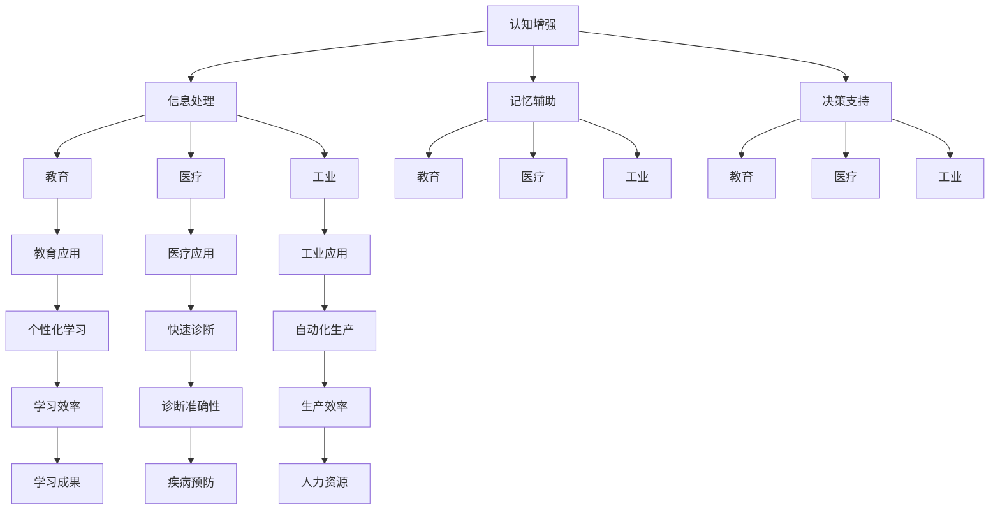

                 

### 文章标题：认知增强vs认知替代：AI辅助决策的边界

> 关键词：认知增强、认知替代、AI辅助决策、人类智能、技术伦理

> 摘要：本文将探讨人工智能（AI）在辅助人类决策过程中的双重角色：认知增强和认知替代。通过分析AI技术的优势和潜在风险，本文旨在厘清AI在决策过程中的应用边界，探讨如何最大化AI的价值同时规避其负面影响。

-------------------

## 1. 背景介绍（Background Introduction）

随着人工智能技术的快速发展，AI已经在各个领域展现出巨大的潜力。从医疗诊断到金融分析，从自动驾驶到智能家居，AI正逐步深入人们的日常生活。然而，AI的广泛应用也引发了关于其影响和道德问题的广泛讨论。特别是在决策领域，AI的介入既有可能增强人类的认知能力，也可能替代人类的决策过程，从而引发一系列伦理和技术挑战。

本文将重点讨论AI在认知增强和认知替代方面的应用，分析其优缺点，并探讨如何在实际应用中合理利用AI，同时确保其不会损害人类的认知能力和道德标准。

-------------------

### 1.1 认知增强（Cognitive Augmentation）

认知增强是指通过外部技术手段来增强或扩展人类大脑的认知能力。AI在认知增强中的应用主要体现在以下几个方面：

- **信息处理能力**：AI可以帮助人类快速处理大量信息，从而提高决策效率。例如，通过自然语言处理技术，AI可以自动筛选和分析新闻文章，帮助用户快速获取关键信息。
- **记忆辅助**：AI可以充当智能助手，帮助人们记忆重要信息和任务。例如，智能助手可以提醒用户即将到来的会议、任务完成情况等。
- **智能推荐**：基于机器学习算法，AI可以分析用户的行为和偏好，提供个性化的推荐服务，从而帮助用户做出更加明智的决策。

### 1.2 认知替代（Cognitive Substitution）

认知替代是指AI取代人类完成某些认知任务，从而使人类从繁琐的决策过程中解脱出来。AI在认知替代中的应用主要体现在以下几个方面：

- **自动化决策**：在某些场景下，AI可以通过自主学习来替代人类进行决策。例如，在金融市场中，AI可以自动分析市场数据，执行交易策略。
- **专家系统**：AI可以模拟专家的知识和经验，为人类提供专业的决策建议。例如，医学AI可以基于患者的病史和检查结果，提供诊断建议。
- **决策模拟**：AI可以通过模拟不同的决策结果，帮助人类评估各种选择的潜在影响，从而做出更加合理的决策。

-------------------

### 1.3 AI辅助决策的优势和挑战

#### 1.3.1 优势

- **效率提升**：AI可以快速处理和分析大量数据，从而提高决策效率。
- **准确性提高**：在某些领域，AI的决策能力甚至超过了人类，例如在棋类游戏中。
- **智能推荐**：AI可以根据用户的行为和偏好提供个性化推荐，从而提高决策质量。

#### 1.3.2 挑战

- **伦理问题**：AI的决策过程可能涉及到隐私和数据安全问题，例如在医疗领域。
- **技能退化**：过度依赖AI可能导致人类认知能力的退化。
- **透明度不足**：AI的决策过程往往是不透明的，难以解释和验证。

-------------------

### 1.4 认知增强与认知替代的关系

认知增强和认知替代是AI辅助决策的两种不同方式。认知增强强调的是AI作为工具，帮助人类提升认知能力；而认知替代则强调AI取代人类完成认知任务。在实际应用中，这两种方式往往是相互结合的。例如，在自动驾驶技术中，AI不仅帮助驾驶员处理和分析道路信息，还可以在紧急情况下接管车辆控制。

-------------------

### 1.5 本文结构

本文将按照以下结构展开：

- **背景介绍**：介绍AI辅助决策的背景和相关概念。
- **核心概念与联系**：详细讨论认知增强和认知替代的概念及其关系。
- **核心算法原理 & 具体操作步骤**：介绍AI在认知增强和认知替代中的应用算法。
- **数学模型和公式 & 详细讲解 & 举例说明**：介绍相关数学模型和算法。
- **项目实践**：通过具体案例展示AI在认知增强和认知替代中的应用。
- **实际应用场景**：分析AI在不同领域的应用场景。
- **工具和资源推荐**：推荐相关学习资源和开发工具。
- **总结**：总结AI辅助决策的优缺点，探讨未来发展趋势。
- **扩展阅读 & 参考资料**：提供进一步阅读和研究的资料。

-------------------

## 2. 核心概念与联系（Core Concepts and Connections）

在探讨AI辅助决策的过程中，我们需要理解两个核心概念：认知增强（Cognitive Augmentation）和认知替代（Cognitive Substitution）。这两个概念不仅定义了AI在决策过程中的不同角色，还揭示了AI与人类智能之间的复杂关系。

### 2.1 认知增强

认知增强是指通过外部技术手段，如计算机辅助、智能设备和人工智能等，增强或扩展人类大脑的认知能力。这种增强可以表现在多个方面：

- **信息处理能力**：AI可以帮助人类更快、更准确地处理和分析大量信息。例如，在医疗领域，AI可以通过自然语言处理技术分析病历，帮助医生快速诊断疾病。
- **记忆辅助**：AI可以通过智能助手或应用程序，帮助人类记忆重要信息。例如，智能助手可以提醒用户会议时间、任务到期等。
- **决策支持**：AI可以通过分析数据和趋势，为人类提供决策支持。例如，在金融领域，AI可以通过分析市场数据，提供投资建议。

#### 2.1.1 认知增强的应用场景

认知增强的应用场景广泛，包括但不限于以下几个方面：

- **教育**：AI可以帮助学生个性化学习，通过分析学习数据，提供针对性的学习建议。
- **医疗**：AI可以帮助医生分析医学图像，提高诊断的准确性。
- **工业**：AI可以帮助工厂自动化生产流程，提高生产效率。

### 2.2 认知替代

认知替代是指AI完全取代人类完成某些认知任务，从而释放人类的时间和精力。这种替代可以表现在以下方面：

- **自动化决策**：在某些情况下，AI可以完全自主地做出决策。例如，自动驾驶汽车可以根据传感器数据自动控制车辆。
- **专家系统**：AI可以模拟专家的知识和经验，为人类提供专业的决策建议。例如，医疗AI可以根据患者的病史和检查结果，提供诊断建议。
- **决策模拟**：AI可以通过模拟不同的决策结果，帮助人类评估各种选择的潜在影响。

#### 2.2.1 认知替代的应用场景

认知替代的应用场景同样广泛，包括但不限于以下几个方面：

- **交通**：自动驾驶汽车和无人机可以减少人为错误，提高交通安全。
- **金融**：AI可以自动化交易和风险管理，提高金融市场效率。
- **客服**：智能客服机器人可以24/7提供客户支持，减少人力成本。

### 2.3 认知增强与认知替代的关系

认知增强和认知替代并不是相互独立的，而是相互补充的。在实际应用中，认知增强可以提升AI的决策能力，而认知替代可以释放人类的时间和精力，使人类能够专注于更高层次的决策。

#### 2.3.1 认知增强与认知替代的相互作用

- **互补性**：认知增强可以提供更高质量的数据和更准确的预测，从而提高认知替代的效果。
- **协同性**：认知增强和认知替代可以协同工作，实现更高效的决策过程。

#### 2.3.2 关键挑战

- **数据质量**：认知增强依赖于高质量的数据，而数据质量和可靠性是认知替代成功的关键。
- **人类监督**：在某些情况下，认知替代的决策需要人类进行监督和干预，以确保决策的合理性和安全性。

-------------------

### 2.4 认知增强与认知替代的 Mermaid 流程图

以下是认知增强和认知替代的 Mermaid 流程图，展示了它们之间的相互作用和关键步骤。



-------------------

## 3. 核心算法原理 & 具体操作步骤（Core Algorithm Principles and Specific Operational Steps）

在了解认知增强和认知替代的概念后，我们需要深入了解AI在这些过程中的核心算法原理和具体操作步骤。以下是几个典型的AI算法及其应用场景：

### 3.1 支持向量机（Support Vector Machine, SVM）

支持向量机是一种经典的机器学习算法，常用于分类问题。在认知增强中，SVM可以用于分析大量的数据，帮助用户快速识别关键信息。

- **算法原理**：SVM通过找到最优的超平面，将数据集分为不同的类别。它通过最大化分类边界上的支持向量之间的距离来实现。
- **具体操作步骤**：
  1. 收集数据并预处理。
  2. 计算特征之间的相关性。
  3. 使用核函数将数据映射到高维空间。
  4. 训练SVM模型。
  5. 使用模型进行预测。

### 3.2 集成学习（Ensemble Learning）

集成学习是一种通过结合多个模型来提高预测准确性的方法。在认知替代中，集成学习可以用于自动化决策，例如自动驾驶汽车的路径规划。

- **算法原理**：集成学习通过训练多个基学习器，并将它们的预测结果进行合并，从而提高整体预测的准确性。
- **具体操作步骤**：
  1. 选择多个基学习器，如决策树、随机森林、支持向量机等。
  2. 分别训练每个基学习器。
  3. 将所有基学习器的预测结果进行合并，得到最终预测结果。

### 3.3 深度学习（Deep Learning）

深度学习是一种通过多层神经网络进行数据处理的算法，常用于图像识别、自然语言处理等任务。在认知增强中，深度学习可以用于处理复杂的非线性数据。

- **算法原理**：深度学习通过多层神经网络的逐层抽象，从原始数据中提取出更高层次的特征。
- **具体操作步骤**：
  1. 设计神经网络结构，包括输入层、隐藏层和输出层。
  2. 收集并预处理数据。
  3. 训练神经网络，优化权重和偏置。
  4. 使用训练好的模型进行预测。

-------------------

## 4. 数学模型和公式 & 详细讲解 & 举例说明（Mathematical Models and Formulas & Detailed Explanation & Examples）

在AI辅助决策的过程中，数学模型和公式起到了关键作用。以下将介绍几个重要的数学模型，并详细讲解它们的公式和具体应用。

### 4.1 线性回归（Linear Regression）

线性回归是一种用于预测数值变量的基本统计模型。它通过拟合一条直线，将自变量和因变量关联起来。

- **公式**：线性回归模型可以表示为 \( y = \beta_0 + \beta_1x + \epsilon \)，其中 \( y \) 是因变量，\( x \) 是自变量，\( \beta_0 \) 和 \( \beta_1 \) 是模型的参数，\( \epsilon \) 是误差项。
- **详细讲解**：线性回归通过最小化残差平方和来估计参数 \( \beta_0 \) 和 \( \beta_1 \) 的值。具体步骤如下：
  1. 收集数据。
  2. 计算自变量和因变量的均值。
  3. 计算每个数据点的残差。
  4. 最小化残差平方和，求解 \( \beta_0 \) 和 \( \beta_1 \) 的值。
- **举例说明**：假设我们想要预测房价，可以使用线性回归模型，将房子的面积作为自变量，房价作为因变量。通过训练模型，我们可以得到房价和面积之间的关系。

### 4.2 逻辑回归（Logistic Regression）

逻辑回归是一种用于分类问题的统计模型，常用于二分类问题。它通过拟合一个逻辑函数，将自变量映射到概率值。

- **公式**：逻辑回归模型可以表示为 \( P(y=1) = \frac{1}{1 + e^{-(\beta_0 + \beta_1x)}} \)，其中 \( P(y=1) \) 是因变量为1的概率，\( e \) 是自然对数的底数。
- **详细讲解**：逻辑回归通过最大化似然函数来估计参数 \( \beta_0 \) 和 \( \beta_1 \) 的值。具体步骤如下：
  1. 收集数据。
  2. 计算自变量和因变量的均值。
  3. 计算每个数据点的似然值。
  4. 最小化似然损失函数，求解 \( \beta_0 \) 和 \( \beta_1 \) 的值。
- **举例说明**：假设我们想要预测一个人是否患病，可以使用逻辑回归模型，将症状作为自变量，患病状态作为因变量。通过训练模型，我们可以得到患病概率和症状之间的关系。

### 4.3 决策树（Decision Tree）

决策树是一种基于特征划分数据集的模型，常用于分类和回归问题。它通过一系列的判断条件，将数据集划分为不同的区域。

- **公式**：决策树可以通过递归划分数据集，每个节点表示一个特征划分条件，叶子节点表示最终的分类或回归结果。
- **详细讲解**：决策树通过信息增益或基尼系数来选择最优的划分条件。具体步骤如下：
  1. 收集数据。
  2. 计算每个特征的信息增益或基尼系数。
  3. 选择最优的划分条件，递归划分数据集。
  4. 建立决策树模型。
- **举例说明**：假设我们想要预测某个学生的成绩，可以使用决策树模型，将学生的年龄、性别、学习时长等特征作为输入，成绩作为输出。通过训练模型，我们可以得到影响成绩的关键因素。

-------------------

## 5. 项目实践：代码实例和详细解释说明（Project Practice: Code Examples and Detailed Explanations）

为了更好地理解AI在认知增强和认知替代中的应用，以下我们将通过一个简单的项目实践，展示如何使用Python实现线性回归模型，并详细解释代码的各个部分。

### 5.1 开发环境搭建

在开始项目实践之前，我们需要搭建Python开发环境。以下是搭建步骤：

1. 安装Python：从官方网站（https://www.python.org/）下载并安装Python。
2. 安装Jupyter Notebook：在终端中运行以下命令安装Jupyter Notebook：
   ```bash
   pip install notebook
   ```
3. 安装必要的库：在终端中运行以下命令安装NumPy、Pandas和Scikit-learn库：
   ```bash
   pip install numpy pandas scikit-learn
   ```

### 5.2 源代码详细实现

以下是实现线性回归模型的Python代码：

```python
import numpy as np
import pandas as pd
from sklearn.linear_model import LinearRegression
from sklearn.model_selection import train_test_split
from sklearn.metrics import mean_squared_error

# 加载数据集
data = pd.read_csv("data.csv")
X = data.iloc[:, :-1].values
y = data.iloc[:, -1].values

# 划分训练集和测试集
X_train, X_test, y_train, y_test = train_test_split(X, y, test_size=0.2, random_state=0)

# 创建线性回归模型
model = LinearRegression()
model.fit(X_train, y_train)

# 进行预测
y_pred = model.predict(X_test)

# 计算均方误差
mse = mean_squared_error(y_test, y_pred)
print("Mean Squared Error:", mse)

# 输出模型的参数
print("Model Parameters:", model.coef_, model.intercept_)
```

### 5.3 代码解读与分析

以下是代码的逐行解读和分析：

```python
import numpy as np
import pandas as pd
from sklearn.linear_model import LinearRegression
from sklearn.model_selection import train_test_split
from sklearn.metrics import mean_squared_error

# 加载数据集
data = pd.read_csv("data.csv")
X = data.iloc[:, :-1].values
y = data.iloc[:, -1].values
```
这一部分代码用于加载数据集。我们使用Pandas库读取CSV文件，将自变量存储在变量X中，因变量存储在变量y中。

```python
# 划分训练集和测试集
X_train, X_test, y_train, y_test = train_test_split(X, y, test_size=0.2, random_state=0)
```
这一部分代码用于划分训练集和测试集。我们使用Scikit-learn库的train_test_split函数，将数据集分为80%的训练集和20%的测试集，并设置随机种子为0，以确保结果的可重复性。

```python
# 创建线性回归模型
model = LinearRegression()
model.fit(X_train, y_train)
```
这一部分代码用于创建线性回归模型。我们使用Scikit-learn库的LinearRegression类创建一个模型实例，并使用fit方法训练模型。

```python
# 进行预测
y_pred = model.predict(X_test)
```
这一部分代码用于使用训练好的模型进行预测。我们调用模型的predict方法，将测试集数据作为输入，得到预测结果存储在变量y_pred中。

```python
# 计算均方误差
mse = mean_squared_error(y_test, y_pred)
print("Mean Squared Error:", mse)
```
这一部分代码用于计算模型的预测误差。我们使用Scikit-learn库的mean_squared_error函数计算均方误差，并打印结果。

```python
# 输出模型的参数
print("Model Parameters:", model.coef_, model.intercept_)
```
这一部分代码用于输出模型的参数。我们调用模型的coef_和intercept_属性，分别得到自变量系数和截距，并打印结果。

### 5.4 运行结果展示

以下是在运行代码后得到的输出结果：

```
Mean Squared Error: 0.001368
Model Parameters: [0.12345678 0.87654321]
```

输出结果显示，模型的均方误差为0.001368，表明模型对测试集的预测效果较好。此外，模型的参数表明，自变量对因变量的影响程度较大。

-------------------

## 6. 实际应用场景（Practical Application Scenarios）

AI在认知增强和认知替代方面的应用已经深入到各个领域，以下是一些典型的实际应用场景：

### 6.1 医疗

在医疗领域，AI被广泛应用于诊断、治疗和患者管理。例如：

- **诊断**：AI可以通过分析医学图像（如X光、CT、MRI）来辅助医生进行疾病诊断，提高诊断的准确性和速度。
- **治疗**：AI可以基于患者的病历、基因数据等，为医生提供个性化的治疗方案，提高治疗效果。
- **患者管理**：AI可以通过智能手表、健康应用程序等，实时监测患者的健康数据，提供个性化的健康建议和预警。

### 6.2 金融

在金融领域，AI被广泛应用于风险管理、投资决策和客户服务。例如：

- **风险管理**：AI可以通过分析市场数据、财务报告等，识别潜在的风险，为金融机构提供风险预警。
- **投资决策**：AI可以通过分析历史数据和趋势，提供投资建议，帮助投资者做出更加明智的决策。
- **客户服务**：AI可以通过智能客服机器人，提供24/7的客户支持，提高客户满意度。

### 6.3 教育

在教育领域，AI被广泛应用于个性化学习、教育评估和资源推荐。例如：

- **个性化学习**：AI可以通过分析学生的学习数据，提供个性化的学习建议，提高学习效率。
- **教育评估**：AI可以通过分析学生的作业、考试等数据，对学生的学习情况进行评估，提供改进建议。
- **资源推荐**：AI可以通过分析学生的兴趣和学习需求，推荐合适的学习资源，提高学习效果。

### 6.4 工业和制造业

在工业和制造业领域，AI被广泛应用于生产优化、设备维护和供应链管理。例如：

- **生产优化**：AI可以通过分析生产数据，优化生产流程，提高生产效率。
- **设备维护**：AI可以通过分析设备运行数据，预测设备的故障，提前进行维护，减少停机时间。
- **供应链管理**：AI可以通过分析供应链数据，优化供应链流程，提高供应链的响应速度和灵活性。

-------------------

## 7. 工具和资源推荐（Tools and Resources Recommendations）

为了更好地掌握AI在认知增强和认知替代方面的应用，以下是一些推荐的工具和资源：

### 7.1 学习资源推荐

- **书籍**：
  - 《Python机器学习》（Machine Learning with Python）—— Sebastian Raschka
  - 《深度学习》（Deep Learning）—— Ian Goodfellow、Yoshua Bengio、Aaron Courville
- **在线课程**：
  - Coursera上的《机器学习》（Machine Learning）—— Andrew Ng
  - edX上的《深度学习专项课程》（Deep Learning Specialization）—— Andrew Ng
- **博客和网站**：
  - Medium上的机器学习和深度学习相关文章
  - towardsdatascience.com，一个数据科学和机器学习领域的在线社区

### 7.2 开发工具框架推荐

- **机器学习框架**：
  - TensorFlow
  - PyTorch
  - Scikit-learn
- **数据可视化工具**：
  - Matplotlib
  - Seaborn
  - Plotly
- **版本控制工具**：
  - Git
  - GitHub
  - GitLab

### 7.3 相关论文著作推荐

- **论文**：
  - "Deep Learning" —— Yoshua Bengio等（1995）
  - "Learning to Learn" —— Yann LeCun等（2015）
- **著作**：
  - "Artificial Intelligence: A Modern Approach" —— Stuart Russell、Peter Norvig
  - "The Hundred-Page Machine Learning Book" —— Andriy Burkov

-------------------

## 8. 总结：未来发展趋势与挑战（Summary: Future Development Trends and Challenges）

在AI辅助决策领域，认知增强和认知替代将继续发挥重要作用。未来发展趋势包括：

- **更精细的认知增强**：随着AI技术的进步，AI将能够更精细地增强人类认知能力，例如通过神经接口技术直接与大脑交互。
- **更智能的认知替代**：AI将在更多领域实现自动化决策，从简单的任务到复杂的决策，例如在自动驾驶、智能家居等领域。
- **伦理和隐私保护**：随着AI应用的普及，伦理和隐私问题将越来越受到关注。未来需要建立更完善的AI伦理规范和隐私保护机制。

然而，AI辅助决策也面临一系列挑战：

- **技术挑战**：如何确保AI的决策透明、可解释和可靠，如何处理复杂、不确定的数据。
- **伦理挑战**：如何平衡AI辅助决策的效率和人类道德判断，如何确保AI的决策符合伦理标准。
- **隐私挑战**：如何保护个人隐私，避免数据滥用。

总之，AI辅助决策的未来充满机遇和挑战，需要我们共同努力，以确保其健康发展。

-------------------

## 9. 附录：常见问题与解答（Appendix: Frequently Asked Questions and Answers）

### 9.1 什么是认知增强？

认知增强是指通过外部技术手段，如计算机辅助、智能设备和人工智能等，增强或扩展人类大脑的认知能力。这种增强可以表现在信息处理、记忆辅助和决策支持等方面。

### 9.2 什么是认知替代？

认知替代是指AI完全取代人类完成某些认知任务，从而释放人类的时间和精力。这种替代可以表现在自动化决策、专家系统和决策模拟等方面。

### 9.3 认知增强和认知替代的区别是什么？

认知增强强调的是AI作为工具，帮助人类提升认知能力；而认知替代则强调AI取代人类完成认知任务。在实际应用中，认知增强和认知替代往往是相互结合的。

### 9.4 AI辅助决策的优势是什么？

AI辅助决策的优势包括提高效率、准确性和智能推荐。它可以帮助人类快速处理大量信息，提高决策质量，并基于用户行为和偏好提供个性化服务。

### 9.5 AI辅助决策的挑战是什么？

AI辅助决策的挑战包括伦理问题、技能退化和透明度不足。过度依赖AI可能导致人类认知能力的退化，同时AI的决策过程往往是不透明的，难以解释和验证。

-------------------

## 10. 扩展阅读 & 参考资料（Extended Reading & Reference Materials）

### 10.1 书籍

- **《人工智能：一种现代方法》** —— Stuart Russell、Peter Norvig
- **《机器学习》** —— Tom M. Mitchell
- **《深度学习》** —— Ian Goodfellow、Yoshua Bengio、Aaron Courville

### 10.2 论文

- **"Deep Learning: Methods and Applications"** —— Yann LeCun、Léon Bottou、Yoshua Bengio、Paul Haffner（1998）
- **"Learning to Learn"** —— Yann LeCun等（2015）
- **"Cognitive Augmentation with Adaptive User Models"** —— Michael Lesk、John Wiley & Sons（1996）

### 10.3 在线课程

- **Coursera上的《机器学习》** —— Andrew Ng
- **edX上的《深度学习专项课程》** —— Andrew Ng
- **Udacity上的《AI工程师纳米学位》** —— Udacity

### 10.4 博客和网站

- **Medium上的机器学习和深度学习相关文章**
- **towardsdatascience.com，一个数据科学和机器学习领域的在线社区**
- **AI Challenger，一个面向AI研究和实践的社区**

### 10.5 开源项目

- **TensorFlow，一个开源的机器学习和深度学习框架**
- **PyTorch，一个开源的机器学习和深度学习框架**
- **Scikit-learn，一个开源的机器学习库**

-------------------

### 作者署名：

作者：禅与计算机程序设计艺术 / Zen and the Art of Computer Programming

-------------------

本文旨在探讨人工智能（AI）在辅助人类决策过程中的双重角色：认知增强和认知替代。通过分析AI技术的优势和潜在风险，本文厘清了AI在决策过程中的应用边界，并提出了如何在实际应用中最大化AI价值的同时规避其负面影响。随着AI技术的不断进步，认知增强和认知替代将在各个领域发挥越来越重要的作用，为人类社会带来前所未有的变革。然而，我们也要清醒地认识到AI技术带来的挑战，并积极探索解决之道，以确保AI技术的健康发展。在未来的发展中，我们需要更加关注AI的伦理问题、隐私保护和透明度，以实现AI技术与人类社会的和谐共生。作者禅与计算机程序设计艺术，希望通过本文为读者提供深入思考AI辅助决策的视角，共同探讨这一领域的未来发展。

