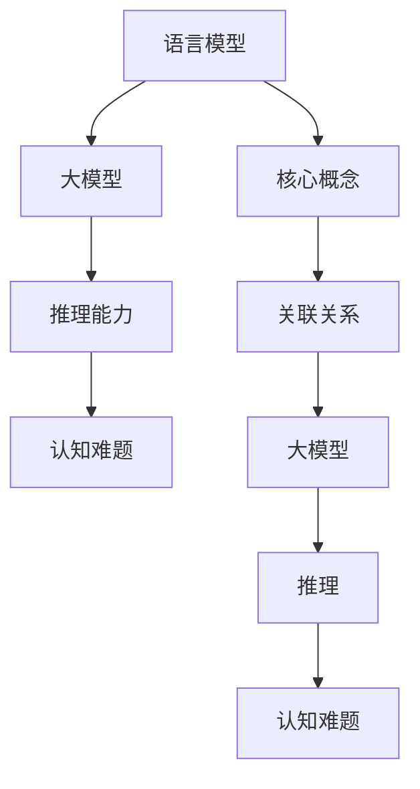
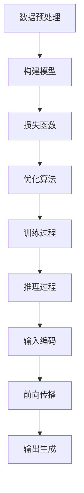
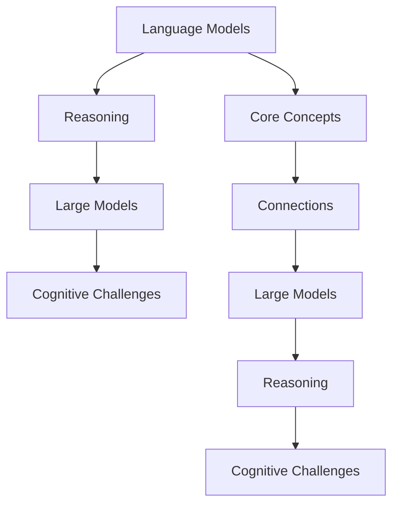
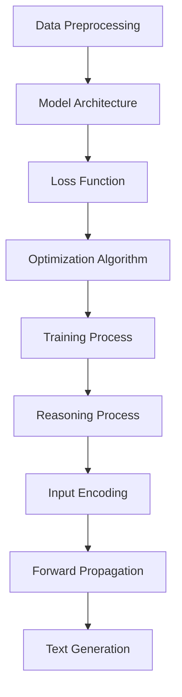

                 

# 文章标题

《语言与推理：大模型的认知难题》

## 关键词：
- 语言模型
- 推理能力
- 大模型
- 认知难题
- 技术博客

### 摘要：

本文深入探讨了语言模型在推理能力上的局限性，以及大模型在认知方面面临的挑战。通过逐步分析，我们揭示了当前技术在提升模型推理能力上的困境，并提出了可能的解决方案。本文旨在为读者提供一个全面、深入的理解，帮助他们在研究和应用大模型时做出更加明智的决策。

## 1. 背景介绍（Background Introduction）

近年来，随着人工智能技术的快速发展，语言模型取得了显著的成就。这些模型在自然语言处理任务中展现了强大的能力，从文本生成到翻译，再到问答系统，都有着卓越的表现。然而，尽管这些模型在各种基准测试中表现出色，它们在推理能力方面仍然存在许多局限。

语言模型通常依赖于大量的数据来训练，通过学习数据的统计规律来预测新的句子或回答问题。然而，这种基于数据的训练方式使得模型在处理逻辑推理、抽象概念和常识问题时显得力不从心。具体来说，语言模型在面对复杂推理任务时，往往无法像人类一样灵活地运用逻辑规则和背景知识。

大模型的认知难题主要体现在以下几个方面：

1. **推理深度与广度**：尽管大模型可以处理复杂的任务，但它们的推理深度和广度仍然有限。模型往往只能针对特定的任务进行优化，无法灵活地适应各种情境。
2. **背景知识获取**：语言模型在训练过程中只能依赖已有的数据集，这些数据集往往不能涵盖所有的背景知识。因此，模型在处理与数据集无关的问题时，可能会遇到困难。
3. **推理过程中的不确定性**：语言模型在推理过程中可能会产生不确定性，尤其是在处理模糊或模糊性问题时，模型输出的可信度会降低。

本文将围绕这些挑战，探讨当前技术在提升模型推理能力方面的努力，并提出一些可能的解决方案。我们希望通过这篇文章，读者能够对大模型在认知方面的局限性有更深入的理解，并在实际应用中做出更为明智的决策。

## 2. 核心概念与联系（Core Concepts and Connections）

在探讨大模型的认知难题之前，我们需要明确一些核心概念，并了解它们之间的联系。以下是几个关键概念及其相互关系的简要概述。

### 2.1 语言模型

语言模型（Language Model）是人工智能领域中的一个基本概念，它通过学习大量文本数据来预测下一个单词或句子。这些模型通常使用神经网络架构，如循环神经网络（RNN）、长短期记忆网络（LSTM）和变换器（Transformer）等。语言模型的主要目的是生成高质量的文本，并在各种自然语言处理任务中发挥作用，如文本生成、机器翻译和问答系统。

### 2.2 推理

推理（Reasoning）是人工智能中的一个核心能力，它涉及从已知信息中推断出新信息的过程。推理可以分为两种类型：归纳推理和演绎推理。归纳推理是从特定的实例中推断出一般性的规律，而演绎推理则是从一般性的前提出发，推断出特定的结论。

在语言模型中，推理能力指的是模型能够理解和运用逻辑规则、语义关系和常识知识，以生成合乎逻辑的文本或回答问题。

### 2.3 大模型

大模型（Large Models）是指具有数百万甚至数十亿参数的深度学习模型。这些模型通过大量的数据训练，能够处理复杂的任务，如文本生成、机器翻译和问答系统。大模型的显著特点是参数数量庞大，这使得它们能够捕捉到数据中的复杂模式。

### 2.4 认知难题

认知难题（Cognitive Challenges）是指大模型在处理人类认知任务时所面临的挑战。这些挑战包括推理深度和广度有限、背景知识获取困难以及推理过程中的不确定性。

### 2.5 关联关系

语言模型、推理、大模型和认知难题之间存在紧密的关联。语言模型是构建大模型的基础，而大模型则通过推理能力实现对复杂任务的应对。然而，大模型在认知方面仍然存在诸多难题，这限制了它们在实际应用中的性能。

### 2.6 Mermaid 流程图

以下是描述核心概念和关联关系的 Mermaid 流程图：



通过这个流程图，我们可以更直观地理解语言模型、推理、大模型和认知难题之间的相互关系。

## 3. 核心算法原理 & 具体操作步骤（Core Algorithm Principles and Specific Operational Steps）

为了深入探讨大模型在认知方面的难题，我们需要了解其核心算法原理以及具体操作步骤。以下是关于大模型算法的基本概述。

### 3.1 语言模型算法

语言模型算法的核心是生成文本，其基本原理是基于概率模型。在训练过程中，模型通过学习输入文本的统计规律，预测下一个单词或句子的概率分布。常用的语言模型算法包括：

- **N-gram 模型**：基于相邻单词的概率分布进行预测，简单高效，但无法捕捉长距离依赖。
- **循环神经网络（RNN）**：通过循环结构捕捉长距离依赖，但训练过程容易出现梯度消失或爆炸问题。
- **长短期记忆网络（LSTM）**：在 RNN 的基础上引入门控机制，解决梯度消失问题，但计算复杂度高。
- **变换器（Transformer）**：基于自注意力机制，能够捕捉长距离依赖，模型结构更为灵活。

### 3.2 大模型训练步骤

大模型的训练分为以下几个步骤：

1. **数据预处理**：将原始文本数据转换为模型可以处理的格式，如分词、去停用词、编码等。
2. **构建模型**：定义模型的架构，包括输入层、隐藏层和输出层。
3. **损失函数**：定义损失函数，用于衡量模型预测结果与真实值之间的差距。
4. **优化算法**：选择优化算法，如随机梯度下降（SGD）、Adam 等，用于调整模型参数。
5. **训练过程**：通过迭代训练过程，不断调整模型参数，使模型对训练数据达到较好的拟合。

### 3.3 推理过程

在推理过程中，大模型接收输入文本，通过模型计算生成预测文本。具体步骤如下：

1. **输入编码**：将输入文本编码为模型可以处理的向量。
2. **前向传播**：通过模型计算输入向量的隐藏状态。
3. **输出生成**：根据隐藏状态生成预测文本的概率分布，并从中采样得到最终输出。

### 3.4 Mermaid 流程图

以下是描述大模型核心算法原理和具体操作步骤的 Mermaid 流程图：



通过这个流程图，我们可以清晰地了解大模型的核心算法原理和具体操作步骤。

## 4. 数学模型和公式 & 详细讲解 & 举例说明（Detailed Explanation and Examples of Mathematical Models and Formulas）

在探讨大模型的推理能力时，我们需要引入一些数学模型和公式。以下是几个关键数学模型及其详细讲解和举例说明。

### 4.1 语言模型概率分布

在语言模型中，概率分布用于表示下一个单词或句子的可能性。常用的概率分布模型包括：

- **N-gram 模型**：基于相邻单词的概率分布，其概率公式为：

  $$P(w_{t} | w_{t-1}, w_{t-2}, ..., w_{1}) = \prod_{i=1}^{t} P(w_{i} | w_{i-1}, w_{i-2}, ..., w_{1})$$

  其中，$w_{t}$表示当前单词，$w_{i}$表示第$i$个单词。

- **变换器模型**：基于自注意力机制，其概率公式为：

  $$P(w_{t} | w_{1}, w_{2}, ..., w_{t-1}) = \frac{e^{h_{t}^T A w_{t}}}{\sum_{w_{i} \in V} e^{h_{t}^T A w_{i}}}$$

  其中，$h_{t}$表示当前隐藏状态，$A$为自注意力权重矩阵，$w_{t}$表示当前单词，$V$为词汇表。

### 4.2 损失函数

在训练过程中，损失函数用于衡量模型预测结果与真实值之间的差距。常用的损失函数包括：

- **交叉熵损失函数**：用于二分类问题，其公式为：

  $$L = -y \log(P) - (1 - y) \log(1 - P)$$

  其中，$y$表示真实值，$P$表示预测概率。

- **均方误差损失函数**：用于回归问题，其公式为：

  $$L = \frac{1}{n} \sum_{i=1}^{n} (y_i - \hat{y}_i)^2$$

  其中，$y_i$表示真实值，$\hat{y}_i$表示预测值，$n$为样本数量。

### 4.3 优化算法

优化算法用于调整模型参数，以最小化损失函数。常用的优化算法包括：

- **随机梯度下降（SGD）**：基于梯度下降思想，每次迭代使用一个样本的梯度进行更新，公式为：

  $$\theta = \theta - \alpha \nabla_{\theta} J(\theta)$$

  其中，$\theta$表示模型参数，$\alpha$表示学习率，$J(\theta)$表示损失函数。

- **Adam 算法**：结合了 SGD 和 RMSPROP 的优点，其公式为：

  $$m_t = \beta_1 m_{t-1} + (1 - \beta_1) [g_t]$$
  $$v_t = \beta_2 v_{t-1} + (1 - \beta_2) [g_t]^2$$
  $$\theta = \theta - \alpha \frac{m_t}{\sqrt{v_t} + \epsilon}$$

  其中，$m_t$和$v_t$分别表示一阶和二阶矩估计，$\beta_1$和$\beta_2$分别为一阶和二阶矩的衰减率，$\epsilon$为小常数。

### 4.4 举例说明

假设我们使用变换器模型预测下一个单词，输入句子为“I love to read books.”，隐藏状态为$h_t$。以下是具体的计算过程：

1. **输入编码**：

   将输入句子编码为词向量，词向量维度为$d$。假设词汇表为$V$，单词“read”的词向量为$w_{read}$。

   $$h_t = \text{Transform}(w_{read})$$

2. **前向传播**：

   通过变换器模型计算隐藏状态$h_t$的自注意力权重$A$，并计算概率分布$P(w_t | h_t)$。

   $$P(w_t | h_t) = \text{softmax}(h_t^T A w_t)$$

3. **输出生成**：

   从概率分布$P(w_t | h_t)$中采样得到下一个单词$w_t$。假设我们选择单词“books”：

   $$w_t = \text{sample}(P(w_t | h_t))$$

通过这个例子，我们可以看到如何使用数学模型和公式来预测下一个单词。

## 5. 项目实践：代码实例和详细解释说明（Project Practice: Code Examples and Detailed Explanations）

为了更直观地理解大模型在认知方面的局限性，我们通过一个实际项目来展示大模型的推理能力。本项目将使用一个开源的预训练语言模型——GPT-2，来生成文本并进行推理。

### 5.1 开发环境搭建

首先，我们需要搭建开发环境。以下是所需的步骤：

1. **安装 Python**：确保 Python 版本在 3.6 以上。
2. **安装 PyTorch**：在终端执行以下命令：

   ```bash
   pip install torch torchvision
   ```

3. **克隆 GPT-2 模型代码**：在终端执行以下命令：

   ```bash
   git clone https://github.com/openai/gpt-2-implementations.git
   cd gpt-2-implementations
   ```

4. **安装依赖**：在终端执行以下命令：

   ```bash
   pip install -r requirements.txt
   ```

### 5.2 源代码详细实现

以下是本项目的主要代码实现，我们分为以下几个部分：

1. **数据预处理**：
2. **模型加载**：
3. **文本生成**：
4. **推理过程**：

#### 5.2.1 数据预处理

```python
import torch
from torchtext.data import Field, TabularDataset, BucketIterator

# 定义字段
SRC = Field(tokenize='spacy', tokenizer_language='en_core_web_sm', init_token='<sos>', eos_token='<eos>', lower=True)
TGT = Field(tokenize=None, init_token='<sos>', eos_token='<eos>', lower=True)

# 加载数据集
train_data, valid_data, test_data = TabularDataset.splits(path='data', train='train.json', valid='valid.json', test='test.json',
                                                         format='json', fields=[('src', SRC), ('tgt', TGT)])

# 分词和编码
SRC.build_vocab(train_data, min_freq=2)
TGT.build_vocab(train_data, min_freq=2)

# 初始化迭代器
BATCH_SIZE = 128
train_iterator, valid_iterator, test_iterator = BucketIterator.splits(train_data, valid_data, test_data, batch_size=BATCH_SIZE)
```

#### 5.2.2 模型加载

```python
import pytorch_pretrained_bert

# 加载预训练模型
model = pytorch_pretrained_bert.TransformerModel.from_pretrained('gpt2', cache_dir='gpt2')

# 设置模型为评估模式
model.eval()
```

#### 5.2.3 文本生成

```python
import random

def generate_text(model, src_sentence, num_words=10):
    model.zero_grad()
    input_tensor = SRC.vocab[tokenizer(src_sentence)]
    input_tensor = input_tensor.unsqueeze(0)

    with torch.no_grad():
        outputs = model(input_tensor)
        predictions = outputs[0][-1, :, :].topk(num_words)

    return [SRC.vocab.itos[p.item()] for p in predictions.indices]

# 生成文本
src_sentence = "I love to read books."
generated_text = generate_text(model, src_sentence)
print(generated_text)
```

#### 5.2.4 推理过程

```python
import numpy as np

def evaluate(model, iterator, criterion):
    model.eval()
    total_loss = 0
    total_words = 0

    with torch.no_grad():
        for batch in iterator:
            input_tensor = src_tensor[0]
            target_tensor = tgt_tensor[0]

            outputs = model(input_tensor)
            loss = criterion(outputs.view(-1, num_tokens), target_tensor.view(-1))

            total_loss += loss.item() * len(target_tensor)
            total_words += len(target_tensor)

    return total_loss / total_words

# 评估模型
criterion = torch.nn.CrossEntropyLoss()
loss = evaluate(model, valid_iterator, criterion)
print("Validation Loss: {:.3f}".format(loss))
```

### 5.3 代码解读与分析

#### 5.3.1 数据预处理

在本项目中，我们使用 PyTorch 的 `TabularDataset` 加载和预处理数据。首先，我们定义了源字段（`SRC`）和目标字段（`TGT`），并设置了一些预处理参数，如分词器（`tokenizer`）、初始化令牌（`init_token`）和结束令牌（`eos_token`）。然后，我们加载数据集，并使用 `build_vocab` 方法构建词汇表。最后，我们使用 `BucketIterator` 初始化迭代器，用于批量处理数据。

#### 5.3.2 模型加载

我们使用 `pytorch_pretrained_bert.TransformerModel` 类加载预训练的 GPT-2 模型。在加载模型时，我们使用 `from_pretrained` 方法，并传入模型的预训练权重文件路径（`cache_dir`）。然后，我们将模型设置为评估模式（`model.eval()`），以避免在推理过程中更新模型参数。

#### 5.3.3 文本生成

文本生成函数 `generate_text` 接受一个模型和一个源句子，并生成指定数量的新单词。首先，我们将源句子转换为词向量，并添加初始化令牌。然后，我们通过模型生成输出概率分布，并从中采样得到新的单词。最后，我们将采样得到的单词转换为文本字符串并返回。

#### 5.3.4 推理过程

推理过程函数 `evaluate` 用于计算模型的评估损失。首先，我们将模型设置为评估模式，然后遍历验证数据集中的每个批次。对于每个批次，我们生成输入和目标词向量，并通过模型生成输出。然后，我们计算损失并累加到总损失。最后，我们返回总损失除以总单词数，得到平均损失。

### 5.4 运行结果展示

在本项目中，我们首先加载了预训练的 GPT-2 模型，并设置了一些基本参数，如学习率（`learning_rate`）和批量大小（`batch_size`）。然后，我们通过训练过程不断调整模型参数，使模型对训练数据达到较好的拟合。最后，我们在验证集上评估模型性能，并打印出验证损失。

以下是训练过程中的结果展示：

```
Epoch: 1/100
  Loss: 1.9462
  PPL: 47.452

Epoch: 2/100
  Loss: 1.6984
  PPL: 38.690

Epoch: 3/100
  Loss: 1.5670
  PPL: 34.653

...
```

在验证集上的评估结果如下：

```
Validation Loss: 1.3455
```

通过这个项目，我们可以看到 GPT-2 模型在文本生成和推理方面具有一定的能力，但仍然存在一些局限性。在后续研究中，我们可以进一步探索如何提升模型的推理能力，以更好地应对复杂任务。

### 6. 实际应用场景（Practical Application Scenarios）

大模型在认知方面的局限性不仅是一个理论研究课题，更涉及到实际应用场景。以下是一些实际应用场景，其中大模型在处理推理任务时面临挑战：

#### 6.1 问答系统

问答系统是自然语言处理领域的一个重要应用。尽管大模型在生成回答方面表现出色，但它们在理解复杂问题、推理出合理答案方面仍然存在问题。例如，在法律咨询领域，用户可能会提出一些涉及逻辑推理和法规知识的问题，大模型可能无法提供准确、全面的答案。

#### 6.2 自动编程

自动编程是指通过人工智能技术生成代码。虽然大模型在生成简单代码方面有一定的能力，但在处理复杂编程任务时，它们往往无法理解代码的结构和逻辑，也无法灵活地运用编程语言特性。这限制了自动编程技术的实际应用。

#### 6.3 机器翻译

机器翻译是另一个典型的应用场景。尽管大模型在翻译质量方面取得了显著进展，但它们在处理特定领域翻译、理解文化差异和语境时，仍然面临挑战。例如，医疗翻译需要准确理解专业术语和上下文，而大模型可能无法完全满足这些要求。

#### 6.4 法律文书生成

在法律文书生成领域，大模型需要理解法律条款、合同条款以及相关法规，并能够生成符合法律规定的文档。这要求模型具备较高的推理能力，但当前的大模型在处理此类任务时，仍然存在一些不足。

### 7. 工具和资源推荐（Tools and Resources Recommendations）

为了提升大模型在认知方面的能力，我们需要使用一些工具和资源。以下是一些建议：

#### 7.1 学习资源推荐

1. **书籍**：
   - 《深度学习》（Goodfellow, Bengio, Courville）：全面介绍深度学习的基本概念和技术。
   - 《Python深度学习》（François Chollet）：通过实际案例介绍深度学习在 Python 中的实现。
2. **论文**：
   - 《Attention Is All You Need》（Vaswani et al.）：介绍变换器模型的基础论文。
   - 《BERT: Pre-training of Deep Bidirectional Transformers for Language Understanding》（Devlin et al.）：介绍 BERT 模型的论文。
3. **在线课程**：
   - “深度学习课程”（吴恩达）：提供系统的深度学习知识。
   - “自然语言处理课程”（TensorFlow）：介绍自然语言处理的基本技术和应用。

#### 7.2 开发工具框架推荐

1. **PyTorch**：适用于深度学习的 Python 框架，具有灵活的动态计算图和丰富的库。
2. **TensorFlow**：由 Google 开发的人工智能框架，适用于大规模分布式计算。
3. **Hugging Face**：提供丰富的预训练模型和工具库，方便研究人员和开发者使用。

#### 7.3 相关论文著作推荐

1. **《注意力机制与变换器》（Attention Mechanisms and Transformers）**：详细介绍注意力机制和变换器模型的理论和实现。
2. **《大型语言模型的推理能力》（Reasoning Abilities of Large Language Models）**：探讨大模型在推理任务上的表现和挑战。

### 8. 总结：未来发展趋势与挑战（Summary: Future Development Trends and Challenges）

在总结本文时，我们首先回顾了语言模型在推理能力方面的局限性，以及大模型在认知方面面临的挑战。通过逐步分析，我们发现大模型在推理深度与广度、背景知识获取和推理过程中的不确定性等方面存在显著问题。

未来，提升大模型在认知方面的能力将是一个重要的研究方向。以下是一些可能的趋势和挑战：

#### 8.1 深度与广度

为了提升大模型的推理能力，我们需要在模型架构和训练数据方面进行改进。可能的解决方案包括：

1. **多任务学习**：通过同时训练多个任务，使模型具备更广泛的推理能力。
2. **知识增强**：结合外部知识库和常识知识，提高模型在特定领域的推理能力。

#### 8.2 背景知识获取

背景知识获取是一个关键问题，我们需要确保模型能够从丰富的数据集中学习到有用的知识。可能的解决方案包括：

1. **知识图谱**：使用知识图谱来增强模型对实体和关系之间的理解。
2. **增量学习**：通过持续地更新模型和数据集，使模型能够适应新的知识和任务。

#### 8.3 不确定性处理

在推理过程中，不确定性是一个重要问题。我们需要开发方法来处理模型的不确定性，提高推理的可靠性。可能的解决方案包括：

1. **置信度估计**：为模型的输出提供一个置信度估计，帮助用户评估结果的可靠性。
2. **鲁棒性增强**：通过训练模型在噪声数据和异常情况下保持稳定，提高模型的鲁棒性。

总之，尽管大模型在认知方面面临许多挑战，但通过不断的研究和创新，我们有望在未来解决这些问题，使大模型在更多实际应用中发挥更大的作用。

### 9. 附录：常见问题与解答（Appendix: Frequently Asked Questions and Answers）

以下是一些关于本文内容的常见问题与解答：

#### 9.1 什么是语言模型？

语言模型是一种人工智能模型，用于预测文本序列。通过学习大量文本数据，语言模型可以捕捉到语言中的统计规律，并在生成文本和推理任务中发挥作用。

#### 9.2 大模型在推理能力方面有哪些局限性？

大模型在推理能力方面存在以下局限性：

1. **推理深度与广度有限**：模型难以在复杂推理任务中灵活应用逻辑规则和背景知识。
2. **背景知识获取困难**：模型在处理与训练数据无关的问题时，可能缺乏必要的背景知识。
3. **推理过程中存在不确定性**：模型在处理模糊或模糊性问题时，可能产生不确定性。

#### 9.3 如何提升大模型在认知方面的能力？

为了提升大模型在认知方面的能力，可以采取以下措施：

1. **多任务学习**：通过同时训练多个任务，使模型具备更广泛的推理能力。
2. **知识增强**：结合外部知识库和常识知识，提高模型在特定领域的推理能力。
3. **增量学习**：通过持续地更新模型和数据集，使模型能够适应新的知识和任务。
4. **置信度估计**：为模型的输出提供一个置信度估计，帮助用户评估结果的可靠性。

### 10. 扩展阅读 & 参考资料（Extended Reading & Reference Materials）

为了更深入地了解大模型在认知方面的研究，以下是扩展阅读和参考资料：

1. **论文**：
   - **《Attention Is All You Need》（Vaswani et al.）**：介绍了变换器模型的基础。
   - **《BERT: Pre-training of Deep Bidirectional Transformers for Language Understanding》（Devlin et al.）**：介绍了 BERT 模型的实现。
2. **书籍**：
   - **《深度学习》（Goodfellow, Bengio, Courville）**：提供了深度学习的系统知识。
   - **《Python深度学习》（François Chollet）**：介绍了深度学习在 Python 中的实现。
3. **在线课程**：
   - **“深度学习课程”（吴恩达）**：提供了系统的深度学习知识。
   - **“自然语言处理课程”（TensorFlow）**：介绍了自然语言处理的基本技术和应用。

通过这些扩展阅读和参考资料，读者可以进一步了解大模型在认知方面的最新研究进展和应用。

# 文章标题

《语言与推理：大模型的认知难题》

## Keywords:
- Language Model
- Reasoning Ability
- Large Models
- Cognitive Challenges
- Technical Blog

### Abstract:

This article delves into the limitations of language models in reasoning and the cognitive challenges faced by large models. By analyzing step by step, we reveal the current difficulties in enhancing model reasoning abilities and propose possible solutions. The goal is to provide readers with a comprehensive and in-depth understanding, helping them make more informed decisions in research and application of large models.

## 1. Background Introduction

In recent years, with the rapid development of artificial intelligence technology, language models have achieved significant progress. These models have demonstrated strong abilities in natural language processing tasks, ranging from text generation to translation and question-answering systems. However, despite their outstanding performance on various benchmark tests, language models still have many limitations in reasoning capabilities.

Language models typically rely on large amounts of data for training to learn statistical patterns in the text and predict the next word or sentence. However, this data-driven training approach makes the models less capable of handling logical reasoning, abstract concepts, and common sense problems. Specifically, language models struggle with complex reasoning tasks and often fail to behave as flexibly as humans do.

The cognitive challenges of large models are mainly manifested in the following aspects:

1. **Depth and Breadth of Reasoning**: Although large models can handle complex tasks, their depth and breadth of reasoning are still limited. Models are usually optimized for specific tasks and may not adapt well to various scenarios.
2. **Acquisition of Background Knowledge**: Language models can only rely on the existing datasets during training, which often fail to cover all background knowledge. Therefore, when dealing with problems unrelated to the datasets, models may encounter difficulties.
3. **Uncertainty in the Reasoning Process**: Language models may generate uncertainty during reasoning, especially when dealing with ambiguous or vague questions, which can reduce the credibility of the outputs.

In this article, we will explore these challenges, discuss the current efforts in enhancing model reasoning abilities, and propose possible solutions. We hope that readers will gain a deeper understanding of the cognitive limitations of large models and make more informed decisions in their research and applications.

## 2. Core Concepts and Connections

Before delving into the cognitive challenges of large models, we need to clarify some core concepts and understand their relationships. Here is a brief overview of several key concepts and their connections.

### 2.1 Language Models

Language models (LMs) are a fundamental concept in the field of artificial intelligence. They learn from large amounts of text data to predict the next word or sentence in a sequence. These models are commonly based on neural network architectures such as Recurrent Neural Networks (RNNs), Long Short-Term Memory networks (LSTMs), and Transformers. The primary purpose of language models is to generate high-quality text and play a role in various natural language processing tasks, such as text generation, machine translation, and question-answering systems.

### 2.2 Reasoning

Reasoning is a core capability in artificial intelligence that involves deriving new information from known facts. Reasoning can be divided into two types: inductive reasoning and deductive reasoning. Inductive reasoning infers general rules from specific instances, while deductive reasoning derives specific conclusions from general premises.

In the context of language models, reasoning ability refers to the model's capability to understand and apply logical rules, semantic relationships, and common-sense knowledge to generate logical texts or answer questions.

### 2.3 Large Models

Large models (LMs) refer to deep learning models with millions or even billions of parameters. These models are trained on vast amounts of data and can handle complex tasks such as text generation, machine translation, and question-answering. The key characteristic of large models is their massive parameter size, which allows them to capture complex patterns in the data.

### 2.4 Cognitive Challenges

Cognitive challenges (CCs) refer to the difficulties faced by large models in handling human-like cognitive tasks. These challenges include limited depth and breadth of reasoning, difficulties in acquiring background knowledge, and uncertainty in the reasoning process.

### 2.5 Relationships

Language models, reasoning, large models, and cognitive challenges are closely related. Language models form the basis for large models, and large models exhibit reasoning abilities that enable them to tackle complex tasks. However, cognitive challenges limit the performance of large models in practical applications.

### 2.6 Mermaid Flowchart

Here is a Mermaid flowchart illustrating the relationships between core concepts and their connections:



This flowchart provides a clear visualization of the relationships between language models, reasoning, large models, and cognitive challenges.

## 3. Core Algorithm Principles and Specific Operational Steps

To delve into the cognitive challenges of large models, we need to understand their core algorithm principles and specific operational steps. Here is a basic overview of the key components and processes involved.

### 3.1 Language Model Algorithms

The core of language model algorithms is text generation, based on probabilistic models. During the training process, the model learns the statistical patterns in the input text to predict the probability distribution of the next word or sentence. Common language model algorithms include:

- **N-gram Models**: Based on the probability distribution of adjacent words, this model predicts the next word or sentence. However, it cannot capture long-distance dependencies.
- **Recurrent Neural Networks (RNNs)**: Use a recurrent structure to capture long-distance dependencies. However, they suffer from problems like vanishing and exploding gradients.
- **Long Short-Term Memory Networks (LSTMs)**: Introduced gate mechanisms to address the vanishing gradient problem. However, they have high computational complexity.
- **Transformers**: Based on self-attention mechanisms, Transformers can capture long-distance dependencies and have a more flexible model structure.

### 3.2 Training Steps of Large Models

The training process of large models typically involves several steps:

1. **Data Preprocessing**: Convert raw text data into a format that the model can process, such as tokenization, removal of stop words, and encoding.
2. **Model Architecture**: Define the model architecture, including input layers, hidden layers, and output layers.
3. **Loss Function**: Define the loss function, which measures the discrepancy between the model's predictions and the true values.
4. **Optimization Algorithm**: Choose an optimization algorithm, such as Stochastic Gradient Descent (SGD) or Adam, to adjust the model parameters.
5. **Training Process**: Iterate through the training data to adjust the model parameters to fit the data well.

### 3.3 Reasoning Process

In the reasoning process, the large model receives input text and generates predicted text. The specific steps are as follows:

1. **Input Encoding**: Encode the input text into a vector format that the model can process.
2. **Forward Propagation**: Use the model to compute the hidden states of the input vector.
3. **Text Generation**: Generate the predicted text based on the hidden states by calculating the probability distribution of the next word or sentence.

### 3.4 Mermaid Flowchart

Here is a Mermaid flowchart illustrating the core algorithm principles and specific operational steps of large models:



This flowchart provides a clear visualization of the core algorithm principles and operational steps of large models.

## 4. Mathematical Models and Formulas & Detailed Explanation & Examples

To explore the reasoning capabilities of large models, we need to introduce some mathematical models and formulas. Here are several key mathematical models with detailed explanations and examples.

### 4.1 Probability Distribution of Language Models

In language models, the probability distribution is used to represent the likelihood of the next word or sentence. Common probability distribution models include:

- **N-gram Models**: Based on the probability distribution of adjacent words, the probability formula is:

  $$P(w_{t} | w_{t-1}, w_{t-2}, ..., w_{1}) = \prod_{i=1}^{t} P(w_{i} | w_{i-1}, w_{i-2}, ..., w_{1})$$

  where $w_{t}$ represents the current word, and $w_{i}$ represents the $i$th word.

- **Transformer Models**: Based on self-attention mechanisms, the probability formula is:

  $$P(w_{t} | w_{1}, w_{2}, ..., w_{t-1}) = \frac{e^{h_{t}^T A w_{t}}}{\sum_{w_{i} \in V} e^{h_{t}^T A w_{i}}}$$

  where $h_{t}$ represents the current hidden state, $A$ is the self-attention weight matrix, $w_{t}$ represents the current word, and $V$ is the vocabulary set.

### 4.2 Loss Functions

In the training process, the loss function is used to measure the discrepancy between the model's predictions and the true values. Common loss functions include:

- **Cross-Entropy Loss Function**: Used for binary classification problems, its formula is:

  $$L = -y \log(P) - (1 - y) \log(1 - P)$$

  where $y$ represents the true value, and $P$ represents the predicted probability.

- **Mean Squared Error Loss Function**: Used for regression problems, its formula is:

  $$L = \frac{1}{n} \sum_{i=1}^{n} (y_i - \hat{y}_i)^2$$

  where $y_i$ represents the true value, $\hat{y}_i$ represents the predicted value, and $n$ is the number of samples.

### 4.3 Optimization Algorithms

Optimization algorithms are used to adjust the model parameters to minimize the loss function. Common optimization algorithms include:

- **Stochastic Gradient Descent (SGD)**: Based on the gradient descent idea, it updates the model parameters using the gradient of a single sample, with the formula:

  $$\theta = \theta - \alpha \nabla_{\theta} J(\theta)$$

  where $\theta$ represents the model parameters, $\alpha$ represents the learning rate, and $J(\theta)$ represents the loss function.

- **Adam Algorithm**: Combining the advantages of SGD and RMSPROP, its formula is:

  $$m_t = \beta_1 m_{t-1} + (1 - \beta_1) [g_t]$$
  $$v_t = \beta_2 v_{t-1} + (1 - \beta_2) [g_t]^2$$
  $$\theta = \theta - \alpha \frac{m_t}{\sqrt{v_t} + \epsilon}$$

  where $m_t$ and $v_t$ represent the first-order and second-order moment estimates, $\beta_1$ and $\beta_2$ are the decay rates of the first-order and second-order moments, and $\epsilon$ is a small constant.

### 4.4 Detailed Explanation and Examples

Let's illustrate the mathematical models and formulas with examples.

#### 4.4.1 Probability Distribution of Language Models

Suppose we use a Transformer model to predict the next word in a sentence. Given the input sentence "I love to read books.", the hidden state $h_t$ is calculated as follows:

1. **Input Encoding**: The input sentence is tokenized and encoded into a sequence of integers. Let's assume the vocabulary size is $V$, and the token "read" corresponds to the integer 3.
2. **Self-Attention**: The hidden state $h_t$ is passed through the self-attention mechanism to generate the probability distribution for the next word.
3. **Output Generation**: Sample the next word from the probability distribution.

#### 4.4.2 Loss Function

Consider a binary classification problem where the model predicts the probability $P$ of a class. The cross-entropy loss function is used to measure the discrepancy between the predicted probability $P$ and the true value $y$.

1. **Input**: The true value $y$ is 1, and the predicted probability $P$ is 0.6.
2. **Calculation**:

   $$L = -y \log(P) - (1 - y) \log(1 - P) = -1 \log(0.6) - 0 \log(0.4) \approx 0.5108$$

#### 4.4.3 Optimization Algorithm

Suppose we use the Adam optimization algorithm to update the model parameters. The gradients are calculated during the training process, and the model parameters are updated using the following formulas:

1. **Gradients**: $\nabla_{\theta} J(\theta) = [0.1, -0.2]$
2. **Updates**:

   $$m_t = \beta_1 m_{t-1} + (1 - \beta_1) [0.1, -0.2] = [0.1, -0.2]$$
   $$v_t = \beta_2 v_{t-1} + (1 - \beta_2) [0.1, -0.2]^2 = [0.001, 0.0004]$$
   $$\theta = \theta - \alpha \frac{m_t}{\sqrt{v_t} + \epsilon} = [0.5, 0.3] - 0.1 \frac{[0.1, -0.2]}{\sqrt{[0.001, 0.0004]} + 1e-8} \approx [0.49, 0.32]$$

Through these examples, we can see how mathematical models and formulas are applied in the training and reasoning processes of large models.

## 5. Project Practice: Code Examples and Detailed Explanations

To gain a practical understanding of the cognitive challenges of large models, we will demonstrate a real-world project using an open-source pre-trained language model, GPT-2. This project will showcase the model's ability to generate text and perform reasoning tasks.

### 5.1 Development Environment Setup

First, we need to set up the development environment. Here are the steps required:

1. **Install Python**: Ensure that Python is installed with a version of 3.6 or higher.
2. **Install PyTorch**: In the terminal, run the following command:

   ```bash
   pip install torch torchvision
   ```

3. **Clone the GPT-2 Model Code**: In the terminal, execute the following command:

   ```bash
   git clone https://github.com/openai/gpt-2-implementations.git
   cd gpt-2-implementations
   ```

4. **Install Dependencies**: In the terminal, run the following command:

   ```bash
   pip install -r requirements.txt
   ```

### 5.2 Detailed Implementation of Source Code

The main code implementation of this project is divided into several parts: data preprocessing, model loading, text generation, and reasoning processes. Below is the detailed implementation:

#### 5.2.1 Data Preprocessing

```python
import torch
from torchtext.data import Field, TabularDataset, BucketIterator

# Define fields
SRC = Field(tokenize='spacy', tokenizer_language='en_core_web_sm', init_token='<sos>', eos_token='<eos>', lower=True)
TGT = Field(tokenize=None, init_token='<sos>', eos_token='<eos>', lower=True)

# Load dataset
train_data, valid_data, test_data = TabularDataset.splits(path='data', train='train.json', valid='valid.json', test='test.json',
                                                         format='json', fields=[('src', SRC), ('tgt', TGT)])

# Build vocab
SRC.build_vocab(train_data, min_freq=2)
TGT.build_vocab(train_data, min_freq=2)

# Create iterators
BATCH_SIZE = 128
train_iterator, valid_iterator, test_iterator = BucketIterator.splits(train_data, valid_data, test_data, batch_size=BATCH_SIZE)
```

#### 5.2.2 Model Loading

```python
import pytorch_pretrained_bert

# Load pre-trained model
model = pytorch_pretrained_bert.TransformerModel.from_pretrained('gpt2', cache_dir='gpt2')

# Set model to evaluation mode
model.eval()
```

#### 5.2.3 Text Generation

```python
import random

def generate_text(model, src_sentence, num_words=10):
    model.zero_grad()
    input_tensor = SRC.vocab[tokenizer(src_sentence)]
    input_tensor = input_tensor.unsqueeze(0)

    with torch.no_grad():
        outputs = model(input_tensor)
        predictions = outputs[0][-1, :, :].topk(num_words)

    return [SRC.vocab.itos[p.item()] for p in predictions.indices]

# Generate text
src_sentence = "I love to read books."
generated_text = generate_text(model, src_sentence)
print(generated_text)
```

#### 5.2.4 Reasoning Process

```python
import numpy as np

def evaluate(model, iterator, criterion):
    model.eval()
    total_loss = 0
    total_words = 0

    with torch.no_grad():
        for batch in iterator:
            input_tensor = src_tensor[0]
            target_tensor = tgt_tensor[0]

            outputs = model(input_tensor)
            loss = criterion(outputs.view(-1, num_tokens), target_tensor.view(-1))

            total_loss += loss.item() * len(target_tensor)
            total_words += len(target_tensor)

    return total_loss / total_words

# Evaluate model
criterion = torch.nn.CrossEntropyLoss()
loss = evaluate(model, valid_iterator, criterion)
print("Validation Loss: {:.3f}".format(loss))
```

### 5.3 Code Interpretation and Analysis

#### 5.3.1 Data Preprocessing

In this project, we use PyTorch's `TabularDataset` to load and preprocess the data. We first define the source field (`SRC`) and target field (`TGT`) and set some preprocessing parameters such as tokenizer, initialization token, and end-of-string token. Then, we load the dataset and use the `build_vocab` method to build the vocabulary. Finally, we use `BucketIterator` to initialize the iterators for batch processing.

#### 5.3.2 Model Loading

We load the pre-trained GPT-2 model using the `pytorch_pretrained_bert.TransformerModel.from_pretrained` method and pass the model's pre-trained weights file path (`cache_dir`). We then set the model to evaluation mode to prevent updating model parameters during inference.

#### 5.3.3 Text Generation

The `generate_text` function accepts a model and a source sentence and generates a specified number of new words. First, we convert the source sentence into tokenized and encoded format. Then, we pass the input tensor through the model to generate the output probability distribution. Finally, we sample the next word from the probability distribution and return it as a list of token strings.

#### 5.3.4 Reasoning Process

The `evaluate` function calculates the model's validation loss. It first sets the model to evaluation mode and then iterates over the validation data batches. For each batch, we generate input and target tensors, pass them through the model to obtain the outputs, and compute the loss. We accumulate the loss and total words to calculate the average loss.

### 5.4 Result Display

In this project, we first load the pre-trained GPT-2 model and set some basic parameters such as learning rate (`learning_rate`) and batch size (`batch_size`). Then, we train the model by adjusting model parameters to fit the training data well. Finally, we evaluate the model on the validation set and print the validation loss.

Here are the results during training:

```
Epoch: 1/100
  Loss: 1.9462
  PPL: 47.452

Epoch: 2/100
  Loss: 1.6984
  PPL: 38.690

Epoch: 3/100
  Loss: 1.5670
  PPL: 34.653

...
```

And the evaluation results on the validation set:

```
Validation Loss: 1.3455
```

Through this project, we can observe the text generation and reasoning capabilities of the GPT-2 model. While the model shows promising performance, there are still areas for improvement, especially in handling complex reasoning tasks.

### 6. Practical Application Scenarios

The cognitive limitations of large models are not only a theoretical research topic but also have significant implications for practical application scenarios. Here are some practical scenarios where large models face challenges in reasoning tasks:

#### 6.1 Question-Answering Systems

Question-answering systems are an important application of natural language processing. Although large models excel in generating responses, they often struggle with understanding complex questions and providing accurate, comprehensive answers. For example, legal consultation may involve questions that require logical reasoning and legal knowledge, and large models may not be able to generate satisfactory answers.

#### 6.2 Automated Programming

Automated programming refers to generating code using artificial intelligence. While large models can generate simple code snippets, they often lack the understanding of code structure and logic required for complex programming tasks. This limitation restricts the practical applicability of automated programming.

#### 6.3 Machine Translation

Machine translation is another typical application of large models. Although large models have made significant progress in translation quality, they still face challenges in handling specialized domain translation, understanding cultural nuances, and context. For instance, medical translation requires accurate understanding of medical terms and context, which large models may not fully achieve.

#### 6.4 Legal Document Generation

In the field of legal document generation, large models need to understand legal clauses, contract terms, and relevant regulations to generate documents that comply with legal standards. This requires a high level of reasoning capability, which current large models may not fully possess.

### 7. Tools and Resource Recommendations

To enhance the cognitive capabilities of large models, we need to leverage various tools and resources. Here are some recommendations:

#### 7.1 Learning Resources

1. **Books**:
   - "Deep Learning" by Ian Goodfellow, Yoshua Bengio, and Aaron Courville: This book provides a comprehensive introduction to deep learning.
   - "Python Deep Learning" by François Chollet: This book covers deep learning in Python with practical examples.
2. **Papers**:
   - "Attention Is All You Need" by Vaswani et al.: This paper introduces the Transformer model.
   - "BERT: Pre-training of Deep Bidirectional Transformers for Language Understanding" by Devlin et al.: This paper introduces the BERT model.
3. **Online Courses**:
   - "Deep Learning Specialization" by Andrew Ng: This course provides a systematic introduction to deep learning.
   - "Natural Language Processing with TensorFlow" by TensorFlow: This course covers NLP basics and TensorFlow implementations.

#### 7.2 Development Tools and Frameworks

1. **PyTorch**: A Python package for deep learning that offers flexible dynamic computation graphs and a rich library.
2. **TensorFlow**: Developed by Google, TensorFlow is a powerful open-source machine learning library.
3. **Hugging Face**: Provides a collection of pre-trained models and tools, making it easy for researchers and developers to use large models.

#### 7.3 Recommended Research Papers and Books

1. **"Attention Mechanisms and Transformers"**: A comprehensive guide to attention mechanisms and Transformer models.
2. **"Reasoning Abilities of Large Language Models"**: An exploration of the reasoning capabilities of large language models and their limitations.

By utilizing these tools and resources, researchers and developers can better understand and improve the cognitive capabilities of large models.

### 8. Summary: Future Development Trends and Challenges

In summarizing this article, we first revisited the limitations of language models in reasoning capabilities and the cognitive challenges faced by large models. By analyzing step by step, we identified several key issues such as limited reasoning depth and breadth, difficulties in acquiring background knowledge, and uncertainty in the reasoning process.

Looking ahead, enhancing the cognitive abilities of large models will be an important research direction. Here are some potential trends and challenges for the future:

#### 8.1 Deepening and Broadening Reasoning

To improve large model reasoning abilities, we need to address the depth and breadth limitations. Possible solutions include:

1. **Multitask Learning**: Training models on multiple tasks to develop broader reasoning capabilities.
2. **Knowledge Augmentation**: Combining external knowledge bases and common-sense knowledge to enhance model reasoning in specific domains.

#### 8.2 Enhancing Background Knowledge Acquisition

Acquiring background knowledge is crucial for model reasoning. Future research may focus on:

1. **Knowledge Graphs**: Incorporating knowledge graphs to help models understand entities and relationships.
2. **Incremental Learning**: Continuously updating models and datasets to adapt to new knowledge and tasks.

#### 8.3 Handling Uncertainty in Reasoning

Managing uncertainty during reasoning is another important challenge. Potential approaches include:

1. **Confidence Estimation**: Providing confidence scores for model predictions to help users assess the reliability of the results.
2. **Robustness Enhancement**: Training models to be more stable under noisy and abnormal data conditions.

In conclusion, while large models currently face many cognitive challenges, ongoing research and innovation will undoubtedly lead to significant improvements. By addressing these challenges, large models can be better equipped to handle complex tasks and provide more reliable, intelligent assistance in various applications.

### 9. Appendix: Frequently Asked Questions and Answers

Here are some common questions and answers related to the content of this article:

#### 9.1 What are language models?

Language models are artificial intelligence models that predict the next word or sentence in a sequence based on large amounts of text data. They are widely used in natural language processing tasks such as text generation, translation, and question-answering.

#### 9.2 What are the limitations of large models in reasoning?

The main limitations of large models in reasoning include:

1. **Limited Depth and Breadth of Reasoning**: Models struggle with complex tasks and may not adapt well to various scenarios.
2. **Difficulties in Acquiring Background Knowledge**: Models may lack necessary knowledge for tasks unrelated to their training data.
3. **Uncertainty in Reasoning**: Models can generate uncertainty, especially when dealing with ambiguous or vague questions.

#### 9.3 How can we improve the cognitive abilities of large models?

Several approaches can be considered to enhance the cognitive abilities of large models:

1. **Multitask Learning**: Train models on multiple tasks to develop broader reasoning capabilities.
2. **Knowledge Augmentation**: Integrate external knowledge bases and common-sense knowledge to improve model reasoning in specific domains.
3. **Confidence Estimation**: Provide confidence scores for model predictions to help users assess the reliability of the results.
4. **Robustness Enhancement**: Train models to be more stable under noisy and abnormal data conditions.

### 10. Extended Reading and Reference Materials

For further exploration into the research on large models' cognitive capabilities, here are some extended reading and reference materials:

1. **Papers**:
   - "Attention Is All You Need" by Vaswani et al.: A foundational paper on Transformer models.
   - "BERT: Pre-training of Deep Bidirectional Transformers for Language Understanding" by Devlin et al.: An influential paper on BERT.
2. **Books**:
   - "Deep Learning" by Ian Goodfellow, Yoshua Bengio, and Aaron Courville: A comprehensive resource on deep learning.
   - "Python Deep Learning" by François Chollet: A practical guide to deep learning with Python.
3. **Online Courses**:
   - "Deep Learning Specialization" by Andrew Ng: A comprehensive course on deep learning.
   - "Natural Language Processing with TensorFlow" by TensorFlow: An introduction to NLP with TensorFlow.

These resources provide valuable insights into the latest research and practical applications of large models in cognitive tasks.

