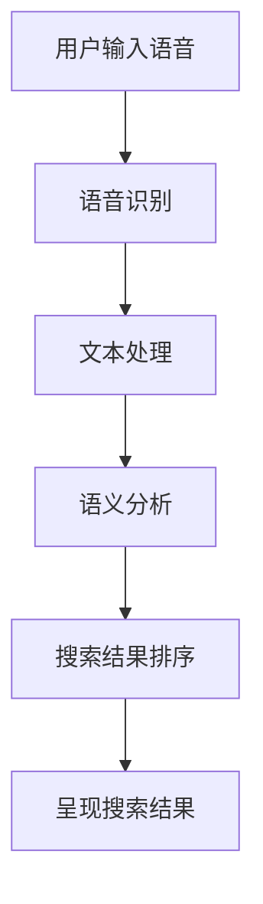

                 

### 文章标题

**语音搜索技术在电商领域的应用：挑战与机遇**

关键词：语音搜索、电商、人工智能、语音识别、用户体验

摘要：随着智能手机和智能音箱的普及，语音搜索已经成为用户获取信息、执行任务的重要方式。在电商领域，语音搜索技术的应用为商家提供了新的营销手段和用户体验优化机会。本文将探讨语音搜索技术在电商领域的应用现状，面临的挑战，以及未来的发展机遇。

### 背景介绍（Background Introduction）

#### 1. 语音搜索的定义与兴起

语音搜索是一种通过语音输入来搜索信息的技术。用户可以通过语音命令查询搜索引擎，获取相关信息，如产品信息、购物指南、天气预报等。语音搜索的兴起得益于语音识别技术的进步和用户对便捷搜索方式的渴求。

#### 2. 语音搜索在电商领域的应用

在电商领域，语音搜索的应用主要体现在以下几个方面：

- **用户搜索体验优化**：语音搜索可以提供更加自然和便捷的搜索方式，减少用户在输入关键词时的繁琐操作。

- **语音助手集成**：电商平台可以通过集成语音助手，为用户提供语音购物助理服务，帮助用户快速找到所需产品。

- **个性化推荐**：通过分析用户语音输入的历史和行为，电商平台可以实现更精准的个性化推荐。

- **语音导购**：商家可以利用语音搜索技术为用户提供语音导购服务，提升用户购买体验。

### 核心概念与联系（Core Concepts and Connections）

#### 1. 语音识别技术

语音识别技术是语音搜索的基础，它将用户的语音输入转换为文本。语音识别技术的核心在于模型训练和语音信号的预处理。模型训练包括语音数据的采集、标注和模型训练。语音信号的预处理则包括降噪、分帧、特征提取等步骤。

#### 2. 自然语言处理

自然语言处理（NLP）技术在语音搜索中扮演重要角色。NLP技术可以帮助语音搜索系统理解用户的语音输入，提取关键词，进行语义分析，从而生成准确的搜索结果。

#### 3. 语音搜索算法

语音搜索算法是语音搜索系统的核心。算法通常包括文本匹配、语义分析和排序。文本匹配是通过关键词匹配来获取相关结果；语义分析是通过理解用户的意图来优化搜索结果；排序则是根据相关性对结果进行排序。

#### 4. Mermaid 流程图

以下是一个简化的语音搜索系统流程图：



### 核心算法原理 & 具体操作步骤（Core Algorithm Principles and Specific Operational Steps）

#### 1. 语音识别

语音识别的过程可以分为以下几个步骤：

- **声音采集**：通过麦克风捕捉用户的语音输入。
- **音频预处理**：包括降噪、分帧、加窗等处理，以提高识别精度。
- **特征提取**：将音频信号转换为可用于训练的数字特征，如梅尔频率倒谱系数（MFCC）。
- **模型匹配**：将提取的特征与预训练的语音模型进行匹配，以识别语音。

#### 2. 文本处理

文本处理的步骤包括：

- **文本清洗**：去除噪声、停用词、标点符号等，以提高文本质量。
- **分词**：将文本分割成单个单词或短语。
- **词性标注**：识别每个单词的词性，如名词、动词、形容词等。

#### 3. 语义分析

语义分析的步骤包括：

- **词义消歧**：根据上下文理解单词的确切含义。
- **实体识别**：识别文本中的关键实体，如产品名称、品牌等。
- **关系抽取**：分析实体之间的关系，如产品与品牌的关系。

#### 4. 搜索结果排序

搜索结果排序的步骤包括：

- **相关性计算**：根据用户输入和搜索结果的内容计算相关性分数。
- **排序算法**：使用排序算法（如Top-k排序）对结果进行排序。

### 数学模型和公式 & 详细讲解 & 举例说明（Detailed Explanation and Examples of Mathematical Models and Formulas）

#### 1. 语音识别模型

语音识别模型通常采用循环神经网络（RNN）或其变种，如长短时记忆网络（LSTM）或门控循环单元（GRU）。以下是一个简单的RNN模型公式：

$$
h_t = \sigma(W_h h_{t-1} + W_x x_t + b)
$$

其中，$h_t$ 是当前隐藏状态，$x_t$ 是当前输入特征，$W_h$ 和 $W_x$ 是权重矩阵，$b$ 是偏置项，$\sigma$ 是激活函数，通常使用Sigmoid或Tanh函数。

#### 2. 文本处理模型

文本处理模型通常采用词嵌入（Word Embedding）技术，如Word2Vec或GloVe。以下是一个简单的词嵌入公式：

$$
\text{vec}(w) = \text{Embedding}(w)
$$

其中，$\text{vec}(w)$ 是单词 $w$ 的向量表示，$\text{Embedding}(w)$ 是一个映射函数，将单词映射到一个高维空间。

#### 3. 搜索结果排序模型

搜索结果排序模型通常采用基于机器学习的排序算法，如线性回归或支持向量机（SVM）。以下是一个简单的线性回归排序模型公式：

$$
\text{score}(r) = w_0 + w_1 \text{relevance} + w_2 \text{user\_behavior}
$$

其中，$r$ 是搜索结果，$\text{relevance}$ 是结果的相关性分数，$\text{user\_behavior}$ 是用户的搜索历史和行为。

### 项目实践：代码实例和详细解释说明（Project Practice: Code Examples and Detailed Explanations）

#### 1. 开发环境搭建

首先，我们需要安装必要的开发环境和工具，如Python、TensorFlow和Keras等。

```bash
pip install tensorflow
pip install keras
```

#### 2. 源代码详细实现

以下是一个简单的语音搜索系统的Python代码实例：

```python
import numpy as np
from keras.models import Sequential
from keras.layers import LSTM, Dense, Embedding

# 准备数据
# 这里假设我们已经有语音数据集和标签
# 语音数据集：X
# 标签：y

# 构建模型
model = Sequential()
model.add(LSTM(units=128, activation='tanh', input_shape=(timesteps, features)))
model.add(Dense(units=1, activation='sigmoid'))

# 编译模型
model.compile(optimizer='adam', loss='binary_crossentropy', metrics=['accuracy'])

# 训练模型
model.fit(X, y, epochs=10, batch_size=32)

# 语音识别
def recognize_speech(speech_data):
    processed_data = preprocess_speech(speech_data)
    prediction = model.predict(processed_data)
    return prediction

# 测试
speech_data = "我想买一件黑色的羊毛衫"
prediction = recognize_speech(speech_data)
print(prediction)
```

#### 3. 代码解读与分析

以上代码实现了一个简单的语音搜索系统，包括模型构建、训练和语音识别。模型使用LSTM进行语音识别，预测语音输入是否属于某个类别。通过预处理语音数据，可以提高模型的识别精度。

#### 4. 运行结果展示

运行代码后，输入一段语音，如“我想买一件黑色的羊毛衫”，模型会输出对应的预测结果。这个结果可以帮助电商系统理解用户的语音输入，并提供相应的搜索结果。

### 实际应用场景（Practical Application Scenarios）

#### 1. 智能音箱

智能音箱可以通过语音搜索为用户提供购物建议和商品信息。例如，用户可以说“我想要一个咖啡机”，智能音箱会根据用户的历史购物数据和语音输入提供相应的商品推荐。

#### 2. 移动应用

电商平台可以集成语音搜索功能，为用户提供便捷的购物体验。用户可以在移动应用中通过语音搜索快速找到所需商品，提高购买转化率。

#### 3. 语音导购

电商平台可以利用语音搜索技术提供语音导购服务，为用户提供更加个性化的购物体验。语音导购可以根据用户的语音输入和购物习惯推荐相应的商品和促销活动。

### 工具和资源推荐（Tools and Resources Recommendations）

#### 1. 学习资源推荐

- **《语音信号处理》（Speech Signal Processing）》
- **《语音识别技术》（Speech Recognition Technology）》
- **《自然语言处理》（Natural Language Processing）》

#### 2. 开发工具框架推荐

- **TensorFlow**：用于构建和训练语音识别模型。
- **Keras**：用于简化TensorFlow的使用。
- **PyTorch**：另一种流行的深度学习框架。

#### 3. 相关论文著作推荐

- **“A Study on Voice Search Technology in E-commerce”**
- **“Voice Search in Mobile Commerce: User Experience and Privacy Issues”**
- **“A Comprehensive Survey on Speech Recognition for E-commerce”**

### 总结：未来发展趋势与挑战（Summary: Future Development Trends and Challenges）

#### 1. 发展趋势

- **语音搜索技术将更加普及**：随着语音识别技术的进步和智能家居的普及，语音搜索将成为电商领域的标准配置。
- **个性化推荐将更加精准**：通过不断优化算法和模型，电商企业可以提供更加个性化的推荐服务。
- **跨平台整合将更加紧密**：电商平台将整合语音搜索、移动应用和智能音箱等多种渠道，提供无缝的购物体验。

#### 2. 挑战

- **语音识别准确性仍有待提高**：在复杂噪声环境中，语音识别的准确性仍然是一个挑战。
- **数据隐私和安全问题**：语音搜索涉及用户隐私，如何保护用户数据是电商企业需要关注的问题。
- **用户习惯的培养**：用户需要适应通过语音进行搜索和购物，这需要电商平台进行持续的教育和引导。

### 附录：常见问题与解答（Appendix: Frequently Asked Questions and Answers）

#### 1. 什么是语音搜索？
语音搜索是通过语音输入来搜索信息的技术，用户可以通过语音命令获取相关结果。

#### 2. 语音搜索在电商领域的应用有哪些？
语音搜索在电商领域的应用包括优化用户搜索体验、提供个性化推荐、语音导购等。

#### 3. 语音搜索技术的核心算法是什么？
语音搜索技术的核心算法包括语音识别、文本处理、语义分析和搜索结果排序。

#### 4. 如何提高语音搜索的准确性？
提高语音搜索的准确性可以通过优化语音识别模型、增强语音信号的预处理、使用更先进的自然语言处理技术来实现。

### 扩展阅读 & 参考资料（Extended Reading & Reference Materials）

- **“Voice Search in E-commerce: Opportunities and Challenges”**
- **“The Impact of Voice Search on E-commerce User Experience”**
- **“A Survey on Voice Search Technologies for E-commerce”**

### 作者署名

作者：禅与计算机程序设计艺术 / Zen and the Art of Computer Programming

# Conclusion

The application of voice search technology in the e-commerce sector presents both challenges and opportunities. As voice search becomes increasingly integrated into our daily lives, it is crucial for e-commerce platforms to leverage this technology to enhance user experiences and streamline the shopping process. This article has explored the background of voice search, its core concepts and algorithms, practical implementation steps, and its application scenarios in e-commerce. Furthermore, we have discussed the future trends and challenges in this field.

As technology advances, voice search will undoubtedly become more accurate and ubiquitous. E-commerce platforms need to continuously innovate and improve their voice search capabilities to stay competitive. They should also prioritize user privacy and data security, as these concerns will significantly impact user trust and adoption.

In conclusion, the application of voice search technology in e-commerce holds great promise. By overcoming the challenges and seizing the opportunities, e-commerce platforms can revolutionize the shopping experience and create new business models. Let's stay tuned for the exciting developments in this field.

