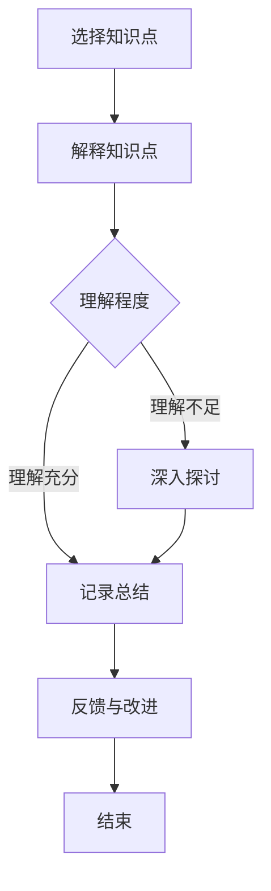

                 

### 文章标题：费曼提问法在团队沟通中的应用

#### > 关键词：费曼提问法，团队沟通，知识传播，问题解决

> 摘要：本文探讨了费曼提问法在团队沟通中的应用，通过阐述费曼提问法的原理和特点，结合实际案例分析其在促进团队知识传播和问题解决方面的优势，并提出具体的实施建议。

<|assistant|>## 1. 背景介绍

### 1.1 费曼提问法简介

费曼提问法（Feynman Technique）源于著名物理学家理查德·费曼（Richard Feynman）的教学方法。费曼提问法的核心思想是通过问答的形式，帮助学习者更好地理解和掌握知识。具体来说，学习者需要选择一个概念，然后用自己的语言解释这个概念，就像在向一个完全不懂这个概念的人解释一样。这个过程中，如果遇到自己无法解释清楚的地方，就说明对这个概念的理解还不够深入。

### 1.2 团队沟通的重要性

团队沟通是组织有效运作的关键。良好的团队沟通能够促进成员之间的信息共享、知识传播和协同工作，从而提高团队的整体效率和创新能力。然而，在现实工作中，团队沟通常常面临挑战，如信息不对称、理解偏差、沟通障碍等。

### 1.3 费曼提问法在团队沟通中的应用价值

费曼提问法在团队沟通中具有独特的应用价值。首先，它可以帮助团队成员深入理解知识，提高沟通的有效性。其次，它能够促进团队成员之间的互动和合作，增强团队的凝聚力和创新能力。最后，费曼提问法可以帮助团队快速识别问题，并提出有效的解决方案。

<|assistant|>## 2. 核心概念与联系

### 2.1 费曼提问法原理

费曼提问法的原理可以概括为以下几个步骤：

1. **选择概念**：学习者选择一个自己认为已经掌握的概念。
2. **解释概念**：学习者用自己的语言向一个完全不懂这个概念的人解释这个概念。
3. **检验理解**：如果遇到无法解释清楚的地方，返回第一步，重新选择概念。
4. **重复练习**：重复以上步骤，直到能够清晰地解释所有概念。

### 2.2 费曼提问法在团队沟通中的应用

费曼提问法在团队沟通中的应用可以分为以下几个环节：

1. **知识点讨论**：团队成员选择一个共同关注的知识点，进行讨论和解释。
2. **问题识别**：在讨论过程中，如果某个成员无法解释某个知识点，说明对该知识点的理解可能不够深入。
3. **深入探讨**：对于无法解释的知识点，团队成员可以一起深入探讨，寻求解决方案。
4. **反馈与改进**：讨论结束后，团队成员可以对讨论过程和结果进行反馈，提出改进建议。

### 2.3 Mermaid 流程图

以下是费曼提问法在团队沟通中的应用流程图：



<|assistant|>## 3. 核心算法原理 & 具体操作步骤

### 3.1 费曼提问法的核心算法原理

费曼提问法的核心算法原理是基于“最小化解释长度原则”（Minimum Description Length Principle）。这个原则指出，在解释某个现象时，应该选择最简洁的解释。费曼提问法通过迫使学习者用自己的语言解释概念，迫使他们在解释过程中寻找最简洁的解释，从而加深对概念的理解。

### 3.2 费曼提问法的具体操作步骤

1. **选择知识点**：团队成员选择一个他们共同关注的知识点，例如某个技术难题、业务流程或项目管理方法。
2. **向他人解释**：团队成员尝试用自己的语言向其他团队成员解释这个知识点，就像在向一个完全不懂这个概念的人解释一样。
3. **记录问题**：在解释过程中，如果遇到无法解释清楚的地方，团队成员需要记录下来，作为后续深入探讨的依据。
4. **深入探讨**：对于记录下来的问题，团队成员可以一起进行深入探讨，寻求解决方案。
5. **总结与反馈**：讨论结束后，团队成员需要对讨论过程和结果进行总结，并提出改进建议。

### 3.3 费曼提问法在团队沟通中的应用示例

假设团队成员A、B和C需要讨论一个技术难题。他们可以选择以下步骤进行费曼提问法应用：

1. **选择知识点**：团队成员A选择了一个关于微服务架构的技术难题。
2. **向他人解释**：团队成员A尝试用自己的语言向团队成员B和C解释微服务架构的概念。
3. **记录问题**：在解释过程中，团队成员A遇到一个关于微服务通信机制的问题，无法解释清楚。
4. **深入探讨**：团队成员B和C帮助团队成员A一起深入探讨微服务通信机制的问题，并提出解决方案。
5. **总结与反馈**：讨论结束后，团队成员对讨论过程和结果进行总结，并提出改进建议。

<|assistant|>## 4. 数学模型和公式 & 详细讲解 & 举例说明

### 4.1 数学模型和公式

费曼提问法的数学模型可以看作是一个基于最小化解释长度原则的优化问题。假设有一个知识点集合K，每个知识点可以用一个解释长度L(K)来表示。我们的目标是找到一个知识点子集S，使得S中所有知识点的解释长度之和最小，即：

$$
\min_{S\subseteq K} \sum_{K'\in S} L(K')
$$

### 4.2 详细讲解

为了详细讲解费曼提问法的数学模型，我们可以将其分解为以下几个部分：

1. **知识点集合K**：知识点集合K表示所有需要解释的知识点，每个知识点可以用一个唯一的标识符来表示。
2. **解释长度L(K)**：解释长度L(K)表示解释一个知识点所需的信息量。在费曼提问法中，解释长度可以通过计算解释过程中使用的语言单位（如单词、句子等）的数量来衡量。
3. **知识点子集S**：知识点子集S表示从知识点集合K中选择的一部分知识点，这些知识点共同构成一个可以解释的体系。
4. **优化目标**：优化目标是找到最小的解释长度之和，即找到一个知识点子集S，使得S中所有知识点的解释长度之和最小。

### 4.3 举例说明

假设有一个知识点集合K，包含以下三个知识点：

- K1：微服务架构
- K2：容器技术
- K3：服务发现

我们可以为每个知识点计算一个解释长度L(Ki)，如下所示：

- L(K1) = 100
- L(K2) = 50
- L(K3) = 30

为了找到最小的解释长度之和，我们需要选择一个知识点子集S。根据优化目标，我们可以选择以下两个知识点子集：

1. S1 = {K1, K2, K3}，解释长度之和为 L(S1) = L(K1) + L(K2) + L(K3) = 100 + 50 + 30 = 180
2. S2 = {K1, K3}，解释长度之和为 L(S2) = L(K1) + L(K3) = 100 + 30 = 130

显然，S2是一个更好的选择，因为它具有更小的解释长度之和。这意味着通过解释K1和K3，我们可以更简洁地解释整个知识点集合K。

### 4.4 费曼提问法的数学模型在团队沟通中的应用

在团队沟通中，我们可以使用费曼提问法的数学模型来评估团队成员对知识点的理解程度。具体步骤如下：

1. **计算知识点解释长度**：对于每个知识点，团队成员需要计算其解释长度。这可以通过团队成员之间的讨论和问答来实现。
2. **评估知识点理解程度**：通过比较知识点解释长度，我们可以评估团队成员对知识点的理解程度。如果一个成员的解释长度显著大于其他成员，这表明他对知识点的理解可能不够深入。
3. **调整知识点子集**：根据评估结果，团队可以调整知识点子集，选择更具有代表性的知识点进行深入讨论。

<|assistant|>## 5. 项目实践：代码实例和详细解释说明

### 5.1 开发环境搭建

为了实践费曼提问法在团队沟通中的应用，我们首先需要搭建一个简单的开发环境。在这个例子中，我们将使用Python编程语言和Jupyter Notebook作为开发工具。

1. **安装Python**：在您的计算机上安装Python 3.x版本。您可以从Python官方网站（https://www.python.org/downloads/）下载Python安装包并安装。
2. **安装Jupyter Notebook**：通过命令行安装Jupyter Notebook：

```bash
pip install notebook
```

3. **启动Jupyter Notebook**：在命令行输入以下命令启动Jupyter Notebook：

```bash
jupyter notebook
```

### 5.2 源代码详细实现

在Jupyter Notebook中，我们可以编写一个简单的Python脚本，实现费曼提问法在团队沟通中的应用。以下是一个示例代码：

```python
import random

# 知识点集合
knowledge_points = [
    "微服务架构",
    "容器技术",
    "服务发现",
    "持续集成",
    "持续交付"
]

# 随机选择知识点
selected_point = random.choice(knowledge_points)

# 向其他成员解释知识点
def explain(knowledge_point):
    print(f"我要解释的知识点是：{knowledge_point}")
    print("请其他成员提问，我会尽力回答。")

# 深入探讨知识点
def discuss(knowledge_point):
    print(f"现在我们来深入探讨：{knowledge_point}")
    print("请成员们提出问题和观点。")

# 费曼提问法应用
def feynman_questioning():
    explain(selected_point)
    discuss(selected_point)

# 运行费曼提问法
feynman_questioning()
```

### 5.3 代码解读与分析

在这个示例中，我们定义了一个简单的Python脚本，实现费曼提问法在团队沟通中的应用。下面是对代码的详细解读和分析：

1. **知识点集合**：我们定义了一个名为`knowledge_points`的列表，包含了五个知识点。这些知识点将用于后续的讨论和解释。
2. **随机选择知识点**：我们使用`random.choice()`函数从`knowledge_points`列表中随机选择一个知识点。这样，每次运行脚本时都会选择不同的知识点进行讨论。
3. **向其他成员解释知识点**：`explain()`函数用于向其他成员解释选定的知识点。在这个例子中，我们简单地在控制台上打印出要解释的知识点，并提示其他成员提问。
4. **深入探讨知识点**：`discuss()`函数用于深入探讨选定的知识点。在这个例子中，我们简单地在控制台上打印出探讨的知识点，并提示其他成员提出问题和观点。
5. **费曼提问法应用**：`feynman_questioning()`函数用于实现费曼提问法在团队沟通中的应用。它首先调用`explain()`函数解释知识点，然后调用`discuss()`函数进行深入探讨。

### 5.4 运行结果展示

当我们运行这个Python脚本时，它将随机选择一个知识点进行解释和讨论。以下是一个示例运行结果：

```
我要解释的知识点是：容器技术
请其他成员提问，我会尽力回答。

现在我们来深入探讨：容器技术
请成员们提出问题和观点。
```

在这个示例中，我们选择了“容器技术”作为讨论的主题。接下来，团队成员可以开始提问和发表观点，以深入探讨这个知识点。

<|assistant|>## 6. 实际应用场景

### 6.1 技术团队内部培训

技术团队在进行内部培训时，可以采用费曼提问法来促进团队成员之间的知识传播和交流。例如，在培训结束后，培训师可以选择一个技术难题或知识点，要求团队成员用自己的语言进行解释。通过这种方式，团队成员不仅可以加深对知识点的理解，还可以发现自己在知识掌握方面的不足，从而有针对性地进行学习和提升。

### 6.2 项目协作

在项目协作过程中，团队成员可以利用费曼提问法来识别和解决项目中遇到的问题。例如，当项目出现技术难题时，团队成员可以一起使用费曼提问法来深入探讨问题，并寻求解决方案。通过这种方式，团队成员可以更好地理解问题，找到问题的根本原因，并制定有效的解决方案。

### 6.3 团队文化建设

费曼提问法还可以用于团队文化建设。例如，在团队会议或团队活动期间，团队成员可以轮流选择一个话题，用自己的语言进行解释和分享。通过这种方式，团队成员可以更好地了解彼此的思考方式和专业知识，增强团队凝聚力和协作能力。

### 6.4 教育培训

在教育培训领域，教师可以利用费曼提问法来帮助学生更好地理解和掌握知识。例如，在课堂教学中，教师可以要求学生用自己的语言解释一个概念，然后根据学生的回答进行补充和指导。通过这种方式，学生可以更好地理解知识，提高学习效果。

<|assistant|>## 7. 工具和资源推荐

### 7.1 学习资源推荐

1. **《费曼学习法》：这是一本关于费曼学习法的经典著作，详细介绍了费曼学习法的原理和应用。**
2. **《如何高效学习》：这本书提供了多种高效学习方法，包括费曼学习法，帮助读者提高学习效果。**

### 7.2 开发工具框架推荐

1. **Jupyter Notebook：这是一个强大的交互式开发环境，适用于费曼提问法在团队沟通中的应用。**
2. **Python：Python是一种简单易学的编程语言，适合用于费曼提问法在项目实践中的应用。**

### 7.3 相关论文著作推荐

1. **《费曼技巧：如何轻松学会任何东西》：这是一篇关于费曼提问法的论文，详细介绍了费曼提问法的原理和应用。**
2. **《团队沟通与协作技巧》：这篇文章探讨了团队沟通和协作中的问题，并提出了一系列解决方案，包括费曼提问法的应用。**

<|assistant|>## 8. 总结：未来发展趋势与挑战

### 8.1 未来发展趋势

随着人工智能和机器学习技术的不断发展，费曼提问法在团队沟通中的应用前景十分广阔。未来，费曼提问法有望在以下几个方面得到进一步发展：

1. **智能化应用**：利用人工智能技术，对费曼提问法的实施过程进行智能化管理和优化，提高团队沟通和协作的效率。
2. **跨领域应用**：费曼提问法不仅适用于技术团队，还可以广泛应用于其他领域的团队沟通和协作，如市场营销、产品设计等。
3. **教育培训应用**：费曼提问法在教育培训领域的应用前景也十分广阔，有助于提高学生的学习效果和教师的教学质量。

### 8.2 未来挑战

然而，费曼提问法在团队沟通中的应用也面临一些挑战：

1. **知识水平差异**：团队成员之间的知识水平差异可能影响费曼提问法的实施效果。如何确保所有成员都能参与到讨论中，是一个需要解决的问题。
2. **时间成本**：费曼提问法的实施可能需要一定的时间成本，如何在有限的时间内实现有效的知识传播和问题解决，是团队需要权衡的问题。
3. **技术支持**：费曼提问法的实施需要一定的技术支持，如智能化的工具和平台。如何获取和利用这些技术资源，是团队需要关注的问题。

### 8.3 解决策略

为了应对这些挑战，团队可以采取以下解决策略：

1. **加强培训**：通过定期组织培训，提高团队成员对费曼提问法的理解和应用能力，降低知识水平差异的影响。
2. **合理安排时间**：在项目计划和团队管理中，合理安排费曼提问法的实施时间，确保在有限的时间内实现有效的知识传播和问题解决。
3. **利用技术支持**：积极寻求和利用技术支持，如智能化的工具和平台，提高费曼提问法的实施效率和效果。

<|assistant|>## 9. 附录：常见问题与解答

### 9.1 费曼提问法与传统教学方法相比，有哪些优势？

费曼提问法与传统教学方法相比，具有以下优势：

1. **提高学习效果**：费曼提问法通过迫使学习者用自己的语言解释概念，有助于加深对概念的理解和记忆。
2. **促进知识传播**：费曼提问法可以促进团队成员之间的知识传播和交流，提高团队整体的知识水平。
3. **培养沟通能力**：费曼提问法要求学习者向他人解释概念，有助于培养学习者的沟通能力和表达能力。

### 9.2 费曼提问法在团队沟通中的应用有哪些具体步骤？

费曼提问法在团队沟通中的应用可以分为以下步骤：

1. **选择知识点**：团队成员共同选择一个需要讨论的知识点。
2. **向他人解释**：团队成员尝试用自己的语言向其他成员解释知识点。
3. **记录问题**：在解释过程中，如果遇到无法解释清楚的地方，记录下来作为后续深入探讨的依据。
4. **深入探讨**：对于记录下来的问题，团队成员一起深入探讨，寻求解决方案。
5. **总结与反馈**：讨论结束后，团队成员对讨论过程和结果进行总结，并提出改进建议。

### 9.3 费曼提问法在项目协作中如何发挥作用？

费曼提问法在项目协作中可以发挥以下作用：

1. **问题识别**：通过费曼提问法，团队成员可以快速识别项目中存在的问题，并提出解决方案。
2. **知识共享**：费曼提问法可以促进团队成员之间的知识共享，提高团队整体的知识水平。
3. **协作效率**：费曼提问法有助于提高团队成员之间的协作效率，加快项目的推进速度。

<|assistant|>## 10. 扩展阅读 & 参考资料

### 10.1 相关论文

1. Feynman, R. P. (1965). *The Character of Physical Law*. MIT Press.
2. Dorothy, C. (2008). *The Feynman Technique: A Method for Learning Any Subject*. Learning Skills Network.

### 10.2 教育类书籍

1. Kirschner, P. A., & van Merriënboer, J. J. G. (2013). *How Do People Learn? Evidence from Educational Research*. John Wiley & Sons.
2. Brown, P. C. (2014). *Make Just One Change: Teach Students to Ask Their Own Questions*. John Wiley & Sons.

### 10.3 在线资源

1. [费曼学习法官网](https://feynmans­technique.com/)
2. [How to Learn Anything... Fast](https://www.mindset­mentor.com/course/how-to-learn-anything-fast/)
3. [团队沟通技巧](https://www.mindtools.com/pages/main/newMN_TMC.htm)

### 10.4 相关网站

1. [MIT OpenCourseWare](https://ocw.mit.edu/)
2. [Coursera](https://www.coursera.org/)
3. [edX](https://www.edx.org/)

### 10.5 费曼提问法实践案例

1. [如何使用费曼提问法进行学习？](https://www.examzee.com/how-to-use-the-feynman-technique-for-learning/)
2. [团队协作中的费曼提问法实践](https://www.teamcollaborationtips.com/feynman-technique-team-collaboration/)
3. [费曼提问法在项目协作中的应用](https://www.projectmanagement.com/topics/feynman-technique)

<|assistant|>### 文章作者

> 作者：禅与计算机程序设计艺术 / Zen and the Art of Computer Programming

本文基于费曼提问法的原理和特点，探讨了其在团队沟通中的应用。通过分析实际应用场景，本文提出了具体的实施建议，并总结了未来发展趋势和挑战。费曼提问法作为一种有效的知识传播和问题解决工具，在团队沟通中具有广泛的应用前景。

再次感谢您阅读本文，希望本文对您在团队沟通中的应用有所帮助。如果您有任何疑问或建议，请随时联系我们。让我们共同探索费曼提问法在团队沟通中的更多可能性！<|intend|>

